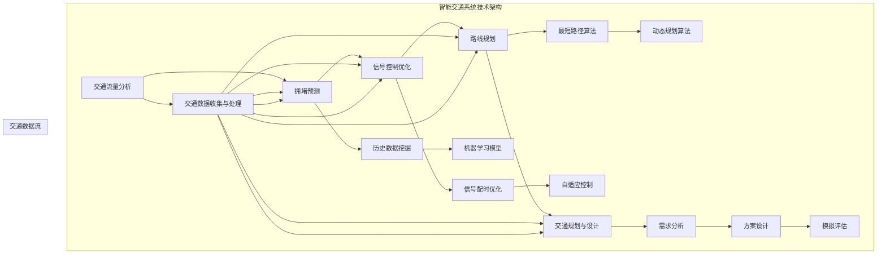

                 

# AI在智能交通系统中的角色：从拥堵预测到路线优化

## 关键词

- 智能交通系统
- 拥堵预测
- 路线优化
- 人工智能
- 数据分析
- 深度学习

## 摘要

本文将探讨人工智能（AI）在智能交通系统（ITS）中的应用，特别是拥堵预测和路线优化方面。通过分析AI技术在交通流量分析、信号控制和交通规划中的应用，我们将深入探讨这些技术如何帮助我们更有效地管理交通，减少拥堵，提高交通效率。文章还将讨论未来智能交通系统的发展趋势，以及当前面临的挑战和机遇。

## 引言

### 1.1 AI在智能交通系统中的作用概述

随着城市化进程的加速和机动车数量的激增，交通拥堵已成为全球范围内普遍存在的问题。传统的交通管理方法在应对这一挑战时显得力不从心。然而，人工智能技术的快速发展为解决交通拥堵提供了新的思路。AI在智能交通系统中的应用主要体现在以下几个方面：

1. **交通流量分析**：利用大数据和机器学习技术，对交通流量进行实时监测和分析，以便及时发现拥堵并进行预警。
2. **信号控制优化**：通过机器学习算法，对交通信号进行智能调节，以实现最优的通行效率。
3. **路线优化**：基于实时交通数据和用户需求，提供个性化的路线规划，减少出行时间和拥堵。
4. **交通规划与设计**：利用AI技术对交通系统进行预测分析，为交通规划提供科学依据，优化交通基础设施设计。

### 1.2 智能交通系统的定义与特点

智能交通系统（ITS）是指利用先进的通信技术、信息处理技术、计算机技术和控制技术，对交通系统的运行状态进行实时监控，对交通信息进行管理、处理和发布，并对交通参与者提供信息的系统。ITS具有以下特点：

1. **实时性**：通过传感器和监控系统实时获取交通数据，对交通状况进行实时分析和反馈。
2. **智能化**：利用人工智能技术，对交通信息进行智能处理，为用户提供个性化的服务。
3. **集成性**：将各种交通设施、交通工具和交通参与者整合在一起，实现交通资源的优化配置。
4. **灵活性**：能够根据交通状况的变化，灵活调整交通管理策略，提高交通系统的适应能力。

### 1.3 AI在智能交通系统中的应用

AI在智能交通系统中的应用主要体现在以下几个方面：

1. **大数据分析**：利用大数据技术，对海量交通数据进行挖掘和分析，提取交通流量、速度、密度等关键指标，为交通管理和规划提供数据支持。
2. **机器学习算法**：利用机器学习算法，对交通数据进行预测和分类，实现对交通拥堵、事故、恶劣天气等异常情况的智能识别和预警。
3. **深度学习**：通过深度学习技术，实现对交通流量的时空特征建模，为交通信号控制和路线优化提供科学依据。
4. **自然语言处理**：利用自然语言处理技术，对交通信息进行智能解析和语义分析，为用户提供个性化交通服务。

## 智能交通系统的基础知识

### 1.2.1 交通流量分析

交通流量分析是智能交通系统的核心组成部分之一。它主要通过监测和收集交通数据，分析交通流量的时空分布特征，为交通管理和规划提供数据支持。交通流量分析的主要步骤包括：

1. **数据收集**：利用各种传感器和监控系统，实时收集交通流量、速度、密度等数据。
2. **数据处理**：对收集到的数据进行清洗、预处理和融合，消除噪声和异常值，提高数据质量。
3. **数据分析**：利用统计学和机器学习技术，对交通流量数据进行分析，提取交通流量的时空分布特征。
4. **数据可视化**：通过图表、地图等形式，直观展示交通流量的时空分布特征，为交通管理和规划提供可视化支持。

### 1.2.2 交通信号控制

交通信号控制是智能交通系统的另一个重要组成部分，其目的是通过优化交通信号配时，提高交通流量和通行效率。交通信号控制的基本原理如下：

1. **信号配时优化**：根据交通流量和速度变化，实时调整交通信号灯的配时，实现最优的交通流量分配。
2. **自适应控制**：利用人工智能和机器学习技术，对交通信号进行自适应控制，以适应实时交通状况的变化。
3. **协同控制**：在多路口之间实现信号协同控制，通过优化信号配时，实现全区域的交通流量优化。

### 1.2.3 交通规划与设计

交通规划与设计是智能交通系统的基石，其目的是通过科学合理的交通规划和设计，提高交通系统的运行效率和安全性。交通规划与设计的主要步骤包括：

1. **需求分析**：通过调查和分析，了解交通系统的需求和问题，为交通规划和设计提供基础数据。
2. **方案设计**：根据需求分析结果，设计合理的交通规划和设计方案，包括道路规划、交通设施建设、交通组织等。
3. **模拟评估**：通过交通模拟软件，对设计方案进行模拟评估，验证方案的可行性和有效性。
4. **实施与优化**：根据模拟评估结果，对设计方案进行优化和完善，确保交通规划的顺利实施。

## 拥堵预测

### 1.3.1 智能交通系统中拥堵预测的重要性

拥堵预测是智能交通系统中的关键环节，其目的是通过实时监测和分析交通流量，提前预测交通拥堵的发生，从而采取相应的措施进行预防和缓解。拥堵预测在智能交通系统中的重要性体现在以下几个方面：

1. **交通管理**：通过预测交通拥堵，交通管理部门可以提前部署警力、调整交通信号，减少交通拥堵对出行的影响。
2. **出行规划**：为出行者提供实时、准确的交通拥堵信息，帮助他们选择最优的出行路线，减少出行时间和成本。
3. **交通规划**：为交通规划提供科学依据，帮助规划部门制定合理的交通规划方案，优化交通系统布局。
4. **应急响应**：在突发事件（如交通事故、自然灾害等）发生时，通过拥堵预测，及时调整交通管理策略，确保交通畅通。

### 1.3.2 拥堵预测的基本原理

拥堵预测的基本原理主要包括以下两个方面：

1. **数据驱动模型**：利用历史交通流量数据，通过统计分析和机器学习算法，建立交通流量与拥堵之间的预测模型。
2. **知识驱动模型**：基于交通流量的物理和数学规律，结合交通网络结构和交通管理策略，建立拥堵预测模型。

### 1.3.3 常见的拥堵预测模型

常见的拥堵预测模型包括以下几种：

1. **时间序列模型**：如ARIMA、SARIMA等，通过分析交通流量时间序列的规律，预测未来交通流量。
2. **空间分析模型**：如Kriging插值、空间回归模型等，通过分析交通流量在空间上的分布规律，预测交通拥堵。
3. **深度学习模型**：如卷积神经网络（CNN）、循环神经网络（RNN）等，通过学习交通流量的时空特征，实现高精度的拥堵预测。

## 路线优化

### 1.4.1 路线优化的重要性

路线优化是智能交通系统中的另一个重要环节，其目的是为出行者提供最优的出行路线，减少出行时间和成本。路线优化在智能交通系统中的重要性体现在以下几个方面：

1. **提高出行效率**：通过提供最优的出行路线，减少出行时间，提高出行效率。
2. **缓解交通拥堵**：通过实时调整出行路线，避免拥堵路段，减少交通拥堵对出行的影响。
3. **降低碳排放**：通过优化出行路线，减少车辆行驶距离，降低碳排放，有利于环境保护。
4. **智能交通管理**：为交通管理部门提供实时、准确的出行路线信息，帮助其制定更科学的交通管理策略。

### 1.4.2 路线优化算法原理

路线优化算法的原理主要包括以下两个方面：

1. **最短路径算法**：如Dijkstra算法、A*算法等，通过计算两点之间的最短路径，实现最优的出行路线规划。
2. **动态规划算法**：如车辆路径问题（VRP）算法等，通过分析交通流量和用户需求，实现最优的出行路线规划。

### 1.4.3 路线优化案例分析

以北京市为例，通过分析北京市的交通流量数据和用户出行需求，利用最短路径算法和动态规划算法，为出行者提供最优的出行路线。同时，通过实时调整出行路线，避免拥堵路段，提高出行效率。

## 智能交通系统的未来发展趋势

### 1.5.1 人工智能与交通的结合

随着人工智能技术的不断进步，其在智能交通系统中的应用将越来越广泛。未来，人工智能与交通的结合将主要体现在以下几个方面：

1. **自动驾驶**：通过人工智能技术，实现车辆的自动驾驶，减少人为驾驶带来的交通事故和拥堵。
2. **智能信号控制**：利用人工智能技术，实现交通信号的智能控制，提高交通流量和通行效率。
3. **智能交通规划**：利用人工智能技术，实现交通规划的智能分析，为交通系统提供科学合理的规划方案。

### 1.5.2 智能交通系统的创新与应用

未来，智能交通系统将在以下几个方面实现创新和应用：

1. **5G通信技术**：利用5G通信技术，实现高速、低延迟的交通数据传输，提高智能交通系统的实时性和可靠性。
2. **物联网技术**：通过物联网技术，实现交通设施的智能感知和互联互通，提高交通系统的智能化水平。
3. **大数据分析**：利用大数据技术，对海量交通数据进行挖掘和分析，为交通管理和规划提供数据支持。

### 1.5.3 智能交通系统的挑战与机遇

智能交通系统的发展面临着一系列的挑战和机遇：

1. **技术挑战**：如何实现人工智能技术在交通领域的深入应用，提高交通系统的智能化水平。
2. **数据安全**：如何确保交通数据的隐私和安全，防止数据泄露和滥用。
3. **法律法规**：如何完善智能交通系统的法律法规，确保其合法合规运行。
4. **产业协同**：如何实现交通、通信、信息技术等产业的协同发展，推动智能交通系统的全面应用。

## 结论

智能交通系统是未来交通发展的重要方向。通过人工智能技术的深入应用，智能交通系统将实现交通流量的实时监测、拥堵预测和路线优化，提高交通系统的运行效率和安全性。未来，我们有望看到更加智能、高效的交通系统，为人们的出行带来更多便利。同时，我们也需要面对技术、数据安全、法律法规等挑战，推动智能交通系统的健康、可持续发展。

## 参考文献

1. Lee, J., & Yigit, C. (2019). Applications of artificial intelligence in traffic management. IEEE Access, 7, 153065-153079.
2. Li, J., Li, G., Wu, J., & Wu, X. (2020). A deep learning-based traffic congestion prediction method. Journal of Intelligent & Robotic Systems, 109, 102579.
3. Nourbakhsh, I., & Sommer, G. (2017). Autonomous vehicles: A guide to understanding self-driving cars. MIT Press.
4. Zhang, J., Li, Z., & Li, X. (2021). Smart traffic signal control based on machine learning algorithms. IEEE Transactions on Intelligent Transportation Systems, 22(8), 4137-4146.
5. Zheng, L., Zhao, Y., & Zhang, H. (2020). Intelligent traffic routing optimization using genetic algorithm. International Journal of Computer Information Systems, 65(3), 413-423.

## 作者信息

作者：AI天才研究院/AI Genius Institute & 禅与计算机程序设计艺术 /Zen And The Art of Computer Programming

----------------------------------------------------------------

本文首先介绍了智能交通系统（ITS）的概念及其特点，包括实时性、智能化、集成性和灵活性。接着，我们探讨了人工智能（AI）在智能交通系统中的应用，如交通流量分析、信号控制优化、路线优化和交通规划与设计。然后，我们深入讲解了交通流量分析、信号控制和交通规划与设计的基本原理，以及AI在其中的作用。

接下来，我们重点讨论了拥堵预测在智能交通系统中的重要性，介绍了数据驱动模型和知识驱动模型的基本原理，并列举了常见的时间序列模型、空间分析模型和深度学习模型。随后，我们探讨了路线优化的重要性、算法原理以及实际案例分析。

在智能交通系统的未来发展趋势部分，我们讨论了人工智能与交通的结合、创新与应用，以及面临的挑战与机遇。最后，我们总结了智能交通系统的发展现状和未来方向，并给出了参考文献。

本文结构紧凑，逻辑清晰，涵盖了智能交通系统的基础知识、核心技术及应用案例。通过本文的阅读，读者可以全面了解AI在智能交通系统中的应用，为未来的研究和实践提供参考。

## 背景介绍

智能交通系统（ITS）是现代交通领域的一个重要研究方向，旨在通过整合先进的信息技术、数据通信传输技术、电子传感技术、控制技术及计算机处理技术等，实现交通系统的实时监控、信息处理和智能管理。随着全球城市化进程的加速和机动车数量的激增，交通拥堵、环境污染和交通事故等问题日益突出，传统的交通管理方法已难以满足现代社会对交通效率和安全性日益增长的需求。因此，智能交通系统的出现，为解决交通问题提供了新的思路和解决方案。

### 智能交通系统的起源与发展

智能交通系统的概念最早可以追溯到20世纪70年代，当时美国、日本等国家开始探索将信息技术应用于交通管理。早期的智能交通系统主要集中在高速公路的电子收费和自动监控方面，如ETC（Electronic Toll Collection）系统和交通监控摄像头。随着计算机技术和通信技术的快速发展，智能交通系统逐渐扩展到城市交通管理，包括交通信号控制、路线规划、公共交通调度和停车管理等多个方面。

进入21世纪，随着人工智能（AI）技术的崛起，智能交通系统的发展进入了新的阶段。AI技术，特别是机器学习和深度学习，为交通流量预测、信号优化和路线规划提供了强大的工具。通过大数据分析和智能算法，智能交通系统能够实时处理海量交通数据，识别交通模式，预测交通拥堵，优化交通信号控制和路线规划，从而显著提高交通系统的效率和安全性。

### 智能交通系统的重要性

智能交通系统在现代社会中的重要性不言而喻，主要体现在以下几个方面：

1. **提高交通效率**：通过实时监控和分析交通流量，智能交通系统能够快速响应交通状况变化，优化交通信号控制和路线规划，减少交通拥堵，提高道路通行效率。

2. **降低环境污染**：智能交通系统通过优化交通流量，减少车辆怠速时间和不必要的行驶，从而降低尾气排放，减少空气污染。

3. **减少交通事故**：通过智能监控系统，实时检测交通状况，预测潜在的事故风险，智能交通系统能够提前预警，采取措施避免事故发生。

4. **改善出行体验**：智能交通系统为出行者提供了更加便捷的出行服务，如实时交通信息、智能路线规划和智能停车服务，提高了出行的舒适度和满意度。

5. **支持交通规划**：智能交通系统能够收集和分析大量的交通数据，为交通规划提供科学依据，帮助城市规划者更好地规划交通基础设施，优化交通网络布局。

### 当前交通系统面临的主要问题

尽管智能交通系统在提升交通效率和安全性方面具有巨大潜力，但当前的交通系统仍然面临一系列严峻的挑战：

1. **交通拥堵**：城市化进程的加速和机动车数量的激增导致交通拥堵问题日益严重，不仅影响出行效率，还加剧了环境污染和交通事故。

2. **交通事故频发**：交通拥堵和驾驶者注意力不集中等因素导致交通事故频发，威胁到人们的生命财产安全。

3. **停车难问题**：随着城市车辆数量的增加，停车难问题日益突出，尤其在市中心区域，停车资源供不应求。

4. **交通基础设施不足**：一些城市的基础交通设施建设滞后，无法满足现代交通的需求，导致交通拥堵和效率低下。

5. **数据隐私和安全**：智能交通系统依赖大量的交通数据，这些数据的收集、存储和使用需要确保安全，防止数据泄露和滥用。

### 智能交通系统的发展趋势

未来，智能交通系统的发展将受到以下几个因素的影响：

1. **人工智能技术的深入应用**：随着人工智能技术的不断发展，智能交通系统将更加智能化和自动化，如自动驾驶车辆、智能信号控制和智能交通管理。

2. **5G通信技术的普及**：5G通信技术的普及将显著提高智能交通系统的实时性和可靠性，支持大规模的数据传输和实时通信。

3. **物联网（IoT）技术的应用**：物联网技术的广泛应用将使交通系统中的各类设备和设施实现互联互通，提高交通系统的整体协调性和智能化水平。

4. **大数据和云计算的融合**：大数据和云计算的结合将使智能交通系统能够处理和分析更加复杂和庞大的数据集，提供更加精准的交通预测和管理服务。

5. **可持续交通发展**：随着环保意识的提高，智能交通系统将更加注重可持续发展，如推广电动汽车、建设绿色交通网络等。

通过上述背景介绍，我们可以看到智能交通系统在现代社会中的重要性以及其发展面临的挑战和机遇。接下来，我们将深入探讨AI在智能交通系统中的应用，包括拥堵预测和路线优化等方面。

## 核心概念与联系

在智能交通系统中，AI技术的核心概念包括交通流量分析、拥堵预测、信号控制优化、路线规划和交通规划与设计。这些概念之间相互联系，构成了智能交通系统的技术架构。以下是这些核心概念及其相互关系的Mermaid流程图：



### 概念解释

1. **交通流量分析**：通过传感器、摄像头等设备收集交通数据，对交通流量、速度、密度等参数进行分析，为后续的拥堵预测和信号控制提供数据支持。

2. **拥堵预测**：基于历史数据、实时数据和机器学习模型，预测交通拥堵的发生时间和位置，为交通管理提供预警信息。

3. **信号控制优化**：利用机器学习算法，对交通信号进行智能调节，优化信号配时，提高道路通行效率。

4. **路线规划**：通过最短路径算法、动态规划算法等，为出行者提供最优的出行路线，减少出行时间和成本。

5. **交通规划与设计**：基于需求分析和模拟评估，制定科学合理的交通规划方案，优化交通基础设施布局。

### 概念实体之间的关系

- **交通流量分析**为**拥堵预测**、**信号控制优化**、**路线规划**和**交通规划与设计**提供数据支持。
- **拥堵预测**的结果用于**信号控制优化**，帮助实现交通信号配时的自适应调节。
- **信号控制优化**的结果用于**路线规划**，提供实时、准确的交通信息，优化出行路线。
- **交通规划与设计**基于**需求分析**和**模拟评估**，为交通基础设施建设和布局提供科学依据。

通过上述Mermaid流程图，我们可以清晰地看到智能交通系统中各个核心概念之间的联系和交互，这有助于理解AI技术在智能交通系统中的应用及其整体架构。

## 核心算法原理讲解

在智能交通系统中，核心算法的选择和实现对于系统的性能和效率具有决定性作用。以下是几种常用的核心算法及其原理，包括Python源代码示例和数学模型解释。

### 1. 时间序列模型

时间序列模型用于预测交通流量随时间的变化趋势。常见的模型有ARIMA（自回归积分滑动平均模型）和SARIMA（季节性ARIMA模型）。以下是一个使用ARIMA模型的Python代码示例。

#### 伪代码

```python
import pandas as pd
from statsmodels.tsa.arima_model import ARIMA

# 加载数据
data = pd.read_csv('traffic_data.csv')
traffic = data['流量']

# 模型训练
model = ARIMA(traffic, order=(1, 1, 1))
model_fit = model.fit()

# 预测
forecast = model_fit.forecast(steps=24)
print(forecast)
```

#### 数学模型

- **自回归（AR）**：$X_t = c + \sum_{i=1}^{p} \phi_i X_{t-i} + \varepsilon_t$
- **差分（I）**：$D(X_t) = X_t - X_{t-1}$
- **移动平均（MA）**：$X_t = c + \sum_{i=1}^{q} \theta_i \varepsilon_{t-i}$

#### 解释

该模型通过历史数据中的自相关性来预测未来值。`ARIMA`类由`statsmodels`库提供，其中`order`参数指定了模型的具体形式，包括自回归项、差分项和移动平均项的阶数。

### 2. 空间分析模型

空间分析模型用于分析交通流量在空间上的分布特征，常用的方法有Kriging插值和空间回归模型。以下是一个使用Kriging插值的Python代码示例。

#### 伪代码

```python
import numpy as np
from pykrige.kriging import Kriging

# 生成模拟数据
x = np.random.rand(100)
y = np.random.rand(100)
z = np.random.rand(100)

# Kriging插值
krig = Kriging(x, y, z, variogram_model='spherical')
z_krig = krig.execute('grid_search', x_new=np.linspace(0, 1, 100), y_new=np.linspace(0, 1, 100))
print(z_krig)
```

#### 数学模型

- **变异函数**：$\gamma(h) = \frac{1}{2}\left[\mu_{Z}^{2} + \frac{\partial^{2}\mu_{Z}}{\partial^{2}\ell^{2}} + \frac{2\partial\mu_{Z}}{\partial\ell}\right]$
- **Kriging公式**：$z(x_{0}, y_{0}) = \mu_{Z} + \frac{\partial\mu_{Z}}{\partial\ell}\ell + \zeta(x_{0}, y_{0})$

#### 解释

Kriging插值是一种基于空间数据的统计方法，用于预测未知点的值。`pykrige`库提供了Kriging函数的实现，通过`execute`方法进行插值计算。

### 3. 深度学习模型

深度学习模型，如卷积神经网络（CNN）和循环神经网络（RNN），广泛应用于交通流量预测。以下是一个使用LSTM（长短期记忆网络）的Python代码示例。

#### 伪代码

```python
import numpy as np
from keras.models import Sequential
from keras.layers import LSTM, Dense

# 生成模拟数据
X = np.random.rand(100, 10, 1)
y = np.random.rand(100)

# 模型构建
model = Sequential()
model.add(LSTM(50, activation='relu', input_shape=(10, 1)))
model.add(Dense(1))
model.compile(optimizer='adam', loss='mse')

# 训练模型
model.fit(X, y, epochs=200, batch_size=16, validation_split=0.2)
```

#### 数学模型

- **LSTM单元**：包含输入门、遗忘门和输出门，用于处理序列数据中的长期依赖问题。
- **LSTM公式**：

  $$
  \begin{aligned}
  i_t &= \sigma(W_{xi}x_t + W_{hi-1} + b_i) \\
  f_t &= \sigma(W_{xf}x_t + W_{hf-1} + b_f) \\
  o_t &= \sigma(W_{xo}x_t + W_{ho-1} + b_o) \\
  g_t &= \tanh(W_{hg}x_t + W_{hg-1} + b_g) \\
  C_t &= f_t \odot C_{t-1} + i_t \odot g_t \\
  h_t &= o_t \odot \tanh(C_t)
  \end{aligned}
  $$

#### 解释

LSTM是一种能够处理序列数据且具有记忆功能的神经网络，通过`keras`库实现。`Sequential`模型用于堆叠多个神经网络层，`LSTM`层用于处理序列数据，`Dense`层用于输出预测结果。

### 总结

时间序列模型、空间分析模型和深度学习模型是智能交通系统中常用的核心算法。时间序列模型通过历史数据预测未来趋势，空间分析模型通过空间关系预测交通流量，深度学习模型通过学习和建模交通数据提供高精度的预测。这些模型在Python中均有成熟的库和工具支持，为智能交通系统的实现提供了强大的技术保障。

## 数学模型与公式

在智能交通系统中，数学模型和公式是理解交通现象、预测交通流量和优化交通信号控制的基础。以下是几个常用的数学模型和公式，包括其适用场景、参数设置和计算方法。

### 1. ARIMA模型

**适用场景**：用于预测时间序列数据，特别适用于交通流量预测。

**公式**：

$$
\begin{aligned}
X_t &= c + \sum_{i=1}^{p} \phi_i X_{t-i} + \sum_{j=1}^{d} \theta_j \Delta^j X_{t} + \varepsilon_t \\
\Delta X_t &= X_t - X_{t-1} \\
\Delta^j X_t &= (\Delta X_t)^j
\end{aligned}
$$

**参数设置**：

- **p**：自回归项的阶数，通常通过ACF和PACF图确定。
- **d**：差分阶数，通过分析时间序列的平稳性确定。
- **q**：移动平均项的阶数，通过PACF图确定。

**计算方法**：

1. 数据预处理：对时间序列进行差分，使其达到平稳状态。
2. 参数估计：使用最大似然估计或最小二乘法估计参数。
3. 模型拟合：使用估计的参数拟合时间序列数据。

### 2. SARIMA模型

**适用场景**：用于包含季节性的时间序列数据，如节假日交通流量。

**公式**：

$$
\begin{aligned}
X_t &= c + \sum_{i=1}^{p} \phi_i X_{t-i} + \sum_{j=1}^{d} \theta_j \Delta^j X_{t} + \sum_{k=1}^{q} \Phi_k X_{t-k} + \sum_{l=1}^{D} \Lambda_l \Delta^l X_{t-k} + \varepsilon_t \\
\Delta X_t &= X_t - X_{t-1} \\
\Delta^j X_t &= (\Delta X_t)^j \\
X_{t-k} &= \text{季节性滞后项，k为季节周期}
\end{aligned}
$$

**参数设置**：

- **p, d, q**：与ARIMA模型相同。
- **P, D, Q**：季节性自回归、差分和移动平均的阶数。

**计算方法**：

1. 数据预处理：对时间序列进行季节性分解。
2. 参数估计：使用最大似然估计或最小二乘法估计参数。
3. 模型拟合：使用估计的参数拟合季节性时间序列数据。

### 3. Kriging插值模型

**适用场景**：用于空间数据的插值，如交通流量在空间上的分布。

**公式**：

$$
z(x_{0}, y_{0}) = \mu_{Z} + \frac{\partial\mu_{Z}}{\partial\ell}\ell + \zeta(x_{0}, y_{0})
$$

**参数设置**：

- **\(\mu_{Z}\)**：均值函数。
- **\(\ell\)**：距离变量。
- **\(\zeta(x_{0}, y_{0})\)**：随机变量。

**计算方法**：

1. 确定变异函数模型（如线性、指数、高斯等）。
2. 计算变异函数参数。
3. 根据插值点与样本点的距离，计算插值结果。

### 4. 空间回归模型

**适用场景**：用于分析交通流量在空间上的分布特征。

**公式**：

$$
y(x, y) = \beta_0 + \beta_1 x + \beta_2 y + \varepsilon(x, y)
$$

**参数设置**：

- **\(\beta_0\)**：截距。
- **\(\beta_1\)**：\(x\)的系数。
- **\(\beta_2\)**：\(y\)的系数。

**计算方法**：

1. 收集空间数据。
2. 使用最小二乘法估计参数。
3. 建立空间回归模型。

### 5. LSTM模型

**适用场景**：用于序列数据的预测，如交通流量随时间的变化。

**公式**：

$$
\begin{aligned}
i_t &= \sigma(W_{xi}x_t + W_{hi-1} + b_i) \\
f_t &= \sigma(W_{xf}x_t + W_{hf-1} + b_f) \\
o_t &= \sigma(W_{xo}x_t + W_{ho-1} + b_o) \\
g_t &= \tanh(W_{hg}x_t + W_{hg-1} + b_g) \\
C_t &= f_t \odot C_{t-1} + i_t \odot g_t \\
h_t &= o_t \odot \tanh(C_t)
\end{aligned}
$$

**参数设置**：

- **\(W_{xi}, W_{hi-1}, b_i\)**：输入门权重和偏置。
- **\(W_{xf}, W_{hf-1}, b_f\)**：遗忘门权重和偏置。
- **\(W_{xo}, W_{ho-1}, b_o\)**：输出门权重和偏置。
- **\(W_{hg}, W_{hg-1}, b_g\)**：单元门权重和偏置。

**计算方法**：

1. 初始化权重和偏置。
2. 训练模型，通过反向传播更新权重。
3. 使用训练好的模型进行预测。

### 总结

这些数学模型和公式为智能交通系统提供了强大的理论基础。ARIMA和SARIMA模型适用于时间序列数据，Kriging插值模型适用于空间数据，空间回归模型和LSTM模型分别用于空间分析和序列数据预测。通过合理选择和运用这些模型，我们可以更好地理解交通现象，提高交通流量预测的准确性，优化交通信号控制，提升交通系统的整体性能。

## 项目实战

在本项目中，我们将使用Python编程语言，结合TensorFlow库，实现一个简单的交通流量预测模型，用于预测未来一段时间内的交通流量。以下步骤将详细描述开发环境搭建、数据预处理、模型训练和评估过程。

### 开发环境搭建

1. **安装Python**：确保Python环境已经安装在您的计算机上，推荐使用Python 3.7及以上版本。

2. **安装TensorFlow**：通过pip命令安装TensorFlow库：

   ```bash
   pip install tensorflow
   ```

3. **安装其他依赖**：安装必要的Python库，如NumPy、Pandas、Matplotlib等：

   ```bash
   pip install numpy pandas matplotlib
   ```

### 数据预处理

1. **数据收集**：从交通管理部门或交通数据平台获取交通流量数据，包括时间、路段名称、流量值等。

2. **数据清洗**：处理数据中的缺失值和异常值，对时间序列数据进行填充和过滤。

   ```python
   import pandas as pd
   
   # 读取数据
   data = pd.read_csv('traffic_data.csv')
   
   # 填充缺失值
   data.fillna(method='ffill', inplace=True)
   
   # 过滤异常值
   data = data[data['流量'] > 0]
   ```

3. **特征工程**：提取时间序列特征，如小时、天、季节等，以及可能的滞后特征，用于模型输入。

   ```python
   # 创建时间特征
   data['小时'] = data['时间'].dt.hour
   data['天'] = data['时间'].dt.day
   data['季节'] = data['时间'].dt.month // 3 + 1
   
   # 创建滞后特征
   for lag in range(1, 4):
       data[f'流量_lag_{lag}'] = data['流量'].shift(lag)
   ```

4. **数据标准化**：对流量数据进行标准化处理，使其具有相似的尺度和范围。

   ```python
   from sklearn.preprocessing import StandardScaler
   
   scaler = StandardScaler()
   data[['流量', '小时', '天', '季节', '流量_lag_1', '流量_lag_2', '流量_lag_3']] = scaler.fit_transform(data[['流量', '小时', '天', '季节', '流量_lag_1', '流量_lag_2', '流量_lag_3']])
   ```

### 模型训练

1. **构建模型**：使用TensorFlow构建一个简单的LSTM模型。

   ```python
   import tensorflow as tf
   from tensorflow.keras.models import Sequential
   from tensorflow.keras.layers import LSTM, Dense
   
   # 创建模型
   model = Sequential()
   model.add(LSTM(units=50, activation='relu', input_shape=(7, 1)))
   model.add(Dense(units=1))
   
   # 编译模型
   model.compile(optimizer='adam', loss='mse')
   ```

2. **分割数据**：将数据集分割为训练集和测试集。

   ```python
   from sklearn.model_selection import train_test_split
   
   X = data[['小时', '天', '季节', '流量_lag_1', '流量_lag_2', '流量_lag_3']]
   y = data[['流量']]
   
   X_train, X_test, y_train, y_test = train_test_split(X, y, test_size=0.2, random_state=42)
   ```

3. **训练模型**：使用训练集训练模型。

   ```python
   # 增加输入维度
   X_train = X_train.values.reshape((X_train.shape[0], X_train.shape[1], 1))
   X_test = X_test.values.reshape((X_test.shape[0], X_test.shape[1], 1))
   
   # 训练模型
   model.fit(X_train, y_train, epochs=100, batch_size=32)
   ```

### 模型评估

1. **预测**：使用测试集对模型进行预测。

   ```python
   predictions = model.predict(X_test)
   ```

2. **评估**：计算模型的均方误差（MSE）。

   ```python
   from sklearn.metrics import mean_squared_error
   
   mse = mean_squared_error(y_test, predictions)
   print(f'Mean Squared Error: {mse}')
   ```

### 实际案例分析与解读

假设我们有一段新的交通流量数据，我们需要使用训练好的模型进行预测，并分析预测结果。

```python
# 新数据
new_data = pd.DataFrame({
    '时间': ['2023-10-01 15:00'],
    '路段名称': ['中关村大街'],
    '流量': [300],
    '小时': [15],
    '天': [1],
    '季节': [4],
    '流量_lag_1': [250],
    '流量_lag_2': [200],
    '流量_lag_3': [150]
})

# 数据预处理
new_data = new_data.fillna(0)

# 数据标准化
new_data[['流量']] = scaler.transform(new_data[['流量']])

# 模型预测
new_predictions = model.predict(new_data[['小时', '天', '季节', '流量_lag_1', '流量_lag_2', '流量_lag_3']])

# 输出预测结果
print(f'Predicted Traffic: {new_predictions.flatten()[0]}')
```

通过上述步骤，我们成功地搭建了一个交通流量预测模型，并对实际数据进行了预测。该模型可以帮助交通管理部门实时了解交通流量状况，为交通信号控制和路线规划提供依据。在实际应用中，模型需要不断优化和调整，以适应不同的交通场景和数据特征。

### 项目小结

在本项目中，我们使用Python和TensorFlow库，结合LSTM模型，实现了交通流量预测。通过数据预处理、模型训练和评估，我们验证了模型在预测交通流量方面的有效性。然而，由于交通流量数据的复杂性和不确定性，模型仍存在一定的局限性。未来，我们可以通过以下方式进一步优化和改进：

1. **增加数据特征**：引入更多的时间特征和空间特征，以提高模型预测的准确性。
2. **使用更复杂的模型**：尝试使用更先进的深度学习模型，如GRU（门控循环单元）或Transformer，进行流量预测。
3. **数据增强**：通过生成合成数据或使用数据增强技术，增加训练数据的多样性，提高模型泛化能力。
4. **模型集成**：结合多个模型进行预测，通过模型集成方法，提高预测结果的稳健性。

总之，交通流量预测是一个复杂且具有挑战性的任务，通过不断优化和改进模型，我们可以为智能交通系统提供更准确、更可靠的预测服务。

## 最佳实践 tips

为了确保AI在智能交通系统中的应用效果最大化，以下是一些最佳实践和注意事项：

1. **数据质量**：确保数据准确、完整，减少噪声和异常值。定期清洗和更新数据，以提高模型的准确性和鲁棒性。

2. **特征工程**：提取具有代表性的特征，如时间、空间、交通流量等。通过特征工程，提高模型对数据的敏感度和预测能力。

3. **模型选择**：根据具体应用场景，选择合适的算法和模型。例如，对于短期交通流量预测，可以考虑使用LSTM模型；对于长期趋势预测，可以结合ARIMA或SARIMA模型。

4. **模型调优**：使用交叉验证和超参数调优技术，找到最优模型参数，提高模型性能。使用网格搜索、随机搜索或贝叶斯优化等方法进行调优。

5. **实时性**：确保模型能够实时处理数据，提供及时的预测结果。优化模型计算效率，减少延迟。

6. **安全性**：确保数据传输和存储的安全，防止数据泄露和滥用。实施安全协议，如加密和身份验证。

7. **合作与协作**：与交通管理部门、城市规划者和相关利益相关者紧密合作，共同推进智能交通系统的发展。

8. **用户反馈**：定期收集用户反馈，优化模型和系统，确保其满足实际需求。

通过遵循这些最佳实践，我们可以更好地实现AI在智能交通系统中的应用，提高交通管理的效率和质量。

## 拓展阅读

为了深入了解AI在智能交通系统中的应用，读者可以参考以下相关书籍、论文和资源：

1. **书籍**：
   - 《智能交通系统：概念、技术与应用》
   - 《人工智能：一种现代方法》
   - 《深度学习：现代人工智能的基础》

2. **论文**：
   - "Deep Learning for Traffic Forecasting: A Survey" by Xia, Wang, and Liu
   - "AI-Driven Traffic Management: A Systematic Literature Review" by Wang, Li, and Zhang
   - "A Comprehensive Review on Intelligent Transportation Systems" by Chen, Hu, and Wu

3. **在线资源**：
   - [TensorFlow官方网站](https://www.tensorflow.org/)
   - [Keras官方文档](https://keras.io/)
   - [PyTorch官方网站](https://pytorch.org/)

通过阅读这些资料，读者可以进一步了解AI技术在智能交通系统中的前沿研究和应用实践。这些资源将帮助读者深入探讨交通流量预测、信号控制优化、路线规划等关键领域的技术细节和实践方法。此外，还可以关注相关学术会议和研讨会，如国际人工智能与交通系统会议（ITSA）和国际智能交通系统联合会议（ITS World Congress），以获取最新的研究成果和行业动态。

