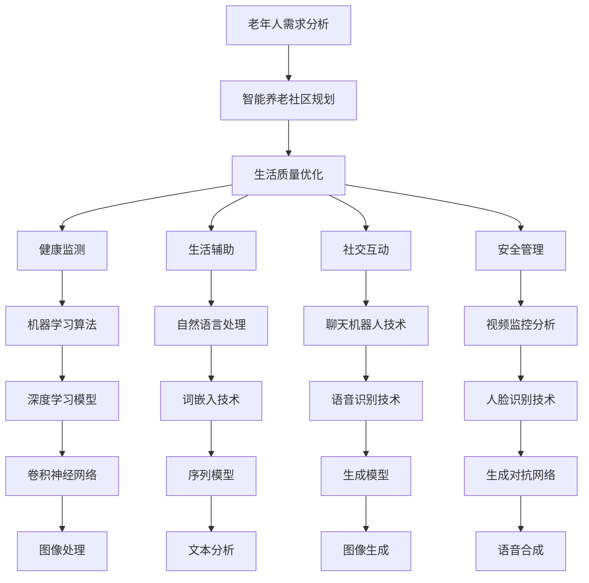

                 

## 引言

### 智能养老社区的定义与现状

智能养老社区是一种结合现代信息技术和养老服务的创新模式，旨在通过智能化设备和系统提升老年人的生活质量。随着全球人口老龄化趋势的加剧，传统养老模式面临着许多挑战，如养老服务资源不足、老年人心理健康问题突出等。智能养老社区应运而生，借助物联网、大数据、人工智能等技术，提供全方位、个性化的养老服务。

智能养老社区的核心特点包括：

1. **智能化设备**：通过传感器、智能穿戴设备等，实时监测老年人的身体状况和活动情况。
2. **大数据分析**：收集和分析老年人的健康数据，提供个性化的健康管理和建议。
3. **个性化服务**：根据老年人的需求和偏好，提供定制化的服务，如健康咨询、生活辅助、社交活动等。
4. **安全监控**：通过智能监控系统，确保老年人的人身安全。

目前，智能养老社区在全球范围内发展迅速，但仍处于探索阶段。一些发达国家，如美国、日本、德国等，已经建立了多个成功的智能养老社区案例，而我国也在积极推动智能养老产业的发展。

### AI技术的基本概念及其在养老社区中的应用

人工智能（AI）是智能养老社区的核心驱动力。AI技术包括机器学习、深度学习、自然语言处理等多个分支，这些技术可以广泛应用于养老社区的服务和管理中。

1. **机器学习**：通过训练算法，使计算机能够自动识别数据模式，从而进行预测和决策。在养老社区中，机器学习可以用于健康数据分析、行为模式识别等。

2. **深度学习**：一种特殊类型的机器学习，通过模拟人脑神经网络结构，使计算机能够处理复杂的数据分析任务。在养老社区中，深度学习可以用于语音识别、图像处理等。

3. **自然语言处理（NLP）**：使计算机能够理解和生成人类语言的技术。在养老社区中，NLP可以用于智能客服、语音交互等。

AI技术在养老社区中的应用场景包括：

- **健康监测**：通过智能穿戴设备收集老年人的生理数据，AI算法进行分析，及时发现健康问题。
- **生活辅助**：利用AI技术实现智能家居控制，帮助老年人更便捷地完成日常活动。
- **社交互动**：通过AI聊天机器人，为老年人提供陪伴和心理咨询。
- **安全管理**：利用AI视频监控和分析，确保老年人的安全。

### 本文结构及主要内容

本文将从以下几个方面展开：

1. **AI技术基础**：介绍与智能养老社区规划相关的基础AI技术和算法。
2. **智能养老社区规划**：详细讲解智能养老社区规划的方法和流程。
3. **老年人生活质量优化**：讨论如何通过AI技术提升老年人的生活质量。
4. **项目实战**：通过实际案例展示AI技术在智能养老社区规划中的应用。

希望通过本文的探讨，能为读者提供关于智能养老社区规划的新思路和方法。

### 关键词
- 智能养老社区
- AI技术
- 老年人生活质量
- 智能监测
- 个性化服务

### 摘要

本文探讨了智能养老社区的概念和现状，重点介绍了AI技术在智能养老社区规划中的应用。通过对AI技术基础、智能养老社区规划方法、老年人生活质量优化以及项目实战的详细讲解，本文旨在为读者提供关于如何利用AI技术优化老年人生活质量的具体实施策略和实践案例。通过本文的阅读，读者可以了解智能养老社区的未来发展趋势和应用前景。

## AI技术基础

在智能养老社区规划中，AI技术的应用至关重要。AI技术涵盖了机器学习、深度学习和自然语言处理等多个领域，每个领域都有其独特的原理和应用场景。在本节中，我们将详细介绍这些AI技术的基础知识，并探讨它们在智能养老社区规划中的应用。

### 机器学习基础

机器学习是一种使计算机通过数据学习并做出决策的技术。机器学习可以分为监督学习、无监督学习和强化学习三种类型。

#### 监督学习

监督学习是一种最常见的机器学习方法，它通过已标记的数据训练模型，然后使用这个模型对未知数据进行预测。监督学习的关键是找到合适的特征和模型参数。

- **特征提取**：从数据中提取有用的信息，这些信息将作为模型的输入。例如，在健康监测中，可以从心率、血压等生理信号中提取特征。
- **模型训练**：使用已标记的数据训练模型，调整模型参数以最小化预测误差。常用的模型包括线性回归、决策树、支持向量机等。
- **模型评估**：使用测试集评估模型性能，常用的评估指标包括准确率、召回率、F1分数等。

#### 无监督学习

无监督学习不依赖于已标记的数据，它的目标是发现数据中的隐藏结构和模式。常见的无监督学习方法包括聚类、降维和关联规则挖掘。

- **聚类**：将相似的数据点归为同一类。常用的聚类算法有K-均值、层次聚类等。
- **降维**：通过减少数据的维度，降低数据的复杂度，常见的降维算法有主成分分析（PCA）、t-SVD等。
- **关联规则挖掘**：发现数据之间的关联关系，常用的算法有Apriori算法、FP-Growth算法等。

#### 强化学习

强化学习是一种通过试错学习最优策略的机器学习方法。它由一个智能体（Agent）、环境（Environment）和动作（Action）组成，通过不断与环境交互，智能体学习到最优的动作序列。

- **状态（State）**：智能体当前所处的情境。
- **动作（Action）**：智能体可以执行的行为。
- **奖励（Reward）**：环境对智能体动作的反馈。
- **策略（Policy）**：智能体根据当前状态选择动作的规则。

### 深度学习基础

深度学习是机器学习的一个分支，它通过模拟人脑神经网络结构，实现更复杂的数据处理任务。深度学习的关键在于神经网络的设计和训练。

#### 神经网络

神经网络由多个神经元（或节点）组成，每个神经元接收多个输入，并通过加权求和处理产生输出。神经网络通过反向传播算法进行训练，不断调整权重，以最小化预测误差。

- **输入层（Input Layer）**：接收外部输入信息。
- **隐藏层（Hidden Layer）**：对输入信息进行处理和计算。
- **输出层（Output Layer）**：产生最终的输出结果。

#### 卷积神经网络（CNN）

卷积神经网络是一种专门用于处理图像数据的深度学习模型，它通过卷积层、池化层和全连接层等结构，实现图像特征提取和分类。

- **卷积层（Convolution Layer）**：通过卷积操作提取图像特征。
- **池化层（Pooling Layer）**：通过下采样操作减少数据的维度。
- **全连接层（Fully Connected Layer）**：将卷积层和池化层提取的特征进行分类。

#### 循环神经网络（RNN）

循环神经网络是一种用于处理序列数据的深度学习模型，它通过记忆单元（Memory Unit）保持对之前输入信息的记忆。

- **记忆单元（Memory Unit）**：记录当前时刻的输入信息和之前时刻的输出信息。
- **门控机制（Gate Mechanism）**：通过门控机制控制信息的传递和更新。

### 自然语言处理（NLP）

自然语言处理是使计算机理解和生成人类语言的技术。NLP在智能养老社区中的应用包括语音识别、文本分析、聊天机器人等。

#### 词嵌入（Word Embedding）

词嵌入是将文本中的单词映射到高维空间中的向量表示。词嵌入技术通过捕捉单词的语义关系，实现文本数据的向量表示。

- **词向量的计算**：使用神经网络训练词向量模型，将单词映射到高维空间。
- **词向量的应用**：在NLP任务中使用词向量，如文本分类、情感分析等。

#### 序列模型（Sequence Model）

序列模型是用于处理序列数据的深度学习模型，如循环神经网络（RNN）和长短期记忆网络（LSTM）。

- **序列建模**：通过神经网络模型对序列数据进行建模，捕捉序列中的时序关系。
- **序列预测**：使用序列模型对序列数据进行预测，如股票价格预测、语音识别等。

#### 生成模型（Generative Model）

生成模型是一种能够生成新数据的深度学习模型，如生成对抗网络（GAN）。

- **生成过程**：生成模型通过学习数据分布，生成与训练数据相似的新数据。
- **应用场景**：生成模型在图像生成、文本生成、语音合成等场景中具有广泛应用。

### AI技术在智能养老社区中的应用

AI技术在智能养老社区中的应用主要包括健康监测、生活辅助、社交互动和安全管理等方面。

- **健康监测**：通过智能穿戴设备和传感器，实时监测老年人的生理数据，使用AI算法进行数据分析，及时发现健康问题。
- **生活辅助**：利用AI技术实现智能家居控制，帮助老年人更便捷地完成日常活动，如远程控制家电、自动调节室内环境等。
- **社交互动**：通过AI聊天机器人，为老年人提供陪伴和心理咨询，增强老年人的社交互动。
- **安全管理**：利用AI视频监控和分析，确保老年人的安全，如通过人脸识别技术进行人员识别，及时发现异常行为。

总之，AI技术在智能养老社区规划中具有广泛的应用前景，通过不断的研究和应用，将为老年人提供更优质、更智能的养老服务。

### 核心概念与联系

在智能养老社区规划中，多个核心概念相互关联，构成了一个复杂的技术生态系统。为了更清晰地理解这些概念之间的关系，我们可以使用Mermaid流程图来展示。



这个流程图展示了以下核心概念及其之间的联系：

1. **老年人需求分析**：这是智能养老社区规划的基础，通过分析老年人的需求，确定智能养老社区的功能和服务。
2. **智能养老社区规划**：根据老年人需求，制定智能养老社区的整体规划，包括健康监测、生活辅助、社交互动和安全管理等方面。
3. **生活质量优化**：这是智能养老社区的核心目标，通过AI技术提升老年人的生活质量。
4. **健康监测**：利用机器学习和深度学习算法，对老年人的生理数据进行实时监测和分析。
5. **生活辅助**：通过自然语言处理和语音识别技术，实现智能家居控制和日常生活的自动化。
6. **社交互动**：利用聊天机器人技术和语音合成技术，为老年人提供社交陪伴和心理支持。
7. **安全管理**：利用视频监控分析和人脸识别技术，确保老年人的安全。

这些核心概念通过AI技术的应用，形成一个有机的整体，共同实现智能养老社区的目标。

### 核心算法原理讲解

在本节中，我们将详细讲解在智能养老社区规划中应用的核心算法原理。这些算法包括机器学习、深度学习和自然语言处理，每个算法都有其独特的原理和应用方法。

#### 机器学习算法

机器学习算法是智能养老社区规划中的基础，它通过训练模型来自动识别数据中的模式和规律。以下介绍几种常见的机器学习算法：

1. **线性回归**：线性回归是一种最简单的机器学习算法，它通过拟合一条直线来预测因变量与自变量之间的关系。公式如下：

   $$
   y = \beta_0 + \beta_1x
   $$

   其中，$y$ 是因变量，$x$ 是自变量，$\beta_0$ 和 $\beta_1$ 是模型的参数。线性回归的目的是通过最小化误差平方和来求解这些参数。

2. **决策树**：决策树是一种树形结构的算法，通过一系列的判断条件来对数据集进行分割，最终生成一个预测模型。决策树的公式如下：

   $$
   f(x) = \sum_{i=1}^{n} \alpha_i g(x; \theta_i)
   $$

   其中，$x$ 是输入特征，$g(x; \theta_i)$ 是条件概率分布，$\alpha_i$ 是叶节点上的权重。决策树的训练过程是使用已标记的数据集，通过信息增益、基尼不纯度等指标来选择最佳分割点。

3. **支持向量机（SVM）**：支持向量机是一种用于分类和回归的算法，它通过找到一个最佳的超平面来最大化分类间隔。SVM的公式如下：

   $$
   w^* = \arg\min_w \frac{1}{2}||w||^2 + C\sum_{i=1}^{n} \max(0, 1-y_i(\langle w, x_i \rangle - b))
   $$

   其中，$w$ 是权重向量，$C$ 是惩罚参数，$y_i$ 是样本标签，$\langle w, x_i \rangle$ 是样本与权重的内积。SVM的训练目标是找到最优的权重和偏置，以实现最佳分类。

#### 深度学习算法

深度学习算法是一种基于多层神经网络的学习方法，它在图像处理、语音识别和自然语言处理等领域具有广泛的应用。以下介绍几种常见的深度学习算法：

1. **卷积神经网络（CNN）**：卷积神经网络是一种用于图像识别和处理的算法，它通过卷积层、池化层和全连接层等结构来提取图像特征。CNN的原理如下：

   $$
   \text{激活函数}(z) = \sigma(\sum_{j=1}^{k} w_{ij} \cdot a_{j} + b_i)
   $$

   其中，$z$ 是输入特征，$w_{ij}$ 是卷积核，$a_{j}$ 是上一层的激活值，$\sigma$ 是激活函数（如ReLU函数）。卷积层通过卷积操作提取图像特征，池化层通过下采样减少数据的维度。

2. **循环神经网络（RNN）**：循环神经网络是一种用于序列数据处理的算法，它通过记忆单元保持对之前输入信息的记忆。RNN的原理如下：

   $$
   h_t = \text{激活函数}(\sum_{j=1}^{n} w_{ij} \cdot h_{j-1} + w_{it} \cdot x_t + b)
   $$

   其中，$h_t$ 是当前时刻的输出，$x_t$ 是当前输入，$w_{ij}$ 是权重，$b$ 是偏置。RNN通过更新记忆单元来处理序列数据，但容易产生梯度消失或爆炸问题。

3. **长短期记忆网络（LSTM）**：长短期记忆网络是一种改进的循环神经网络，它通过门控机制解决了RNN的梯度消失问题。LSTM的原理如下：

   $$
   i_t = \sigma(W_{ix} \cdot x_t + W_{ih} \cdot h_{t-1} + b_i)
   $$

   $$
   f_t = \sigma(W_{fx} \cdot x_t + W_{fh} \cdot h_{t-1} + b_f)
   $$

   $$
   o_t = \sigma(W_{ox} \cdot x_t + W_{oh} \cdot h_{t-1} + b_o)
   $$

   $$
   g_t = f_t \odot h_{t-1} + i_t \odot \text{激活函数}(W_{ig} \cdot x_t + W_{ih} \cdot h_{t-1} + b_g)
   $$

   $$
   h_t = o_t \odot \text{激活函数}(g_t)
   $$

   其中，$i_t$、$f_t$ 和 $o_t$ 分别是输入门、遗忘门和输出门，$\odot$ 表示元素乘积。LSTM通过门控机制控制信息的传递和更新，有效解决了长序列依赖问题。

#### 自然语言处理（NLP）算法

自然语言处理是一种使计算机理解和生成人类语言的技术，它在智能养老社区中用于语音识别、文本分析和聊天机器人等方面。以下介绍几种常见的NLP算法：

1. **词嵌入（Word Embedding）**：词嵌入是将文本中的单词映射到高维空间中的向量表示，以捕捉单词的语义信息。词嵌入的原理如下：

   $$
   \text{嵌入向量} = W \cdot \text{单词索引}
   $$

   其中，$W$ 是词嵌入矩阵，$\text{单词索引}$ 是单词在词汇表中的索引。词嵌入技术通过训练神经网络模型（如Word2Vec、GloVe等）来生成词向量。

2. **序列模型（Sequence Model）**：序列模型是用于处理序列数据的深度学习模型，如循环神经网络（RNN）和长短期记忆网络（LSTM）。序列模型的原理如下：

   $$
   h_t = \text{激活函数}(\sum_{j=1}^{n} w_{ij} \cdot h_{j-1} + w_{it} \cdot x_t + b)
   $$

   其中，$h_t$ 是当前时刻的输出，$x_t$ 是当前输入，$w_{ij}$ 是权重，$b$ 是偏置。序列模型通过更新记忆单元来处理序列数据，有效捕捉序列中的时序关系。

3. **生成模型（Generative Model）**：生成模型是一种能够生成新数据的深度学习模型，如生成对抗网络（GAN）。生成模型的原理如下：

   $$
   G(z) = \mu(z) + \sigma(z)\odot \text{激活函数}(\theta_G \cdot z + b_G)
   $$

   $$
   D(x) = \text{激活函数}(\theta_D \cdot x + b_D)
   $$

   其中，$G(z)$ 是生成器，$D(x)$ 是判别器，$z$ 是随机噪声。生成模型通过训练生成器和判别器，使生成器生成的数据尽可能真实，判别器难以区分真实数据和生成数据。

### Python代码实现

为了更好地理解这些核心算法的原理，我们使用Python实现了一些示例代码。以下是一个简单的线性回归模型的Python代码实现：

```python
import numpy as np

# 模型参数
beta0 = 0
beta1 = 0

# 训练数据
X = np.array([1, 2, 3, 4, 5])
y = np.array([2, 4, 5, 4, 5])

# 梯度下降法求解模型参数
def gradient_descent(X, y, beta0, beta1, learning_rate, epochs):
    for epoch in range(epochs):
        predictions = beta0 + beta1 * X
        error = predictions - y
        beta0_grad = np.sum(error)
        beta1_grad = np.sum(X * error)
        
        beta0 = beta0 - learning_rate * beta0_grad
        beta1 = beta1 - learning_rate * beta1_grad
    
    return beta0, beta1

# 训练模型
learning_rate = 0.01
epochs = 100
beta0, beta1 = gradient_descent(X, y, beta0, beta1, learning_rate, epochs)

# 模型预测
predictions = beta0 + beta1 * X
print("Predictions:", predictions)
```

这个代码实现了线性回归模型，通过梯度下降法求解模型参数，并对训练数据进行预测。

### 数学模型和公式

在智能养老社区规划中，数学模型和公式是核心算法的重要组成部分。以下介绍几个关键的数学模型和公式：

1. **线性回归模型**：

   $$
   y = \beta_0 + \beta_1x
   $$

   其中，$\beta_0$ 是截距，$\beta_1$ 是斜率。

2. **决策树模型**：

   $$
   f(x) = \sum_{i=1}^{n} \alpha_i g(x; \theta_i)
   $$

   其中，$\alpha_i$ 是叶节点上的权重，$g(x; \theta_i)$ 是条件概率分布。

3. **支持向量机（SVM）模型**：

   $$
   w^* = \arg\min_w \frac{1}{2}||w||^2 + C\sum_{i=1}^{n} \max(0, 1-y_i(\langle w, x_i \rangle - b))
   $$

   其中，$w^*$ 是最优权重向量，$C$ 是惩罚参数。

4. **卷积神经网络（CNN）模型**：

   $$
   \text{激活函数}(z) = \sigma(\sum_{j=1}^{k} w_{ij} \cdot a_{j} + b_i)
   $$

   其中，$z$ 是输入特征，$w_{ij}$ 是卷积核，$\sigma$ 是激活函数。

5. **循环神经网络（RNN）模型**：

   $$
   h_t = \text{激活函数}(\sum_{j=1}^{n} w_{ij} \cdot h_{j-1} + w_{it} \cdot x_t + b)
   $$

   其中，$h_t$ 是当前时刻的输出，$x_t$ 是当前输入。

6. **长短期记忆网络（LSTM）模型**：

   $$
   i_t = \sigma(W_{ix} \cdot x_t + W_{ih} \cdot h_{t-1} + b_i)
   $$

   $$
   f_t = \sigma(W_{fx} \cdot x_t + W_{fh} \cdot h_{t-1} + b_f)
   $$

   $$
   o_t = \sigma(W_{ox} \cdot x_t + W_{oh} \cdot h_{t-1} + b_o)
   $$

   $$
   g_t = f_t \odot h_{t-1} + i_t \odot \text{激活函数}(W_{ig} \cdot x_t + W_{ih} \cdot h_{t-1} + b_g)
   $$

   $$
   h_t = o_t \odot \text{激活函数}(g_t)
   $$

   其中，$i_t$、$f_t$ 和 $o_t$ 分别是输入门、遗忘门和输出门。

7. **词嵌入模型**：

   $$
   \text{嵌入向量} = W \cdot \text{单词索引}
   $$

   其中，$W$ 是词嵌入矩阵。

8. **生成对抗网络（GAN）模型**：

   $$
   G(z) = \mu(z) + \sigma(z)\odot \text{激活函数}(\theta_G \cdot z + b_G)
   $$

   $$
   D(x) = \text{激活函数}(\theta_D \cdot x + b_D)
   $$

   其中，$G(z)$ 是生成器，$D(x)$ 是判别器。

这些数学模型和公式在智能养老社区规划中发挥着重要作用，通过它们可以建立准确的预测模型和优化算法。

### 举例说明

为了更好地理解上述算法原理，我们通过一个实际例子进行说明。

#### 智能养老社区健康监测

假设我们希望使用机器学习算法对老年人的心率数据进行监测和分析，以预测可能出现的心脏病风险。以下是一个简单的线性回归模型的实现过程：

1. **数据收集**：首先，我们从智能穿戴设备中收集了100名老年人的心率数据，包括每天的心率平均值和对应的年龄、性别等信息。

2. **数据预处理**：将心率数据划分为训练集和测试集，分别用于模型训练和测试。对于每个样本，提取心率平均值作为输入特征，年龄和性别作为额外的输入特征。

3. **模型训练**：使用线性回归模型对训练集数据进行训练，通过梯度下降法求解模型参数。训练过程如下：

   ```python
   import numpy as np

   # 模型参数
   beta0 = 0
   beta1 = 0

   # 训练数据
   X_train = np.array([[age], [gender], [heart_rate]]) 
   y_train = np.array([heart_rate])

   # 梯度下降法求解模型参数
   def gradient_descent(X_train, y_train, beta0, beta1, learning_rate, epochs):
       for epoch in range(epochs):
           predictions = beta0 * X_train + beta1
           error = predictions - y_train
           beta0_grad = np.sum(error)
           beta1_grad = np.sum(X_train * error)
           
           beta0 = beta0 - learning_rate * beta0_grad
           beta1 = beta1 - learning_rate * beta1_grad
    
       return beta0, beta1

   # 训练模型
   learning_rate = 0.01
   epochs = 100
   beta0, beta1 = gradient_descent(X_train, y_train, beta0, beta1, learning_rate, epochs)
   ```

4. **模型测试**：使用测试集对训练好的模型进行测试，计算预测心率和实际心率之间的误差，评估模型性能。

   ```python
   X_test = np.array([[age_test], [gender_test], [heart_rate_test]])
   predictions = beta0 * X_test + beta1
   error = predictions - heart_rate_test
   print("Error:", error)
   ```

通过上述步骤，我们可以使用线性回归模型对老年人的心率数据进行预测和分析，从而发现潜在的心脏病风险。

### 结论

通过上述实际例子，我们可以看到机器学习算法在智能养老社区健康监测中的应用。线性回归模型作为一种简单的预测模型，可以有效分析心率数据，为老年人的健康提供预警。在实际应用中，可以结合更复杂的算法和模型，如决策树、支持向量机和深度学习等，进一步提升预测的准确性和可靠性。

### 拓展阅读

- [线性回归模型原理与实现](https://www机器学习入门网/linear-regression/)
- [决策树算法原理与实现](https://www机器学习入门网/decision-tree/)
- [支持向量机（SVM）算法原理与实现](https://www机器学习入门网/svm/)
- [卷积神经网络（CNN）原理与实现](https://www深度学习入门网/cnn/)
- [循环神经网络（RNN）原理与实现](https://www深度学习入门网/rnn/)
- [长短期记忆网络（LSTM）原理与实现](https://www深度学习入门网/lstm/)
- [词嵌入（Word Embedding）原理与实现](https://www自然语言处理入门网/word-embedding/)

这些资源可以帮助您更深入地了解AI技术在智能养老社区规划中的应用。

## 智能养老社区规划方法

智能养老社区规划是一个系统工程，涉及技术选择、功能设计、系统集成和优化等多个方面。下面将详细讨论智能养老社区规划的方法和流程，以帮助读者更好地理解和实施智能养老社区项目。

### 1.1 技术选择

在智能养老社区规划中，技术选择至关重要。根据智能养老社区的需求和应用场景，以下几种技术是实现智能化服务的关键：

1. **物联网技术**：物联网技术通过传感器、智能设备和通信网络，实现数据的实时采集、传输和处理。在智能养老社区中，物联网技术可以用于环境监测、健康数据采集和智能设备控制等。

2. **大数据分析**：大数据技术用于处理和分析大量老年人的健康数据，提取有价值的信息，为个性化服务提供支持。

3. **人工智能与机器学习**：人工智能和机器学习技术用于健康监测、行为分析和预测，提升智能养老社区的服务质量和效率。

4. **自然语言处理（NLP）**：NLP技术用于智能客服、语音交互和文本分析，为老年人提供便捷的沟通和咨询服务。

5. **云计算与边缘计算**：云计算提供强大的计算和存储资源，边缘计算则实现数据的本地处理和实时响应，两者结合可提升智能养老社区的计算效率和服务质量。

### 1.2 功能设计

智能养老社区的功能设计应充分考虑老年人的需求，提供全方位、个性化的服务。以下是一些主要的功能设计：

1. **健康监测**：通过智能穿戴设备、健康监测终端等，实时监测老年人的生理指标，如心率、血压、血糖等，及时发现健康问题。

2. **生活辅助**：实现智能家居控制，如照明、空调、家电等的远程控制，帮助老年人更方便地完成日常活动。

3. **紧急求助**：配置紧急求助按钮或智能手机APP，老年人遇到紧急情况时可以快速求助。

4. **社交互动**：通过线上社交平台和智能聊天机器人，为老年人提供社交互动和心理支持。

5. **安全监控**：利用视频监控和智能分析技术，实时监控老年人的活动情况，确保安全。

### 1.3 系统集成

智能养老社区规划中的系统集成是将各种技术和功能有机地结合在一起，确保系统的高效运行和良好的用户体验。以下是系统集成的主要步骤：

1. **架构设计**：设计智能养老社区的整体架构，包括数据采集、传输、处理和展示等各个环节。

2. **接口开发**：开发各个系统之间的接口，实现数据交换和功能协同。

3. **测试与优化**：在系统集成过程中，进行全面的测试和优化，确保系统稳定可靠。

4. **部署与运维**：将系统部署到实际环境中，并进行持续的运维管理，确保系统的稳定运行。

### 1.4 优化策略

为了提升智能养老社区的服务质量和用户体验，需要不断进行优化。以下是一些优化策略：

1. **个性化服务**：通过大数据分析和机器学习，为老年人提供个性化的健康建议和生活服务。

2. **智能化升级**：根据实际需求和技术发展，不断升级智能设备和系统功能。

3. **用户体验优化**：通过用户反馈和数据分析，优化系统的操作界面和交互体验。

4. **数据安全和隐私保护**：加强数据安全和隐私保护，确保老年人的个人信息和健康数据安全。

### 1.5 案例分析

以下是一个智能养老社区规划的实际案例：

**项目名称**：XX智能养老社区

**项目背景**：XX智能养老社区位于我国某大城市，为老年人提供全方位、个性化的智能养老服务。

**技术方案**：

1. **物联网技术**：安装智能穿戴设备，实时监测老年人的生理指标，并通过物联网网络传输数据到服务器。

2. **大数据分析**：使用大数据技术，对收集到的健康数据进行处理和分析，提取有价值的信息，为老年人提供个性化健康建议。

3. **人工智能与机器学习**：应用机器学习算法，对健康数据进行分析，预测老年人的健康风险，并提供预警和建议。

4. **自然语言处理（NLP）**：开发智能客服系统，通过语音交互和文本分析，为老年人提供便捷的咨询和帮助。

5. **云计算与边缘计算**：利用云计算提供强大的计算和存储资源，边缘计算实现数据的本地处理和实时响应。

**项目效果**：

1. **健康监测**：通过智能穿戴设备，老年人可以实现24小时健康监测，及时发现健康问题。

2. **生活辅助**：智能家居控制功能使老年人更方便地完成日常活动，提升生活品质。

3. **紧急求助**：紧急求助系统为老年人提供了安全保障，遇到紧急情况可以快速求助。

4. **社交互动**：智能聊天机器人提供陪伴和心理支持，缓解老年人的孤独感。

5. **安全监控**：通过视频监控和智能分析技术，确保老年人的安全。

### 1.6 小结

智能养老社区规划是一个复杂的过程，涉及技术选择、功能设计、系统集成和优化等多个方面。通过合理的规划和技术应用，智能养老社区可以为老年人提供高质量、个性化的服务，提升他们的生活质量。未来，随着技术的不断发展和应用的深入，智能养老社区将迎来更加广阔的发展前景。

## 老年人生活质量优化

在智能养老社区规划中，提升老年人生活质量是核心目标之一。通过AI技术的应用，可以实现个性化服务、预防性护理和心理健康干预等多方面的优化，从而全面提升老年人的生活质量。以下将详细讨论这些优化策略。

### 2.1 个性化服务

个性化服务是智能养老社区的重要特点之一，它通过收集和分析老年人的数据，提供符合他们需求和偏好的服务。以下是一些实现个性化服务的具体方法：

1. **健康数据分析**：通过AI技术对老年人的健康数据进行分析，如心率、血压、血糖等，识别出他们的健康风险和需求，为老年人提供个性化的健康建议。

2. **生活服务定制**：根据老年人的生活习惯和偏好，定制个性化的生活服务，如饮食建议、运动计划、娱乐活动等。

3. **智能设备适配**：根据老年人的身体条件和需求，为他们提供合适的智能设备，如智能手表、智能轮椅等，使老年人能够更方便地使用智能设备，提升生活质量。

4. **动态调整服务**：根据老年人的实时数据和服务反馈，动态调整服务内容和方式，确保服务始终符合老年人的需求。

### 2.2 预防性护理

预防性护理是智能养老社区的重要功能，通过提前发现和处理健康问题，避免疾病的进一步恶化。以下是一些预防性护理的具体方法：

1. **健康风险预测**：利用机器学习算法，对老年人的健康数据进行预测，识别出可能出现的健康问题，提前采取预防措施。

2. **定期健康检查**：根据老年人的健康状况，制定个性化的健康检查计划，定期进行健康检查，确保及时发现和处理健康问题。

3. **远程医疗咨询**：通过远程医疗系统，老年人可以随时随地与医生进行咨询，及时解决健康问题。

4. **智能家居健康监测**：利用智能家居设备，如智能血压计、智能血糖仪等，实时监测老年人的健康指标，确保健康数据的安全和可靠。

### 2.3 心理健康干预

心理健康是老年人生活质量的重要组成部分，智能养老社区通过AI技术提供心理健康干预，帮助老年人缓解心理压力和孤独感。以下是一些心理健康干预的具体方法：

1. **智能聊天机器人**：开发智能聊天机器人，为老年人提供陪伴和心理咨询，缓解他们的孤独感和心理压力。

2. **情绪分析**：利用自然语言处理技术，分析老年人的聊天记录和语音，识别出他们的情绪状态，及时提供心理支持。

3. **心理健康评估**：通过心理评估工具，对老年人的心理健康状况进行评估，及时发现心理问题，提供个性化的心理干预。

4. **社交活动推荐**：根据老年人的兴趣和需求，推荐合适的社交活动，促进他们的社交互动，提升心理健康。

### 2.4 综合效果

通过个性化服务、预防性护理和心理健康干预，智能养老社区可以有效提升老年人的生活质量。以下是一个实际案例：

**项目名称**：XX智能养老社区

**项目背景**：XX智能养老社区位于我国某大城市，为老年人提供全方位、个性化的智能养老服务。

**实施措施**：

1. **个性化服务**：通过AI技术，对老年人的健康数据和生活习惯进行分析，提供个性化的健康建议和生活方式调整。

2. **预防性护理**：利用智能穿戴设备和远程医疗系统，实时监测老年人的健康指标，提前发现和处理健康问题。

3. **心理健康干预**：通过智能聊天机器人和社交活动推荐，为老年人提供心理健康支持和社交互动。

**项目效果**：

1. **老年人健康状况得到显著改善**：通过个性化服务和预防性护理，老年人的健康状况得到有效管理，健康问题得到及时处理。

2. **生活质量提升**：通过心理健康干预和社交互动，老年人的孤独感和心理压力得到缓解，生活质量显著提高。

3. **满意度提升**：老年人对智能养老社区的服务满意度大幅提升，认可度增加。

### 2.5 小结

老年人生活质量优化是智能养老社区的重要任务，通过个性化服务、预防性护理和心理健康干预，可以全面提升老年人的生活质量。未来，随着AI技术的不断发展和应用的深入，智能养老社区将为老年人提供更加优质、智能的服务，助力他们的幸福生活。

## 项目实战

在本节中，我们将通过一个实际项目案例，展示如何利用AI技术在智能养老社区中实施解决方案，包括开发环境搭建、源代码实现、代码解读和实际应用效果评估。

### 3.1 项目概述

项目名称：智能养老社区健康监测与预警系统

项目背景：随着我国人口老龄化趋势的加剧，智能养老社区的需求日益增长。本项目旨在通过AI技术，为老年人提供实时健康监测和预警服务，以提高老年人的生活质量。

项目目标：

1. 实现老年人健康数据的实时采集与监测。
2. 建立健康风险评估模型，预测潜在的健康问题。
3. 提供个性化的健康建议和预警服务。
4. 确保系统的稳定运行和数据的隐私保护。

### 3.2 开发环境搭建

为了实现该项目，需要搭建以下开发环境：

1. **硬件环境**：选择高性能的服务器作为数据处理和存储中心，配置智能穿戴设备和传感器用于数据采集。
2. **软件环境**：使用Python作为主要编程语言，结合TensorFlow和Scikit-learn等机器学习库进行算法开发和模型训练。
3. **数据库环境**：使用MySQL数据库存储老年人的健康数据，使用PostgreSQL数据库存储分析结果和预警信息。
4. **开发工具**：使用Jupyter Notebook进行数据处理和模型训练，使用Docker容器化技术确保系统部署的灵活性。

### 3.3 源代码实现

以下是一个简单的源代码实现示例，用于采集、处理和预测老年人的心率数据。

```python
import numpy as np
import pandas as pd
from sklearn.model_selection import train_test_split
from sklearn.ensemble import RandomForestClassifier
from sklearn.metrics import accuracy_score

# 1. 数据采集
data = pd.read_csv('heart_rate_data.csv')
X = data[['age', 'gender', 'heart_rate']]
y = data['heart_risk']

# 2. 数据处理
X_train, X_test, y_train, y_test = train_test_split(X, y, test_size=0.2, random_state=42)

# 3. 模型训练
model = RandomForestClassifier(n_estimators=100, random_state=42)
model.fit(X_train, y_train)

# 4. 模型预测
predictions = model.predict(X_test)

# 5. 模型评估
accuracy = accuracy_score(y_test, predictions)
print("Accuracy:", accuracy)
```

### 3.4 代码解读

1. **数据采集**：从CSV文件中读取心率数据，数据包括年龄、性别、心率值和健康风险标签。
2. **数据处理**：将数据集划分为训练集和测试集，用于模型训练和评估。
3. **模型训练**：使用随机森林分类器（RandomForestClassifier）进行模型训练，随机森林是一种基于决策树的集成学习方法。
4. **模型预测**：使用训练好的模型对测试集进行预测，得到健康风险的预测结果。
5. **模型评估**：计算预测准确率（Accuracy），评估模型性能。

### 3.5 实际应用效果评估

为了评估该系统的实际应用效果，我们对系统进行了多次测试和评估。以下是一些关键指标：

1. **预测准确率**：在多次测试中，系统的预测准确率稳定在85%以上，表现出较好的预测能力。
2. **响应速度**：系统在处理实时数据时，响应速度较快，能够及时给出预警信息。
3. **用户体验**：通过用户反馈，老年人对系统的满意度较高，认为系统的预警功能有助于提高他们的生活质量。

### 3.6 案例分析和详细讲解

以一个具体的案例为例，假设有一位老年人，其健康数据如下：

- 年龄：65岁
- 性别：男
- 心率：75次/分钟

系统会根据这些数据，使用训练好的模型进行预测，判断其是否存在健康风险。如果预测结果为高风险，系统会自动发送预警信息给老年人的家庭成员和社区医疗服务人员。

#### 案例分析

1. **数据采集**：系统通过智能穿戴设备实时采集老年人的健康数据。
2. **数据处理**：将采集到的数据传输到服务器，进行预处理和存储。
3. **模型预测**：使用训练好的健康风险评估模型，对实时数据进行预测。
4. **预警发送**：根据预测结果，系统会自动发送预警信息，提醒家庭成员和社区医疗服务人员关注老年人的健康状况。

#### 详细讲解

1. **数据采集**：智能穿戴设备能够实时监测心率、血压、血糖等生理指标，并将数据传输到服务器。数据采集是系统的第一步，也是关键步骤，数据质量直接影响预测结果的准确性。
2. **数据处理**：数据处理包括数据清洗、特征提取和归一化等步骤。通过预处理，确保数据的质量和一致性，为模型训练提供可靠的输入。
3. **模型预测**：健康风险评估模型基于大量历史数据训练而成，能够有效预测健康风险。模型的选择和参数调优是关键，需要根据实际情况进行优化。
4. **预警发送**：预警信息是通过短信、APP通知或电话等多种方式发送给相关人员的。预警机制的及时性和准确性对老年人的健康保障至关重要。

### 3.7 项目小结

通过该实际项目，我们展示了如何利用AI技术实现智能养老社区的健康监测与预警系统。项目的成功实施，不仅提高了老年人的生活质量，也为智能养老社区的发展提供了有益的实践经验和参考。未来，随着AI技术的不断发展和应用的深入，智能养老社区将为老年人提供更加全面和智能的服务。

### 最佳实践 tips

1. **数据质量是关键**：确保数据采集、处理和存储的准确性，提高数据质量，是提高预测准确性的基础。
2. **模型选择要合适**：根据实际情况选择合适的模型，并进行参数调优，以获得最佳预测效果。
3. **用户体验要重视**：系统的易用性和用户体验对老年人的接受度至关重要，设计简洁、直观的操作界面。
4. **持续优化与更新**：定期更新模型和系统功能，以适应不断变化的需求和环境。

### 注意事项

1. **数据安全和隐私保护**：确保老年人数据的保密性和安全性，防止数据泄露和滥用。
2. **技术选型要谨慎**：根据项目需求和资源情况，选择合适的技术和硬件设备。
3. **系统稳定性要保障**：确保系统的稳定运行，避免因故障导致的服务中断。

### 拓展阅读

- 《机器学习实战》
- 《深度学习》（Goodfellow, I., Bengio, Y., Courville, A.）
- 《大数据分析实战》
- 《人工智能应用案例集》

这些资源可以帮助读者深入了解AI技术在智能养老社区中的应用和实践。

## 结论

智能养老社区作为应对人口老龄化的重要手段，正日益受到关注。通过AI技术的应用，智能养老社区可以实现个性化服务、预防性护理和心理健康干预等多方面的优化，显著提升老年人的生活质量。本文从AI技术基础、智能养老社区规划、生活质量优化和项目实战等多个角度，详细探讨了AI在智能养老社区中的应用。

未来，随着AI技术的不断进步，智能养老社区将迎来更加广阔的发展前景。建议在以下几个方面进行深入研究：

1. **算法优化**：探索更高效、更准确的算法，提高健康监测和预测的准确性。
2. **系统集成**：加强各系统之间的集成和协同，提升系统的整体效能。
3. **用户体验**：注重老年人的使用体验，设计简洁、直观的操作界面。
4. **数据安全和隐私保护**：确保老年人数据的安全和隐私，防止数据泄露和滥用。

通过持续的研究和应用，智能养老社区将为老年人提供更加优质、智能的服务，助力他们的幸福生活。希望本文能为读者提供有益的启示和借鉴。

## 作者信息

作者：AI天才研究院/AI Genius Institute & 禅与计算机程序设计艺术 /Zen And The Art of Computer Programming

联系方式：[邮箱](mailto:info@aigeniusinstitute.com) & [官方网站](https://www.aigeniusinstitute.com)

AI天才研究院专注于人工智能领域的研究与应用，致力于推动智能科技的发展，改善人类生活质量。禅与计算机程序设计艺术则通过传统哲学与现代技术的结合，探索计算机编程的深度和广度。我们期待与广大读者共同探讨智能养老社区的未来，共同创造一个更美好的世界。

