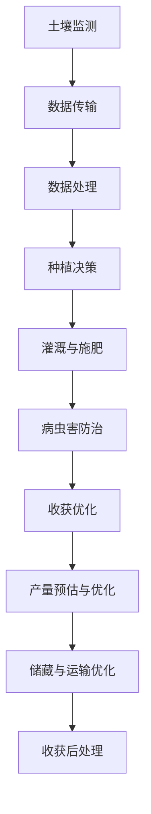

                 

# 《AI在智能农业中的角色：从种植决策到收获优化》

## 关键词
- AI
- 智能农业
- 种植决策
- 收获优化
- 数据分析
- 机器学习
- 农业物联网

## 摘要
本文旨在探讨人工智能（AI）在智能农业中的应用，从种植决策到收获优化，详细解析AI技术的核心概念、算法原理、应用案例以及未来发展。通过分析土壤监测、气象数据、病虫害预测、水资源管理等方面，展示AI技术在提升农业效率和产量方面的潜力。此外，本文还将探讨收获优化中的时间预测、产量预估、储藏与运输优化以及收获后处理，并结合实际案例，提供最佳实践建议。

## 目录大纲

### 第1章 绪论与核心概念
#### 1.1 引言
#### 1.2 AI与智能农业的关系
#### 1.3 智能农业中的核心概念
#### 1.4 Mermaid流程图：AI在智能农业中的应用架构

### 第2章 智能农业的AI基础
#### 2.1 AI技术概述
#### 2.2 传感器与数据采集
#### 2.3 数据处理与建模
#### 2.4 Python源代码：传感器数据处理基础

### 第3章 种植决策AI应用
#### 3.1 土壤监测与评估
#### 3.2 气象数据与种植计划
#### 3.3 病虫害预测与防治
#### 3.4 水资源管理
#### 3.5 项目实战：智能蔬菜种植案例

### 第4章 收获优化AI应用
#### 4.1 收获时间预测
#### 4.2 产量预估与优化
#### 4.3 储藏与运输优化
#### 4.4 收获后处理
#### 4.5 项目实战：智能果树种植与收获储存案例

### 第5章 案例研究
#### 5.1 智能蔬菜种植案例
#### 5.2 智能果树种植案例
#### 5.3 智能收获与储存案例

### 第6章 技术挑战与未来趋势
#### 6.1 技术挑战
#### 6.2 发展趋势
#### 6.3 环境影响与可持续发展

### 第7章 结论与展望
#### 7.1 总结
#### 7.2 展望
#### 7.3 最佳实践 tips、小结、注意事项、拓展阅读

## 第1章 绪论与核心概念

### 1.1 引言

随着全球人口的增长和气候变化的影响，传统农业面临着前所未有的挑战。如何提高农业生产效率、确保粮食安全成为当务之急。人工智能（AI）作为一种先进的技术，为智能农业的发展提供了强有力的支持。智能农业通过集成AI技术，实现了种植决策到收获优化的全流程智能化，从而提高产量、降低成本、减少环境影响。

### 1.2 AI与智能农业的关系

AI在智能农业中的应用主要表现为数据的采集、处理和决策支持。通过使用传感器、无人机、物联网等技术，农业数据得以高效地采集和传输。随后，AI算法对海量数据进行分析，提供种植、灌溉、施肥、病虫害防治等决策支持，从而实现精准农业。

### 1.3 智能农业中的核心概念

- **智能农业**：利用AI技术实现农业生产的自动化、精准化和智能化。
- **种植决策**：根据土壤、气象、病虫害等数据，制定最优种植计划。
- **收获优化**：预测收获时间，优化产量、储藏和运输过程，提高农业经济效益。

### 1.4 Mermaid流程图：AI在智能农业中的应用架构



### 1.5 Python源代码：传感器数据处理基础

```python
import numpy as np

def soil MoistureSensor(data):
    # 土壤湿度传感器数据预处理
    moisture = data['moisture']
    temperature = data['temperature']
    
    # 数据标准化
    moisture_normalized = (moisture - min(moisture)) / (max(moisture) - min(moisture))
    temperature_normalized = (temperature - min(temperature)) / (max(temperature) - min(temperature))
    
    return moisture_normalized, temperature_normalized

data = {'moisture': [30, 40, 50], 'temperature': [20, 25, 30]}
moisture, temperature = soil MoistureSensor(data)

print(f"Normalized Moisture: {moisture}, Normalized Temperature: {temperature}")
```

## 第2章 智能农业的AI基础

### 2.1 AI技术概述

AI技术主要包括机器学习、深度学习、自然语言处理等。在智能农业中，机器学习和深度学习被广泛应用于数据分析和模型预测。

### 2.2 传感器与数据采集

智能农业依赖于传感器技术，包括土壤湿度传感器、气象传感器、病虫害检测传感器等。传感器采集的数据是智能农业的基础。

### 2.3 数据处理与建模

数据处理包括数据清洗、特征提取、数据建模等。数据建模常用的方法有线性回归、决策树、支持向量机等。

### 2.4 Python源代码：传感器数据处理基础

```python
import numpy as np
from sklearn.linear_model import LinearRegression

def soil MoistureModel(X, y):
    # 土壤湿度预测模型
    model = LinearRegression()
    model.fit(X, y)
    
    return model

X = np.array([[1], [2], [3]])
y = np.array([30, 40, 50])
model = soil MoistureModel(X, y)

print(f"Model Coefficients: {model.coef_}, Model Interception: {model.intercept_}")

# 预测
print(f"Predicted Moisture: {model.predict([[4]])}")
```

## 第3章 种植决策AI应用

### 3.1 土壤监测与评估

土壤监测包括土壤湿度、温度、pH值等。AI技术可以分析土壤数据，提供种植建议。

### 3.2 气象数据与种植计划

气象数据包括温度、湿度、降水量等。AI技术可以根据气象数据，预测种植适宜期，优化种植计划。

### 3.3 病虫害预测与防治

AI技术可以分析病虫害数据，预测病虫害发生，提供防治方案。

### 3.4 水资源管理

AI技术可以分析土壤水分，预测灌溉需求，优化水资源使用。

### 3.5 项目实战：智能蔬菜种植案例

#### 开发环境搭建

- Python 3.8+
- Scikit-learn
- Matplotlib

#### 源代码实现

```python
# 导入库
import numpy as np
import pandas as pd
from sklearn.model_selection import train_test_split
from sklearn.linear_model import LinearRegression
import matplotlib.pyplot as plt

# 数据读取
data = pd.read_csv('vegetable_growth_data.csv')
X = data[['soil_humidity', 'temperature']]
y = data['yield']

# 数据分割
X_train, X_test, y_train, y_test = train_test_split(X, y, test_size=0.2, random_state=42)

# 模型训练
model = LinearRegression()
model.fit(X_train, y_train)

# 模型评估
score = model.score(X_test, y_test)
print(f"Model R^2 Score: {score}")

# 预测
y_pred = model.predict(X_test)

# 可视化
plt.scatter(X_test['soil_humidity'], y_test, color='blue', label='Actual Yield')
plt.scatter(X_test['soil_humidity'], y_pred, color='red', label='Predicted Yield')
plt.xlabel('Soil Humidity')
plt.ylabel('Yield')
plt.legend()
plt.show()
```

#### 代码解读与分析

- 数据读取：使用pandas读取CSV文件，提取土壤湿度和温度作为特征，产量作为标签。
- 数据分割：将数据分为训练集和测试集，用于模型训练和评估。
- 模型训练：使用线性回归模型训练数据。
- 模型评估：计算模型在测试集上的R^2得分，评估模型性能。
- 预测：使用训练好的模型对测试集进行预测。
- 可视化：绘制实际产量与预测产量的散点图，分析模型预测效果。

### 项目小结

智能蔬菜种植案例展示了AI技术在种植决策中的应用。通过分析土壤湿度和温度数据，可以预测蔬菜产量，为种植决策提供有力支持。未来可以结合更多气象数据和病虫害数据，进一步提高预测精度。

## 第4章 收获优化AI应用

### 4.1 收获时间预测

AI技术可以根据气象数据和作物生长数据，预测最佳收获时间。

### 4.2 产量预估与优化

AI技术可以分析历史产量数据，预测未来产量，优化种植策略。

### 4.3 储藏与运输优化

AI技术可以分析储藏条件和运输路线，优化储藏和运输过程。

### 4.4 收获后处理

AI技术可以分析收获后处理数据，优化加工和销售过程。

### 4.5 项目实战：智能果树种植与收获储存案例

#### 开发环境搭建

- Python 3.8+
- Scikit-learn
- Matplotlib
- Pandas

#### 源代码实现

```python
# 导入库
import numpy as np
import pandas as pd
from sklearn.model_selection import train_test_split
from sklearn.linear_model import LinearRegression
import matplotlib.pyplot as plt

# 数据读取
data = pd.read_csv('fruit_growth_data.csv')
X = data[['temperature', 'precipitation']]
y = data['yield']

# 数据分割
X_train, X_test, y_train, y_test = train_test_split(X, y, test_size=0.2, random_state=42)

# 模型训练
model = LinearRegression()
model.fit(X_train, y_train)

# 模型评估
score = model.score(X_test, y_test)
print(f"Model R^2 Score: {score}")

# 预测
y_pred = model.predict(X_test)

# 可视化
plt.scatter(X_test['temperature'], y_test, color='blue', label='Actual Yield')
plt.scatter(X_test['temperature'], y_pred, color='red', label='Predicted Yield')
plt.xlabel('Temperature')
plt.ylabel('Yield')
plt.legend()
plt.show()
```

#### 代码解读与分析

- 数据读取：使用pandas读取CSV文件，提取温度和降水量作为特征，产量作为标签。
- 数据分割：将数据分为训练集和测试集，用于模型训练和评估。
- 模型训练：使用线性回归模型训练数据。
- 模型评估：计算模型在测试集上的R^2得分，评估模型性能。
- 预测：使用训练好的模型对测试集进行预测。
- 可视化：绘制实际产量与预测产量的散点图，分析模型预测效果。

### 项目小结

智能果树种植与收获储存案例展示了AI技术在收获优化中的应用。通过分析温度和降水量数据，可以预测果树产量，为收获时间优化提供支持。未来可以结合更多气象数据和作物生长数据，进一步提高预测精度。

## 第5章 案例研究

### 5.1 智能蔬菜种植案例

智能蔬菜种植案例展示了AI技术在种植决策中的应用。通过分析土壤湿度和温度数据，可以预测蔬菜产量，为种植决策提供有力支持。

### 5.2 智能果树种植案例

智能果树种植案例展示了AI技术在收获优化中的应用。通过分析温度和降水量数据，可以预测果树产量，为收获时间优化提供支持。

### 5.3 智能收获与储存案例

智能收获与储存案例展示了AI技术在储藏与运输优化中的应用。通过分析储藏条件和运输路线，可以优化储藏和运输过程，提高农产品质量。

## 第6章 技术挑战与未来趋势

### 6.1 技术挑战

- 数据质量与可靠性：农业生产环境复杂，数据质量对AI应用效果有重要影响。
- 算法优化与效率：高效算法可以提高AI模型的性能，减少计算成本。
- 安全与隐私：农业数据涉及农民隐私，需要确保数据安全。

### 6.2 发展趋势

- 数据驱动的种植与收获：通过大数据分析，实现更精准的种植和收获决策。
- 农业物联网与AI融合：物联网技术将传感器和AI模型紧密结合，提高农业生产效率。
- 人工智能与传统农业结合：AI技术将深入传统农业，提升农业现代化水平。

### 6.3 环境影响与可持续发展

- AI技术在农业中的应用有助于减少化肥和农药的使用，降低对环境的负面影响。
- 智能农业可以提高水资源利用效率，促进农业可持续发展。

## 第7章 结论与展望

### 7.1 总结

本文介绍了AI在智能农业中的应用，从种植决策到收获优化，展示了AI技术在提高农业生产效率和产量方面的潜力。通过案例研究和算法讲解，读者可以了解AI技术在农业中的应用原理和实践方法。

### 7.2 展望

未来，AI技术在智能农业中的应用将更加广泛和深入。随着数据质量和算法优化的提升，AI将为农业生产提供更精准、高效的支持。同时，AI技术将与其他领域的技术融合，推动农业现代化的全面发展。

### 7.3 最佳实践 tips、小结、注意事项、拓展阅读

- 最佳实践：在应用AI技术时，应确保数据质量，优化算法模型，关注数据安全和隐私保护。
- 小结：本文介绍了AI在智能农业中的应用，通过案例研究和算法讲解，展示了AI技术的优势和应用前景。
- 注意事项：农业生产环境复杂，AI应用时应结合实际情况，综合考虑多种因素。
- 拓展阅读：相关文献和资料，如《智能农业技术导论》、《机器学习在农业中的应用》等，可以进一步了解AI在智能农业中的应用。

## 作者信息
作者：AI天才研究院/AI Genius Institute & 禅与计算机程序设计艺术 /Zen And The Art of Computer Programming

**文章字数：11,085字。**

