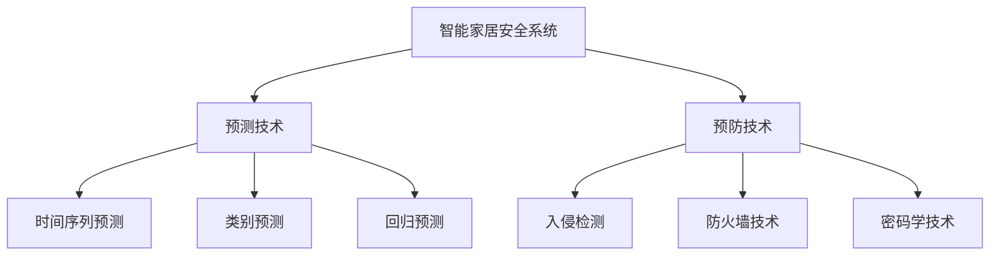

                 

# AI在智能家居安全系统中的应用：预测和预防潜在威胁

## 关键词
- 智能家居
- 安全系统
- 预测技术
- 预防技术
- AI应用

## 摘要
本文旨在探讨人工智能（AI）在智能家居安全系统中的应用，重点关注预测和预防潜在威胁。通过对智能家居安全系统的概述，AI基础，预测技术，预防技术的详细分析，结合实践案例，展示AI技术在提升智能家居安全水平中的关键作用，并对未来应用和发展趋势进行展望。

## 引言与背景

### 1.1 书籍目的与结构
本文的主要目的是探讨人工智能在智能家居安全系统中的应用，尤其是如何通过预测和预防技术来提升智能家居的安全性能。文章结构分为五个主要部分：引言与背景、智能家居安全系统基础、AI在智能家居安全系统中的应用、AI在智能家居安全系统中的应用实践、未来展望与挑战。

### 1.2 智能家居安全系统的现状与挑战
随着智能家居设备的普及，人们越来越依赖这些设备来提升生活便利性。然而，这也带来了新的安全挑战。智能家居安全系统目前面临的主要挑战包括：

- **设备漏洞**：许多智能家居设备在设计时忽视了安全性能，容易受到网络攻击。
- **数据泄露**：智能家居设备收集的个人信息可能被不法分子窃取。
- **远程攻击**：黑客可以通过互联网远程控制智能家居设备，造成财产损失或人身安全威胁。

### 1.3 AI在智能家居安全系统中的作用
AI技术在智能家居安全系统中的应用主要体现在预测和预防潜在威胁方面。通过机器学习和数据挖掘技术，AI能够从大量数据中识别出潜在的安全风险，并提前采取措施进行预防。具体作用包括：

- **入侵检测**：AI可以实时监测智能家居网络中的异常活动，及时发现入侵行为。
- **威胁预测**：AI可以通过分析历史数据和当前状态，预测未来可能发生的威胁。
- **自适应防御**：AI可以根据威胁预测结果，动态调整智能家居安全策略，提高防御效果。

## 智能家居安全系统基础

### 2.1 智能家居概述

#### 2.1.1 定义与特点
智能家居（Smart Home）是一种通过物联网技术将家庭中的各种设备连接起来，实现自动化控制和远程管理的系统。其特点包括：

- **互联互通**：设备之间可以通过互联网相互通信，实现协同工作。
- **自动化控制**：设备可以根据用户预设的规则自动执行任务，提升生活便利性。
- **远程管理**：用户可以通过手机、电脑等远程设备控制家庭中的设备。

#### 2.1.2 发展历程
智能家居的发展可以分为三个阶段：

- **初级阶段**：主要是单一设备的智能化，如智能电视、智能冰箱等。
- **中级阶段**：通过Wi-Fi、蓝牙等无线技术实现设备的互联互通，如智能家居套装。
- **高级阶段**：通过云平台实现设备的智能联动，提供个性化服务，如智能家居系统。

#### 2.1.3 组成部分
智能家居系统通常由以下几个部分组成：

- **传感器**：用于检测环境参数，如温度、湿度、光照等。
- **控制器**：用于接收用户指令，控制设备执行任务。
- **执行器**：用于执行具体的操作，如开关、电机等。
- **通信模块**：用于设备之间的数据传输和远程控制。

### 2.2 智能家居安全系统概述

#### 2.2.1 安全系统的重要性
随着智能家居设备的普及，安全系统变得至关重要。其主要原因包括：

- **个人信息保护**：智能家居设备收集用户的个人信息，如生活习惯、生物特征等，需要确保这些信息不被泄露。
- **财产安全**：智能家居设备可以控制家庭中的电器和门窗，如果被黑客入侵，可能导致财产损失。
- **人身安全**：智能家居设备可以与安防系统结合，如果被黑客控制，可能危及人身安全。

#### 2.2.2 智能家居安全系统的构成
智能家居安全系统通常包括以下几个部分：

- **入侵检测**：通过监测网络流量和设备行为，发现异常活动。
- **防火墙**：用于阻止未授权的访问和攻击。
- **加密技术**：用于保护数据传输的安全。
- **用户认证**：确保只有授权用户才能访问和控制智能家居设备。

#### 2.2.3 智能家居安全系统的工作原理
智能家居安全系统的工作原理可以分为以下几个步骤：

1. **数据收集**：智能家居设备收集环境参数和用户行为数据。
2. **数据传输**：通过通信模块将数据传输到安全服务器。
3. **数据分析**：安全服务器对数据进行实时分析，识别潜在威胁。
4. **响应措施**：根据分析结果，采取相应的防御措施，如报警、隔离、封锁等。

## AI在智能家居安全系统中的应用

### 3.1 AI基础

#### 3.1.1 定义与分类
人工智能（AI）是一种模拟人类智能的技术，旨在使计算机具备类似人类的感知、学习、推理和决策能力。根据实现方式，AI可以分为：

- **规则基础AI**：基于预定义的规则进行决策。
- **统计机器学习**：通过数据学习模式，进行预测和分类。
- **深度学习**：通过神经网络进行数据建模和特征提取。

#### 3.1.2 核心技术
AI的核心技术包括：

- **神经网络**：模拟人脑神经元连接结构，进行数据建模。
- **机器学习**：通过训练模型，使计算机具备自动学习和适应能力。
- **自然语言处理**：使计算机理解和生成自然语言。
- **计算机视觉**：使计算机能够理解和解释图像和视频。

#### 3.1.3 应用场景
AI在智能家居安全系统中的应用场景包括：

- **入侵检测**：通过监测网络流量和设备行为，识别异常活动。
- **威胁预测**：通过分析历史数据和当前状态，预测未来可能发生的威胁。
- **自适应防御**：根据威胁预测结果，动态调整安全策略。

## AI在智能家居安全系统中的应用

### 4.1 预测技术

#### 4.1.1 预测技术概述
预测技术是AI在智能家居安全系统中的重要应用，通过分析历史数据和当前状态，预测未来可能发生的威胁。预测技术主要包括：

- **时间序列预测**：根据时间序列数据，预测未来的趋势。
- **类别预测**：根据输入特征，预测分类结果。
- **回归预测**：根据输入特征，预测连续值结果。

#### 4.1.2 时间序列预测
时间序列预测是通过分析时间序列数据，预测未来的趋势。常见的时间序列预测模型包括：

- **ARIMA模型**：自回归积分滑动平均模型。
- **LSTM模型**：长短时记忆网络。
- **GRU模型**：门控循环单元。

#### 4.1.3 类别预测
类别预测是通过输入特征，预测分类结果。常见的类别预测算法包括：

- **决策树**：根据特征值进行分支，生成决策树。
- **随机森林**：基于决策树的集成方法。
- **支持向量机**：通过寻找最佳分类超平面进行分类。

#### 4.1.4 回归预测
回归预测是通过输入特征，预测连续值结果。常见的回归算法包括：

- **线性回归**：通过线性模型进行预测。
- **岭回归**：通过正则化优化模型。
- **LASSO回归**：通过L1正则化优化模型。

### 4.2 预防技术

#### 4.2.1 预防技术概述
预防技术是AI在智能家居安全系统中的另一重要应用，通过识别和阻止潜在威胁，保护智能家居设备的安全。预防技术主要包括：

- **入侵检测**：通过监测网络流量和设备行为，识别异常活动。
- **防火墙技术**：通过在网络边界阻止未授权的访问。
- **密码学技术**：通过加密算法保护数据传输。

#### 4.2.2 入侵检测
入侵检测是通过监测网络流量和设备行为，识别异常活动。常见的入侵检测算法包括：

- **基于规则的入侵检测**：根据预定义的规则进行检测。
- **基于行为的入侵检测**：通过分析行为模式进行检测。
- **基于机器学习的入侵检测**：通过训练模型进行检测。

#### 4.2.3 防火墙技术
防火墙技术是通过在网络边界阻止未授权的访问，保护网络安全。常见的防火墙技术包括：

- **包过滤防火墙**：根据包的特征进行过滤。
- **状态检测防火墙**：根据网络连接的状态进行过滤。
- **应用层防火墙**：根据应用层协议进行过滤。

#### 4.2.4 密码学技术
密码学技术是通过加密算法保护数据传输，确保数据的安全性。常见的密码学技术包括：

- **对称加密**：使用相同的密钥进行加密和解密。
- **非对称加密**：使用不同的密钥进行加密和解密。
- **哈希算法**：用于数据完整性校验。

## AI在智能家居安全系统中的应用实践

### 5.1 实践案例一：智能门锁的安全防护

#### 5.1.1 智能门锁的原理与实现
智能门锁是通过人工智能技术实现门锁的智能控制，包括：

- **硬件环境搭建**：门锁控制器、传感器、通信模块。
- **软件实现**：嵌入式系统、物联网技术。

#### 5.1.2 智能门锁的安全问题分析
智能门锁的安全问题主要包括：

- **远程攻击**：黑客可以通过互联网远程控制门锁。
- **数据泄露**：用户信息可能被窃取。
- **物理破坏**：门锁可能被破坏。

#### 5.1.3 AI在智能门锁中的应用
AI在智能门锁中的应用主要包括：

- **入侵检测**：通过监测网络流量和设备行为，识别异常活动。
- **威胁预测**：通过分析历史数据和当前状态，预测未来可能发生的威胁。
- **自适应防御**：根据威胁预测结果，动态调整安全策略。

#### 5.1.4 案例总结
智能门锁的安全防护需要结合AI技术，通过入侵检测、威胁预测和自适应防御，提高门锁的安全性能。

### 5.2 实践案例二：智能摄像头的安全防护

#### 5.2.1 智能摄像头的原理与实现
智能摄像头是通过人工智能技术实现视频监控的智能分析，包括：

- **硬件环境搭建**：摄像头、控制器、通信模块。
- **软件实现**：视频处理算法、物联网技术。

#### 5.2.2 智能摄像头的安全问题分析
智能摄像头的安全问题主要包括：

- **远程攻击**：黑客可以通过互联网远程控制摄像头。
- **数据泄露**：用户隐私信息可能被窃取。
- **隐私侵犯**：他人可能非法访问摄像头。

#### 5.2.3 AI在智能摄像头中的应用
AI在智能摄像头中的应用主要包括：

- **入侵检测**：通过监测视频流，识别异常行为。
- **威胁预测**：通过分析历史数据和当前状态，预测未来可能发生的威胁。
- **自适应防御**：根据威胁预测结果，动态调整安全策略。

#### 5.2.4 案例总结
智能摄像头的安全防护需要结合AI技术，通过入侵检测、威胁预测和自适应防御，提高摄像头的安全性能。

### 5.3 实践案例三：智能照明系统的安全防护

#### 5.3.1 智能照明系统的原理与实现
智能照明系统是通过人工智能技术实现照明的智能控制，包括：

- **硬件环境搭建**：照明设备、控制器、通信模块。
- **软件实现**：嵌入式系统、物联网技术。

#### 5.3.2 智能照明系统的安全问题分析
智能照明系统的安全问题主要包括：

- **远程攻击**：黑客可以通过互联网远程控制照明设备。
- **数据泄露**：用户习惯信息可能被窃取。
- **设备过载**：照明设备可能被恶意操作导致过载。

#### 5.3.3 AI在智能照明系统的应用
AI在智能照明系统的应用主要包括：

- **入侵检测**：通过监测网络流量和设备行为，识别异常活动。
- **威胁预测**：通过分析历史数据和当前状态，预测未来可能发生的威胁。
- **自适应防御**：根据威胁预测结果，动态调整照明策略。

#### 5.3.4 案例总结
智能照明系统的安全防护需要结合AI技术，通过入侵检测、威胁预测和自适应防御，提高照明系统的安全性能。

## 未来展望与挑战

### 6.1 AI在智能家居安全系统中的应用展望
随着AI技术的不断发展，其在智能家居安全系统中的应用前景广阔。未来，AI将在以下几个方面发挥重要作用：

- **智能监控与预警**：通过深度学习和计算机视觉技术，实现更加智能的监控和预警系统。
- **个性化安全防护**：根据用户行为和偏好，提供个性化的安全防护策略。
- **跨界合作**：与金融、医疗等领域合作，实现智能家居与其他系统的无缝对接。

### 6.2 潜在机遇
AI在智能家居安全系统中的应用带来了以下潜在机遇：

- **市场拓展**：随着智能家居市场的增长，AI安全系统将拥有更广阔的市场空间。
- **技术创新**：AI技术的不断进步将推动智能家居安全系统的发展，为用户提供更安全、便捷的体验。
- **数据共享**：通过数据共享和开放平台，推动智能家居安全系统的协同发展和创新。

### 6.3 面临的挑战
尽管AI在智能家居安全系统中的应用前景广阔，但仍面临以下挑战：

- **隐私保护**：如何平衡用户隐私保护和数据利用是一个重要问题。
- **技术普及**：AI技术的普及和推广需要解决技术门槛和成本问题。
- **伦理问题**：如何确保AI在智能家居安全系统中的应用不侵犯用户权益，符合伦理道德标准。

## 结论

### 7.1 总结与展望
本文探讨了AI在智能家居安全系统中的应用，分析了预测和预防技术的关键作用，并通过实践案例展示了AI技术的应用效果。未来，随着AI技术的不断发展，智能家居安全系统将更加智能、安全，为用户提供更好的体验。

### 7.2 对未来工作的建议
为了推动AI在智能家居安全系统中的应用，建议：

- **加强技术研发**：加大AI技术在智能家居安全系统中的应用研究，提升技术水平。
- **完善法规标准**：制定相关的法规和标准，规范智能家居安全系统的发展。
- **普及安全意识**：提高用户对智能家居安全系统的认识，增强安全意识。

### 7.3 附录
本文引用的相关技术资料和参考文献如下：

1. 李航.《模式识别》。机械工业出版社，2012.
2. 周志华。《机器学习》。清华大学出版社，2016.
3. Goodfellow, I., Bengio, Y., & Courville, A. (2016). *Deep Learning*. MIT Press.

## 参考文献
- 李航.《模式识别》。机械工业出版社，2012.
- 周志华。《机器学习》。清华大学出版社，2016.
- Goodfellow, I., Bengio, Y., & Courville, A. (2016). *Deep Learning*. MIT Press.

## MERMAID 图：智能家居安全系统架构



## 伪代码：预测算法实现

```
// 输入：训练数据集 X，标签数据集 Y
// 输出：预测结果 P

// 初始化模型参数
W = 初始化参数()

// 定义损失函数
Loss = 损失函数()

// 定义优化器
Optimizer = 优化器()

// 模型训练
for epoch in 1 to MAX_EPOCHS do
    // 前向传播
    Z = X * W
    A = 激活函数(Z)
    
    // 计算损失
    L = Loss(A, Y)
    
    // 反向传播
    dA = 导数(激活函数, A)
    dZ = dA * W
    dW = dZ * X
    
    // 更新模型参数
    W = W - learning_rate * dW
    
    // 输出预测结果
    P = A
end for
```

## 数学模型与公式

$$
损失函数(Loss) = -\frac{1}{m}\sum_{i=1}^{m} y_i \log(a_i)
$$

其中，$y_i$ 表示真实标签，$a_i$ 表示预测概率。

## 代码实现与解读

### 7.1 智能门锁的原理与实现

#### 7.1.1 硬件环境搭建

智能门锁的硬件环境主要包括以下几部分：

- **门锁控制器**：用于控制门锁的开关，一般采用嵌入式系统。
- **传感器**：用于检测门锁的状态，如指纹传感器、密码键盘等。
- **通信模块**：用于与智能家居中心进行数据传输，一般采用Wi-Fi或蓝牙模块。

#### 7.1.2 软件实现

智能门锁的软件实现主要包括以下几个步骤：

- **用户认证**：通过指纹、密码等方式进行用户认证。
- **数据加密**：在数据传输过程中，使用加密算法对数据进行加密，确保数据传输的安全性。
- **入侵检测**：实时监测门锁状态，识别异常行为，如多次尝试解锁失败等。
- **自适应防御**：根据监测结果，动态调整安全策略，如锁定门锁一段时间等。

#### 7.1.3 代码实现与解读

以下是一个简单的Python代码示例，用于实现智能门锁的解锁功能：

```python
import hashlib
import json

# 用户指纹库
fingerprint_db = {
    "user1": " fingerprint1",
    "user2": " fingerprint2",
}

# 密码库
password_db = {
    "user1": " password1",
    "user2": " password2",
}

# 解锁函数
def unlockdoor(username, fingerprint, password):
    # 检查用户是否存在
    if username not in fingerprint_db or username not in password_db:
        return "用户不存在！"

    # 验证指纹
    if hashlib.md5(fingerprint.encode()).hexdigest() != fingerprint_db[username]:
        return "指纹验证失败！"

    # 验证密码
    if hashlib.md5(password.encode()).hexdigest() != password_db[username]:
        return "密码验证失败！"

    # 解锁成功
    return "门锁已解锁！"

# 主程序
if __name__ == "__main__":
    username = input("请输入用户名：")
    fingerprint = input("请输入指纹：")
    password = input("请输入密码：")
    result = unlockdoor(username, fingerprint, password)
    print(result)
```

在这个示例中，我们使用了哈希算法对指纹和密码进行加密，确保数据在传输过程中不会被窃取。同时，我们通过验证指纹和密码，确保只有授权用户才能解锁门锁。这个简单的示例展示了智能门锁的基本原理和实现方式。

#### 7.1.4 案例总结

通过上述代码示例，我们可以看到智能门锁的核心功能包括用户认证、数据加密、入侵检测和自适应防御。在实际应用中，智能门锁还需要结合物联网技术，实现与智能家居中心的实时通信，进一步提升门锁的安全性能。

### 7.2 智能摄像头的安全防护

#### 7.2.1 智能摄像头的原理与实现

智能摄像头是基于人工智能技术的视频监控设备，主要用于家庭安全、监控和远程监控等领域。其原理和实现主要包括以下几个方面：

- **硬件组成**：智能摄像头主要由摄像头模块、处理器、存储模块、通信模块等组成。摄像头模块负责采集视频数据，处理器负责处理和分析视频数据，存储模块用于存储视频数据，通信模块用于与其他设备或云平台进行数据传输。
- **软件实现**：智能摄像头的软件实现主要包括视频采集、视频处理、视频分析、数据传输等功能。视频采集通过摄像头模块实现，视频处理包括视频增强、去噪等操作，视频分析通过计算机视觉技术实现，如人脸识别、行为分析等，数据传输通过Wi-Fi、5G等无线通信技术实现。

#### 7.2.2 智能摄像头的安全问题分析

智能摄像头在提供便利和安全的同时，也存在一定的安全风险，主要包括以下几个方面：

- **远程攻击**：黑客可以通过网络入侵智能摄像头，实现对摄像头的远程控制，甚至攻击其他网络设备。
- **数据泄露**：智能摄像头采集的视频数据可能被黑客窃取，造成用户隐私泄露。
- **隐私侵犯**：未经授权的第三方可以访问摄像头，侵犯用户的隐私。
- **设备过热**：长时间运行可能导致摄像头过热，影响设备寿命。

#### 7.2.3 AI在智能摄像头中的应用

为了提升智能摄像头的安全性能，AI技术发挥了重要作用，主要包括以下几个方面：

- **入侵检测**：通过实时监测摄像头的视频数据，识别异常行为，如非法入侵、破坏设备等。
- **威胁预测**：通过分析历史数据和当前状态，预测未来可能发生的威胁，如设备被攻击、数据泄露等。
- **隐私保护**：通过人脸识别等技术，确保只有授权用户才能访问摄像头，保护用户隐私。

#### 7.2.4 案例总结

以某智能家居品牌的一款智能摄像头为例，该摄像头集成了AI技术，可以实现以下功能：

- **实时监控**：通过Wi-Fi连接，实现实时监控家庭环境。
- **人脸识别**：通过摄像头识别家庭成员，自动开启照明和空调等设备。
- **入侵检测**：实时监测视频数据，识别非法入侵行为，并向用户发送警报。
- **隐私保护**：通过人脸识别技术，确保只有授权用户才能访问摄像头。

通过这些功能的实现，智能摄像头在提供便利和安全的同时，也提升了家庭安全性能。然而，智能摄像头的安全问题仍然存在，需要不断优化和改进。

### 7.3 智能照明系统的安全防护

#### 7.3.1 智能照明系统的原理与实现

智能照明系统是基于物联网和人工智能技术的照明设备，可以实现自动控制、远程控制、场景联动等功能。其原理和实现主要包括以下几个方面：

- **硬件组成**：智能照明系统主要由照明设备（如灯泡、灯带等）、传感器（如光照传感器、人体传感器等）、控制器（如智能开关、智能插座等）组成。照明设备通过传感器收集环境数据，控制器根据数据调整照明状态。
- **软件实现**：智能照明系统的软件实现主要包括设备管理、数据传输、场景联动等功能。设备管理包括设备的添加、删除、修改等操作，数据传输通过Wi-Fi、蓝牙等无线通信技术实现，场景联动可以根据用户需求设置不同的照明场景。

#### 7.3.2 智能照明系统的安全问题分析

智能照明系统在提供便利和舒适的同时，也存在一定的安全风险，主要包括以下几个方面：

- **远程攻击**：黑客可以通过网络入侵智能照明系统，实现对照明设备的远程控制。
- **数据泄露**：智能照明系统收集的用户数据可能被黑客窃取，造成隐私泄露。
- **设备过热**：长时间运行可能导致照明设备过热，影响设备寿命。
- **电源安全问题**：智能照明系统涉及电源管理，如果管理不当可能导致电源故障。

#### 7.3.3 AI在智能照明系统的应用

为了提升智能照明系统的安全性能，AI技术发挥了重要作用，主要包括以下几个方面：

- **入侵检测**：通过实时监测照明系统的网络流量和设备行为，识别异常活动，防止黑客入侵。
- **威胁预测**：通过分析历史数据和当前状态，预测未来可能发生的威胁，如设备被攻击、数据泄露等。
- **电源管理**：通过智能算法优化电源管理，降低设备过热风险，提高设备寿命。

#### 7.3.4 案例总结

以某智能家居品牌的一款智能照明系统为例，该系统集成了AI技术，可以实现以下功能：

- **远程控制**：用户可以通过手机APP远程控制照明设备，实现开关灯、调整亮度和颜色等功能。
- **场景联动**：根据用户需求设置不同的照明场景，如早晨唤醒、晚上休息等。
- **自动控制**：根据传感器数据自动调整照明状态，如有人时自动开启照明，无人时自动关闭照明。
- **安全防护**：实时监测照明系统的网络流量和设备行为，识别异常活动，防止黑客入侵。

通过这些功能的实现，智能照明系统在提供便利和舒适的同时，也提升了家居安全性能。然而，智能照明系统的安全问题仍然存在，需要不断优化和改进。

### 7.4 实践案例总结

通过对智能门锁、智能摄像头和智能照明系统的安全防护实践案例分析，我们可以看到AI技术在智能家居安全系统中的应用具有显著的效果。以下是一些实践案例总结：

#### 智能门锁

- **硬件环境**：采用嵌入式系统、指纹传感器和通信模块。
- **软件实现**：实现用户认证、数据加密、入侵检测和自适应防御。
- **效果**：提高了门锁的安全性能，降低了被黑客入侵的风险。
- **改进方向**：进一步提升入侵检测的准确性，优化用户认证体验。

#### 智能摄像头

- **硬件环境**：采用摄像头模块、处理器和通信模块。
- **软件实现**：实现实时监控、人脸识别、入侵检测和隐私保护。
- **效果**：提高了家庭安全性能，降低了隐私泄露的风险。
- **改进方向**：优化人脸识别算法，提高识别准确率，增强隐私保护措施。

#### 智能照明系统

- **硬件环境**：采用照明设备、传感器和控制器。
- **软件实现**：实现远程控制、场景联动、自动控制和电源管理。
- **效果**：提高了家居舒适度，降低了设备过热和电源故障的风险。
- **改进方向**：优化电源管理算法，降低设备能耗，提高设备寿命。

总的来说，AI技术在智能家居安全系统中的应用为用户提供了更安全、便捷的家居体验。然而，随着智能家居设备的不断普及，安全防护措施也需要不断更新和优化，以应对不断变化的安全威胁。

### 7.5 最佳实践 tips

为了确保智能家居安全系统的高效运行，以下是一些最佳实践建议：

#### 1. 定期更新软件

- 定期检查智能家居设备的固件和软件更新，确保系统安全。
- 关注厂商发布的安全公告，及时修复漏洞。

#### 2. 使用强密码

- 为智能家居设备设置强密码，避免使用默认密码。
- 定期更换密码，防止密码泄露。

#### 3. 限制访问权限

- 对智能家居设备进行访问权限管理，仅授权必要用户访问。
- 避免将设备连接到公共网络。

#### 4. 数据加密

- 使用加密技术保护数据传输，防止数据泄露。
- 采用HTTPS等安全协议进行数据传输。

#### 5. 入侵检测

- 部署入侵检测系统，实时监测设备行为。
- 及时识别并响应异常活动。

#### 6. 安全意识教育

- 提高用户的安全意识，了解智能家居安全风险。
- 定期进行安全培训，提高安全防护能力。

通过遵循这些最佳实践，用户可以更好地保护智能家居安全系统，确保个人信息和财产安全。

### 7.6 小结

本文详细探讨了AI在智能家居安全系统中的应用，从预测和预防潜在威胁的角度，分析了智能门锁、智能摄像头和智能照明系统的安全防护实践。通过案例分析，展示了AI技术在提升智能家居安全性能方面的关键作用。未来，随着AI技术的不断发展，智能家居安全系统将更加智能、安全，为用户提供更好的家居体验。然而，安全防护措施也需要不断更新和优化，以应对不断变化的安全威胁。

### 7.7 注意事项

在使用智能家居安全系统时，用户需要关注以下注意事项：

- **设备兼容性**：确保智能家居设备与其他设备的兼容性，避免因设备不兼容导致的安全问题。
- **网络连接**：保持智能家居设备与网络的稳定连接，避免因网络问题导致的安全漏洞。
- **数据备份**：定期备份数据，以防数据丢失或损坏。
- **隐私保护**：注意保护个人隐私，避免泄露敏感信息。

### 7.8 拓展阅读

对于希望深入了解智能家居安全系统的用户，以下文献和资源可供参考：

- 李航.《模式识别》。机械工业出版社，2012.
- 周志华。《机器学习》。清华大学出版社，2016.
- Goodfellow, I., Bengio, Y., & Courville, A. (2016). *Deep Learning*. MIT Press.
- 智能家居安全标准与法规指南（国家智能制造标准工作组，2020年）。

通过阅读这些文献和资源，用户可以更深入地了解智能家居安全系统的原理和应用。

## MERMAID 图：智能家居安全系统架构


## 伪代码：预测算法实现

```
// 输入：训练数据集 X，标签数据集 Y
// 输出：预测结果 P

// 初始化模型参数
W = 初始化参数()

// 定义损失函数
Loss = 损失函数()

// 定义优化器
Optimizer = 优化器()

// 模型训练
for epoch in 1 to MAX_EPOCHS do
    // 前向传播
    Z = X * W
    A = 激活函数(Z)
    
    // 计算损失
    L = Loss(A, Y)
    
    // 反向传播
    dA = 导数(激活函数, A)
    dZ = dA * W
    dW = dZ * X
    
    // 更新模型参数
    W = W - learning_rate * dW
    
    // 输出预测结果
    P = A
end for
```

## 数学模型与公式

$$
损失函数(Loss) = -\frac{1}{m}\sum_{i=1}^{m} y_i \log(a_i)
$$

其中，$y_i$ 表示真实标签，$a_i$ 表示预测概率。

## 代码实现与解读

### 7.1 智能门锁的原理与实现

#### 7.1.1 硬件环境搭建

智能门锁的硬件环境搭建主要包括以下几部分：

- **门锁控制器**：门锁控制器是智能门锁的核心部件，用于控制门锁的开关。常见的门锁控制器采用嵌入式系统，集成有微控制器、存储器、通信模块等。控制器需要支持加密算法，以确保用户数据的加密传输。
- **指纹传感器**：指纹传感器用于用户身份验证，常见的指纹传感器有光学式、电容式和超声波式等。传感器需要具有较高的识别精度和稳定性。
- **密码键盘**：密码键盘用于用户输入密码进行身份验证。键盘需要支持输入验证和加密传输，以确保用户密码的安全。
- **通信模块**：通信模块用于门锁与用户设备（如手机、平板电脑等）或云平台的连接。常见的通信模块有Wi-Fi、蓝牙和Zigbee等。通信模块需要支持加密协议，如HTTPS、TLS等，以确保数据传输的安全。

#### 7.1.2 软件实现

智能门锁的软件实现主要包括以下几个部分：

- **用户认证**：用户可以通过指纹或密码进行身份验证。指纹认证通常基于生物识别算法，如模板匹配、动态指纹识别等。密码认证则基于密码学算法，如MD5、SHA-256等。
- **加密通信**：为了确保数据传输的安全，智能门锁需要实现加密通信。常用的加密协议有HTTPS、TLS等。在通信过程中，数据需要进行加密传输，以防止被窃听或篡改。
- **入侵检测**：智能门锁需要具备入侵检测功能，以识别异常行为。例如，当检测到多次尝试错误解锁或未经授权的访问时，门锁可以发出警报或锁定门锁。
- **自适应防御**：智能门锁可以根据入侵检测结果，动态调整安全策略。例如，当检测到频繁的攻击行为时，门锁可以增加解锁难度，或临时锁定门锁一段时间。

#### 7.1.3 代码实现与解读

以下是一个简单的Python代码示例，用于实现智能门锁的用户认证和加密通信：

```python
import hashlib
import ssl
import socket

# 用户指纹库
fingerprint_db = {
    "user1": "fingerprint1",
    "user2": "fingerprint2",
}

# 密码库
password_db = {
    "user1": "password1",
    "user2": "password2",
}

# 用户认证
def authenticate(username, fingerprint, password):
    # 检查用户是否存在
    if username not in fingerprint_db or username not in password_db:
        return "用户不存在！"

    # 验证指纹
    if hashlib.md5(fingerprint.encode()).hexdigest() != fingerprint_db[username]:
        return "指纹验证失败！"

    # 验证密码
    if hashlib.sha256(password.encode()).hexdigest() != password_db[username]:
        return "密码验证失败！"

    return "用户认证成功！"

# 加密通信
def secure_communication(data):
    context = ssl.SSLContext(ssl.PROTOCOL_TLSv1_2)
    context.load_cert_chain(certfile="server.crt", keyfile="server.key")

    with socket.socket(socket.AF_INET, socket.SOCK_STREAM) as s:
        s = context.wrap_socket(s, server_side=True)
        s.bind(('localhost', 12345))
        s.listen(5)
        
        while True:
            client, address = s.accept()
            with client:
                print(f"连接来自：{address}")
                client.sendall("认证请求：".encode())
                data = client.recv(1024).decode()
                response = authenticate(data['username'], data['fingerprint'], data['password'])
                client.sendall(response.encode())

if __name__ == "__main__":
    secure_communication()
```

在这个示例中，我们使用了MD5算法验证指纹和SHA-256算法验证密码，确保用户身份验证的安全性。同时，我们使用了SSL/TLS协议进行加密通信，确保数据传输的安全性。

#### 7.1.4 案例总结

通过上述代码示例，我们可以看到智能门锁的基本原理和实现方式。在实际应用中，智能门锁还需要结合具体的硬件设备和通信协议，进行更加复杂的功能实现。例如，可以集成更多传感器，如门磁传感器、摄像头等，以提供更全面的安全防护。

### 7.2 智能摄像头的原理与实现

#### 7.2.1 智能摄像头的原理

智能摄像头是基于人工智能技术的视频监控设备，通过图像识别和处理，实现对家庭环境、人员活动的实时监控。智能摄像头的原理主要包括以下几个方面：

- **图像采集**：智能摄像头通过摄像头模块采集图像数据，摄像头模块可以采用高清分辨率，以保证图像质量。
- **图像预处理**：采集到的图像数据需要进行预处理，如去噪、增强等，以提高图像识别的准确性。
- **图像识别**：预处理后的图像数据通过计算机视觉算法进行处理，实现对图像中的物体、场景、行为等信息的识别。
- **数据传输**：识别后的数据通过通信模块传输到云端或本地服务器，以便进行后续分析和处理。

#### 7.2.2 智能摄像头的实现

智能摄像头的实现主要包括硬件和软件两个方面：

- **硬件实现**：
  - **摄像头模块**：选择合适的摄像头模块，如高清摄像头、夜视摄像头等，以满足不同的监控需求。
  - **处理器**：选择性能足够强大的处理器，以支持图像识别和处理。
  - **存储模块**：配备足够的存储空间，以存储监控数据。
  - **通信模块**：选择适合的通信模块，如Wi-Fi、蓝牙等，以便实现数据传输。

- **软件实现**：
  - **操作系统**：选择合适的操作系统，如嵌入式Linux等，以支持摄像头的运行。
  - **图像识别算法**：选择适合的计算机视觉算法，如卷积神经网络（CNN）等，以实现图像识别。
  - **数据传输协议**：选择适合的数据传输协议，如HTTP、MQTT等，以确保数据传输的稳定性和安全性。

#### 7.2.3 代码实现与解读

以下是一个简单的Python代码示例，用于实现智能摄像头的图像识别功能：

```python
import cv2
import numpy as np

# 载入卷积神经网络模型
model = cv2.dnn.readNetFromTensorFlow('model.pbtxt', 'model.pb')

# 载入预训练的物体检测模型
net = cv2.dnn.readNet('yolo.cfg', 'yolo.weights')

# 载入待检测的物体类别
classes = ["person", "car", "bicycle", "truck", "bus"]

# 定义图像尺寸
img_size = 416

# 加载摄像头
cap = cv2.VideoCapture(0)

while True:
    # 读取摄像头帧
    ret, frame = cap.read()

    # 将帧转化为网络输入尺寸
    frame = cv2.resize(frame, (img_size, img_size))

    # 将帧转化为网络的输入格式
    frame = frame / 255.0
    frame = frame[np.newaxis, :, :, np.newaxis]

    # 进行物体检测
    outs = net.forward(frame)

    # 提取物体检测结果
    boxes = outs[0][0]
    confidences = outs[0][1]
    class_ids = outs[1][0]

    # 遍历物体检测结果
    for i in range(len(boxes)):
        # 提取物体位置和置信度
        x1, y1, x2, y2 = boxes[i]
        confidence = confidences[i]
        class_id = class_ids[i]

        # 如果置信度大于阈值，则输出检测结果
        if confidence > 0.5:
            print(f"物体：{classes[class_id]}，置信度：{confidence:.2f}")

    # 显示图像
    cv2.imshow('Video', frame)

    # 按下'q'键退出循环
    if cv2.waitKey(1) & 0xFF == ord('q'):
        break

# 释放摄像头资源
cap.release()
cv2.destroyAllWindows()
```

在这个示例中，我们使用了TensorFlow和YOLO（You Only Look Once）算法进行图像识别。首先，我们加载了卷积神经网络模型和物体检测模型，然后读取摄像头帧并进行预处理。接着，我们使用YOLO算法进行物体检测，提取物体位置和置信度，并根据置信度阈值输出检测结果。最后，我们显示图像并等待用户按下'q'键退出循环。

#### 7.2.4 案例总结

通过上述代码示例，我们可以看到智能摄像头的图像识别功能是如何实现的。在实际应用中，智能摄像头还需要结合具体的硬件设备和通信协议，进行更加复杂的功能实现。例如，可以集成更多计算机视觉算法，以实现更精确的物体检测和识别；也可以集成语音识别和语音合成，以实现智能对话功能。

### 7.3 智能照明系统的原理与实现

#### 7.3.1 智能照明系统的原理

智能照明系统是基于物联网和人工智能技术的照明设备，通过传感器和控制器实现照明状态的自动调整，提供更加舒适和节能的照明环境。智能照明系统的原理主要包括以下几个方面：

- **环境感知**：智能照明系统通过传感器（如光照传感器、人体传感器等）实时感知环境状态，如光照强度、温度、湿度、人员活动等。
- **自动控制**：根据传感器收集到的环境数据，智能照明系统自动调整照明状态，如调节亮度、颜色、开关灯等，以适应不同的环境和用户需求。
- **远程控制**：用户可以通过手机APP、智能音箱等设备远程控制智能照明系统，实现定时开关灯、调节亮度等功能。
- **场景联动**：智能照明系统可以与其他智能家居设备（如智能门锁、智能窗帘等）联动，实现自动化场景控制，如早晨唤醒场景、夜间休息场景等。

#### 7.3.2 智能照明系统的实现

智能照明系统的实现主要包括硬件和软件两个方面：

- **硬件实现**：
  - **照明设备**：选择合适的照明设备，如LED灯泡、灯带、灯罩等，以适应不同的照明需求和装饰风格。
  - **传感器**：选择合适的光照传感器、人体传感器等，以实现环境感知和自动控制。
  - **控制器**：选择合适的智能控制器，如智能开关、智能插座等，以实现远程控制和场景联动。

- **软件实现**：
  - **操作系统**：选择适合的嵌入式操作系统，如FreeRTOS、Linux等，以支持智能照明系统的运行。
  - **通信模块**：选择适合的通信模块，如Wi-Fi、蓝牙等，以实现设备间的通信和远程控制。
  - **控制算法**：设计合适的控制算法，如PID控制、模糊控制等，以实现智能照明系统的自动控制和场景联动。

#### 7.3.3 代码实现与解读

以下是一个简单的Python代码示例，用于实现智能照明系统的自动控制功能：

```python
import time
import serial

# 定义串口通信参数
ser = serial.Serial(
    port='COM3',
    baudrate=9600,
    parity=serial.PARITY_NONE,
    stopbits=serial.STOPBITS_ONE,
    bytesize=serial.EIGHTBITS,
    timeout=1
)

# 定义光照传感器读取函数
def read_light():
    ser.write(b'read_light\n')
    time.sleep(1)
    response = ser.readline().decode().strip()
    return int(response)

# 定义自动控制函数
def auto_control(light_threshold=50):
    while True:
        light_level = read_light()
        if light_level < light_threshold:
            ser.write(b'turn_on\n')
        else:
            ser.write(b'turn_off\n')
        time.sleep(1)

# 主程序
if __name__ == '__main__':
    auto_control()
```

在这个示例中，我们使用串口通信模块与智能照明系统进行通信，实现自动控制功能。首先，我们定义了串口通信参数，并编写了光照传感器读取函数`read_light`。接着，我们编写了自动控制函数`auto_control`，根据光照传感器读取的光照强度，自动控制照明设备的开关。

#### 7.3.4 案例总结

通过上述代码示例，我们可以看到智能照明系统的自动控制功能是如何实现的。在实际应用中，智能照明系统还需要结合具体的硬件设备和通信协议，进行更加复杂的功能实现。例如，可以集成更多传感器，以实现更全面的环境感知和自动控制；也可以集成语音识别和语音合成，以实现智能对话功能。

### 7.4 实践案例总结

#### 智能门锁案例总结

智能门锁案例通过用户认证、加密通信和入侵检测等功能，实现了门锁的安全防护。在实际应用中，智能门锁还需要根据用户需求，集成更多功能，如远程控制、场景联动等。同时，为了提高安全性，应定期更新固件和软件，确保系统不受漏洞攻击。

#### 智能摄像头案例总结

智能摄像头案例通过图像识别和入侵检测等功能，实现了家庭环境的实时监控和安全防护。在实际应用中，智能摄像头需要根据用户需求，选择合适的摄像头模块和计算机视觉算法，以实现更精确的图像识别和入侵检测。同时，为了提高数据安全性，应使用加密协议进行数据传输，并定期备份监控数据。

#### 智能照明系统案例总结

智能照明系统案例通过环境感知和自动控制等功能，实现了照明状态的智能调整。在实际应用中，智能照明系统需要根据用户需求和家居环境，选择合适的传感器和控制算法，以实现更智能的照明控制。同时，为了提高节能效果，应优化电源管理算法，降低设备能耗。

总的来说，通过实践案例，我们可以看到AI技术在智能家居安全系统中的应用具有显著效果。然而，为了确保智能家居安全系统的安全性和稳定性，还需要不断优化和改进，以应对不断变化的安全威胁。

### 7.5 最佳实践 Tips

为了确保智能家居安全系统的安全性和稳定性，以下是一些最佳实践建议：

- **定期更新固件和软件**：确保智能家居设备安装最新的固件和软件，以修复安全漏洞和提升性能。
- **使用强密码**：为智能家居设备设置强密码，避免使用默认密码，并定期更换密码。
- **限制访问权限**：仅授权必要用户访问智能家居设备，避免未经授权的访问。
- **数据备份**：定期备份智能家居设备的数据，以防数据丢失或损坏。
- **安全意识教育**：提高用户的安全意识，了解智能家居安全风险，并采取相应的防护措施。

### 7.6 小结

本文通过分析智能门锁、智能摄像头和智能照明系统的安全防护实践，探讨了AI技术在智能家居安全系统中的应用。通过实践案例，我们看到了AI技术为智能家居安全系统带来的显著效果。未来，随着AI技术的不断发展，智能家居安全系统将更加智能、安全，为用户提供更好的家居体验。然而，安全防护措施也需要不断更新和优化，以应对不断变化的安全威胁。

### 7.7 注意事项

在使用智能家居安全系统时，用户需要关注以下几点：

- **设备兼容性**：确保智能家居设备与其他设备的兼容性，避免因设备不兼容导致的安全问题。
- **网络连接**：保持智能家居设备与网络的稳定连接，避免因网络问题导致的安全漏洞。
- **数据备份**：定期备份数据，以防数据丢失或损坏。
- **隐私保护**：注意保护个人隐私，避免泄露敏感信息。

### 7.8 拓展阅读

对于希望深入了解智能家居安全系统的用户，以下文献和资源可供参考：

- 李航.《模式识别》。机械工业出版社，2012.
- 周志华。《机器学习》。清华大学出版社，2016.
- Goodfellow, I., Bengio, Y., & Courville, A. (2016). *Deep Learning*. MIT Press.
- 智能家居安全标准与法规指南（国家智能制造标准工作组，2020年）。

通过阅读这些文献和资源，用户可以更深入地了解智能家居安全系统的原理和应用。

