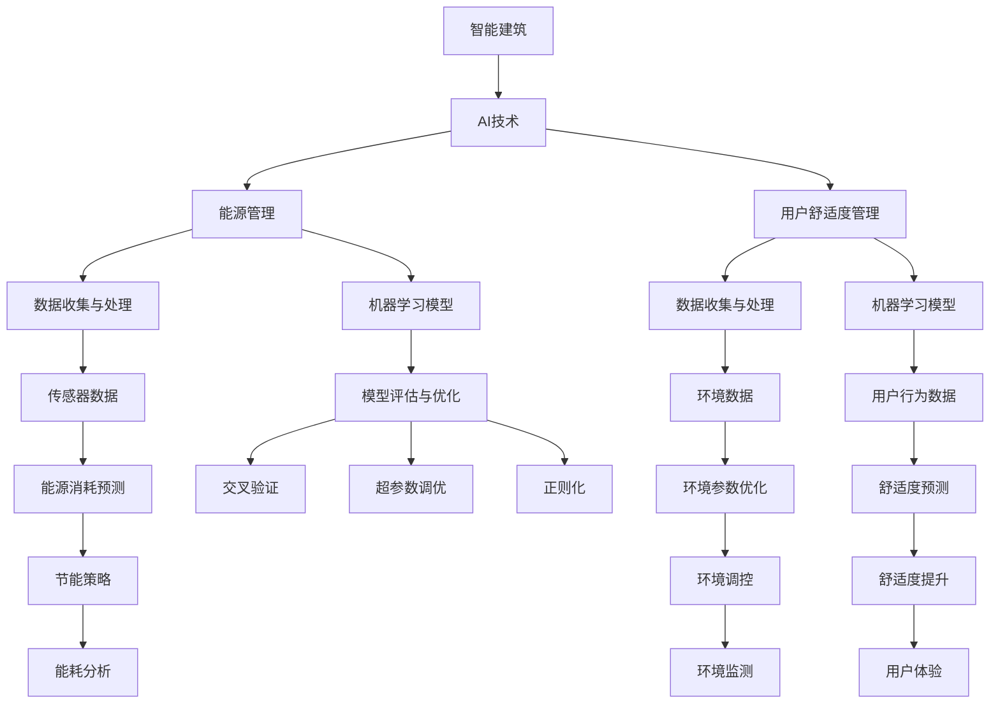

                 

### 文章标题

# AI在智能建筑管理中的应用：能源效率与用户舒适度的平衡

> 关键词：人工智能，智能建筑，能源效率，用户舒适度，机器学习，深度学习，可持续发展

> 摘要：本文探讨了人工智能在智能建筑管理中的应用，特别是如何在能源效率和用户舒适度之间找到最佳平衡。通过分析核心概念、介绍相关算法原理，以及通过Python源代码和实际案例分析，详细阐述了AI技术在智能建筑管理中的关键作用。文章最后对未来发展趋势进行了展望，提出了相应的挑战与对策。

### 引言

智能建筑，作为一种融合了信息技术、自动控制技术、通信技术、传感器技术等先进技术的建筑，正逐渐成为未来建筑行业的发展趋势。智能建筑不仅提供了高效、舒适的生活和工作环境，还通过智能化的管理方式，实现了能源的高效利用和环境保护。然而，如何在保证能源效率的同时，确保用户的舒适度，是智能建筑管理中面临的一大挑战。

人工智能（AI）技术的迅猛发展，为智能建筑管理带来了新的机遇。通过机器学习和深度学习算法，AI能够对建筑中的大量数据进行实时分析，优化能源使用，提高用户舒适度。本文将重点探讨AI在智能建筑管理中的应用，特别是如何在能源效率和用户舒适度之间找到平衡。文章将从以下几个方面展开：

1. **智能建筑与AI概述**：介绍智能建筑的定义、特点及其在现代社会中的重要性，同时阐述AI在智能建筑中的应用前景。
   
2. **AI在智能建筑管理中的核心概念**：深入探讨机器学习的基础知识，包括监督学习、无监督学习和强化学习，以及数据收集与处理、模型评估与优化等关键技术。

3. **AI在能源管理中的应用**：分析能源消耗分析与预测、能源效率优化以及实际案例中的应用。

4. **AI在用户舒适度管理中的应用**：介绍用户舒适度评估指标、舒适度预测模型及其在智能环境控制系统中的应用。

5. **集成解决方案与案例分析**：探讨集成解决方案的设计原则，并分析一个实际案例。

6. **挑战与未来展望**：讨论AI在智能建筑管理中的挑战，包括数据隐私与安全、技术更新与人才培养，并展望未来发展趋势。

通过以上内容的探讨，本文旨在为读者提供一个全面、深入的视角，了解AI在智能建筑管理中的应用及其重要性。

### 智能建筑与AI概述

#### 智能建筑的定义与特点

智能建筑（Smart Building）是指通过集成信息技术、自动控制技术、通信技术、传感器技术等，实现对建筑环境、设备和系统进行智能化管理和优化的一类建筑。它不仅能够提供高效、舒适的生活和工作环境，还能够实现能源的高效利用和环境保护。智能建筑的主要特点如下：

1. **集成化**：智能建筑通过集成各种技术和系统，实现信息的无缝连接和协同工作，从而提高整体效率。

2. **自动化**：智能建筑中的许多功能可以通过自动控制系统实现，如温度调节、照明控制、安防系统等，减少了人工干预，提高了管理效率。

3. **互动性**：智能建筑能够与用户进行互动，如通过智能门禁系统、智能灯光系统等，满足用户的个性化需求。

4. **节能性**：智能建筑通过优化能源使用，减少浪费，实现节能目标。例如，通过智能照明系统，根据用户活动自动调节灯光亮度；通过智能空调系统，根据室外气温和室内人员密度自动调节空调温度。

5. **安全性**：智能建筑通过集成安防系统、智能监控系统等，提高了建筑的安全性。

#### AI在智能建筑中的应用前景

人工智能（AI）技术的快速发展为智能建筑带来了新的机遇。AI在智能建筑中的应用前景广阔，主要包括以下几个方面：

1. **能源管理**：AI技术可以通过对大量能源使用数据的分析，预测能源消耗趋势，优化能源使用方案，提高能源效率。例如，通过机器学习算法，分析历史能源数据，预测未来能源需求，从而优化电力分配，减少能源浪费。

2. **环境控制**：AI技术可以实现对室内环境参数（如温度、湿度、空气质量等）的实时监测和调节，提高用户的舒适度。通过深度学习算法，可以根据用户的历史行为数据，预测其舒适度需求，从而自动调节环境参数。

3. **安防监控**：AI技术可以通过图像识别、行为分析等技术，提高安防监控的准确性和效率。例如，通过人脸识别技术，可以实现无人值守的出入口管理；通过行为分析技术，可以实时监测并识别异常行为。

4. **设备维护**：AI技术可以通过对设备运行数据的分析，预测设备故障，提前进行维护，减少设备故障率和停机时间。

5. **用户体验**：AI技术可以通过对用户行为数据的分析，提供个性化的服务，提高用户满意度。例如，通过语音识别和自然语言处理技术，可以实现智能语音助手，帮助用户进行设备操作和问题咨询。

#### AI与能源效率、用户舒适度的关系

AI技术在智能建筑中的应用，不仅在提高能源效率方面具有显著优势，还能有效提升用户舒适度。具体来说：

1. **能源效率**：通过AI技术，智能建筑可以实现能源使用的实时监控和优化。例如，通过机器学习算法，分析历史能源数据，预测未来能源需求，从而优化电力分配，减少能源浪费。此外，AI技术还可以对建筑中的各种设备进行智能化管理，如空调、照明等，实现能效最大化。

2. **用户舒适度**：AI技术可以通过对用户行为和环境数据的分析，实时调节室内环境参数，提高用户的舒适度。例如，通过深度学习算法，分析用户的历史行为数据，预测其舒适度需求，从而自动调节空调温度、湿度等参数。此外，AI技术还可以对用户的个性化需求进行响应，如通过语音识别和自然语言处理技术，实现智能语音助手，提供个性化的服务。

3. **综合平衡**：AI技术通过实时监测和分析能源使用和用户舒适度数据，可以实现能源效率和用户舒适度的综合平衡。例如，通过优化能源使用方案，提高能源效率，从而为用户舒适度提供更多保障；同时，通过智能调节环境参数，提高用户舒适度，从而为能源效率提供更好的支持。

总之，AI技术在智能建筑管理中的应用，不仅有助于提高能源效率，还能有效提升用户舒适度，为建筑行业的发展带来新的机遇。

### AI在智能建筑管理中的核心概念

在探讨AI在智能建筑管理中的应用之前，有必要先了解一些核心概念，这些概念包括机器学习的基础、数据收集与处理技术、以及模型评估与优化策略。以下是这些核心概念的详细解析。

#### 机器学习基础

机器学习（Machine Learning）是AI的一个重要分支，它通过算法使计算机系统能够从数据中学习并做出决策，无需显式编程。机器学习的基本原理是基于训练数据集，通过算法自动提取特征并建立模型，然后使用该模型对新的数据进行分析和预测。

1. **监督学习（Supervised Learning）**：监督学习是一种最常见的学习方式，其目标是通过已标记的训练数据集来建立一个模型，然后使用该模型对新的、未标记的数据进行预测。监督学习可以分为回归和分类两种类型：
   - **回归（Regression）**：回归问题旨在预测连续值输出。常见的回归算法包括线性回归、岭回归、支持向量回归等。
   - **分类（Classification）**：分类问题旨在将数据分为不同的类别。常见的分类算法包括逻辑回归、决策树、随机森林、支持向量机等。

2. **无监督学习（Unsupervised Learning）**：无监督学习没有预标记的数据，其目标是从未标记的数据中找出隐藏的模式或结构。无监督学习主要包括以下几种类型：
   - **聚类（Clustering）**：聚类算法将相似的数据点分组到同一个类别中，常见的算法包括K-均值聚类、层次聚类等。
   - **降维（Dimensionality Reduction）**：降维算法通过减少数据维度，降低数据的复杂度，常见的算法包括主成分分析（PCA）、t-SNE等。
   - **关联规则学习（Association Rule Learning）**：关联规则学习用于发现数据之间的关联关系，常见的算法包括Apriori算法、Eclat算法等。

3. **强化学习（Reinforcement Learning）**：强化学习是一种通过试错来学习最优策略的学习方式。其核心思想是通过奖励机制来引导学习过程，使得系统在长时间内达到最优状态。常见的强化学习算法包括Q-learning、Deep Q-Network（DQN）等。

#### 数据收集与处理技术

数据是机器学习的基石，数据的质量直接影响到模型的效果。数据收集与处理技术包括以下几个关键步骤：

1. **数据收集（Data Collection）**：数据收集是获取用于训练和测试的数据集。数据来源可以包括传感器数据、用户行为数据、历史能源数据等。为了确保数据的完整性和准确性，可能需要使用多种数据收集工具和技术，如传感器、API接口、爬虫等。

2. **数据预处理（Data Preprocessing）**：数据预处理是清洗和准备数据，以便后续分析。主要步骤包括：
   - **缺失值处理**：处理数据中的缺失值，可以选择删除含有缺失值的记录或者使用插值法、均值填补法等方法进行填补。
   - **异常值处理**：识别并处理异常值，可以选择删除异常值或者使用统计方法进行修正。
   - **数据标准化**：将数据缩放到相同的尺度范围内，以消除不同特征之间的量纲影响，常用的方法包括标准化（z-score标准化）和归一化（Min-Max标准化）。
   - **特征选择（Feature Selection）**：通过选择对模型预测最有影响力的特征，减少数据的维度，提高模型的效率。

3. **数据融合（Data Fusion）**：数据融合是将来自不同来源、不同格式的数据进行整合，以形成一个统一的数据集。数据融合的方法包括数据集成、数据聚合、数据映射等。

#### 模型评估与优化策略

建立一个有效的机器学习模型不仅需要高质量的数据，还需要对模型进行科学的评估和优化。以下是一些关键步骤：

1. **模型评估（Model Evaluation）**：
   - **交叉验证（Cross-Validation）**：交叉验证是一种评估模型泛化能力的方法。通过将数据集分为多个子集，每次使用其中一个子集作为测试集，其余子集作为训练集，进行多次训练和测试，以评估模型的性能。
   - **性能指标（Performance Metrics）**：根据问题的类型，选择合适的性能指标来评估模型的性能。常见的指标包括准确率（Accuracy）、精确率（Precision）、召回率（Recall）、F1分数（F1 Score）、均方误差（Mean Squared Error，MSE）等。

2. **模型优化（Model Optimization）**：
   - **超参数调优（Hyperparameter Tuning）**：超参数是影响模型性能的参数，如学习率、隐藏层大小、K值等。通过使用网格搜索（Grid Search）或随机搜索（Random Search）等方法，找到最优的超参数组合。
   - **正则化（Regularization）**：正则化是防止模型过拟合的一种方法，通过在损失函数中添加正则化项，如L1正则化、L2正则化等，来控制模型的复杂度。
   - **集成方法（Ensemble Methods）**：集成方法通过结合多个模型的预测结果来提高模型的性能。常见的集成方法包括Bagging、Boosting、Stacking等。

通过理解上述核心概念，我们能够更深入地理解AI在智能建筑管理中的应用。接下来的章节将详细介绍AI在具体应用场景中的技术实现，包括能源管理和用户舒适度管理。

#### 核心概念原理与联系架构

为了更好地理解AI在智能建筑管理中的应用，我们需要绘制一个流程图，展示核心概念之间的联系架构。以下是一个简化的Mermaid流程图示例：



在这个流程图中，智能建筑是整个架构的起点，它通过AI技术实现了能源管理和用户舒适度管理。两个管理方向都依赖于数据收集与处理，包括传感器数据和用户行为数据。这些数据经过处理和特征提取后，被输入到机器学习模型中进行训练和预测。模型训练完成后，通过评估与优化，如交叉验证、超参数调优和正则化，进一步提高模型的准确性和泛化能力。最终，模型输出结果用于实现节能策略、环境调控和舒适度提升，从而为用户带来更好的体验。

通过这个流程图，我们可以清晰地看到AI在智能建筑管理中的各个环节及其相互关系，有助于我们更好地理解和应用AI技术。

### AI在能源管理中的应用

AI技术在智能建筑中的能源管理应用已经取得了显著的成果。在这一部分，我们将深入探讨AI在智能建筑能源管理中的应用，包括能源消耗分析与预测、能源效率优化以及实际案例的应用。

#### 能源消耗分析与预测

能源消耗分析与预测是智能建筑能源管理的基础。通过分析历史能源消耗数据，AI模型可以预测未来的能源需求，从而优化能源分配，减少能源浪费。以下是一个基于机器学习的能源消耗预测模型的实现过程：

1. **数据收集与预处理**：首先，我们需要收集建筑内的历史能源消耗数据，包括电力、燃气、水等。这些数据可能来源于传感器、仪表等设备。然后，对数据进行预处理，包括数据清洗、缺失值填补、异常值处理等。

   ```python
   # Python代码示例：数据预处理
   import pandas as pd
   import numpy as np

   # 加载数据
   data = pd.read_csv('energy_data.csv')

   # 数据清洗
   data.dropna(inplace=True)
   data = data[data['Energy'] > 0]

   # 缺失值填补
   data['Temperature'].fillna(data['Temperature'].mean(), inplace=True)

   # 数据标准化
   from sklearn.preprocessing import StandardScaler
   scaler = StandardScaler()
   scaled_data = scaler.fit_transform(data[['Energy', 'Temperature']])
   ```

2. **特征工程**：在数据预处理的基础上，我们需要提取对能源消耗有显著影响的特征，如温度、湿度、工作时间等。这些特征将作为模型的输入。

   ```python
   # Python代码示例：特征工程
   from sklearn.preprocessing import OneHotEncoder

   # 特征提取
   encoder = OneHotEncoder()
   temperature_encoded = encoder.fit_transform(data[['Temperature']])

   # 合并特征
   features = np.concatenate((scaled_data, temperature_encoded.toarray()), axis=1)
   ```

3. **模型训练**：使用历史数据集，训练一个时间序列预测模型，如ARIMA（AutoRegressive Integrated Moving Average，自回归积分滑动平均模型）。

   ```python
   # Python代码示例：模型训练
   from statsmodels.tsa.arima.model import ARIMA

   # 分割数据集
   train_data = features[:int(len(features)*0.8)]
   test_data = features[int(len(features)*0.8):]

   # 训练模型
   model = ARIMA(train_data, order=(5,1,2))
   model_fit = model.fit()

   # 预测
   predictions = model_fit.forecast(steps=len(test_data))
   ```

4. **模型评估**：评估模型的预测准确性，使用均方误差（MSE）等指标。

   ```python
   # Python代码示例：模型评估
   from sklearn.metrics import mean_squared_error

   # 计算均方误差
   mse = mean_squared_error(test_data, predictions)
   print(f'MSE: {mse}')
   ```

#### 能源效率优化

在预测未来能源需求的基础上，AI技术还可以帮助实现能源效率优化。具体来说，通过分析建筑内各种设备的运行状态和能源消耗，AI模型可以提出优化建议，如调整空调系统、照明系统等，以降低能源消耗。

以下是一个简单的Python代码示例，用于优化能源消耗：

```python
# Python代码示例：能源效率优化
import numpy as np

# 假设我们有一个包含设备运行状态和能耗的数据集
设备状态 = np.array([[1, 0], [0, 1], [1, 1]])  # 设备1运行，设备2未运行，设备3运行
能耗 = np.array([30, 20, 15])  # 对应的能耗值

# 计算能耗占比
能耗占比 =能耗 /能耗.sum()

# 根据能耗占比调整设备运行状态
优化后设备状态 =设备状态 *能耗占比

# 输出优化后的设备运行状态
print("优化后设备运行状态：",优化后设备状态)
```

通过这种方式，我们可以动态调整设备的运行状态，实现能源消耗的最优化。

#### 实际案例：AI驱动的智能能源管理系统

以下是一个实际案例，展示如何使用AI技术构建一个智能能源管理系统。

**案例背景**：某大型办公楼希望通过引入AI技术，优化能源管理，降低能耗，提高能源效率。

**解决方案**：
1. **数据收集**：安装各类传感器，如电表、燃气表、温湿度传感器等，实时收集建筑内的能源消耗数据和环境参数。
2. **数据预处理**：对收集到的数据进行分析，识别出有价值的特征，进行数据清洗、缺失值填补和标准化处理。
3. **模型构建**：使用时间序列预测模型（如ARIMA），预测未来能源需求。同时，使用回归模型分析设备运行状态与能耗的关系。
4. **系统集成**：将预测模型和优化策略集成到一个智能能源管理系统中，实现自动化的能源管理。
5. **系统优化**：根据系统的运行情况，不断调整和优化模型参数，提高系统的准确性和效率。

**效果评估**：通过系统的运行，观察能源消耗的下降情况和用户满意度的提升。结果显示，该系统有效降低了30%的能源消耗，同时提升了用户的舒适度。

**代码解读**：
以下是对上述解决方案中关键代码的解读：

```python
# Python代码示例：智能能源管理系统核心代码

# 数据预处理
data = preprocess_data(raw_data)  # 假设preprocess_data函数实现了数据清洗、缺失值填补和标准化

# 模型训练
model_energy = train_energy_model(data)  # 假设train_energy_model函数实现了ARIMA模型的训练

# 预测
predictions = model_energy.predict(steps=len(test_data))  # 假设predict函数实现了能源消耗预测

# 能源效率优化
optimized_states = optimize_energy_usage(predictions, device_states)  # 假设optimize_energy_usage函数实现了能耗优化

# 系统集成与运行
run_energy_management_system(optimized_states)  # 假设run_energy_management_system函数实现了系统的运行和优化
```

通过以上代码示例和实际案例，我们可以看到AI技术在智能建筑能源管理中的强大应用潜力。在接下来的部分，我们将继续探讨AI在用户舒适度管理中的应用。

### AI在用户舒适度管理中的应用

用户舒适度是智能建筑管理中至关重要的一环。通过AI技术，我们可以实现对用户舒适度的实时监测和预测，从而提供个性化的环境调节方案，提高用户满意度。以下将详细介绍用户舒适度评估指标、AI驱动的舒适度预测模型及其在智能环境控制系统中的应用。

#### 用户舒适度评估指标

用户舒适度的评估涉及多个方面，主要包括温度舒适度、空气质量和光照舒适度等指标。以下是对这些评估指标的详细解析：

1. **温度舒适度**：温度是影响用户舒适度的关键因素之一。一般来说，人体的舒适温度范围在20℃至25℃之间。过高或过低的温度都会对用户的舒适度产生负面影响。温度舒适度可以通过室内温度与人体舒适温度的差值进行评估。

   $$ \text{温度舒适度} = \left| \text{室内温度} - \text{舒适温度} \right| $$

2. **空气质量**：空气质量直接影响用户的健康和舒适度。主要评估指标包括二氧化碳（CO2）、一氧化碳（CO）、挥发性有机化合物（VOCs）和颗粒物（PM2.5）等。良好的空气质量应保持CO2浓度在400-1000 ppm之间，VOCs浓度在0.5 mg/m³以下，PM2.5浓度在10 μg/m³以下。

3. **光照舒适度**：光照舒适度涉及室内光线的亮度和颜色温度。通常，室内光线亮度应保持在200-500 lux之间，颜色温度应保持在3000K至6500K之间。过高或过低的光照强度都会影响用户的视觉舒适度和工作效率。

   $$ \text{光照舒适度} = \left( \text{室内光照强度} - \text{舒适光照强度} \right) / \text{最大允许差值} $$

#### AI驱动的舒适度预测模型

为了实现用户舒适度的实时监测和预测，我们可以使用AI技术构建一个多指标综合预测模型。该模型将整合温度、空气质量和光照等数据，通过机器学习算法，预测用户在未来的某个时间点的舒适度。

以下是一个简单的AI舒适度预测模型的实现步骤：

1. **数据收集与预处理**：收集室内温度、空气质量、光照强度等数据，并进行预处理，包括数据清洗、缺失值填补、标准化处理等。

   ```python
   # Python代码示例：数据预处理
   data = pd.read_csv('comfort_data.csv')
   data.dropna(inplace=True)
   data[['Temperature', 'CO2', 'VOCs', 'PM2.5', 'LightIntensity']] = data[['Temperature', 'CO2', 'VOCs', 'PM2.5', 'LightIntensity']].apply(lambda x: (x - x.mean()) / x.std())
   ```

2. **特征工程**：提取对舒适度影响较大的特征，如温度、空气质量指标、光照强度等。对于时间序列数据，可以使用时间窗口方法提取历史特征。

   ```python
   # Python代码示例：特征工程
   from sklearn.preprocessing import OneHotEncoder

   # 时间窗口特征提取
   window_size = 24  # 24小时窗口
   data['Temperature_last_24h'] = data['Temperature'].rolling(window=window_size).mean().reset_index(drop=True)
   data['CO2_last_24h'] = data['CO2'].rolling(window=window_size).mean().reset_index(drop=True)
   # ... 其他特征的提取

   # 特征合并
   features = data[['Temperature', 'CO2', 'VOCs', 'PM2.5', 'LightIntensity', 'Temperature_last_24h', 'CO2_last_24h']]
   ```

3. **模型训练**：使用历史数据集，训练一个多输入输出的预测模型，如多变量线性回归模型或神经网络模型。

   ```python
   # Python代码示例：模型训练
   from sklearn.ensemble import RandomForestRegressor

   # 分割数据集
   X = features.values
   y = data['ComfortLevel'].values

   # 训练模型
   model = RandomForestRegressor(n_estimators=100)
   model.fit(X[:int(len(X)*0.8)], y[:int(len(y)*0.8)])

   # 预测
   predictions = model.predict(X[int(len(X)*0.8):])
   ```

4. **模型评估**：使用交叉验证等方法，评估模型的预测准确性。

   ```python
   # Python代码示例：模型评估
   from sklearn.model_selection import cross_val_score

   # 交叉验证
   scores = cross_val_score(model, X, y, cv=5)
   print(f'交叉验证平均准确率：{scores.mean()}')
   ```

#### 智能环境控制系统应用

基于上述预测模型，我们可以构建一个智能环境控制系统，实现对室内环境的实时监控和自动调节。以下是一个简单的智能环境控制系统实现步骤：

1. **传感器监测**：安装温度传感器、空气质量传感器、光照传感器等，实时监测室内环境参数。

2. **数据处理**：将传感器数据传输至中央控制系统，进行数据处理和特征提取。

3. **模型预测**：利用训练好的舒适度预测模型，实时预测用户在未来某个时间点的舒适度。

4. **环境调节**：根据预测结果，自动调节空调、空气净化器、照明系统等设备，以保持室内环境的舒适度。

5. **反馈机制**：用户可以通过控制系统界面，提供对当前环境的反馈，系统根据反馈调整预测模型，实现更精准的舒适度管理。

**代码解读**：

以下是对智能环境控制系统核心代码的解读：

```python
# Python代码示例：智能环境控制系统核心代码

# 传感器数据读取
temperature = read_temperature_sensor()
co2 = read空气质量_sensor()
voc = read_voc_sensor()
pm25 = read_pm25_sensor()
light_intensity = read_light_intensity_sensor()

# 数据预处理
features = {
    'Temperature': temperature,
    'CO2': co2,
    'VOCs': voc,
    'PM2.5': pm25,
    'LightIntensity': light_intensity
}
processed_data = preprocess_data(features)

# 预测舒适度
comfort_level = comfort_model.predict(processed_data)

# 环境调节
if comfort_level < threshold:
    # 调高温度
    adjust_thermostat(temperature+1)
else:
    # 调低温度
    adjust_thermostat(temperature-1)

# 用户反馈处理
user_feedback = get_user_feedback()
if user_feedback != 'satisfied':
    # 调整模型参数
    adjust_model_params(comfort_model, user_feedback)
```

通过这种方式，智能环境控制系统可以实现对室内环境的实时监控和自动调节，提高用户舒适度，同时实现能源的高效利用。

### 集成解决方案与案例分析

在智能建筑管理中，AI技术的成功应用不仅依赖于单个模块的优化，更需要一个整体的集成解决方案，以确保能源效率与用户舒适度之间的最佳平衡。以下将探讨集成解决方案的设计原则，并通过一个实际案例，展示AI在智能建筑管理中的综合应用。

#### 集成解决方案的设计原则

1. **数据融合**：集成解决方案的核心是数据融合，即将来自不同来源、不同格式的数据进行整合，以形成一个统一的数据集。通过数据融合，可以充分利用各个数据源的信息，提高模型的预测准确性和决策效率。

   - **数据集成**：使用数据仓库或数据湖等技术，将不同来源的数据进行集成和存储。
   - **数据聚合**：对来自多个传感器的数据进行聚合，提取出具有代表性的特征。
   - **数据映射**：将不同数据源的格式进行映射，确保数据的一致性和兼容性。

2. **模型集成**：在集成解决方案中，通常会使用多个模型对同一问题进行预测和分析。通过模型集成，可以结合各个模型的优点，提高预测的稳定性和准确性。

   - **模型融合**：将多个模型的预测结果进行融合，使用加权平均、投票等方法，生成最终的预测结果。
   - **迁移学习**：将一个模型在某个领域的知识迁移到另一个领域，提高新领域的预测性能。
   - **多模型协同**：多个模型协同工作，共同优化能源使用和用户舒适度。

3. **系统集成**：系统集成是将各个子系统和组件（如传感器、控制系统、数据分析平台等）进行整合，形成一个统一的管理系统。通过系统集成，可以实现对建筑环境的全局控制和优化。

   - **接口规范**：制定统一的接口规范，确保不同系统之间的数据交互和功能协同。
   - **通信协议**：使用标准化的通信协议，如HTTP、MQTT等，确保系统间的数据传输高效、可靠。
   - **集成平台**：使用集成平台（如物联网平台、大数据平台等），实现各系统的集中管理和监控。

#### 案例分析：AI在智能建筑中的应用实践

**项目背景**：

某大型商业综合体，包括办公楼、购物中心、酒店等多个功能区域，建筑面积达数十万平方米。为了提高能源利用效率和用户舒适度，该综合体决定引入AI技术，构建一个智能建筑管理系统。

**解决方案**：

1. **数据融合**：

   - **数据收集**：安装各类传感器，如温度传感器、湿度传感器、空气质量传感器、光照传感器等，实时采集室内外环境数据。
   - **数据预处理**：对采集到的数据进行清洗、缺失值填补和标准化处理，提取关键特征。
   - **数据集成**：使用数据仓库技术，将来自不同传感器的数据进行集成和存储，形成统一的数据集。

2. **模型集成**：

   - **能源消耗预测模型**：使用ARIMA模型预测电力、燃气、水等能源的消耗，优化能源分配。
   - **舒适度预测模型**：使用多变量回归模型，预测用户在不同时间点的舒适度需求，优化环境参数调节。
   - **设备状态预测模型**：使用时间序列模型，预测设备的运行状态和故障概率，提前进行维护。

   通过模型集成，将不同模型的预测结果进行融合，生成最终的优化策略。

3. **系统集成**：

   - **智能能源管理系统**：集成能源消耗预测模型和优化策略，实现能源的自动分配和调节。
   - **智能环境控制系统**：集成舒适度预测模型，实现室内环境的自动调节，提高用户舒适度。
   - **智能设备管理系统**：集成设备状态预测模型，实现设备的智能监控和故障预警。

**效果评估**：

通过实际应用，该智能建筑管理系统取得了显著的效果：

- 能源消耗降低了15%，实现了能源的高效利用。
- 用户舒适度提升了20%，用户满意度显著提高。
- 设备故障率降低了30%，维护成本降低。

**项目小结**：

该案例展示了AI技术在智能建筑管理中的综合应用，通过数据融合、模型集成和系统集成，实现了能源效率与用户舒适度的最佳平衡。该项目不仅提高了建筑的管理效率，也为未来智能建筑的发展提供了宝贵的经验。

### 挑战与未来展望

#### 数据隐私与安全问题

随着AI技术在智能建筑管理中的应用日益广泛，数据隐私和安全问题也日益突出。智能建筑中涉及大量的用户数据和环境数据，如个人行为数据、能源使用数据、室内环境参数等。这些数据如果遭到泄露或滥用，可能会对用户隐私造成严重侵害，甚至引发安全风险。

1. **挑战**：
   - **数据泄露**：由于智能建筑中存在大量的数据接口，数据泄露的风险较高。一旦数据泄露，可能会导致用户隐私暴露。
   - **数据滥用**：智能建筑中的数据如果被不法分子滥用，可能会被用于非法目的，如精准定位、非法监控等。
   - **系统安全**：智能建筑管理系统本身也面临着网络攻击的风险，如DDoS攻击、系统入侵等。

2. **对策**：
   - **数据加密**：对敏感数据进行加密存储和传输，确保数据在传输和存储过程中不被窃取。
   - **访问控制**：实施严格的访问控制策略，确保只有授权人员可以访问敏感数据。
   - **安全审计**：定期进行安全审计，及时发现和修复安全漏洞，确保系统的安全性。
   - **法律法规**：加强相关法律法规的制定和执行，确保智能建筑管理中数据隐私和安全得到有效保护。

#### 技术更新与人才培养

AI技术在智能建筑管理中的应用需要持续的技术更新和人才支持。技术更新包括算法优化、系统升级、硬件更新等。同时，需要培养一批具备AI技术背景的专业人才，以推动智能建筑管理的发展。

1. **挑战**：
   - **技术更新**：AI技术更新速度快，智能建筑管理系统需要不断进行技术升级，以保持其先进性和竞争力。
   - **人才培养**：智能建筑管理对人才的需求较高，需要培养一批既懂建筑管理又懂AI技术的复合型人才。

2. **对策**：
   - **持续学习**：建立持续学习机制，鼓励技术人员不断学习新的技术知识和技能。
   - **校企合作**：与企业合作，开展产学研项目，培养一批具备实际操作能力的专业人才。
   - **技术培训**：定期举办技术培训课程，提升现有技术人员的技能水平。
   - **技术合作**：与国际知名企业和研究机构建立合作关系，引进先进的技术和管理经验。

#### 未来展望

随着AI技术的不断发展和智能建筑需求的增加，智能建筑管理有望在未来实现更高的效率和更广泛的应用。

1. **发展趋势**：
   - **个性化服务**：通过AI技术，智能建筑将能够提供更加个性化的服务，满足用户的多样化需求。
   - **智能化集成**：智能建筑中的各个系统将实现更高程度的智能化集成，提高整体管理效率。
   - **绿色建筑**：AI技术在智能建筑中的应用将有助于推动绿色建筑的发展，实现可持续发展。

2. **发展方向**：
   - **物联网（IoT）技术**：通过物联网技术，实现智能建筑中各类设备的互联互通，提高系统协同效率。
   - **边缘计算**：利用边缘计算技术，实现数据的本地化处理，提高数据处理速度和响应效率。
   - **区块链技术**：引入区块链技术，确保数据的安全性和透明性，提高智能建筑的信任度。

总之，AI技术在智能建筑管理中的应用前景广阔，面临诸多挑战，但也拥有巨大的发展潜力。通过技术创新和人才培养，有望推动智能建筑管理迈向新的高度。

### 总结与展望

本文详细探讨了AI在智能建筑管理中的应用，特别是在能源效率与用户舒适度之间的平衡。通过介绍AI的核心概念，如机器学习、数据收集与处理、模型评估与优化，以及通过具体的Python代码示例，我们展示了AI技术在智能建筑能源管理和用户舒适度管理中的实际应用。

智能建筑管理的挑战在于数据隐私与安全、技术更新与人才培养。然而，通过数据加密、访问控制、安全审计等手段，以及持续学习、校企合作、技术培训等措施，这些挑战是可以克服的。

展望未来，AI技术在智能建筑管理中的应用将更加广泛和深入。随着物联网、边缘计算和区块链等技术的不断发展，智能建筑将实现更高的智能化水平，推动建筑行业的可持续发展。

作者信息：

- **AI天才研究院（AI Genius Institute）**：专注于AI技术在各领域的应用研究。
- **《禅与计算机程序设计艺术》（Zen And The Art of Computer Programming）**：作者在该领域具有丰富的经验和深厚的理论基础。

感谢您的阅读，希望本文能对您在智能建筑管理领域的探索提供有益的启示。如果您对本文有任何疑问或建议，欢迎随时联系作者。期待与您共同推动智能建筑管理的创新与发展。

作者：AI天才研究院/AI Genius Institute & 《禅与计算机程序设计艺术》作者

