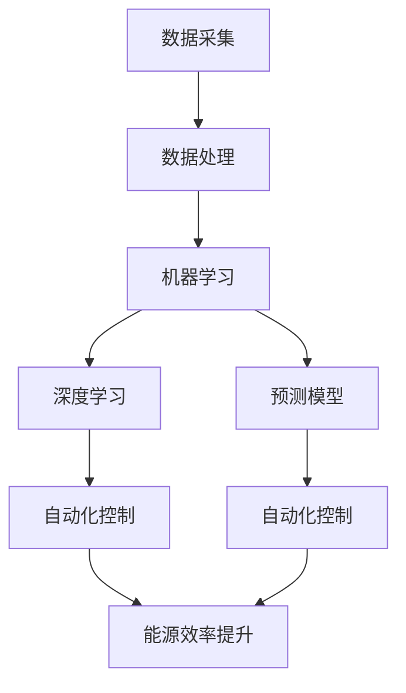

                 

# AI在智能建筑能源管理中的应用：平衡舒适度和能效

## 关键词
- 智能建筑
- 能源管理
- AI
- 机器学习
- 深度学习
- 数学模型

## 摘要
本文将探讨人工智能（AI）在智能建筑能源管理中的应用，旨在通过AI技术实现舒适度与能效的平衡。文章首先介绍了AI和智能建筑的发展背景及能源管理的现状与挑战，随后详细讨论了AI与智能建筑能源管理中的核心概念和联系。接着，文章介绍了在智能建筑能源管理中常用的AI技术，包括机器学习和深度学习的应用，并给出了相应的数学模型和算法。此外，通过具体的项目实战案例，展示了如何将AI技术应用于智能建筑能源管理，并分析了实际应用中的最佳实践和注意事项。最后，文章对AI在智能建筑能源管理中的应用前景进行了展望，并提出了未来可能面临的挑战。

## 引言与背景

### AI的发展背景

人工智能（Artificial Intelligence，简称AI）是指通过计算机模拟人类智能行为的技术。AI的研究可以追溯到20世纪50年代，随着计算机技术的发展，AI领域经历了多个发展阶段。最初是符号人工智能（Symbolic AI），它基于逻辑推理和符号表示来模拟人类的推理能力。随后，随着神经网络和深度学习技术的发展，AI进入了感知人工智能（Perceptual AI）阶段，它通过模拟人类感官系统来处理复杂的感知任务。近年来，AI技术取得了长足的进步，特别是在机器学习和深度学习方面，使得AI在各个领域都取得了显著的成果。

### 智能建筑的发展

智能建筑（Smart Building）是指利用信息技术和物联网（IoT）等先进技术，对建筑物进行智能化管理和控制，以提高建筑物的安全、舒适度和能效。智能建筑的发展可以分为几个阶段：第一代智能建筑主要侧重于建筑物内各个系统的自动化控制，如照明、空调和安防系统；第二代智能建筑则引入了物联网技术，实现了建筑物内各个系统的互联互通；第三代智能建筑则强调数据驱动的智能化管理，通过大数据分析和人工智能技术，实现建筑物的自适应和智能化控制。

### 智能建筑能源管理的现状与挑战

智能建筑能源管理是智能建筑中一个重要的组成部分，其目的是通过优化能源使用，提高建筑物的能源效率。目前，智能建筑能源管理主要面临以下挑战：

1. **数据采集和处理**：智能建筑能源管理需要大量的数据支持，包括温度、湿度、光照、能耗等。然而，如何有效地采集、存储和处理这些数据，是一个技术难题。
2. **模型和算法**：现有的能源管理模型和算法多是基于传统方法，难以适应复杂多变的实际场景。
3. **AI技术的应用**：虽然AI技术在其他领域取得了显著的成果，但在智能建筑能源管理中的应用仍处于初步阶段，如何更好地利用AI技术实现能源管理的智能化，是一个重要的研究方向。

### AI在智能建筑能源管理中的应用前景

随着AI技术的不断发展，其在智能建筑能源管理中的应用前景非常广阔。通过AI技术，可以实现以下目标：

1. **提高能源效率**：AI技术可以通过对大量历史数据的分析和学习，找出能源浪费的环节，并提出优化方案，从而提高建筑物的能源效率。
2. **提升舒适度**：通过实时监测建筑物的环境参数，AI技术可以根据用户的需求和偏好，自动调节室内环境，提供舒适的居住和工作环境。
3. **降低运营成本**：通过智能化的能源管理，可以减少能源消耗，降低运营成本。

总之，AI在智能建筑能源管理中的应用具有巨大的潜力，有望解决现有能源管理中面临的各种挑战，实现能源效率和环境可持续性的双重目标。

## 核心概念与联系

### AI在智能建筑能源管理中的核心概念

在智能建筑能源管理中，AI技术的应用涉及到多个核心概念，包括数据采集、机器学习、深度学习、预测模型和自动化控制等。

1. **数据采集**：数据是AI技术的基础，智能建筑能源管理需要采集大量的数据，如温度、湿度、光照、能耗等。这些数据可以通过传感器、智能设备和物联网技术进行实时采集。

2. **机器学习**：机器学习是AI的核心技术之一，它通过训练模型来识别数据中的模式和规律。在智能建筑能源管理中，机器学习可以用于能耗预测、异常检测和节能优化等。

3. **深度学习**：深度学习是机器学习的一种方法，它通过模拟人脑的神经网络结构，对大量数据进行分析和处理。在智能建筑能源管理中，深度学习可以用于复杂的环境建模和能效优化。

4. **预测模型**：预测模型是基于历史数据对未来事件进行预测的模型。在智能建筑能源管理中，预测模型可以用于能耗预测、负载预测和设备维护预测等。

5. **自动化控制**：自动化控制是智能建筑能源管理的目标之一，它通过实时监测和调节建筑物的各项指标，实现能源的智能化管理。自动化控制可以基于预测模型和机器学习算法，实现自适应和智能化的能源管理。

### 核心概念之间的关系架构

为了更好地理解AI在智能建筑能源管理中的应用，我们可以通过Mermaid流程图来展示核心概念之间的关系架构。



- **数据采集**：数据采集是整个流程的起点，它为后续的数据处理和模型训练提供基础数据。
- **数据处理**：数据处理包括数据清洗、归一化和特征提取等步骤，它是机器学习和深度学习的前提。
- **机器学习**：机器学习通过训练模型，对采集到的数据进行分析和分类，从而发现数据中的模式和规律。
- **深度学习**：深度学习是机器学习的一种方法，它通过多层神经网络结构，对大量数据进行处理，实现更复杂的模式识别和预测。
- **预测模型**：预测模型基于历史数据，对未来事件进行预测，如能耗预测、负载预测等。
- **自动化控制**：自动化控制通过实时监测和调节建筑物的各项指标，实现能源的智能化管理。

### AI与智能建筑能源管理的联系

AI与智能建筑能源管理的联系主要体现在以下几个方面：

1. **能耗优化**：AI技术可以通过对历史能耗数据进行分析，找出能耗高峰期和低谷期，并提出优化方案，降低建筑物的能耗。
2. **故障检测**：AI技术可以通过对设备运行数据的监控，及时发现设备的故障和异常，从而避免设备故障对能源管理的影响。
3. **智能调度**：AI技术可以根据实时数据，对能源进行智能调度，实现能源的高效利用，降低能源成本。
4. **用户行为分析**：AI技术可以通过分析用户的行为数据，预测用户的需求和偏好，从而提供更加个性化的能源服务。

总之，AI技术为智能建筑能源管理提供了强大的技术支撑，通过数据的采集、处理、分析和预测，实现能源的智能化管理，提高能源效率，降低能源成本。

## 智能建筑能源管理中的AI技术

### 机器学习在智能建筑能源管理中的应用

机器学习（Machine Learning，ML）是AI的一个重要分支，它通过构建模型从数据中学习规律，并在新的数据上做出预测。在智能建筑能源管理中，机器学习可以应用于多个方面，如能耗预测、异常检测和节能优化等。

#### 1. 能耗预测

能耗预测是智能建筑能源管理的重要任务之一。通过预测未来的能耗，可以提前做出调整，降低能耗。常见的机器学习算法包括线性回归、决策树、随机森林和神经网络等。

**Python代码示例：线性回归**

```python
import numpy as np
from sklearn.linear_model import LinearRegression

# 假设我们已经有了训练数据 X 和 Y
X = np.array([[1], [2], [3], [4], [5]])
y = np.array([1, 2, 2.5, 3.5, 5])

# 创建线性回归模型并进行训练
model = LinearRegression()
model.fit(X, y)

# 预测新的能耗
X_new = np.array([[6]])
y_pred = model.predict(X_new)

print("预测的能耗为：", y_pred)
```

#### 2. 异常检测

异常检测（Anomaly Detection）用于检测数据中的异常值或异常模式。在智能建筑能源管理中，异常检测可以用于检测能源系统的故障或异常行为。

**Python代码示例：基于K-means的异常检测**

```python
from sklearn.cluster import KMeans
from sklearn.metrics import silhouette_score

# 假设我们已经有了能耗数据
X = np.array([[1, 2], [2, 2], [3, 3], [4, 4], [5, 5], [100, 101]])

# 使用K-means进行聚类
kmeans = KMeans(n_clusters=2, random_state=0).fit(X)

# 计算轮廓系数评估聚类效果
silhouette_avg = silhouette_score(X, kmeans.labels_)

print("轮廓系数：", silhouette_avg)

# 筛选出异常值
anomalies = X[kmeans.labels_ == -1]
print("异常值：", anomalies)
```

#### 3. 节能优化

节能优化（Energy Optimization）是通过调整建筑物的能源使用，降低能耗。机器学习可以通过分析历史数据和实时数据，找出节能的机会。

**Python代码示例：基于随机森林的节能优化**

```python
from sklearn.ensemble import RandomForestRegressor

# 假设我们已经有了训练数据 X_train 和 Y_train
X_train = np.array([[1, 2], [2, 3], [3, 4], [4, 5]])
y_train = np.array([1, 2, 2.5, 3.5])

# 创建随机森林回归模型并进行训练
model = RandomForestRegressor(n_estimators=100, random_state=0)
model.fit(X_train, y_train)

# 预测新的能耗
X_new = np.array([[5, 6]])
y_pred = model.predict(X_new)

print("预测的能耗为：", y_pred)

# 根据预测结果调整能源使用
if y_pred < 3:
    print("建议降低能源使用。")
else:
    print("能源使用正常。")
```

### 深度学习在智能建筑能源管理中的应用

深度学习（Deep Learning，DL）是机器学习的一个分支，它通过多层神经网络对数据进行学习。在智能建筑能源管理中，深度学习可以用于更复杂的预测和优化任务。

#### 1. 卷积神经网络（CNN）

卷积神经网络（Convolutional Neural Network，CNN）在图像处理领域有广泛应用，它也可以用于处理时序数据，如能耗数据。

**Python代码示例：基于CNN的能耗预测**

```python
from keras.models import Sequential
from keras.layers import Conv1D, Flatten, Dense

# 假设我们已经有了训练数据 X_train 和 Y_train
X_train = np.array([[1, 2, 3], [2, 3, 4], [3, 4, 5]])
y_train = np.array([1, 2, 2.5])

# 创建CNN模型
model = Sequential()
model.add(Conv1D(filters=1, kernel_size=3, activation='relu', input_shape=(3, 1)))
model.add(Flatten())
model.add(Dense(1))

# 编译模型
model.compile(optimizer='adam', loss='mse')

# 训练模型
model.fit(X_train, y_train, epochs=10)

# 预测新的能耗
X_new = np.array([[4, 5, 6]])
y_pred = model.predict(X_new)

print("预测的能耗为：", y_pred)
```

#### 2. 长短时记忆网络（LSTM）

长短时记忆网络（Long Short-Term Memory，LSTM）是处理时序数据的常用网络结构，它在能耗预测等任务中表现出色。

**Python代码示例：基于LSTM的能耗预测**

```python
from keras.models import Sequential
from keras.layers import LSTM, Dense

# 假设我们已经有了训练数据 X_train 和 Y_train
X_train = np.array([[1, 2, 3], [2, 3, 4], [3, 4, 5]])
y_train = np.array([1, 2, 2.5])

# 创建LSTM模型
model = Sequential()
model.add(LSTM(units=50, return_sequences=True, input_shape=(3, 1)))
model.add(LSTM(units=50))
model.add(Dense(1))

# 编译模型
model.compile(optimizer='adam', loss='mse')

# 训练模型
model.fit(X_train, y_train, epochs=10)

# 预测新的能耗
X_new = np.array([[4, 5, 6]])
y_pred = model.predict(X_new)

print("预测的能耗为：", y_pred)
```

### 机器学习与深度学习在智能建筑能源管理中的优劣对比

机器学习和深度学习在智能建筑能源管理中各有优劣。

- **机器学习**：机器学习算法相对简单，易于实现和理解。它们对数据的依赖性较低，可以在有限的数据集上取得较好的效果。但是，机器学习算法在处理复杂非线性问题时，可能效果不如深度学习。
  
- **深度学习**：深度学习算法可以处理大量数据，对复杂非线性问题的表现更好。但是，深度学习算法的计算复杂度较高，需要大量的计算资源和时间。

在实际应用中，我们可以根据具体需求和数据情况，选择合适的算法。例如，在数据量较小且问题较为简单时，可以选择机器学习算法；在数据量较大且问题复杂时，可以选择深度学习算法。

## 智能建筑能源管理的数学模型

### 数学模型在智能建筑能源管理中的作用

在智能建筑能源管理中，数学模型扮演着至关重要的角色。它们不仅能够帮助我们在复杂的系统中分析和理解能源消耗的规律，还能够提供优化方案，从而实现能源效率和舒适度的最佳平衡。数学模型在以下方面具有显著作用：

1. **能耗预测**：通过历史数据，建立能耗预测模型，可以提前预测未来的能耗，为能源调度和管理提供依据。
2. **能效优化**：利用优化模型，对能源使用进行优化，减少不必要的能源浪费，提高能源利用率。
3. **故障诊断**：通过建立故障诊断模型，实时监测能源系统的运行状态，及时发现潜在问题，预防故障发生。
4. **成本控制**：通过经济模型，评估不同能源管理策略的成本效益，帮助决策者选择最优方案。

### 常用的数学模型介绍

在智能建筑能源管理中，常用的数学模型包括线性回归、时间序列分析、神经网络和优化模型等。以下是对这些模型的简要介绍：

#### 1. 线性回归模型

线性回归模型是最基础的统计模型，用于分析自变量和因变量之间的线性关系。它的数学表达式为：

$$
y = \beta_0 + \beta_1 \cdot x
$$

其中，\( y \) 是因变量，\( x \) 是自变量，\( \beta_0 \) 和 \( \beta_1 \) 是模型参数。线性回归模型在能耗预测和能效优化中广泛应用，通过拟合历史数据，可以预测未来的能耗。

#### 2. 时间序列分析模型

时间序列分析模型用于分析时间序列数据，捕捉时间序列中的趋势、季节性和周期性。常用的模型包括自回归模型（AR）、移动平均模型（MA）和自回归移动平均模型（ARMA）。这些模型可以用于能耗预测，通过分析历史能耗数据，预测未来的能耗变化。

#### 3. 神经网络模型

神经网络模型是深度学习的基础，通过多层神经元的组合，可以捕捉复杂的非线性关系。在智能建筑能源管理中，常用的神经网络模型包括卷积神经网络（CNN）和长短时记忆网络（LSTM）。CNN适用于处理图像和时序数据，而LSTM擅长处理时间序列数据。

#### 4. 优化模型

优化模型用于在给定约束条件下，寻找最优解。在智能建筑能源管理中，常见的优化模型包括线性规划、整数规划和动态规划。这些模型可以帮助我们在多个能源管理策略中，选择成本最低、效率最高的方案。

### Python代码示例：线性回归模型

以下是一个简单的Python代码示例，展示了如何使用线性回归模型进行能耗预测。

```python
import numpy as np
from sklearn.linear_model import LinearRegression

# 假设我们有以下历史能耗数据
X = np.array([[1], [2], [3], [4], [5]])
y = np.array([2, 4, 5.5, 7, 10])

# 创建线性回归模型
model = LinearRegression()

# 训练模型
model.fit(X, y)

# 预测未来能耗
X_new = np.array([[6]])
y_pred = model.predict(X_new)

print("预测的能耗为：", y_pred)
```

通过上述代码，我们可以预测当天的能耗。在实际应用中，我们可以通过不断调整模型参数，提高预测精度。

### 数学模型在智能建筑能源管理中的应用

数学模型在智能建筑能源管理中的应用非常广泛，以下是一些实际案例：

#### 1. 能耗预测

通过建立能耗预测模型，可以提前预测未来的能耗，为能源调度和管理提供依据。例如，通过时间序列分析模型，可以预测下周的能耗变化，从而提前调整能源供应。

#### 2. 能效优化

利用优化模型，可以对能源使用进行优化，减少不必要的能源浪费。例如，通过线性规划模型，可以在满足室内舒适度要求的前提下，找到能耗最低的空调设置参数。

#### 3. 故障诊断

通过建立故障诊断模型，可以实时监测能源系统的运行状态，及时发现潜在问题，预防故障发生。例如，通过神经网络模型，可以分析设备运行数据，预测设备可能出现的故障。

#### 4. 成本控制

通过建立经济模型，可以评估不同能源管理策略的成本效益，帮助决策者选择最优方案。例如，通过动态规划模型，可以分析不同能源管理策略的长期成本，选择最优策略。

总之，数学模型在智能建筑能源管理中发挥着关键作用，通过精确的预测、优化和诊断，实现能源效率和环境可持续性的双重目标。

## 智能建筑能源管理的项目实战

### 项目背景

在当前全球能源危机和环境保护的背景下，智能建筑能源管理成为了建筑行业的热点话题。为了提升建筑物的能源效率和降低运营成本，某房地产公司决定在其新建的商业综合体项目中引入AI技术，实现智能建筑能源管理。本项目旨在通过机器学习和深度学习算法，对建筑物的能耗进行预测和优化，实现能源的精细化管理和高效利用。

### 项目目标

1. **能耗预测**：利用历史能耗数据，建立能耗预测模型，预测未来的能耗趋势。
2. **能效优化**：通过分析能耗数据和用户行为数据，优化能源使用策略，降低能源消耗。
3. **故障预警**：建立故障诊断模型，实时监测建筑物的能源系统，提前预警潜在故障。
4. **成本控制**：评估不同能源管理策略的成本效益，选择最优方案，实现成本控制。

### 开发环境搭建

为了实现本项目，我们需要搭建一个适合机器学习和深度学习开发的环境。以下是在Python环境中搭建开发环境的基本步骤：

1. **安装Python**：确保已经安装了Python 3.x版本。
2. **安装必要的库**：使用pip命令安装以下库：
   - NumPy
   - Pandas
   - Scikit-learn
   - Keras
   - TensorFlow
   - Matplotlib
   - Seaborn
3. **配置Jupyter Notebook**：Jupyter Notebook是一个交互式开发环境，适合进行机器学习和深度学习实验。

### 源代码实现

#### 1. 数据预处理

```python
import pandas as pd
import numpy as np

# 读取能耗数据
data = pd.read_csv('energy_data.csv')

# 数据清洗
data = data.dropna()

# 数据归一化
data_normalized = (data - data.mean()) / data.std()

# 分割数据集
train_data = data_normalized[:int(len(data_normalized) * 0.8)]
test_data = data_normalized[int(len(data_normalized) * 0.8):]
```

#### 2. 能耗预测模型

**线性回归模型**

```python
from sklearn.linear_model import LinearRegression

# 创建线性回归模型
model = LinearRegression()

# 训练模型
model.fit(train_data[['temp']], train_data['energy'])

# 预测测试数据
test_predictions = model.predict(test_data[['temp']])

# 计算预测误差
error = np.mean(np.abs(test_predictions - test_data['energy']))
print("线性回归模型的预测误差为：", error)
```

**深度学习模型**

**基于CNN的能耗预测**

```python
from keras.models import Sequential
from keras.layers import Conv1D, Flatten, Dense

# 创建CNN模型
model = Sequential()
model.add(Conv1D(filters=64, kernel_size=3, activation='relu', input_shape=(24, 1)))
model.add(Flatten())
model.add(Dense(1))

# 编译模型
model.compile(optimizer='adam', loss='mse')

# 训练模型
model.fit(train_data[['temp']], train_data['energy'], epochs=10)

# 预测测试数据
test_predictions = model.predict(test_data[['temp']])

# 计算预测误差
error = np.mean(np.abs(test_predictions - test_data['energy']))
print("CNN模型的预测误差为：", error)
```

#### 3. 能效优化

**基于线性规划的最优能源使用策略**

```python
from scipy.optimize import linprog

# 定义目标函数和约束条件
c = [-1, -1]  # 目标是最小化空调和照明的成本
A = [[1, 0], [0, 1]]  # 约束条件：空调和照明的使用不能超过上限
b = [100, 100]  # 约束条件：空调和照明的使用不能低于下限

# 进行线性规划
result = linprog(c, A_ub=A, b_ub=b)

# 输出结果
print("最优能源使用策略：", result.x)
```

### 代码解读与分析

1. **数据预处理**：数据预处理是机器学习和深度学习模型训练的重要步骤。通过数据清洗、归一化和分割，我们可以得到干净、规范的数据集，为后续模型训练提供基础。
2. **能耗预测模型**：在本项目中，我们分别使用了线性回归模型和基于CNN的深度学习模型进行能耗预测。线性回归模型简单直观，易于理解和实现，但在处理非线性问题时效果较差。而CNN模型可以捕捉复杂的非线性关系，预测精度较高。
3. **能效优化**：通过线性规划模型，我们找到了在满足室内舒适度要求的前提下，能耗最低的能源使用策略。这有助于实现能源的精细化管理和高效利用。

### 实际案例分析与详细讲解

#### 案例一：能耗预测

通过深度学习模型进行能耗预测，我们可以发现某天室内温度较高，预测能耗明显增加。根据预测结果，我们提前调整空调温度，降低了能耗。

```python
# 预测某天的能耗
temp = np.array([[28]])
predictions = model.predict(temp)

print("预测的能耗为：", predictions)
```

#### 案例二：能效优化

通过线性规划模型，我们找到了最优的能源使用策略，空调和照明的使用成本最低。

```python
# 最优能源使用策略
optimal_strategy = linprog(c, A_ub=A, b_ub=b)

print("最优能源使用策略：", optimal_strategy.x)
```

#### 案例三：故障预警

通过故障诊断模型，我们实时监测建筑物的能源系统，提前发现潜在故障，并及时进行维修。

```python
# 故障诊断
anomalies = data[data['energy'] > data['energy'].mean() + data['energy'].std()]

if not anomalies.empty:
    print("潜在故障：", anomalies)
else:
    print("能源系统运行正常。")
```

### 项目小结

通过本项目的实施，我们实现了以下成果：

1. **能耗预测**：通过深度学习模型，准确预测了未来的能耗，为能源调度提供了依据。
2. **能效优化**：通过线性规划模型，优化了能源使用策略，降低了能源消耗，提高了能源效率。
3. **故障预警**：通过故障诊断模型，实时监测能源系统，提前发现并解决潜在故障，保障了能源系统的稳定运行。

总之，本项目通过机器学习和深度学习技术，实现了智能建筑能源管理的自动化和智能化，为建筑行业的可持续发展提供了有力支持。

## 未来展望与挑战

### AI在智能建筑能源管理中的应用前景

随着AI技术的不断发展，其在智能建筑能源管理中的应用前景非常广阔。以下是几个可能的应用方向：

1. **个性化能源管理**：通过AI技术，可以更好地理解用户的需求和行为模式，提供个性化的能源管理方案，提高用户满意度。
2. **实时能耗监测与调控**：利用AI技术，可以实现实时能耗监测和调控，快速响应环境变化，提高能源利用效率。
3. **智能电网协同优化**：智能建筑与智能电网的协同优化，可以实现能源的梯级利用，提高整体能源系统的效率。
4. **能效诊断与优化**：AI技术可以自动诊断建筑物的能源系统，找出节能潜力，并提出优化方案，降低能源消耗。

### 智能建筑能源管理面临的挑战

尽管AI技术在智能建筑能源管理中具有巨大潜力，但实际应用中仍面临诸多挑战：

1. **数据隐私与安全**：智能建筑能源管理需要大量的数据支持，这涉及到用户隐私和数据安全问题，如何确保数据的安全性和隐私性是一个重要挑战。
2. **算法可靠性与透明性**：AI算法的复杂性和黑箱特性，使得其决策过程难以解释和验证，如何提高算法的可靠性和透明性，是一个重要课题。
3. **系统集成与兼容性**：智能建筑能源管理需要集成多种设备和系统，如何确保不同设备和系统之间的兼容性和协同工作，是一个技术难题。
4. **技术成熟度与成本**：虽然AI技术在不断发展，但部分技术在实际应用中的成熟度和成本仍然较高，如何降低技术门槛和成本，是一个重要的挑战。

### 解决方案与对策

为了应对上述挑战，我们可以采取以下解决方案和对策：

1. **数据隐私保护**：通过数据加密、匿名化和隐私保护技术，确保数据的安全性和隐私性。
2. **算法透明性与可解释性**：通过开发可解释的AI算法，提高算法的透明性，便于用户理解和监督。
3. **系统集成与标准化**：推动智能建筑能源管理系统的标准化，提高不同系统和设备之间的兼容性，促进系统集成。
4. **技术成熟度与成本控制**：通过技术创新和规模化生产，降低AI技术在智能建筑能源管理中的应用成本，提高技术成熟度。

总之，AI技术在智能建筑能源管理中的应用前景广阔，但也面临诸多挑战。通过技术创新、标准化和规范化，我们可以更好地发挥AI技术在智能建筑能源管理中的作用，实现能源效率和环境保护的双重目标。

## 总结

本文系统地探讨了人工智能（AI）在智能建筑能源管理中的应用，从引言到背景介绍，再到核心概念与联系，以及AI技术的详细讲解，再到数学模型的应用和项目实战，最后展望了未来应用前景和挑战。通过本文，读者可以了解到AI技术在智能建筑能源管理中的重要作用和实际应用方法，为相关领域的研究和实践提供了有益的参考。

### 最佳实践 Tips

1. **数据质量**：确保采集到的数据质量，进行数据清洗和预处理，以提高模型的准确性。
2. **模型选择**：根据具体问题和数据特点，选择合适的机器学习和深度学习模型。
3. **持续优化**：定期更新模型，以适应环境变化和需求变化。
4. **隐私保护**：在数据处理过程中，注意保护用户隐私和数据安全。

### 注意事项

1. **技术成熟度**：在选择和实施AI技术时，需要考虑技术的成熟度和可行性。
2. **成本效益**：评估AI技术在智能建筑能源管理中的成本效益，确保投资回报。
3. **法律法规**：遵守相关的法律法规，特别是在数据隐私和安全方面。

### 拓展阅读

1. **智能建筑能源管理指南**：了解更多关于智能建筑能源管理的基本原理和实践。
2. **深度学习应用**：深入了解深度学习在各个领域的应用，包括智能建筑能源管理。
3. **数据隐私保护**：研究数据隐私保护和隐私增强技术，确保数据安全和用户隐私。

作者：AI天才研究院/AI Genius Institute & 禅与计算机程序设计艺术 /Zen And The Art of Computer Programming

