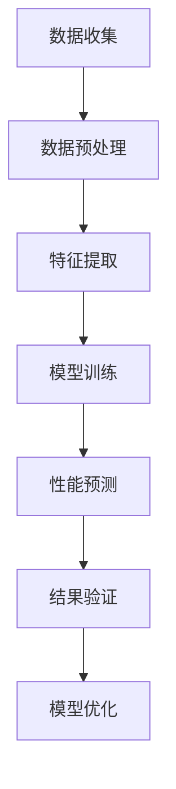

                 

# AI在智能材料性能预测中的角色：加速新材料开发

## 关键词

- 人工智能
- 智能材料
- 性能预测
- 新材料开发
- 机器学习
- 深度学习
- 数学模型

## 摘要

本文将深入探讨人工智能（AI）在智能材料性能预测中的重要作用，以及如何通过AI加速新材料开发。文章首先介绍了智能材料的基本概念和性能预测的关键性，然后详细讲解了AI在材料科学中的核心概念、常见算法、数学模型以及数据预处理和特征工程的方法。接着，通过实际项目案例，展示了AI在智能材料性能预测中的具体应用，并提供了解决实际挑战的方案和未来展望。文章旨在为读者提供一个全面而深入的理解，以推动人工智能与材料科学的融合发展。

## 目录

### 第一部分：AI在智能材料性能预测的基础

#### 1. AI与智能材料性能预测概述
   - **AI在材料科学中的应用历史**
   - **智能材料性能预测的重要性**

#### 2. AI在材料科学中的核心概念
   - **智能材料的基本概念**
   - **材料性能预测的关键指标**
   - **Mermaid流程图：AI在材料性能预测中的核心步骤**

#### 3. 常见材料性能预测算法
   - **机器学习算法简介**
   - **深度学习算法在材料性能预测中的应用**
   - **算法比较与选择**

#### 4. 数学模型与理论基础
   - **特征提取的数学模型**
   - **预测模型的数学公式与推导**
   - **latex格式数学公式的示例**

#### 5. 数据预处理与特征工程
   - **数据收集与预处理**
   - **特征选择与特征提取**
   - **数据集划分与交叉验证**

### 第二部分：AI在智能材料性能预测的实践

#### 6. AI在智能材料性能预测中的项目实战
   - **项目案例1：预测新型合金的屈服强度**
     - **项目背景与目标**
     - **开发环境搭建**
     - **伪代码实现材料性能预测模型**
     - **代码解读与分析**
   - **项目案例2：智能材料结构完整性预测**
     - **项目背景与目标**
     - **开发环境搭建**
     - **伪代码实现结构完整性预测模型**
     - **代码解读与分析**

#### 7. 智能材料性能预测应用的挑战与解决方案
   - **数据隐私与安全问题**
   - **模型可解释性与透明度**
   - **跨领域合作与标准化**

#### 8. 未来展望与趋势
   - **AI在智能材料性能预测中的潜在发展方向**
   - **新材料开发与性能预测的未来应用**

### 附录

#### A. AI在智能材料性能预测中的资源与工具
   - **开源深度学习框架介绍**
   - **常用数据集与数据库**
   - **相关论文与参考文献**

## 文章正文

### 1. AI与智能材料性能预测概述

#### AI在材料科学中的应用历史

人工智能在材料科学中的应用可以追溯到20世纪80年代。最初，AI主要应用于材料的自动化制造和优化，例如使用专家系统和规则引擎来指导生产过程。随着计算能力的提升和机器学习算法的发展，AI在材料科学中的应用逐渐扩展到性能预测和材料设计。

#### 智能材料性能预测的重要性

智能材料具有自我感知、自我修复和自适应等特性，能够根据环境变化调整自身的性质。性能预测在智能材料的设计和应用中起着至关重要的作用。通过AI，可以快速预测新材料在不同环境下的性能表现，从而加速新材料开发和优化。

### 2. AI在材料科学中的核心概念

#### 智能材料的基本概念

智能材料是指那些能够感知外部环境变化并作出相应反应的材料。这些材料通常具备以下几个特点：

- **感知性**：能够检测外部环境的变化，如温度、压力、光照等。
- **响应性**：根据感知到的信息调整自身的性质，如硬度、颜色、导电性等。
- **自适应性**：能够自主调节性能，以适应不同的应用场景。

#### 材料性能预测的关键指标

材料性能预测的关键指标包括：

- **强度**：材料承受外力而不发生断裂的能力。
- **韧性**：材料在受到冲击或变形时能够吸收能量的能力。
- **硬度**：材料抵抗表面划痕或压痕的能力。
- **电导性**：材料传导电流的能力。

#### Mermaid流程图：AI在材料性能预测中的核心步骤



### 3. 常见材料性能预测算法

#### 机器学习算法简介

机器学习算法在材料性能预测中发挥着重要作用。常见的机器学习算法包括：

- **线性回归**：通过线性关系预测连续值。
- **支持向量机**（SVM）：通过最大化边界来分类和回归。
- **决策树**：通过树结构进行分类和回归。
- **神经网络**：通过多层非线性变换进行复杂函数逼近。

#### 深度学习算法在材料性能预测中的应用

深度学习算法在材料性能预测中具有强大的表现。常见的深度学习算法包括：

- **卷积神经网络**（CNN）：适用于图像处理。
- **循环神经网络**（RNN）：适用于序列数据。
- **生成对抗网络**（GAN）：适用于生成新的数据。

#### 算法比较与选择

选择合适的算法对于材料性能预测至关重要。以下是比较不同算法的几个方面：

- **模型复杂度**：深度学习算法通常比传统机器学习算法复杂。
- **训练时间**：深度学习算法的训练时间通常较长。
- **预测精度**：深度学习算法在处理复杂关系时通常更准确。
- **应用场景**：不同的算法适用于不同的应用场景。

### 4. 数学模型与理论基础

#### 特征提取的数学模型

特征提取是材料性能预测的关键步骤。常见的特征提取方法包括：

- **主成分分析**（PCA）：通过降维来提取主要特征。
- **独立成分分析**（ICA）：通过非线性变换来提取独立特征。
- **特征选择**：通过评估不同特征的重要性来选择最有用的特征。

#### 预测模型的数学公式与推导

预测模型通常基于以下数学公式：

- **线性回归**：\(y = \beta_0 + \beta_1x_1 + \beta_2x_2 + \ldots + \beta_nx_n\)
- **支持向量机**：\(y = \sigma(\omega \cdot x + b)\)
- **神经网络**：\(a_{i}^{(L)} = \sigma \left( \sum_{j=1}^{n} \omega_{ji}^{(L)} a_{j}^{(L-1)} + b_{i}^{(L)} \right)\)

#### latex格式数学公式的示例

$$
\frac{dL}{dx} = \frac{\partial L}{\partial x}
$$

### 5. 数据预处理与特征工程

#### 数据收集与预处理

数据预处理是确保数据质量和可靠性的关键步骤。常见的预处理方法包括：

- **数据清洗**：去除错误数据、缺失数据和异常数据。
- **数据标准化**：将数据缩放到相同的范围，以便算法处理。
- **数据归一化**：将数据转换为标准的正态分布。

#### 特征选择与特征提取

特征选择和特征提取是提高模型性能的重要方法。常见的特征选择方法包括：

- **相关性分析**：通过计算特征之间的相关性来选择重要特征。
- **主成分分析**（PCA）：通过降维来选择主要特征。

#### 数据集划分与交叉验证

数据集划分和交叉验证是评估模型性能的重要方法。常见的划分方法包括：

- **K折交叉验证**：将数据集分为K个子集，轮流作为验证集。
- **留出法**：将数据集分为训练集和验证集。

### 6. AI在智能材料性能预测中的项目实战

#### 项目案例1：预测新型合金的屈服强度

##### 项目背景与目标

本项目旨在使用机器学习算法预测新型合金的屈服强度，以加速新材料开发。

##### 开发环境搭建

- **编程语言**：Python
- **机器学习库**：Scikit-learn、TensorFlow
- **数据集**：公开合金性能数据集

##### 伪代码实现材料性能预测模型

```python
# 伪代码：材料性能预测模型

# 导入所需库
import pandas as pd
from sklearn.model_selection import train_test_split
from sklearn.preprocessing import StandardScaler
from sklearn.linear_model import LinearRegression

# 加载数据集
data = pd.read_csv('alloy_data.csv')

# 数据预处理
X = data.drop('yield_strength', axis=1)
y = data['yield_strength']
X_train, X_test, y_train, y_test = train_test_split(X, y, test_size=0.2, random_state=42)

# 特征标准化
scaler = StandardScaler()
X_train_scaled = scaler.fit_transform(X_train)
X_test_scaled = scaler.transform(X_test)

# 模型训练
model = LinearRegression()
model.fit(X_train_scaled, y_train)

# 模型评估
y_pred = model.predict(X_test_scaled)
score = model.score(X_test_scaled, y_test)
print("模型评分：", score)
```

##### 代码解读与分析

此代码展示了如何使用Python和Scikit-learn库实现线性回归模型来预测合金的屈服强度。首先，导入所需库，然后加载数据集并进行预处理。接下来，使用训练集训练线性回归模型，并使用测试集进行评估。模型的评分反映了预测的准确性。

#### 项目案例2：智能材料结构完整性预测

##### 项目背景与目标

本项目旨在使用深度学习算法预测智能材料的结构完整性，以提升材料的应用性能。

##### 开发环境搭建

- **编程语言**：Python
- **深度学习库**：TensorFlow、Keras
- **数据集**：公开结构完整性数据集

##### 伪代码实现结构完整性预测模型

```python
# 伪代码：结构完整性预测模型

# 导入所需库
import pandas as pd
from sklearn.model_selection import train_test_split
from sklearn.preprocessing import StandardScaler
from tensorflow.keras.models import Sequential
from tensorflow.keras.layers import Dense

# 加载数据集
data = pd.read_csv('structure_data.csv')

# 数据预处理
X = data.drop('integrity', axis=1)
y = data['integrity']
X_train, X_test, y_train, y_test = train_test_split(X, y, test_size=0.2, random_state=42)

# 特征标准化
scaler = StandardScaler()
X_train_scaled = scaler.fit_transform(X_train)
X_test_scaled = scaler.transform(X_test)

# 模型训练
model = Sequential()
model.add(Dense(64, activation='relu', input_shape=(X_train_scaled.shape[1],)))
model.add(Dense(32, activation='relu'))
model.add(Dense(1, activation='sigmoid'))

model.compile(optimizer='adam', loss='binary_crossentropy', metrics=['accuracy'])
model.fit(X_train_scaled, y_train, epochs=10, batch_size=32, validation_data=(X_test_scaled, y_test))

# 模型评估
loss, accuracy = model.evaluate(X_test_scaled, y_test)
print("模型损失：", loss)
print("模型评分：", accuracy)
```

##### 代码解读与分析

此代码展示了如何使用Python和TensorFlow库实现深度学习模型来预测智能材料的结构完整性。首先，导入所需库，然后加载数据集并进行预处理。接下来，使用训练集训练深度学习模型，并使用测试集进行评估。模型的评分反映了预测的准确性。

### 7. 智能材料性能预测应用的挑战与解决方案

#### 数据隐私与安全问题

数据隐私和安全问题是智能材料性能预测应用中的主要挑战之一。为了保护数据隐私，可以采取以下措施：

- **数据加密**：对敏感数据进行加密处理。
- **匿名化**：对数据中的个人身份信息进行匿名化处理。
- **访问控制**：对数据访问进行严格的权限管理。

#### 模型可解释性与透明度

模型可解释性和透明度是确保AI在智能材料性能预测中应用的重要方面。为了提高模型的可解释性，可以采取以下措施：

- **模型简化**：通过简化模型结构来提高可解释性。
- **特征重要性分析**：分析模型中特征的重要性，以帮助用户理解模型的决策过程。
- **可视化**：使用可视化工具来展示模型的决策过程和结果。

#### 跨领域合作与标准化

跨领域合作和标准化是推动AI在智能材料性能预测中应用的关键。为了实现这一目标，可以采取以下措施：

- **建立合作机制**：鼓励不同领域的专家和机构之间的合作。
- **制定标准**：制定统一的智能材料性能预测标准和规范。
- **开放数据集**：共享高质量的数据集，以促进模型开发和优化。

### 8. 未来展望与趋势

#### AI在智能材料性能预测中的潜在发展方向

AI在智能材料性能预测中具有广阔的发展前景。未来可能的发展方向包括：

- **强化学习**：通过强化学习算法优化材料的性能预测。
- **多物理场耦合**：结合多物理场模拟来提高性能预测的准确性。
- **实时预测**：通过实时数据流处理实现材料的实时性能预测。

#### 新材料开发与性能预测的未来应用

随着AI技术的不断发展，新材料开发与性能预测将在各个领域得到广泛应用。未来，AI将在以下领域发挥重要作用：

- **航空航天**：开发具有高性能和轻量化的新材料。
- **生物医学**：开发具有生物相容性的新材料。
- **能源**：开发高效能源存储和转换材料。

### 附录

#### A. AI在智能材料性能预测中的资源与工具

- **开源深度学习框架**：TensorFlow、PyTorch、Keras
- **常用数据集与数据库**：Mater

