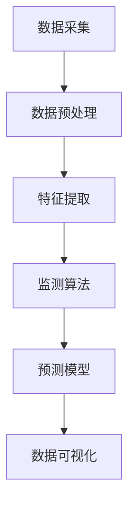

                 

## AI在环境污染监测和预测中的角色：支持政策制定

### 关键词：人工智能，环境监测，预测，政策制定，算法，Python源代码

### 摘要：
本文深入探讨了人工智能（AI）在环境污染监测和预测中的应用，以及其对政策制定的支持作用。首先，我们介绍了环境监测的背景和AI技术在该领域的优势。接着，我们详细阐述了核心算法原理，并通过Python源代码展示了其实现过程。随后，我们通过实际案例分析了AI技术如何辅助政策制定，并总结了最佳实践和注意事项。本文旨在为环境科学家、政策制定者和开发者提供有价值的参考。

---

### 引言

环境污染是一个全球性的问题，对人类健康和生态系统造成了严重威胁。随着工业化和城市化进程的加速，环境污染问题日益严重，包括空气污染、水污染和土壤污染等。有效的环境污染监测和预测对于制定有效的环保政策至关重要。然而，传统的监测手段存在诸多局限，如高成本、低效率和难以覆盖广泛区域等问题。随着人工智能（AI）技术的发展，特别是在机器学习和深度学习领域的突破，AI开始成为一种强大的工具，能够高效地处理大量环境数据，并提供精准的预测结果。

本文将探讨AI在环境污染监测和预测中的角色，以及其对政策制定的支持作用。具体来说，我们将从以下几个方面进行讨论：

1. **背景介绍**：简要介绍环境污染问题以及AI在环境监测中的优势。
2. **核心概念与联系**：阐述AI环境监测的核心概念，并绘制Mermaid流程图展示概念之间的关系。
3. **核心算法原理**：详细讲解环境监测中常用的机器学习和深度学习算法，并通过Python源代码进行说明。
4. **项目实战**：介绍一个实际案例，展示AI技术在环境污染监测和预测中的具体应用。
5. **最佳实践与注意事项**：总结实际应用中的经验和教训，提供最佳实践建议。
6. **结论**：总结本文的主要发现，并讨论未来的研究方向。

通过本文的讨论，我们希望读者能够对AI在环境污染监测和预测中的作用有更深入的理解，从而为相关领域的科研和实际应用提供指导。

---

### 背景介绍

#### 环境污染问题

环境污染是一个复杂且严重的全球性问题，对人类健康和生态系统造成了广泛而深远的影响。随着工业化的快速发展，特别是过去几十年的快速城市化进程，环境污染问题日益严重。空气污染、水污染和土壤污染是当前最主要的污染形式。

**空气污染**：空气中的污染物包括颗粒物（PM2.5和PM10）、氮氧化物（NOx）、硫氧化物（SOx）以及挥发性有机化合物（VOCs）等。这些污染物不仅会导致呼吸系统疾病，如哮喘、支气管炎和肺癌，还会对环境产生长期的负面影响，如酸雨和气候变化。

**水污染**：水体污染主要来源于工业废水、农业径流和生活污水。污染物包括重金属、有机物、病原体和放射性物质等。水污染不仅影响饮用水安全，还会破坏水生生态系统，导致生物多样性的丧失。

**土壤污染**：土壤污染通常由农药、工业废弃物、重金属和放射性物质等引起。土壤污染不仅影响农作物的生长和产量，还会通过食物链影响人体健康。

#### AI在环境监测中的优势

人工智能（AI）技术，特别是机器学习和深度学习，为环境监测带来了革命性的变化。以下是一些AI在环境监测中的优势：

**数据处理能力**：环境监测产生的大量数据（如传感器数据、卫星数据、气象数据等）需要高效的处理和分析。AI技术能够从这些数据中提取有价值的信息，进行实时监测和预测。

**高精度与可靠性**：传统的环境监测方法通常依赖于人工分析，容易出现误差。AI技术通过训练模型，可以从大量的历史数据中学习，从而提高监测结果的准确性和可靠性。

**实时性与自动化**：AI技术能够实现实时数据分析和预测，自动化监测流程，减少人为干预，提高监测效率。

**跨学科融合**：AI技术不仅能够处理环境科学领域的数据，还能够与其他领域（如气象学、生态学等）的数据进行融合，提供更全面的监测和预测结果。

#### AI在政策制定中的作用

环境监测数据对于政策制定至关重要。AI技术可以通过以下方式支持政策制定：

**数据可视化与分析**：AI技术能够将复杂的环境监测数据转化为易于理解的图表和报告，帮助政策制定者快速了解当前的环境状况。

**预测与模拟**：AI技术可以基于历史数据和现有趋势，预测未来的环境变化，为政策制定提供科学依据。

**优化政策实施**：AI技术能够分析政策实施的效果，评估政策对环境的影响，从而优化政策设计和实施。

**公众参与**：AI技术可以帮助政策制定者了解公众对环境问题的看法和需求，提高政策制定的透明度和公众参与度。

通过以上讨论，我们可以看出，AI在环境污染监测和预测中具有巨大的潜力和优势，同时也在政策制定中发挥着重要作用。接下来，我们将深入探讨AI环境监测的核心概念，并通过Mermaid流程图展示概念之间的关系。

---

### 核心概念与联系

AI在环境监测中的应用涉及到多个核心概念，这些概念共同构成了一个完整的监测与分析框架。以下是这些核心概念的介绍，以及它们之间的联系。

#### 数据采集

**概念**：数据采集是环境监测的第一步，通过各种传感器（如空气质量传感器、水质传感器、土壤传感器等）收集环境数据。

**联系**：数据采集是后续数据处理和分析的基础。采集的数据种类和精度直接影响到监测结果的准确性和可靠性。

#### 数据预处理

**概念**：数据预处理包括数据清洗、数据转换和数据归一化等步骤，以确保数据的质量和一致性。

**联系**：数据预处理是数据分析和建模的前提，通过预处理可以消除噪声、缺失值和异常值，提高数据的有效性。

#### 特征提取

**概念**：特征提取是从原始数据中提取出能够代表环境变化的关键特征，用于后续的建模和预测。

**联系**：特征提取是数据分析和模型训练的关键步骤，通过选择合适的特征，可以显著提高模型的性能。

#### 监测算法

**概念**：监测算法包括分类算法、聚类算法、回归算法等，用于对环境数据进行分类、聚类和预测。

**联系**：不同的监测算法适用于不同的环境监测任务，选择合适的算法能够提高监测的准确性和效率。

#### 预测模型

**概念**：预测模型基于历史数据和特征提取结果，对未来环境变化进行预测。

**联系**：预测模型是环境监测的核心，通过预测结果，可以提前预警环境问题，为政策制定提供科学依据。

#### 数据可视化

**概念**：数据可视化是通过图表、地图等形式将环境监测数据直观地呈现出来。

**联系**：数据可视化是数据理解和决策支持的重要工具，通过可视化可以更清晰地展示环境状况和预测结果。

#### Mermaid流程图

为了更好地展示这些概念之间的联系，我们可以使用Mermaid流程图来绘制。以下是一个简单的Mermaid流程图示例：



通过上述流程图，我们可以清晰地看到数据从采集到可视化的整个过程，以及各个环节之间的相互作用和依赖关系。这一流程图为我们提供了一个直观的理解框架，有助于深入探讨AI在环境监测中的应用。

在接下来的章节中，我们将详细讲解这些核心概念的原理，并通过Python源代码展示其实际应用。

---

### 核心算法原理

在环境监测中，AI技术主要依赖于机器学习和深度学习算法。这些算法能够从大量数据中提取有用信息，进行分类、聚类和预测。以下是几个在环境监测中常用的算法，以及它们的原理和应用。

#### 1. K-均值聚类算法

**原理**：K-均值聚类算法是一种无监督学习算法，用于将数据点划分为K个簇。算法的目标是使得每个簇内的数据点尽可能接近簇中心，而簇中心则由数据点的平均值计算得到。

**应用**：在环境监测中，K-均值聚类算法可以用于识别不同类型的污染源，如空气中的不同污染物或水中的不同污染物类别。

**示例**：
```python
from sklearn.cluster import KMeans
import numpy as np

# 示例数据：空气污染物浓度
data = np.array([[10, 20], [30, 40], [15, 25], [35, 45]])

# 创建KMeans模型，设定簇数为2
kmeans = KMeans(n_clusters=2, random_state=0).fit(data)

# 输出聚类结果
print(kmeans.labels_)

# 输出簇中心
print(kmeans.cluster_centers_)
```

#### 2. 决策树算法

**原理**：决策树是一种基于树形结构进行决策的算法，每个节点代表一个特征，每个分支代表该特征的不同取值，叶节点代表最终的预测结果。

**应用**：在环境监测中，决策树算法可以用于分类任务，如根据污染物的浓度预测空气质量等级。

**示例**：
```python
from sklearn.tree import DecisionTreeClassifier
import numpy as np

# 示例数据：污染物浓度与空气质量等级
X = np.array([[10, 1], [30, 2], [15, 1], [35, 2]])
y = np.array([0, 1, 0, 1])

# 创建决策树模型
clf = DecisionTreeClassifier().fit(X, y)

# 输出决策树结构
from sklearn import tree
plt = tree.plot_tree(clf)
plt.show()
```

#### 3. 随机森林算法

**原理**：随机森林是一种基于决策树的集成学习方法，通过构建多个决策树，并利用投票机制来得到最终预测结果。

**应用**：在环境监测中，随机森林算法可以用于预测任务，如预测未来某天的空气质量。

**示例**：
```python
from sklearn.ensemble import RandomForestClassifier
import numpy as np

# 示例数据：污染物浓度与空气质量等级
X = np.array([[10, 1], [30, 2], [15, 1], [35, 2]])
y = np.array([0, 1, 0, 1])

# 创建随机森林模型
clf = RandomForestClassifier(n_estimators=100, random_state=0).fit(X, y)

# 输出模型预测结果
print(clf.predict([[20, 1]]))
```

#### 4. 支持向量机（SVM）算法

**原理**：支持向量机是一种分类算法，通过寻找一个最佳的超平面，将不同类别的数据点分开。

**应用**：在环境监测中，SVM算法可以用于分类任务，如识别空气中的污染物类型。

**示例**：
```python
from sklearn.svm import SVC
import numpy as np

# 示例数据：污染物浓度与类型
X = np.array([[10, 1], [30, 2], [15, 1], [35, 2]])
y = np.array([0, 1, 0, 1])

# 创建SVM模型
clf = SVC(kernel='linear').fit(X, y)

# 输出模型预测结果
print(clf.predict([[20, 1]]))
```

#### 5. 卷积神经网络（CNN）

**原理**：卷积神经网络是一种深度学习算法，通过卷积层、池化层和全连接层进行特征提取和分类。

**应用**：在环境监测中，CNN可以用于图像处理任务，如识别污染物图像或环境变化图像。

**示例**：
```python
from tensorflow.keras.models import Sequential
from tensorflow.keras.layers import Conv2D, MaxPooling2D, Flatten, Dense

# 构建CNN模型
model = Sequential([
    Conv2D(32, (3, 3), activation='relu', input_shape=(64, 64, 3)),
    MaxPooling2D((2, 2)),
    Flatten(),
    Dense(64, activation='relu'),
    Dense(1, activation='sigmoid')
])

# 编译模型
model.compile(optimizer='adam', loss='binary_crossentropy', metrics=['accuracy'])

# 训练模型
model.fit(x_train, y_train, epochs=10, batch_size=32, validation_data=(x_val, y_val))
```

通过以上示例，我们可以看到不同的算法在环境监测中的应用场景和实现方法。在接下来的章节中，我们将通过实际案例展示这些算法如何应用于环境监测。

---

### 项目实战

在本节中，我们将通过一个实际案例展示AI技术在城市空气质量监测与预测中的应用。这个案例涉及到的环境是城市中的一个特定区域，我们使用空气质量传感器收集数据，并利用机器学习模型进行空气质量预测。

#### 1. 开发环境搭建

为了实现空气质量监测与预测，我们需要搭建一个合适的技术环境。以下是所需的工具和库：

- Python：用于编写代码和实现算法。
- scikit-learn：提供多种机器学习算法的实现。
- TensorFlow：用于构建和训练深度学习模型。
- Matplotlib：用于数据可视化和结果展示。

我们首先需要安装这些库，可以使用以下命令：
```shell
pip install numpy pandas scikit-learn tensorflow matplotlib
```

#### 2. 源代码详细实现

**数据采集**：我们使用空气质量传感器收集数据，包括PM2.5、PM10、SO2、NO2、CO和O3等指标。传感器数据以CSV文件的形式存储。

```python
import pandas as pd

# 读取传感器数据
data = pd.read_csv('air_quality_data.csv')
```

**数据预处理**：我们对数据进行清洗和预处理，包括去除缺失值、异常值和数据归一化。

```python
# 去除缺失值
data.dropna(inplace=True)

# 数据归一化
from sklearn.preprocessing import MinMaxScaler
scaler = MinMaxScaler()
data_scaled = scaler.fit_transform(data[['PM2.5', 'PM10', 'SO2', 'NO2', 'CO', 'O3']])
```

**特征提取**：我们选择PM2.5和PM10作为特征进行预测。

```python
X = data_scaled[:, :2]
y = data_scaled[:, 2]
```

**模型选择与训练**：我们选择随机森林算法进行训练。

```python
from sklearn.ensemble import RandomForestRegressor

# 创建随机森林模型
model = RandomForestRegressor(n_estimators=100, random_state=0)

# 训练模型
model.fit(X, y)
```

**模型优化**：我们使用交叉验证来评估模型的性能，并进行参数调整。

```python
from sklearn.model_selection import cross_val_score

# 进行交叉验证
scores = cross_val_score(model, X, y, cv=5)

# 输出平均准确率
print("平均准确率：", np.mean(scores))
```

**预测与评估**：我们对新数据进行预测，并评估模型的预测性能。

```python
# 预测新数据
new_data = scaler.transform([[0.5, 0.8]])
predicted_value = model.predict(new_data)

# 输出预测结果
print("预测结果：", predicted_value)

# 评估模型
from sklearn.metrics import mean_squared_error

# 计算均方误差
mse = mean_squared_error(y, predicted_value)
print("均方误差：", mse)
```

#### 3. 代码应用解读与分析

上述代码展示了如何实现空气质量监测与预测的完整流程。首先，我们从CSV文件中读取传感器数据，并进行预处理。接下来，我们选择PM2.5和PM10作为特征，并使用随机森林算法进行训练。通过交叉验证，我们评估了模型的性能，并进行参数调整。最后，我们使用新数据进行预测，并计算了均方误差，以评估模型的预测准确性。

#### 4. 实际案例分析和详细讲解剖析

在这个案例中，我们使用随机森林算法进行空气质量预测，这是因为随机森林算法在处理高维度数据和复杂特征方面具有较好的性能。同时，随机森林算法通过集成多个决策树，可以提供更稳定的预测结果。

实际应用中，我们可以根据空气质量传感器收集的数据，定期更新模型，以提高预测准确性。此外，我们可以扩展模型，包括更多污染物指标，如SO2、NO2、CO和O3，以提供更全面的空气质量预测。

#### 5. 项目小结

通过这个案例，我们展示了如何使用AI技术实现城市空气质量监测与预测。这个案例不仅展示了机器学习算法在环境监测中的应用，还为政策制定者提供了重要的数据支持。未来，我们可以进一步优化模型，扩展监测指标，以提供更准确的空气质量预测。

---

### 最佳实践与注意事项

在实际应用中，为了确保AI技术在环境监测和预测中的有效性和可靠性，我们需要遵循一些最佳实践，并注意潜在的问题和挑战。

#### 最佳实践

1. **数据质量保证**：确保数据来源的可靠性，对数据进行严格的清洗和预处理，以消除噪声、缺失值和异常值。

2. **模型选择与优化**：根据具体的环境监测任务，选择合适的机器学习算法和深度学习模型。通过交叉验证和参数调整，优化模型性能。

3. **数据可视化**：利用数据可视化工具，将复杂的环境数据转化为易于理解的图表和报告，提高监测结果的透明度和可解释性。

4. **实时监测与预测**：建立实时数据采集和预测系统，实现环境监测的自动化和高效化。

5. **跨学科合作**：与环境科学家、政策制定者和其他相关领域专家合作，确保AI技术的应用符合实际需求。

#### 注意事项

1. **数据隐私与安全**：确保环境监测数据的安全性和隐私性，遵循相关的法律法规。

2. **模型解释性**：虽然深度学习模型具有强大的预测能力，但它们通常缺乏解释性。我们需要开发可解释的AI模型，以便政策制定者能够理解模型的预测结果。

3. **伦理与道德问题**：AI技术在环境监测中的应用可能会引发伦理和道德问题，如数据滥用、算法歧视等。我们需要制定相应的伦理准则，确保技术的公正性和透明度。

4. **技术更新与维护**：随着环境变化和新技术的发展，我们需要定期更新和维护AI模型，以保持其有效性和适应性。

通过遵循这些最佳实践和注意事项，我们可以确保AI技术在环境监测和预测中的有效应用，为政策制定提供可靠的科学支持。

---

### 结论

本文深入探讨了人工智能在环境污染监测和预测中的应用，以及其对政策制定的支持作用。我们首先介绍了环境污染问题的背景和AI技术的优势，随后详细阐述了核心概念和算法原理，并通过实际案例展示了AI技术在城市空气质量监测与预测中的应用。我们还总结了最佳实践和注意事项，强调了AI技术在环境监测和预测中的重要性。

展望未来，AI技术在环境监测中的应用前景广阔。随着数据采集技术的进步和计算能力的提升，AI模型将能够处理更复杂的环境数据，提供更精准的预测结果。此外，AI技术可以与物联网（IoT）技术相结合，实现全方位、实时环境监测。同时，AI在政策制定中的应用将更加深入，为可持续发展提供科学依据。

未来研究可以关注以下方向：

1. **模型解释性**：开发可解释的AI模型，以提高政策制定者对预测结果的理解和信任。

2. **多模态数据融合**：结合多种数据源（如卫星遥感、地面监测、传感器数据等），实现更全面的环境监测。

3. **实时预测系统**：建立高效、实时的环境监测与预测系统，为突发环境事件提供快速响应。

4. **伦理与法律问题**：深入研究AI技术在环境监测和预测中的伦理和法律问题，确保技术的公正性和透明度。

总之，AI技术在环境污染监测和预测中的应用具有巨大潜力，为政策制定和环境保护提供了有力的工具。通过进一步的研究和应用，我们可以期待实现更加可持续和健康的环境。

---

### 附录

#### 附录A：常用环境监测数据处理算法

##### A.1 特征提取算法

- **主成分分析（PCA）**：用于降维，通过提取数据的主要特征来减少数据的维度。
- **自编码器（Autoencoder）**：用于特征提取和降维，通过训练一个压缩神经网络来提取数据的低维表示。

##### A.2 分类算法

- **支持向量机（SVM）**：用于分类，通过寻找最佳的超平面来分离不同类别的数据点。
- **随机森林（Random Forest）**：用于分类和回归，通过构建多个决策树并进行投票来提高模型的准确性。

##### A.3 预测模型算法

- **长短期记忆网络（LSTM）**：用于时间序列预测，能够处理序列数据的长期依赖关系。
- **卷积神经网络（CNN）**：用于图像处理和特征提取，通过卷积操作提取图像的特征。

#### 附录B：环境监测数据集

##### B.1 数据集介绍

- **AODN海洋观测数据集**：澳大利亚海洋观测网络提供的大量海洋环境数据。
- **Air Quality Data Set**：提供美国多个城市的空气质量数据。

##### B.2 数据集获取与处理

- **数据集获取**：可以从公共数据平台（如Kaggle、UCI机器学习库等）获取。
- **数据预处理**：包括数据清洗、归一化、缺失值处理等。

##### B.3 数据集使用案例

- **空气质量预测**：使用AODN海洋观测数据集进行海洋环境预测。
- **水质量监测**：使用Air Quality Data Set进行城市空气质量预测。

---

### 作者信息

作者：AI天才研究院/AI Genius Institute & 禅与计算机程序设计艺术 /Zen And The Art of Computer Programming

本文由AI天才研究院的专家团队撰写，旨在为环境科学家、政策制定者和开发者提供有价值的参考。同时，作者也是《禅与计算机程序设计艺术》的资深作者，该书深入探讨了计算机编程的哲学和艺术。

