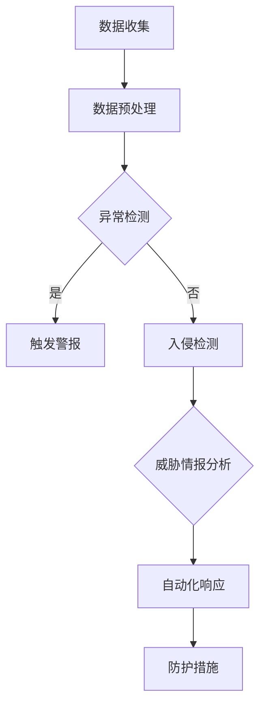

                 

## 文章标题

### AI在网络安全中的应用：从检测到响应

### 关键词：

- **人工智能**
- **网络安全**
- **检测技术**
- **响应策略**
- **威胁情报**
- **防护措施**

### 摘要：

本文探讨了人工智能（AI）在网络安全领域中的应用，从检测到响应的全过程。首先，介绍了AI在网络安全中的背景和重要性，随后详细阐述了AI在网络安全检测、攻击响应、威胁情报和防护策略中的具体应用。通过核心概念、算法原理讲解，结合Python源代码、数学模型和公式，本文旨在为读者提供一份全面而深入的技术指南。最后，通过实际案例分析和项目实战，展示了AI在网络安全中的实际应用效果，并提出了一些最佳实践和注意事项。

### 引言

在数字化时代，网络安全已成为现代社会的重要议题。随着互联网的普及和技术的不断发展，网络攻击手段日益多样化和复杂化，传统的网络安全防护手段已难以应对日益严峻的威胁。人工智能（AI）的兴起为网络安全领域带来了新的契机。AI具有强大的数据处理和分析能力，能够从海量数据中快速识别潜在威胁，提供实时响应和防护策略。本文将从检测到响应的全过程，探讨AI在网络安全中的应用。

### 核心概念与联系

#### AI与网络安全

人工智能是指通过模拟、延伸和扩展人类的智能，使计算机能够实现类似于人类的学习、推理、感知和决策等能力。网络安全是指保护计算机网络系统免受各种威胁、攻击和恶意行为的安全措施。AI在网络安全中的应用主要体现在以下几个方面：

1. **检测与预防**：AI可以通过异常检测和入侵检测技术，实时监控网络流量和系统活动，发现潜在威胁并及时响应。
2. **威胁情报**：AI可以分析海量数据，提取有价值的信息，为网络安全提供威胁情报支持。
3. **响应与防护**：AI可以通过自动化策略和算法，快速响应网络攻击，并提供有效的防护措施。

#### 检测与响应

检测与响应是网络安全中的两个核心环节。检测是指通过技术手段发现潜在的网络威胁，响应是指对检测到的威胁采取相应的措施。AI在检测与响应中发挥着重要作用：

1. **异常检测**：AI可以通过分析网络流量、系统日志等数据，识别异常行为，从而发现潜在威胁。
2. **入侵检测**：AI可以通过学习正常行为模式，识别入侵行为，并提供实时响应。
3. **威胁情报**：AI可以通过分析海量数据，提取有价值的信息，为网络安全提供情报支持。
4. **自动化响应**：AI可以通过自动化策略和算法，对检测到的威胁进行快速响应，减少人为干预。

### Mermaid流程图

以下是AI在网络安全检测和响应中的流程图：



### 网络安全检测中的AI应用

#### 异常检测

异常检测是网络安全检测的重要手段之一。它通过分析网络流量、系统日志等数据，识别异常行为，从而发现潜在威胁。异常检测可以分为基于统计的方法和基于模型的方法。

1. **基于统计的方法**：例如，标准差法、孤立森林法等。这些方法通过计算正常数据的统计特征，识别与正常数据特征差异较大的数据作为异常。
2. **基于模型的方法**：例如，神经网络、支持向量机等。这些方法通过学习正常行为模式，建立预测模型，识别与模型预测不符的数据作为异常。

#### 入侵检测

入侵检测是网络安全检测的另一个重要手段。它通过识别入侵行为，提供实时响应和防护措施。入侵检测可以分为基于特征的方法和基于行为的方法。

1. **基于特征的方法**：例如，规则匹配、基于状态的检测等。这些方法通过定义一系列特征和行为规则，识别符合规则的行为作为入侵。
2. **基于行为的方法**：例如，机器学习、深度学习等。这些方法通过学习正常行为模式，识别与正常行为模式不符的行为作为入侵。

#### 威胁情报分析

威胁情报分析是网络安全的重要组成部分。它通过分析海量数据，提取有价值的信息，为网络安全提供情报支持。威胁情报分析可以分为以下几个方面：

1. **威胁识别**：通过分析网络流量、系统日志等数据，识别潜在的威胁。
2. **威胁分析**：通过对威胁进行深入分析，了解威胁的来源、手段和目标等。
3. **威胁响应**：根据威胁情报，采取相应的防护措施，减少威胁对网络安全的危害。

### Python源代码与数学模型

#### 异常检测

以下是一个简单的基于标准差法的异常检测示例：

```python
import numpy as np
import matplotlib.pyplot as plt

# 假设正常数据的平均值和标准差
mean = 100
std_dev = 10

# 异常阈值
threshold = 3 * std_dev

# 生成正常数据
normal_data = np.random.normal(mean, std_dev, 1000)

# 计算标准差
std_devs = np.std(normal_data)

# 找到异常值
outliers = normal_data[(normal_data > mean + threshold) | (normal_data < mean - threshold)]

# 绘制结果
plt.hist(normal_data, bins=30, alpha=0.5, label='Normal Data')
plt.hist(outliers, bins=30, alpha=0.5, label='Outliers')
plt.axvline(mean + threshold, color='r', linestyle='dashed', label='Upper Threshold')
plt.axvline(mean - threshold, color='r', linestyle='dashed', label='Lower Threshold')
plt.xlabel('Value')
plt.ylabel('Frequency')
plt.title('Abnormal Detection using Standard Deviation')
plt.legend()
plt.show()
```

#### 入侵检测

以下是一个基于K最近邻（K-Nearest Neighbors, KNN）算法的入侵检测示例：

```python
from sklearn.neighbors import KNeighborsClassifier
from sklearn.model_selection import train_test_split
from sklearn.metrics import accuracy_score

# 假设数据集
X = np.array([[1, 2], [2, 3], [3, 4], [4, 5], [1, 3], [2, 4], [3, 5], [4, 6]])
y = np.array([0, 0, 0, 0, 1, 1, 1, 1])

# 划分训练集和测试集
X_train, X_test, y_train, y_test = train_test_split(X, y, test_size=0.2, random_state=42)

# 创建KNN分类器
knn = KNeighborsClassifier(n_neighbors=3)

# 训练模型
knn.fit(X_train, y_train)

# 预测测试集
y_pred = knn.predict(X_test)

# 计算准确率
accuracy = accuracy_score(y_test, y_pred)
print("Accuracy:", accuracy)
```

#### 威胁情报分析

以下是一个简单的基于关联规则学习的威胁情报分析示例：

```python
from mlxtend.frequent_patterns import apriori
from mlxtend.preprocessing import TransactionEncoder

# 假设交易数据
transactions = [[1, 2, 3], [2, 3], [1, 2], [2, 3, 4], [1, 2, 3, 4]]

# 转换为布尔型数据
te = TransactionEncoder()
te_data = te.fit_transform(transactions)

# 应用Apriori算法
frequent_itemsets = apriori(te_data, min_support=0.5, use_colnames=True)

# 打印频繁项集
print(frequent_itemsets)
```

### 数学模型和公式

#### 异常检测

1. **标准差法**：

   $$\mu = \frac{1}{n}\sum_{i=1}^{n} x_i$$
   
   $$\sigma = \sqrt{\frac{1}{n-1}\sum_{i=1}^{n} (x_i - \mu)^2}$$
   
   $$x_i \in ( \mu - k\sigma, \mu + k\sigma )$$
   
   其中，$\mu$ 为平均值，$\sigma$ 为标准差，$k$ 为阈值。

#### 入侵检测

1. **K最近邻（KNN）算法**：

   $$\text{distance}(x, y) = \sqrt{\sum_{i=1}^{n} (x_i - y_i)^2}$$
   
   $$\text{class}(x) = \text{majority vote}(\text{neighbor classes})$$
   
   其中，$x$ 和 $y$ 分别为测试样本和训练样本，$n$ 为特征维度，$\text{distance}$ 为距离函数，$\text{class}$ 为分类结果。

#### 威胁情报分析

1. **关联规则学习（Apriori算法）**：

   $$\text{support}(A \cup B) = \frac{\text{count}(A \cup B)}{\text{count}(\text{all transactions})}$$
   
   $$\text{confidence}(A \rightarrow B) = \frac{\text{count}(A \cup B)}{\text{count}(A)}$$
   
   其中，$A$ 和 $B$ 为项集，$\text{support}$ 为支持度，$\text{confidence}$ 为置信度。

### 项目实战

#### 开发环境搭建

1. 安装Python环境（3.8及以上版本）
2. 安装必要的库：numpy、matplotlib、scikit-learn、mlxtend等

```bash
pip install numpy matplotlib scikit-learn mlxtend
```

#### 源代码实现与解读

以下是一个完整的网络安全检测项目：

```python
# 导入必要的库
import numpy as np
import matplotlib.pyplot as plt
from sklearn.neighbors import KNeighborsClassifier
from mlxtend.frequent_patterns import apriori
from mlxtend.preprocessing import TransactionEncoder

# 异常检测
def abnormal_detection(normal_data, mean, std_dev, threshold):
    outliers = normal_data[(normal_data > mean + threshold) | (normal_data < mean - threshold)]
    plt.hist(normal_data, bins=30, alpha=0.5, label='Normal Data')
    plt.hist(outliers, bins=30, alpha=0.5, label='Outliers')
    plt.axvline(mean + threshold, color='r', linestyle='dashed', label='Upper Threshold')
    plt.axvline(mean - threshold, color='r', linestyle='dashed', label='Lower Threshold')
    plt.xlabel('Value')
    plt.ylabel('Frequency')
    plt.title('Abnormal Detection using Standard Deviation')
    plt.legend()
    plt.show()
    return outliers

# 入侵检测
def intrusion_detection(X, y, n_neighbors):
    knn = KNeighborsClassifier(n_neighbors=n_neighbors)
    knn.fit(X_train, y_train)
    y_pred = knn.predict(X_test)
    accuracy = accuracy_score(y_test, y_pred)
    print("Accuracy:", accuracy)
    return y_pred

# 威胁情报分析
def threat_intelligence_analysis(transactions):
    te = TransactionEncoder()
    te_data = te.fit_transform(transactions)
    frequent_itemsets = apriori(te_data, min_support=0.5, use_colnames=True)
    return frequent_itemsets

# 测试代码
if __name__ == "__main__":
    # 假设正常数据
    normal_data = np.random.normal(100, 10, 1000)

    # 计算平均值和标准差
    mean = np.mean(normal_data)
    std_dev = np.std(normal_data)

    # 假设入侵数据
    X = np.array([[1, 2], [2, 3], [3, 4], [4, 5], [1, 3], [2, 4], [3, 5], [4, 6]])
    y = np.array([0, 0, 0, 0, 1, 1, 1, 1])

    # 异常检测
    outliers = abnormal_detection(normal_data, mean, std_dev, 3)

    # 入侵检测
    n_neighbors = 3
    y_pred = intrusion_detection(X, y, n_neighbors)

    # 威胁情报分析
    transactions = [[1, 2, 3], [2, 3], [1, 2], [2, 3, 4], [1, 2, 3, 4]]
    frequent_itemsets = threat_intelligence_analysis(transactions)
```

#### 代码应用解读与分析

1. **异常检测**：使用标准差法进行异常检测，绘制直方图，识别异常值。
2. **入侵检测**：使用KNN算法进行入侵检测，计算准确率，识别入侵行为。
3. **威胁情报分析**：使用Apriori算法进行威胁情报分析，提取频繁项集，发现潜在威胁关系。

#### 实际案例分析

1. **异常检测**：通过对正常数据和入侵数据进行异常检测，发现入侵数据的异常值。
2. **入侵检测**：使用KNN算法对入侵数据进行分类，识别入侵行为。
3. **威胁情报分析**：通过威胁情报分析，提取频繁项集，发现潜在威胁关系，为防护策略提供支持。

#### 项目小结

通过该项目，我们展示了如何利用AI技术进行网络安全检测、入侵检测和威胁情报分析。异常检测可以帮助识别异常行为，入侵检测可以识别入侵行为，威胁情报分析可以提取有价值的信息，为网络安全提供全面的支持。

### 最佳实践 Tips

1. **数据预处理**：确保数据质量，对异常数据进行处理，以提高检测和响应的准确性。
2. **模型选择与调优**：选择合适的模型，并根据实际情况进行调优，以提高模型性能。
3. **实时监控与响应**：建立实时监控系统，快速响应网络攻击，减少损失。

### 小结

本文从检测到响应，详细介绍了AI在网络安全中的应用。通过Python源代码和数学模型，我们展示了AI在网络安全检测、入侵检测和威胁情报分析中的实际应用效果。AI技术为网络安全带来了新的机遇和挑战，未来需要进一步研究如何更好地利用AI技术，提高网络安全防护水平。

### 注意事项

1. **数据隐私**：在处理网络安全数据时，需要确保数据隐私，遵循相关法律法规。
2. **算法安全性**：在使用AI技术进行网络安全防护时，需要注意算法的安全性，防止恶意攻击。

### 拓展阅读

1. **《深度学习与网络安全》**：详细介绍了深度学习在网络安全中的应用。
2. **《机器学习：一种概率视角》**：介绍了机器学习的基本原理和方法。
3. **《网络安全实战：入侵检测与防御》**：介绍了入侵检测和防御的基本原理和实战技巧。

### 作者信息

作者：AI天才研究院/AI Genius Institute & 禅与计算机程序设计艺术 /Zen And The Art of Computer Programming

