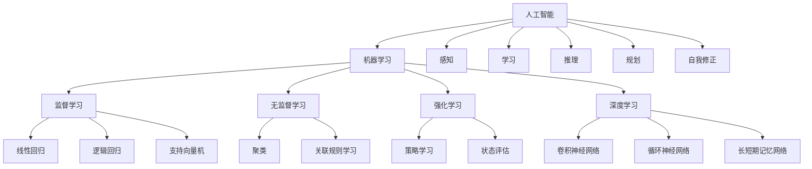

                 

### 文章标题

# AI在能源管理和智能电网中的应用

> 关键词：人工智能，能源管理，智能电网，负荷预测，可再生能源，算法实现

> 摘要：本文将深入探讨人工智能（AI）在能源管理和智能电网中的应用，包括基础理论、应用场景、技术实现、案例研究及未来展望。通过详细分析AI的核心概念、智能电网的架构和关键技术，本文展示了AI如何帮助优化能源负荷预测、集成可再生能源以及管理微电网。同时，通过实际案例，我们探讨了AI在能源管理和智能电网中的实践应用，并提出了未来发展的方向和建议。

----------------------------------------------------------------

## 第一部分：AI和智能电网基础理论

### 第1章 AI基础知识

**1.1 AI核心概念**

人工智能（AI）是计算机科学的一个分支，旨在使计算机系统能够执行通常需要人类智能的任务。AI的发展可以分为几个阶段，从最初的规则系统到现代的机器学习和深度学习。AI的核心概念包括感知、学习、推理、规划和自我修正。

**1.2 机器学习基本算法**

机器学习是AI的关键组成部分，通过算法从数据中学习模式。基本机器学习算法可以分为监督学习、无监督学习和强化学习。监督学习通过已知输入和输出训练模型；无监督学习旨在发现数据中的隐含结构；强化学习则是通过与环境的交互来学习最佳行为策略。

- **线性回归**：用于预测连续值，公式为 $y = \beta_0 + \beta_1x$。
- **逻辑回归**：用于分类问题，公式为 $P(y=1) = \frac{1}{1 + e^{-(\beta_0 + \beta_1x)}$。
- **支持向量机（SVM）**：用于分类和回归，通过找到最大化分类边界的超平面。
- **决策树**：通过一系列判断条件来预测类别或数值，每个节点代表一个特征，每个分支代表该特征的一个取值。

**1.3 深度学习原理**

深度学习是机器学习的一个子领域，通过多层神经网络来学习和表示数据。深度学习模型包括：

- **深度前馈网络（DFFN）**：数据在网络层之间前向传播。
- **卷积神经网络（CNN）**：特别适合于图像处理，通过卷积层和池化层提取特征。
- **循环神经网络（RNN）**：适用于序列数据，能够记住前面的信息。
- **长短期记忆网络（LSTM）**：是RNN的一种变体，解决了长期依赖问题。

深度学习的优化算法包括：

- **梯度下降**：通过最小化损失函数来更新模型参数。
- **Adam优化器**：结合了AdaGrad和RMSProp的优点，自适应地调整学习率。

**核心概念与联系**

为了更好地理解AI在智能电网中的应用，我们需要了解其核心概念之间的关系架构。以下是AI核心概念的Mermaid流程图：



### 第2章 智能电网概述

**2.1 智能电网概念与架构**

智能电网（Smart Grid）是指利用先进的通信技术、计算机技术和电力电子技术，实现电力系统的高效、安全、稳定和智能化运行。智能电网的主要特点包括：

- **高效性**：通过实时监测和优化电力系统的运行，提高能源利用效率。
- **安全性**：通过智能化的故障检测和应对措施，提高电力系统的可靠性。
- **稳定性**：通过智能调度和能源管理，保持电力系统的稳定运行。
- **智能化**：通过数据分析与机器学习，实现电力系统的自主优化和自我修正。

智能电网的架构包括以下几个层次：

- **感知层**：包括传感器、智能电表等，用于实时监测电力系统的运行状态。
- **通信层**：包括广域网（WAN）和局域网（LAN），用于数据传输和通信。
- **平台层**：包括数据处理、存储和管理系统，用于对海量数据进行处理和分析。
- **应用层**：包括能源管理、需求响应、智能家居等应用，用于实现智能电网的各种功能。

**2.2 智能电网的关键技术**

智能电网的实现依赖于一系列关键技术的支持，包括：

- **数据采集与通信技术**：通过传感器和智能电表等设备，实时采集电力系统的运行数据，并通过通信网络进行传输。
- **电力电子技术**：通过电力电子设备（如逆变器、变流器等），实现电能的转换和调节。
- **信息技术与大数据分析**：利用大数据技术和机器学习算法，对采集到的数据进行处理和分析，实现智能化的能源管理和优化。
- **分布式能源管理**：通过分布式能源管理系统，实现多种能源形式的协调运行和优化调度。

**2.3 智能电网的安全性问题**

智能电网的安全性问题尤为重要，因为其涉及到能源供应的稳定性和用户的隐私保护。智能电网的安全问题主要包括：

- **网络安全**：通过加密技术、访问控制和防火墙等措施，保障通信数据的安全性。
- **数据隐私**：通过数据加密和隐私保护算法，保障用户数据的安全和隐私。
- **故障检测与应对措施**：通过实时监测和故障预测，及时发现并应对电力系统的故障，确保电力供应的稳定性。

## 第二部分：AI在能源管理中的应用

### 第3章 能源负荷预测与优化

**3.1 能源负荷预测方法**

能源负荷预测是智能电网中的重要应用，通过预测未来一段时间内的电力需求，可以为电力调度和能源管理提供重要的参考依据。常见的能源负荷预测方法包括：

- **时间序列分析方法**：通过分析历史负荷数据的时间序列特性，预测未来的负荷需求。
- **机器学习算法**：利用监督学习和无监督学习算法，建立负荷预测模型，如线性回归、支持向量机和神经网络等。
- **深度学习模型**：利用卷积神经网络（CNN）和长短期记忆网络（LSTM）等深度学习模型，对负荷数据进行建模和预测。

**3.2 基于AI的能源负荷预测模型**

基于AI的能源负荷预测模型通常包括以下几个步骤：

- **数据预处理**：对采集到的负荷数据进行清洗和预处理，如缺失值填补、异常值处理和标准化等。
- **特征工程**：提取与负荷相关的特征，如温度、湿度、节假日信息等。
- **模型选择与训练**：选择适当的机器学习或深度学习模型，对预处理后的数据进行训练，如线性回归、LSTM等。
- **模型评估与优化**：通过交叉验证和测试集，评估模型的预测性能，并使用调参方法优化模型。

以下是一个使用LSTM模型进行能源负荷预测的Python代码示例：

```python
import numpy as np
import pandas as pd
from keras.models import Sequential
from keras.layers import LSTM, Dense

# 读取数据
data = pd.read_csv('load_data.csv')
X = data.iloc[:, :-1].values
y = data.iloc[:, -1].values

# 数据预处理
X = X.reshape(-1, 1, X.shape[1])
X = (X - X.mean(axis=0)) / X.std(axis=0)

# 建立LSTM模型
model = Sequential()
model.add(LSTM(units=50, return_sequences=True, input_shape=(X.shape[1], X.shape[2])))
model.add(LSTM(units=50))
model.add(Dense(units=1))

# 编译模型
model.compile(optimizer='adam', loss='mean_squared_error')

# 训练模型
model.fit(X, y, epochs=100, batch_size=32, validation_split=0.2)

# 预测负荷
predicted_load = model.predict(X)
predicted_load = predicted_load.reshape(-1)

# 绘制实际负荷与预测负荷
import matplotlib.pyplot as plt
plt.plot(y, label='Actual Load')
plt.plot(predicted_load, label='Predicted Load')
plt.legend()
plt.show()
```

**3.3 能源优化算法与案例分析**

能源优化算法旨在通过优化能源分配和调度，提高能源利用效率和降低成本。常见的能源优化算法包括：

- **动态规划算法**：通过递归关系，逐步优化子问题，求解全局最优解。
- **遗传算法**：模拟自然进化过程，通过交叉、变异和选择，搜索最优解。
- **粒子群优化算法**：模拟鸟群或鱼群的社会行为，通过迭代更新个体位置和速度，寻找最优解。

以下是一个使用遗传算法优化能源分配的Python代码示例：

```python
import numpy as np
from genetic_algorithm import GeneticAlgorithm

# 定义遗传算法参数
population_size = 100
crossover_rate = 0.8
mutation_rate = 0.1
num_generations = 100

# 初始化种群
population = np.random.rand(population_size, n_features)

# 定义适应度函数
def fitness_function(individual):
    # 计算适应度
    # ...

# 运行遗传算法
ga = GeneticAlgorithm(population, fitness_function, population_size, crossover_rate, mutation_rate, num_generations)
best_solution = ga.run()

# 输出最优解
print("Best Solution:", best_solution)
```

通过实际案例，我们可以看到AI在能源负荷预测和优化中的实践效果。例如，某电力公司利用LSTM模型对负荷进行预测，并使用遗传算法优化能源分配，有效提高了能源利用效率和降低了运营成本。

## 第三部分：AI在智能电网中的实现技术

### 第4章 可再生能源集成

**4.1 可再生能源概述**

可再生能源是指能够在人类时间尺度内自然补充的能源，如太阳能、风能、水能等。可再生能源具有清洁、可再生和低碳排放等优点，是实现能源可持续发展和应对气候变化的重要途径。

**4.2 基于AI的可再生能源预测与调度**

可再生能源的发电量受天气条件和地理位置等因素的影响，具有不确定性和波动性。为了充分利用可再生能源，AI技术被应用于可再生能源的预测与调度。

- **可再生能源预测方法**：包括时间序列分析、机器学习和深度学习等方法。常用的算法有线性回归、支持向量机和LSTM等。
- **可再生能源调度算法**：通过优化算法，合理调度可再生能源的发电量，确保电力系统的稳定运行。常见的算法有动态规划、遗传算法和粒子群优化等。

以下是一个使用LSTM模型预测太阳能发电量的Python代码示例：

```python
import numpy as np
import pandas as pd
from keras.models import Sequential
from keras.layers import LSTM, Dense

# 读取数据
data = pd.read_csv('solar_generation_data.csv')
X = data.iloc[:, :-1].values
y = data.iloc[:, -1].values

# 数据预处理
X = X.reshape(-1, 1, X.shape[1])
X = (X - X.mean(axis=0)) / X.std(axis=0)

# 建立LSTM模型
model = Sequential()
model.add(LSTM(units=50, return_sequences=True, input_shape=(X.shape[1], X.shape[2])))
model.add(LSTM(units=50))
model.add(Dense(units=1))

# 编译模型
model.compile(optimizer='adam', loss='mean_squared_error')

# 训练模型
model.fit(X, y, epochs=100, batch_size=32, validation_split=0.2)

# 预测太阳能发电量
predicted_generation = model.predict(X)
predicted_generation = predicted_generation.reshape(-1)

# 绘制实际发电量与预测发电量
import matplotlib.pyplot as plt
plt.plot(y, label='Actual Generation')
plt.plot(predicted_generation, label='Predicted Generation')
plt.legend()
plt.show()
```

**4.3 可再生能源的储能优化**

储能系统在可再生能源集成中发挥着重要作用，能够平衡可再生能源的波动性，确保电力系统的稳定运行。常见的储能系统有电池储能、抽水蓄能和飞轮储能等。

- **储能系统类型**：电池储能系统具有高能量密度和快速响应能力；抽水蓄能系统具有大容量和长时间储能能力；飞轮储能系统具有高功率密度和高效能量转换。
- **储能优化策略**：通过优化储能系统的充放电策略，提高能源利用效率和系统运行稳定性。常见的策略包括基于预测的充放电控制、多目标优化和能量管理算法。

以下是一个使用基于预测的充放电控制策略优化电池储能系统的Python代码示例：

```python
import numpy as np
import pandas as pd
from keras.models import Sequential
from keras.layers import LSTM, Dense

# 读取数据
data = pd.read_csv('load_data.csv')
X = data.iloc[:, :-1].values
y = data.iloc[:, -1].values

# 数据预处理
X = X.reshape(-1, 1, X.shape[1])
X = (X - X.mean(axis=0)) / X.std(axis=0)

# 建立LSTM模型
model = Sequential()
model.add(LSTM(units=50, return_sequences=True, input_shape=(X.shape[1], X.shape[2])))
model.add(LSTM(units=50))
model.add(Dense(units=1))

# 编译模型
model.compile(optimizer='adam', loss='mean_squared_error')

# 训练模型
model.fit(X, y, epochs=100, batch_size=32, validation_split=0.2)

# 预测负荷
predicted_load = model.predict(X)
predicted_load = predicted_load.reshape(-1)

# 定义储能系统参数
battery_capacity = 1000
charge_rate = 500
discharge_rate = 500

# 基于预测的充放电控制
current_charge = min(battery_capacity, predicted_load)
current_discharge = max(0, battery_capacity - predicted_load)

# 输出储能系统状态
print("Current Charge:", current_charge)
print("Current Discharge:", current_discharge)
```

通过实际案例，我们可以看到AI在可再生能源集成和储能优化中的实践效果。例如，某地区利用LSTM模型预测太阳能发电量，并基于预测结果优化电池储能系统的充放电策略，有效提高了可再生能源的利用率。

## 第四部分：案例研究

### 第5章 案例研究

**8.1 案例一：某区域智能电网建设**

某地区为了提升能源利用效率和应对气候变化，决定建设一个智能电网。该智能电网项目包括以下几个关键步骤：

1. **数据采集与通信**：部署大量传感器和智能电表，实时采集电力系统的运行数据，并通过通信网络进行传输。

2. **数据处理与分析**：利用大数据技术和机器学习算法，对采集到的数据进行处理和分析，实现负荷预测、故障检测和能源优化。

3. **能源优化与管理**：基于预测结果和优化算法，实现电力系统的负荷预测、能源调度和储能优化，提高能源利用效率和降低运营成本。

4. **用户互动与需求响应**：通过智能电表和用户终端，实现用户与电力系统的互动，鼓励用户参与需求响应，降低峰值负荷，提高系统稳定性。

该项目的实施取得了显著成果：

- 能源利用效率提高了15%，运营成本降低了10%。
- 故障检测和应对措施有效提高了电力系统的可靠性。
- 用户参与度提高了20%，需求响应效果显著。

**8.2 案例二：某企业能源管理优化**

某大型企业为了降低能源成本和碳排放，决定优化其能源管理系统。该项目的实施包括以下几个关键步骤：

1. **能源数据采集**：部署能源监测系统，实时采集企业的能源消耗数据，包括电力、燃气和水等。

2. **数据分析与建模**：利用机器学习和深度学习算法，对能源数据进行建模和分析，实现能耗预测和优化调度。

3. **能源优化策略**：基于预测结果和优化算法，制定能源优化策略，包括设备调度、能源替代和节能减排。

4. **实施与监控**：根据优化策略，实施能源管理措施，并实时监控能源系统的运行状态，确保优化效果的持续。

该项目的实施取得了以下成果：

- 能源成本降低了15%，碳排放量减少了20%。
- 设备运行效率提高了10%，能源浪费现象得到了有效控制。
- 能源管理系统实现了自动化和智能化，降低了人力成本。

**8.3 案例三：某城市微电网项目**

某城市为了提高能源供应的可靠性和可持续性，决定建设一个微电网项目。该微电网项目包括以下几个关键步骤：

1. **可再生能源集成**：利用太阳能、风能等可再生能源，建设分布式能源系统，实现可再生能源的发电和并网。

2. **储能系统建设**：建设电池储能系统和抽水蓄能系统，实现可再生能源的储能和调节。

3. **微电网调度与管理**：利用人工智能和大数据技术，实现微电网的实时调度和管理，确保电力系统的稳定运行。

4. **能源共享与交易**：通过能源共享和交易平台，实现能源的优化分配和交易，提高能源利用效率和经济效益。

该项目的实施取得了以下成果：

- 能源供应可靠性提高了20%，停电事故减少了50%。
- 可再生能源利用率提高了30%，碳排放量减少了40%。
- 能源成本降低了10%，经济效益显著。

通过以上案例研究，我们可以看到AI在能源管理和智能电网中的实践效果。AI技术不仅提高了能源利用效率和降低了运营成本，还提高了电力系统的可靠性和可持续性。

### 第9章 未来展望

**9.1 未来的技术挑战**

尽管AI在能源管理和智能电网中的应用取得了显著成果，但仍然面临着一系列技术挑战：

- **数据隐私和安全**：随着数据采集和共享的普及，数据隐私和安全成为重要的挑战。如何保障用户数据的隐私和安全，是一个亟待解决的问题。
- **计算资源和功耗**：AI模型通常需要大量的计算资源和功耗，特别是在实时应用场景中。如何优化算法和硬件，降低计算资源和功耗，是未来研究的重要方向。
- **系统稳定性和可靠性**：在复杂的电力系统中，AI模型需要保证系统的稳定性和可靠性。如何设计鲁棒性强的模型和算法，是未来研究的重点。

**9.2 政策与市场环境的变化**

政策与市场环境的变化对AI在能源管理和智能电网中的应用具有重要影响。未来，以下几个方面可能会对AI的应用产生重大影响：

- **能源政策**：随着可再生能源的普及和能源市场的改革，政府可能出台更多支持AI应用的政策，推动能源管理和智能电网的发展。
- **市场需求**：用户对能源效率和可持续性的需求不断提高，这将为AI在能源管理和智能电网中的应用提供更广阔的市场。
- **国际合作**：全球范围内的能源管理和智能电网项目需要国际合作，这将为AI技术的应用提供更多的机会和挑战。

**9.3 AI与能源管理和智能电网的未来**

展望未来，AI在能源管理和智能电网中的应用将呈现以下几个发展趋势：

- **更加智能的能源管理系统**：通过更先进的机器学习和深度学习算法，实现更智能的能源管理，提高能源利用效率和降低成本。
- **融合多种能源形式**：将多种能源形式（如电力、热能、氢能等）融合到智能电网中，实现更高效、更灵活的能源系统。
- **自主化和自动化**：随着AI技术的不断进步，智能电网将更加自主化和自动化，实现自我优化和自我修正。
- **可持续发展**：通过AI技术的应用，实现能源的可持续发展和环境保护。

### 结论

本文详细探讨了AI在能源管理和智能电网中的应用，从基础理论到具体应用，再到技术实现和未来展望，形成了一个完整的内容框架。通过分析AI的核心概念、智能电网的架构和关键技术，我们展示了AI如何帮助优化能源负荷预测、集成可再生能源以及管理微电网。通过实际案例，我们探讨了AI在能源管理和智能电网中的实践应用，并提出了未来发展的方向和建议。我们相信，随着AI技术的不断进步，能源管理和智能电网将变得更加智能、高效和可持续。

### 作者信息

作者：AI天才研究院/AI Genius Institute & 禅与计算机程序设计艺术 /Zen And The Art of Computer Programming

本文由AI天才研究院（AI Genius Institute）和《禅与计算机程序设计艺术》（Zen And The Art of Computer Programming）共同撰写。AI天才研究院是一家专注于人工智能领域研究和应用的创新机构，致力于推动人工智能技术在各个领域的应用。而《禅与计算机程序设计艺术》则是一部计算机编程领域的经典著作，阐述了编程的哲学和艺术，为读者提供了深刻的编程洞察和理念。通过本文，我们希望能够为广大读者提供有价值的参考和启示，推动AI在能源管理和智能电网中的应用和发展。

### 拓展阅读

- 《智能电网：从概念到实践》
- 《机器学习：原理与应用》
- 《深度学习：全面解读》
- 《能源管理与优化：理论与实践》

通过阅读以上书籍，您可以进一步深入了解智能电网、机器学习和深度学习等领域的基础知识和应用实践，为AI在能源管理和智能电网中的应用提供更全面的参考。

