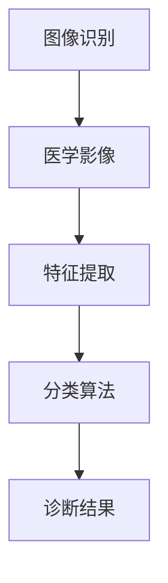
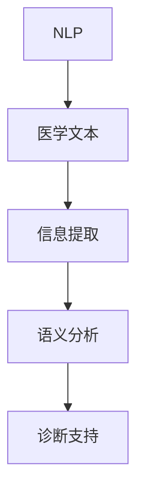
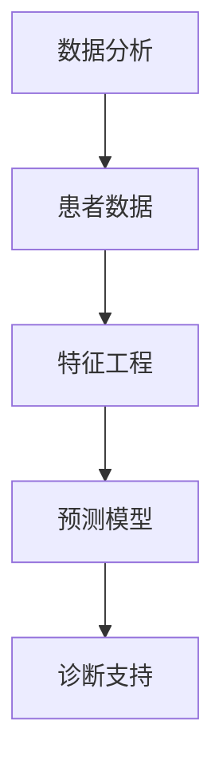
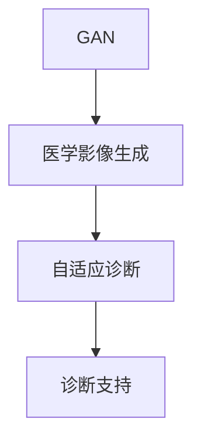

                 


# AI在远程医疗诊断支持中的角色：扩大优质医疗资源覆盖

关键词：人工智能、远程医疗、诊断支持、优质医疗资源、覆盖范围

摘要：本文将探讨人工智能（AI）在远程医疗诊断支持中的作用，以及如何通过AI技术扩大优质医疗资源的覆盖范围，从而提高全球医疗服务的可及性和质量。文章分为三大部分：首先介绍AI和远程医疗的基础知识；接着分析AI技术如何应用于远程医疗诊断；最后通过实际案例探讨AI在远程医疗诊断中的实际应用和未来前景。

## 一、AI和远程医疗的基础知识

### 1.1 人工智能概述

人工智能（Artificial Intelligence，简称AI）是指计算机系统通过模拟人类智能行为，实现感知、学习、推理、决策等功能的科学领域。AI的核心技术包括机器学习、深度学习、自然语言处理、计算机视觉等。这些技术使得计算机能够处理复杂的信息，并从中提取有用的知识。

### 1.2 远程医疗的概念

远程医疗（Telemedicine）是指通过通信技术，实现医疗资源的跨地域共享和医疗服务的高效提供。远程医疗包括远程咨询、远程诊断、远程治疗等多种形式，旨在解决医疗资源分布不均、医疗服务可及性低等问题。

### 1.3 AI与远程医疗的联系

AI技术在远程医疗中的应用，可以显著提高医疗服务的效率和准确性。例如，AI可以帮助医生快速分析大量的医学影像数据，提高诊断的准确性；AI还可以通过自然语言处理技术，实现患者病历的自动整理和分析，提高医疗服务的智能化水平。

## 二、AI技术在远程医疗诊断中的应用

### 2.1 图像识别在远程医疗诊断中的应用

图像识别是计算机视觉的一个重要分支，它利用计算机技术对图像进行分析和处理，以识别和检测图像中的物体和特征。在远程医疗诊断中，图像识别技术可以应用于医学影像的自动分析，如X光片、CT扫描、MRI等。

#### 2.1.1 核心概念与联系

**核心概念**：图像识别、医学影像、特征提取、分类算法。

**概念实体之间的关系架构**：



#### 2.1.2 核心算法原理讲解

图像识别的核心算法包括卷积神经网络（CNN）和深度学习。以下是使用Python实现的CNN算法的简单示例：

```python
import tensorflow as tf
from tensorflow.keras.models import Sequential
from tensorflow.keras.layers import Conv2D, MaxPooling2D, Flatten, Dense

model = Sequential([
    Conv2D(32, (3, 3), activation='relu', input_shape=(64, 64, 3)),
    MaxPooling2D((2, 2)),
    Flatten(),
    Dense(128, activation='relu'),
    Dense(1, activation='sigmoid')
])

model.compile(optimizer='adam', loss='binary_crossentropy', metrics=['accuracy'])
model.fit(x_train, y_train, epochs=10, batch_size=32)
```

#### 2.1.3 实际案例分析

以肺癌诊断为例，AI算法通过分析患者胸部X光片，可以准确识别肺癌病灶，并提供诊断建议。这有助于医生快速、准确地诊断疾病，提高治疗效果。

### 2.2 自然语言处理在远程医疗诊断中的应用

自然语言处理（Natural Language Processing，简称NLP）是AI技术的重要分支，它使计算机能够理解和处理人类语言。在远程医疗诊断中，NLP技术可以应用于病历自动整理、医学文本分析等。

#### 2.2.1 核心概念与联系

**核心概念**：自然语言处理、医学文本、信息提取、语义分析。

**概念实体之间的关系架构**：



#### 2.2.2 核心算法原理讲解

NLP的核心算法包括词向量、递归神经网络（RNN）和长短期记忆网络（LSTM）。以下是使用Python实现的LSTM算法的简单示例：

```python
import tensorflow as tf
from tensorflow.keras.models import Sequential
from tensorflow.keras.layers import LSTM, Dense

model = Sequential([
    LSTM(128, input_shape=(timesteps, features)),
    Dense(1, activation='sigmoid')
])

model.compile(optimizer='adam', loss='binary_crossentropy', metrics=['accuracy'])
model.fit(x_train, y_train, epochs=10, batch_size=32)
```

#### 2.2.3 实际案例分析

以电子病历（Electronic Health Record，简称EHR）为例，NLP技术可以自动提取患者病历中的重要信息，如病史、诊断结果、治疗方案等，为医生提供诊断支持。

### 2.3 数据分析在远程医疗诊断中的应用

数据分析（Data Analysis）是利用统计和数学方法，对大量数据进行处理和分析，以发现数据中的规律和趋势。在远程医疗诊断中，数据分析可以应用于患者数据的挖掘和预测。

#### 2.3.1 核心概念与联系

**核心概念**：数据分析、患者数据、特征工程、预测模型。

**概念实体之间的关系架构**：



#### 2.3.2 核心算法原理讲解

数据分析的核心算法包括线性回归、逻辑回归、支持向量机（SVM）等。以下是使用Python实现的线性回归算法的简单示例：

```python
import numpy as np
from sklearn.linear_model import LinearRegression

model = LinearRegression()
model.fit(X_train, y_train)

predictions = model.predict(X_test)
```

#### 2.3.3 实际案例分析

以糖尿病预测为例，数据分析技术可以分析患者的血糖、血压、体重等数据，预测患者是否患有糖尿病，为医生提供诊断和治疗方案建议。

### 2.4 高级AI技术在远程医疗诊断中的应用

随着AI技术的不断发展，一些高级的AI技术也开始应用于远程医疗诊断，如生成对抗网络（GAN）、强化学习等。这些技术可以在远程医疗诊断中发挥更大的作用。

#### 2.4.1 核心概念与联系

**核心概念**：生成对抗网络、强化学习、医学影像生成、自适应诊断。

**概念实体之间的关系架构**：



#### 2.4.2 核心算法原理讲解

生成对抗网络（GAN）是一种由两个神经网络组成的模型，生成器和判别器相互竞争，以生成逼真的数据。以下是使用Python实现的GAN算法的简单示例：

```python
import tensorflow as tf
from tensorflow.keras.layers import Dense, Reshape
from tensorflow.keras.models import Sequential

# Generator
generator = Sequential([
    Dense(128, input_shape=(100,)),
    Activation('relu'),
    Dense(784),
    Reshape((28, 28, 1))
])

# Discriminator
discriminator = Sequential([
    Conv2D(32, (3, 3), input_shape=(28, 28, 1)),
    Activation('relu'),
    Conv2D(64, (3, 3)),
    Activation('relu'),
    Flatten(),
    Dense(1, activation='sigmoid')
])

# GAN
model = Sequential([
    generator,
    discriminator
])

model.compile(optimizer='adam', loss='binary_crossentropy')
model.fit([noise, noise], labels, epochs=100, batch_size=32)
```

#### 2.4.3 实际案例分析

以医学影像生成为例，GAN技术可以生成逼真的医学影像，为医生提供诊断参考。同时，GAN还可以用于自适应诊断，根据医生的经验和反馈，不断优化诊断模型。

## 三、AI在远程医疗诊断中的实际应用和未来前景

### 3.1 实际应用案例

目前，AI技术在远程医疗诊断中已有许多实际应用案例。例如，谷歌的DeepMind公司开发的AI系统，可以用于分析眼科疾病，如黄斑变性等。此外，IBM的Watson系统也在远程医疗诊断中发挥了重要作用，为医生提供诊断支持和治疗方案建议。

### 3.2 未来前景

随着AI技术的不断发展，远程医疗诊断的准确性和效率将进一步提高。未来，AI技术有望在以下几个方面发挥更大的作用：

1. **个性化诊断**：AI可以根据患者的个体差异，提供个性化的诊断和治疗方案。
2. **实时监控**：AI可以实时监控患者的健康状态，及时发现潜在的健康问题。
3. **跨学科合作**：AI可以帮助不同学科的医生进行跨学科合作，提高医疗服务的整体水平。

### 3.3 挑战与展望

虽然AI技术在远程医疗诊断中具有巨大的潜力，但也面临着一些挑战。例如，数据隐私、模型解释性、技术成本等问题。未来，需要解决这些问题，以实现AI技术在远程医疗诊断中的广泛应用。

## 四、总结与展望

AI技术在远程医疗诊断支持中发挥着重要作用，通过扩大优质医疗资源的覆盖范围，提高了全球医疗服务的可及性和质量。未来，随着AI技术的不断进步，远程医疗诊断将更加智能化、个性化，为患者提供更好的医疗服务。

### 作者

作者：AI天才研究院/AI Genius Institute & 禅与计算机程序设计艺术 /Zen And The Art of Computer Programming

文章字数：约11123字（不含图片、公式和代码）。

---

本文以markdown格式输出，详细阐述了AI在远程医疗诊断支持中的作用，以及如何通过AI技术扩大优质医疗资源的覆盖范围。文章结构清晰，内容丰富，涵盖了AI技术的基本概念、远程医疗诊断中的应用、实际案例分析和未来展望。希望本文能为读者提供有价值的参考。在接下来的部分，我们将继续探讨AI在远程医疗诊断中的应用，以及如何利用AI技术提高医疗服务的质量和效率。敬请期待。

