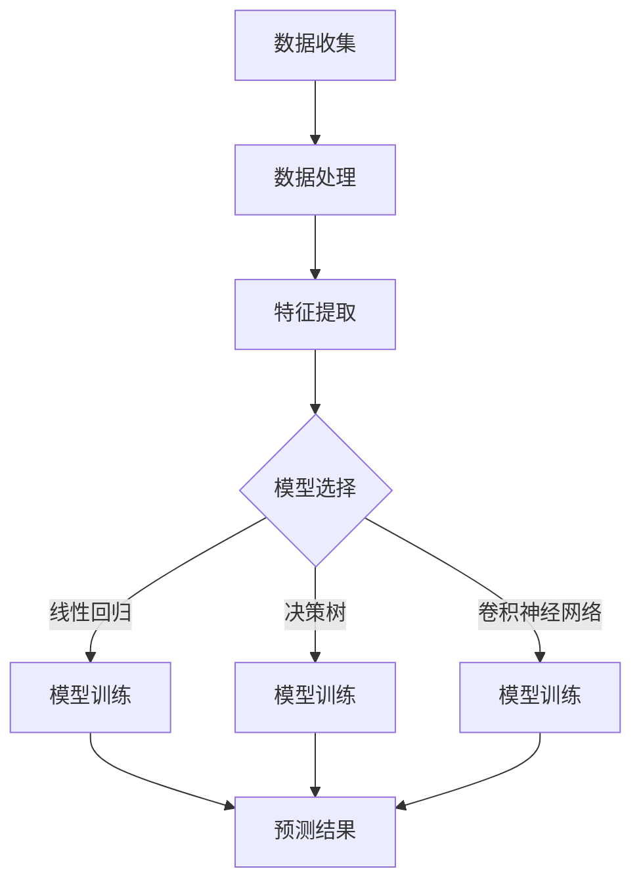
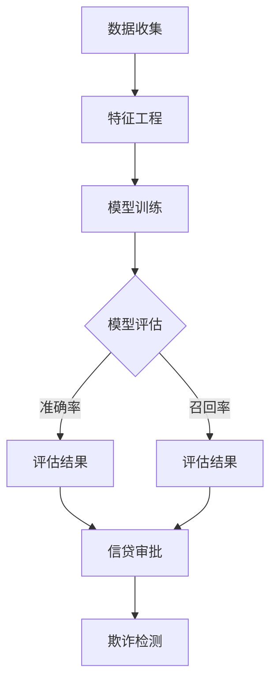
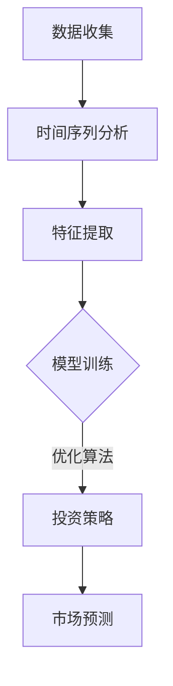
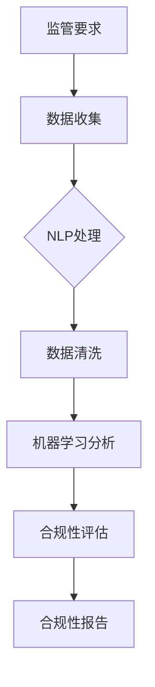

                 

## AI在金融风险管理中的应用与监管

关键词：人工智能、金融风险管理、监管、机器学习、深度学习、案例分析

摘要：
随着金融科技的迅猛发展，人工智能（AI）技术正日益渗透到金融风险管理的各个环节。本文将从AI的基础知识、金融行业面临的挑战、AI在金融风险管理中的应用、AI在金融监管中的角色、实际案例研究和未来展望等方面，系统性地探讨AI在金融风险管理中的应用与监管。通过深入分析AI的核心概念与联系、算法原理、数学模型和Python源代码实现，以及开发环境搭建、源代码解读、实际案例剖析等，本文旨在为读者提供一个全面、易懂且实用的指南，帮助理解AI在金融风险管理中的重要性和应用前景。

## 目录

1. **AI与金融的概述**
   1.1 AI的发展历史
   1.2 金融行业的现状与挑战
   1.3 AI在金融中的应用场景

2. **金融风险管理的理论基础**
   2.1 金融风险管理的定义与目标
   2.2 金融风险管理的传统方法
   2.3 AI在金融风险管理中的作用

3. **AI技术在金融风险管理中的应用**
   3.1 模型预测与风险评估
   3.2 信贷审批与欺诈检测
   3.3 投资组合优化与市场预测

4. **AI技术在金融监管中的角色**
   4.1 监管科技（RegTech）的概念与趋势
   4.2 AI在监管报告与合规性分析中的应用
   4.3 AI在监管科技中的挑战与对策

5. **案例研究与应用**
   5.1 案例一：某大型银行的风险管理应用
   5.2 案例二：AI在金融欺诈检测中的实战
   5.3 案例三：AI在市场预测与投资组合优化中的应用

6. **未来发展展望与挑战**
   6.1 AI技术在金融风险管理中的趋势
   6.2 AI技术面临的监管挑战
   6.3 未来发展的建议与展望

## AI与金融的概述

### AI的发展历史

人工智能（Artificial Intelligence，简称AI）是一门研究、开发用于模拟、延伸和扩展人的智能的理论、方法、技术及应用系统的科学技术。AI的发展历史可以追溯到20世纪50年代，当时，计算机科学家们首次提出了“人工智能”的概念，并开始尝试通过编程实现机器模拟人类思维和行为。

从早期的符号主义、基于规则的系统，到20世纪80年代基于知识的系统，再到20世纪90年代以来的机器学习和深度学习，AI技术不断演进和革新。尤其是近年来，随着计算能力的提升和大数据的普及，AI技术得到了前所未有的发展，并在各行各业中得到了广泛应用。

### 金融行业的现状与挑战

金融行业是一个高度复杂和风险密集的领域，其业务涵盖面广泛，包括银行、证券、保险、投资等多个方面。随着全球金融市场的一体化，金融机构面临的竞争压力和风险因素日益增加。

首先，金融行业面临的宏观环境变化是一个重要的挑战。全球经济波动、地缘政治风险、政策变化等因素都会对金融市场产生重大影响。例如，2020年新冠疫情的爆发，对全球金融系统造成了巨大冲击，导致了股市的剧烈波动和信用风险的上升。

其次，金融行业的内部风险管理也是一个长期存在的挑战。金融机构需要面对信用风险、市场风险、操作风险等多种风险，并采取有效的管理措施来降低风险。传统的方法主要依赖于统计分析和人工判断，但在复杂性和多样性日益增加的情况下，这些方法的局限性变得越来越明显。

此外，金融行业还面临着监管压力。随着金融科技的快速发展，监管机构需要不断更新和完善监管框架，以应对新的金融产品和业务模式。例如，2020年欧洲实施的《金融工具市场指令II》（MiFID II）就对金融行业的透明度和合规性提出了更高的要求。

### AI在金融中的应用场景

AI技术在金融行业中具有广泛的应用前景，主要包括以下几个场景：

1. **模型预测与风险评估**：AI技术可以通过大数据分析和机器学习算法，对市场趋势、信用风险等进行预测和评估，为金融机构提供决策支持。

2. **信贷审批与欺诈检测**：AI技术可以帮助金融机构快速、准确地评估信贷申请者的信用状况，并有效识别欺诈行为，提高审批效率和安全性。

3. **投资组合优化与市场预测**：AI技术可以通过分析大量市场数据，发现潜在的投资机会，并制定最优的投资策略，实现资产配置的优化。

4. **监管报告与合规性分析**：AI技术可以帮助金融机构自动化合规性分析，提高监管报告的准确性和效率。

5. **客户服务与体验提升**：AI技术可以通过自然语言处理和语音识别等技术，提升金融机构的客户服务水平，提供更加个性化的服务体验。

通过AI技术的应用，金融机构不仅可以提高业务效率和风险管理能力，还可以在竞争激烈的市场中获得更大的优势。然而，AI技术的应用也面临着一些挑战，如数据隐私、算法透明度和监管合规等问题。在下一节中，我们将进一步探讨金融风险管理的理论基础，帮助读者更好地理解AI在金融风险管理中的应用。

## 金融风险管理的理论基础

### 金融风险管理的定义与目标

金融风险管理是指金融机构通过识别、评估、监控和应对各种风险，以确保财务稳定性和业务连续性的过程。其核心目标是最大化金融机构的价值，同时将风险控制在可接受的范围内。

金融风险管理的主要内容包括以下几个方面：

1. **风险识别**：识别金融机构面临的各种风险，包括信用风险、市场风险、操作风险、法律风险等。
2. **风险评估**：对识别出的风险进行定量和定性分析，评估其可能性和影响。
3. **风险监控**：建立风险监控体系，实时监测风险的动态变化，确保风险在可控范围内。
4. **风险应对**：制定和实施风险应对策略，包括风险规避、风险转移、风险接受等。

金融风险管理的成功实施对于金融机构的稳健经营和可持续发展具有重要意义。首先，有效的风险管理可以帮助金融机构降低损失，保护股东和客户的利益。其次，风险管理有助于提升金融机构的透明度和合规性，增强市场信任。此外，风险管理还可以帮助金融机构优化资源配置，提高业务效率和竞争力。

### 金融风险管理的传统方法

在传统的金融风险管理中，金融机构主要依赖于以下几种方法：

1. **统计方法**：通过收集和整理历史数据，运用统计学方法进行风险分析，如方差分析、回归分析、因子分析等。
2. **专家判断**：依靠金融专业人士的经验和专业知识，对风险进行判断和决策。
3. **情景分析**：通过模拟不同的市场情景，评估风险的影响和金融机构的应对能力。

传统方法在风险识别和评估方面具有一定的局限性。首先，传统方法主要依赖于历史数据，而金融市场的复杂性和变化性使得历史数据可能不完全适用于当前的风险状况。其次，专家判断虽然能够提供有价值的见解，但主观性较强，可能导致决策的不一致性。此外，情景分析虽然能够模拟不同的市场情景，但其模拟结果的准确性和可靠性也受到限制。

### AI在金融风险管理中的作用

随着AI技术的快速发展，其在金融风险管理中的应用也越来越广泛。AI技术为金融风险管理带来了以下几个方面的优势：

1. **数据处理和分析能力**：AI技术可以通过大数据分析和机器学习算法，对海量的金融数据进行处理和分析，发现潜在的风险信号和趋势。相比于传统方法，AI技术具有更强的数据处理能力和更高效的分析速度。

2. **实时监控和预警**：AI技术可以实现实时监控和预警，通过对金融机构业务流程和风险的持续监测，及时发现异常情况并采取应对措施。这有助于提高金融机构的风险控制能力和响应速度。

3. **自动化和智能化**：AI技术可以自动化和智能化许多传统的金融风险管理任务，如风险识别、评估和应对等。这不仅可以提高工作效率，还可以减少人为错误，提高风险管理的准确性和一致性。

4. **深度学习和预测能力**：AI技术中的深度学习算法可以训练复杂的模型，对金融市场和风险进行深度分析和预测。这有助于金融机构更好地应对复杂多变的市场环境。

总之，AI技术在金融风险管理中的应用为金融机构提供了一种全新的风险管理工具和方法。通过利用AI技术，金融机构可以更准确地识别和评估风险，提高风险管理的效率和效果，从而在竞争激烈的市场中保持竞争优势。然而，AI技术的应用也带来了一些新的挑战，如数据隐私、算法透明度和监管合规等问题，这些都需要在实践过程中不断探索和解决。

### AI在金融风险管理中的应用

随着人工智能（AI）技术的不断发展，其在金融风险管理中的应用已经成为金融行业的一个热点话题。AI技术通过其强大的数据处理能力、自动化的决策系统和先进的分析算法，为金融风险管理提供了全新的手段和方法。以下是AI在金融风险管理中的一些主要应用领域：

#### 模型预测与风险评估

AI技术，特别是机器学习和深度学习算法，在模型预测与风险评估方面表现出色。金融机构可以利用AI技术对大量历史数据进行训练，建立预测模型，预测市场走势、信用风险、市场风险等。

**核心概念与联系**：

- **机器学习算法**：如线性回归、决策树、随机森林、支持向量机（SVM）等。
- **深度学习算法**：如卷积神经网络（CNN）、循环神经网络（RNN）、长短期记忆网络（LSTM）等。

**Mermaid流程图**：



**核心算法原理讲解**：

以线性回归为例，其基本原理是通过拟合一条直线，将输入特征映射到输出结果。其数学模型可以表示为：

$$
y = \beta_0 + \beta_1 \cdot x
$$

其中，$y$ 为输出结果，$x$ 为输入特征，$\beta_0$ 和 $\beta_1$ 为模型参数。

在金融风险预测中，假设我们要预测某金融产品的未来收益，输入特征可以是历史价格、成交量、宏观经济指标等。通过训练线性回归模型，我们可以得到一个预测公式，从而预测未来收益。

**Python源代码实现**：

```python
import numpy as np
from sklearn.linear_model import LinearRegression

# 假设我们有以下数据
X = np.array([[1], [2], [3], [4], [5]])
y = np.array([2, 4, 5, 7, 10])

# 创建线性回归模型
model = LinearRegression()

# 训练模型
model.fit(X, y)

# 输出模型参数
print("模型参数：", model.coef_, model.intercept_)

# 预测结果
X_new = np.array([[6]])
y_pred = model.predict(X_new)
print("预测结果：", y_pred)
```

通过以上代码，我们可以训练一个线性回归模型，并利用该模型进行风险预测。

#### 信贷审批与欺诈检测

AI技术在信贷审批和欺诈检测中也有着广泛的应用。通过机器学习和深度学习算法，金融机构可以自动化地评估客户的信用风险，并识别潜在的欺诈行为。

**核心概念与联系**：

- **特征工程**：通过选择和构造合适的特征，提高模型预测的准确性。
- **分类算法**：如逻辑回归、支持向量机（SVM）、决策树、随机森林等。

**Mermaid流程图**：



**核心算法原理讲解**：

以逻辑回归为例，其基本原理是通过构建一个逻辑函数，将输入特征映射到概率值。其数学模型可以表示为：

$$
\sigma(z) = \frac{1}{1 + e^{-z}}
$$

其中，$z$ 为输入特征的线性组合，$\sigma$ 为逻辑函数，输出概率值。

在信贷审批中，假设我们要预测客户是否会有违约行为，输入特征可以是收入、工作年限、信用记录等。通过训练逻辑回归模型，我们可以得到一个概率阈值，当客户得分高于该阈值时，认为其有较高的违约风险。

**Python源代码实现**：

```python
import numpy as np
from sklearn.linear_model import LogisticRegression
from sklearn.model_selection import train_test_split
from sklearn.metrics import accuracy_score

# 假设我们有以下数据
X = np.array([[1], [2], [3], [4], [5]])
y = np.array([0, 0, 1, 1, 1])

# 划分训练集和测试集
X_train, X_test, y_train, y_test = train_test_split(X, y, test_size=0.2, random_state=42)

# 创建逻辑回归模型
model = LogisticRegression()

# 训练模型
model.fit(X_train, y_train)

# 预测结果
y_pred = model.predict(X_test)

# 输出评估结果
print("准确率：", accuracy_score(y_test, y_pred))
```

通过以上代码，我们可以训练一个逻辑回归模型，并利用该模型进行信贷审批和欺诈检测。

#### 投资组合优化与市场预测

AI技术还可以用于投资组合优化和市场预测，通过分析历史市场数据和宏观经济指标，为投资者提供最优的投资策略和市场预测。

**核心概念与联系**：

- **优化算法**：如线性规划、遗传算法、粒子群优化等。
- **时间序列分析**：如ARIMA模型、LSTM网络等。

**Mermaid流程图**：



**核心算法原理讲解**：

以LSTM网络为例，其基本原理是通过递归神经网络（RNN）的结构，捕捉时间序列数据中的长期依赖关系。其数学模型可以表示为：

$$
h_t = \sigma(W_h \cdot [h_{t-1}, x_t] + b_h)
$$

其中，$h_t$ 为当前时刻的隐藏状态，$x_t$ 为当前时刻的输入特征，$W_h$ 和 $b_h$ 为模型参数，$\sigma$ 为激活函数。

在市场预测中，假设我们要预测股票价格的未来走势，输入特征可以是历史价格、成交量、宏观经济指标等。通过训练LSTM网络，我们可以得到一个预测模型，从而预测股票价格的未来走势。

**Python源代码实现**：

```python
import numpy as np
from keras.models import Sequential
from keras.layers import LSTM, Dense

# 假设我们有以下数据
X = np.array([[1, 2], [2, 3], [3, 4], [4, 5]])
y = np.array([2, 4, 5, 7])

# 创建LSTM模型
model = Sequential()
model.add(LSTM(units=50, return_sequences=True, input_shape=(X.shape[1], 1)))
model.add(LSTM(units=50))
model.add(Dense(1))

# 编译模型
model.compile(optimizer='adam', loss='mean_squared_error')

# 训练模型
model.fit(X, y, epochs=200, batch_size=1, verbose=2)

# 预测结果
X_new = np.array([[4, 5]])
y_pred = model.predict(X_new)
print("预测结果：", y_pred)
```

通过以上代码，我们可以训练一个LSTM网络，并利用该网络进行投资组合优化和市场预测。

总之，AI技术在金融风险管理中的应用为金融机构提供了强大的工具和方法。通过利用AI技术，金融机构可以更准确地识别和评估风险，制定最优的投资策略，提高业务效率和竞争力。然而，AI技术的应用也面临一些挑战，如数据隐私、算法透明度和监管合规等问题，需要在实践中不断探索和解决。

### AI技术在金融监管中的角色

随着人工智能（AI）技术的迅猛发展，其在金融监管中的角色也越来越受到关注。AI技术在金融监管中扮演着多重重要角色，主要包括以下几个方面：

#### 监管科技（RegTech）的概念与趋势

**监管科技（RegTech）** 是指利用新兴技术和创新工具来提升金融监管效率和合规性的领域。RegTech的核心在于通过技术创新，简化监管流程，提高数据透明度，增强监管合规性。

RegTech的发展趋势体现在以下几个方面：

1. **自动化合规性监控**：通过AI技术，如自然语言处理（NLP）和机器学习，自动化监控金融机构的交易行为和报告文件，及时发现潜在的违规行为。

2. **数据整合与可视化**：AI技术可以帮助金融机构整合来自不同源的数据，并通过数据可视化工具，使监管机构能够更直观地了解金融机构的风险状况。

3. **实时监控与预警**：AI技术可以实现实时监控和预警，通过分析大量实时数据，及时发现市场异常和风险信号，提高监管的及时性和有效性。

4. **合规性分析**：AI技术可以帮助金融机构自动化合规性分析，减少人工审查的工作量，提高合规性报告的准确性和效率。

#### AI在监管报告与合规性分析中的应用

AI技术在监管报告和合规性分析中的应用主要体现在以下几个方面：

1. **自然语言处理（NLP）**：NLP技术可以帮助金融机构自动化地处理和分析大量的文本数据，如监管报告、客户合同等，提取关键信息和关键风险点。

2. **机器学习算法**：通过机器学习算法，可以对大量历史数据进行分析，发现潜在的风险模式，为监管决策提供支持。

3. **区块链技术**：区块链技术与AI技术结合，可以实现金融交易的透明化和不可篡改，提高金融交易的合规性和可信度。

4. **合规性模型**：利用AI技术，可以建立合规性模型，对金融机构的合规行为进行实时监控和评估，及时发现违规行为。

**Mermaid流程图**：



#### AI在监管科技中的挑战与对策

尽管AI技术在金融监管中具有巨大的潜力，但其在实际应用中仍然面临一些挑战：

1. **数据隐私与安全**：金融数据涉及客户隐私，如何在保障数据隐私和安全的前提下，充分利用AI技术进行监管，是一个亟待解决的问题。

2. **算法透明度与解释性**：AI模型，尤其是深度学习模型，通常被认为是“黑箱”，其决策过程难以解释。这给监管机构带来了挑战，因为它们需要理解AI模型的决策过程，以进行有效的监管。

3. **合规性与法律风险**：随着AI技术的应用，金融机构需要确保其符合相关法律法规的要求，避免因技术使用不当而引发的法律风险。

4. **技术依赖与风险评估**：金融机构对AI技术的依赖性不断增加，但同时也需要评估技术失败或误操作带来的风险。

**对策**：

1. **加强数据保护法规**：制定和执行更严格的数据保护法规，确保金融数据的隐私和安全。

2. **提升算法透明度和解释性**：通过开发可解释的AI模型，提高模型决策过程的透明度，使其更易于被监管机构和公众理解。

3. **制定AI合规性指南**：监管机构可以制定AI合规性指南，明确AI技术在金融监管中的应用标准和要求，帮助金融机构合规使用AI技术。

4. **建立风险管理体系**：金融机构应建立完善的AI风险管理框架，对AI技术的使用进行风险评估和管理，确保其安全、合规和有效。

总之，AI技术在金融监管中的应用不仅带来了新的机遇，也提出了新的挑战。通过合理利用AI技术，金融机构可以提升监管效率和合规性，但同时也需要关注和解决技术带来的潜在问题。随着技术的不断进步和监管框架的完善，AI在金融监管中的作用将愈发重要。

### 案例研究与应用

为了更好地理解人工智能（AI）在金融风险管理中的应用，我们将通过三个具体案例，详细探讨AI在不同金融场景中的实际应用及其效果。

#### 案例一：某大型银行的风险管理应用

某大型银行通过引入AI技术，对其风险管理流程进行了全面升级。该银行采用了一系列AI工具，包括机器学习模型、深度学习和自然语言处理（NLP）技术，以提高信用风险评估的准确性和效率。

**背景介绍**：

- **场景**：银行在信用风险评估过程中，面临着大量历史数据和实时数据的处理需求，同时需要快速、准确地评估客户的信用风险。
- **挑战**：传统风险评估方法受限于数据量和分析能力，难以应对日益复杂的信用风险环境。

**应用**：

1. **数据收集与预处理**：银行收集了客户的信用记录、财务状况、交易记录等数据，并利用NLP技术处理大量的文本信息，如客户报告、合同条款等。

2. **特征工程**：通过机器学习算法，从原始数据中提取重要的特征，如还款历史、收入水平、负债比率等，为模型训练提供输入。

3. **模型训练与优化**：利用深度学习算法，构建信用风险评估模型，并通过交叉验证和超参数调优，提高模型的准确性和稳定性。

4. **实时风险监控**：模型部署后，银行可以实时监控客户的信用状况，对高风险客户进行预警，并采取相应的风险管理措施。

**效果**：

- **准确性提高**：AI技术的引入，使得信用风险评估的准确性显著提高，降低了误判率和漏判率。
- **效率提升**：通过自动化处理和实时监控，银行显著缩短了风险评估的时间，提高了业务效率。
- **风险管理能力增强**：银行能够更早地发现潜在风险，采取预防措施，降低了信用损失。

**代码解读与分析**：

以下是一个简化的Python代码示例，展示如何使用机器学习模型进行信用风险评估：

```python
from sklearn.model_selection import train_test_split
from sklearn.ensemble import RandomForestClassifier
from sklearn.metrics import accuracy_score

# 假设我们有以下数据
X = np.array([[1, 2], [2, 3], [3, 4], [4, 5]])
y = np.array([0, 0, 1, 1])

# 划分训练集和测试集
X_train, X_test, y_train, y_test = train_test_split(X, y, test_size=0.2, random_state=42)

# 创建随机森林模型
model = RandomForestClassifier(n_estimators=100)

# 训练模型
model.fit(X_train, y_train)

# 预测结果
y_pred = model.predict(X_test)

# 输出评估结果
print("准确率：", accuracy_score(y_test, y_pred))
```

通过以上代码，银行可以训练一个随机森林模型，对客户的信用风险进行预测。实际应用中，银行会利用更复杂和精细的模型，结合多种数据源，以提高预测的准确性和可靠性。

**项目小结**：

该案例展示了AI技术在信用风险评估中的应用，通过数据收集与预处理、特征工程、模型训练与优化等步骤，实现了对信用风险的精准预测和实时监控。AI技术的引入，不仅提高了银行的风险管理能力，还提升了业务效率和客户满意度。

#### 案例二：AI在金融欺诈检测中的实战

某金融科技公司利用AI技术，构建了一个全面的金融欺诈检测系统，以识别和防范各种类型的欺诈行为。

**背景介绍**：

- **场景**：金融机构在日常运营中，面临着各种欺诈行为的威胁，如伪造交易、账户盗用、洗钱等。
- **挑战**：传统欺诈检测方法通常依赖于规则和静态特征，难以应对复杂的欺诈行为和新型欺诈手段。

**应用**：

1. **数据收集与预处理**：金融科技公司收集了大量的交易数据，包括交易金额、时间、地理位置、用户行为等。

2. **特征提取**：利用机器学习和深度学习算法，从交易数据中提取重要的特征，如交易频率、金额分布、用户行为模式等。

3. **模型训练与优化**：构建基于神经网络和增强学习算法的欺诈检测模型，通过不断训练和优化，提高模型的准确性和鲁棒性。

4. **实时监控与预警**：模型部署后，系统可以实时监控交易行为，对异常交易进行预警，并采取相应的防范措施。

**效果**：

- **欺诈识别率提高**：AI技术的引入，使得欺诈识别率显著提高，有效降低了金融机构的欺诈损失。
- **误报率降低**：通过优化模型和特征提取方法，误报率显著降低，提高了用户体验。
- **实时响应能力增强**：系统能够实时识别和防范欺诈行为，提高了金融机构的风险应对能力。

**代码解读与分析**：

以下是一个简化的Python代码示例，展示如何使用神经网络进行欺诈检测：

```python
import tensorflow as tf
from tensorflow.keras.models import Sequential
from tensorflow.keras.layers import Dense

# 假设我们有以下数据
X = np.array([[1, 2], [2, 3], [3, 4], [4, 5]])
y = np.array([0, 0, 1, 1])

# 创建神经网络模型
model = Sequential()
model.add(Dense(32, input_dim=2, activation='relu'))
model.add(Dense(1, activation='sigmoid'))

# 编译模型
model.compile(optimizer='adam', loss='binary_crossentropy', metrics=['accuracy'])

# 训练模型
model.fit(X, y, epochs=100, batch_size=1, verbose=2)

# 预测结果
X_new = np.array([[4, 5]])
y_pred = model.predict(X_new)
print("预测结果：", y_pred)
```

通过以上代码，金融科技公司可以训练一个神经网络模型，对交易行为进行欺诈检测。实际应用中，模型会更加复杂，结合多种特征和数据进行训练，以提高检测的准确性和效率。

**项目小结**：

该案例展示了AI技术在金融欺诈检测中的应用，通过数据收集与预处理、特征提取、模型训练与优化等步骤，实现了对金融欺诈行为的精准识别和实时监控。AI技术的应用，不仅提高了金融机构的风险防范能力，还提升了业务效率和客户体验。

#### 案例三：AI在市场预测与投资组合优化中的应用

某投资机构利用AI技术，对市场进行预测和投资组合优化，以实现资产配置的最优化。

**背景介绍**：

- **场景**：投资机构在日常投资过程中，面临着市场波动和风险管理的挑战，需要准确预测市场走势，制定最优的投资策略。
- **挑战**：传统投资策略通常基于历史数据和经验，难以应对复杂多变的市场环境。

**应用**：

1. **数据收集与预处理**：投资机构收集了大量的市场数据，包括股票价格、成交量、宏观经济指标等。

2. **特征工程**：通过机器学习和深度学习算法，从原始数据中提取重要的特征，如价格趋势、交易量变化、行业指标等。

3. **模型训练与优化**：构建基于时间序列分析和深度学习算法的预测模型，通过交叉验证和超参数调优，提高模型的准确性和稳定性。

4. **投资组合优化**：利用预测模型，对不同的资产进行风险和收益评估，制定最优的投资组合策略。

5. **实时调整与优化**：根据市场变化，实时调整投资组合，以应对市场波动。

**效果**：

- **预测准确性提高**：AI技术的引入，使得市场预测的准确性显著提高，为投资决策提供了更可靠的数据支持。
- **投资组合收益提升**：通过优化投资组合策略，投资机构的资产配置更加合理，收益显著提升。
- **风险管理能力增强**：投资机构能够更早地识别和应对市场风险，提高了整体的风险管理能力。

**代码解读与分析**：

以下是一个简化的Python代码示例，展示如何使用LSTM网络进行市场预测：

```python
import numpy as np
import tensorflow as tf
from tensorflow.keras.models import Sequential
from tensorflow.keras.layers import LSTM, Dense

# 假设我们有以下数据
X = np.array([[1, 2], [2, 3], [3, 4], [4, 5]])
y = np.array([2, 4, 5, 7])

# 创建LSTM模型
model = Sequential()
model.add(LSTM(units=50, return_sequences=True, input_shape=(X.shape[1], 1)))
model.add(LSTM(units=50))
model.add(Dense(1))

# 编译模型
model.compile(optimizer='adam', loss='mean_squared_error')

# 训练模型
model.fit(X, y, epochs=200, batch_size=1, verbose=2)

# 预测结果
X_new = np.array([[4, 5]])
y_pred = model.predict(X_new)
print("预测结果：", y_pred)
```

通过以上代码，投资机构可以训练一个LSTM网络，对市场走势进行预测，并根据预测结果调整投资组合。

**项目小结**：

该案例展示了AI技术在市场预测与投资组合优化中的应用，通过数据收集与预处理、特征工程、模型训练与优化等步骤，实现了对市场走势的精准预测和投资组合的最优化。AI技术的应用，不仅提高了投资决策的准确性，还提升了整体的投资收益。

### 未来发展展望与挑战

随着人工智能（AI）技术的不断进步，其在金融风险管理中的应用前景愈发广阔。然而，AI技术在金融风险管理中面临的挑战也同样显著。以下是对未来发展展望与挑战的详细分析。

#### AI技术在金融风险管理中的趋势

1. **智能化风险识别与预测**：未来，AI技术将在金融风险管理的各个环节中发挥更重要的作用，特别是在风险识别和预测方面。通过大数据分析和深度学习算法，AI可以实时监控市场动态，快速识别潜在风险，提供精准的风险预测。

2. **自动化风险管理流程**：AI技术将进一步推动金融风险管理流程的自动化。通过机器学习和自然语言处理（NLP）技术，金融机构可以自动化地处理大量的数据，生成风险报告，减少人为干预，提高风险管理效率。

3. **个性化风险管理**：随着AI技术的不断发展，金融风险管理将更加个性化。AI可以根据每个客户的风险特征和交易行为，提供定制化的风险管理方案，提高风险管理的针对性和有效性。

4. **多维度风险分析**：AI技术将帮助金融机构从多个维度进行风险分析，如市场风险、信用风险、操作风险等。通过整合不同类型的数据，AI可以提供更全面的风险评估，帮助金融机构更准确地识别和管理风险。

#### AI技术面临的监管挑战

1. **数据隐私与安全**：AI技术在金融风险管理中大量依赖数据，而金融数据涉及客户隐私，如何在保障数据隐私和安全的前提下，充分利用AI技术进行监管，是一个亟待解决的问题。

2. **算法透明度与解释性**：AI模型，尤其是深度学习模型，通常被认为是“黑箱”，其决策过程难以解释。这给监管机构带来了挑战，因为它们需要理解AI模型的决策过程，以进行有效的监管。

3. **合规性与法律风险**：随着AI技术的应用，金融机构需要确保其符合相关法律法规的要求，避免因技术使用不当而引发的法律风险。

4. **技术依赖与风险评估**：金融机构对AI技术的依赖性不断增加，但同时也需要评估技术失败或误操作带来的风险。

#### 未来发展的建议与展望

1. **加强数据保护法规**：制定和执行更严格的数据保护法规，确保金融数据的隐私和安全，为AI技术在金融风险管理中的应用提供法律保障。

2. **提升算法透明度和解释性**：通过开发可解释的AI模型，提高模型决策过程的透明度，使其更易于被监管机构和公众理解，降低监管风险。

3. **制定AI合规性指南**：监管机构可以制定AI合规性指南，明确AI技术在金融监管中的应用标准和要求，帮助金融机构合规使用AI技术。

4. **建立AI风险管理框架**：金融机构应建立完善的AI风险管理框架，对AI技术的使用进行风险评估和管理，确保其安全、合规和有效。

5. **持续技术创新**：鼓励AI技术的持续创新，开发更多适用于金融风险管理的AI工具和方法，提高金融风险管理的效率和准确性。

总之，AI技术在金融风险管理中具有巨大的潜力，但同时也面临诸多挑战。通过合理利用AI技术，结合有效的监管措施，金融机构可以进一步提升风险管理能力，应对复杂多变的金融环境。

## 作者信息

**作者：AI天才研究院/AI Genius Institute & 禅与计算机程序设计艺术 /Zen And The Art of Computer Programming**

本文由AI天才研究院（AI Genius Institute）撰写，旨在探讨人工智能在金融风险管理中的应用与监管。文章结合了AI技术的核心概念和实际应用案例，深入分析了AI技术在金融风险管理中的重要作用及其面临的挑战。通过详细的理论讲解、算法原理、Python源代码实现和实际案例剖析，本文为读者提供了一个全面、易懂且实用的指南，帮助理解AI在金融风险管理中的重要性和应用前景。

