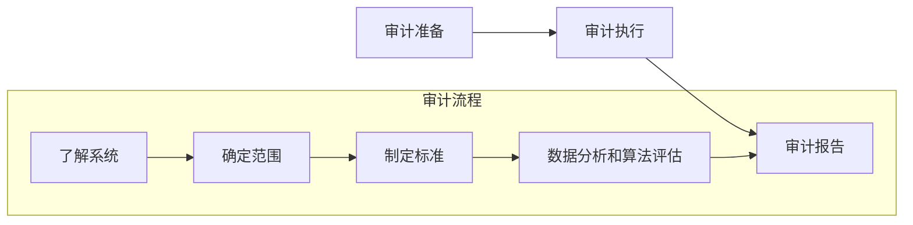

                 

# AI审计工具：确保企业AI系统合规性的解决方案

## 关键词
AI审计、合规性、企业AI系统、审计工具、技术实现、案例剖析、最佳实践

## 摘要
随着人工智能（AI）在企业中的广泛应用，AI系统的合规性问题愈发凸显。本文旨在介绍AI审计工具及其在确保企业AI系统合规性方面的应用。首先，我们定义了AI审计的概念，并探讨了其在企业中的重要性。接着，我们分析了AI审计的基本原理和关键挑战，详细介绍了审计工具和技术。随后，通过案例分析，我们展示了AI审计工具在具体行业中的应用效果。文章最后，我们探讨了AI审计工具的开发与部署流程，并提出了未来的发展趋势和行业建议。

## 目录

### 引言与背景

#### 1.1 AI审计的基本概念

#### 1.2 企业AI系统合规性的重要性

#### 1.3 书籍目的与结构概述

### AI审计原理

#### 2.1 AI审计的定义与目的

#### 2.2 AI审计的关键挑战

#### 2.3 AI审计的基本流程

### AI审计合规要求

#### 3.1 相关法律法规和标准

#### 3.2 企业合规性评估方法

#### 3.3 审计合规性案例分析

### AI审计工具与技术

#### 4.1 AI审计工具的分类

#### 4.2 常用AI审计技术

#### 4.3 技术实现原理与流程

### AI审计工具应用实例

#### 5.1 典型行业应用

#### 5.2 实际案例分享

#### 5.3 案例分析与讨论

### AI审计工具的开发与部署

#### 6.1 开发流程与工具链

#### 6.2 数据准备与处理

#### 6.3 系统部署与运维

### 未来展望与趋势

#### 7.1 AI审计的发展趋势

#### 7.2 新兴技术与挑战

#### 7.3 行业展望与建议

### 附录

#### 附录A 常用工具与资源

## 引言与背景

### 1.1 AI审计的基本概念

人工智能（AI）作为现代科技的核心驱动力，正在深刻改变各行各业。企业在运用AI技术提高效率、降低成本的同时，也面临合规性风险。AI审计是一种针对企业AI系统的审计方法，旨在确保AI系统的合规性、透明性和可靠性。

AI审计的定义可以概括为：通过系统性的检查和评估，对AI系统的设计、开发、部署和使用过程进行审查，确保其符合相关法律法规、行业标准和企业内部规定。AI审计不仅关注技术合规性，还包括法律、伦理、数据隐私等多方面的合规性。

AI审计在企业中的重要性主要体现在以下几个方面：

1. **保障企业合规性**：随着全球范围内对数据隐私、伦理和法律的要求日益严格，AI审计帮助企业规避潜在的法律风险，确保合规运营。

2. **提升AI系统可靠性**：通过审计，发现和纠正AI系统中的潜在错误和缺陷，提高系统的稳定性和可靠性。

3. **增强客户信任**：透明和合规的AI系统有助于建立客户信任，提升企业在市场竞争中的地位。

4. **支持监管合规**：企业需要应对来自不同国家和地区监管机构的要求，AI审计能够提供合规性的证据，减少监管压力。

### 1.2 企业AI系统合规性的重要性

企业AI系统的合规性涉及多个方面，包括数据隐私保护、算法透明性、伦理道德和法律法规遵守等。以下是企业AI系统合规性的几个关键点：

1. **数据隐私保护**：AI系统依赖于大量数据，如何保护用户数据隐私成为合规性的核心问题。企业必须确保数据收集、存储、处理和传输过程符合数据隐私保护法规。

2. **算法透明性**：算法的透明性是企业AI系统合规性的重要指标。用户和监管机构有权了解AI系统的工作原理和决策过程，企业需要提供透明的算法解释。

3. **伦理道德**：AI系统的应用必须遵循伦理道德标准，避免对用户造成不公平待遇或歧视。例如，避免在招聘、贷款审批等环节中使用具有偏见性的算法。

4. **法律法规遵守**：企业AI系统需要遵循相关国家和地区的法律法规，如欧盟的《通用数据保护条例》（GDPR）、美国的《加州消费者隐私法》（CCPA）等。

### 1.3 书籍目的与结构概述

本文旨在为读者提供一份全面、系统的AI审计指南。通过详细分析AI审计的基本概念、原理、合规要求、技术实现和应用实例，本文希望能够帮助企业和专业人士：

1. **理解AI审计的重要性**：认识AI审计对于企业合规性、系统可靠性和市场竞争的重要性。

2. **掌握AI审计的原理和方法**：了解AI审计的基本流程、关键技术和挑战。

3. **应用AI审计工具**：掌握AI审计工具的选择、配置和使用方法。

4. **进行AI审计实践**：通过案例分析，学习如何在实际项目中应用AI审计工具。

本文结构如下：

- **第2章 AI审计原理**：介绍AI审计的定义、目的、关键挑战和基本流程。

- **第3章 AI审计合规要求**：探讨相关法律法规和标准，以及企业合规性评估方法。

- **第4章 AI审计工具与技术**：分类介绍AI审计工具，详细讲解常用技术及其实现原理。

- **第5章 AI审计工具应用实例**：分析AI审计工具在典型行业中的应用案例。

- **第6章 AI审计工具的开发与部署**：阐述AI审计工具的开发流程、数据准备和系统部署。

- **第7章 未来展望与趋势**：探讨AI审计的发展趋势和新兴技术，以及行业展望和建议。

通过本文的阅读，读者将能够全面了解AI审计的方方面面，为实际工作提供有力支持。

### AI审计原理

### 2.1 AI审计的定义与目的

AI审计是一种针对人工智能系统的系统性和全面性的审计过程，旨在确保这些系统能够遵循既定的法律法规、行业标准和内部政策。AI审计不仅涉及技术层面的合规性，还包括法律、伦理和隐私等多方面的问题。

**AI审计的定义**

AI审计是指对人工智能系统的设计、开发、部署和使用过程进行全面审查和评估，以确定其是否符合相关法规、标准和政策。AI审计的目标是确保系统的透明性、公正性、可靠性以及合规性。

**AI审计的目的**

1. **确保合规性**：随着各国对AI技术的监管日益严格，AI审计可以帮助企业确保其AI系统符合相关法律法规的要求，如欧盟的GDPR、美国的CCPA等。

2. **提高系统透明度**：AI系统的决策过程通常较为复杂，AI审计可以促进算法的透明化，使得系统决策过程更加清晰易懂，增强用户的信任。

3. **减少偏见和歧视**：通过审计，可以发现和纠正AI系统中的潜在偏见，确保系统不会对特定群体造成不公平待遇。

4. **提升系统可靠性**：审计过程中可以发现并修复AI系统中的缺陷，从而提高系统的稳定性和可靠性。

5. **支持监管合规**：AI审计提供了一种验证企业合规性的方法，有助于企业应对监管机构的审查。

### 2.2 AI审计的关键挑战

尽管AI审计具有重要意义，但在实际操作中仍面临诸多挑战：

**1. 技术复杂性**

AI系统的设计和实现涉及多种复杂的技术，如机器学习、深度学习、自然语言处理等。审计人员需要具备深厚的技术背景，才能理解和评估AI系统的合规性。

**2. 数据隐私保护**

AI系统通常依赖于大量敏感数据，如何在保护数据隐私的同时进行审计，是AI审计面临的重大挑战。审计人员需要确保在审计过程中不泄露敏感信息。

**3. 算法透明性**

AI算法的决策过程往往是非线性和复杂的，使得审计人员难以完全理解其工作原理。提高算法的透明性，使其更易于审计，是当前的一大难题。

**4. 法律和伦理问题**

AI审计不仅要遵循技术层面的规范，还需要考虑法律和伦理问题。不同国家和地区的法律法规可能存在差异，审计人员需要具备跨文化的法律和伦理意识。

**5. 审计工具和资源的不足**

目前，针对AI审计的工具和资源相对有限，审计人员需要开发或选择合适的审计工具，以高效地进行审计。

### 2.3 AI审计的基本流程

AI审计的基本流程通常包括以下几个步骤：

**1. 审计准备**

在审计准备阶段，审计人员需要了解企业的AI系统，包括其设计、开发、部署和使用过程。此外，审计人员还需要确定审计的范围、目标和标准。

**2. 审计执行**

在审计执行阶段，审计人员会进行详细的检查和评估，包括对AI系统的技术、法律、伦理等多个方面进行审查。审计人员可能会使用自动化工具进行数据分析和算法评估。

**3. 审计报告**

审计报告是AI审计的最终成果，它详细记录了审计过程、发现的问题和整改建议。审计报告需要提供清晰、详细的审计结果，以便企业进行改进。

### AI审计原理的Mermaid流程图

为了更好地理解AI审计的基本流程，我们可以使用Mermaid流程图来展示：



通过上述流程，我们可以清晰地看到AI审计的各个环节及其相互关系。

### AI审计合规要求

AI审计的合规性要求是确保AI系统在设计和运行过程中符合法律法规、行业标准和内部政策的关键。合规性要求不仅关乎企业的法律责任，也直接影响企业的声誉和市场竞争力。以下将详细探讨AI审计合规要求的各个方面。

#### 3.1 相关法律法规和标准

AI审计需要遵守的法律法规和标准多种多样，以下是一些重要的国际和国内法规：

**1. 国际法规和标准**

- **欧盟的《通用数据保护条例》（GDPR）**：GDPR是欧盟制定的关于数据隐私保护的重要法律，对企业的数据处理活动提出了严格的要求，如数据透明性、用户同意和数据主体权利等。

- **美国的《加州消费者隐私法》（CCPA）**：CCPA是美国加州针对消费者数据隐私保护的一项法律，规定了企业的数据处理行为和数据披露要求。

- **《通用人工智能伦理规范》**：多个国家和组织发布了关于人工智能的伦理规范，如欧盟的《人工智能伦理指南》和联合国的《人工智能伦理建议》，这些规范提供了关于AI系统设计和使用的伦理指导。

**2. 国内法规和标准**

- **《网络安全法》**：中国的《网络安全法》规定了网络运营者在数据收集、存储、处理和传输过程中的合规要求，对AI系统的运行提出了法律约束。

- **《个人信息保护法》**：中国的《个人信息保护法》针对个人信息保护提出了详细的要求，包括个人信息的收集、使用和保护。

- **《人工智能发展行动计划》**：中国政府发布了《人工智能发展行动计划》，提出了人工智能发展的目标和要求，包括AI系统的合规性和伦理问题。

#### 3.2 企业合规性评估方法

为了确保AI系统的合规性，企业需要采用系统化的方法进行合规性评估。以下是一些常用的评估方法：

**1. 自我评估方法**

- **内部审计**：企业内部设立专门的合规审计团队，对AI系统进行定期的内部审计，检查系统是否符合相关法律法规和内部规定。

- **合规性审查**：定期对AI系统的设计和运行文档进行审查，确保其符合法律法规的要求。

**2. 第三方评估方法**

- **外部审计**：聘请第三方专业机构对企业AI系统进行审计，提供独立的合规性评估报告。

- **认证和标签**：通过获得第三方认证，如ISO 27001（信息安全管理系统认证）和ISO 37001（合规管理体系认证），证明企业的AI系统符合相关标准。

**3. 评估流程与工具**

- **风险评估**：通过识别和评估AI系统潜在的风险，确定审计的重点领域。

- **合规性检查清单**：制定详细的合规性检查清单，涵盖法律法规、行业标准和内部政策，确保全面覆盖。

- **审计工具**：使用自动化工具和软件，如合规性审计工具、数据隐私保护工具和算法透明性分析工具，提高审计效率。

#### 3.3 审计合规性案例分析

以下是一个关于企业AI审计合规性评估的案例：

**案例背景**：某金融公司开发了一款基于机器学习的风险评估系统，用于预测贷款申请者的信用风险。

**合规性评估过程**：

1. **风险评估**：公司识别了系统在数据处理、算法透明性和用户隐私保护等方面的潜在合规风险。

2. **制定合规性检查清单**：根据相关法律法规和行业标准，制定了详细的合规性检查清单。

3. **内部审计**：内部合规审计团队对系统的设计和运行文档进行了审查，发现了一些潜在的问题。

4. **第三方外部审计**：公司聘请了一家第三方专业机构进行外部审计，进一步确认系统的合规性。

5. **整改措施**：基于审计结果，公司采取了一系列整改措施，包括改进数据处理流程、增加算法透明性和加强用户隐私保护。

6. **合规性报告**：公司编制了一份详细的合规性评估报告，记录了审计过程、发现的问题和整改措施。

通过上述案例，我们可以看到，企业AI审计合规性评估是一个系统化和全面性的过程，需要内部和外部审计相结合，确保AI系统的合规性和可靠性。

### AI审计工具与技术

AI审计工具和技术是确保企业AI系统合规性的关键。这些工具和技术可以帮助企业评估、监控和改进其AI系统的合规性。本文将介绍AI审计工具的分类、常用技术及其实现原理。

#### 4.1 AI审计工具的分类

AI审计工具可以分为开源工具、商业工具和混合工具。每种工具都有其独特的功能和优势，适用于不同的审计需求。

**1. 开源工具**

开源工具具有成本效益高、可定制性强等优点。以下是一些常用的开源AI审计工具：

- **AI Compliance Toolkit**：该工具集提供了一系列AI合规性检查脚本，帮助用户识别和修复AI系统中的合规性问题。

- **AI Fairness 360**：这是一个用于评估AI系统公平性的开源工具，支持多种算法和数据的公平性分析。

- **Google JAX**：Google开发的JAX是一个用于数值计算和自动微分的开源库，支持AI系统的透明性和可解释性分析。

**2. 商业工具**

商业工具通常提供更加全面的功能和专业的支持。以下是一些常用的商业AI审计工具：

- **Paxata**：Paxata提供数据准备和治理工具，帮助企业确保数据合规性，并支持AI系统的数据源审计。

- **AItify**：AItify是一个AI审计和合规性平台，提供自动化合规性评估、算法透明性和偏见分析等功能。

- **Compliance.ai**：Compliance.ai提供基于AI的合规性监控和预警工具，帮助企业在数据隐私保护和法律合规性方面保持领先。

**3. 混合工具**

混合工具结合了开源工具和商业工具的优势，适用于复杂的审计需求。以下是一些混合工具：

- **DataRobot**：DataRobot是一个自动化机器学习平台，提供了丰富的AI审计功能，包括模型解释、合规性评估和偏见分析。

- **Dataiku**：Dataiku提供了数据科学平台，结合了开源工具和商业功能，支持AI系统的合规性和可解释性分析。

#### 4.2 常用AI审计技术

以下是一些常用的AI审计技术及其实现原理：

**1. 数据隐私保护技术**

数据隐私保护技术用于确保AI系统在训练和使用过程中不泄露敏感数据。以下是一些常见的数据隐私保护技术：

- **差分隐私（Differential Privacy）**：差分隐私通过在数据添加噪声来保护隐私，确保单个数据点的隐私同时不影响整体数据分析结果。

- **同态加密（Homomorphic Encryption）**：同态加密允许在加密数据上进行计算，而不需要解密数据，从而在数据处理过程中保护数据隐私。

- **联邦学习（Federated Learning）**：联邦学习通过分布式数据集上的模型训练，避免了数据的集中存储，减少了数据泄露的风险。

**2. AI透明性技术**

AI透明性技术用于提高AI系统的可解释性和透明度，以下是一些常见的AI透明性技术：

- **模型可解释性（Model Interpretability）**：模型可解释性技术通过提供模型决策的解释，帮助用户理解AI系统的行为。

- **可视分析（Visual Analytics）**：可视分析技术通过可视化方法，将复杂的数据和模型决策呈现给用户，提高系统的透明度。

- **决策树（Decision Trees）**：决策树是一种直观的可解释模型，能够清晰地展示模型的决策过程。

**3. AI偏见减少技术**

AI偏见减少技术用于减少AI系统在决策过程中的偏见和歧视，以下是一些常见的AI偏见减少技术：

- **偏见校正（Bias Correction）**：偏见校正是通过算法调整来减少数据集中存在的偏见。

- **对抗性样本（Adversarial Examples）**：对抗性样本是通过在正常样本上添加微小的扰动来欺骗AI模型，用于测试模型的鲁棒性和减少偏见。

- **公平性度量（Fairness Metrics）**：公平性度量技术通过计算模型决策的公平性指标，评估模型是否对不同群体存在歧视。

#### 4.3 技术实现原理与流程

以下是一个简单的示例，说明如何使用Python和LaTeX结合数学模型进行AI审计技术讲解：

**示例：差分隐私的实现原理**

差分隐私通过在输出结果中添加噪声来保护隐私，其基本原理可以用以下LaTeX数学公式表示：

$$\mathcal{D}^*(\mathcal{D}, \epsilon) = \frac{1}{\epsilon} \sum_{s \in \mathcal{D}} f(s) \times e^{-\epsilon s}$$

其中，$\mathcal{D}$表示数据集，$f(s)$表示对数据点$s$的函数，$\epsilon$是噪声参数。

**Python实现示例**：

```python
import numpy as np
import math

# 定义数据集
data = np.array([1, 2, 3, 4, 5])

# 定义差分隐私函数
def differential_privacy(data, epsilon):
    noise = np.random.normal(0, epsilon)
    return data + noise

# 计算差分隐私值
epsilon = 0.1
dp_value = differential_privacy(data, epsilon)

print("原始数据:", data)
print("差分隐私值:", dp_value)
```

通过上述示例，我们可以看到如何使用Python实现差分隐私技术，并结合LaTeX公式进行详细讲解。

### AI审计工具应用实例

在AI审计的实际应用中，不同的行业和场景对AI审计工具的需求各不相同。本节将通过分析典型行业中的应用实例，展示AI审计工具在确保企业AI系统合规性方面的实际效果。

#### 5.1 典型行业应用

**1. 金融行业**

在金融行业，AI审计工具主要用于监控和评估金融交易中的风险，确保交易合规性和透明度。例如，银行可以使用AI审计工具对贷款审批系统进行审计，确保算法在评估借款人信用风险时遵循公平和透明原则。同时，AI审计工具还可以帮助识别潜在的欺诈行为，提高金融服务的安全性。

**2. 医疗行业**

在医疗行业，AI审计工具用于确保医疗诊断和治疗方案的可解释性和合规性。医院可以通过AI审计工具对诊断算法进行审计，确保其决策过程符合医学标准和伦理规范。此外，AI审计工具还可以帮助医疗机构监控患者数据的使用和保护，确保符合隐私保护法规。

**3. 零售行业**

在零售行业，AI审计工具用于优化供应链管理、库存控制和客户关系管理。例如，零售企业可以使用AI审计工具对推荐系统进行审计，确保推荐结果公平、透明，避免对特定用户群体进行歧视。此外，AI审计工具还可以帮助企业监控和优化广告投放效果，确保广告合规性。

**4. 制造业**

在制造业，AI审计工具用于监控生产流程、设备状态和产品质量。通过AI审计工具，企业可以确保生产过程的自动化和智能化符合相关法规和标准。例如，工厂可以使用AI审计工具对生产预测模型进行审计，确保预测结果的准确性和可靠性，从而优化生产计划和库存管理。

#### 5.2 实际案例分享

以下是一个关于金融行业的实际案例：

**案例背景**：某大型银行开发了一款基于机器学习的贷款审批系统，用于自动化评估借款人的信用风险。然而，银行管理层担心该系统在评估过程中可能存在不公平、歧视性问题，因此决定使用AI审计工具进行审计。

**审计过程**：

1. **确定审计目标**：审计团队首先确定了审计目标，包括评估贷款审批系统的公平性、透明性和合规性。

2. **收集相关数据**：审计团队收集了系统运行期间的大量贷款申请数据和审批结果，用于审计分析。

3. **使用AI审计工具**：审计团队使用AI审计工具对贷款审批系统进行了详细审计。具体步骤如下：

   - **数据隐私保护**：审计工具对数据进行了差分隐私处理，确保数据在审计过程中不被泄露。

   - **算法透明性分析**：审计工具对模型进行了透明性分析，提供了详细的模型解释和决策过程。

   - **偏见减少**：审计工具通过计算公平性指标，识别并纠正了系统中可能存在的偏见问题。

4. **审计报告**：审计团队编制了一份详细的审计报告，记录了审计过程、发现的问题和整改建议。

**审计结果**：

- **数据隐私保护**：AI审计工具有效保护了贷款申请数据，确保了数据隐私。

- **算法透明性**：审计工具提供了详细的模型解释，使得系统决策过程更加透明，提高了用户信任。

- **偏见减少**：审计工具识别并纠正了系统中的偏见问题，确保了贷款审批系统的公平性。

通过上述案例，我们可以看到，AI审计工具在确保金融行业AI系统合规性方面发挥了重要作用。这不仅有助于银行避免法律风险，还提升了用户体验和信任。

#### 5.3 案例分析与讨论

**案例分析**：

- **合规性提升**：通过AI审计工具的应用，银行成功提升了贷款审批系统的合规性，确保了系统的透明性和公平性。这有助于银行遵守相关法律法规，减少法律风险。

- **风险管理**：AI审计工具帮助银行识别和纠正了系统中的潜在风险，提高了系统的可靠性和稳定性。例如，通过偏见减少技术，银行能够避免因算法偏见导致的错误决策。

- **用户体验**：AI审计工具的应用提高了用户对贷款审批系统的信任度，增强了用户满意度。用户能够更清晰地理解系统决策过程，从而增加了对银行的信任。

**讨论**：

- **审计工具的适用性**：不同的AI审计工具适用于不同的审计需求。在实际应用中，企业需要根据具体场景选择合适的审计工具，确保审计效果。

- **持续改进**：AI审计工具的应用是一个持续的过程。企业需要定期对AI系统进行审计，发现并解决潜在问题，确保系统的长期合规性和可靠性。

- **法律和伦理挑战**：尽管AI审计工具能够提高系统的合规性，但企业在使用AI技术时仍需关注法律和伦理问题。例如，如何在保护用户隐私的同时进行有效审计，如何在确保透明性的同时保护算法的知识产权等。

### AI审计工具的开发与部署

AI审计工具的开发与部署是确保企业AI系统合规性的关键步骤。以下将详细讨论开发流程、数据准备、系统部署和运维等方面，并提供具体的最佳实践。

#### 6.1 开发流程与工具链

AI审计工具的开发流程通常包括需求分析、设计、实现、测试和部署等阶段。以下是一个典型的开发流程：

**1. 需求分析**

在需求分析阶段，开发团队需要与业务部门沟通，了解审计工具的需求和目标。具体步骤如下：

- **确定审计目标**：明确审计工具需要解决的具体问题，如数据隐私保护、算法透明性、偏见减少等。

- **定义功能需求**：根据审计目标，列出审计工具的功能需求，如数据预处理、模型评估、报告生成等。

- **确定技术需求**：评估所需技术栈，包括编程语言、框架、库和工具等。

**2. 设计**

在设计阶段，开发团队需要制定详细的系统架构和设计文档。具体步骤如下：

- **系统架构设计**：设计系统的整体架构，包括数据流、模块划分、接口定义等。

- **模块设计**：为每个功能模块制定详细的设计文档，包括模块的功能、接口、数据结构等。

- **数据库设计**：设计数据存储方案，包括数据表结构、索引、关系等。

**3. 实现**

在实现阶段，开发团队根据设计文档编写代码，构建审计工具。具体步骤如下：

- **编码**：根据设计文档编写代码，实现各个功能模块。

- **单元测试**：对每个模块进行单元测试，确保模块功能正确。

- **集成测试**：将各个模块集成，进行系统测试，确保整体功能符合要求。

**4. 测试**

在测试阶段，开发团队需要进行全面的测试，包括功能测试、性能测试、安全测试等。具体步骤如下：

- **功能测试**：确保审计工具的功能正确，满足需求。

- **性能测试**：评估审计工具的运行速度和资源消耗，确保工具的效率和稳定性。

- **安全测试**：测试审计工具的安全性，确保不泄露敏感信息。

**5. 部署**

在部署阶段，开发团队将审计工具部署到生产环境中。具体步骤如下：

- **环境配置**：配置审计工具所需的环境，包括操作系统、数据库、中间件等。

- **安装与配置**：将审计工具安装到生产环境中，并进行配置，确保其正常运行。

- **上线测试**：在正式上线前进行测试，确保系统稳定、安全、高效。

**6. 运维**

在运维阶段，开发团队需要对审计工具进行监控、维护和优化。具体步骤如下：

- **监控**：实时监控审计工具的运行状态，及时发现并解决问题。

- **维护**：定期对审计工具进行维护和更新，确保其功能完整、性能稳定。

- **优化**：根据实际运行情况，对审计工具进行优化，提高其效率和性能。

#### 6.2 数据准备与处理

数据准备和处理是AI审计工具开发的重要环节。以下是一些关键步骤和最佳实践：

**1. 数据收集**

- **确定数据来源**：明确数据来源，确保数据的合法性和可靠性。

- **数据清洗**：清洗原始数据，去除无效、错误和重复的数据。

- **数据整合**：整合来自不同来源的数据，确保数据的完整性和一致性。

**2. 数据预处理**

- **数据标准化**：对数据进行标准化处理，如归一化、正则化等，确保数据在模型训练中的可靠性。

- **特征工程**：提取和构造有用的特征，提高模型训练效果。

- **数据分割**：将数据分割为训练集、验证集和测试集，用于模型训练和评估。

**3. 数据存储**

- **选择合适的数据库**：根据数据量和访问需求选择合适的数据库，如关系数据库、NoSQL数据库等。

- **数据安全**：确保数据存储的安全，采取加密、访问控制等措施。

#### 6.3 系统部署与运维

系统部署与运维是确保AI审计工具稳定、高效运行的关键。以下是一些关键步骤和最佳实践：

**1. 环境配置**

- **硬件配置**：根据审计工具的性能需求，配置合适的硬件资源，如CPU、内存、存储等。

- **软件配置**：安装和配置操作系统、数据库、中间件等软件环境。

**2. 部署策略**

- **自动化部署**：采用自动化部署工具，如Docker、Kubernetes等，实现快速部署和部署一致性。

- **分布式部署**：根据审计工具的负载需求，采用分布式部署策略，提高系统的可用性和扩展性。

**3. 监控与告警**

- **性能监控**：实时监控系统的性能指标，如CPU、内存、磁盘使用率等，及时发现性能瓶颈。

- **告警机制**：配置告警机制，及时发现系统异常，确保及时响应。

**4. 安全管理**

- **网络安全**：确保系统的网络安全，采取防火墙、入侵检测等措施。

- **数据安全**：确保数据的安全，采取加密、访问控制等措施。

#### 最佳实践

- **代码管理**：采用版本控制系统，如Git，进行代码管理，确保代码的可追溯性和可靠性。

- **文档管理**：建立完善的文档体系，包括需求文档、设计文档、开发文档等，便于团队协作和知识共享。

- **持续集成和持续部署（CI/CD）**：采用CI/CD工具，实现代码的自动化测试、构建和部署，提高开发效率和系统质量。

通过以上开发流程、数据准备与处理、系统部署与运维等步骤和最佳实践，企业可以有效地开发、部署和维护AI审计工具，确保企业AI系统的合规性和可靠性。

### 未来展望与趋势

AI审计作为一个新兴领域，正处于快速发展阶段。随着AI技术的不断进步和法律法规的日益完善，AI审计将在未来面临诸多机遇和挑战。

#### 7.1 AI审计的发展趋势

**1. 技术融合与多样化**

未来，AI审计将更加注重技术融合，结合多种先进技术，如区块链、物联网、大数据等，提供更全面的审计服务。同时，AI审计工具将变得更加多样化，满足不同行业和场景的审计需求。

**2. 自动化和智能化**

随着自动化和智能技术的发展，AI审计工具将实现更高效、更智能的审计过程。自动化审计流程、智能算法分析将显著提高审计效率和准确性。

**3. 跨学科合作**

AI审计不仅需要技术专家的参与，还需要法律、伦理、数据管理等跨学科领域的专家共同合作，确保AI审计的全面性和专业性。

**4. 国际化与合规性**

随着全球化进程的加速，AI审计将更加注重国际化，遵守不同国家和地区的法律法规。企业需要应对不同监管环境下的合规性要求，提高AI系统的全球竞争力。

#### 7.2 新兴技术与挑战

**1. 区块链技术**

区块链技术具有去中心化、不可篡改等特性，可以用于确保AI系统的数据隐私和透明性。然而，区块链技术在高性能计算和数据处理方面仍存在挑战。

**2. 强化学习**

强化学习是一种自主学习的AI技术，可以用于自适应审计过程。然而，强化学习模型的可解释性和可靠性仍需进一步研究。

**3. 隐私保护**

随着数据隐私保护法规的严格实施，隐私保护技术如差分隐私、同态加密等将在AI审计中得到更广泛的应用。然而，这些技术的实现复杂度和性能优化仍需解决。

**4. 法律与伦理问题**

AI审计在面临技术挑战的同时，还需应对法律和伦理问题。如何在保护用户隐私的同时进行有效审计，如何在确保透明性的同时保护知识产权等，都是需要深入探讨的问题。

#### 7.3 行业展望与建议

**1. 加大研发投入**

企业应加大AI审计的研发投入，开发具有自主知识产权的AI审计工具，提升企业的技术竞争力。

**2. 建立标准化体系**

建立AI审计的标准化体系，制定统一的审计标准和流程，提高审计效率和一致性。

**3. 培养专业人才**

培养具备跨学科背景的AI审计专业人才，提高企业应对AI审计挑战的能力。

**4. 跨界合作**

推动法律、伦理、技术等领域的跨界合作，共同推动AI审计的发展。

**5. 完善法律法规**

完善相关法律法规，明确AI审计的法律地位和责任，为AI审计提供法律保障。

总之，随着AI技术的不断进步和法律法规的日益完善，AI审计将在未来发挥更加重要的作用。企业应积极应对AI审计的挑战，抓住机遇，推动AI审计的发展。

### 附录

#### 附录A 常用工具与资源

**A.1 开发工具**

- **编程语言**：Python、Java、C++等。
- **机器学习库**：TensorFlow、PyTorch、Scikit-learn等。
- **数据分析工具**：Pandas、NumPy、Matplotlib等。
- **自动化工具**：Docker、Kubernetes、Jenkins等。

**A.2 数据集与库**

- **公共数据集**：Kaggle、UCI Machine Learning Repository、UCSD handwritten digit database等。
- **开源库**：OpenML、MLPack、Dataiku DSS等。

**A.3 审计合规性研究论文与报告**

- **论文**：
  - **“Differential Privacy for Machine Learning”**（2013）by Cynthia Dwork。
  - **“On the Ethics of AI”**（2016）by Andrew Ng。
  - **“AI and the Law: A Framework for a Responsible AI Ecosystem”**（2018）by Kai-Fu Lee。
- **报告**：
  - **“The European Commission's White Paper on Artificial Intelligence”**（2020）。
  - **“Artificial Intelligence and Life: A Shared Future”**（2021）by UNESCO。

### 作者信息

作者：AI天才研究院/AI Genius Institute & 禅与计算机程序设计艺术 /Zen And The Art of Computer Programming

