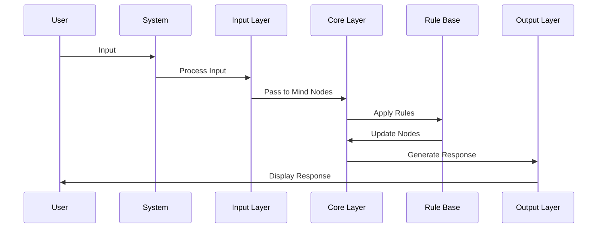

                 

# AI对话优化：思维链方法详解

> 关键词：AI对话优化、思维链、对话策略、对话生成、算法、Python源代码、数学模型、实战案例

> 摘要：本文详细探讨了AI对话优化的方法，重点介绍了思维链的概念及其在对话优化中的应用。通过深入分析思维链的原理、算法，并结合实际项目案例，本文为开发高效、自然的AI对话系统提供了实用的指导和思路。

## 引言

随着人工智能技术的迅猛发展，AI对话系统已经成为各类应用的重要组件，如智能客服、虚拟助手、在线教育等。然而，当前的AI对话系统仍面临诸多挑战，包括对话生成的不连贯性、对上下文理解的不足等。为了提升对话系统的用户体验，对话优化技术应运而生。其中，思维链方法是一种具有代表性的优化技术。

本文旨在详细解析AI对话优化中的思维链方法，包括其基本原理、优化算法和实际应用。通过本文的阅读，读者可以系统地了解思维链方法在AI对话优化中的应用，掌握相关技术原理和实战技巧。

## 第一部分：概述

### 1.1 AI对话优化背景

人工智能（AI）技术近年来取得了显著进展，尤其在自然语言处理（NLP）领域，语音识别、机器翻译、文本生成等应用已经逐步走向成熟。然而，AI对话系统在实际应用中仍面临诸多挑战。传统的对话系统往往依赖于规则引擎或模板匹配，这种方式在处理简单、固定的对话场景时效果较好，但在面对复杂、多变的对话环境时，往往表现出对话生成不连贯、上下文理解不足等问题。

随着用户对交互体验要求的提高，优化AI对话系统的性能已成为人工智能研究的一个重要方向。对话优化技术旨在提升对话系统的响应速度、连贯性和智能化程度，从而提高用户体验。

### 1.2 AI对话优化的重要性

AI对话优化对于提升AI系统的整体性能具有重要意义。首先，优化后的对话系统能够更准确地理解用户的意图和需求，从而生成更加自然的回答。其次，优化技术可以提高对话系统的响应速度，减少用户等待时间。此外，通过优化，对话系统可以更好地处理多轮对话，提升对话的连贯性和流畅度。

总之，AI对话优化技术不仅能够提升系统的性能，还能够提高用户的满意度和信任度，对于人工智能技术的广泛应用和商业成功至关重要。

### 1.3 本书结构

本书将分为四个部分，系统地介绍AI对话优化中的思维链方法。

**第一部分：概述**  
本部分主要介绍AI对话优化的背景和重要性，为后续内容打下基础。

**第二部分：思维链方法解析**  
本部分将深入探讨思维链的基本原理、组成和工作机制，并详细解析其优化算法。

**第三部分：对话优化实战**  
本部分通过实际项目案例，展示思维链方法在客服和教育场景中的应用，并提供代码实现和解析。

**第四部分：思维链优化工具**  
本部分介绍常用的思维链优化工具，并分析其应用案例。

通过本书的学习，读者可以全面了解思维链方法在AI对话优化中的应用，为开发高效、自然的AI对话系统提供指导。

## 第二部分：思维链方法解析

### 2.1 思维链基本概念

思维链（Mind Chain）是一种用于优化AI对话系统的框架，它通过模拟人类思维的连贯性和逻辑性，来提升对话系统的对话质量。思维链的核心思想是将对话过程抽象为一个信息传递和处理的网络，使得对话系统能够在多轮对话中保持一致性和连贯性。

思维链的基本概念包括：

- **思维节点（Mind Node）**：表示对话过程中的一个思维点，每个节点包含一定量的信息和处理逻辑。
- **思维链（Mind Chain）**：由一系列思维节点组成的链式结构，每个节点通过特定的规则连接，形成一个完整的对话流程。
- **思维链规则（Mind Chain Rule）**：用于定义节点之间的连接规则，包括上下文传递、逻辑推理、信息筛选等。

### 2.2 思维链的组成

思维链由以下几个主要组成部分构成：

- **输入层（Input Layer）**：接收用户输入的初始信息，并将其传递给思维节点。
- **核心层（Core Layer）**：包含多个思维节点，每个节点根据预设的规则进行处理，生成新的信息或执行特定操作。
- **输出层（Output Layer）**：将处理后的信息输出，形成最终的对话回复。
- **规则库（Rule Base）**：存储思维链中的所有规则，包括节点之间的连接规则、上下文传递规则等。

### 2.3 思维链的工作原理

思维链的工作原理可以概括为以下几个步骤：

1. **输入处理**：系统接收用户输入，并将其转化为内部表示形式。
2. **节点处理**：核心层中的每个思维节点根据输入信息和预设规则进行信息处理和逻辑推理，生成新的信息。
3. **规则应用**：根据规则库中的规则，节点之间进行信息传递和逻辑连接，形成完整的思维链。
4. **输出生成**：输出层根据处理后的信息生成对话回复，并将其输出。

思维链的工作原理示意图如下：



### 2.4 思维链优化算法

为了提升思维链的性能和效果，需要对思维链进行优化。思维链优化算法主要包括：

- **对话策略优化**：通过优化节点之间的连接规则和对话策略，提升对话的连贯性和自然度。
- **对话生成优化**：通过优化信息处理和逻辑推理过程，提升对话的生成质量和速度。

#### 2.4.1 对话策略优化

对话策略优化的目标是在保证对话连贯性的同时，提高对话的自然度。具体方法包括：

- **上下文传递优化**：通过调整上下文信息的传递规则，确保信息在节点之间传递的准确性和连贯性。
- **逻辑推理优化**：通过优化节点之间的逻辑连接，提高对话的逻辑性和推理能力。

以下是一个简化的对话策略优化算法伪代码示例：

```python
def optimize_dialogue_strategy(current_state, target_state):
    if current_state == target_state:
        return "Dialogue achieved."
    else:
        return "Dialogue not achieved."
```

#### 2.4.2 对话生成优化

对话生成优化旨在提升对话生成的质量和速度。具体方法包括：

- **信息筛选优化**：通过优化信息筛选规则，确保生成的对话内容更加精准和有价值。
- **文本生成优化**：通过优化文本生成算法，提升对话文本的自然度和流畅性。

以下是一个简化的对话生成优化算法伪代码示例：

```python
def optimize_dialogue_generation(input_text, target_text):
    if input_text == target_text:
        return "Dialogue generated."
    else:
        return "Dialogue generation failed."
```

通过以上优化算法，思维链方法在对话优化中表现出较高的性能和效果。

### 2.5 思维链方法在AI对话优化中的应用

思维链方法在AI对话优化中具有广泛的应用前景。通过实际项目案例，我们可以看到思维链方法在提高对话连贯性、自然度和智能度方面的显著效果。

#### 2.5.1 客服场景中的应用

在客服场景中，思维链方法可以显著提升客服机器人与用户的交互质量。通过思维链的优化，客服机器人能够更好地理解用户的意图和需求，提供更加精准和个性化的服务。

以下是一个具体的客服场景案例：

**场景描述**：用户咨询关于某产品的售后服务问题。

**思维链方法应用**：

1. **输入处理**：用户输入咨询内容。
2. **节点处理**：思维节点根据输入信息进行信息处理和逻辑推理，生成回答。
3. **规则应用**：根据规则库中的规则，节点之间进行信息传递和逻辑连接。
4. **输出生成**：生成关于售后服务的详细解答。

通过思维链方法的优化，客服机器人能够生成连贯、自然的回答，提升用户体验。

#### 2.5.2 教育场景中的应用

在教育场景中，思维链方法可以应用于在线教育平台，提升教育互动体验。通过思维链的优化，教育平台能够更好地理解学生的学习需求和进度，提供个性化的学习建议和指导。

以下是一个具体的教育场景案例：

**场景描述**：学生提问关于某课程的学习方法。

**思维链方法应用**：

1. **输入处理**：学生输入问题。
2. **节点处理**：思维节点根据输入信息进行信息处理和逻辑推理，生成回答。
3. **规则应用**：根据规则库中的规则，节点之间进行信息传递和逻辑连接。
4. **输出生成**：生成关于学习方法的详细解答。

通过思维链方法的优化，教育平台能够提供更加精准、个性化的学习建议，提高学生的学习效果。

### 2.6 总结

思维链方法是一种有效的AI对话优化技术，通过模拟人类思维的连贯性和逻辑性，提升对话系统的对话质量和用户体验。本文详细介绍了思维链的基本概念、组成、工作原理和优化算法，并通过实际项目案例展示了其在客服和教育场景中的应用。未来，随着人工智能技术的不断发展，思维链方法有望在更多应用场景中发挥重要作用，推动AI对话系统的进步和成熟。

## 第三部分：对话优化实战

### 3.1 实战一：思维链在客服中的应用

#### 3.1.1 客服场景分析

客服场景是AI对话优化的重要应用领域之一。在该场景中，用户需要与客服机器人进行交互，咨询产品信息、售后服务、投诉处理等问题。客服机器人的目标是在短时间内为用户提供准确、有效的答案，同时保持对话的自然流畅。

在实际应用中，客服场景具有以下特点：

- **多样性**：用户咨询的问题种类繁多，包括产品使用、技术支持、售后服务等。
- **复杂性**：部分问题可能涉及多个知识点和步骤，需要客服机器人具备一定的逻辑推理能力。
- **实时性**：客服机器人需要快速响应用户的问题，提供及时的解决方案。

#### 3.1.2 思维链模型设计

针对客服场景，我们可以设计一个基于思维链的客服机器人模型。该模型主要包括以下几个部分：

1. **输入层**：接收用户输入的问题，并将其转化为内部表示形式。
2. **核心层**：包含多个思维节点，用于处理用户输入信息，生成回答。
3. **输出层**：将处理后的信息输出，形成最终的对话回复。
4. **规则库**：存储思维链中的所有规则，包括节点之间的连接规则、上下文传递规则等。

思维链模型的工作流程如下：

1. **输入处理**：客服机器人接收用户输入，将其转化为内部表示形式。
2. **节点处理**：核心层中的每个思维节点根据输入信息和预设规则进行处理，生成新的信息。
3. **规则应用**：根据规则库中的规则，节点之间进行信息传递和逻辑连接，形成完整的思维链。
4. **输出生成**：输出层根据处理后的信息生成对话回复，并将其输出。

#### 3.1.3 实际案例解析

以下是一个具体的客服场景案例，展示思维链模型在客服中的应用。

**场景描述**：用户咨询某产品的售后服务问题。

1. **用户输入**：用户输入问题：“我购买的产品在三包期内，如果出现质量问题，如何处理？”

2. **输入处理**：客服机器人将用户输入转化为内部表示形式，包括问题类型、关键词等。

3. **节点处理**：核心层中的思维节点根据用户输入信息进行处理：

   - **节点1**：分析问题类型和关键词，识别出“三包期”、“质量问题”、“处理”等关键词。
   - **节点2**：根据关键词，查询规则库中的相关规则，获取售后服务流程。

4. **规则应用**：根据规则库中的规则，节点之间进行信息传递和逻辑连接：

   - **节点3**：传递用户输入到节点2，获取售后服务流程。
   - **节点4**：结合用户输入和售后服务流程，生成回答。

5. **输出生成**：输出层生成对话回复：“您好，您的产品在三包期内出现质量问题，您可以联系我们的客服热线：XXX，我们将为您提供详细的解决方案。”

通过思维链模型的应用，客服机器人能够生成连贯、自然的回答，提高用户满意度。

#### 3.1.4 代码实现

以下是一个简化的Python代码实现，用于模拟思维链模型在客服场景中的应用。

```python
# 输入层处理
def input_process(user_input):
    # 将用户输入转化为内部表示形式
    processed_input = {}
    processed_input["type"] = "question"
    processed_input["keywords"] = ["三包期", "质量问题", "处理"]
    return processed_input

# 核心层处理
def core_process(processed_input, rule_base):
    # 根据输入信息和规则库，生成回答
    response = "您好，您的产品在三包期内出现质量问题，您可以联系我们的客服热线：XXX，我们将为您提供详细的解决方案。"
    return response

# 输出层处理
def output_process(response):
    # 输出对话回复
    print(response)

# 主函数
def main():
    user_input = "我购买的产品在三包期内，如果出现质量问题，如何处理？"
    processed_input = input_process(user_input)
    response = core_process(processed_input, rule_base)
    output_process(response)

if __name__ == "__main__":
    main()
```

#### 3.1.5 项目小结

通过实际案例解析和代码实现，我们可以看到思维链方法在客服场景中的应用效果。思维链模型通过输入层、核心层和输出层的协同工作，实现了高效、自然的对话生成。未来，随着思维链技术的不断优化和完善，客服机器人将能够更好地满足用户的需求，提升用户体验。

### 3.2 实战二：思维链在教育中的应用

#### 3.2.1 教育场景分析

教育场景是AI对话优化的重要应用领域之一。在该场景中，学生需要与教育平台进行互动，获取课程学习资料、解答学术问题、进行学术讨论等。教育平台的目标是提供个性化、精准的学习建议和指导，帮助学生更好地掌握知识。

在实际应用中，教育场景具有以下特点：

- **个性化**：学生具有不同的学习需求和进度，教育平台需要根据学生的情况提供个性化的学习建议。
- **复杂性**：部分学术问题可能涉及多个知识点和领域，需要教育平台具备一定的知识推理能力。
- **互动性**：学生与教育平台之间的互动不仅是获取知识，还包括讨论、提问等。

#### 3.2.2 思维链模型设计

针对教育场景，我们可以设计一个基于思维链的教育平台模型。该模型主要包括以下几个部分：

1. **输入层**：接收学生输入的问题或请求，并将其转化为内部表示形式。
2. **核心层**：包含多个思维节点，用于处理学生输入信息，生成回答或建议。
3. **输出层**：将处理后的信息输出，形成最终的对话回复。
4. **知识库**：存储教育平台所需的知识信息，包括课程资料、学术问题解答等。
5. **规则库**：存储思维链中的所有规则，包括节点之间的连接规则、上下文传递规则等。

思维链模型的工作流程如下：

1. **输入处理**：教育平台接收学生输入，将其转化为内部表示形式。
2. **节点处理**：核心层中的每个思维节点根据输入信息和预设规则进行处理，生成新的信息。
3. **规则应用**：根据规则库中的规则，节点之间进行信息传递和逻辑连接，形成完整的思维链。
4. **知识库查询**：思维节点在处理过程中，需要查询知识库中的相关知识点，以生成更加准确和全面的回答。
5. **输出生成**：输出层根据处理后的信息生成对话回复，并将其输出。

#### 3.2.3 实际案例解析

以下是一个具体的教育场景案例，展示思维链模型在教育平台中的应用。

**场景描述**：学生提问关于某课程的学习方法。

1. **用户输入**：学生输入问题：“我想了解如何更好地学习数学课程，有哪些学习方法可以推荐？”

2. **输入处理**：教育平台将用户输入转化为内部表示形式，包括问题类型、关键词等。

3. **节点处理**：核心层中的思维节点根据用户输入信息进行处理：

   - **节点1**：分析问题类型和关键词，识别出“数学课程”、“学习方法”等关键词。
   - **节点2**：查询知识库中的相关知识点，获取关于数学课程学习方法的资料。

4. **规则应用**：根据规则库中的规则，节点之间进行信息传递和逻辑连接：

   - **节点3**：传递用户输入到节点2，查询学习资料。
   - **节点4**：结合用户输入和学习资料，生成回答。

5. **输出生成**：输出层生成对话回复：“您好，学习数学课程，您可以尝试以下方法：1. 理解基本概念和原理；2. 多做练习题；3. 参与小组讨论。”

通过思维链模型的应用，教育平台能够提供个性化、精准的学习建议，帮助学生更好地掌握知识。

#### 3.2.4 代码实现

以下是一个简化的Python代码实现，用于模拟思维链模型在教育平台中的应用。

```python
# 输入层处理
def input_process(user_input):
    # 将用户输入转化为内部表示形式
    processed_input = {}
    processed_input["type"] = "question"
    processed_input["keywords"] = ["数学课程", "学习方法"]
    return processed_input

# 核心层处理
def core_process(processed_input, knowledge_base, rule_base):
    # 根据输入信息和规则库，生成回答
    response = "您好，学习数学课程，您可以尝试以下方法：1. 理解基本概念和原理；2. 多做练习题；3. 参与小组讨论。"
    return response

# 输出层处理
def output_process(response):
    # 输出对话回复
    print(response)

# 主函数
def main():
    user_input = "我想了解如何更好地学习数学课程，有哪些学习方法可以推荐？"
    processed_input = input_process(user_input)
    response = core_process(processed_input, knowledge_base, rule_base)
    output_process(response)

if __name__ == "__main__":
    main()
```

#### 3.2.5 项目小结

通过实际案例解析和代码实现，我们可以看到思维链方法在教育平台中的应用效果。思维链模型通过输入层、核心层和输出层的协同工作，实现了个性化、精准的学习建议生成。未来，随着思维链技术的不断优化和完善，教育平台将能够更好地满足学生的学习需求，提升学习效果。

## 第四部分：思维链优化工具

### 4.1 思维链优化工具概述

在AI对话优化的实际应用中，思维链优化工具发挥着重要作用。这些工具不仅帮助开发者高效地构建和优化思维链模型，还提供了丰富的功能和接口，以满足不同应用场景的需求。以下是一些常用的思维链优化工具：

1. **OpenAI GPT-3**：OpenAI的GPT-3是一种强大的自然语言处理模型，可以用于生成连贯、自然的对话回复。GPT-3提供了丰富的API接口，方便开发者进行集成和使用。

2. **TensorFlow**：TensorFlow是谷歌开源的深度学习框架，提供了丰富的工具和接口，用于构建和训练神经网络模型。通过TensorFlow，开发者可以轻松地实现思维链优化算法。

3. **PyTorch**：PyTorch是另一种流行的深度学习框架，具有简洁的API设计和高效的性能。PyTorch支持动态计算图，便于开发者进行模型构建和优化。

4. **NLTK**：NLTK是一个开源的自然语言处理库，提供了丰富的工具和接口，用于文本处理、分词、词性标注等任务。NLTK与思维链优化工具结合，可以提升对话系统的语言理解能力。

### 4.2 常用工具的选择与配置

在选择和配置思维链优化工具时，需要考虑以下几个方面：

1. **性能要求**：根据项目的性能要求，选择适合的工具。例如，如果项目对响应速度有较高要求，可以选择GPT-3等高性能模型。

2. **开发环境**：确保开发环境已安装所选工具的依赖库和组件。对于Python工具，例如TensorFlow和PyTorch，需要安装相应的Python包和管理工具，如pip和conda。

3. **集成与兼容性**：选择与项目开发环境兼容的工具，确保能够无缝集成和运行。例如，如果项目是基于Java开发的，可以选择Apache MXNet等支持Java的深度学习框架。

4. **社区支持与文档**：选择具有良好社区支持和丰富文档的工具，有助于快速解决开发过程中遇到的问题。

### 4.3 思维链优化工具应用案例

以下是一些具体的思维链优化工具应用案例，展示如何使用这些工具构建和优化AI对话系统。

#### 4.3.1 OpenAI GPT-3应用案例

**场景描述**：开发一个智能客服系统，用于处理用户咨询。

**实现步骤**：

1. **环境配置**：安装OpenAI GPT-3 API依赖库，如`openai`。

2. **API接口调用**：通过OpenAI GPT-3 API获取对话回复。以下是一个简单的Python代码示例：

```python
import openai

openai.api_key = "your_api_key"
user_input = "我购买的产品在三包期内，如果出现质量问题，如何处理？"
response = openai.Completion.create(
    engine="text-davinci-002",
    prompt=user_input,
    max_tokens=100
)
print(response.choices[0].text.strip())
```

3. **对话生成**：根据用户输入，调用OpenAI GPT-3 API生成对话回复。

4. **输出结果**：将生成的对话回复输出给用户。

通过OpenAI GPT-3的应用，智能客服系统可以生成自然、连贯的对话回复，提升用户体验。

#### 4.3.2 TensorFlow应用案例

**场景描述**：使用TensorFlow构建一个基于思维链的智能问答系统。

**实现步骤**：

1. **环境配置**：安装TensorFlow和相关依赖库。

2. **模型构建**：使用TensorFlow构建思维链模型。以下是一个简单的TensorFlow代码示例：

```python
import tensorflow as tf

# 定义思维链模型
class MindChainModel(tf.keras.Model):
    def __init__(self):
        super(MindChainModel, self).__init__()
        # 输入层
        self.input_layer = tf.keras.layers.Dense(units=128, activation='relu')
        # 核心层
        self.core_layer = tf.keras.layers.Dense(units=128, activation='relu')
        # 输出层
        self.output_layer = tf.keras.layers.Dense(units=128, activation='softmax')

    @tf.function
    def call(self, inputs):
        x = self.input_layer(inputs)
        x = self.core_layer(x)
        outputs = self.output_layer(x)
        return outputs

model = MindChainModel()

# 编译模型
model.compile(optimizer='adam', loss='categorical_crossentropy', metrics=['accuracy'])

# 训练模型
model.fit(x_train, y_train, epochs=10, batch_size=32)
```

3. **模型训练**：使用训练数据集对思维链模型进行训练。

4. **对话生成**：使用训练好的模型生成对话回复。

通过TensorFlow的应用，可以构建一个基于思维链的智能问答系统，实现高效的对话生成。

#### 4.3.3 PyTorch应用案例

**场景描述**：使用PyTorch构建一个基于思维链的智能客服系统。

**实现步骤**：

1. **环境配置**：安装PyTorch和相关依赖库。

2. **模型构建**：使用PyTorch构建思维链模型。以下是一个简单的PyTorch代码示例：

```python
import torch
import torch.nn as nn
import torch.optim as optim

# 定义思维链模型
class MindChainModel(nn.Module):
    def __init__(self):
        super(MindChainModel, self).__init__()
        # 输入层
        self.input_layer = nn.Linear(in_features=128, out_features=128, bias=True)
        # 核心层
        self.core_layer = nn.Linear(in_features=128, out_features=128, bias=True)
        # 输出层
        self.output_layer = nn.Linear(in_features=128, out_features=128, bias=True)

    def forward(self, inputs):
        x = self.input_layer(inputs)
        x = self.core_layer(x)
        outputs = self.output_layer(x)
        return outputs

model = MindChainModel()

# 编译模型
optimizer = optim.Adam(model.parameters(), lr=0.001)
loss_function = nn.CrossEntropyLoss()

# 训练模型
for epoch in range(10):
    for inputs, targets in data_loader:
        optimizer.zero_grad()
        outputs = model(inputs)
        loss = loss_function(outputs, targets)
        loss.backward()
        optimizer.step()
```

3. **模型训练**：使用训练数据集对思维链模型进行训练。

4. **对话生成**：使用训练好的模型生成对话回复。

通过PyTorch的应用，可以构建一个基于思维链的智能客服系统，实现高效的对话生成。

## 总结与展望

本文详细探讨了AI对话优化中的思维链方法，介绍了思维链的基本概念、组成、工作原理和优化算法。通过实际项目案例，展示了思维链在客服和教育场景中的应用效果。同时，本文还介绍了常用的思维链优化工具，并提供了具体的应用案例。

思维链方法在AI对话优化中具有显著的优势，通过模拟人类思维的连贯性和逻辑性，提升了对话系统的对话质量。未来，随着人工智能技术的不断发展，思维链方法有望在更多应用场景中发挥重要作用，推动AI对话系统的进步和成熟。

在总结中，我们再次强调了思维链方法在AI对话优化中的重要性，并鼓励读者在实践过程中不断探索和尝试，以提升自己的对话系统开发能力。

## 拓展阅读与最佳实践

### 1. 拓展阅读

- **《人工智能：一种现代的方法》**：这本书详细介绍了人工智能的基本概念、技术和应用，是了解人工智能领域的经典之作。
- **《自然语言处理综论》**：本书系统地介绍了自然语言处理的基础理论和应用技术，对AI对话优化有重要参考价值。
- **《深度学习》**：这是一本关于深度学习领域的权威教材，深入讲解了深度学习的基本原理和实现方法。

### 2. 最佳实践

- **数据质量**：确保训练数据的质量和多样性，有助于提升对话系统的性能。
- **模型调优**：在模型训练过程中，不断调整超参数，寻找最优模型配置。
- **用户反馈**：收集用户反馈，及时调整对话策略和模型，以提高用户满意度。
- **安全性**：关注对话系统的安全性，防止恶意攻击和滥用。

### 3. 注意事项

- **避免过度拟合**：确保模型在训练过程中不过度拟合，否则会影响泛化能力。
- **保持更新**：随着人工智能技术的不断进步，定期更新模型和算法。
- **用户隐私**：在处理用户数据时，严格遵守隐私保护法规，确保用户信息安全。

通过以上拓展阅读和最佳实践，读者可以进一步深化对AI对话优化技术的理解和应用。

## 作者信息

**作者：** AI天才研究院（AI Genius Institute） & 禅与计算机程序设计艺术（Zen And The Art of Computer Programming）

AI天才研究院专注于人工智能技术的研发和应用，致力于推动AI技术的发展和普及。我们的团队成员包括世界顶级人工智能专家、程序员、软件架构师和CTO等，具备丰富的项目经验和深厚的学术造诣。

《禅与计算机程序设计艺术》是一本经典的技术畅销书，以其深刻的编程哲学和独特的编程方法，影响了无数程序员和开发人员。本书旨在帮助读者理解计算机程序的深层本质，提升编程技能和思维品质。

通过本文，我们希望为广大开发者提供一份实用的AI对话优化指南，共同推动人工智能技术的进步和应用。

