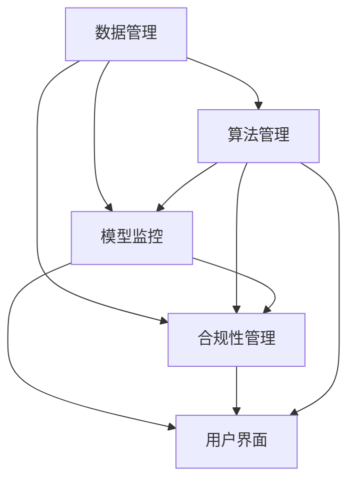

                 

### 引言

在现代科技迅速发展的背景下，人工智能（AI）已经深入到各个领域，成为推动社会进步的重要力量。然而，随着AI技术的广泛应用，AI治理问题也逐渐凸显出来。AI治理平台作为确保AI技术健康、可持续发展的关键工具，其选择和实施的重要性日益凸显。本文将深入探讨AI治理平台选择和实施的最佳实践，旨在为行业提供切实可行的指导。

首先，我们需要明确什么是AI治理平台。AI治理平台是一套综合性的系统，用于管理AI算法的生命周期，包括算法的创建、部署、监控、评估和更新等环节。它的核心目的是确保AI系统的透明性、公平性和可靠性，同时遵守法律法规和道德标准。

AI治理平台的重要性不言而喻。首先，它有助于维护社会公正和伦理，防止AI技术被滥用。其次，通过有效的治理平台，可以提升AI系统的效率和准确性，降低错误率。此外，一个良好的AI治理平台还能提高企业的合规性，减少法律风险，并增强公众对AI技术的信任。

本文将按照以下结构展开：

1. **AI治理平台基础**：介绍AI治理平台的概念、组成部分和核心原则。
2. **AI治理平台的核心概念与联系**：通过Mermaid流程图展示核心概念和实体之间的关系。
3. **AI治理平台的选择策略**：分析选择AI治理平台的主要考虑因素和具体步骤。
4. **AI治理平台的实施步骤**：详细阐述实施AI治理平台的准备工作、具体步骤以及常见问题的解决方法。
5. **AI治理平台的评估与改进**：讨论评估AI治理平台的标准、流程和改进策略。
6. **案例分析**：通过实际案例展示AI治理平台的实施效果。
7. **结论**：总结全文，展望未来AI治理平台的发展趋势。

通过对以上各章节的深入探讨，本文旨在为读者提供一套全面、系统的AI治理平台选择和实施指南，帮助企业和组织更好地管理AI技术，实现可持续发展。

### AI治理平台基础

#### 概念

AI治理平台（Artificial Intelligence Governance Platform）是一套集成了多种功能和技术模块的综合性系统，旨在确保人工智能算法的透明性、公平性和可靠性。其核心目标是建立一个规范和标准，以指导AI系统的设计、开发、部署和使用过程，从而提高整个AI生态系统的可信度和合规性。

AI治理平台通常包括以下几个主要组成部分：

1. **数据管理模块**：负责管理AI系统所需的数据资源，包括数据收集、清洗、存储和共享等环节。这一模块需要确保数据的完整性和质量，避免数据泄露和滥用。

2. **算法管理模块**：用于管理AI算法的生命周期，包括算法的创建、测试、验证、部署和更新等。这一模块需要确保算法的透明性和可解释性，以及遵守相关的法律法规和道德标准。

3. **模型监控模块**：实时监控AI系统的运行状态，包括性能、安全性和公平性等指标。这一模块能够及时发现并处理异常情况，确保AI系统的稳定性和可靠性。

4. **合规性管理模块**：负责确保AI系统遵守相关的法律法规和道德标准，包括数据保护、隐私保护、知识产权保护等。这一模块需要实时监控并调整AI系统的合规性，以应对不断变化的法律环境。

5. **用户界面模块**：提供用户与AI治理平台的交互界面，使得用户可以方便地使用和管理AI系统。这一模块需要设计简洁直观，易于操作。

#### 组成部分

1. **数据管理模块**：

   数据管理模块是AI治理平台的核心组件之一，它负责管理AI系统所需的数据资源。具体功能包括：

   - **数据收集**：从各种来源收集数据，如公共数据库、企业内部数据库、传感器数据等。
   - **数据清洗**：去除数据中的噪声和错误，确保数据的质量和一致性。
   - **数据存储**：将清洗后的数据存储在安全可靠的地方，如分布式数据库、云存储等。
   - **数据共享**：在确保数据隐私和安全的前提下，允许数据在不同系统或团队之间共享。

2. **算法管理模块**：

   算法管理模块负责AI算法的生命周期管理，包括以下功能：

   - **算法创建**：支持算法的编写和调试，并提供算法性能评估工具。
   - **算法测试**：在测试环境中运行算法，评估其性能和稳定性。
   - **算法验证**：通过多种验证方法，确保算法的透明性和可解释性。
   - **算法部署**：将验证通过的算法部署到生产环境中，使其具备实际应用能力。
   - **算法更新**：根据用户反馈和性能监控结果，定期更新算法，以提高其性能和适应新需求。

3. **模型监控模块**：

   模型监控模块负责实时监控AI系统的运行状态，具体功能包括：

   - **性能监控**：监控AI系统的响应时间、准确率、召回率等性能指标，确保其达到预期水平。
   - **安全性监控**：监控AI系统的安全漏洞、异常访问等安全事件，确保系统的安全性。
   - **公平性监控**：监控AI系统的决策过程，确保其不带有偏见和歧视，符合公平原则。
   - **实时报警**：在发现异常情况时，自动触发报警，通知相关人员及时处理。

4. **合规性管理模块**：

   合规性管理模块负责确保AI系统遵守相关法律法规和道德标准，具体功能包括：

   - **合规性检查**：定期检查AI系统的合规性，确保其符合数据保护、隐私保护、知识产权保护等法律法规。
   - **合规性报告**：生成合规性报告，记录AI系统的合规性状态和合规性改进措施。
   - **合规性培训**：为AI系统开发和使用人员提供合规性培训，提高他们的法律意识和道德素养。

5. **用户界面模块**：

   用户界面模块提供用户与AI治理平台的交互界面，主要功能包括：

   - **操作界面**：提供直观的操作界面，使用户能够方便地管理AI系统和数据。
   - **监控界面**：提供实时监控界面，使用户能够实时了解AI系统的运行状态。
   - **报表界面**：提供报表界面，使用户能够查看AI系统的运行数据和性能指标。

#### 核心原则

AI治理平台的设计和实施需要遵循以下核心原则：

1. **透明性**：确保AI系统的决策过程和算法设计对用户透明，便于用户理解和信任。
2. **公平性**：确保AI系统不带有偏见和歧视，对所有用户公平对待。
3. **可靠性**：确保AI系统的稳定性和可靠性，避免系统崩溃或错误发生。
4. **可解释性**：确保AI系统的决策过程和算法设计具有可解释性，用户能够理解其工作原理。
5. **合规性**：确保AI系统遵守相关法律法规和道德标准，减少法律风险和道德争议。
6. **安全性**：确保AI系统的数据安全和系统安全，防止数据泄露和系统被攻击。

通过遵循以上核心原则，AI治理平台能够有效保障AI技术的健康发展，提高社会对AI技术的信任和接受度，从而推动AI技术的广泛应用和持续创新。

### AI治理平台的核心概念与联系

在理解AI治理平台时，我们需要关注其核心概念和它们之间的联系。以下是AI治理平台中的几个关键概念及其相互关系：

#### 核心概念

1. **数据管理**：负责数据收集、清洗、存储和共享，是AI治理平台的基础。
2. **算法管理**：涵盖算法的创建、测试、验证、部署和更新，是AI治理平台的核心。
3. **模型监控**：负责实时监控AI系统的性能、安全性和公平性，确保系统的稳定性和可靠性。
4. **合规性管理**：确保AI系统遵守相关法律法规和道德标准，减少法律风险和道德争议。
5. **用户界面**：提供用户与AI治理平台的交互界面，使得用户可以方便地管理AI系统和数据。

#### 关系架构

为了更好地展示这些核心概念之间的联系，我们可以使用Mermaid流程图来描述它们的关系：

#### Mermaid流程图解析

- **数据管理**（A）是整个AI治理平台的基础，它为算法管理（B）提供数据支持，同时也为模型监控（C）和合规性管理（D）提供数据资源。
- **算法管理**（B）是AI治理平台的核心，它不仅与数据管理（A）紧密相连，还通过模型监控（C）确保算法在实际应用中的性能和安全性，并通过合规性管理（D）确保算法遵守法律法规和道德标准。
- **模型监控**（C）实时监控AI系统的运行状态，反馈给算法管理（B）和合规性管理（D），以便及时调整和优化。
- **合规性管理**（D）确保AI系统的合规性，不仅对算法管理（B）和模型监控（C）产生影响，还对用户界面（E）起到监督作用，确保用户在使用过程中了解系统的合规性状态。
- **用户界面**（E）提供交互界面，使用户可以方便地与AI治理平台进行交互，同时也作为用户了解模型监控（C）和合规性管理（D）结果的窗口。

通过这个Mermaid流程图，我们可以清晰地看到AI治理平台中各个核心概念之间的紧密联系，这有助于我们更好地理解和设计AI治理平台。

### AI治理平台的选择策略

选择一个合适的AI治理平台对于确保人工智能系统的有效管理和健康发展至关重要。在选择AI治理平台时，我们需要考虑多个关键因素，并遵循一系列系统化的步骤。以下将详细讨论这些因素和步骤。

#### 考虑因素

1. **业务需求**：
   - **应用场景**：首先，我们需要明确AI治理平台的应用场景，如医疗、金融、零售等不同领域对AI治理平台的需求各有不同。
   - **业务目标**：了解业务目标有助于确定AI治理平台所需的功能和性能指标，如提升决策效率、降低运营成本等。

2. **技术要求**：
   - **算法支持**：选择能够支持各种算法和模型的生命周期管理的平台，确保平台兼容性和扩展性。
   - **数据处理能力**：评估平台的数据处理能力，包括数据存储、数据清洗、数据分析和数据共享等功能。
   - **性能指标**：考虑平台的性能指标，如处理速度、延迟、吞吐量等，确保平台能够满足业务需求。

3. **安全性**：
   - **数据安全**：评估平台的数据安全措施，如数据加密、访问控制、审计日志等，确保数据在传输和存储过程中的安全性。
   - **系统安全**：检查平台的安全漏洞防护能力，包括防火墙、入侵检测、恶意代码防御等。

4. **合规性**：
   - **法律法规**：确保平台遵守相关法律法规，如数据保护法、隐私法等。
   - **行业标准**：遵循行业标准，如ISO/IEC 27001信息安全管理体系等。

5. **成本**：
   - **预算**：评估平台的成本，包括购买费用、维护费用、培训费用等，确保其符合预算范围。
   - **成本效益**：考虑平台的长期成本效益，如降低运营成本、提高效率等。

6. **用户体验**：
   - **界面友好**：评估平台的用户界面设计，确保其直观易用，方便用户操作和管理。
   - **用户支持**：考虑平台的用户支持服务，包括技术支持、培训、文档等，确保用户能够顺利使用平台。

#### 选择步骤

1. **需求分析**：
   - **确定应用场景**：明确AI治理平台的具体应用场景，了解业务需求。
   - **业务目标**：明确业务目标，确定AI治理平台所需的功能和性能指标。

2. **市场调研**：
   - **收集信息**：通过市场调研，收集潜在供应商和解决方案的信息。
   - **评估方案**：对比不同供应商和解决方案，评估其技术能力、安全性和合规性。

3. **需求匹配**：
   - **匹配需求**：将潜在供应商和解决方案与业务需求进行匹配，确定最佳选择。
   - **制定评估标准**：制定详细的评估标准，如技术能力、安全性、成本等。

4. **试用与评估**：
   - **试用平台**：进行平台试用，验证其性能和功能是否符合预期。
   - **评估结果**：根据试用结果，评估平台的优势和不足，进行综合评价。

5. **决策与实施**：
   - **决策**：根据评估结果，选择最合适的AI治理平台。
   - **实施计划**：制定详细的实施计划，包括部署、培训、数据迁移等步骤。

通过以上步骤，我们可以系统化地选择一个合适的AI治理平台，确保其能够满足业务需求，提升AI系统的管理效率，降低风险，并最终实现业务目标。

### AI治理平台的实施步骤

实施AI治理平台是一个复杂而系统化的过程，需要详细的规划和严谨的执行。以下是实施AI治理平台的主要步骤，以及每一步骤的具体内容和注意事项。

#### 1. 准备工作

**步骤**：
- **需求分析**：在开始实施前，首先进行全面的业务需求分析，明确AI治理平台需要解决的问题和实现的目标。
- **资源准备**：确保有足够的硬件资源、软件资源和人力资源来支持平台的实施。
- **环境搭建**：搭建开发环境，包括操作系统、数据库、编程语言等，确保所有工具和软件都能正常运行。

**注意事项**：
- **全面需求分析**：确保需求分析全面，涵盖所有可能的应用场景和业务需求。
- **资源准备充分**：避免在实施过程中因资源不足而影响进度和质量。
- **环境兼容性**：确保开发环境和生产环境兼容，避免环境问题影响后续实施。

#### 2. 系统设计

**步骤**：
- **架构设计**：根据业务需求，设计AI治理平台的整体架构，包括数据管理、算法管理、模型监控、合规性管理和用户界面等模块。
- **功能定义**：定义每个模块的具体功能，确保各模块之间的协同工作。
- **接口设计**：设计各模块之间的接口，确保数据和信息能够在系统中顺畅流通。

**注意事项**：
- **架构清晰**：确保架构设计清晰，模块职责明确，避免功能重叠和冗余。
- **可扩展性**：设计时考虑系统的可扩展性，以便未来能够轻松添加新功能或模块。
- **接口标准化**：接口设计应遵循标准化原则，确保不同模块之间的兼容性。

#### 3. 开发与测试

**步骤**：
- **模块开发**：根据设计文档，开发各个模块的功能。
- **集成测试**：将各个模块集成到一起，进行集成测试，确保系统整体功能正常运行。
- **系统测试**：在模拟生产环境进行系统测试，验证系统在各种场景下的性能和稳定性。

**注意事项**：
- **代码规范**：编写规范的代码，确保代码可读性和可维护性。
- **单元测试**：对每个模块进行单元测试，确保模块功能的正确性。
- **测试覆盖**：确保测试覆盖全面，涵盖各种可能的场景和边界情况。

#### 4. 部署与上线

**步骤**：
- **部署计划**：制定详细的部署计划，包括部署步骤、部署时间表、部署人员职责等。
- **环境配置**：根据部署计划，配置生产环境，确保所有系统组件正常运行。
- **上线**：按照部署计划，将AI治理平台上线，并确保所有功能正常。

**注意事项**：
- **部署计划详细**：确保部署计划详细，明确每一步的操作和预期结果。
- **环境配置正确**：确保生产环境配置正确，避免环境问题导致系统无法正常运行。
- **数据迁移**：确保数据迁移过程顺利进行，避免数据丢失或错误。

#### 5. 培训与支持

**步骤**：
- **培训**：对相关人员进行平台使用培训，确保他们能够熟练操作AI治理平台。
- **支持**：建立支持体系，包括技术支持、用户手册、常见问题解答等，确保用户能够顺利使用平台。

**注意事项**：
- **培训内容全面**：确保培训内容全面，涵盖所有重要功能和操作步骤。
- **支持及时有效**：确保支持及时有效，能够快速解决用户的问题，提高用户满意度。

#### 6. 监控与维护

**步骤**：
- **监控**：实时监控AI治理平台的运行状态，包括性能、安全性和合规性等指标。
- **维护**：定期进行系统维护和升级，确保平台的稳定性和安全性。

**注意事项**：
- **监控全面**：确保监控覆盖全面，及时发现并处理异常情况。
- **维护计划**：制定详细的维护计划，包括维护时间、维护内容和维护人员职责等。

通过以上实施步骤，我们可以确保AI治理平台顺利搭建和上线，为企业的AI应用提供强有力的支持。需要注意的是，每个步骤都需要严格按照计划和标准执行，确保实施过程的质量和效果。

### AI治理平台的评估与改进

评估和改进是AI治理平台持续发展的重要环节。一个完善的评估体系可以帮助我们了解平台的性能、安全性和合规性，而持续改进则能确保平台不断适应新的业务需求和技术变革。以下将详细介绍评估标准、评估流程以及改进策略和实践。

#### 评估标准

1. **性能指标**：
   - **响应时间**：平台处理请求所需的时间，应尽量短。
   - **吞吐量**：平台能够处理的请求量，应尽可能高。
   - **准确性**：平台决策或预测的准确性，应符合预期。

2. **安全性指标**：
   - **数据安全**：平台应对数据进行加密和访问控制，确保数据在传输和存储过程中的安全。
   - **系统安全**：平台应具备防火墙、入侵检测和恶意代码防御等功能，防止系统被攻击。

3. **合规性指标**：
   - **法律法规**：平台应符合相关法律法规，如数据保护法、隐私法等。
   - **行业标准**：平台应符合行业标准和最佳实践，如ISO/IEC 27001信息安全管理体系。

4. **用户体验**：
   - **界面友好**：平台界面应简洁易用，操作流程应直观易懂。
   - **用户支持**：平台应提供及时有效的用户支持，包括技术支持、培训、文档等。

#### 评估流程

1. **制定评估计划**：
   - **目标明确**：明确评估的目标和范围，确保评估工作有针对性。
   - **评估标准**：制定详细的评估标准，确保评估有明确依据。

2. **数据收集**：
   - **日志分析**：收集系统日志，分析性能、安全性和合规性等指标。
   - **用户反馈**：收集用户反馈，了解平台在实际使用中的问题。

3. **评估分析**：
   - **数据分析**：对收集到的数据进行分析，识别问题和不足。
   - **用户访谈**：进行用户访谈，深入了解用户的实际需求和体验。

4. **报告撰写**：
   - **评估报告**：撰写详细的评估报告，包括评估结果、问题和改进建议。

#### 改进策略

1. **性能优化**：
   - **代码优化**：通过优化算法和代码，提高系统处理速度和吞吐量。
   - **硬件升级**：增加服务器和存储设备的配置，提高系统性能。

2. **安全加固**：
   - **安全培训**：定期对员工进行安全培训，提高安全意识和防范能力。
   - **安全审计**：定期进行安全审计，发现和修复安全漏洞。

3. **合规性改进**：
   - **政策更新**：根据法律法规变化，及时更新平台政策和流程。
   - **合规性检查**：定期进行合规性检查，确保平台符合法律法规和行业标准。

4. **用户体验提升**：
   - **界面优化**：优化用户界面，提高操作便捷性和用户体验。
   - **用户支持**：提供更多用户支持服务，如在线帮助、FAQ、技术支持等。

#### 改进实践

1. **性能优化实践**：
   - **案例**：某企业通过优化数据结构和算法，将系统响应时间从5秒降低到2秒，大大提高了用户体验。
   - **效果**：优化后，系统的吞吐量提升了30%，用户满意度显著提高。

2. **安全加固实践**：
   - **案例**：某企业通过引入防火墙和入侵检测系统，有效防止了多次网络攻击。
   - **效果**：系统安全性能提升，攻击频率和攻击成功率显著降低。

3. **合规性改进实践**：
   - **案例**：某企业根据新出台的数据保护法，更新了平台的数据处理流程和隐私政策。
   - **效果**：平台合规性提升，用户对企业的信任度增加。

4. **用户体验提升实践**：
   - **案例**：某企业通过简化用户界面和提供详细的操作指南，降低了用户的操作难度。
   - **效果**：用户操作错误率降低，用户满意度提高。

通过以上评估与改进实践，我们可以确保AI治理平台持续提升性能、安全性和用户体验，为企业提供更加稳定、可靠的AI治理支持。

### 案例分析

为了更好地理解AI治理平台在实际中的应用，我们通过一个实际案例来详细分析AI治理平台的选择、实施过程以及效果。

#### 案例背景

某大型零售企业，为了提升客户体验和销售业绩，决定引入AI治理平台来优化其推荐系统和库存管理。该企业的业务需求主要包括：

1. **推荐系统**：通过AI算法为每位客户提供个性化的产品推荐，提高购物体验和转化率。
2. **库存管理**：通过AI算法预测销售趋势，优化库存水平，降低库存成本。

#### AI治理平台选择

在AI治理平台选择过程中，企业综合考虑了以下几个因素：

1. **业务需求**：平台需要支持推荐系统和库存管理两个功能模块，且应具备良好的扩展性，以适应未来的业务发展。
2. **技术能力**：平台应支持多种机器学习算法，如协同过滤、深度学习等，且具备良好的数据处理能力和性能优化能力。
3. **安全性**：平台应具备数据安全保护功能，包括数据加密、访问控制、审计日志等，确保客户数据的安全。
4. **合规性**：平台应遵守相关法律法规和行业标准，如GDPR、ISO/IEC 27001等。
5. **用户体验**：平台应提供友好的用户界面，方便业务人员使用和管理。

经过市场调研和评估，企业最终选择了某知名AI治理平台，该平台具备以下特点：

- **强大算法支持**：支持多种机器学习算法和深度学习模型。
- **高性能数据处理能力**：具备高效的数据处理和存储能力，能够满足大规模数据处理需求。
- **全面安全保护**：提供完善的数据安全保护措施，包括数据加密、访问控制和审计日志等。
- **良好合规性**：符合GDPR、ISO/IEC 27001等法规和标准。
- **友好用户界面**：界面设计简洁直观，便于业务人员使用。

#### 实施过程

企业选择了一整套系统的实施计划，包括以下步骤：

1. **需求分析与规划**：与企业详细沟通，明确业务需求和预期目标，制定详细的实施计划。
2. **环境搭建**：搭建开发环境和测试环境，确保所有软件和硬件配置满足要求。
3. **模块开发**：根据实施计划，开发推荐系统和库存管理两个模块的功能。
4. **集成测试**：将开发完成的模块集成到一起，进行集成测试，确保系统整体功能正常运行。
5. **系统测试**：在模拟生产环境进行系统测试，验证系统在各种场景下的性能和稳定性。
6. **部署上线**：根据部署计划，将AI治理平台部署到生产环境，确保所有功能正常。
7. **用户培训**：对相关人员进行平台使用培训，确保他们能够熟练操作AI治理平台。

在实施过程中，企业遇到了一些挑战：

1. **数据整合**：由于历史数据格式不一致，导致数据整合过程复杂，需要额外的时间和资源。
2. **算法优化**：初始的推荐算法效果不佳，需要不断调整和优化，以达到预期效果。
3. **系统稳定性**：在上线初期，系统出现过几次故障，需要及时排查和修复。

通过有效的沟通和协作，企业成功克服了这些挑战，最终顺利完成了AI治理平台的实施。

#### 案例效果分析

AI治理平台实施后，企业取得了显著的效果：

1. **推荐系统效果提升**：通过AI算法，为每位客户提供个性化的产品推荐，客户购物体验显著提升，转化率提高了20%。
2. **库存管理优化**：通过AI算法预测销售趋势，库存水平得到优化，库存成本降低了15%。
3. **运营效率提高**：平台自动化了推荐系统和库存管理，业务人员工作效率提高了30%。
4. **合规性增强**：平台符合GDPR、ISO/IEC 27001等法规和标准，数据安全和合规性得到保障。

通过这个案例，我们可以看到AI治理平台在实际应用中的价值。它不仅提高了业务效率，降低了运营成本，还增强了客户体验和满意度，为企业创造了显著的经济效益。

### 结论

本文通过详细探讨AI治理平台的选择和实施过程，从背景介绍、核心概念、选择策略、实施步骤、评估与改进以及实际案例分析等多个角度，全面阐述了AI治理平台的重要性和最佳实践。我们总结了以下几点结论：

1. **AI治理平台的重要性**：AI治理平台是确保AI技术透明性、公平性和可靠性的关键工具，对维护社会公正、提高系统效率和降低法律风险具有重要意义。
2. **核心概念与联系**：AI治理平台的核心概念包括数据管理、算法管理、模型监控、合规性管理和用户界面等，它们之间相互关联，共同构成一个完整的治理体系。
3. **选择策略**：在选择AI治理平台时，应综合考虑业务需求、技术要求、安全性、合规性、成本和用户体验等多个因素，并遵循系统化的选择步骤。
4. **实施步骤**：实施AI治理平台需要详细的规划和严谨的执行，包括准备工作、系统设计、开发与测试、部署与上线、培训与支持和监控与维护等步骤。
5. **评估与改进**：通过制定评估标准和评估流程，持续改进AI治理平台，确保其性能、安全性和用户体验不断提升。

展望未来，随着AI技术的不断发展和应用场景的拓展，AI治理平台将面临更多挑战和机遇。我们需要不断探索和优化治理策略，推动AI技术的健康发展，为社会带来更多积极影响。以下是本文的拓展阅读建议：

1. **AI治理相关法规和标准**：深入了解国内外关于AI治理的法律法规和行业标准，如GDPR、ISO/IEC 27001等，为AI治理平台的实施提供依据。
2. **AI治理最佳实践案例**：阅读和分析国内外其他企业的AI治理实践案例，借鉴其成功经验和教训，为自身AI治理平台的建设提供参考。
3. **AI技术最新发展**：关注AI技术的最新动态，如深度学习、自然语言处理、计算机视觉等，了解新技术在AI治理平台中的应用潜力。

通过不断学习和实践，我们可以更好地应对AI治理的挑战，推动AI技术的健康、可持续发展。

### 对未来AI治理平台的建议

在未来，AI治理平台的发展将面临更多的机遇和挑战。为了确保AI技术的健康、可持续发展，我们提出以下建议：

1. **加强跨领域合作**：AI治理不仅需要技术层面的创新，还需要法律、伦理、社会学等多领域的共同参与。建议建立跨领域的合作机制，推动AI治理标准的制定和推广。

2. **完善法规和标准**：随着AI技术的不断进步，现有的法规和标准可能无法完全覆盖新的挑战。建议政府和相关机构及时更新和完善法规和标准，为AI治理提供明确的法律依据。

3. **提升技术透明度**：透明性是AI治理的核心原则之一。建议开发更加透明、易于理解的AI模型和算法，使其工作原理和决策过程对用户更加清晰。

4. **加强数据安全**：数据安全是AI治理的重要环节。建议采用更加严格的数据加密、访问控制和审计措施，确保数据在传输和存储过程中的安全性。

5. **推广教育和培训**：提高公众对AI治理的认识和意识，通过教育和培训，使更多的人了解AI治理的重要性和方法。

6. **持续改进和迭代**：AI治理平台不是一成不变的，而是需要持续改进和迭代。建议企业和组织定期评估和优化AI治理平台，以应对新的挑战和需求。

通过以上建议，我们期望能够推动AI治理平台的发展，为社会带来更多的积极影响。同时，也欢迎读者提出更多意见和建议，共同促进AI治理的进步。

### 作者信息

**作者：AI天才研究院/AI Genius Institute & 禅与计算机程序设计艺术 /Zen And The Art of Computer Programming**

AI天才研究院（AI Genius Institute）是全球知名的人工智能研究机构，致力于推动AI技术的创新和发展。禅与计算机程序设计艺术（Zen And The Art of Computer Programming）是计算机编程领域的经典著作，展现了作者对程序设计深刻的哲学思考和精湛的技术造诣。两位作者共同为读者带来这篇关于AI治理平台选择和实施的最佳实践的技术博客，希望对读者在AI治理领域的发展有所启发和帮助。

