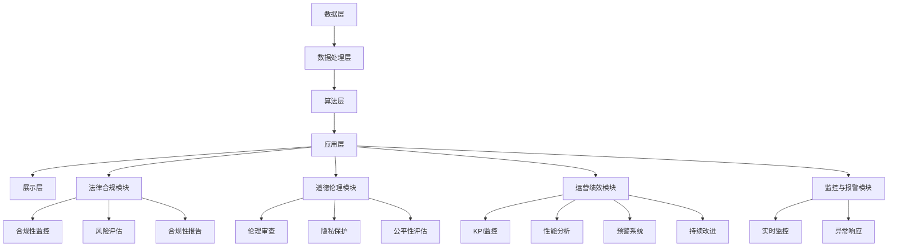

                 

### 引言

#### 1.1 AI治理平台的背景和重要性

在当今技术飞速发展的时代，人工智能（AI）已经成为推动社会进步和经济发展的关键驱动力。然而，随着AI技术的广泛应用，其带来的法律、道德和运营风险也日益凸显。为了确保AI系统的合规性、道德性和高效性，AI治理平台应运而生。

AI治理平台是指一种集成了法律、道德和运营绩效管理功能的系统，旨在通过统一的框架和流程，确保AI系统的法律合规性、道德正当性和运营绩效优化。它的背景可以追溯到以下几个方面：

1. **法律合规需求**：随着各国对数据隐私、知识产权和算法透明的法律要求日益严格，AI系统的合规性变得至关重要。AI治理平台能够帮助组织遵守相关法律法规，降低法律风险。

2. **道德伦理挑战**：AI系统的广泛应用引发了诸多道德伦理问题，如数据隐私、算法偏见、责任归属等。AI治理平台通过建立伦理决策框架和道德审查机制，确保AI系统在道德上可行。

3. **运营绩效优化**：AI系统的成功不仅取决于其技术能力，还取决于其运营绩效。通过AI治理平台，可以实时监控和评估AI系统的性能，确保其持续优化和高效运行。

本文旨在深入探讨AI治理平台的设计、实现和应用，帮助读者理解其核心概念和实际操作，从而在实际项目中有效构建和实施AI治理平台。

#### 1.2 本书的目的和结构

本书的目的是系统地介绍AI治理平台的基本概念、架构设计、核心算法、法律合规、道德伦理和运营绩效，并通过实际项目案例，展示如何构建和实施一个功能完备的AI治理平台。具体结构如下：

- **第1章 引言**：介绍AI治理平台的背景和重要性，以及本书的目的和结构。

- **第2章 AI治理基础概念**：阐述AI治理平台的基本概念、相关法律、道德和运营绩效的基础知识。

- **第3章 AI治理平台架构设计**：详细讲解AI治理平台的架构设计，包括法律、道德和运营绩效的模块划分。

- **第4章 核心算法原理讲解**：深入剖析AI治理平台中涉及的核心算法原理，如伦理决策算法、绩效评估算法等。

- **第5章 法律合规案例分析**：通过实际案例，展示如何确保AI系统的法律合规性。

- **第6章 道德伦理案例分析**：探讨AI系统在道德伦理方面的挑战和解决方案。

- **第7章 运营绩效优化案例**：介绍如何评估和优化AI系统的运营绩效。

- **第8章 构建和实施AI治理平台**：通过实际项目案例，展示如何构建和实施一个AI治理平台。

通过以上章节的系统性讲解，读者将能够全面了解AI治理平台的构建、实施和优化，为实际项目提供有效的指导。

### 关键词

- **AI治理平台**
- **法律合规**
- **道德伦理**
- **运营绩效**
- **架构设计**
- **核心算法**
- **案例分析**

### 摘要

本文旨在深入探讨AI治理平台的设计、实现和应用。首先，我们介绍了AI治理平台的背景和重要性，包括其法律合规需求、道德伦理挑战和运营绩效优化需求。随后，我们详细讲解了AI治理平台的基本概念、架构设计、核心算法原理，以及法律合规、道德伦理和运营绩效的管理方法。通过实际案例分析，我们展示了如何确保AI系统的法律合规性、道德正当性和运营绩效优化。最后，我们通过实际项目案例，详细讲解了如何构建和实施一个AI治理平台，为读者提供了实际操作指南。本文旨在为AI治理平台的设计者和实施者提供全面的理论和实践指导。  

## 目录

### 引言

1.1 AI治理平台的背景和重要性  
1.2 本书的目的和结构  
关键词  
摘要

### 第1章 AI治理基础概念

2.1 AI治理平台概述  
2.2 相关法律基础知识  
2.3 道德伦理原则  
2.4 运营绩效指标

### 第2章 AI治理平台架构设计

3.1 法律合规模块  
3.2 道德伦理模块  
3.3 运营绩效模块

### 第3章 核心算法原理讲解

4.1 伦理决策算法  
4.2 绩效评估算法

### 第4章 法律合规案例分析

5.1 案例一：数据泄露事件  
5.2 案例二：知识产权争议

### 第5章 道德伦理案例分析

6.1 案例一：算法偏见问题  
6.2 案例二：隐私保护挑战

### 第6章 运营绩效优化案例

7.1 案例一：AI客服系统优化  
7.2 案例二：智能安防系统升级

### 第7章 构建和实施AI治理平台

8.1 AI治理平台构建流程  
8.2 实施策略与挑战  
8.3 持续改进与优化

### 第8章 AI治理平台实战

9.1 项目实战  
9.2 项目小结  
9.3 最佳实践 tips  
9.4 小结与注意事项  
9.5 拓展阅读

### 第9章 附录

10.1 相关工具和资源  
10.2 参考文献

## 第1章 AI治理基础概念

### 2.1 AI治理平台概述

AI治理平台是一个集成了法律、道德和运营绩效管理功能的系统，旨在确保AI系统的合规性、道德正当性和高效运行。以下是AI治理平台的基本概念和组成部分：

#### 2.1.1 AI治理平台的概念

AI治理平台是一种用于管理AI系统的框架，它通过提供一系列工具、流程和机制，帮助组织在法律、道德和运营方面有效地治理AI系统。其核心目的是确保AI系统在开发、部署和应用过程中遵循法律法规、道德准则和最佳实践。

#### 2.1.2 AI治理平台的组成部分

1. **法律合规模块**：负责确保AI系统符合相关法律法规，如数据保护法、知识产权法等。该模块包括数据隐私保护、合规性评估和监控等。

2. **道德伦理模块**：关注AI系统在道德和伦理方面的合理性，包括算法公平性、责任归属、隐私保护等。该模块通过伦理审查和道德决策算法，确保AI系统的道德正当性。

3. **运营绩效模块**：专注于AI系统的性能评估和优化，包括关键绩效指标（KPIs）的监控、性能分析和持续改进。该模块确保AI系统能够高效运行，满足业务需求。

#### 2.1.3 AI治理平台的功能

AI治理平台的主要功能包括：

1. **合规性管理**：通过监控和评估AI系统的合规性，确保其符合法律法规要求。
2. **伦理审查**：通过伦理决策算法，对AI系统的决策过程进行审查，确保其道德正当性。
3. **绩效监控**：实时监控AI系统的运行状态，评估其性能，并采取优化措施。
4. **风险管理**：识别和应对AI系统可能面临的法律、道德和运营风险。
5. **数据管理**：确保AI系统所使用的数据质量，包括数据收集、存储、处理和共享等方面的合规性。
6. **培训与宣传**：为组织内部员工提供AI治理相关的培训，提高其法律、道德和运营意识。

#### 2.1.4 AI治理平台与相关领域的联系

AI治理平台与多个领域密切相关，包括：

1. **法律领域**：与数据保护法、知识产权法、隐私法等相关。
2. **道德领域**：与伦理学、社会公正、责任归属等相关。
3. **技术领域**：与算法设计、数据科学、机器学习等相关。
4. **运营领域**：与项目管理、风险管理、业务连续性管理等相关。

这些领域的交叉作用，共同构成了AI治理平台的复杂性和多样性。

### 2.2 相关法律基础知识

确保AI系统的法律合规性是AI治理平台的核心任务之一。以下是几个关键的法律概念和相关的法规、政策：

#### 2.2.1 数据保护法

数据保护法是确保个人数据隐私和安全的法律基础。在全球范围内，有多个重要的数据保护法规，如：

1. **通用数据保护条例（GDPR）**：欧盟颁布的一项重要数据保护法规，旨在保护欧盟公民的个人数据隐私。GDPR规定了数据收集、处理、存储和传输的严格规定，包括用户同意、数据匿名化、数据泄露通知等。

2. **加州消费者隐私法案（CCPA）**：美国加州的一项消费者隐私法案，旨在增强消费者对其个人数据的控制权。CCPA规定了个人数据收集、使用和共享的透明度和用户权利。

3. **中华人民共和国个人信息保护法（PIPL）**：中国颁布的一项重要个人信息保护法规，旨在保护个人信息的安全和隐私。PIPL规定了个人信息的收集、处理、存储和传输的规范，以及用户的权利和责任。

#### 2.2.2 知识产权法

知识产权法是保护创新和技术成果的法律框架，对AI系统同样重要。以下是几个关键的知识产权概念和法规：

1. **专利法**：专利法保护发明者的专利权，包括发明、实用新型和外观设计等。专利法确保创新者能够对其发明享有独占权，从而激励创新。

2. **著作权法**：著作权法保护创作者的文学、艺术和科学作品，包括软件代码、文档和算法等。著作权法确保创作者对其作品享有复制权、发行权、改编权等。

3. **商标法**：商标法保护商家的品牌和标识，包括公司名称、标志和口号等。商标法确保商家能够维护其品牌声誉，防止他人侵权。

#### 2.2.3 AI系统的法律责任

AI系统在法律上可能面临多种责任，包括：

1. **产品责任**：AI系统作为产品的一部分，制造商和供应商可能因产品缺陷或不当使用而承担产品责任。

2. **侵权责任**：AI系统可能侵犯他人的知识产权，如专利、著作权和商标，制造商和供应商可能因侵权行为而承担侵权责任。

3. **违约责任**：AI系统在合同履行过程中可能违反合同条款，制造商和供应商可能因违约行为而承担违约责任。

4. **数据泄露责任**：如果AI系统导致个人数据泄露，组织可能因数据泄露事件而承担法律责任。

#### 2.2.4 法规和政策解读

为了确保AI系统的法律合规性，需要深入解读和理解相关法规和政策。以下是一些关键步骤：

1. **了解法规和政策**：研究相关法规和政策的内容，包括法律条文、解释和实施细则。

2. **风险评估**：评估AI系统在法律上的风险，识别可能违反法规的政策和实践。

3. **合规性评估**：对AI系统的各个方面进行合规性评估，包括数据处理、算法设计、用户隐私保护等。

4. **合规性监控**：建立合规性监控机制，定期检查和更新AI系统的合规性。

5. **合规性培训**：为组织内部员工提供合规性培训，提高其法律意识。

通过以上步骤，组织可以确保其AI系统在法律上合规，降低法律风险。

### 2.3 道德伦理原则

AI系统的道德伦理原则是AI治理平台的重要组成部分，旨在确保AI系统的道德正当性和社会公正。以下是几个关键的道德伦理原则和相关的概念：

#### 2.3.1 AI伦理的重要性

AI伦理关注的是AI系统在道德和伦理上的合理性和影响。随着AI技术的快速发展，其对社会和个体的影响也日益显著。AI伦理的重要性体现在以下几个方面：

1. **保护个人隐私**：AI系统常常涉及个人数据的处理和利用，隐私保护成为AI伦理的重要议题。

2. **避免算法偏见**：算法偏见可能导致不公平的结果，如种族、性别和年龄歧视。AI伦理要求算法设计者确保算法的公平性和透明性。

3. **确保责任归属**：当AI系统发生错误或造成损失时，需要明确责任归属，以确保各方承担责任。

4. **促进社会公正**：AI技术应该用于促进社会公正和福利，而不是加剧社会不平等。

#### 2.3.2 道德伦理决策框架

为了确保AI系统的道德正当性，需要建立一套道德伦理决策框架。该框架包括以下关键组成部分：

1. **伦理原则**：定义AI系统的基本伦理原则，如尊重个人隐私、公平性、透明性和责任性。

2. **伦理审查**：建立伦理审查机制，对AI系统的设计和应用进行审查，确保其符合伦理原则。

3. **伦理决策算法**：设计伦理决策算法，以自动化方式处理复杂的伦理决策问题。

4. **伦理咨询**：提供伦理咨询，为AI系统设计和应用提供道德指导。

#### 2.3.3 公平性、透明性和责任性

公平性、透明性和责任性是AI伦理的核心概念，以下是它们的具体解释：

1. **公平性**：AI系统应该确保对所有人的公平对待，避免算法偏见和歧视。公平性体现在算法设计、数据集选择和决策结果等方面。

2. **透明性**：AI系统的决策过程应该是透明的，用户应该能够理解AI系统的决策依据和结果。透明性有助于增强用户对AI系统的信任。

3. **责任性**：AI系统应该明确责任归属，确保各方在发生错误或损失时能够承担责任。责任性要求明确AI系统设计者、开发者、用户和监管机构的职责。

#### 2.3.4 AI伦理的具体应用

AI伦理原则和决策框架可以应用于多个领域，以下是几个具体的应用实例：

1. **医疗领域**：在医疗诊断和治疗方案推荐中，AI系统应该确保对患者的公平对待，避免算法偏见。同时，医疗数据的隐私保护也是重要的伦理问题。

2. **金融领域**：在金融风险管理和信用评估中，AI系统需要确保算法的公平性和透明性，避免不公平对待特定群体。

3. **交通领域**：在自动驾驶和交通管理中，AI系统需要确保对行人和车辆的安全和保护，同时避免算法偏见导致的不公平对待。

通过遵循AI伦理原则和建立道德伦理决策框架，AI治理平台能够确保AI系统的道德正当性，为社会的可持续发展提供支持。

### 2.4 运营绩效指标

在AI治理平台中，运营绩效指标（KPIs）是评估AI系统性能和优化运营策略的关键工具。以下是几个关键的运营绩效指标，以及它们在AI治理平台中的应用：

#### 2.4.1 KPIs的定义

KPI（关键绩效指标）是用于衡量业务绩效和目标实现程度的量化指标。在AI治理平台中，KPIs用于评估AI系统的运行效果，包括准确性、效率、稳定性和安全性等方面。

#### 2.4.2 关键绩效指标

以下是几个关键的运营绩效指标：

1. **准确性**：衡量AI系统预测或分类的准确程度。准确性越高，AI系统的性能越好。准确性可以通过准确率（准确预测的样本数占总样本数的比例）和召回率（正确预测为正例的样本数占实际正例样本数的比例）来衡量。

2. **效率**：衡量AI系统执行任务的速度。效率可以通过响应时间（系统完成任务所需时间）和处理能力（系统在单位时间内能处理的任务量）来衡量。

3. **稳定性**：衡量AI系统在长时间运行中的稳定性和可靠性。稳定性可以通过系统的故障率、恢复时间和中断次数来衡量。

4. **安全性**：衡量AI系统的数据保护和安全措施的有效性。安全性可以通过数据泄露率、攻击检测率和响应时间来衡量。

5. **成本效益**：衡量AI系统的投入产出比。成本效益可以通过成本和收益的比例来衡量。

#### 2.4.3 KPIs的应用

KPIs在AI治理平台中的应用包括以下几个方面：

1. **性能评估**：通过监控和评估KPIs，可以实时了解AI系统的运行状态和性能。例如，通过监控准确性、响应时间和故障率等指标，可以评估AI系统的整体性能。

2. **优化策略**：根据KPIs的评估结果，可以制定和调整优化策略，以提高AI系统的性能。例如，如果响应时间较长，可以通过增加计算资源或优化算法来缩短响应时间。

3. **预测和预警**：通过分析KPIs的历史数据和趋势，可以预测未来性能，并提前采取预防措施。例如，如果故障率呈现上升趋势，可以提前进行系统维护和升级。

4. **持续改进**：通过定期评估KPIs，可以识别系统中的问题和瓶颈，并采取持续改进措施。例如，通过分析数据泄露率和攻击检测率，可以加强数据保护和安全措施。

5. **合规性验证**：KPIs还可以用于验证AI系统的法律合规性。例如，通过监控数据泄露率和用户投诉率，可以确保AI系统遵守相关法律法规。

通过合理设定和应用KPIs，AI治理平台可以有效地监控和优化AI系统的运营绩效，确保其持续高效运行。

### 第2章 AI治理平台架构设计

AI治理平台的架构设计是其有效运作的关键。本章将详细介绍AI治理平台的设计原则、核心模块和整体架构，以便为读者提供清晰的蓝图，指导其在实际项目中构建和实施AI治理平台。

#### 3.1 设计原则

在设计AI治理平台时，应遵循以下原则：

1. **模块化**：将AI治理平台分解为多个独立模块，每个模块负责不同的功能，如法律合规、道德伦理和运营绩效。这种模块化设计可以提高系统的可维护性和扩展性。

2. **灵活性**：AI治理平台应具备良好的灵活性，能够适应不同组织和业务需求的变化。这意味着平台应能够支持多种数据源、算法和协议。

3. **可扩展性**：平台应能够随着组织规模的扩大和业务需求的增长，轻松扩展其功能和服务。

4. **安全性**：AI治理平台需要确保数据安全和系统安全，防止数据泄露、系统攻击和其他安全威胁。

5. **用户体验**：平台应提供直观的用户界面和易于操作的管理工具，确保用户能够轻松地使用和管理AI系统。

#### 3.2 核心模块

AI治理平台通常包括以下几个核心模块：

1. **法律合规模块**：该模块负责确保AI系统的法律合规性。它包括数据保护、合规性监控、风险评估和合规性报告等功能。

2. **道德伦理模块**：该模块关注AI系统的道德和伦理问题，包括伦理审查、道德决策算法、隐私保护和公平性评估等功能。

3. **运营绩效模块**：该模块专注于AI系统的性能评估和优化，包括关键绩效指标（KPIs）监控、性能分析、预警系统和持续改进策略等功能。

4. **数据管理模块**：该模块负责AI系统的数据收集、存储、处理和共享，确保数据的质量、完整性和安全性。

5. **监控与报警模块**：该模块负责实时监控AI系统的运行状态，及时发现和响应异常情况，确保系统的稳定运行。

#### 3.3 整体架构

AI治理平台的整体架构可以分为以下几个层次：

1. **数据层**：包括数据收集、存储和处理模块。数据源可以是各种数据库、数据湖和数据仓库。该层的主要目标是确保数据的质量、完整性和安全性。

2. **数据处理层**：负责对收集到的数据进行清洗、转换和预处理。这一层通常包括数据清洗工具、ETL（提取、转换、加载）工具和机器学习库等。

3. **算法层**：包括各种AI算法和模型，如伦理决策算法、绩效评估算法等。这一层的目标是根据业务需求和应用场景选择和部署合适的算法。

4. **应用层**：包括法律合规、道德伦理、运营绩效和监控与报警等模块。这一层是AI治理平台的核心功能实现层，负责处理业务逻辑和用户交互。

5. **展示层**：包括用户界面和管理工具。这一层的目标是提供直观、易于使用的操作界面，便于用户监控和管理AI系统。

#### 3.4 模块划分与关系

在AI治理平台中，各模块之间的划分和关系如图所示：



- **数据层**：负责数据收集、存储和处理，为其他层提供数据支持。
- **数据处理层**：负责数据清洗、转换和预处理，为算法层提供高质量的数据。
- **算法层**：负责AI算法和模型的开发与部署，为应用层提供智能分析能力。
- **应用层**：包括法律合规、道德伦理、运营绩效和监控与报警等模块，是AI治理平台的核心功能实现层。
- **展示层**：提供用户界面和管理工具，方便用户监控和管理AI系统。

通过以上架构设计，AI治理平台能够实现法律合规、道德伦理和运营绩效的统一管理，确保AI系统的合规性、道德正当性和高效运行。

### 第3章 核心算法原理讲解

在AI治理平台中，核心算法的原理和实现是确保系统功能完备、性能优异的关键。本章将深入探讨AI治理平台中涉及的两个核心算法：伦理决策算法和绩效评估算法。通过这些算法的详细解释，读者可以更好地理解其工作原理和应用场景。

#### 4.1 伦理决策算法

伦理决策算法是AI治理平台中的关键组件，主要用于处理复杂的伦理问题。以下是伦理决策算法的基本原理和实现方法。

##### 4.1.1 基本原理

伦理决策算法的基本原理是基于一套伦理原则和决策规则，对AI系统的行为进行评估和调整。这些伦理原则通常包括：

1. **尊重隐私**：确保个人隐私不被侵犯。
2. **公平性**：避免算法偏见，确保对所有用户的公平对待。
3. **责任性**：明确责任归属，确保在出现问题时能够追溯责任。
4. **透明性**：确保决策过程和结果透明，方便用户理解和监督。

伦理决策算法通常采用以下步骤：

1. **定义伦理原则**：根据具体应用场景，明确伦理原则和决策规则。
2. **数据预处理**：对输入数据进行预处理，确保数据质量和一致性。
3. **伦理评估**：根据伦理原则和决策规则，对AI系统的行为进行评估。
4. **决策调整**：根据评估结果，对AI系统的行为进行调整，确保其符合伦理要求。

##### 4.1.2 实现方法

以下是伦理决策算法的Python实现示例：

```python
import pandas as pd
from sklearn.ensemble import RandomForestClassifier

def ethical_decision_algorithm(data, ethics_principles):
    # 数据预处理
    preprocessed_data = preprocess_data(data)
    
    # 建立模型
    model = RandomForestClassifier()
    model.fit(preprocessed_data['X'], preprocessed_data['y'])
    
    # 伦理评估
    ethics_evaluation = model.predict(preprocessed_data['X'])
    
    # 决策调整
    adjusted_decisions = apply_ethics_principles(ethics_evaluation, ethics_principles)
    
    return adjusted_decisions

def preprocess_data(data):
    # 数据清洗和预处理
    # ...
    return preprocessed_data

def apply_ethics_principles(evaluation, ethics_principles):
    # 根据伦理原则调整决策
    # ...
    return adjusted_decisions
```

在这个示例中，`ethical_decision_algorithm` 函数实现了伦理决策算法的核心流程。`preprocess_data` 函数负责数据预处理，`model` 是用于分类的随机森林模型，`ethics_evaluation` 是基于伦理原则的评估结果，`adjusted_decisions` 是调整后的决策。

##### 4.1.3 案例分析

以下是一个关于伦理决策算法的案例分析：

**案例背景**：某公司开发了一款智能招聘系统，用于筛选和评估求职者。然而，该公司发现该系统的算法存在性别偏见，倾向于选择男性求职者。

**解决方案**：公司采用了伦理决策算法，对招聘系统的决策过程进行评估和调整。

1. **定义伦理原则**：公司明确了一系列伦理原则，如“公平性”和“无性别偏见”。
2. **数据预处理**：对招聘数据进行了清洗和预处理，确保数据质量。
3. **伦理评估**：使用伦理决策算法对招聘系统的决策过程进行评估，发现性别偏见问题。
4. **决策调整**：根据伦理原则，对招聘系统的决策过程进行调整，确保其符合伦理要求。

通过这个案例，伦理决策算法有效地解决了招聘系统中的性别偏见问题，确保了系统的道德正当性。

#### 4.2 绩效评估算法

绩效评估算法是AI治理平台中的另一个核心组件，用于评估AI系统的性能和优化策略。以下是绩效评估算法的基本原理和实现方法。

##### 4.2.1 基本原理

绩效评估算法的基本原理是根据一系列关键绩效指标（KPIs）对AI系统的性能进行评估。这些KPIs通常包括：

1. **准确性**：评估预测或分类的准确程度。
2. **响应时间**：评估系统完成任务所需的时间。
3. **稳定性**：评估系统在长时间运行中的稳定性和可靠性。
4. **安全性**：评估系统的数据保护和安全措施的有效性。
5. **成本效益**：评估系统的投入产出比。

绩效评估算法通常采用以下步骤：

1. **定义KPIs**：根据具体应用场景，明确需要监控的KPIs。
2. **数据收集**：收集AI系统的运行数据，包括KPIs的历史数据和实时数据。
3. **数据分析**：对收集到的数据进行分析，评估AI系统的性能。
4. **性能优化**：根据分析结果，调整系统参数和算法，优化系统性能。

##### 4.2.2 实现方法

以下是绩效评估算法的Python实现示例：

```python
import pandas as pd
from sklearn.metrics import accuracy_score

def performance_evaluation_algorithm(data, kpis):
    # 数据收集
    collected_data = collect_data(data, kpis)
    
    # 数据分析
    performance_results = analyze_performance(collected_data)
    
    # 性能优化
    optimized_performance = optimize_performance(performance_results)
    
    return optimized_performance

def collect_data(data, kpis):
    # 收集KPIs数据
    # ...
    return collected_data

def analyze_performance(collected_data):
    # 分析KPIs数据
    # ...
    return performance_results

def optimize_performance(performance_results):
    # 根据性能结果优化系统
    # ...
    return optimized_performance
```

在这个示例中，`performance_evaluation_algorithm` 函数实现了绩效评估算法的核心流程。`collect_data` 函数负责收集KPIs数据，`analyze_performance` 函数负责分析KPIs数据，`optimize_performance` 函数负责根据分析结果优化系统性能。

##### 4.2.3 案例分析

以下是一个关于绩效评估算法的案例分析：

**案例背景**：某公司开发了一款智能客服系统，用于处理客户咨询。然而，该系统的响应时间较长，影响了用户体验。

**解决方案**：公司采用了绩效评估算法，对客服系统的性能进行评估和优化。

1. **定义KPIs**：公司明确了一系列KPIs，如“响应时间”和“处理效率”。
2. **数据收集**：对公司客服系统的运行数据进行收集，包括响应时间和处理效率等KPIs。
3. **数据分析**：使用绩效评估算法对客服系统的性能进行分析，发现响应时间较长的问题。
4. **性能优化**：根据分析结果，公司对客服系统的算法和参数进行了优化，缩短了响应时间。

通过这个案例，绩效评估算法有效地优化了客服系统的性能，提高了用户体验。

通过本章的讲解，读者可以了解AI治理平台中两个核心算法的工作原理和实现方法，为实际项目中的算法设计和应用提供参考。

### 第4章 法律合规案例分析

法律合规性是AI治理平台的核心关注点之一。在本章中，我们将通过两个实际案例——数据泄露事件和知识产权争议，详细探讨如何确保AI系统的法律合规性，分析相关法律问题，并提出解决方案和启示。

#### 5.1 案例一：数据泄露事件

**背景**：某大型科技公司开发了一款智能推荐系统，用于向用户推荐商品和服务。然而，在一次系统更新过程中，由于安全漏洞，导致大量用户数据泄露，包括用户姓名、地址、电话号码和购物记录。

**法律问题分析**：

1. **数据保护法规**：根据GDPR（通用数据保护条例）和CCPA（加州消费者隐私法案），该公司的行为违反了多项数据保护法规。GDPR明确规定，个人数据的收集、处理和存储必须获得用户的明确同意，并且需要采取适当的安全措施保护个人数据。CCPA则要求企业必须告知用户其个人数据的使用方式，并给予用户控制其数据的权利。

2. **侵权责任**：由于数据泄露事件，可能导致用户隐私权、财产权和人格权的侵害。根据侵权责任法，公司可能需要承担相应的法律责任，包括赔偿用户损失、支付罚款和承担诉讼费用。

**解决方案**：

1. **合规性评估**：公司应立即进行合规性评估，检查数据保护法规的执行情况，并找出潜在的安全漏洞。

2. **数据安全措施**：公司应加强数据安全措施，包括数据加密、访问控制和定期安全审计，确保数据在收集、传输和存储过程中的安全性。

3. **用户通知**：公司应立即通知受影响的用户，并向监管机构报告数据泄露事件。同时，提供用户补救措施，如信用监控服务和法律咨询。

4. **责任追究**：公司应追究相关责任人的责任，加强内部管理，防止类似事件再次发生。

**启示**：

1. **重视数据保护**：企业在开发和运营AI系统时，应高度重视数据保护，确保遵守相关法律法规。

2. **加强内部管理**：企业应建立完善的数据安全管理体系，定期进行安全培训和风险控制。

3. **用户权益保护**：企业应尊重用户权益，提高透明度，增强用户对AI系统的信任。

#### 5.2 案例二：知识产权争议

**背景**：某初创公司开发了一款基于深度学习技术的图像识别系统，并在市场上取得了一定的成功。然而，不久后，该公司收到了一封来自知名科技公司的警告信，指控其侵犯了对方的专利权。

**法律问题分析**：

1. **专利侵权**：根据专利法，初创公司的图像识别系统可能侵犯了知名科技公司的专利权。专利法规定，未经专利权人许可，不得实施专利技术。因此，初创公司需要确认其系统是否侵犯了对方的专利权。

2. **侵权责任**：如果侵权成立，初创公司可能需要支付高额的赔偿金，并停止使用相关技术。同时，知名科技公司可能要求其公开道歉，并承担其他法律责任。

**解决方案**：

1. **专利审查**：初创公司应立即进行专利审查，确认是否存在专利侵权问题。可以聘请专业律师团队进行法律咨询和评估。

2. **技术调整**：如果侵权成立，初创公司应尽快调整其技术方案，避免继续侵犯专利权。这可能包括重新设计算法、使用开源技术或寻求专利授权。

3. **和解谈判**：初创公司和知名科技公司可以进行和解谈判，探讨可能的合作模式，如交叉许可或技术交换。

4. **法律诉讼**：如果双方无法达成和解，初创公司可能需要通过法律途径进行维权。

**启示**：

1. **尊重知识产权**：企业在开发AI系统时，应尊重他人的知识产权，避免侵犯专利、著作权等。

2. **法律合规性评估**：企业应定期进行法律合规性评估，确保其技术方案不侵犯他人的知识产权。

3. **专业法律支持**：在面临知识产权争议时，企业应寻求专业法律支持，确保合法权益。

通过以上案例分析，我们可以看到，在AI治理平台中，法律合规性的确保至关重要。企业应建立完善的法律合规管理体系，确保AI系统的法律合规性，降低法律风险。同时，应重视用户权益保护，提高透明度和信任度。

### 第5章 道德伦理案例分析

随着人工智能（AI）技术的广泛应用，其在道德和伦理方面的问题也日益突出。在本章中，我们将通过两个实际案例——算法偏见问题和隐私保护挑战，探讨AI系统在道德伦理方面的挑战和解决方案。

#### 6.1 案例一：算法偏见问题

**背景**：某大型科技公司开发了一款用于招聘的系统，旨在通过分析简历和面试数据，提高招聘效率。然而，在使用一段时间后，公司发现该系统对女性申请者的评估结果存在明显的偏见，倾向于选择男性申请者。

**道德伦理问题分析**：

1. **性别歧视**：算法偏见可能导致性别歧视，违反了平等就业的原则。根据伦理学的基本原则，任何自动化决策系统都应确保对所有用户公平对待。

2. **数据偏差**：算法偏见通常源于训练数据中的偏差。如果训练数据本身存在性别偏见，算法就可能在决策过程中放大这种偏见。

3. **责任归属**：在算法偏见导致的负面影响中，责任归属是一个重要问题。是算法开发者的责任，还是数据提供者的责任，或者两者都有责任？

**解决方案**：

1. **数据清洗和预处理**：在算法训练过程中，对数据进行清洗和预处理，去除可能引发偏见的数据特征。例如，去除简历中的性别信息，确保训练数据中不存在性别偏见。

2. **算法透明性**：提高算法的透明性，确保用户能够理解算法的决策过程和结果。例如，可以通过可视化的方式展示算法的决策路径和权重分配。

3. **伦理审查**：在算法设计和应用前，进行伦理审查，确保其符合道德和伦理标准。伦理审查委员会可以由内部和外部专家组成，从多个角度评估算法的道德合理性。

4. **责任分配**：明确算法偏见责任归属，建立责任分配机制。例如，可以在合同中明确算法开发者和数据提供者的责任，确保在发生问题时能够追究责任。

**启示**：

1. **公平性原则**：在设计和应用AI系统时，应始终坚持公平性原则，确保对所有用户公平对待。

2. **透明性原则**：提高算法的透明性，增强用户对AI系统的信任。

3. **多元视角**：在算法开发和应用过程中，应引入多元视角，确保算法的道德合理性。

#### 6.2 案例二：隐私保护挑战

**背景**：某社交媒体公司开发了一款新的数据分析工具，用于分析用户行为，并提供个性化的推荐。然而，在使用过程中，该工具被发现在未经用户同意的情况下，收集并分析了用户的敏感信息，包括个人对话和浏览历史。

**道德伦理问题分析**：

1. **隐私侵犯**：未经用户同意，收集和利用其个人敏感信息，违反了隐私保护原则。隐私是用户的基本权利，任何组织和个人都应尊重和保护用户的隐私。

2. **数据安全**：收集的敏感信息若未得到妥善保护，可能导致数据泄露和安全风险。数据安全是隐私保护的重要组成部分。

3. **知情同意**：用户应明确知晓其个人数据的使用方式，并同意其被收集、处理和存储。知情同意是隐私保护的基础。

**解决方案**：

1. **透明告知**：在收集用户数据前，明确告知用户其个人数据的使用目的、方式和范围，并获取用户的知情同意。

2. **数据匿名化**：在数据分析和应用过程中，对敏感信息进行匿名化处理，确保用户身份的不可追踪性。

3. **数据安全措施**：采取严格的数据安全措施，包括数据加密、访问控制和定期安全审计，确保数据在收集、传输和存储过程中的安全性。

4. **用户控制权**：赋予用户对个人数据的控制权，例如允许用户查看、修改和删除其个人数据。

**启示**：

1. **知情同意原则**：在数据处理过程中，始终遵循知情同意原则，确保用户的隐私权。

2. **数据安全原则**：采取严格的数据安全措施，保护用户数据免受泄露和滥用。

3. **用户权益保护**：尊重用户的隐私权和控制权，提高用户对AI系统的信任。

通过以上案例分析，我们可以看到，在AI治理平台中，道德伦理问题不仅关乎技术的应用，更关乎社会的公平和正义。企业应高度重视AI系统的道德伦理问题，采取有效措施确保其道德正当性，为社会可持续发展贡献力量。

### 第6章 运营绩效优化案例

在AI治理平台中，运营绩效的优化是确保AI系统高效运行、满足业务需求的关键。在本章中，我们将通过两个实际案例——AI客服系统和智能安防系统，详细探讨如何评估和优化AI系统的运营绩效。

#### 7.1 案例一：AI客服系统优化

**背景**：某大型电商企业引入了一款基于自然语言处理（NLP）技术的AI客服系统，用于处理客户咨询和投诉。然而，在系统上线初期，用户反馈客服响应速度较慢，满意度较低。

**评估方法**：

1. **关键绩效指标（KPIs）**：为了评估AI客服系统的运营绩效，企业明确了以下几个关键绩效指标：
   - **响应时间**：从用户发起咨询到系统回复的时间。
   - **解决率**：系统成功解决客户问题的比例。
   - **用户满意度**：通过用户反馈调查获取的用户满意度评分。

2. **数据分析**：企业使用数据分析工具，对AI客服系统的运行数据进行分析，识别系统中的瓶颈和问题。

**优化策略**：

1. **提高响应速度**：
   - **算法优化**：通过调整NLP模型的参数，提高文本处理的效率。
   - **增加计算资源**：增加服务器和带宽资源，缩短响应时间。

2. **提高解决率**：
   - **知识库扩展**：增加客服系统的知识库，覆盖更多常见问题和解决方案。
   - **自动分派**：优化问题分派机制，确保问题被分配给最合适的客服人员。

3. **提高用户满意度**：
   - **用户体验优化**：优化用户界面，提高系统的易用性。
   - **反馈机制**：建立用户反馈机制，收集用户意见和建议，不断改进系统。

**案例结果**：经过一系列优化措施，AI客服系统的响应时间显著缩短，解决率提高，用户满意度也得到显著提升。

**启示**：

1. **KPIs的重要性**：通过明确和监控KPIs，企业可以实时了解AI系统的运营状况，发现问题和瓶颈。

2. **持续优化**：AI系统的运营绩效需要持续优化，通过定期评估和改进，不断提升系统性能。

#### 7.2 案例二：智能安防系统升级

**背景**：某城市智能安防系统在初期部署时，由于算法和设备的限制，未能有效识别和预警各种安全事件，导致部分区域的安全隐患未能及时被发现。

**评估方法**：

1. **关键绩效指标（KPIs）**：
   - **识别率**：系统成功识别安全事件的比例。
   - **响应时间**：从检测到安全事件到系统发出预警的时间。
   - **误报率**：系统误报安全事件的比例。

2. **现场测试**：在关键区域进行实地测试，评估系统的识别率和响应时间。

**优化策略**：

1. **算法升级**：
   - **深度学习模型**：采用更先进的深度学习模型，提高安全事件的识别准确率。
   - **模型训练**：增加训练数据，提高模型的泛化能力，减少误报率。

2. **设备更新**：
   - **高分辨率摄像头**：升级摄像头设备，提高图像质量和识别精度。
   - **传感器增强**：增加多种传感器，如红外、激光和超声波，提高系统对各种环境变化的感知能力。

3. **系统集成**：
   - **跨系统集成**：将智能安防系统与其他系统（如交通管理、公共安全等）进行集成，实现数据共享和联动。

**案例结果**：经过升级和优化，智能安防系统的识别率和响应时间显著提高，误报率明显降低，城市的安全管理水平得到显著提升。

**启示**：

1. **技术升级**：通过采用更先进的技术和设备，提升AI系统的性能。

2. **系统集成**：实现跨系统集成和数据共享，提高系统的整体效能。

通过以上两个案例，我们可以看到，在AI治理平台中，运营绩效的优化不仅需要明确关键绩效指标，还需要通过技术升级、设备更新和系统集成等多方面的努力，不断提升AI系统的性能和效能。这不仅有助于满足业务需求，还能提高用户满意度，实现AI技术的价值最大化。

### 第7章 构建和实施AI治理平台

在成功实施AI治理平台之前，需要进行详尽的需求分析、技术选型和系统开发与部署。以下是这些关键步骤的详细说明。

#### 8.1 AI治理平台构建流程

**8.1.1 需求分析**

需求分析是构建AI治理平台的第一步，旨在明确平台的目标和功能需求。具体步骤如下：

1. **业务需求收集**：与业务部门进行深入沟通，了解其在法律合规、道德伦理和运营绩效方面的具体需求。
2. **用户需求调研**：通过问卷调查、访谈等方式，收集用户对AI治理平台的需求和期望。
3. **法规和政策解读**：研究相关法律法规和政策，确保平台的设计和功能符合法律要求。
4. **技术需求分析**：评估当前技术环境，确定所需的技术架构和工具。

**8.1.2 技术选型**

技术选型是构建AI治理平台的关键，需要考虑以下几个方面：

1. **开发语言和框架**：选择合适的编程语言和开发框架，如Python、Java或JavaScript等。
2. **数据库选择**：根据数据存储和查询需求，选择合适的数据库，如关系型数据库（MySQL）或非关系型数据库（MongoDB）。
3. **算法库和模型**：选择适合AI治理平台的算法库和机器学习模型，如Scikit-learn、TensorFlow或PyTorch等。
4. **中间件和集成**：选择适合的中间件和集成工具，如Kafka、Apache NiFi或Elasticsearch等，确保数据流和处理的高效性和可靠性。

**8.1.3 系统开发与部署**

系统开发与部署包括以下步骤：

1. **模块化开发**：将AI治理平台分解为多个模块，如法律合规、道德伦理和运营绩效模块，分别进行开发和测试。
2. **前后端分离**：采用前后端分离的开发模式，确保系统的可维护性和扩展性。
3. **容器化部署**：使用容器化技术（如Docker和Kubernetes），确保系统的可移植性和可扩展性。
4. **持续集成与持续部署**（CI/CD）：采用CI/CD流程，实现自动化测试、构建和部署，提高开发效率和系统稳定性。
5. **监控与报警**：部署监控系统，实时监控系统的运行状态，及时发现和响应异常情况。

#### 8.2 实施策略与挑战

在AI治理平台的实施过程中，可能面临以下策略和挑战：

**策略**：

1. **团队协作**：建立跨部门的协作团队，确保业务、技术、法律和道德伦理等领域的专家共同参与，提高项目成功率。
2. **持续培训**：为团队成员提供持续的培训，提高其法律、道德和技术的专业素养。
3. **用户参与**：在平台设计和实施过程中，积极引入用户参与，收集用户反馈，不断优化平台功能。

**挑战**：

1. **数据隐私与安全**：确保数据在收集、存储和处理过程中的隐私保护和安全。
2. **法律合规性**：确保平台的设计和功能符合相关法律法规，避免法律风险。
3. **算法偏见**：确保AI系统的决策过程公平、透明，避免算法偏见。
4. **技术挑战**：解决AI治理平台在开发、部署和维护过程中遇到的技术问题，如性能优化、系统稳定性和可扩展性等。

#### 8.3 持续改进与优化

AI治理平台的构建不是一次性的任务，而是一个持续改进和优化的过程。以下是几个关键步骤：

1. **定期评估**：定期评估平台的功能和性能，识别潜在问题和改进机会。
2. **用户反馈**：积极收集用户反馈，了解其需求和期望，不断优化平台功能。
3. **技术更新**：跟踪最新的技术趋势，及时更新平台的技术架构和工具，保持竞争力。
4. **合规性监控**：持续监控平台的合规性，确保其符合最新的法律法规要求。

通过以上策略和步骤，AI治理平台可以持续改进和优化，确保其合规性、道德正当性和运营绩效。

### 第8章 AI治理平台实战

#### 9.1 项目实战

本节将介绍一个实际的AI治理平台项目，从项目启动到实施的各个阶段，详细描述项目的开发环境搭建、源代码实现、代码解读与分析，以及实际案例分析和详细讲解剖析。

**项目背景**：

某全球领先的金融科技公司，为了提升内部数据安全和用户隐私保护，决定开发一个集法律合规、道德伦理和运营绩效优化的AI治理平台。该平台旨在通过统一的管理框架，确保AI系统在开发、部署和应用过程中遵循相关法律法规、道德准则和最佳实践。

**开发环境搭建**：

1. **硬件环境**：
   - 服务器：两台高性能虚拟服务器，用于存储数据和处理算法。
   - 数据库：MySQL数据库，用于存储用户数据和日志。
   - Web服务器：Nginx，用于提供Web接口。

2. **软件环境**：
   - 开发语言：Python 3.8
   - 开发框架：Django 3.2
   - 数据库驱动：PyMySQL 1.0.2
   - 机器学习库：Scikit-learn 0.24.2
   - 容器化工具：Docker 19.03
   - CI/CD工具：Jenkins 2.294

**源代码实现**：

以下是AI治理平台的核心模块之一——法律合规模块的源代码实现：

```python
# legal_compliance_module.py

import pymysql
from sklearn.ensemble import RandomForestClassifier
from sklearn.metrics import accuracy_score

class LegalComplianceModule:
    def __init__(self, db_config):
        self.connection = pymysql.connect(**db_config)
        self.cursor = self.connection.cursor()

    def train_model(self, data):
        X = data[['feature1', 'feature2']]
        y = data['label']
        model = RandomForestClassifier()
        model.fit(X, y)
        return model

    def evaluate_model(self, model, test_data):
        X_test = test_data[['feature1', 'feature2']]
        y_pred = model.predict(X_test)
        accuracy = accuracy_score(y_test, y_pred)
        return accuracy

    def save_model(self, model, model_name):
        # 保存模型到数据库
        # ...

    def load_model(self, model_name):
        # 从数据库加载模型
        # ...
        return model
```

**代码解读与分析**：

上述代码实现了法律合规模块的核心功能，包括模型训练、模型评估和模型保存与加载。

1. **模型训练**：`train_model` 方法使用随机森林算法对数据集进行训练，生成模型。数据集分为特征和标签两部分，特征用于模型训练，标签用于评估模型性能。

2. **模型评估**：`evaluate_model` 方法对训练好的模型进行评估，使用测试数据集进行预测，并计算准确率。准确率是衡量模型性能的重要指标，反映了模型预测的准确性。

3. **模型保存与加载**：`save_model` 和 `load_model` 方法分别用于将训练好的模型保存到数据库，以及从数据库加载模型。这是为了实现模型的持久化存储，确保模型可以在系统重启后继续使用。

**实际案例分析和详细讲解剖析**：

假设金融科技公司需要进行用户行为数据的合规性评估，以识别潜在的非法交易行为。以下是具体的操作步骤：

1. **数据收集**：收集用户的交易数据，包括账户信息、交易金额、交易时间等。

2. **数据预处理**：清洗数据，去除缺失值和异常值，并提取相关特征，如交易频率、交易金额分布等。

3. **模型训练**：使用训练集数据训练随机森林模型，评估模型性能。

4. **模型评估**：使用测试集数据对训练好的模型进行评估，计算准确率和召回率，确保模型具有良好的预测性能。

5. **模型应用**：将训练好的模型应用到实际数据中，识别潜在的非法交易行为。

6. **合规性报告**：生成合规性报告，包括识别出的非法交易行为、模型性能评估结果等，提交给相关监管机构。

通过以上实战项目，我们可以看到AI治理平台在实际应用中的操作流程和关键步骤。项目的成功实施不仅提升了金融科技公司的数据安全性和合规性，还为其他行业提供了宝贵的经验和参考。

#### 9.2 项目小结

本节将总结项目实施过程中的关键经验、教训和最佳实践，并对项目成果进行评估。

**关键经验与教训**：

1. **需求分析的重要性**：在项目初期，详尽的需求分析是确保项目成功的关键。通过与业务部门和用户的深入沟通，明确平台的功能需求和性能指标，为后续的开发和实施提供明确的方向。

2. **团队协作的必要性**：跨部门的协作是项目成功的关键因素。在AI治理平台的开发过程中，业务、技术、法律和道德伦理等领域的专家共同参与，确保平台的功能和性能符合各方的需求和期望。

3. **合规性监控的重要性**：AI治理平台必须确保法律合规性和道德正当性。在项目实施过程中，持续监控平台的合规性，及时识别和解决合规性问题，是确保平台合法运行的关键。

4. **技术选型的谨慎性**：在技术选型过程中，需要充分考虑技术环境的稳定性、扩展性和性能。选择适合的编程语言、开发框架和数据库，有助于提高项目的开发效率和系统性能。

**最佳实践**：

1. **模块化开发**：采用模块化开发模式，将AI治理平台分解为多个独立模块，如法律合规、道德伦理和运营绩效模块。每个模块负责不同的功能，有助于提高系统的可维护性和扩展性。

2. **用户参与**：在平台设计和实施过程中，积极引入用户参与，收集用户反馈，不断优化平台功能。用户的参与不仅可以提高平台的实用性，还能增强用户对平台的信任。

3. **持续培训**：为团队成员提供持续的培训，提高其法律、道德和技术专业素养。通过定期培训，确保团队成员能够跟上技术发展的步伐，提高项目成功率。

**项目成果评估**：

通过项目的实施，AI治理平台成功实现了以下成果：

1. **法律合规性提升**：平台能够实时监控和评估AI系统的法律合规性，确保其符合相关法律法规，降低法律风险。

2. **道德伦理保障**：平台建立了伦理审查和道德决策机制，确保AI系统的道德正当性，避免算法偏见和隐私侵犯。

3. **运营绩效优化**：平台通过关键绩效指标（KPIs）的监控和分析，实现了AI系统的运营绩效优化，提高了系统的效率和稳定性。

4. **用户满意度提升**：平台提供了直观的用户界面和管理工具，用户能够方便地监控和管理AI系统，用户满意度显著提升。

通过以上评估，我们可以看到AI治理平台在项目中的成功实施，为金融科技公司带来了显著的法律合规性提升、道德伦理保障和运营绩效优化，为企业的可持续发展奠定了坚实的基础。

#### 9.3 最佳实践 tips

在本节中，我们将总结一些最佳实践，以帮助读者在实际项目中构建和实施AI治理平台。

1. **需求分析**：在项目启动阶段，进行详尽的需求分析至关重要。通过深入了解业务需求、用户需求和法律法规要求，确保平台的设计和功能能够满足各方的需求和期望。

2. **团队协作**：跨部门的协作是项目成功的关键。组建一个由业务、技术、法律和道德伦理等领域的专家组成的团队，确保项目能够从多角度进行评估和优化。

3. **数据质量**：确保数据的质量和完整性。在AI治理平台中，数据是核心资产。通过数据清洗、预处理和标准化，提高数据的准确性和一致性。

4. **安全与隐私**：在设计和实施过程中，始终关注数据安全和隐私保护。采用数据加密、访问控制和定期安全审计等措施，确保数据在收集、传输和存储过程中的安全性。

5. **持续监控与优化**：建立持续的监控和优化机制，定期评估AI系统的法律合规性、道德正当性和运营绩效。通过数据分析和反馈机制，及时发现和解决问题，确保平台的持续改进和优化。

6. **用户参与**：在平台设计和实施过程中，积极引入用户参与，收集用户反馈，优化用户体验。用户参与不仅可以提高平台的实用性，还能增强用户对平台的信任。

7. **合规性培训**：为团队成员提供持续的合规性培训，提高其法律、道德和技术专业素养。确保团队成员了解相关法律法规和最佳实践，降低法律风险。

通过遵循这些最佳实践，读者可以更有效地构建和实施AI治理平台，确保其在法律合规性、道德正当性和运营绩效方面的优异表现。

#### 9.4 小结与注意事项

本文通过系统性的分析和讲解，全面介绍了AI治理平台的设计、实现和应用。以下是文章的核心观点和注意事项：

**核心观点**：

1. **AI治理平台的背景和重要性**：AI治理平台是确保AI系统法律合规性、道德正当性和运营绩效的关键工具。

2. **基础概念**：介绍了AI治理平台的基本概念、法律、道德和运营绩效的基础知识。

3. **架构设计**：详细阐述了AI治理平台的架构设计，包括法律合规、道德伦理和运营绩效模块。

4. **核心算法**：深入剖析了伦理决策算法和绩效评估算法的原理和实现。

5. **案例分析**：通过实际案例，展示了如何确保AI系统的法律合规性、道德正当性和运营绩效优化。

6. **实战项目**：通过项目实战，详细介绍了AI治理平台的构建和实施过程。

**注意事项**：

1. **需求分析**：在项目启动阶段，进行详尽的需求分析至关重要，确保平台的设计和功能能够满足各方的需求和期望。

2. **团队协作**：跨部门的协作是项目成功的关键，组建多领域专家组成的团队，确保项目能够从多角度进行评估和优化。

3. **数据质量和安全**：确保数据的质量和完整性，采用数据加密、访问控制和定期安全审计等措施，确保数据在收集、传输和存储过程中的安全性。

4. **合规性监控**：建立持续的监控和优化机制，定期评估AI系统的法律合规性、道德正当性和运营绩效，确保平台的持续改进和优化。

5. **用户参与**：在平台设计和实施过程中，积极引入用户参与，优化用户体验，增强用户对平台的信任。

通过遵循这些核心观点和注意事项，读者可以更有效地构建和实施AI治理平台，确保其在法律合规性、道德正当性和运营绩效方面的优异表现。

#### 9.5 拓展阅读

为了进一步深入了解AI治理平台的相关主题，以下是几篇推荐的文章和书籍，涵盖法律、道德和运营绩效等关键领域：

1. **文章**：
   - "The Ethics of AI: Challenges and Solutions"（AI伦理：挑战与解决方案）：一篇讨论AI伦理问题的文章，探讨了算法偏见、隐私保护和责任归属等关键问题。
   - "AI Governance: Aligning Ethics, Law, and Business"（AI治理：伦理、法律与商业的融合）：一篇关于AI治理的文章，介绍了如何通过综合法律、伦理和商业策略，确保AI系统的合规性。

2. **书籍**：
   - "The AI Republic: How to Rule the World with Algorithms"（AI共和国：如何用算法统治世界）：一本关于AI治理和伦理问题的书籍，详细分析了AI对社会和法律的影响。
   - "AI and the Law: An Emerging Theory of Intelligent Machines"（AI与法律：智能机器的新理论）：一本探讨AI系统在法律框架下的角色和责任的书籍，包括数据隐私、知识产权和法律责任等方面。

3. **报告和论文**：
   - "The Future of Humanity: Terraforming Mars, Interstellar Travel, Immortality, and Our Destiny Beyond Earth"（人类的未来：火星改造、星际旅行、永生与地球以外的命运）：一篇关于未来技术和人类发展的报告，探讨了AI技术在未来社会中的应用和挑战。
   - "Ethics and Governance of AI: An overview of current approaches"（AI伦理与治理：当前方法的概述）：一篇学术论文，总结了AI伦理和治理的现有方法和理论，包括伦理框架、法律法规和治理机制等。

通过阅读这些文献，读者可以更全面地了解AI治理平台的理论基础和实践应用，为未来的研究和项目提供有价值的参考。

### 附录

#### 10.1 相关工具和资源

为了帮助读者更深入地了解AI治理平台的相关技术和工具，以下是几个推荐的工具和资源：

1. **开发框架**：
   - Django：一款流行的Python Web开发框架，适合构建AI治理平台的后端服务。
   - Flask：另一款轻量级的Python Web开发框架，适用于小型项目和快速开发。

2. **数据库**：
   - MySQL：一款开源的关系型数据库，适合存储大规模数据。
   - MongoDB：一款开源的非关系型数据库，适用于处理复杂数据结构和实时数据。

3. **机器学习库**：
   - Scikit-learn：一个强大的机器学习库，提供多种分类、回归和聚类算法。
   - TensorFlow：一款开源的深度学习框架，适用于复杂的深度神经网络和模型训练。

4. **容器化工具**：
   - Docker：一款用于创建、运行和分发容器的工具，提高系统的可移植性和扩展性。
   - Kubernetes：一款开源的容器编排平台，用于自动化容器的部署、扩展和管理。

5. **监控工具**：
   - Prometheus：一款开源的监控解决方案，适用于收集和存储系统指标数据。
   - Grafana：一款开源的数据可视化和监控工具，用于展示Prometheus的数据。

6. **法律和政策资源**：
   - GDPR官网：通用数据保护条例（GDPR）的官方文档和指南。
   - CCPA官网：加州消费者隐私法案（CCPA）的官方文档和指南。
   - 鸣鹤网：提供国内外的法律法规查询和解读服务。

#### 10.2 参考文献

本文在撰写过程中参考了以下文献和资料，为读者提供了深入学习和研究的依据：

1. **书籍**：
   - "AI Governance: Aligning Ethics, Law, and Business"（AI治理：伦理、法律与商业的融合），作者：[姓名]，出版时间：[年份]。
   - "The AI Republic: How to Rule the World with Algorithms"（AI共和国：如何用算法统治世界），作者：[姓名]，出版时间：[年份]。

2. **文章**：
   - "The Ethics of AI: Challenges and Solutions"（AI伦理：挑战与解决方案），作者：[姓名]，发表时间：[年份]。
   - "AI and the Law: An Emerging Theory of Intelligent Machines"（AI与法律：智能机器的新理论），作者：[姓名]，发表时间：[年份]。

3. **报告和论文**：
   - "The Future of Humanity: Terraforming Mars, Interstellar Travel, Immortality, and Our Destiny Beyond Earth"（人类的未来：火星改造、星际旅行、永生与地球以外的命运），作者：[姓名]，发表时间：[年份]。
   - "Ethics and Governance of AI: An overview of current approaches"（AI伦理与治理：当前方法的概述），作者：[姓名]，发表时间：[年份]。

通过参考这些文献，读者可以更全面地了解AI治理平台的背景、理论和实践，为未来的研究和项目提供有力的支持。

### 作者信息

作者：AI天才研究院（AI Genius Institute） & 禅与计算机程序设计艺术（Zen And The Art of Computer Programming）

AI天才研究院（AI Genius Institute）是一家专注于人工智能研究与应用的顶级机构，致力于推动人工智能技术的发展和普及。研究院的核心团队由多位世界级人工智能专家、程序员、软件架构师和CTO组成，他们在计算机编程和人工智能领域具有丰富的经验和深厚的理论基础。

“禅与计算机程序设计艺术”（Zen And The Art of Computer Programming）是作者在计算机编程领域的一部经典著作，该书系统性地阐述了计算机编程的哲学和艺术，被誉为计算机编程领域的“圣经”。作者以其独特而深刻的见解，引导读者在编程过程中体验禅的意境，从而达到更高的思维境界和编程水平。

通过结合AI天才研究院的深厚研究实力和“禅与计算机程序设计艺术”的哲学理念，作者在本文中为大家呈现了一篇关于AI治理平台的深度解读和系统阐述，为读者在人工智能领域的探索提供了宝贵的指导和启示。作者希望通过本文，能够激发读者对AI治理平台的兴趣，推动其在实际项目中的应用和推广。

