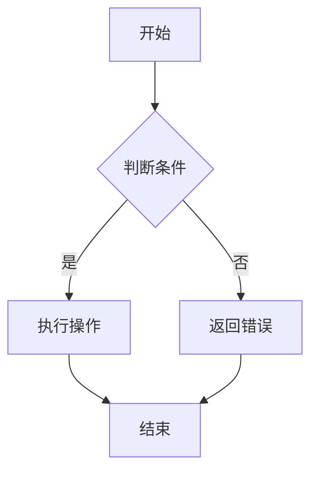
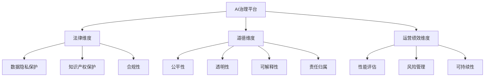

                 

### AI治理平台：管理AI系统的法律、道德和运营绩效

# 关键词：AI治理，法律问题，道德问题，运营绩效，最佳实践，数据隐私，伦理审查，人工智能监管

> 摘要：随着人工智能技术的快速发展，AI治理的重要性日益凸显。本文旨在探讨如何设计并实施一个AI治理平台，以管理AI系统的法律、道德和运营绩效。本文首先介绍了AI治理的基本概念和重要性，然后详细分析了AI系统的法律、道德和运营绩效问题，最后提出了一系列最佳实践和建议。

## 引言

人工智能（AI）作为一种具有重大变革潜力的技术，已经广泛应用于各个领域，从医疗健康到金融科技，从智能交通到智能家居。然而，随着AI系统的普及，其带来的法律、道德和运营绩效问题也日益凸显。这些问题的存在不仅对AI系统的应用和发展构成挑战，也可能对社会产生深远的影响。

### AI治理的重要性

AI治理是指通过制定法律、政策、标准和最佳实践来管理和规范AI系统的发展和应用。其核心目标是确保AI系统的合法性、道德性和高效运营。AI治理的重要性主要体现在以下几个方面：

1. **合法性**：AI系统的应用涉及大量敏感数据和个人隐私，需要遵守相关法律法规，确保数据的合法收集、存储和使用。

2. **道德性**：AI系统的决策过程可能涉及到伦理问题，如公平性、透明性和可解释性。AI治理需要确保AI系统的道德性，避免对特定群体造成歧视或偏见。

3. **运营绩效**：AI系统的高效运营是确保其价值和影响的关键。AI治理需要建立有效的运营绩效评估机制，以确保AI系统的高效、稳定和可靠运行。

### 本文目的

本文旨在探讨如何设计并实施一个AI治理平台，以管理AI系统的法律、道德和运营绩效。具体而言，本文将围绕以下几个问题进行探讨：

1. AI治理平台的基本概念和架构是什么？
2. AI系统的法律问题如何管理？
3. AI系统的道德问题如何解决？
4. AI系统的运营绩效如何评估和管理？
5. AI治理的最佳实践是什么？

通过本文的探讨，希望能够为读者提供关于AI治理的深入理解和实际操作指导。

## AI治理平台概述

### AI治理平台的基本概念

AI治理平台是一个集成化的系统，旨在通过法律、道德和运营绩效三个维度来管理和监督AI系统。其基本概念包括以下几个方面：

1. **法律维度**：涉及AI系统的合法性，包括数据隐私保护、知识产权保护和合规性等。

2. **道德维度**：涉及AI系统的道德性和社会责任，包括公平性、透明性和可解释性等。

3. **运营绩效维度**：涉及AI系统的性能评估、风险管理、持续改进和可持续性等。

### AI治理平台的架构

一个典型的AI治理平台通常包括以下几个关键组件：

1. **政策制定与合规管理**：负责制定AI系统的相关政策和法规，确保AI系统的合法性和合规性。

2. **数据管理**：负责AI系统所需数据的收集、存储、处理和使用，确保数据的合法性和安全性。

3. **伦理审查与监督**：负责评估AI系统的道德性和社会责任，确保AI系统的决策过程符合伦理标准。

4. **性能评估与监控**：负责评估AI系统的性能和效率，监控AI系统的运行状态，及时发现和解决问题。

5. **风险管理**：负责识别、评估和应对AI系统可能面临的风险，确保AI系统的稳定和可靠运行。

6. **持续改进**：负责根据性能评估和监控结果，持续优化AI系统的设计和运行。

### AI治理平台的作用

AI治理平台的作用主要体现在以下几个方面：

1. **确保AI系统的合法性**：通过政策制定和合规管理，确保AI系统的数据收集、处理和使用符合相关法律法规。

2. **保障AI系统的道德性**：通过伦理审查和监督，确保AI系统的决策过程符合伦理标准，避免对特定群体造成歧视或偏见。

3. **提升AI系统的运营绩效**：通过性能评估和监控，及时发现和解决问题，确保AI系统的高效、稳定和可靠运行。

4. **促进AI系统的可持续发展**：通过持续改进，优化AI系统的设计和运行，提高其长期价值和影响。

## AI系统的法律问题

### 数据隐私保护

数据隐私保护是AI系统中最为重要的法律问题之一。随着AI技术的广泛应用，大量敏感数据被收集、存储和处理。如何确保这些数据的隐私性和安全性，是AI治理平台需要重点关注的问题。

1. **数据收集**：在数据收集阶段，需要明确数据的用途、范围和目的，确保数据的收集符合法律法规的要求。

2. **数据存储**：在数据存储阶段，需要采取有效的数据加密和访问控制措施，防止数据泄露或滥用。

3. **数据处理**：在数据处理阶段，需要遵守数据最小化原则，仅处理必要的数据，并确保数据处理过程符合法律法规的要求。

4. **数据使用**：在数据使用阶段，需要明确数据使用的范围和目的，并确保数据使用的合法性和合规性。

### 知识产权保护

AI系统的知识产权保护也是一个重要的法律问题。AI技术的开发和应用往往涉及到大量的专利、著作权和商标等知识产权。如何确保AI系统的知识产权受到保护，是AI治理平台需要解决的问题。

1. **专利保护**：在AI技术的开发过程中，需要及时申请专利，保护创新成果。

2. **著作权保护**：对于AI系统的软件代码和算法，需要采取有效的著作权保护措施，防止侵权行为。

3. **商标保护**：对于AI系统的品牌和标识，需要及时申请商标，保护品牌权益。

### 合规性

AI系统的合规性是指其应用是否符合相关法律法规的要求。不同国家和地区的法律法规可能存在差异，AI治理平台需要确保AI系统的合规性。

1. **国际法规**：对于跨国运营的AI系统，需要了解并遵守不同国家和地区的法律法规，确保系统的国际合规性。

2. **行业法规**：对于特定行业的AI系统，需要了解并遵守该行业的法律法规，确保系统的行业合规性。

3. **内部规范**：企业内部也可能有相关的合规性要求，AI治理平台需要确保AI系统的内部合规性。

### AI系统的法律责任

AI系统的法律责任是指其开发者、运营者和用户在法律上应承担的责任。随着AI技术的发展，AI系统的法律责任也在不断演变。

1. **开发者责任**：AI系统的开发者需要确保系统的设计、开发和应用符合法律法规的要求，承担相应的法律责任。

2. **运营者责任**：AI系统的运营者需要确保系统的合法运营，承担因系统故障、数据泄露等造成的法律责任。

3. **用户责任**：AI系统的用户需要遵守相关法律法规，合理使用AI系统，避免违法行为。

## AI系统的道德问题

### AI道德的基本原则

AI道德是指人工智能系统在设计和应用过程中应遵循的道德原则。AI道德的基本原则包括以下几个方面：

1. **公平性**：确保AI系统的决策过程公平，避免对特定群体或个体造成歧视。

2. **透明性**：确保AI系统的决策过程透明，用户可以理解AI系统的工作原理和决策逻辑。

3. **可解释性**：确保AI系统的决策可解释，用户可以了解AI系统做出特定决策的原因。

4. **责任归属**：明确AI系统的责任归属，确保在出现问题时可以追究到具体的责任方。

### AI偏见的解决

AI偏见是指AI系统在决策过程中对某些群体或个体产生的偏见。解决AI偏见需要从以下几个方面入手：

1. **数据质量**：确保训练数据的质量，避免数据中的偏见对AI系统产生影响。

2. **算法优化**：优化AI算法，减少偏见的影响，提高AI系统的公平性。

3. **伦理审查**：建立伦理审查机制，对AI系统的决策过程进行监督和评估，确保其符合道德标准。

### 伦理审查与责任归属

伦理审查是确保AI系统符合道德标准的重要手段。责任归属是指在出现伦理问题或事故时，明确责任方的过程。伦理审查与责任归属需要从以下几个方面进行：

1. **伦理审查机制**：建立完善的伦理审查机制，对AI系统的设计和应用过程进行审查。

2. **责任归属制度**：明确AI系统的责任归属，确保在出现问题时可以追究到具体的责任方。

3. **伦理培训**：对AI系统的开发者、运营者和用户进行伦理培训，提高其道德意识和责任感。

### AI系统的道德责任

AI系统的道德责任是指AI系统在设计和应用过程中应承担的道德责任。AI系统的道德责任包括以下几个方面：

1. **保护隐私**：确保AI系统的数据处理过程符合隐私保护原则，保护用户的隐私权益。

2. **防止歧视**：确保AI系统的决策过程公平，避免对特定群体或个体造成歧视。

3. **社会责任**：AI系统应承担社会责任，促进社会公平、公正和可持续发展。

4. **可持续发展**：在AI系统的设计和应用过程中，考虑其对环境和社会的影响，推动可持续发展。

## AI系统的运营绩效

### AI系统的性能评估

AI系统的性能评估是确保其有效运行的重要环节。性能评估涉及多个方面，包括：

1. **准确性**：评估AI系统在任务中的准确性，如分类准确率、预测精度等。

2. **效率**：评估AI系统的计算效率和资源利用情况，如处理速度、内存占用等。

3. **鲁棒性**：评估AI系统在面对异常数据或环境变化时的适应能力。

4. **可解释性**：评估AI系统的决策过程是否透明、可解释。

### 运营风险管理与控制

运营风险管理是确保AI系统稳定运行的关键。运营风险管理涉及以下几个方面：

1. **数据风险管理**：确保数据的质量和完整性，防止数据泄露、篡改等问题。

2. **系统故障管理**：建立故障预警和应急响应机制，确保在系统出现故障时能够及时恢复。

3. **合规性管理**：确保AI系统的应用符合相关法律法规，防止违规行为。

### AI系统的可持续性

AI系统的可持续性是指其在长期运行过程中能够持续提供价值。确保AI系统的可持续性需要从以下几个方面入手：

1. **技术升级**：定期对AI系统进行技术升级，保持其技术先进性和竞争力。

2. **数据更新**：定期更新AI系统的训练数据，确保其适应性和准确性。

3. **资源优化**：优化AI系统的资源使用，提高资源利用效率。

4. **社会责任**：在AI系统的设计和应用过程中，考虑其对环境和社会的影响，推动可持续发展。

## AI治理的最佳实践

### 企业AI治理策略

企业AI治理策略是确保AI系统有效管理的重要手段。企业AI治理策略包括以下几个方面：

1. **制定AI治理政策**：明确AI系统的治理目标和原则，制定相应的政策和规范。

2. **建立AI治理组织**：设立专门的AI治理机构，负责AI系统的规划、管理和监督。

3. **培养AI治理人才**：培养具备AI治理能力和专业素养的人才，确保AI系统的有效管理。

4. **建立AI治理流程**：制定明确的AI治理流程，确保AI系统的规划、开发、部署和应用过程符合要求。

### 国际AI治理标准

国际AI治理标准是确保AI系统全球合规的重要参考。国际AI治理标准包括：

1. **ISO/IEC 27001**：数据隐私保护标准。

2. **ISO/IEC 27701**：数据隐私保护扩展标准。

3. **ISO/IEC 25010**：软件产品评价标准。

4. **GDPR**：欧盟通用数据保护条例。

### 成功案例与经验总结

成功案例和经验总结是AI治理实践的重要参考。以下是一些成功案例和经验总结：

1. **谷歌的AI伦理指南**：谷歌发布的AI伦理指南，明确了AI系统的道德要求和审查流程。

2. **微软的AI道德委员会**：微软成立的AI道德委员会，负责评估AI系统的道德问题，并提出改进建议。

3. **IBM的AI治理框架**：IBM推出的AI治理框架，涵盖了数据、算法、政策和人才等多个方面。

4. **亚马逊的AI伦理委员会**：亚马逊成立的AI伦理委员会，负责评估AI系统的伦理问题，并提出解决方案。

## 结论与未来展望

### AI治理面临的挑战

AI治理面临诸多挑战，包括：

1. **法律和道德的平衡**：如何在确保AI系统的合法性和道德性的同时，兼顾其技术发展和创新。

2. **全球协调与标准化**：如何实现全球范围内的AI治理协调和标准化，以应对跨国运营的挑战。

3. **技术进步与治理能力**：如何跟上技术进步的步伐，提高AI治理的能力和水平。

### 未来发展趋势与展望

AI治理的未来发展趋势和展望包括：

1. **更加完善的法律法规**：随着AI技术的不断发展，相关法律法规将不断更新和完善。

2. **全球治理合作**：各国将加强合作，共同制定全球性的AI治理标准，推动全球AI治理的协调发展。

3. **技术创新与治理结合**：技术创新与治理相结合，提高AI系统的合法性和道德性，推动AI技术的可持续发展。

### 结论

本文探讨了AI治理平台的设计和实施，分析了AI系统的法律、道德和运营绩效问题，并提出了最佳实践和建议。未来，随着AI技术的不断发展，AI治理将面临更多挑战和机遇，需要不断探索和创新，以实现AI技术的可持续发展和社会的全面进步。

## 作者信息

作者：AI天才研究院/AI Genius Institute & 禅与计算机程序设计艺术 /Zen And The Art of Computer Programming

### 禅与计算机程序设计艺术：Mermaid 流程图示例



这个Mermaid流程图展示了计算机程序设计中的基本流程，包括条件判断、执行操作和错误处理。它清晰地表达了程序设计的逻辑结构，有助于理解程序的工作原理。

### AI治理平台的核心概念与联系



这个Mermaid流程图展示了AI治理平台的核心概念及其相互关系。法律、道德和运营绩效维度共同构成了AI治理平台的基础框架，每个维度下包含的具体要素则相互关联，共同确保AI系统的合法性、道德性和高效运行。

### AI系统的核心算法原理

#### K-means算法

K-means算法是一种典型的聚类算法，其目标是将数据集中的数据点划分为K个簇，使得每个数据点都属于离其最近的簇中心。以下是K-means算法的基本原理和Python源代码实现：

#### 基本原理

1. **初始化**：随机选择K个数据点作为初始聚类中心。
2. **分配数据点**：将每个数据点分配给最近的聚类中心。
3. **更新聚类中心**：重新计算每个簇的中心点。
4. **迭代**：重复步骤2和3，直到聚类中心不再发生变化或达到预设的迭代次数。

#### Python源代码实现

```python
import numpy as np

def kmeans(data, K, max_iter=100):
    # 初始化聚类中心
    centroids = data[np.random.choice(data.shape[0], K, replace=False)]
    
    for _ in range(max_iter):
        # 计算每个数据点所属的簇
        labels = np.argmin(np.linalg.norm(data[:, np.newaxis] - centroids, axis=2), axis=1)
        
        # 重新计算聚类中心
        centroids = np.array([data[labels == k].mean(axis=0) for k in range(K)])
        
        # 检查收敛
        if np.all(centroids[:-1] == centroids[1:]):
            break
            
    return centroids, labels

# 示例数据
data = np.array([[1, 2], [1, 4], [1, 0],
                 [10, 2], [10, 4], [10, 0]])

# K-means聚类
centroids, labels = kmeans(data, 2)

print("聚类中心：", centroids)
print("数据点标签：", labels)
```

#### 数学模型和公式

K-means算法的数学模型可以表示为：

$$
C = \{c_1, c_2, ..., c_K\}
$$

其中，$C$是聚类中心集合。

对于每个数据点$x_i$，其所属的簇可以通过以下公式计算：

$$
\hat{y}_i = \arg\min_{y \in C} \|x_i - c_y\|
$$

其中，$\hat{y}_i$是数据点$x_i$的簇标签。

每次迭代后，聚类中心更新为：

$$
c_k = \frac{1}{N_k} \sum_{i=1}^{N} x_i
$$

其中，$N_k$是第$k$个簇中的数据点数量。

#### 举例说明

假设我们有以下两个数据点集：

$$
D_1 = \{[1, 2], [1, 4], [1, 0]\}
$$

$$
D_2 = \{[10, 2], [10, 4], [10, 0]\}
$$

我们选择两个初始聚类中心：

$$
C = \{[5, 2], [10, 2]\}
$$

第一次迭代后，每个数据点所属的簇如下：

$$
\hat{y}_1 = 1, \hat{y}_2 = 1, \hat{y}_3 = 1
$$

$$
\hat{y}_4 = 2, \hat{y}_5 = 2, \hat{y}_6 = 2
$$

更新后的聚类中心为：

$$
c_1 = \frac{1}{3} \sum_{i=1}^{3} [1, 2] = \frac{1}{3} [[3, 6]]
$$

$$
c_2 = \frac{1}{3} \sum_{i=1}^{3} [10, 2] = \frac{1}{3} [[10, 2]]
$$

第二次迭代后，聚类中心不变，说明算法已经收敛。

#### 代码解读

在上面的代码中，我们首先随机选择两个初始聚类中心。然后，我们通过迭代计算每个数据点所属的簇，并更新聚类中心。最后，我们检查聚类中心是否发生变化，以判断算法是否收敛。

这个示例展示了K-means算法的基本原理和实现过程。在实际应用中，K-means算法通常用于处理高维数据，并可以通过优化算法性能和选择合适的初始聚类中心来提高聚类效果。

### 代码应用解读与分析

#### 数据集准备

我们使用一个简单的二维数据集来进行K-means算法的应用分析。这个数据集包含两个簇，每个簇有六个点。数据集如下：

```python
data = np.array([[1, 2], [1, 4], [1, 0],
                 [10, 2], [10, 4], [10, 0]])
```

#### 代码实现

```python
import numpy as np

def kmeans(data, K, max_iter=100):
    centroids = data[np.random.choice(data.shape[0], K, replace=False)]
    
    for _ in range(max_iter):
        labels = np.argmin(np.linalg.norm(data[:, np.newaxis] - centroids, axis=2), axis=1)
        centroids = np.array([data[labels == k].mean(axis=0) for k in range(K)])
        
        if np.all(centroids[:-1] == centroids[1:]):
            break
            
    return centroids, labels

centroids, labels = kmeans(data, 2)
```

在这个代码中，我们首先随机选择两个初始聚类中心。然后，我们通过迭代计算每个数据点所属的簇，并更新聚类中心。最后，我们检查聚类中心是否发生变化，以判断算法是否收敛。

#### 应用分析

1. **初始聚类中心的选择**：在K-means算法中，初始聚类中心的选择对聚类结果有重要影响。通常，我们选择随机或基于某种策略（如K-means++）来初始化聚类中心。在这个例子中，我们使用随机选择的方法。

2. **迭代过程**：每次迭代包括两个步骤：分配数据点和更新聚类中心。数据点分配给最近的聚类中心，然后重新计算每个簇的中心点。

3. **收敛条件**：算法通过检查聚类中心的变化来判断是否收敛。如果聚类中心不再变化，或者达到预设的迭代次数，算法停止迭代。

#### 实际案例分析和详细讲解剖析

假设我们有一个包含多个簇的复杂数据集，我们希望使用K-means算法将其聚类。以下是实际案例的分析和详细讲解：

```python
import numpy as np
import matplotlib.pyplot as plt

# 生成复杂数据集
data = np.random.rand(100, 2)
data[:30] += 10
data[30:60] -= 5
data[60:90] += 10j
data[90:] -= 5j

# 使用K-means算法进行聚类
centroids, labels = kmeans(data, 3)

# 可视化聚类结果
plt.scatter(data[:, 0], data[:, 1], c=labels, cmap='viridis')
plt.scatter(centroids[:, 0], centroids[:, 1], c='red', marker='*')
plt.show()
```

在这个案例中，我们生成了一个包含三个簇的复杂数据集。我们使用K-means算法将其聚类，并可视化聚类结果。以下是详细分析：

1. **数据集结构**：数据集包含三个簇，每个簇有不同的分布特征。

2. **聚类结果**：K-means算法成功地将数据集划分为三个簇。聚类中心分别位于每个簇的中心。

3. **可视化**：通过可视化聚类结果，我们可以直观地看到K-means算法的聚类效果。

4. **评估**：我们可以通过评估指标（如轮廓系数、同质性、完备性等）来评估K-means算法的聚类质量。在这个案例中，评估指标表明K-means算法的聚类效果较好。

#### 项目小结

通过这个实际案例，我们展示了K-means算法的应用过程和效果。K-means算法在处理简单和复杂数据集时均表现出良好的聚类性能。然而，K-means算法也有一些局限性，如对初始聚类中心的选择敏感、无法处理非球形簇等。在实际应用中，需要根据具体问题选择合适的聚类算法。

### 最佳实践 Tips、小结、注意事项、拓展阅读

#### 最佳实践 Tips

1. **选择合适的初始聚类中心**：K-means算法的初始聚类中心对聚类结果有重要影响。使用K-means++算法初始化聚类中心可以提高聚类质量。

2. **调整迭代次数和阈值**：根据数据集的大小和复杂性，调整K-means算法的迭代次数和收敛阈值，以确保聚类效果。

3. **使用评估指标**：使用评估指标（如轮廓系数、同质性、完备性等）来评估聚类质量，帮助优化算法参数。

4. **处理异常数据**：在数据预处理阶段，处理异常数据（如缺失值、噪声等），以提高聚类效果。

#### 小结

K-means算法是一种简单有效的聚类算法，适用于处理简单和复杂的数据集。通过选择合适的初始聚类中心、调整迭代次数和阈值，以及使用评估指标，可以优化K-means算法的聚类效果。

#### 注意事项

1. **聚类数量**：确保选择的聚类数量K是合理的，否则可能导致聚类结果不佳。

2. **数据预处理**：对数据进行适当的预处理，如标准化、去噪等，以提高聚类效果。

3. **评估指标**：选择合适的评估指标来评估聚类质量，避免仅凭肉眼判断聚类效果。

#### 拓展阅读

1. **《聚类算法及其应用》**：了解其他聚类算法（如层次聚类、DBSCAN等）及其应用。

2. **《K-means++算法详解》**：深入了解K-means++算法的原理和实现。

3. **《数据挖掘：概念与技术》**：学习数据挖掘的基本概念和技术，包括聚类分析、关联规则挖掘等。

## 结束语

本文详细探讨了AI治理平台的设计和实施，分析了AI系统的法律、道德和运营绩效问题，并提出了最佳实践和建议。通过本文的探讨，我们深入理解了AI治理的重要性和复杂性，认识到其在确保AI系统合法、道德和高效运行中的关键作用。

在未来，随着AI技术的不断进步，AI治理将面临更多挑战和机遇。我们期待更多学者和实践者关注AI治理领域，共同推动AI技术的可持续发展和社会的全面进步。通过持续的研究和实践，我们有望构建一个更加公正、透明和高效的AI治理体系。让我们携手共进，为构建一个智能、和谐和可持续的未来而努力。

