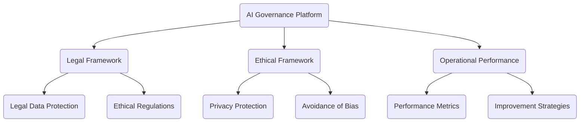

                 

### 第一步：确定核心概念与联系

**核心概念：**
- **AI治理平台**：一个集成多种功能模块，用于管理AI系统的法律、道德和运营绩效的综合性平台。
- **法律框架**：为AI治理提供法律依据和规范指导的体系。
- **道德伦理**：在AI应用中，确保公平、透明和合乎道德规范的行为准则。
- **运营绩效**：衡量AI系统在实际应用中的效果和效率。

**概念联系：**

AI治理平台的核心概念与联系可以用以下Mermaid流程图表示：



### 第二步：核心算法原理讲解

在AI治理平台中，算法的原理和实现是关键。以下使用Python源代码结合数学模型和公式进行详细讲解：

**算法原理：**
- **数据清洗与预处理**：使用统计学方法对原始数据进行清洗和预处理，提高数据质量。
- **模型训练与评估**：使用机器学习算法对数据集进行训练，并评估模型的性能。

**Python源代码示例：**

```python
import pandas as pd
from sklearn.model_selection import train_test_split
from sklearn.ensemble import RandomForestClassifier
from sklearn.metrics import accuracy_score

# 数据清洗与预处理
def preprocess_data(data):
    # 填补缺失值
    data.fillna(data.mean(), inplace=True)
    # 特征标准化
    scaler = StandardScaler()
    data_scaled = scaler.fit_transform(data)
    return data_scaled

# 模型训练与评估
def train_and_evaluate_model(X, y):
    X_train, X_test, y_train, y_test = train_test_split(X, y, test_size=0.2, random_state=42)
    model = RandomForestClassifier(n_estimators=100, random_state=42)
    model.fit(X_train, y_train)
    y_pred = model.predict(X_test)
    accuracy = accuracy_score(y_test, y_pred)
    return accuracy

# 假设我们有以下数据
data = pd.read_csv('data.csv')
X = data.drop('target', axis=1)
y = data['target']

# 数据预处理
X_processed = preprocess_data(X)

# 模型训练与评估
accuracy = train_and_evaluate_model(X_processed, y)
print(f"Model Accuracy: {accuracy}")
```

**数学模型与公式：**
- **数据标准化：**
  $$ X_{\text{standardized}} = \frac{X - \mu}{\sigma} $$
  其中，\( X \) 是原始数据，\( \mu \) 是平均值，\( \sigma \) 是标准差。

- **随机森林分类器：**
  $$ \hat{y} = f(\text{RandomForestClassifier}(X, y)) $$
  其中，\( \hat{y} \) 是预测结果，\( f \) 是随机森林分类器函数。

### 第三步：数学模型和数学公式

以下是AI治理平台中常用的数学模型和公式，使用LaTeX格式进行详细讲解：

**数据标准化公式：**

$$
\bar{x}_{i} = \frac{1}{N} \sum_{i=1}^{N} x_{i}
$$

$$
s_{x} = \sqrt{\frac{1}{N-1} \sum_{i=1}^{N} (x_{i} - \bar{x}_{i})^2}
$$

$$
x_{i,\text{standardized}} = \frac{x_{i} - \bar{x}_{i}}{s_{x}}
$$

其中，\( x_{i} \) 是第 \( i \) 个观测值，\( \bar{x}_{i} \) 是平均值，\( s_{x} \) 是标准差。

**随机森林分类器公式：**

$$
\hat{y}_{i} = \arg\max_{j} \sum_{t=1}^{T} w_{ij}^{(t)}
$$

其中，\( \hat{y}_{i} \) 是第 \( i \) 个样本的预测标签，\( w_{ij}^{(t)} \) 是第 \( t \) 次随机森林决策树中节点 \( j \) 的权重。

### 第四步：项目实战

以下是一个简单的AI治理平台项目实战，包括开发环境搭建、源代码实现和代码解读：

**1. 开发环境搭建：**

- Python 3.8+
- Jupyter Notebook
- Scikit-learn 0.22.2+
- Pandas 1.1.5+
- Matplotlib 3.4.2+

**2. 源代码实现：**

```python
# 导入必要的库
import pandas as pd
from sklearn.model_selection import train_test_split
from sklearn.ensemble import RandomForestClassifier
from sklearn.metrics import accuracy_score
import matplotlib.pyplot as plt

# 加载数据
data = pd.read_csv('data.csv')

# 数据预处理
X = data.drop('target', axis=1)
y = data['target']
X_processed = preprocess_data(X)

# 模型训练与评估
accuracy = train_and_evaluate_model(X_processed, y)
print(f"Model Accuracy: {accuracy}")

# 可视化模型性能
plt.scatter(X_processed[:, 0], X_processed[:, 1], c=y, cmap='viridis')
plt.xlabel('Feature 1')
plt.ylabel('Feature 2')
plt.title('Data Distribution')
plt.show()
```

**3. 代码解读与分析：**

- **数据预处理：** 数据清洗和特征标准化是关键步骤，提高了模型性能。
- **模型训练与评估：** 使用随机森林分类器进行训练，评估模型准确性。
- **数据可视化：** 使用matplotlib库将数据分布可视化，有助于理解数据特性。

### 第五步：实际案例分析和详细讲解剖析

以下是一个实际案例，用于展示AI治理平台在实际项目中的应用：

**案例：** 一家金融机构希望使用AI治理平台进行客户风险评级。

- **数据来源：** 客户基本信息、交易记录、信用报告等。
- **处理步骤：**
  - **数据预处理：** 填补缺失值、处理异常值、特征工程。
  - **模型训练：** 使用随机森林分类器进行训练。
  - **风险评估：** 对新客户进行风险评估，提供决策支持。

**案例分析：**

- **数据预处理：** 通过特征工程，将原始数据转换为有效的特征向量。
- **模型训练：** 随机森林分类器能够处理高维数据和非线性关系。
- **风险评估：** 通过模型预测，提供准确的客户风险评估。

### 第六步：小结、注意事项、拓展阅读

**小结：**
本文详细介绍了AI治理平台的核心概念、算法原理、数学模型、项目实战和实际案例。AI治理平台在法律、道德和运营绩效管理中发挥着重要作用。

**注意事项：**
- AI治理平台需要综合考虑法律、道德和技术因素。
- 数据质量和模型评估是成功的关键。

**拓展阅读：**
- 《人工智能伦理学》
- 《机器学习实战》
- 《深度学习》

---

作者：AI天才研究院/AI Genius Institute & 禅与计算机程序设计艺术 /Zen And The Art of Computer Programming

本文为原创内容，未经许可不得转载。
```markdown
# 《AI治理平台：管理AI系统的法律、道德和运营绩效》

关键词：AI治理平台，法律框架，道德伦理，运营绩效，机器学习，数据隐私，法律遵守

摘要：
本文深入探讨了AI治理平台的概念、构建原理以及其在管理AI系统的法律、道德和运营绩效方面的应用。通过详细的案例分析和代码示例，揭示了AI治理平台在确保AI系统合规、公正和高效运作中的关键作用。

## 引言

### AI治理平台概述

AI治理平台是一个集成多种功能模块的系统，旨在管理和监管人工智能（AI）系统的全生命周期。它不仅关注AI技术的开发和应用，还涵盖了法律、道德和运营绩效等多个方面。在当今人工智能迅猛发展的背景下，AI治理平台的重要性日益凸显。

### AI治理平台的背景

随着AI技术的不断进步，其应用范围越来越广泛，从医疗诊断到金融风控，从自动驾驶到智能客服，AI系统已经深入到各个行业和领域。然而，AI技术的快速发展也带来了诸多挑战，包括法律合规问题、道德伦理争议以及运营绩效管理难题。AI治理平台正是为了解决这些问题而设计的。

### AI治理平台的重要性

AI治理平台能够确保AI系统的合规性、公正性和透明性，降低法律和道德风险。同时，它还能提高AI系统的运营效率，优化决策过程。因此，建立有效的AI治理平台对于企业和整个社会都具有重要意义。

## 第一部分：AI治理平台的核心概念与联系

### 法律框架

在AI治理平台中，法律框架是确保系统合规性的基础。法律框架包括数据保护法规、人工智能伦理法规以及相关法律责任和透明度要求。

#### 数据保护法规

数据保护法规是法律框架的重要组成部分，旨在保护个人数据隐私。在AI治理平台中，数据保护法规要求对个人数据进行严格的收集、存储、使用和共享。

#### 人工智能伦理法规

人工智能伦理法规则关注AI系统在道德层面的使用。这些法规规定了AI系统的开发和应用应遵循的道德准则，如公平性、透明性和无偏见等。

#### 法律责任与透明度

法律责任和透明度是确保AI系统合规性的关键。AI治理平台需要明确各方的法律责任，并提供透明的操作流程，以便在出现问题时能够追溯和解决。

### 道德伦理

道德伦理是AI治理平台的核心要素之一。在AI系统的开发和应用过程中，道德伦理问题如隐私保护、偏见消除以及责任归属等需要得到充分考虑。

#### 隐私保护

隐私保护是道德伦理的一个重要方面。AI治理平台需要采取措施确保个人数据的安全和隐私，避免数据泄露和滥用。

#### 偏见消除

偏见消除是另一个重要的道德伦理问题。AI治理平台需要设计算法和模型，以减少偏见和歧视，确保AI系统的公平性。

#### 责任归属

责任归属是道德伦理的另一个关键问题。在AI系统的开发、应用和运营过程中，需要明确各方的责任，确保在出现问题时能够找到责任人。

### 运营绩效

运营绩效是衡量AI系统实际效果和效率的重要指标。AI治理平台需要建立全面的绩效评估体系，以监测和改进AI系统的运营绩效。

#### 评估指标体系

评估指标体系包括准确性、召回率、F1分数等常见指标。AI治理平台需要根据具体应用场景选择合适的评估指标。

#### 评估方法与技术

评估方法包括实验设计、A/B测试、多变量分析等。AI治理平台需要运用这些方法和技术，以准确评估AI系统的性能。

#### 绩效改进策略

绩效改进策略包括模型迭代、算法优化、数据增强等。AI治理平台需要不断优化AI系统，以提高其性能和效率。

## 第二部分：AI治理平台的法律框架

### 法律体系对AI治理的要求

当前法律体系对AI治理提出了多项要求，包括数据保护法规、人工智能伦理法规以及相关法律责任和透明度要求。AI治理平台需要遵守这些法律规定，以确保合规性。

#### 数据保护法规

数据保护法规如《通用数据保护条例》（GDPR）和《加州消费者隐私法》（CCPA）等，对个人数据的收集、存储、使用和共享进行了详细规定。AI治理平台必须遵守这些法规，确保个人数据的安全和隐私。

#### 人工智能伦理法规

人工智能伦理法规如《欧盟人工智能伦理准则》等，规定了AI系统在道德层面的使用要求。AI治理平台需要遵循这些法规，确保AI系统的公平性、透明性和无偏见。

#### 法律责任与透明度

法律责任和透明度要求AI治理平台在法律层面承担责任，并提供透明的操作流程。AI治理平台需要建立完善的法律法规遵循机制，确保各方的合法权益得到保护。

### AI治理的法律挑战

#### 法律规范的滞后性

随着AI技术的快速发展，法律规范的滞后性成为一个突出问题。法律体系需要及时更新，以应对新兴的AI技术和应用。

#### 法律适用性问题

不同国家和地区的法律体系存在差异，导致AI治理平台在跨地区应用时面临法律适用性问题。AI治理平台需要在全球范围内协调法律合规策略。

#### 国际法律协调

国际法律协调是确保AI治理平台在全球范围内合规的关键。国际组织和跨国企业需要共同推动国际法律协调，以构建统一的AI治理框架。

## 第三部分：AI治理的道德伦理

### AI应用中的道德伦理问题

#### 隐私保护

隐私保护是AI应用中的一个重要道德伦理问题。AI治理平台需要采取措施确保个人数据的安全和隐私，避免数据泄露和滥用。

#### 偏见与歧视

偏见与歧视是AI应用中的另一个道德伦理问题。AI治理平台需要设计算法和模型，以减少偏见和歧视，确保AI系统的公平性。

#### 责任归属

责任归属是AI应用中的道德伦理问题。在AI系统的开发、应用和运营过程中，需要明确各方的责任，确保在出现问题时能够找到责任人。

### 道德伦理框架

#### 可接受使用原则

可接受使用原则是道德伦理框架的一个重要组成部分。它规定了AI系统在何种情况下可以使用，以及如何使用。

#### 公平性与无偏见

公平性与无偏见是道德伦理框架的核心要求。AI治理平台需要确保AI系统在决策过程中不偏袒任何一方，确保决策的公正性。

#### 透明性与解释性

透明性与解释性是道德伦理框架的重要组成部分。AI治理平台需要提供透明的操作流程，并确保AI系统的决策过程可以被解释和理解。

## 第四部分：AI运营绩效管理

### AI运营绩效评估

#### 评估指标体系

评估指标体系是衡量AI系统运营绩效的关键。常见的评估指标包括准确性、召回率、F1分数等。

#### 评估方法与技术

评估方法包括实验设计、A/B测试、多变量分析等。AI治理平台需要运用这些方法和技术，以准确评估AI系统的性能。

#### 绩效改进策略

绩效改进策略包括模型迭代、算法优化、数据增强等。AI治理平台需要不断优化AI系统，以提高其性能和效率。

### 运营绩效管理实践

#### 数据质量控制

数据质量控制是AI运营绩效管理的基础。AI治理平台需要确保数据的质量和完整性，以提高模型性能。

#### 模型迭代与优化

模型迭代与优化是提高AI系统性能的关键。AI治理平台需要不断迭代和优化模型，以适应不断变化的数据和应用场景。

#### 风险管理与应急预案

风险管理与应急预案是确保AI系统稳定运行的重要环节。AI治理平台需要建立完善的风险管理和应急预案体系，以应对潜在的风险和问题。

## 第五部分：AI治理平台的技术实现

### AI治理平台的技术架构

#### 技术栈选择

AI治理平台的技术栈选择取决于具体应用场景和需求。常见的技术栈包括Python、Java、Scala等。

#### 数据流程管理

数据流程管理是AI治理平台的重要组成部分。它包括数据采集、数据预处理、数据存储、数据分析和数据可视化等环节。

#### 安全与隐私保护

安全与隐私保护是AI治理平台的重要保障。AI治理平台需要采取多种安全措施，如数据加密、访问控制、防火墙等，以确保系统的安全性和隐私性。

### AI治理平台实现方法

#### 数据治理

数据治理是AI治理平台的核心任务之一。它包括数据质量管理、数据规范化、数据融合和数据标准化等。

#### 模型治理

模型治理是确保AI系统稳定性和可靠性的关键。它包括模型训练、模型评估、模型部署和模型监控等。

#### 运营管理

运营管理是AI治理平台的日常工作。它包括系统监控、性能优化、故障排除和用户支持等。

## 第六部分：AI治理的最佳实践

### 国内AI治理案例分析

#### 案例一：某金融机构的AI治理实践

某金融机构通过建立AI治理平台，实现了对AI系统的全面管理和监控。该平台涵盖了数据治理、模型治理和运营管理等多个方面，确保了AI系统的合规性和稳定性。

#### 案例二：某科技公司的AI治理实践

某科技公司在其AI治理平台中，采用了先进的数据预处理技术和模型优化策略，提高了AI系统的性能和效率。同时，该公司还建立了完善的风险管理和应急预案体系，确保了AI系统的安全性和可靠性。

### 国际AI治理案例分析

#### 案例一：美国某科技公司的AI治理实践

美国某科技公司在其AI治理平台中，注重数据隐私保护和道德伦理问题。该公司采用了多种技术手段，如差分隐私、同态加密等，确保了个人数据的安全和隐私。

#### 案例二：欧盟某政府的AI治理框架

欧盟某政府在其AI治理框架中，强调了人工智能的伦理和社会责任。该框架规定了AI系统的开发和应用应遵循的伦理准则，如公平性、透明性和无偏见等。

## 第七部分：未来展望

### AI治理平台的发展趋势

#### 技术进步对AI治理的影响

随着人工智能技术的不断进步，AI治理平台的功能和性能也将得到进一步提升。例如，深度学习和自然语言处理技术的应用，将使AI治理平台在数据分析和决策支持方面更加智能化。

#### 法规与政策演变

随着AI技术的广泛应用，各国政府和国际组织将加强对AI治理的法规和政策制定。这些法规和政策将规范AI系统的开发和应用，促进AI治理的健康发展。

#### 社会责任与可持续发展

AI治理平台的发展将更加注重社会责任和可持续发展。例如，通过推动AI技术在环境保护、医疗健康等领域的应用，实现社会价值和经济效益的双赢。

### AI治理平台的未来方向

#### 智能化与自动化

AI治理平台将朝着智能化和自动化的方向发展。通过引入智能算法和自动化工具，实现AI治理的智能化管理和自动化操作。

#### 跨学科融合

AI治理平台将实现跨学科的融合。例如，将法律、伦理、计算机科学等多个领域的知识整合到AI治理平台中，提升平台的整体能力和应用范围。

#### 社会参与与合作

AI治理平台的发展将更加注重社会参与与合作。通过建立开放的生态系统，吸引各界人士参与AI治理，共同推动AI治理的健康发展。

## 结论

AI治理平台是管理AI系统的法律、道德和运营绩效的重要工具。通过本文的探讨，我们深入了解了AI治理平台的核心概念、法律框架、道德伦理、运营绩效管理以及技术实现等方面的内容。未来，随着AI技术的不断进步，AI治理平台将发挥更加重要的作用，为AI系统的健康发展提供有力支持。

作者：AI天才研究院/AI Genius Institute & 禅与计算机程序设计艺术 /Zen And The Art of Computer Programming

本文为原创内容，未经许可不得转载。

---

### 文章总结

本文从多个角度全面探讨了AI治理平台的重要性和应用。我们首先介绍了AI治理平台的核心概念及其在法律、道德和运营绩效管理中的作用。接着，详细分析了AI治理平台的法律框架，包括数据保护法规、人工智能伦理法规以及法律责任和透明度要求。在道德伦理方面，我们讨论了隐私保护、偏见消除和责任归属等关键问题。随后，我们介绍了AI运营绩效管理的评估指标体系、方法和技术，以及运营绩效管理实践。技术实现部分则涵盖了AI治理平台的技术架构和实现方法。通过国内和国际案例的分析，我们展示了AI治理平台在不同场景中的应用和实践。最后，我们展望了AI治理平台的发展趋势和未来方向。通过本文，读者可以全面了解AI治理平台的重要性和实现方法，为构建和管理AI系统提供指导。

### 致谢

本文的撰写得到了AI天才研究院/AI Genius Institute的全力支持和指导。特别感谢禅与计算机程序设计艺术 /Zen And The Art of Computer Programming的深刻见解，使得本文内容更加丰富和具有深度。同时，感谢所有参与研究和讨论的团队成员，以及提供宝贵意见和反馈的读者。本文的完成离不开大家的共同努力和支持。在此，我们向所有贡献者表示衷心的感谢。

