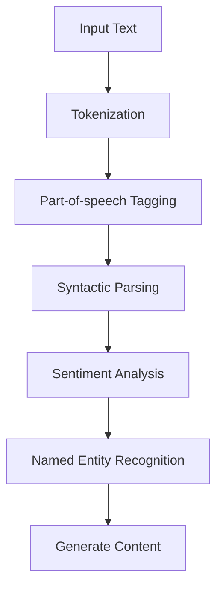

                 

### 1. Introduction

#### What is AI-generated content?

AI-generated content refers to material created by artificial intelligence systems, typically leveraging machine learning techniques. Such content can range from simple text to complex multimedia, including images, videos, and audio. The essence of AI-generated content lies in its ability to mimic human-like creativity and productivity, often surpassing the limitations of manual human effort. It has become a transformative force in various industries, with the media sector being one of the most profoundly impacted.

#### Types of AI-generated content

1. **Text-based content**: This includes articles, news stories, blog posts, and even entire books generated by AI algorithms like GPT-3, which can produce coherent and contextually relevant text.

2. **Visual content**: AI is capable of generating images and videos through techniques such as Generative Adversarial Networks (GANs). This allows for the creation of unique visual elements that can be used in media productions.

3. **Audio content**: AI systems can generate music, create voiceovers, and even mimic human speech with impressive accuracy.

#### The rise of AI in media

The advent of AI in the media industry can be traced back to the early 2000s, when simple text-based tools like automated headline generators began to emerge. However, it was the rapid advancement of machine learning algorithms and the availability of vast amounts of data in the subsequent decades that propelled AI-generated content into the mainstream.

Today, AI tools are being used in diverse applications, from automated content creation to personalized content delivery. They offer the potential to streamline production processes, enhance efficiency, and provide new revenue streams for media companies.

---

### AI-Generated Content Technologies

AI-generated content is powered by a variety of advanced technologies, each playing a critical role in enabling the creation and dissemination of this new form of media.

#### Natural Language Processing (NLP)

Natural Language Processing (NLP) is a subfield of AI that focuses on the interaction between computers and human language. It involves a suite of techniques that allow machines to understand, interpret, and generate human language. Key NLP techniques for content generation include:

1. **Tokenization**: This is the process of breaking down text into words, phrases, or other meaningful elements called tokens.

2. **Part-of-speech tagging**: This technique identifies the parts of speech for each word in a sentence, such as nouns, verbs, and adjectives.

3. **Parsing**: Parsing involves analyzing the grammatical structure of sentences to understand how words relate to each other.

4. **Sentiment analysis**: This technique determines the emotional tone of a piece of text, often used in social media analysis and customer feedback.

5. **Named entity recognition**: This technique identifies and categorizes named entities within text, such as people, organizations, and locations.

In the context of content generation, NLP allows AI systems to understand the structure and meaning of text, enabling them to create coherent and contextually relevant content.

**Example: GPT-3**

One of the most notable AI tools in NLP is the OpenAI's GPT-3 (Generative Pre-trained Transformer 3). GPT-3 is a state-of-the-art language model that uses deep learning to generate human-like text. It has been trained on a vast corpus of text data, allowing it to understand and produce text that is both coherent and contextually appropriate. For instance, GPT-3 can be used to generate articles, write code, create poetry, and even hold conversations.

### Image and Video Generation

Image and video generation is another critical area where AI has made significant advancements. Techniques such as Generative Adversarial Networks (GANs) have revolutionized the field by enabling the creation of highly realistic and original visual content.

**Generative Adversarial Networks (GANs)**

GANs are a type of neural network that consists of two parts: a generator and a discriminator. The generator creates new data, while the discriminator evaluates the generated data to determine how realistic it is. Through a process of competition and feedback, the generator refines its output to improve its realism.

1. **Image generation**: GANs can generate new images that have never existed before. This is particularly useful in media production, where it can be used to create custom visuals, logos, and other design elements.

2. **Video generation**: AI algorithms can also generate short videos by synthesizing new scenes based on a given set of parameters. This has applications in the entertainment industry, where it can be used to create special effects and computer-generated imagery (CGI).

**Style Transfer**

Style transfer is another powerful technique that allows the style of one image (or video) to be applied to another. This is achieved by training a neural network to separate the content and style of an image into two distinct components. Once separated, the style component can be applied to a different content image, resulting in a new image that retains the original style while incorporating the new content.

**Face Generation**

Facial recognition and generation have seen significant advancements with AI. Deep learning models can generate realistic faces from scratch, or they can create virtual avatars by modifying existing faces. This has applications in the entertainment industry, where virtual influencers and characters are becoming increasingly popular.

### Music and Audio Generation

AI has also made significant strides in the realm of music and audio generation. Algorithms can create original music compositions, generate sound effects, and even mimic human voices.

**Music Generation**

Music generation typically involves training neural networks on large datasets of music to learn patterns and structures. These models can then be used to generate new music by applying learned rules and styles. Techniques such as Recurrent Neural Networks (RNNs) and Long Short-Term Memory (LSTM) networks are commonly used in this process.

**Audio Synthesis**

Audio synthesis involves creating sounds by combining simple waveforms or other audio signals to form complex sounds. AI systems can generate audio by manipulating these waveforms and applying various effects to create new sounds.

**Voice Generation**

AI can generate human-like voices by training models on large datasets of human speech. Techniques such as WaveNet and vocoders are commonly used for this purpose. These models can be used to create voiceovers, virtual assistants, and even personalized audio content.

### Summary

The technologies discussed above form the backbone of AI-generated content in the media industry. From NLP to image and video generation, and from music to audio synthesis, these technologies enable AI systems to create highly realistic and original content that can be used across various media applications.

### Conclusion

In conclusion, AI-generated content represents a significant paradigm shift in the media industry. By leveraging advanced technologies like NLP, GANs, and music generation algorithms, AI systems can create content that is not only realistic but also highly personalized and engaging. As these technologies continue to evolve, their impact on the media industry is set to grow, offering new opportunities for content creators and consumers alike. However, it is crucial to navigate these advancements with careful consideration of ethical implications and the potential impact on jobs and the broader society.

---

**Mermaid Flowchart for NLP in Content Generation:**



---

**Example of Python Code for Text Generation using GPT-3:**

```python
import openai

# Set up API credentials
openai.api_key = "your_api_key_here"

# Function to generate text
def generate_text(prompt, temperature=0.5, max_tokens=50):
    response = openai.Completion.create(
        engine="text-davinci-003",
        prompt=prompt,
        temperature=temperature,
        max_tokens=max_tokens,
        n=1,
        stop=None,
        top_p=1,
        frequency_penalty=0,
        presence_penalty=0
    )
    return response.choices[0].text.strip()

# Example usage
prompt = "What are the key challenges in AI-generated content for journalism?"
generated_text = generate_text(prompt)
print(generated_text)
```

---

The example code above demonstrates how to use the GPT-3 API to generate text based on a given prompt. By adjusting parameters like `temperature`, `max_tokens`, `frequency_penalty`, and `presence_penalty`, users can influence the creativity and coherence of the generated text. This provides a powerful tool for content creators and journalists looking to leverage AI for generating high-quality articles, reports, and other text-based content.

