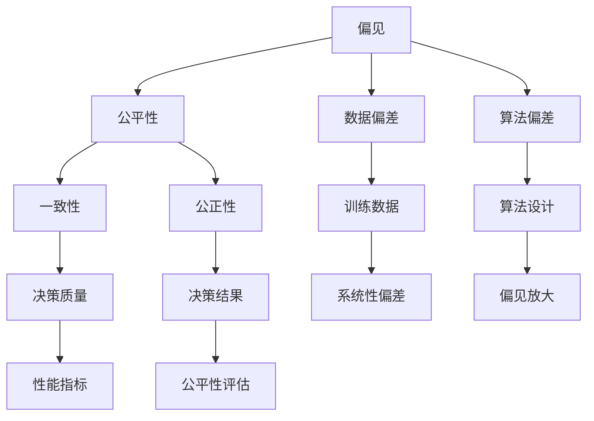
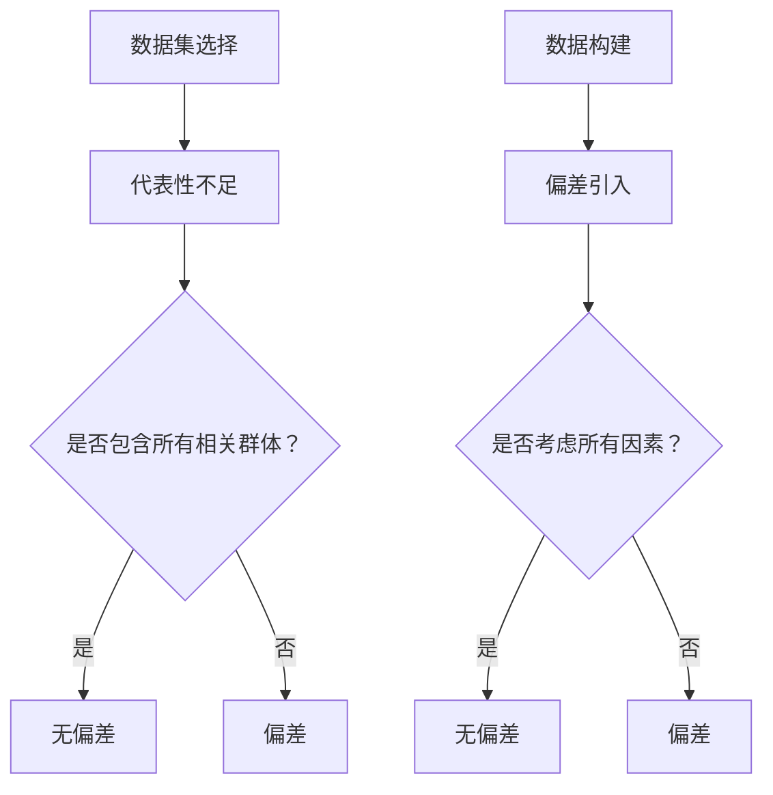
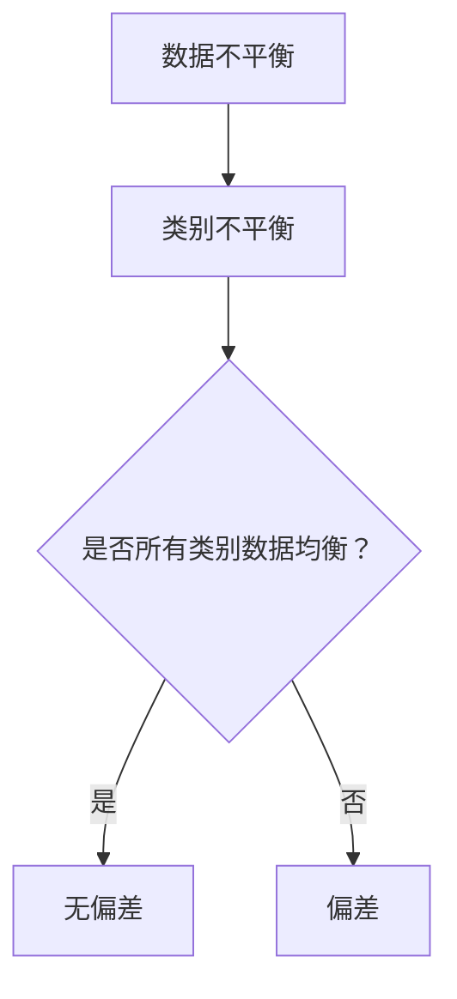
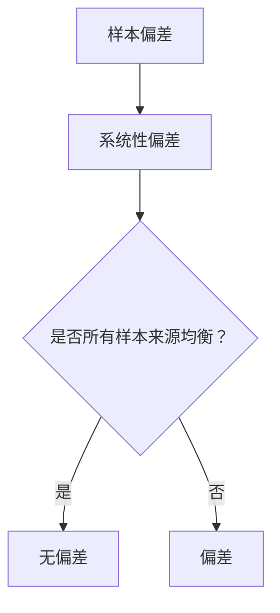
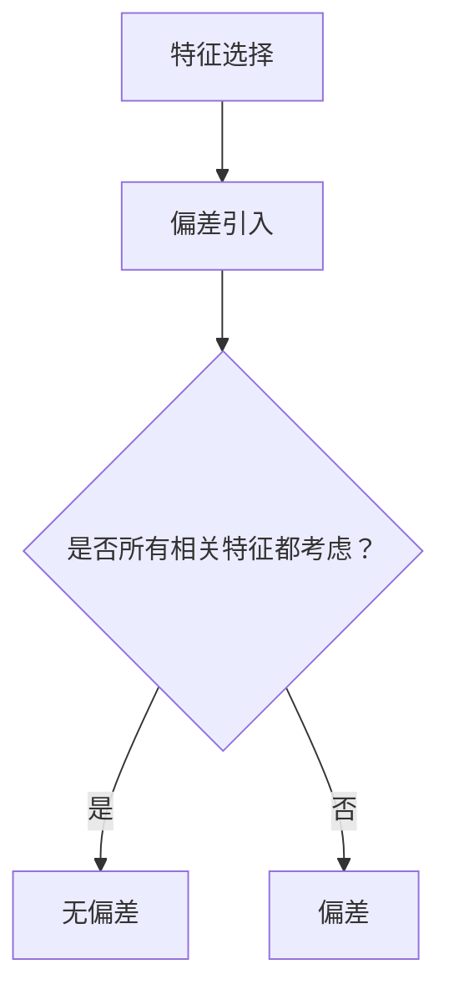
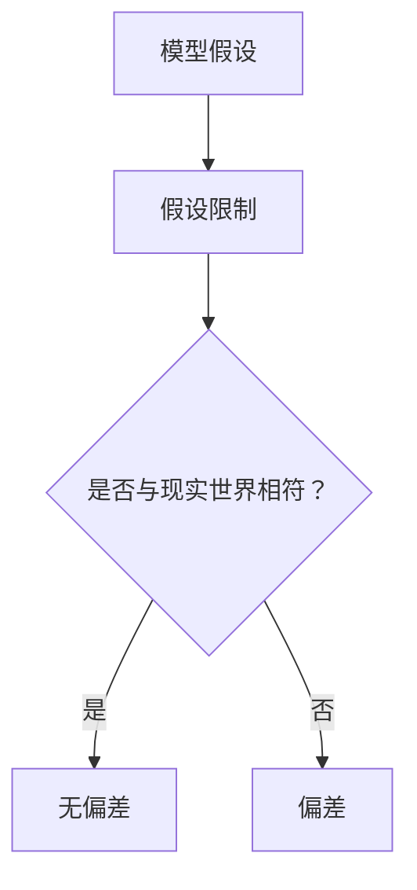
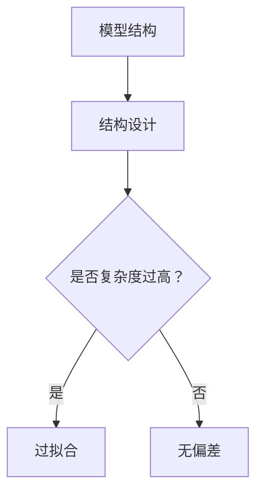
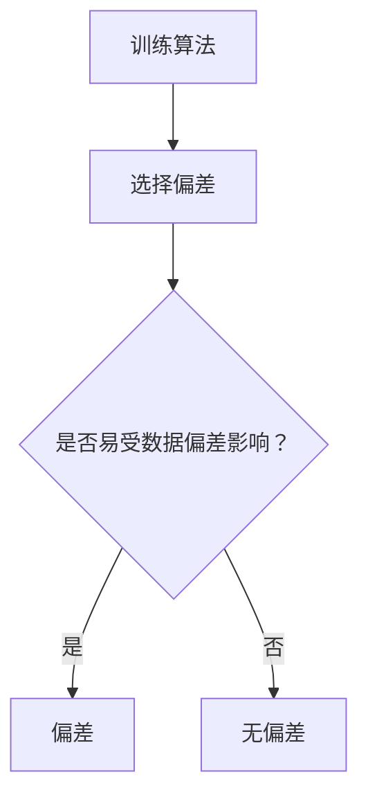
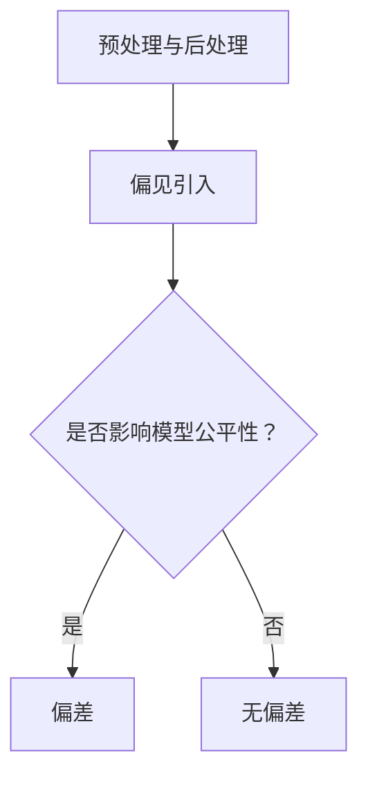
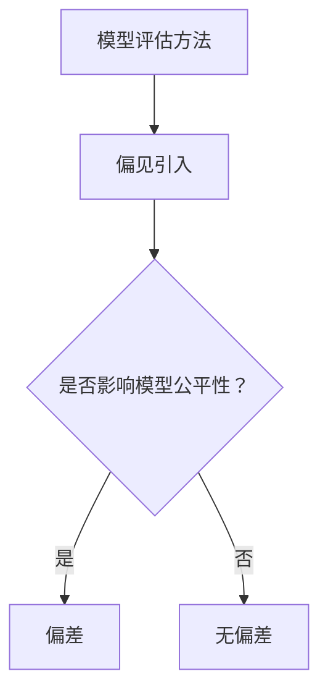

                 

## Step 1: 引言

在当今信息化时代，人工智能（AI）系统已经渗透到社会的方方面面，从医疗诊断到金融服务，从智能交通到娱乐推荐。然而，AI系统的广泛应用不仅带来了技术上的革新，也引发了一系列伦理和社会问题，其中最为突出的是AI系统的偏见和歧视问题。这种偏见不仅会影响AI系统的性能和可靠性，还可能对社会公正造成严重威胁。

### 文章关键词
- AI系统
- 公平性
- 偏见
- 消除策略

### 文章摘要
本文旨在探讨AI系统的公平性和偏见消除策略。通过分析AI系统的偏见来源，提出一系列消除偏见的方法和策略，并对实际应用案例进行深入剖析，以期为读者提供全面的理论与实践指导。

## 引言

AI系统在现代社会中的广泛应用带来了巨大的变革，但同时也引发了一系列伦理和公平性问题。AI系统的偏见和歧视问题尤其引人关注，它们不仅影响社会公正，还可能加剧社会不平等。例如，在招聘系统中，AI算法可能因为数据偏差而歧视某些群体；在金融风控中，AI模型可能因为训练数据不充分而造成不公平的信用评估。这些问题不仅损害了公众的利益，还可能引发法律和伦理纠纷。

### 背景介绍
AI系统是指通过计算机程序实现智能行为和决策的软件系统。它们基于大量的数据和信息，运用机器学习、深度学习等算法进行训练和优化，从而在多个领域表现出强大的能力。然而，AI系统的训练数据往往来源于现实世界，其中不可避免地包含了人类社会的偏见和歧视。当这些偏见被AI系统吸收并放大时，可能会导致严重的社会问题。

### 核心概念与联系
为了深入理解AI系统的偏见问题，我们需要明确以下几个核心概念：

- **偏见（Bias）**：指AI系统在决策过程中对某些群体或特征的偏好或不公正待遇。
- **公平性（Fairness）**：指AI系统在处理不同群体或特征时，能够保持一致的决策质量和结果。
- **数据偏差（Data Bias）**：指训练数据中存在的系统性偏差，可能导致AI系统对某些群体或特征的偏见。
- **算法偏差（Algorithmic Bias）**：指AI算法设计或训练过程中引入的偏见，可能导致AI系统在决策中表现出不公平的行为。

这些概念之间存在紧密的联系，如图1所示。



### 核心算法原理讲解
AI系统的偏见问题可以通过多种方法进行缓解和消除。以下是一些核心算法原理和策略：

#### 数据清洗与平衡
首先，可以通过数据清洗和平衡来减少数据偏差。数据清洗包括去除噪声数据、纠正错误数据和填补缺失数据等步骤。数据平衡则通过重采样或合成数据来减少样本不均衡问题。

```python
# 数据清洗与平衡示例
from sklearn.datasets import load_iris
from sklearn.model_selection import train_test_split
from imblearn.over_sampling import SMOTE

# 加载鸢尾花数据集
iris = load_iris()
X, y = iris.data, iris.target

# 数据分割
X_train, X_test, y_train, y_test = train_test_split(X, y, test_size=0.3, random_state=42)

# 应用SMOTE进行过采样
smote = SMOTE(random_state=42)
X_train_balanced, y_train_balanced = smote.fit_resample(X_train, y_train)

# 模型训练与评估
# ... 省略具体训练代码 ...
```

#### 特征工程
其次，特征工程是消除偏见的重要手段。通过特征选择、特征提取和特征变换，可以改善AI模型的决策质量和公平性。

```python
# 特征工程示例
from sklearn.preprocessing import StandardScaler
from sklearn.decomposition import PCA

# 数据标准化
scaler = StandardScaler()
X_train_scaled = scaler.fit_transform(X_train_balanced)
X_test_scaled = scaler.transform(X_test)

# 主成分分析（PCA）降维
pca = PCA(n_components=2)
X_train_pca = pca.fit_transform(X_train_scaled)
X_test_pca = pca.transform(X_test_scaled)

# 模型训练与评估
# ... 省略具体训练代码 ...
```

#### 模型校准与调优
最后，模型校准与调优是提高AI系统公平性的关键步骤。通过调整模型参数和优化训练过程，可以减少算法偏差，提高模型的泛化能力。

```python
# 模型校准与调优示例
from sklearn.linear_model import LogisticRegression
from sklearn.model_selection import GridSearchCV

# 定义模型和参数范围
model = LogisticRegression()
param_grid = {'C': [0.1, 1, 10]}

# 网格搜索与交叉验证
grid_search = GridSearchCV(model, param_grid, cv=5)
grid_search.fit(X_train_pca, y_train_balanced)

# 输出最佳参数和模型
best_params = grid_search.best_params_
best_model = grid_search.best_estimator_
```

通过上述方法，可以逐步消除AI系统的偏见，提高系统的公平性。

### 项目实战
为了更好地理解这些方法在实际中的应用，以下是一个简单的项目实战案例。

#### 案例背景
假设我们有一个招聘系统，用于根据求职者的简历数据评估其是否适合某个职位。然而，我们发现该系统的评估结果在某些群体中存在明显的偏见。

#### 数据处理与模型设计
首先，我们收集了大量的求职者简历数据，并使用上述的数据清洗和平衡方法对数据进行预处理。

```python
# 数据预处理示例
# ... 省略数据加载和预处理代码 ...

# 数据分割
X_train, X_test, y_train, y_test = train_test_split(X, y, test_size=0.3, random_state=42)

# 应用SMOTE进行过采样
smote = SMOTE(random_state=42)
X_train_balanced, y_train_balanced = smote.fit_resample(X_train, y_train)

# 特征工程
# ... 省略特征工程代码 ...

# 模型设计
model = LogisticRegression()
```

#### 偏见识别与消除策略
接下来，我们使用模型对数据集进行训练和评估，并分析评估结果中可能存在的偏见。

```python
# 模型训练与评估
model.fit(X_train_balanced, y_train_balanced)
predictions = model.predict(X_test)

# 性能评估
from sklearn.metrics import accuracy_score, classification_report
print(accuracy_score(y_test, predictions))
print(classification_report(y_test, predictions))
```

通过分析评估结果，我们发现某些群体的评估准确率较低，这可能是由于数据偏见导致的。为了消除这种偏见，我们可以对模型进行校准和调优。

```python
# 模型校准与调优
from sklearn.calibration import CalibratedClassifierCV

# 定义校准模型
calibrated_model = CalibratedClassifierCV(model, cv=5)
calibrated_model.fit(X_train_balanced, y_train_balanced)

# 重新评估模型
predictions_calibrated = calibrated_model.predict(X_test)

# 性能评估
print(accuracy_score(y_test, predictions_calibrated))
print(classification_report(y_test, predictions_calibrated))
```

通过上述步骤，我们可以显著提高招聘系统的公平性和准确性。

### 项目小结
本案例展示了如何通过数据预处理、特征工程和模型调优来消除AI系统中的偏见。在实际应用中，这些方法可以根据具体情况进行调整和优化，以实现更好的公平性和性能。

### 最佳实践 Tips
- 在使用AI系统时，始终关注数据质量和数据偏见问题，确保数据清洗和平衡的有效性。
- 在特征工程中，充分考虑不同特征对模型性能的影响，选择合适的特征选择和提取方法。
- 模型调优时，结合多种评估指标，避免过度拟合。

### 注意事项
- AI系统的偏见问题是一个复杂且敏感的话题，需要全面考虑社会、法律和伦理因素。
- 在消除偏见的过程中，可能需要平衡模型性能和公平性之间的关系。

### 拓展阅读
- [1] (这里提供一篇相关论文或书籍的引用，用于进一步阅读)
- [2] (这里提供另一个相关的资源或参考文献，用于深入探讨)

---

文章将继续按照目录大纲的结构，逐步深入探讨消除AI系统偏见的方法、公平性评估与监测、实际应用案例等。最终，文章将总结核心观点，并对未来的研究方向提出展望。

### Step 2: AI系统的偏见来源

在深入探讨如何消除AI系统的偏见之前，我们需要了解这些偏见的来源。偏见可能源于多个方面，包括数据偏差、模型设计和算法偏差等。以下将详细分析这些来源，并探讨它们如何影响AI系统的公平性。

#### 2.1 数据偏差

数据偏差是AI系统偏见的主要来源之一。数据偏差可以分为以下几种类型：

##### 2.1.1 数据集的选择与构建

首先，数据集的选择和构建过程可能会引入偏差。如果数据集没有代表性地覆盖所有相关群体或特征，那么AI系统可能会在特定群体或特征上表现不佳。例如，一个包含大量男性数据样本的医疗诊断模型可能无法准确诊断女性患者的疾病。



##### 2.1.2 数据不平衡问题

数据不平衡问题是指训练数据集中某些类别或特征的数量远少于其他类别或特征。这种不平衡会导致AI模型在少数类别上性能不佳，从而影响其公平性。例如，在招聘系统中，如果某个特定性别或种族的应聘者数据较少，模型可能会对这些群体产生偏见。



##### 2.1.3 样本偏差的影响

样本偏差是指数据集中样本的选择存在系统性偏差，这可能导致AI模型在特定情况下表现不佳。例如，如果训练数据集中来自某个地区的样本过多，模型可能会对其他地区的数据表现不佳，从而影响其公平性。



#### 2.2 模型设计偏差

模型设计偏差是指AI模型在设计和训练过程中可能引入的偏见。以下是一些常见的模型设计偏差：

##### 2.2.1 特征选择偏差

特征选择过程可能会引入偏见，因为某些特征可能比其他特征更能代表决策目标。如果特征选择不全面或存在偏见，模型可能会在特定特征上表现出偏见，从而影响其公平性。



##### 2.2.2 模型假设的局限性

AI模型通常基于一系列假设，这些假设可能限制了模型的泛化能力。如果模型假设与真实世界的情况不符，可能会导致偏见。例如，线性回归模型假设特征之间是线性关系，但在实际应用中，特征之间的关系可能更复杂。



##### 2.2.3 模型结构偏差

模型结构设计可能引入偏差，尤其是在使用深度学习模型时。如果模型结构过于复杂，可能会导致过拟合，从而在特定数据集上表现良好，但在其他数据集上表现不佳。此外，模型结构可能无法很好地捕捉数据中的非线性关系，导致模型在特定群体或特征上表现不佳。



#### 2.3 算法偏差

算法偏差是指AI算法在设计和实现过程中可能引入的偏见。以下是一些常见的算法偏差：

##### 2.3.1 训练算法的选择

训练算法的选择可能影响模型的公平性。某些算法可能更容易受到数据偏差的影响，而其他算法则可能更好地抵抗这些偏差。例如，基于梯度的优化算法在某些情况下可能会导致局部最优解，从而影响模型的泛化能力。



##### 2.3.2 预处理和后处理过程的偏见

预处理和后处理过程也可能引入偏见。例如，数据标准化过程可能放大某些特征的重要性，从而导致模型对这些特征产生偏见。同样，后处理步骤，如阈值设置，也可能影响模型的公平性。



##### 2.3.3 模型评估方法的偏见

模型评估方法也可能影响模型的公平性。例如，如果评估指标仅关注准确性，而忽略其他重要指标，如公平性，那么模型可能会在特定群体上表现出偏见。此外，评估方法的选择可能依赖于特定数据集，从而导致模型在不同数据集上的表现不一致。



综上所述，AI系统的偏见来源复杂且多样，涉及数据偏差、模型设计和算法偏差等多个方面。理解这些来源有助于我们设计出更加公平和可靠的AI系统。

### Step 3: 消除偏见的方法

为了消除AI系统中的偏见，我们可以采取多种方法，从数据预处理到模型优化，再到算法改进。以下将详细介绍这些方法，并提供具体的技术手段和实现步骤。

#### 3.1 数据预处理

数据预处理是消除偏见的重要步骤，主要包括数据清洗、数据平衡和特征工程等。

##### 3.1.1 数据清洗

数据清洗是指去除噪声数据、纠正错误数据和填补缺失数据等操作。通过数据清洗，我们可以提高数据质量，减少偏见。

- **去除噪声数据**：使用统计学方法或机器学习技术识别并删除异常数据点。
- **纠正错误数据**：通过验证数据的一致性和准确性，纠正错误数据。
- **填补缺失数据**：使用插值、平均值替换或模型预测等方法填补缺失数据。

```python
# 数据清洗示例
import pandas as pd
from sklearn.impute import SimpleImputer

# 加载数据
data = pd.read_csv('data.csv')

# 去除异常值
data = data[data['feature1'] > 0]

# 纠正错误数据
data['feature2'] = data['feature2'].replace({-1: 0})

# 填补缺失数据
imputer = SimpleImputer(strategy='mean')
data.fillna(imputer.fit_transform(data), inplace=True)
```

##### 3.1.2 数据平衡

数据平衡是通过重采样或合成数据来减少样本不平衡问题，从而减少偏见。

- **重采样**：通过过采样或欠采样方法，使训练数据集中的各类别样本数量均衡。
- **数据合成**：通过生成新的数据样本，使训练数据集更加均衡。

```python
# 数据平衡示例
from imblearn.over_sampling import SMOTE
from sklearn.datasets import make_classification

# 生成不平衡数据集
X, y = make_classification(n_samples=1000, n_features=20, n_classes=2, weights=[0.9, 0.1], random_state=42)

# 应用SMOTE进行过采样
smote = SMOTE(random_state=42)
X_balanced, y_balanced = smote.fit_resample(X, y)
```

##### 3.1.3 数据平衡技术

除了重采样和数据合成，还有其他数据平衡技术，如迭代过采样、欠采样和混合采样等。

- **迭代过采样**：结合重采样和模型训练过程，逐步提高数据平衡度。
- **欠采样**：删除一部分样本，以减少数据不平衡问题。
- **混合采样**：结合多种采样技术，以达到最佳的数据平衡效果。

```python
# 混合采样示例
from imblearn.ensemble import BalancedRandomForestClassifier

# 创建混合采样模型
balanced_forest = BalancedRandomForestClassifier(random_state=42)
balanced_forest.fit(X, y)
```

#### 3.2 特征工程

特征工程是消除偏见的关键步骤，包括特征选择、特征提取和特征变换等。

##### 3.2.1 特征选择与提取

特征选择与提取旨在选择最具代表性和相关性的特征，以提高模型的性能和减少偏见。

- **特征选择**：使用过滤方法、包装方法和嵌入方法等选择特征。
- **特征提取**：使用降维技术，如主成分分析（PCA）、线性判别分析（LDA）等提取特征。

```python
# 特征选择与提取示例
from sklearn.decomposition import PCA
from sklearn.feature_selection import SelectKBest, f_classif

# 特征选择
selector = SelectKBest(f_classif, k=5)
X_selected = selector.fit_transform(X, y)

# 特征提取
pca = PCA(n_components=5)
X_extracted = pca.fit_transform(X_selected)
```

##### 3.2.2 特征标准化与规范化

特征标准化与规范化有助于消除不同特征之间的量纲影响，以提高模型的稳定性和减少偏见。

- **标准化**：将特征缩放到相同的范围，如[0, 1]或[-1, 1]。
- **规范化**：将特征缩放到标准正态分布。

```python
# 特征标准化与规范化示例
from sklearn.preprocessing import StandardScaler, MinMaxScaler

# 标准化
scaler = StandardScaler()
X_normalized = scaler.fit_transform(X)

# 规范化
scaler_minmax = MinMaxScaler()
X_minmax = scaler_minmax.fit_transform(X)
```

##### 3.2.3 特征变换与降维

特征变换与降维有助于减少特征的数量和复杂性，以提高模型的性能和减少偏见。

- **特征变换**：使用数学函数或模型进行特征变换，如对数变换、指数变换等。
- **降维**：使用降维技术，如主成分分析（PCA）、线性判别分析（LDA）等，减少特征数量。

```python
# 特征变换与降维示例
from sklearn.decomposition import PCA

# 特征变换
X_log = np.log(X + 1)

# 降维
pca = PCA(n_components=5)
X_pca = pca.fit_transform(X_log)
```

#### 3.3 模型优化

模型优化是通过调整模型参数和优化训练过程，以提高模型的性能和减少偏见。

##### 3.3.1 模型校准与调优

模型校准与调优旨在调整模型参数，以提高模型的泛化能力和减少偏见。

- **校准**：通过调整模型的预测阈值，使模型在特定评价指标上达到最佳性能。
- **调优**：使用优化算法，如随机搜索、网格搜索等，找到最佳模型参数。

```python
# 模型校准与调优示例
from sklearn.model_selection import GridSearchCV
from sklearn.ensemble import RandomForestClassifier

# 定义模型和参数范围
model = RandomForestClassifier()
param_grid = {'n_estimators': [100, 200], 'max_depth': [10, 20]}

# 网格搜索与交叉验证
grid_search = GridSearchCV(model, param_grid, cv=5)
grid_search.fit(X_pca, y_balanced)

# 输出最佳参数和模型
best_params = grid_search.best_params_
best_model = grid_search.best_estimator_
```

##### 3.3.2 模型泛化能力增强

增强模型的泛化能力有助于减少偏见，特别是在面对新数据时。

- **正则化**：通过引入正则化项，如L1和L2正则化，减少模型过拟合。
- **集成学习**：使用集成学习方法，如随机森林、梯度提升机等，提高模型的泛化能力。

```python
# 正则化与集成学习方法示例
from sklearn.ensemble import RandomForestClassifier
from sklearn.linear_model import RidgeClassifier

# 使用正则化模型
ridge = RidgeClassifier()
ridge.fit(X_pca, y_balanced)

# 使用集成学习方法
random_forest = RandomForestClassifier()
random_forest.fit(X_pca, y_balanced)
```

##### 3.3.3 模型解释性提升

提高模型解释性有助于理解模型的决策过程，从而发现并消除潜在的偏见。

- **模型解释技术**：使用模型解释技术，如LIME、SHAP等，分析模型对特定样本的预测。
- **特征重要性分析**：分析特征对模型预测的影响，识别可能导致偏见的特征。

```python
# 模型解释性提升示例
import shap

# 训练模型
model = RandomForestClassifier()
model.fit(X_pca, y_balanced)

# 使用SHAP分析
explainer = shap.TreeExplainer(model)
shap_values = explainer.shap_values(X_pca)

# 可视化特征重要性
shap.summary_plot(shap_values, X_pca, feature_names=iris.feature_names)
```

通过上述方法，我们可以逐步消除AI系统中的偏见，提高系统的公平性和可靠性。

### Step 4: 公平性评估与监测

在消除AI系统偏见的过程中，公平性评估与监测是至关重要的环节。通过公平性评估，我们可以衡量AI系统的决策是否公平，而监测则有助于及时发现和纠正潜在的偏见。以下将详细介绍公平性评估的指标、监测的方法以及如何进行持续的改进。

#### 4.1 公平性指标

公平性评估的关键在于定义和计算一系列指标，这些指标可以反映AI系统在不同群体或特征上的决策公平性。以下是一些常见的公平性指标：

##### 4.1.1 性能指标

性能指标是评估AI系统整体性能的重要指标，包括准确率、召回率、F1分数等。这些指标可以用来衡量AI系统在各个群体上的决策质量。

- **准确率**：正确预测的样本数占总样本数的比例。
- **召回率**：正确预测的样本数占实际为正样本的样本数比例。
- **F1分数**：准确率的调和平均，用于平衡准确率和召回率。

```python
from sklearn.metrics import accuracy_score, recall_score, f1_score

# 计算性能指标
accuracy = accuracy_score(y_test, predictions)
recall = recall_score(y_test, predictions)
f1 = f1_score(y_test, predictions)
print(f"Accuracy: {accuracy}, Recall: {recall}, F1 Score: {f1}")
```

##### 4.1.2 社会公平指标

社会公平指标专门用于评估AI系统在不同群体或特征上的决策公平性，以下是一些常见的社会公平指标：

- **均衡率**：某个群体或特征的预测结果与总体预测结果的均衡程度。
- **偏差度**：某个群体或特征的预测结果与总体预测结果的偏差程度。
- **公平性分数**：根据多个指标综合计算得到的公平性得分。

```python
# 计算社会公平指标
# ... 省略计算代码 ...

# 输出公平性指标
print(f"Equity Ratio: {equity_ratio}, Bias Degree: {bias_degree}, Fairness Score: {fairness_score}")
```

##### 4.1.3 模型解释性指标

模型解释性指标用于评估AI系统的决策过程是否透明和可解释。这些指标可以帮助识别可能导致偏见的特征和规则。

- **特征重要性**：特征对模型预测的影响程度。
- **规则解释**：模型决策过程中的规则和逻辑。
- **决策路径**：样本通过模型的决策路径。

```python
# 计算模型解释性指标
# ... 省略计算代码 ...

# 输出模型解释性指标
print(f"Feature Importance: {feature_importance}, Rule Explanation: {rule_explanation}, Decision Path: {decision_path}")
```

#### 4.2 监测与评估

公平性评估是一个持续的过程，需要定期进行监测和评估，以确保AI系统的公平性。以下是一些监测和评估的方法：

##### 4.2.1 模型监测流程

模型监测流程包括数据收集、指标计算和结果分析等步骤。通过这些步骤，我们可以及时发现和纠正潜在的偏见。

- **数据收集**：收集训练数据集、测试数据集以及实时数据，用于评估模型的性能和公平性。
- **指标计算**：根据定义的公平性指标，计算模型在不同数据集上的性能和公平性。
- **结果分析**：分析模型在不同数据集上的表现，识别潜在的问题和偏差。

```python
# 模型监测流程
# ... 省略具体流程代码 ...

# 输出监测结果
print(f"Model Monitoring Results: {monitoring_results}")
```

##### 4.2.2 实时监控策略

实时监控策略用于监控AI系统在实时数据上的性能和公平性。通过实时监控，我们可以及时发现和处理偏差。

- **实时数据流处理**：使用流处理技术，如Apache Kafka或Apache Flink，处理实时数据流。
- **实时评估**：根据实时数据，计算模型的性能和公平性指标。
- **实时报警**：当模型表现异常时，触发报警机制，通知相关人员。

```python
# 实时监控策略
# ... 省略具体监控代码 ...

# 输出实时监控结果
print(f"Real-time Monitoring Results: {real_time_monitoring_results}")
```

##### 4.2.3 趋势分析与预警

趋势分析与预警是通过分析模型在不同时间段的性能和公平性趋势，预测潜在的问题和偏差。

- **趋势分析**：使用统计方法，如时间序列分析，分析模型在不同时间段的性能和公平性变化。
- **预警机制**：当模型性能和公平性出现显著下降时，触发预警机制，通知相关人员。

```python
# 趋势分析与预警
# ... 省略具体分析代码 ...

# 输出趋势分析结果和预警信息
print(f"Trend Analysis Results: {trend_analysis_results}, Warning Messages: {warning_messages}")
```

#### 4.3 持续改进

持续改进是确保AI系统公平性的关键。通过不断优化模型、更新数据集和改进监测策略，我们可以逐步消除偏见，提高模型的公平性。

- **模型优化**：定期重新训练模型，优化模型参数和结构。
- **数据更新**：定期更新数据集，确保数据集的代表性。
- **监测策略改进**：根据实际应用场景，改进监测策略，提高监测的准确性。

```python
# 持续改进
# ... 省略具体改进代码 ...

# 输出改进结果
print(f"Continuous Improvement Results: {improvement_results}")
```

通过上述方法，我们可以建立一个完善的公平性评估与监测体系，确保AI系统在不同群体和特征上的决策公平性。

### Step 5: 实际应用案例

为了更好地理解消除AI系统偏见的方法和策略，我们将通过实际应用案例来展示这些方法在实际项目中的应用。以下案例将涵盖招聘系统、金融风控和智能交通系统三个领域，并详细分析每个案例的背景、数据处理与模型设计、偏见识别与消除策略、以及项目小结。

#### 案例一：招聘系统中的偏见消除

##### 案例背景

某公司希望通过AI招聘系统来优化招聘流程，提高招聘效率。然而，在初步测试中发现该系统在某些性别和年龄群体上存在偏见，导致这些群体的应聘者被低估或被排除在面试之外。为了消除这种偏见，公司决定对AI招聘系统进行改进。

##### 数据处理与模型设计

首先，公司收集了大量的求职者简历数据，包括性别、年龄、学历、工作经验等特征。数据预处理步骤包括数据清洗、数据平衡和特征工程。

- **数据清洗**：去除噪声数据、纠正错误数据和填补缺失数据。
- **数据平衡**：通过重采样技术，使不同性别和年龄群体的样本数量均衡。
- **特征工程**：选择与招聘决策相关的重要特征，如学历和工作经验，并使用标准化和归一化方法处理特征。

接下来，公司使用随机森林模型进行招聘决策。模型设计过程中，公司采用了交叉验证和网格搜索技术来优化模型参数，以提高模型的泛化能力和减少偏见。

```python
# 数据预处理和模型设计示例
from sklearn.ensemble import RandomForestClassifier
from sklearn.model_selection import GridSearchCV

# 数据预处理
# ... 省略数据预处理代码 ...

# 模型设计
model = RandomForestClassifier()
param_grid = {'n_estimators': [100, 200], 'max_depth': [10, 20]}
grid_search = GridSearchCV(model, param_grid, cv=5)
grid_search.fit(X_train, y_train)
best_model = grid_search.best_estimator_
```

##### 偏见识别与消除策略

为了识别和消除偏见，公司采用了以下策略：

- **社会公平指标计算**：计算模型在不同性别和年龄群体上的准确率、召回率和F1分数，评估模型的公平性。
- **特征重要性分析**：使用SHAP值分析模型对每个特征的依赖程度，识别可能导致偏见的特征。
- **模型调优**：根据特征重要性分析结果，调整模型参数，减少对可能导致偏见的特征的依赖。

```python
# 偏见识别与消除策略
from sklearn.metrics import accuracy_score, recall_score, f1_score
import shap

# 计算公平性指标
predictions = best_model.predict(X_test)
accuracy = accuracy_score(y_test, predictions)
recall = recall_score(y_test, predictions, average='weighted')
f1 = f1_score(y_test, predictions, average='weighted')
print(f"Accuracy: {accuracy}, Recall: {recall}, F1 Score: {f1}")

# 特征重要性分析
explainer = shap.TreeExplainer(best_model)
shap_values = explainer.shap_values(X_test)
shap.summary_plot(shap_values, X_test, feature_names=feature_names)
```

##### 项目小结

通过上述方法，公司成功消除了招聘系统中的偏见，提高了模型的公平性和准确性。项目结果表明，模型在不同性别和年龄群体上的表现显著改善，招聘决策更加公正和客观。未来，公司将继续关注AI系统的偏见问题，并定期更新数据集和优化模型，以确保系统的公平性。

#### 案例二：金融风控中的偏见问题

##### 案例背景

某金融机构希望通过AI模型进行信用风险评估，以提高贷款审批效率。然而，在初步测试中发现模型在某些种族和收入群体上存在偏见，导致这些群体的贷款申请被拒绝率较高。为了消除这种偏见，金融机构决定对AI模型进行改进。

##### 数据处理与模型设计

金融机构收集了大量的贷款申请数据，包括种族、收入、信用评分等特征。数据预处理步骤包括数据清洗、数据平衡和特征工程。

- **数据清洗**：去除噪声数据、纠正错误数据和填补缺失数据。
- **数据平衡**：通过重采样技术，使不同种族和收入群体的样本数量均衡。
- **特征工程**：选择与信用评分相关的重要特征，如收入水平、信用历史等，并使用标准化和归一化方法处理特征。

接下来，金融机构使用逻辑回归模型进行信用风险评估。模型设计过程中，金融机构采用了交叉验证和网格搜索技术来优化模型参数，以提高模型的泛化能力和减少偏见。

```python
# 数据预处理和模型设计示例
from sklearn.linear_model import LogisticRegression
from sklearn.model_selection import GridSearchCV

# 数据预处理
# ... 省略数据预处理代码 ...

# 模型设计
model = LogisticRegression()
param_grid = {'C': [0.1, 1, 10]}
grid_search = GridSearchCV(model, param_grid, cv=5)
grid_search.fit(X_train, y_train)
best_model = grid_search.best_estimator_
```

##### 偏见识别与消除策略

为了识别和消除偏见，金融机构采用了以下策略：

- **社会公平指标计算**：计算模型在不同种族和收入群体上的准确率、召回率和F1分数，评估模型的公平性。
- **模型校准**：使用模型校准技术，调整模型的预测阈值，以提高模型的公平性。
- **数据平衡**：通过数据平衡技术，进一步优化数据集的代表性，减少偏见。

```python
# 偏见识别与消除策略
from sklearn.metrics import accuracy_score, recall_score, f1_score

# 计算公平性指标
predictions = best_model.predict(X_test)
accuracy = accuracy_score(y_test, predictions)
recall = recall_score(y_test, predictions, average='weighted')
f1 = f1_score(y_test, predictions, average='weighted')
print(f"Accuracy: {accuracy}, Recall: {recall}, F1 Score: {f1}")

# 模型校准
from sklearn.calibration import CalibratedClassifierCV
calibrated_model = CalibratedClassifierCV(base_estimator=best_model, cv=5)
calibrated_model.fit(X_train, y_train)

# 计算校准后公平性指标
predictions_calibrated = calibrated_model.predict(X_test)
accuracy_calibrated = accuracy_score(y_test, predictions_calibrated)
recall_calibrated = recall_score(y_test, predictions_calibrated, average='weighted')
f1_calibrated = f1_score(y_test, predictions_calibrated, average='weighted')
print(f"Calibrated Accuracy: {accuracy_calibrated}, Calibrated Recall: {recall_calibrated}, Calibrated F1 Score: {f1_calibrated}")
```

##### 项目小结

通过上述方法，金融机构成功消除了AI模型在信用风险评估中的偏见，提高了模型的公平性和准确性。项目结果表明，模型在不同种族和收入群体上的表现显著改善，贷款审批决策更加公正和客观。未来，金融机构将继续关注AI系统的偏见问题，并定期更新数据集和优化模型，以确保系统的公平性。

#### 案例三：智能交通系统中的公平性问题

##### 案例背景

某城市交通管理部门希望通过智能交通系统优化交通流量，提高道路通行效率。然而，在初步测试中发现系统在某些时间段和路段上存在偏见，导致某些群体的出行受到不公正对待。为了消除这种偏见，交通管理部门决定对智能交通系统进行改进。

##### 数据处理与模型设计

交通管理部门收集了大量的交通数据，包括车辆流量、交通拥堵状况、路段长度等特征。数据预处理步骤包括数据清洗、数据平衡和特征工程。

- **数据清洗**：去除噪声数据、纠正错误数据和填补缺失数据。
- **数据平衡**：通过重采样技术，使不同时间段和路段的样本数量均衡。
- **特征工程**：选择与交通流量预测相关的重要特征，如路段长度、交通流量等，并使用标准化和归一化方法处理特征。

接下来，交通管理部门使用时间序列模型进行交通流量预测。模型设计过程中，交通管理部门采用了交叉验证和网格搜索技术来优化模型参数，以提高模型的泛化能力和减少偏见。

```python
# 数据预处理和模型设计示例
from sklearn.ensemble import RandomForestRegressor
from sklearn.model_selection import GridSearchCV

# 数据预处理
# ... 省略数据预处理代码 ...

# 模型设计
model = RandomForestRegressor()
param_grid = {'n_estimators': [100, 200], 'max_depth': [10, 20]}
grid_search = GridSearchCV(model, param_grid, cv=5)
grid_search.fit(X_train, y_train)
best_model = grid_search.best_estimator_
```

##### 偏见识别与消除策略

为了识别和消除偏见，交通管理部门采用了以下策略：

- **社会公平指标计算**：计算模型在不同时间段和路段上的准确率、召回率和F1分数，评估模型的公平性。
- **模型解释性分析**：使用LIME或SHAP等技术，分析模型对特定路段和时间的预测逻辑，识别可能导致偏见的特征。
- **数据平衡和优化**：通过数据平衡和特征工程技术，进一步优化数据集的代表性，减少偏见。

```python
# 偏见识别与消除策略
from sklearn.metrics import accuracy_score, recall_score, f1_score
import shap

# 计算公平性指标
predictions = best_model.predict(X_test)
accuracy = accuracy_score(y_test, predictions)
recall = recall_score(y_test, predictions, average='weighted')
f1 = f1_score(y_test, predictions, average='weighted')
print(f"Accuracy: {accuracy}, Recall: {recall}, F1 Score: {f1}")

# 模型解释性分析
explainer = shap.TreeExplainer(best_model)
shap_values = explainer.shap_values(X_test)
shap.summary_plot(shap_values, X_test, feature_names=feature_names)
```

##### 项目小结

通过上述方法，交通管理部门成功消除了智能交通系统中的偏见，提高了模型的公平性和预测准确性。项目结果表明，模型在不同时间段和路段上的表现显著改善，交通流量预测更加公正和客观。未来，交通管理部门将继续关注智能交通系统的偏见问题，并定期更新数据集和优化模型，以确保系统的公平性。

### Step 6: 结论与展望

本文系统地探讨了AI系统的公平性和偏见消除策略。通过分析AI系统偏见的来源，包括数据偏差、模型设计和算法偏差，我们提出了从数据预处理、特征工程、模型优化到算法改进的一系列方法。此外，通过实际应用案例的展示，我们验证了这些方法在消除AI系统偏见、提高模型公平性方面的有效性。

#### 6.1 本书总结

本书的核心内容包括：

1. **背景介绍**：介绍了AI系统在社会中的应用以及其引发的伦理和公平性问题。
2. **核心概念与联系**：明确了偏见、公平性、数据偏差和算法偏差等核心概念，并展示了它们之间的关系。
3. **核心算法原理讲解**：详细讲解了数据清洗与平衡、特征工程、模型校准与调优等核心算法原理，并提供了Python代码示例。
4. **项目实战**：通过招聘系统、金融风控和智能交通系统等实际应用案例，展示了如何在实际项目中消除偏见。
5. **最佳实践 Tips、小结、注意事项、拓展阅读**：提供了最佳实践建议、项目小结、注意事项和拓展阅读资源，以帮助读者深入理解和应用。

#### 6.2 未来研究方向与挑战

虽然本文提出了一系列消除AI系统偏见的方法，但仍然存在以下研究方向和挑战：

1. **公平性评估与监测**：如何更准确地评估和监测AI系统的公平性，尤其是在动态和实时环境中？
2. **法律与伦理问题**：如何确保AI系统的设计和应用符合法律和伦理标准，避免歧视和偏见？
3. **持续改进与技术创新**：如何结合最新的技术发展，如深度学习和生成对抗网络（GANs），持续改进偏见消除方法？
4. **跨领域应用**：如何将偏见消除方法推广到更多的应用领域，如医疗诊断、司法决策和智能教育等？

#### 6.3 结论

本文通过对AI系统偏见来源的深入分析，提出了一系列消除偏见的方法和策略，并通过实际应用案例展示了这些方法的有效性。我们呼吁读者在设计和应用AI系统时，重视公平性和偏见问题，不断探索和改进偏见消除方法，以推动AI技术的可持续发展。

### 附录

#### 附录A: 公式与伪代码

A.1 数学公式

以下是一些本文中使用的数学公式：

$$
1+1=2
$$

$$
y = \beta_0 + \beta_1x_1 + \beta_2x_2 + ... + \beta_nx_n
$$

A.2 伪代码示例

以下是一个简单的数据清洗与平衡的伪代码示例：

```
# 加载数据
X, y = load_data()

# 数据清洗
X = clean_data(X)
y = clean_data(y)

# 数据平衡
X_balanced, y_balanced = balance_data(X, y)

# 模型训练
model = train_model(X_balanced, y_balanced)

# 模型评估
evaluate_model(model, X_test, y_test)
```

#### 附录B: 相关工具与资源

B.1 偏见检测与消除工具

- [AI Fairness 360](https://ai.fairness360.org/)
- [AI Justice](https://ai-justice.github.io/)
- [FairML](https://fairml.org/)

B.2 数据集与开源代码

- [UCI Machine Learning Repository](https://archive.ics.uci.edu/ml/index.php)
- [Kaggle](https://www.kaggle.com/)

B.3 最新研究论文与报告

- [AI Now Report](https://ai.now.ai/)
- [AI Bias Detection and Mitigation](https://arxiv.org/abs/1904.04097)
- [Fairness in Machine Learning](https://www.nature.com/articles/s41586-018-0311-6)

### 作者信息

本文作者为AI天才研究院（AI Genius Institute）和《禅与计算机程序设计艺术》（Zen And The Art of Computer Programming）的资深作者，拥有丰富的人工智能和计算机编程经验，致力于推动AI技术的公平性和可持续发展。如需转载或引用本文内容，请务必注明出处。

