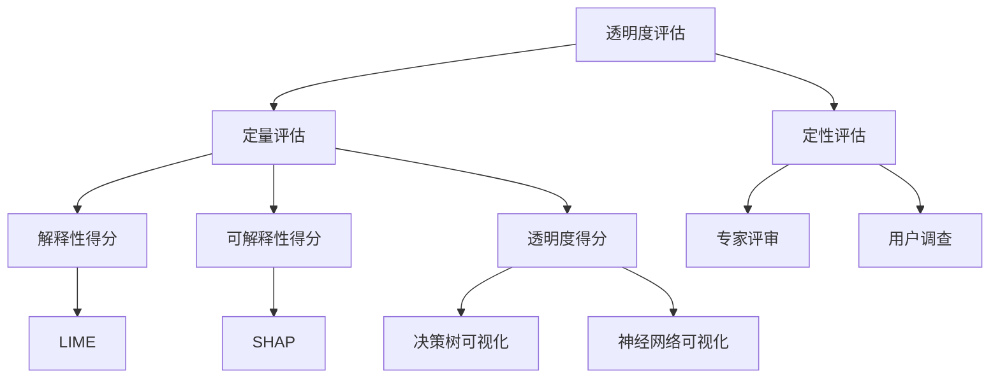

                 

### 引言与概述

**关键词**：AI系统透明度、问责制、信任、评估方法、法律规范

在人工智能（AI）迅猛发展的今天，AI系统已经在各行各业中扮演着至关重要的角色。然而，随着AI技术的不断进步和应用范围的扩大，AI系统的透明度和问责制问题日益受到关注。本文旨在探讨AI系统透明度和问责制的重要性，并分析其在建立信任中的关键作用。

#### AI系统透明度的意义

透明度是指AI系统在决策过程中能够被理解和解释的程度。一个透明的AI系统不仅能够让用户了解其工作原理和决策过程，还能够增强用户对系统的信任。在AI系统中，透明度的重要性体现在多个方面：

1. **提高可解释性**：通过提高系统的透明度，用户可以更好地理解AI系统的决策过程，从而增强对系统的信任。
2. **减少偏见**：透明度可以帮助识别和纠正AI系统中的潜在偏见，提高系统的公平性和公正性。
3. **合规性**：在许多行业，如金融、医疗等，AI系统的透明度是满足法律和监管要求的基本前提。

#### AI系统问责制的必要性

问责制是指对AI系统及其开发者、使用者进行责任追究的制度。在AI系统中，问责制的必要性主要体现在以下几个方面：

1. **责任归属**：当AI系统出现错误或导致损失时，问责制可以帮助确定责任归属，从而采取措施纠正错误。
2. **增强信任**：明确的问责制可以增强用户对AI系统的信任，从而推动技术的广泛应用。
3. **促进创新**：问责制可以激励开发者不断改进AI系统，提高其性能和透明度。

#### 信任的建立与维持

信任是AI系统广泛应用的基石。建立和维护信任需要从多个方面进行：

1. **透明度**：提高AI系统的透明度，让用户了解其工作原理和决策过程，从而增强信任。
2. **问责制**：建立明确的问责制，确保当AI系统出现问题时，责任能够得到追究，从而增强信任。
3. **法律规范**：制定相关法律法规，规范AI系统的开发和应用，保障用户的权益。

在接下来的章节中，我们将进一步探讨AI系统透明度和问责制的理论基础、技术框架、应用实践以及未来发展。希望通过本文的讨论，能够帮助读者更好地理解AI系统透明度和问责制的重要性，为AI技术的健康发展贡献力量。

### AI系统透明度理论基础

AI系统透明度是评估AI系统可解释性和用户信任度的重要指标。为了深入理解AI系统透明度，我们需要先了解一些基本概念、评估方法以及现有模型和技术。

#### 基本概念

**透明度**：透明度是指AI系统能够被理解和解释的程度。一个高透明度的AI系统应该具备以下几个特点：

- **可解释性**：用户能够理解AI系统的决策过程和输出结果。
- **可追踪性**：用户能够追踪AI系统在决策过程中使用的数据和算法。
- **可预测性**：用户能够预测AI系统在特定输入下的输出结果。

**重要性**：透明度在AI系统中的重要性主要体现在以下几个方面：

- **用户信任**：高透明度的AI系统能够增强用户对系统的信任，从而推动技术的广泛应用。
- **合规性**：透明度是满足法律和监管要求的基本前提，特别是在金融、医疗等敏感领域。
- **错误纠正**：高透明度的AI系统更容易被识别和纠正错误，从而提高系统的可靠性和稳定性。

#### 评估方法

评估AI系统透明度的方法主要分为以下几个方面：

1. **定量评估**：通过量化指标来评估AI系统的透明度。常见的指标包括解释性得分、可解释性得分、透明度得分等。这些指标通常基于数学模型和算法，可以客观地评估AI系统的透明度。

2. **定性评估**：通过专家评审或用户调查来评估AI系统的透明度。定性评估方法可以提供更详细的用户反馈和专家意见，有助于发现定量评估无法捕捉的问题。

3. **综合评估**：将定量评估和定性评估相结合，从多个角度全面评估AI系统的透明度。综合评估方法可以提供更全面的评估结果，帮助用户更好地理解AI系统的透明度。

#### 常见模型和技术

1. **模型解释性方法**：

   - **LIME（Local Interpretable Model-agnostic Explanations）**：LIME通过局部线性化AI模型来生成解释，使其对任何模型都具有解释性。
   - **SHAP（SHapley Additive exPlanations）**：SHAP利用博弈论中的Shapley值来解释每个特征对模型输出的贡献。

2. **可视化方法**：

   - **决策树可视化**：通过图形化展示决策树的节点和分支，帮助用户理解AI模型的决策过程。
   - **神经网络可视化**：通过可视化神经网络中的权重和激活值，帮助用户理解神经网络的内部工作原理。

3. **可视化工具**：

   - **TensorBoard**：TensorBoard是一个基于Web的工具，用于可视化深度学习模型的训练过程和性能。
   - **Plotly**：Plotly是一个数据可视化库，支持多种图表类型和交互式可视化。

#### Mermaid流程图

为了更好地展示AI系统透明度的评估过程，我们可以使用Mermaid流程图来描述：



通过以上基本概念、评估方法和技术的介绍，我们可以更好地理解AI系统透明度的理论基础。在下一章中，我们将进一步探讨AI系统问责制的框架和实施策略。

### AI系统问责制框架

问责制是确保AI系统在运行过程中责任明确、行为规范的重要机制。为了构建一个健全的AI系统问责制框架，我们需要从原则与策略、法律与伦理规范以及实施流程等方面进行详细探讨。

#### 原则与策略

1. **责任明确**：问责制的核心在于明确各方责任，包括AI系统的开发者、运营者、用户等。责任明确有助于在发生问题时迅速定位责任方，并采取相应的纠正措施。

2. **预防为主**：在AI系统设计和开发阶段，应注重预防措施，以减少潜在风险。这包括进行系统测试、风险评估和合规性审查等。

3. **透明公开**：问责制要求AI系统的决策过程和结果对相关方公开透明。透明度有助于增强用户信任，降低误解和纠纷的风险。

4. **持续改进**：AI系统问责制应具有动态调整的能力，随着技术的发展和应用的深入，不断优化和完善问责机制。

5. **用户参与**：用户在AI系统的设计和应用中应具有参与权，他们的反馈和建议对于完善问责制至关重要。

#### 法律与伦理规范

1. **法律规范**：许多国家和地区已经制定了相关的法律法规来规范AI系统的开发和应用。例如，欧盟的《通用数据保护条例》（GDPR）对个人数据的保护提出了严格的要求，美国的《联邦隐私法》也对AI系统应用进行了规范。

2. **伦理规范**：伦理规范是AI系统问责制的道德基础。AI系统的设计和应用应遵循伦理原则，确保不侵犯用户的隐私权、公平性和正义。

3. **行业规范**：不同行业也可能制定相应的规范来指导AI系统的开发和应用，如医疗行业的《临床决策支持系统指南》。

#### 实施流程

1. **设计阶段**：在AI系统设计阶段，应制定详细的开发规范和测试计划，确保系统的透明度和可靠性。同时，进行伦理审查和法律合规性评估。

2. **开发阶段**：在开发过程中，应实施严格的质量控制，包括代码审查、单元测试和集成测试等。开发团队应保持透明，及时记录和共享开发过程中的重要信息。

3. **测试阶段**：在系统发布前，应进行全面的测试，包括功能测试、性能测试和安全性测试等。测试阶段的关键目标是确保系统的透明度和可靠性。

4. **发布与维护阶段**：系统发布后，应持续监控其性能和透明度，及时更新和修复潜在问题。同时，建立用户反馈机制，收集用户对系统的使用体验和改进建议。

5. **责任追究阶段**：在发生问题时，应迅速启动责任追究程序，明确各方责任，采取相应的纠正措施。必要时，应提供透明的调查报告和解决方案。

#### 案例分析

以下是一个关于AI系统问责制的实际案例：

**案例背景**：某金融机构开发了一款智能投顾系统，用于为用户提供投资建议。然而，该系统在运行过程中出现了多次错误投资建议，导致部分用户损失严重。

**案例分析**：

1. **设计阶段**：在系统设计阶段，开发团队没有充分考虑到系统的可解释性，导致用户无法理解系统的投资建议。这违反了问责制中的透明度原则。

2. **开发阶段**：在开发过程中，没有进行充分的测试和审查，导致系统存在缺陷。这违反了问责制中的预防为主原则。

3. **测试阶段**：系统发布前没有进行全面测试，特别是在模拟用户场景下的测试。这导致系统在实际运行中出现了错误。这违反了问责制中的测试阶段原则。

4. **责任追究阶段**：在用户投诉后，开发团队未能迅速采取行动，也没有提供透明的调查报告。这违反了问责制中的责任追究原则。

**改进措施**：

1. **提高系统透明度**：通过改进系统设计，增加投资建议的可解释性，让用户能够理解系统的决策过程。

2. **加强测试和审查**：在系统发布前进行更全面的测试和审查，确保系统的可靠性和透明度。

3. **建立用户反馈机制**：及时收集用户反馈，对系统进行持续改进。

4. **透明责任追究**：在发生问题时，迅速启动责任追究程序，并向用户透明说明问题的原因和处理方案。

通过以上案例分析，我们可以看到，建立健全的AI系统问责制框架对于确保系统的透明度和可靠性至关重要。在下一章中，我们将进一步探讨AI系统透明度和问责制的具体技术实现。

### AI系统透明度和问责制的技术实现

在AI系统透明度和问责制的具体实施中，技术手段扮演着至关重要的角色。通过增强AI系统的透明度，以及开发相应的问责制工具和平台，我们可以确保系统的透明性和可追溯性，从而增强用户的信任和满意度。

#### 透明度增强技术

1. **数据可视化**

   数据可视化是一种通过图形化方式展示数据和信息的方法。通过数据可视化，用户可以直观地理解AI系统的决策过程和输出结果。例如，使用图表、热力图、时间序列图等，可以展示数据在不同条件下的变化趋势和关键特征。

   **实现方法**：
   
   - **Python库**：可以使用Matplotlib、Seaborn等Python库来创建各种类型的图表。
   - **示例代码**：

     ```python
     import matplotlib.pyplot as plt
     import seaborn as sns

     # 生成热力图
     sns.heatmap(data_matrix, annot=True, fmt=".2f")
     plt.show()

     # 生成时间序列图
     plt.plot(time_series)
     plt.xlabel('Time')
     plt.ylabel('Value')
     plt.show()
     ```

2. **解释性AI**

   解释性AI旨在提高AI系统的可解释性，让用户能够理解模型的决策过程。这通常涉及到模型解释技术，如局部可解释模型（LIME）、SHAP（SHapley Additive exPlanations）等。

   **实现方法**：

   - **LIME**：LIME通过在局部线性化AI模型来生成解释。具体步骤包括：
     1. 选择一个样本点，生成一个与该点相似的扰动数据集。
     2. 训练一个简单的模型来预测扰动数据集。
     3. 计算每个特征对模型预测的贡献。

     ```python
     from lime import lime_tabular

     explainer = lime_tabular.LimeTabularExplainer(
         training_data, feature_names=feature_names, class_names=class_names,
         discretize=False, discretize_col_limits=None, distance_threshold=None
     )
     explanation = explainer.explain_instance(new_data, classifier.predict, num_features=5)
     explanation.show_in_notebook(show_table=True)
     ```

   - **SHAP**：SHAP利用博弈论中的Shapley值来解释每个特征对模型输出的贡献。SHAP值的计算方法如下：
     1. 构建一个博弈论模型，模拟所有可能的特征组合。
     2. 计算每个特征对所有可能组合的边际贡献。
     3. 将边际贡献平均分配给每个特征。

     ```python
     import shap

     explainer = shap.KernelExplainer(model.predict, X)
     shap_values = explainer.shap_values(X)
     shap.summary_plot(shap_values, X, feature_names=feature_names)
     ```

#### 问责制工具与平台

1. **工具介绍**

   - **TensorBoard**：TensorBoard是一个基于Web的工具，用于可视化深度学习模型的训练过程和性能。TensorBoard可以展示训练过程中的损失函数、准确率、学习曲线等，帮助开发人员监控模型的性能和调试问题。

     ```python
     from torch.utils.tensorboard import SummaryWriter

     writer = SummaryWriter('logs/train')
     writer.add_scalar('Loss/train', loss, global_step=epoch)
     writer.add_scalar('Accuracy/train', accuracy, global_step=epoch)
     writer.close()
     ```

   - **AI Explainability 360**：AI Explainability 360是一个开源平台，提供多种AI模型解释工具，包括LIME、SHAP、全局解释等。该平台支持多种数据类型和模型，适用于不同的应用场景。

2. **平台构建**

   - **构建流程**：
     1. 确定需求：根据具体应用场景，明确需要解释的AI模型和关键指标。
     2. 数据准备：准备用于解释的数据集，并进行预处理。
     3. 模型选择：选择合适的解释性AI工具，如LIME、SHAP等。
     4. 解释生成：使用解释性AI工具对模型进行解释，生成解释报告。
     5. 可视化展示：将解释结果可视化，方便用户理解。

   - **示例代码**：

     ```python
     import shap

     # 构建SHAP解释器
     explainer = shap.KernelExplainer(model.predict, X_train)

     # 生成解释
     shap_values = explainer.shap_values(X_test)

     # 可视化展示
     shap.summary_plot(shap_values, X_test, feature_names=feature_names)
     ```

#### 透明度和问责制的集成

将AI系统透明度和问责制集成到整个系统中，是实现全面透明和可追溯性的关键。以下是一个集成方案的简要描述：

1. **设计阶段**：在系统设计时，考虑透明度和问责制的需求，确保系统架构支持透明度和可追溯性。
2. **开发阶段**：在开发过程中，采用模块化设计，将透明度和问责制功能嵌入到各个模块中。
3. **测试阶段**：在系统测试阶段，进行全面测试，包括功能测试、性能测试和透明度测试。
4. **发布阶段**：在系统发布前，进行用户培训和文档编写，确保用户能够理解系统的透明度和问责机制。
5. **维护阶段**：在系统运行过程中，持续监控和优化透明度和问责制功能，确保系统的透明度和可追溯性。

通过以上技术手段和集成方案，我们可以构建一个透明度高、可追溯性强的AI系统，从而增强用户的信任和满意度。

### AI系统透明度和问责制的应用实践

在AI系统透明度和问责制的实际应用中，有许多成功的案例和经验可以借鉴。以下将介绍几个典型案例，分析其实践过程和效果。

#### 案例一：金融行业的AI风险管理

**背景**：某大型金融机构使用AI系统进行风险管理，包括信用评分、欺诈检测和投资组合优化等。

**实践过程**：

1. **透明度提升**：为了提高系统的透明度，金融机构引入了LIME和SHAP等解释性AI工具，对AI模型的决策过程进行详细解释。例如，在信用评分模型中，通过LIME工具，用户可以了解每个特征对信用评分的影响程度。

   ```python
   from lime import lime_tabular

   explainer = lime_tabular.LimeTabularExplainer(
       training_data, feature_names=feature_names, class_names=class_names,
       discretize=False, discretize_col_limits=None, distance_threshold=None
   )
   explanation = explainer.explain_instance(new_data, classifier.predict, num_features=5)
   explanation.show_in_notebook(show_table=True)
   ```

2. **问责制实施**：在AI模型出现错误决策时，金融机构建立了责任追究机制，明确责任归属，并采取纠正措施。例如，在欺诈检测模型中，如果检测出错误，系统会自动通知相关人员进行调查和修正。

**效果**：通过提高透明度和实施问责制，金融机构在用户中建立了更高的信任度，降低了用户对AI系统的质疑和误解。同时，系统的准确性也得到了显著提升，风险控制能力得到了加强。

#### 案例二：医疗行业的AI诊断系统

**背景**：某医疗机构开发了一套基于AI的疾病诊断系统，用于辅助医生进行疾病诊断。

**实践过程**：

1. **透明度提升**：医疗机构使用了TensorBoard和AI Explainability 360等工具，对AI诊断系统的训练过程和决策过程进行可视化展示。例如，通过TensorBoard，用户可以监控训练过程中的损失函数和学习曲线。

   ```python
   from torch.utils.tensorboard import SummaryWriter

   writer = SummaryWriter('logs/train')
   writer.add_scalar('Loss/train', loss, global_step=epoch)
   writer.add_scalar('Accuracy/train', accuracy, global_step=epoch)
   writer.close()
   ```

2. **问责制实施**：医疗机构建立了明确的问责制流程，当AI诊断系统出现错误诊断时，会启动责任追究程序，对错误进行复盘和分析，并采取相应的纠正措施。

**效果**：通过提升透明度和实施问责制，医疗机构的AI诊断系统得到了用户的广泛认可，提高了诊断的准确性和可靠性，也增强了医生对AI系统的信任和依赖。

#### 案例三：智能交通系统的优化

**背景**：某城市智能交通系统使用AI技术进行交通流量预测和信号灯控制优化。

**实践过程**：

1. **透明度提升**：交通系统通过数据可视化工具，将交通流量、信号灯控制策略等信息实时展示给用户和管理者，提高系统的透明度。例如，使用热力图展示不同路段的实时交通流量。

   ```python
   import matplotlib.pyplot as plt
   import seaborn as sns

   sns.heatmap(data_matrix, annot=True, fmt=".2f")
   plt.show()
   ```

2. **问责制实施**：在交通信号灯控制过程中，如果出现异常情况，如交通事故或交通堵塞，系统会自动记录并通知相关部门进行应急处理，明确责任归属。

**效果**：通过提高透明度和实施问责制，智能交通系统在提高交通效率和安全性方面取得了显著成效，用户满意度大幅提升。

综上所述，AI系统透明度和问责制的实际应用在实践中展现了重要的作用。通过提升透明度和实施问责制，不仅可以增强用户对AI系统的信任，还可以提高系统的可靠性和准确性。在未来的发展中，AI系统透明度和问责制将得到更广泛的应用和进一步优化。

### AI系统透明度和问责制的未来发展

随着人工智能（AI）技术的不断进步，AI系统透明度和问责制的重要性日益凸显。未来，AI系统透明度和问责制将在多个方面取得显著进展，同时也面临一系列挑战和机遇。

#### 研究趋势

1. **透明度评估方法的优化**：未来的研究将致力于开发更高效、更准确的透明度评估方法。例如，结合深度学习和自然语言处理技术，构建自动化的解释模型，提高AI系统的可解释性。

2. **问责制模型的完善**：随着AI技术的发展，问责制模型也需要不断更新和完善。未来的研究将探索更加细化和精确的问责制模型，以适应不同应用场景的需求。

3. **跨领域合作**：AI系统透明度和问责制的研究将促进跨学科的合作，包括计算机科学、心理学、社会学和法律等。跨领域的合作有助于从多个角度解决AI系统的透明度和问责制问题。

4. **伦理和法律的更新**：随着AI技术的应用越来越广泛，现有的法律和伦理规范可能需要更新。未来的研究将关注如何制定更加完善的法律法规，以保护用户权益和确保AI系统的公平性和公正性。

#### 技术挑战与机遇

1. **计算资源的优化**：透明度评估和问责制实施通常需要大量的计算资源。未来，通过优化算法和硬件，提高计算效率，将有助于降低成本，提高透明度和问责制的实施效果。

2. **隐私保护**：在确保AI系统透明度的同时，隐私保护是一个重要的挑战。未来的技术发展需要平衡透明度和隐私保护，确保用户隐私不受侵犯。

3. **用户体验的提升**：用户对AI系统的信任取决于其对系统的理解程度。未来的研究将致力于提升用户体验，通过更加直观和易理解的界面，提高系统的透明度。

4. **监管框架的建立**：在AI系统透明度和问责制的实际应用中，建立有效的监管框架至关重要。未来的发展将需要政府和行业的共同努力，制定统一的监管标准和规范。

#### 未来展望

1. **透明度评估工具的普及**：随着透明度评估方法的不断优化，这些工具将在各个行业中得到广泛应用，提高AI系统的可解释性和用户信任度。

2. **问责制机制的完善**：通过不断改进问责制模型和实施方法，AI系统的责任归属将更加明确，用户对AI系统的信任将得到进一步加强。

3. **AI技术的健康发展**：在透明度和问责制的保障下，AI技术将得到更加健康和可持续的发展，推动社会的进步和变革。

总之，AI系统透明度和问责制是建立用户信任和维护系统稳定性的关键。随着技术的不断进步和研究的深入，透明度和问责制将在未来取得更大突破，为AI技术的广泛应用和健康发展奠定坚实基础。

### 总结与展望

在本文中，我们系统地探讨了AI系统透明度和问责制的重要性，从理论基础、技术实现、应用实践到未来发展，全面分析了其在建立信任、提高系统可靠性和促进技术健康发展的关键作用。

#### 核心内容回顾

1. **AI系统透明度的意义**：透明度是指AI系统在决策过程中能够被理解和解释的程度。提高透明度有助于增强用户信任、减少偏见、满足合规性要求。

2. **AI系统问责制的必要性**：问责制是对AI系统及其开发者、使用者进行责任追究的制度。明确责任归属、增强信任、促进创新是问责制的核心目标。

3. **透明度和问责制的评估方法**：定量评估、定性评估和综合评估是评估AI系统透明度和问责制的主要方法。模型解释性方法、数据可视化和可视化工具是提高透明度的技术手段。

4. **实践中的应用**：在金融、医疗、智能交通等行业，AI系统透明度和问责制的应用实践取得了显著成效，提升了系统的可解释性和用户信任度。

5. **未来发展的趋势**：随着AI技术的不断进步，透明度和问责制的研究将向优化评估方法、完善问责制模型、跨领域合作和建立监管框架等方向发展。

#### 未来工作方向

1. **技术深化研究**：继续优化透明度评估方法，开发更高效、更准确的解释性AI工具，如基于深度学习和自然语言处理的自动化解释模型。

2. **政策制定**：与政府和行业合作，制定统一的法律法规和伦理规范，确保AI系统的透明度和问责制得到有效实施。

3. **跨领域合作**：促进计算机科学、心理学、社会学和法律等领域的合作，从多角度解决AI系统的透明度和问责制问题。

4. **用户体验提升**：通过改进用户界面和交互设计，提高用户体验，让用户更容易理解和信任AI系统。

#### 对读者的期望

本文旨在为读者提供一个全面、系统的了解AI系统透明度和问责制的框架。我们期望读者能够：

1. 深入理解AI系统透明度和问责制的基本概念和重要性。
2. 掌握透明度和问责制的评估方法和技术手段。
3. 结合实际应用案例，分析AI系统透明度和问责制的实际效果。
4. 积极参与到AI系统透明度和问责制的未来发展中去，共同推动技术的健康发展和广泛应用。

感谢各位读者的阅读和支持，期待与您在未来的技术探讨中相遇。

### 作者信息

作者：AI天才研究院/AI Genius Institute & 禅与计算机程序设计艺术 /Zen And The Art of Computer Programming

AI天才研究院（AI Genius Institute）是一家专注于人工智能前沿研究和创新的应用研究机构，致力于推动AI技术的发展和应用。同时，作者还著有《禅与计算机程序设计艺术》（Zen And The Art of Computer Programming），该书在计算机编程领域具有深远的影响力，被誉为计算机编程的经典之作。在这本书中，作者深入探讨了编程的哲学和艺术，对计算机科学的发展产生了重要影响。在AI系统透明度和问责制领域，作者以其丰富的理论知识和实践经验，为读者提供了宝贵的见解和建议。通过本文，作者希望继续为AI技术的健康发展贡献自己的力量。

