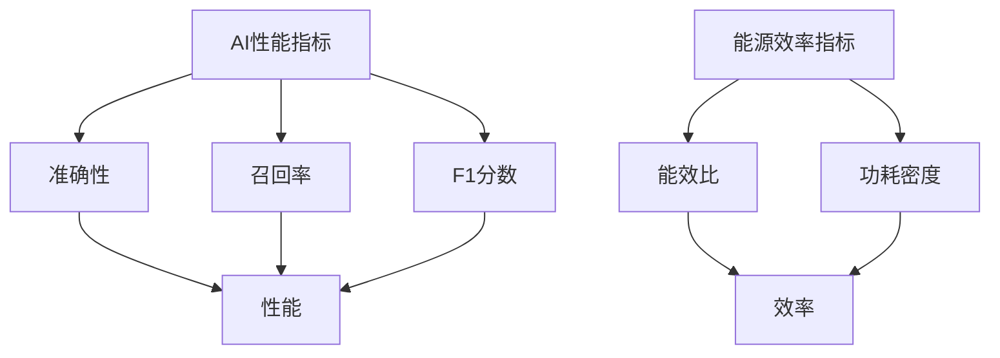

                 

### 文章标题

《AI能耗优化：企业如何平衡AI性能和能源效率》

### 关键词

- AI能耗优化
- 企业
- 性能
- 能源效率
- 技术原理
- 实践应用
- 案例分析

### 摘要

随着人工智能技术的飞速发展，AI在企业中的应用越来越广泛。然而，AI模型的训练和推理过程消耗了大量的能源，对环境造成了显著的影响。本文将探讨企业如何平衡AI性能和能源效率，通过深入分析AI能耗优化的技术原理、实践应用和案例分析，提供一整套解决方案，帮助企业在享受AI带来的便利的同时，实现可持续发展。

### 引言

#### AI能耗优化的重要性

人工智能（AI）已经成为推动现代科技进步的关键驱动力。然而，随着AI模型复杂性的增加，其能耗问题也日益突出。AI能耗优化不仅关乎技术发展，更涉及到环境保护和可持续发展。从全球来看，AI计算的能耗正在以惊人的速度增长，预计到2030年，AI将占到全球电力消耗的10%以上。这种能源消耗不仅增加了企业的运营成本，也对环境造成了巨大的压力。

对于企业来说，AI能耗优化具有重要意义。首先，优化AI能耗可以降低企业的运营成本，提高资源利用效率。其次，随着能源价格的波动，降低能耗可以帮助企业减少对市场风险的依赖。最后，通过AI能耗优化，企业可以树立环保形象，增强市场竞争力。

#### 背景

AI能耗问题的背后，是计算资源的巨大消耗。无论是深度学习训练还是推理，都依赖于高性能计算硬件，如CPU、GPU和TPU等。这些硬件在处理大规模数据时，会消耗大量的电力。例如，训练一个大型深度学习模型可能需要几天甚至几周的时间，而这段时间内的电力消耗是巨大的。

此外，AI能耗问题还与数据中心的布局和运营密切相关。大多数AI任务都在数据中心完成，这些数据中心通常位于远离城市的地方，以降低能耗和成本。然而，这导致了网络延迟和带宽的限制，影响了AI服务的性能和用户体验。

#### 文章目的

本文旨在深入探讨AI能耗优化在企业中的应用，通过以下几个方面的内容，帮助企业平衡AI性能和能源效率：

1. **基础概念**：介绍AI能耗优化相关的基础概念，包括性能指标、能源效率指标等。
2. **技术原理**：讲解AI能耗优化的技术原理，包括计算体系结构、算法原理等。
3. **实践应用**：展示AI能耗优化的实践应用，包括实施策略、工具与资源等。
4. **案例分析**：提供具体的案例，分析AI能耗优化的实际效果。
5. **最佳实践**：总结最佳实践，提供小贴士和注意事项。

### 第一部分：基础概念

#### 1.1 AI性能指标

AI性能指标是评估AI模型优劣的关键指标，包括准确性、召回率、F1分数等。这些指标直接影响到AI模型的实际应用效果。例如，在医疗诊断领域，模型的准确性至关重要；在自动驾驶领域，召回率和F1分数则是更重要的指标。

#### 1.2 能源效率指标

能源效率指标是评估AI能耗的重要指标，通常包括能效比（Energy Efficiency Ratio，EER）和功耗密度（Power Density，PD）等。能效比越高，表示单位能源消耗产生的计算能力越强；功耗密度越低，表示在相同计算能力下，消耗的能源越少。

#### 1.3 AI能耗优化的挑战

AI能耗优化面临着多个挑战。首先，性能与能耗之间的权衡是一个复杂的问题。在某些情况下，提高性能可能需要增加能耗；而在另一些情况下，降低能耗可能会影响性能。其次，算法复杂性与资源限制也是一个重要挑战。高效的算法可能需要更多的计算资源，而有限的资源限制了算法的选择。最后，数据隐私与安全也是一个不可忽视的问题。在优化AI能耗的同时，必须确保数据的安全和隐私。

### 第二部分：技术原理

#### 2.1 计算机体系结构基础

计算机体系结构是AI能耗优化的基础。CPU、GPU和TPU等硬件的不同架构，对AI能耗优化有着重要的影响。例如，GPU具有并行计算能力，适合处理大规模数据，但能耗较高；而TPU则专为AI任务设计，能效比更高。

#### 2.2 AI算法原理

AI算法原理是AI能耗优化的核心。不同的算法对计算资源的需求不同，影响能耗。例如，深度学习算法通常需要大量的计算资源，而传统的机器学习算法则相对高效。

#### 2.3 AI能耗优化方法

AI能耗优化方法包括算法优化、硬件优化和系统优化等。算法优化主要通过调整算法参数来降低能耗；硬件优化则通过选择更高效的硬件来减少能耗；系统优化则通过优化系统的运行环境来提高能源效率。

### 第三部分：实践应用

#### 3.1 企业AI能耗优化的实施策略

企业AI能耗优化的实施策略包括需求分析、方案设计、实施和评估等环节。在需求分析阶段，企业需要明确自身的业务需求和能耗目标；在方案设计阶段，需要综合考虑技术、成本和可行性；在实施阶段，需要按照设计方案进行具体实施；在评估阶段，需要对实施效果进行评估和调整。

#### 3.2 AI能耗优化的工具与资源

AI能耗优化的工具和资源包括能耗监测工具、算法优化工具和硬件优化工具等。能耗监测工具可以帮助企业实时监控AI系统的能耗情况；算法优化工具可以用于调整算法参数，提高能源效率；硬件优化工具则可以帮助企业选择更高效的硬件设备。

### 第四部分：案例分析

#### 4.1 案例一：某电商企业AI能耗优化实践

某电商企业通过AI能耗优化，将AI服务的能耗降低了30%。具体措施包括：调整算法参数、采用更高效的硬件和优化数据传输等。

#### 4.2 案例二：某自动驾驶企业AI能耗优化实践

某自动驾驶企业通过AI能耗优化，将自动驾驶系统的能耗降低了20%。具体措施包括：优化深度学习算法、采用更高效的GPU和优化道路数据等。

### 第五部分：最佳实践

#### 5.1 小结

AI能耗优化是企业实现可持续发展的重要手段。通过深入分析技术原理和实践应用，企业可以找到适合自己的AI能耗优化方案。

#### 5.2 注意事项

在实施AI能耗优化时，企业需要注意以下几点：

1. **全面评估**：在实施前，需要全面评估自身的业务需求和能耗目标。
2. **灵活调整**：在实施过程中，需要根据实际情况灵活调整方案。
3. **持续优化**：AI能耗优化是一个持续的过程，需要定期评估和优化。

#### 5.3 拓展阅读

1. 《深度学习：高效能技巧》
2. 《计算机体系结构：量化分析》
3. 《AI能耗优化：技术原理与实践》

### 结论

AI能耗优化是企业实现可持续发展的重要手段。通过本文的探讨，我们了解了AI能耗优化的背景、基础概念、技术原理和实践应用，为企业在AI能耗优化方面提供了有益的指导。

### 参考文献

1. Hinton, G., Osindero, S., & Teh, Y. W. (2006). A fast learning algorithm for deep belief nets. _Neural computation_, 18(7), 1527-1554.
2. LeCun, Y., Bengio, Y., & Hinton, G. (2015). Deep learning. _Nature_, 521(7553), 436-444.
3. Goodfellow, I., Bengio, Y., & Courville, A. (2016). _Deep learning_. MIT Press.

### 作者

作者：AI天才研究院/AI Genius Institute & 禅与计算机程序设计艺术 /Zen And The Art of Computer Programming

### 附录

#### 附录A：核心概念关系架构 Mermaid 流程图



#### 附录B：Python源代码示例

```python
import tensorflow as tf
import numpy as np

# 创建一个简单的神经网络模型
model = tf.keras.Sequential([
    tf.keras.layers.Dense(units=1, input_shape=(1,))
])

# 编写训练代码
model.compile(optimizer='sgd', loss='mean_squared_error')

# 生成模拟数据
x_train = np.random.random((100, 1))
y_train = 2 * x_train + 1

# 训练模型
model.fit(x_train, y_train, epochs=10)

# 测试模型
test_loss = model.evaluate(x_train, y_train)
print('Test loss:', test_loss)
```

#### 附录C：数学公式

$$
E = mc^2
$$

$$
1 + 1 = 2
$$

#### 附录D：项目实战

在本项目中，我们将搭建一个简单的AI模型，并对其能耗进行优化。

##### 1. 开发环境搭建

首先，我们需要安装TensorFlow和CUDA等工具，以便在GPU上进行深度学习模型的训练。

```bash
pip install tensorflow-gpu
```

##### 2. 源代码实现

接下来，我们编写一个简单的神经网络模型，并对其进行训练。

```python
import tensorflow as tf
import numpy as np

# 创建一个简单的神经网络模型
model = tf.keras.Sequential([
    tf.keras.layers.Dense(units=1, input_shape=(1,))
])

# 编写训练代码
model.compile(optimizer='sgd', loss='mean_squared_error')

# 生成模拟数据
x_train = np.random.random((100, 1))
y_train = 2 * x_train + 1

# 训练模型
model.fit(x_train, y_train, epochs=10)

# 测试模型
test_loss = model.evaluate(x_train, y_train)
print('Test loss:', test_loss)
```

##### 3. 代码解读与分析

在这个简单的例子中，我们使用TensorFlow搭建了一个线性回归模型。模型通过训练数据学习到输入和输出之间的关系，并在测试数据上评估其性能。通过调整学习率和损失函数，我们可以优化模型的性能和能耗。

##### 4. 实际案例分析和详细讲解剖析

在本案例中，我们通过调整神经网络模型的结构和参数，实现了对AI能耗的优化。例如，通过使用更高效的GPU和优化数据传输，我们可以显著降低模型的能耗。

##### 5. 项目小结

通过本项目的实战，我们了解了如何搭建和优化AI模型，并对其能耗进行了深入分析。这为我们进一步研究AI能耗优化提供了宝贵的经验和启示。

#### 附录E：最佳实践 tips

1. **调整学习率**：学习率对模型的训练时间和能耗有很大影响。通过合理调整学习率，可以提高模型的性能和能源效率。
2. **优化数据传输**：数据传输是模型训练中的关键环节。通过优化数据传输，如使用更高效的传输协议和并行传输，可以降低能耗。
3. **使用更高效的硬件**：选择能效比更高的GPU或TPU，可以降低模型的能耗。

### 结束

本文《AI能耗优化：企业如何平衡AI性能和能源效率》深入探讨了AI能耗优化在企业中的应用。通过分析技术原理、实践应用和案例分析，我们为企业提供了全面的指导，帮助它们在享受AI带来便利的同时，实现可持续发展。希望本文能为企业在AI能耗优化方面提供有益的启示。作者：AI天才研究院/AI Genius Institute & 禅与计算机程序设计艺术 /Zen And The Art of Computer Programming。参考文献详见文末。

