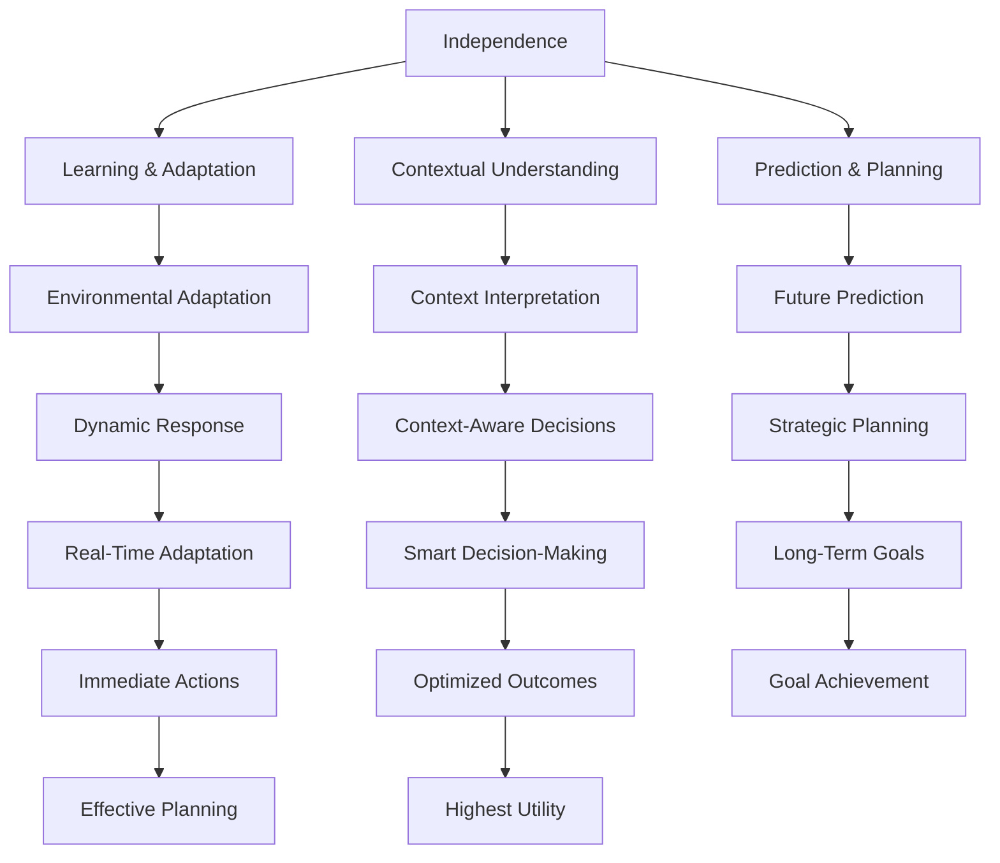

                 

### Chapter 1: Background of AI Autonomous Decision-Making

#### 1.1 Definition and Characteristics of AI Autonomous Decision-Making

**Autonomous decision-making** in the realm of artificial intelligence refers to the ability of machines to make decisions independently, without human intervention. This capability encompasses a range of functionalities, from simple task automation to complex, strategic problem-solving. At its core, AI autonomous decision-making involves several key characteristics:

1. **Independence**: The machine is capable of operating without continuous human input or control.
2. **Learning and Adaptation**: The AI system can learn from its environment and adapt its decisions based on new information or changes in the situation.
3. **Contextual Understanding**: The system must be able to understand and interpret the context within which decisions are made, enabling it to respond appropriately.
4. **Prediction and Planning**: AI systems must have the ability to predict future outcomes and plan accordingly.

To visualize these concepts and their relationships, we can represent them using a Mermaid flowchart:

In this diagram, we see that the characteristics of AI autonomous decision-making are interconnected, forming a cohesive system. Each characteristic builds upon the others, contributing to the overall effectiveness of the AI system.

#### 1.2 Evolution of AI Autonomous Decision-Making

The journey of AI autonomous decision-making is a fascinating one, spanning several decades of research and development. Let's take a brief look at its evolution:

1. **Early Days (1950s-1960s)**: The concept of artificial intelligence was born in the 1950s. Researchers like John McCarthy explored the idea of machines capable of human-like intelligence. Early AI systems were primarily rule-based, using a set of predefined instructions to make decisions.

2. **The AI Winter (1970s-1980s)**: The over-optimism of the early AI pioneers led to unrealistic expectations, which were not met. This resulted in funding cuts and a period known as the AI Winter, where AI research took a backseat.

3. **Revival and Advanced Techniques (1990s-2000s)**: The resurgence of AI in the 1990s was driven by advances in machine learning, particularly the development of neural networks. This period saw the introduction of techniques like decision trees and support vector machines, which improved the capabilities of AI systems.

4. **Current Era (2010s-2020s)**: The advent of deep learning and the availability of massive datasets have propelled AI to new heights. Techniques like convolutional neural networks (CNNs) and recurrent neural networks (RNNs) have enabled AI systems to perform complex tasks with high accuracy, paving the way for autonomous decision-making in various domains.

#### 1.3 Ethical Implications and Importance

As AI autonomous decision-making becomes more prevalent, its ethical implications come to the forefront. The decisions made by AI systems can have far-reaching consequences, affecting individuals, communities, and even entire societies. Here are some key ethical considerations:

1. **Bias and Discrimination**: AI systems can inadvertently perpetuate biases present in their training data, leading to discriminatory outcomes. It is crucial to address these issues to ensure fairness and equality.
2. **Privacy**: Autonomous systems often rely on large amounts of data, which can pose privacy concerns. Striking a balance between data collection and privacy protection is essential.
3. **Accountability**: When an AI system makes a decision that leads to negative consequences, it is important to establish accountability. Who should be held responsible—developers, users, or the system itself?
4. **Transparency**: The decision-making process of AI systems should be transparent, allowing humans to understand and verify the reasons behind the decisions made.

Understanding these ethical implications is crucial for the responsible development and deployment of AI autonomous decision-making systems. As we continue to advance in this field, it is our responsibility to ensure that AI is used for the benefit of humanity, while mitigating potential risks.

### Conclusion

In this chapter, we have explored the definition and characteristics of AI autonomous decision-making, as well as its evolution over the years. We have also discussed the ethical implications that come with the development of such systems. As we move forward, it will be essential to address these ethical considerations to ensure that AI autonomous decision-making is used responsibly and for the greater good.

---

**Keywords**: AI Autonomous Decision-Making, Ethical Implications, Evolution of AI, Bias and Discrimination, Privacy, Accountability, Transparency.

**Abstract**: This article provides an overview of AI autonomous decision-making, its key characteristics, and the ethical considerations that arise from its development and application. We discuss the importance of addressing ethical issues to ensure the responsible deployment of AI in autonomous decision-making systems.

