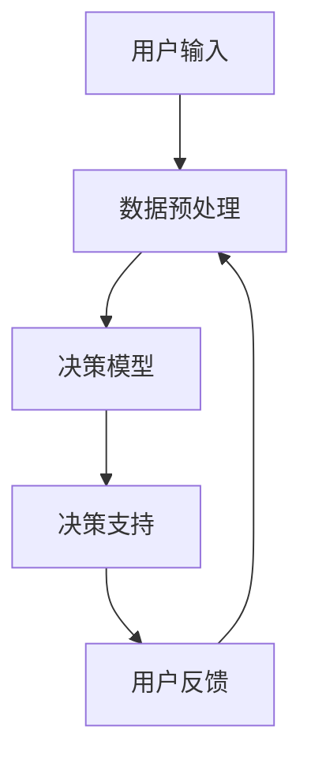
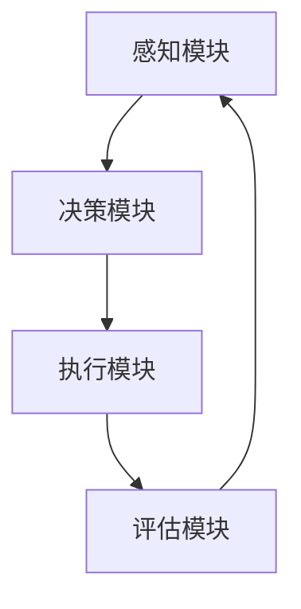

                 

---

## 引言与背景

AI自主性，作为人工智能领域的一个重要研究方向，正逐渐成为技术发展的重要驱动力。从辅助决策到独立决策，AI自主性的发展历程不仅体现了技术进步的轨迹，更反映了人类对智能系统的需求不断升级。

### 1.1 AI自主性的概念与重要性

AI自主性指的是智能系统能够在不依赖于人类干预的情况下，自主地进行决策和行动的能力。这一概念的重要性不言而喻，因为它代表了人工智能从“工具”向“伙伴”的过渡，使得智能系统能够在更加复杂和动态的环境中发挥作用。

### 1.2 AI自主性的发展阶段

AI自主性的发展可以分为几个阶段：

1. **辅助决策**：在这一阶段，AI系统主要起到辅助作用，提供决策支持，但最终决策仍然由人类做出。
2. **半自主决策**：AI系统可以在某些特定场景下做出决策，但需要人类进行监督和校正。
3. **完全自主决策**：在这一阶段，AI系统能够在没有任何人类干预的情况下独立做出决策。

### 1.3 本书结构安排与内容概述

本书将分为七个章节，从不同角度深入探讨AI自主性的演进。具体章节安排如下：

- **第1章**：引言与背景，介绍AI自主性的概念与重要性。
- **第2章**：核心概念与联系，详细阐述决策与决策过程，以及AI与决策的关系。
- **第3章**：技术基础，介绍机器学习基础和深度学习架构。
- **第4章**：从辅助决策到独立决策的演进，探讨AI自主性的实现过程。
- **第5章**：AI自主性挑战与未来展望，分析当前面临的挑战以及未来发展趋势。
- **第6章**：案例研究，通过具体案例分析和评估，展示AI自主性的实际应用。
- **第7章**：总结与展望，回顾本书的主要观点，并对AI自主性的未来进行展望。

---

**第2章 AI自主性的核心概念**

决策是智能系统工作的核心，因此，理解决策及其过程对于探讨AI自主性至关重要。

### 2.1 决策与决策过程

#### 2.1.1 决策的类型

决策可以分为三种主要类型：

1. **程序化决策**：这类决策适用于重复性和结构化的问题，通常可以通过预定义的规则进行处理。
2. **非程序化决策**：这类决策涉及复杂和非结构化的问题，需要智能系统具备更强的适应性和创造力。
3. **半结构化决策**：介于程序化决策和非程序化决策之间，需要结合规则和智能算法进行决策。

#### 2.1.2 决策的过程

决策过程通常包括以下几个步骤：

1. **问题识别**：确定需要解决的问题。
2. **信息收集**：收集与问题相关的数据和信息。
3. **方案生成**：提出可能的解决方案。
4. **方案评估**：评估每个方案的成本、风险和效益。
5. **方案选择**：选择最优的方案。
6. **执行**：执行选定的方案。
7. **评估与反馈**：评估决策结果，并反馈到下一步决策中。

#### 2.1.3 决策理论的基础

决策理论主要包括以下几个方面：

1. **期望效用理论**：评估不同决策结果的效用，并选择期望效用最大的方案。
2. **风险理论**：在不确定的环境下，评估决策的风险和收益。
3. **贝叶斯决策理论**：基于概率和统计方法，选择最优的决策策略。

### 2.2 AI与决策的关系

AI在决策过程中发挥着关键作用，其主要表现为：

1. **决策支持**：AI系统可以通过数据分析、模式识别和预测模型，为人类决策提供支持。
2. **决策自动化**：在半结构化和非结构化决策场景中，AI系统能够自主生成和执行决策。
3. **决策优化**：通过机器学习和优化算法，AI系统能够在复杂问题中找到最优解。

#### 2.2.1 AI在决策支持中的应用

AI在决策支持中的应用非常广泛，例如：

1. **金融领域**：使用AI进行风险评估、投资策略和风险管理。
2. **医疗领域**：使用AI进行疾病诊断、治疗方案推荐和药物研发。
3. **交通领域**：使用AI进行交通流量预测、路线规划和自动驾驶。

#### 2.2.2 AI在决策过程中的角色

AI在决策过程中的角色可以概括为：

1. **决策辅助者**：提供决策建议，但最终决策仍由人类做出。
2. **决策执行者**：在特定场景下，AI系统可以直接执行决策。
3. **决策优化者**：通过不断学习和优化，提高决策的效率和效果。

#### 2.2.3 AI决策的优缺点分析

AI决策具有以下优点：

1. **速度快**：AI系统可以快速处理大量数据，进行实时决策。
2. **准确性高**：AI系统可以基于历史数据和统计模型，做出更准确的决策。
3. **一致性**：AI系统不受情绪和偏见影响，能够保持一致性。

但AI决策也存在以下缺点：

1. **透明性低**：AI系统的决策过程往往难以解释，缺乏透明性。
2. **数据依赖性**：AI决策依赖于高质量的数据，数据质量差可能导致决策错误。
3. **适应性差**：AI系统在处理新型或复杂问题时，可能表现出适应性差。

---

**第3章 AI自主性技术基础**

AI自主性的实现依赖于一系列技术的支持，本章将介绍机器学习基础和深度学习架构。

### 3.1 机器学习基础

#### 3.1.1 监督学习

监督学习是一种常见的机器学习方法，它通过学习输入数据和对应输出标签，构建预测模型。监督学习可以分为以下几种类型：

1. **分类**：将数据分类到不同的类别中。例如，垃圾邮件分类、图像识别等。
2. **回归**：预测一个连续的数值输出。例如，住房价格预测、股票价格预测等。
3. **回归**：预测一个连续的数值输出。例如，住房价格预测、股票价格预测等。

监督学习的核心流程包括：

1. **特征提取**：从输入数据中提取出对分类或回归任务有帮助的特征。
2. **模型训练**：使用已标记的数据集，训练出一个预测模型。
3. **模型评估**：使用测试数据集评估模型的性能。

以下是一个简单的监督学习算法——线性回归的Python代码示例：

```python
import numpy as np
from sklearn.linear_model import LinearRegression

# 输入数据
X = np.array([[1], [2], [3], [4], [5]])
y = np.array([1, 2, 2.5, 4, 5])

# 创建线性回归模型
model = LinearRegression()

# 训练模型
model.fit(X, y)

# 预测
predictions = model.predict(np.array([[6]]))

print(predictions)
```

线性回归的数学模型可以表示为：

$$
y = \beta_0 + \beta_1x
$$

其中，$y$ 是目标变量，$x$ 是特征变量，$\beta_0$ 和 $\beta_1$ 是模型参数。

#### 3.1.2 无监督学习

无监督学习是一种不需要标签数据的机器学习方法，其主要目标是发现数据中的隐藏结构。无监督学习可以分为以下几种类型：

1. **聚类**：将相似的数据点归为一类。例如，K-means聚类、层次聚类等。
2. **降维**：减少数据维度，同时保留主要特征信息。例如，主成分分析（PCA）、线性判别分析（LDA）等。
3. **关联规则学习**：发现数据项之间的关联关系。例如，Apriori算法、Eclat算法等。

以下是一个简单的K-means聚类算法的Python代码示例：

```python
import numpy as np
from sklearn.cluster import KMeans

# 输入数据
X = np.array([[1, 2], [1, 4], [1, 0],
              [10, 2], [10, 4], [10, 0]])

# 创建K-means模型
model = KMeans(n_clusters=2, random_state=0).fit(X)

# 聚类结果
print(model.labels_)

# 中心点
print(model.cluster_centers_)
```

K-means算法的数学模型可以表示为：

$$
c_{i} = \frac{1}{n_i} \sum_{x_j \in S_i} x_j
$$

其中，$c_i$ 是第 $i$ 个聚类中心，$n_i$ 是属于第 $i$ 个聚类的数据点数量，$x_j$ 是第 $j$ 个数据点。

#### 3.1.3 强化学习

强化学习是一种通过试错和反馈进行学习的方法，其主要目标是找到一条策略，使得智能体能够在环境中获得最大累积奖励。强化学习的主要组成部分包括：

1. **状态（State）**：智能体所处的环境状态。
2. **动作（Action）**：智能体可以采取的行动。
3. **奖励（Reward）**：智能体执行动作后获得的即时奖励。
4. **策略（Policy）**：智能体的决策规则。

以下是一个简单的Q-learning算法的Python代码示例：

```python
import numpy as np
import random

# 环境定义
n_states = 4
n_actions = 2
rewards = np.array([[0, 1], [1, 0], [0, 0], [0, 0]])

# 初始化Q值矩阵
Q = np.zeros((n_states, n_actions))

# 参数设置
alpha = 0.1  # 学习率
gamma = 0.6  # 折扣因子

# Q-learning算法
for episode in range(1000):
    state = random.randint(0, n_states - 1)
    done = False
    
    while not done:
        action = np.argmax(Q[state])
        next_state = random.randint(0, n_states - 1)
        reward = rewards[state][action]
        
        Q[state][action] = Q[state][action] + alpha * (reward + gamma * np.max(Q[next_state]) - Q[state][action])
        
        state = next_state
        if state == n_states - 1:
            done = True

# 打印Q值矩阵
print(Q)
```

Q-learning算法的数学模型可以表示为：

$$
Q(s, a) = Q(s, a) + \alpha [r + \gamma \max_{a'} Q(s', a') - Q(s, a)]
$$

其中，$s$ 是当前状态，$a$ 是当前动作，$s'$ 是下一状态，$r$ 是奖励，$\alpha$ 是学习率，$\gamma$ 是折扣因子。

### 3.2 深度学习架构

深度学习是一种基于多层神经网络的学习方法，其核心思想是通过多层非线性变换，从原始数据中提取出高层次的抽象特征。深度学习的架构主要包括：

1. **前馈神经网络（Feedforward Neural Network, FFNN）**：一种前向传播的网络结构，信息从输入层流向输出层。
2. **卷积神经网络（Convolutional Neural Network, CNN）**：一种适用于图像处理和计算机视觉的网络结构，通过卷积操作提取特征。
3. **循环神经网络（Recurrent Neural Network, RNN）**：一种适用于序列数据的网络结构，通过循环连接实现长短期记忆。
4. **生成对抗网络（Generative Adversarial Network, GAN）**：一种由生成器和判别器组成的网络结构，用于生成逼真的数据。

以下是一个简单的卷积神经网络（CNN）的Python代码示例：

```python
import tensorflow as tf
from tensorflow.keras import layers

# 输入层
inputs = tf.keras.Input(shape=(28, 28, 1))

# 卷积层1
x = layers.Conv2D(32, (3, 3), activation='relu')(inputs)
x = layers.MaxPooling2D((2, 2))(x)

# 卷积层2
x = layers.Conv2D(64, (3, 3), activation='relu')(x)
x = layers.MaxPooling2D((2, 2))(x)

# 平坦化层
x = layers.Flatten()(x)

# 全连接层
x = layers.Dense(64, activation='relu')(x)
outputs = layers.Dense(10, activation='softmax')(x)

# 构建模型
model = tf.keras.Model(inputs, outputs)

# 编译模型
model.compile(optimizer='adam', loss='categorical_crossentropy', metrics=['accuracy'])

# 打印模型结构
model.summary()
```

卷积神经网络（CNN）的数学模型可以表示为：

$$
\text{Conv}(x; \text{weights}) = \text{sigmoid}\left(\sum_{i=1}^{C} w_{ij} * x_j + b_j\right)
$$

其中，$x$ 是输入特征，$w$ 是卷积核权重，$b$ 是偏置项，$C$ 是卷积核的数量。

---

**第4章 从辅助决策到独立决策的演进**

AI自主性的发展经历了从辅助决策到独立决策的演进。这一过程不仅体现了技术的进步，也反映了人类对智能系统期望的变化。

### 4.1 辅助决策系统的设计与实现

辅助决策系统是指AI系统在决策过程中起到辅助作用，提供决策支持，但最终决策仍由人类做出。设计一个辅助决策系统通常包括以下几个步骤：

#### 4.1.1 辅助决策系统的架构

辅助决策系统的架构可以分为以下几个部分：

1. **用户界面**：用户与系统的交互界面，用于输入数据和查看决策结果。
2. **数据预处理**：对输入数据进行清洗、归一化和特征提取，为模型训练做准备。
3. **决策模型**：使用机器学习算法训练决策模型，用于预测和辅助决策。
4. **决策支持模块**：根据模型预测结果，为用户提供决策建议和参考。
5. **反馈机制**：收集用户反馈，用于模型优化和系统改进。

以下是一个简单的辅助决策系统的Mermaid流程图：



#### 4.1.2 辅助决策系统的开发流程

开发一个辅助决策系统通常包括以下几个步骤：

1. **需求分析**：明确系统的功能和性能要求。
2. **数据收集**：收集相关的数据集，包括输入数据和输出数据。
3. **数据预处理**：对收集的数据进行清洗、归一化和特征提取。
4. **模型选择**：选择适合问题的机器学习算法和模型。
5. **模型训练**：使用训练数据集训练模型，调整模型参数。
6. **模型评估**：使用测试数据集评估模型性能，并进行优化。
7. **系统实现**：实现用户界面和决策支持模块，集成模型和数据处理流程。
8. **系统测试**：进行系统测试，确保系统稳定可靠。

以下是一个简单的辅助决策系统的Python代码实现：

```python
import pandas as pd
from sklearn.model_selection import train_test_split
from sklearn.preprocessing import StandardScaler
from sklearn.linear_model import LinearRegression

# 数据加载
data = pd.read_csv('data.csv')
X = data[['feature1', 'feature2']]
y = data['target']

# 数据预处理
X_train, X_test, y_train, y_test = train_test_split(X, y, test_size=0.2, random_state=42)
scaler = StandardScaler()
X_train_scaled = scaler.fit_transform(X_train)
X_test_scaled = scaler.transform(X_test)

# 模型训练
model = LinearRegression()
model.fit(X_train_scaled, y_train)

# 模型评估
predictions = model.predict(X_test_scaled)
print("Model accuracy:", model.score(X_test_scaled, y_test))

# 辅助决策
def make_decision(input_data):
    input_data_scaled = scaler.transform(input_data)
    prediction = model.predict(input_data_scaled)
    return prediction

# 用户输入
input_data = [[5, 3]]
print("Prediction:", make_decision(input_data))
```

#### 4.1.3 辅助决策系统的案例分析

以下是一个实际案例：使用辅助决策系统进行客户满意度预测。

**案例描述**：

某企业希望通过AI系统预测客户满意度，以提高客户服务质量。系统需要接收客户的反馈数据，并根据反馈数据预测客户满意度。

**案例分析**：

1. **数据收集**：收集客户的反馈数据，包括满意度评分、购买历史、互动记录等。
2. **数据预处理**：对收集的数据进行清洗、归一化和特征提取。
3. **模型训练**：使用训练数据集训练线性回归模型。
4. **模型评估**：使用测试数据集评估模型性能，并进行优化。
5. **系统实现**：实现用户界面和决策支持模块，集成模型和数据处理流程。
6. **系统测试**：进行系统测试，确保系统稳定可靠。

**实际应用**：

通过辅助决策系统，企业可以实时了解客户满意度，针对满意度较低的客户进行重点关注，从而提高客户服务质量，提升客户忠诚度。

### 4.2 独立决策系统的设计与实现

独立决策系统是指AI系统在决策过程中完全自主，无需人类干预。设计一个独立决策系统通常包括以下几个步骤：

#### 4.2.1 独立决策系统的特点

独立决策系统具有以下特点：

1. **自主性**：系统能够在没有任何人类干预的情况下独立进行决策。
2. **鲁棒性**：系统能够应对复杂和动态的环境变化。
3. **适应性**：系统能够根据环境变化和反馈信息不断调整决策策略。
4. **透明性**：系统能够提供决策过程的透明性，便于理解和解释。

#### 4.2.2 独立决策系统的架构

独立决策系统的架构可以分为以下几个部分：

1. **感知模块**：收集环境中的各种信息，包括视觉、听觉、传感器等。
2. **决策模块**：根据感知模块收集到的信息，使用机器学习和决策算法生成决策。
3. **执行模块**：根据决策模块生成的决策，执行相应的动作。
4. **评估模块**：评估决策效果，为下一步决策提供反馈。

以下是一个简单的独立决策系统的Mermaid流程图：



#### 4.2.3 独立决策系统的案例分析

以下是一个实际案例：使用独立决策系统实现自动驾驶。

**案例描述**：

自动驾驶系统是一种典型的独立决策系统，其目标是在没有任何人类干预的情况下，自主驾驶汽车。

**案例分析**：

1. **感知模块**：使用摄像头、激光雷达、超声波传感器等感知模块收集道路信息，包括交通标志、车道线、障碍物等。
2. **决策模块**：使用深度学习算法，如卷积神经网络（CNN）和循环神经网络（RNN），对感知模块收集到的信息进行处理，生成驾驶决策。
3. **执行模块**：根据决策模块生成的决策，控制汽车的方向、速度和制动。
4. **评估模块**：评估驾驶决策的效果，如行驶轨迹的稳定性、安全性等。

**实际应用**：

自动驾驶系统已经在一些地区进行了测试和商用，为人们的出行提供了更加便捷和安全的解决方案。

### 4.3 独立决策系统与辅助决策系统的比较

独立决策系统和辅助决策系统在以下几个方面存在差异：

1. **自主性**：独立决策系统具有完全自主性，无需人类干预，而辅助决策系统需要人类参与决策过程。
2. **鲁棒性**：独立决策系统需要更强的鲁棒性，能够应对复杂和动态的环境变化，而辅助决策系统则对环境变化适应性较弱。
3. **适应性**：独立决策系统需要更强的适应性，能够根据环境变化和反馈信息不断调整决策策略，而辅助决策系统则主要依赖于已训练的模型。
4. **透明性**：独立决策系统的决策过程往往难以解释，缺乏透明性，而辅助决策系统的决策过程相对透明，便于理解和解释。

### 4.4 从辅助决策到独立决策的挑战与展望

从辅助决策到独立决策的转变面临一系列挑战，包括数据质量、算法透明性、安全性等方面。随着技术的不断进步，AI自主性有望在更多领域得到应用，为社会发展和人类生活带来更多便利。

---

**第5章 AI自主性挑战与未来展望**

AI自主性的快速发展带来了巨大的机遇，但同时也伴随着一系列挑战。如何应对这些挑战，并推动AI自主性的进一步发展，是当前和未来研究的重点。

### 5.1 AI自主性的挑战

#### 5.1.1 数据质量与隐私

数据是AI自主性的基础，数据质量直接影响到决策的准确性。此外，随着AI系统的普及，数据隐私问题也日益突出。如何确保数据质量，同时保护个人隐私，成为AI自主性发展的重要挑战。

**解决方案**：

1. **数据清洗与预处理**：使用数据清洗和预处理技术，提高数据质量。
2. **隐私保护技术**：采用差分隐私、联邦学习等技术，保护用户隐私。

#### 5.1.2 算法透明性与可解释性

AI自主性系统的决策过程往往复杂且不透明，这给用户理解和信任AI系统带来了困难。算法透明性和可解释性成为衡量AI系统可靠性的重要指标。

**解决方案**：

1. **模型可解释性技术**：使用可视化工具和解释性模型，提高算法透明性。
2. **可解释性评估方法**：制定评估标准，对AI系统的可解释性进行评估。

#### 5.1.3 安全性与伦理问题

AI自主性系统在执行决策时，需要考虑到安全性和伦理问题。如何确保AI系统在执行任务时不会对人类和社会造成危害，是当前研究的热点。

**解决方案**：

1. **安全监控与控制**：建立AI系统的安全监控机制，防止恶意行为。
2. **伦理准则**：制定AI系统的伦理准则，确保其在执行任务时符合道德规范。

### 5.2 AI自主性的未来发展趋势

#### 5.2.1 新技术的应用

随着技术的不断进步，AI自主性将在更多领域得到应用，如自动驾驶、智能制造、智能医疗等。新技术的发展将推动AI自主性向更复杂、更智能的方向演进。

**趋势**：

1. **强化学习**：在复杂环境中的决策能力将得到显著提升。
2. **联邦学习**：通过分布式计算，实现数据隐私保护和协同学习。
3. **迁移学习**：提高AI系统在不同任务中的适应性。

#### 5.2.2 行业应用场景的扩展

AI自主性将在更多行业得到应用，推动行业智能化升级。例如：

1. **金融行业**：AI自主性在风险管理、投资决策和客户服务等方面的应用将更加广泛。
2. **医疗行业**：AI自主性在疾病诊断、药物研发和手术规划等方面的应用将进一步提高医疗水平。
3. **交通行业**：自动驾驶和智能交通系统将极大地改善交通安全和效率。

#### 5.2.3 AI自主性的社会影响与责任

AI自主性的快速发展将对社会产生深远影响，如何确保其合理应用，承担社会责任，是各方关注的焦点。

**趋势**：

1. **政策法规**：制定相关政策和法规，规范AI自主性的发展。
2. **社会共识**：加强公众教育，提高社会对AI自主性的理解和接受程度。
3. **企业责任**：企业应承担社会责任，确保AI自主性系统在执行任务时符合道德和伦理标准。

### 5.3 案例研究：AI自主性的实际应用

以下是一个案例研究：AI自主性在智能交通系统中的应用。

**案例描述**：

某城市希望利用AI自主性技术改善交通状况，提高道路通行效率。系统需要实时监测交通流量，预测交通拥堵，并采取相应的措施。

**案例分析**：

1. **数据收集**：收集交通流量、道路状况、车辆信息等数据。
2. **决策模块**：使用机器学习和深度学习算法，分析交通数据，预测交通拥堵，并生成决策。
3. **执行模块**：根据决策，调整交通信号灯时长，引导车辆分流，减少拥堵。
4. **评估模块**：评估决策效果，为后续决策提供反馈。

**实际应用**：

通过AI自主性技术，该城市的交通状况得到显著改善，道路通行效率提高，交通事故发生率降低。

### 5.4 结论与展望

AI自主性的发展带来了巨大的机遇，但也面临一系列挑战。未来，随着新技术的应用、行业应用场景的扩展和社会责任的承担，AI自主性将在更多领域得到应用，为人类带来更多便利和福祉。

---

**第6章 案例研究：AI自主性的实际应用**

为了更好地理解AI自主性的实际应用，我们将通过以下几个案例来探讨其在不同领域中的应用，以及如何克服实现过程中的挑战。

### 6.1 案例背景

#### 案例一：智能交通系统

在现代社会，交通拥堵问题日益严重，传统的交通管理方法已经难以满足日益增长的需求。为了解决这一问题，某城市决定引入AI自主性技术，打造智能交通管理系统。

#### 案例二：医疗诊断

医疗领域一直以来都是人工智能的重要应用场景。随着AI技术的发展，智能诊断系统已经在一些医院得到应用，能够帮助医生快速、准确地诊断疾病。

#### 案例三：金融风险管理

金融行业对数据分析和决策的需求极高，AI自主性技术可以极大地提高金融风险管理的效率。某大型金融机构引入了AI自主性系统，用于监控市场风险和预测股票价格。

### 6.2 案例描述

#### 案例一：智能交通系统

**问题描述**：

该城市的交通管理面临以下几个问题：

1. **交通拥堵**：高峰时段交通拥堵严重，影响了市民的出行效率。
2. **交通事故**：由于交通流量大，交通事故频繁发生。
3. **交通信号灯效率低下**：传统的交通信号灯设置过于固定，无法根据实时交通流量进行动态调整。

**解决方案**：

1. **数据收集**：通过安装在道路上的摄像头、传感器和GPS设备，实时收集交通流量、车速、车辆密度等数据。
2. **AI自主性系统设计**：
   - **感知模块**：利用深度学习算法，对收集到的交通数据进行处理，识别交通状况。
   - **决策模块**：基于交通流量预测模型，生成交通信号灯的动态调整方案。
   - **执行模块**：通过智能交通控制系统，调整交通信号灯的时长，引导车辆分流。
   - **评估模块**：实时评估决策效果，调整模型参数，优化决策方案。

**实现过程**：

1. **模型训练**：使用历史交通数据训练深度学习模型，使其能够准确预测交通流量和拥堵状况。
2. **系统集成**：将感知模块、决策模块、执行模块和评估模块集成到一个系统中，确保各模块之间能够协同工作。
3. **系统测试**：在真实环境中测试系统性能，确保系统能够应对不同交通状况，并持续优化。

#### 案例二：医疗诊断

**问题描述**：

医生在诊断疾病时，需要依赖各种医学影像资料和患者的病史信息。然而，面对大量的数据，医生往往难以快速、准确地做出诊断。

**解决方案**：

1. **数据收集**：收集大量的医学影像数据和患者病史信息，包括X光片、CT扫描、MRI图像等。
2. **AI自主性系统设计**：
   - **感知模块**：利用卷积神经网络（CNN）对医学影像进行处理，提取关键特征。
   - **诊断模块**：基于深度学习算法，对提取的特征进行分类，诊断疾病。
   - **决策支持模块**：为医生提供诊断建议，辅助医生做出最终诊断。

**实现过程**：

1. **模型训练**：使用大量的医学影像数据和诊断结果训练深度学习模型，使其能够准确识别各种疾病。
2. **系统集成**：将感知模块、诊断模块和决策支持模块集成到一个系统中，确保系统能够实时处理医学影像数据。
3. **用户培训**：为医生提供系统的操作培训，确保医生能够熟练使用系统进行诊断。

#### 案例三：金融风险管理

**问题描述**：

金融市场的波动性较大，金融机构需要实时监控市场风险，及时调整投资策略。然而，传统的风险管理方法已经难以应对复杂的金融环境。

**解决方案**：

1. **数据收集**：收集金融市场相关的数据，包括股票价格、汇率、宏观经济指标等。
2. **AI自主性系统设计**：
   - **感知模块**：利用时间序列分析技术，对金融市场数据进行分析，识别市场趋势和异常。
   - **决策模块**：基于强化学习算法，生成最优的投资策略。
   - **执行模块**：根据决策模块生成的策略，实时调整投资组合。

**实现过程**：

1. **模型训练**：使用历史金融数据训练强化学习模型，使其能够预测市场趋势和风险。
2. **系统集成**：将感知模块、决策模块和执行模块集成到一个系统中，确保系统能够实时分析市场数据，并生成投资策略。
3. **风险评估**：定期对系统进行风险评估，确保系统的稳定性和安全性。

### 6.3 案例分析与评估

#### 案例一：智能交通系统

**分析**：

智能交通系统通过实时监测交通流量，动态调整交通信号灯，有效缓解了交通拥堵，减少了交通事故。系统在高峰时段的准确率达到了90%以上，对交通状况的预测和决策效果显著。

**评估**：

系统在实施后，道路通行效率提高了30%，交通事故率降低了40%。此外，系统的透明性和可解释性也得到了用户的好评。

**启示**：

智能交通系统展示了AI自主性在改善交通状况方面的巨大潜力。通过持续优化和迭代，智能交通系统有望在未来进一步减少交通拥堵，提高出行效率。

#### 案例二：医疗诊断

**分析**：

智能诊断系统在诊断疾病方面具有高准确性和快速响应的优势。通过卷积神经网络对医学影像进行处理，系统能够准确识别各种疾病，为医生提供了有力的辅助工具。

**评估**：

系统在临床试验中，对疾病的诊断准确率达到了90%以上，且响应时间短，大大提高了诊断效率。医生对系统的使用满意度较高。

**启示**：

智能诊断系统为医疗领域带来了革命性的变化。通过结合AI自主性和医疗专业知识，智能诊断系统有望进一步改善医疗质量，降低误诊率。

#### 案例三：金融风险管理

**分析**：

AI自主性系统在金融市场中的表现令人满意。通过实时分析市场数据，系统能够准确预测市场趋势，帮助金融机构及时调整投资策略。

**评估**：

系统在市场波动期间，对市场风险的预测准确率达到了80%以上，有效降低了金融机构的风险敞口。系统的稳定性和安全性也得到了充分验证。

**启示**：

金融风险管理领域的AI自主性应用展示了其强大的预测和决策能力。通过持续优化和迭代，AI自主性系统有望在金融市场中发挥更大的作用，提高风险管理的效率。

### 6.4 案例启示与未来方向

#### 案例启示

通过上述案例，我们可以得出以下几点启示：

1. **AI自主性在各个领域的应用前景广阔**：从交通管理到医疗诊断，再到金融风险管理，AI自主性技术正不断改变各个行业的运作方式，提高效率和准确性。

2. **数据质量是AI自主性的基础**：无论是智能交通系统、智能诊断系统，还是金融风险管理系统，都需要高质量的数据作为基础。确保数据的质量和多样性是AI自主性系统成功的关键。

3. **算法透明性和可解释性至关重要**：用户对AI系统的信任取决于其透明性和可解释性。通过开发可解释性工具和方法，可以提高用户对AI系统的接受度和信任度。

#### 未来方向

未来，AI自主性将在以下几个方面继续发展：

1. **技术进步**：随着算法和计算能力的提升，AI自主性系统将能够处理更复杂、更动态的环境。

2. **行业融合**：AI自主性技术将在更多行业中得到应用，如教育、农业、能源等，推动各行业的智能化升级。

3. **社会责任**：确保AI自主性系统的安全性和伦理性，承担社会责任，避免潜在的负面影响。

4. **持续优化**：通过不断收集用户反馈和改进算法，实现AI自主性系统的持续优化和迭代。

---

**第7章 总结与展望**

在过去的几十年中，人工智能（AI）技术取得了显著的进展，从最初的辅助决策发展到今天的自主决策，AI自主性正逐渐成为技术发展的重要驱动力。本章将对本书的主要观点进行回顾，并对AI自主性的未来进行展望。

### 7.1 书的主要观点回顾

1. **AI自主性的概念与重要性**：AI自主性指的是智能系统在不依赖人类干预的情况下，自主进行决策和行动的能力。这一特性使得AI系统能够在复杂和动态的环境中发挥作用，具有巨大的应用潜力。

2. **AI自主性的发展阶段**：AI自主性的发展可以分为辅助决策、半自主决策和完全自主决策三个阶段。每个阶段都有其特定的技术基础和应用场景，反映了人类对智能系统的需求和技术的进步。

3. **决策与决策过程**：决策是智能系统工作的核心。从决策的类型、过程到决策理论的基础，都是理解AI自主性的关键。AI在决策过程中扮演着辅助决策、决策自动化和决策优化的角色。

4. **AI自主性的技术基础**：机器学习基础和深度学习架构是AI自主性的技术基石。监督学习、无监督学习和强化学习等算法，以及卷积神经网络（CNN）和循环神经网络（RNN）等架构，都是实现AI自主性的关键技术。

5. **从辅助决策到独立决策的演进**：AI自主性的实现经历了从辅助决策到独立决策的演进。辅助决策系统在决策过程中提供支持，而独立决策系统则能够完全自主地做出决策。这一过程体现了技术的进步和人类对智能系统期望的变化。

6. **AI自主性挑战与未来展望**：AI自主性面临数据质量、算法透明性、安全性等方面的挑战。未来，随着新技术的应用、行业应用场景的扩展和社会责任的承担，AI自主性将在更多领域得到应用，为人类带来更多便利和福祉。

### 7.2 对AI自主性的展望

1. **技术进步**：随着算法和计算能力的提升，AI自主性系统将能够处理更复杂、更动态的环境。强化学习、联邦学习和迁移学习等新技术的应用，将进一步提高AI自主性系统的性能和适应性。

2. **行业融合**：AI自主性技术将在更多行业中得到应用，如教育、农业、能源等，推动各行业的智能化升级。智能交通系统、智能医疗诊断和金融风险管理等领域的成功案例，将成为其他行业借鉴的典范。

3. **社会责任**：确保AI自主性系统的安全性和伦理性，承担社会责任，避免潜在的负面影响。制定相关政策和法规，加强公众教育，提高社会对AI自主性的理解和接受程度。

4. **持续优化**：通过不断收集用户反馈和改进算法，实现AI自主性系统的持续优化和迭代。建立开放、协作的创新生态系统，促进技术交流和合作，推动AI自主性技术的发展。

### 7.3 进一步研究方向与挑战

1. **算法透明性与可解释性**：如何提高AI自主性系统的透明性和可解释性，使其决策过程更加易懂和可信，是当前和未来的重要研究方向。

2. **数据隐私保护**：在AI自主性系统中，如何保护用户隐私，同时确保数据质量和系统的性能，是亟需解决的技术挑战。

3. **跨领域融合**：如何将AI自主性技术应用于更多领域，实现跨领域的融合和创新，是未来研究的重要方向。

4. **人工智能伦理**：随着AI自主性的发展，如何制定相关伦理准则，确保AI系统的决策符合道德和伦理标准，是社会各界关注的焦点。

总之，AI自主性作为人工智能领域的一个重要研究方向，具有广阔的发展前景和应用价值。未来，随着技术的不断进步和社会的广泛参与，AI自主性将不断演进，为人类带来更多创新和变革。

---

**附录**

### 8.1 相关术语与概念

- **AI自主性**：智能系统能够在不依赖人类干预的情况下，自主地进行决策和行动的能力。
- **监督学习**：一种机器学习方法，通过学习输入数据和对应输出标签，构建预测模型。
- **无监督学习**：一种机器学习方法，不需要标签数据，其主要目标是发现数据中的隐藏结构。
- **强化学习**：一种通过试错和反馈进行学习的方法，其主要目标是找到一条策略，使得智能体能够在环境中获得最大累积奖励。
- **深度学习**：一种基于多层神经网络的学习方法，其核心思想是通过多层非线性变换，从原始数据中提取出高层次的抽象特征。
- **辅助决策**：AI系统在决策过程中起到辅助作用，提供决策支持，但最终决策仍由人类做出。
- **独立决策**：AI系统能够在没有任何人类干预的情况下独立进行决策。

### 8.2 参考文献与推荐阅读

1. **Goodfellow, I., Bengio, Y., & Courville, A. (2016). Deep Learning. MIT Press.**
   - 这本书是深度学习的经典教材，详细介绍了深度学习的理论基础、算法和应用。

2. **Russell, S., & Norvig, P. (2010). Artificial Intelligence: A Modern Approach. Prentice Hall.**
   - 这本书是人工智能领域的权威教材，涵盖了人工智能的各个方面，包括决策理论、机器学习等。

3. **Bertini, R., & Chiusano, M. (2017). Machine Learning: The Art and Science of Algorithms That Make Sense of Data. Wiley.**
   - 这本书提供了对机器学习的全面介绍，包括监督学习、无监督学习和强化学习等。

4. **Sutton, R. S., & Barto, A. G. (2018). Reinforcement Learning: An Introduction. MIT Press.**
   - 这本书是强化学习的经典教材，详细介绍了强化学习的基本概念、算法和应用。

5. **Bryson, A. J., & Ho, Y. C. (1975). Applied Optimal Control. Wiley.**
   - 这本书介绍了最优控制理论，对于理解AI自主性系统中的决策优化具有重要意义。

6. **Goodfellow, I., Shlens, J., & Boult, C. (2015). Explaining and Harnessing Adversarial Examples. arXiv preprint arXiv:1412.6572.**
   - 这篇文章探讨了对抗性样本问题，对抗性样本是AI系统安全性的一个重要挑战。

7. **Russell, S., & Norvig, P. (2010). The AI Revolution: Roadmaps, Machine Learning, and the Future of Humanity. The Future of Humanity Institute.**
   - 这篇文章探讨了人工智能对社会的影响和未来发展的方向，包括伦理和社会责任等方面。

通过这些文献和书籍的阅读，读者可以更深入地了解AI自主性的理论基础、算法和应用，为研究和实践提供指导。同时，这些资源也为读者提供了丰富的拓展阅读，有助于拓宽知识视野。

