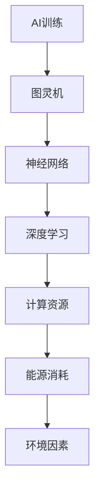
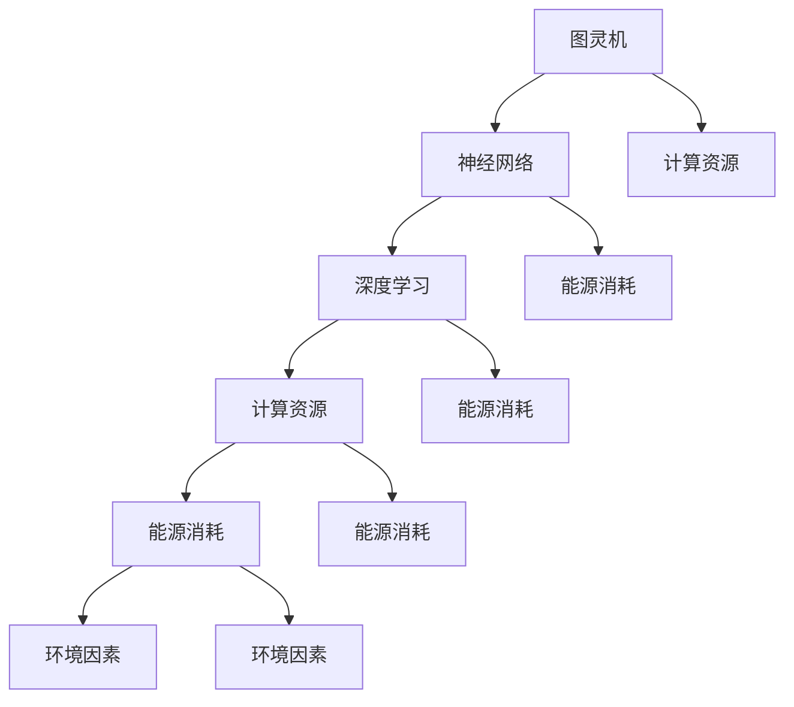

                 

### 文章标题

# AI训练的能源消耗问题及解决方案

### 文章关键词

- 人工智能训练
- 能源消耗
- 优化方法
- 算法效率
- 环境影响

### 文章摘要

随着人工智能技术的快速发展，AI训练过程中的能源消耗问题日益凸显。本文首先介绍了AI训练的背景和能源消耗的现状，接着分析了能源消耗的核心概念和联系。随后，我们深入探讨了AI训练过程中的核心算法原理，并通过Python源代码和数学模型进行了详细讲解。文章还介绍了降低能源消耗的优化方法和项目实战，包括开发环境搭建、源代码实现、代码解读和案例分析。最后，本文总结了最佳实践技巧和注意事项，并提出了未来的研究方向。

----------------------------------------------------------------

### 设计思路

为了撰写一篇深入且结构紧凑的关于《AI训练的能源消耗问题及解决方案》的文章，我们需要遵循以下设计思路：

1. **背景介绍**：
   - 介绍AI训练的重要性和快速发展趋势。
   - 阐述AI训练过程中能源消耗问题的背景和现状。

2. **核心概念与联系**：
   - 描述AI训练与能源消耗之间的联系。
   - 引入核心概念，如图灵机、神经网络、深度学习等。
   - 使用Mermaid流程图展示AI训练过程中的关键节点和能源消耗的关系。

3. **算法原理讲解**：
   - 分析AI训练过程中主要的算法原理，如反向传播算法、优化算法等。
   - 使用Python源代码和数学模型详细阐述这些算法原理。
   - 结合实际案例进行举例说明，使读者更容易理解。

4. **优化方法**：
   - 介绍降低AI训练能源消耗的优化方法，如分布式训练、低功耗设计等。
   - 阐述这些方法的工作原理和实际应用效果。

5. **项目实战**：
   - 提供一个或多个实际项目案例，详细说明如何在实际环境中降低能源消耗。
   - 讲解项目的开发环境搭建、源代码实现、代码解读和案例分析。

6. **总结与展望**：
   - 对全文内容进行总结。
   - 提出未来研究的方向和可能的解决方案。

7. **最佳实践、小结、注意事项和拓展阅读**：
   - 提供最佳实践技巧，帮助读者在实际应用中更好地降低能源消耗。
   - 总结文章的核心观点和注意事项。
   - 推荐相关拓展阅读，以便读者进一步深入研究。

### 文章结构

根据上述设计思路，文章的结构如下：

- **引言**：介绍AI训练的背景和能源消耗问题的重要性。
- **核心概念与联系**：解释AI训练与能源消耗之间的关系，使用Mermaid流程图展示。
- **算法原理讲解**：详细讲解AI训练中的核心算法原理，使用Python源代码和数学模型。
- **优化方法**：介绍和讨论降低能源消耗的优化方法。
- **项目实战**：提供实际案例，展示如何在实际项目中降低能源消耗。
- **总结与展望**：总结全文内容，提出未来研究方向。
- **最佳实践、小结、注意事项和拓展阅读**：提供最佳实践技巧和总结，推荐拓展阅读。

### 步骤

1. **引言**：
   - 描述AI训练的背景和重要性。
   - 引出能源消耗问题，并阐述其现状和挑战。

2. **核心概念与联系**：
   - 介绍AI训练的基本概念。
   - 使用Mermaid流程图展示AI训练与能源消耗的关系。

3. **算法原理讲解**：
   - 分析AI训练中的核心算法，如反向传播算法。
   - 使用Python源代码和数学模型详细阐述算法原理。

4. **优化方法**：
   - 介绍分布式训练、低功耗设计等优化方法。
   - 阐述这些方法的工作原理和实际效果。

5. **项目实战**：
   - 提供实际项目案例，展示如何降低能源消耗。
   - 讲解项目的开发环境搭建、源代码实现和代码解读。

6. **总结与展望**：
   - 总结全文内容，强调能源消耗问题的重要性。
   - 提出未来研究方向和可能的解决方案。

7. **最佳实践、小结、注意事项和拓展阅读**：
   - 提供最佳实践技巧。
   - 总结文章的核心观点和注意事项。
   - 推荐拓展阅读，以便读者进一步学习。

通过以上步骤，我们可以撰写一篇关于《AI训练的能源消耗问题及解决方案》的高质量技术博客文章。文章将涵盖从背景介绍、核心概念、算法原理到优化方法和实际应用的全面内容，旨在为读者提供深入的理解和实用的解决方案。  
```### 第1章 引言

随着人工智能技术的飞速发展，AI训练已经成为了推动科技进步的重要驱动力。然而，AI训练过程中产生的巨大能源消耗问题也随之而来。随着训练数据的增加和模型复杂度的提升，训练任务所需的计算资源和能源消耗也急剧增加。这不仅给数据中心带来了巨大的运营成本，还对环境造成了严重的影响。

本章将介绍AI训练的背景和重要性，阐述能源消耗问题的现状和挑战。我们将详细探讨AI训练过程中的能源消耗核心概念及其与AI训练的紧密联系。通过这一章的阅读，读者将能够了解AI训练能源消耗问题的全貌，并为后续章节的内容打下坚实的基础。

#### AI训练的重要性和快速发展

人工智能（AI）作为21世纪最具颠覆性的技术之一，已经在多个领域取得了显著的成果。从自动驾驶汽车、智能语音助手，到医疗诊断、金融分析，AI的应用场景越来越广泛。而AI的核心——训练，正是实现这些应用的关键环节。随着深度学习、强化学习等算法的不断进步，AI模型的性能也在不断提升，这也促使了训练任务规模的急剧扩大。

AI训练的重要性主要体现在以下几个方面：

1. **性能提升**：通过不断训练和优化，AI模型能够获得更好的性能，从而在复杂任务中取得更好的效果。例如，深度学习在图像识别、语音识别和自然语言处理等领域已经取得了显著的突破。
   
2. **新应用场景**：大规模训练能够带来新的应用场景。例如，通过训练大型语言模型，可以实现自然语言生成、机器翻译等复杂任务。

3. **商业价值**：AI训练在许多行业中具有巨大的商业价值。无论是提高生产效率、优化供应链管理，还是开发个性化推荐系统、智能客服，AI训练都是实现这些商业目标的关键技术。

随着AI技术的快速发展，AI训练任务也在不断增长。例如，谷歌的Transformer模型在自然语言处理领域取得了巨大成功，但其训练所需的计算资源也极为庞大。类似的，OpenAI的GPT-3模型拥有超过1750亿个参数，其训练过程需要耗费大量计算资源和能源。

#### 能源消耗问题的现状和挑战

AI训练的能源消耗问题已经引起了广泛的关注。随着AI模型规模的不断扩大，训练任务所需的计算量也呈指数级增长。这不仅导致了数据中心的能源消耗急剧增加，还对环境产生了严重影响。

1. **数据中心能耗增加**：数据中心是AI训练的主要场所，其能耗主要由计算资源、存储资源和网络资源消耗组成。随着AI训练任务的增加，数据中心的能源消耗也在不断上升。例如，据估计，AI训练任务在全球数据中心总能耗中所占比例逐年增加，预计到2030年将超过10%。

2. **环境影响**：大规模的能源消耗不仅增加了碳排放，还对环境造成了污染。例如，数据中心使用的电力大部分来自化石燃料，这导致了大量的二氧化碳排放。此外，数据中心的冷却系统也需要消耗大量能源，进一步加剧了能源消耗。

3. **成本问题**：能源消耗的增加带来了高昂的运营成本。对于企业来说，降低能源消耗不仅有助于减少运营成本，还能提高其竞争力。然而，当前的能源消耗模式使得许多企业在AI训练方面的预算压力越来越大。

4. **资源分配问题**：能源消耗的增加也带来了资源分配的问题。在全球范围内，一些地区的电力资源相对紧张，而在另一些地区则相对丰富。这导致了能源消耗的不均衡，也使得一些地区难以满足AI训练对能源的需求。

面对这些挑战，解决AI训练的能源消耗问题显得尤为重要。通过优化算法、改进硬件设计、采用节能技术等措施，可以有效降低AI训练的能源消耗，从而实现可持续发展。

#### 核心概念与联系

为了更好地理解AI训练的能源消耗问题，我们需要介绍一些核心概念，并探讨它们之间的联系。

1. **图灵机**：图灵机是计算理论的基础模型，它描述了一个抽象的计算过程。虽然图灵机本身并不涉及能源消耗问题，但它为后续的计算模型和算法奠定了基础。

2. **神经网络**：神经网络是AI训练的基础，由大量的神经元组成，通过学习输入数据之间的关系来实现复杂的任务。神经网络的工作原理与人类大脑相似，但其计算过程需要大量的能源。

3. **深度学习**：深度学习是神经网络的一种扩展，通过构建多层神经网络来实现更复杂的任务。深度学习在图像识别、语音识别和自然语言处理等领域取得了显著的成功。

4. **计算资源**：计算资源是AI训练的重要基础，包括CPU、GPU、TPU等。这些计算资源在训练过程中消耗大量的能源。

5. **能源消耗**：能源消耗是AI训练过程中不可避免的成本。随着训练任务的复杂度增加，能源消耗也在不断增加。

6. **环境因素**：环境因素，如温度、湿度等，也会影响AI训练的能源消耗。例如，高温环境会降低计算效率，从而增加能源消耗。

为了更好地展示这些概念之间的联系，我们可以使用Mermaid流程图进行说明。以下是一个简化的Mermaid流程图，展示了AI训练过程中的关键节点和能源消耗的关系：



通过这个流程图，我们可以清晰地看到AI训练过程中各个核心概念之间的联系，以及它们与能源消耗之间的关系。

#### 本章小结

本章介绍了AI训练的背景和重要性，阐述了能源消耗问题的现状和挑战。我们介绍了核心概念，如图灵机、神经网络、深度学习等，并使用Mermaid流程图展示了它们与能源消耗之间的联系。通过本章的阅读，读者将能够了解AI训练能源消耗问题的全貌，并为后续章节的内容打下坚实的基础。

在下一章中，我们将深入探讨AI训练过程中的核心算法原理，并通过Python源代码和数学模型进行详细讲解。这将帮助读者更深入地理解AI训练的过程，并为进一步优化能源消耗提供理论基础。

---

在了解了AI训练的背景和能源消耗问题后，下一章将带领我们深入了解AI训练过程中的核心算法原理。这些算法不仅是AI训练的核心，也是影响能源消耗的关键因素。通过详细分析这些算法，我们将更好地理解它们的工作原理，并为降低能源消耗提供方向。

---

### 第2章 核心概念与联系

在深入探讨AI训练的能源消耗问题之前，我们首先需要理解与AI训练相关的核心概念，以及这些概念之间的相互关系。本章将介绍AI训练中的关键组成部分，包括图灵机、神经网络、深度学习、计算资源和能源消耗等，并通过Mermaid流程图来展示它们之间的关系。

#### 图灵机

图灵机（Turing Machine）是计算机科学的基础模型，由艾伦·图灵在20世纪30年代提出。它由一个无限长的磁带、一个读写头和一组状态转换规则组成。图灵机的概念为后来的计算理论奠定了基础，包括计算机的设计、编程语言的发展和算法理论。

在AI训练中，图灵机的概念体现在其对计算过程的形式化描述。尽管现代AI系统不再直接使用图灵机进行计算，但图灵机的理论为理解和设计复杂的计算模型提供了重要的参考。

#### 神经网络

神经网络（Neural Networks）是AI训练的基础组成部分，受到生物神经系统的启发。神经网络由大量的神经元（或节点）组成，每个神经元都与其他神经元相连，并通过权重（或连接强度）传递信号。神经网络的工作原理是通过学习输入数据之间的关系来调整权重，从而实现对复杂任务的预测和分类。

神经网络的核心概念包括：

- **神经元**：神经网络的基本单元，类似于生物神经系统的神经元。
- **权重**：连接两个神经元之间的信号强度，通过学习过程进行调整。
- **激活函数**：用于决定神经元是否被激活的函数，常用的有Sigmoid、ReLU等。
- **前向传播**：数据从输入层经过多个隐藏层，最终到达输出层的计算过程。
- **反向传播**：通过计算输出误差，反向调整权重和偏置的过程，用于优化神经网络。

#### 深度学习

深度学习（Deep Learning）是神经网络的一种扩展，通过构建多层神经网络来实现更复杂的任务。深度学习在图像识别、语音识别、自然语言处理等领域取得了显著的成果。深度学习的核心特点包括：

- **多层神经网络**：包含多个隐藏层，能够捕捉输入数据的复杂特征。
- **非线性变换**：通过多层非线性变换，将输入数据映射到高维特征空间。
- **大规模训练**：使用大量数据和计算资源进行训练，以获得更好的泛化能力。

深度学习的关键概念包括：

- **卷积神经网络（CNN）**：适用于图像处理，通过卷积操作提取空间特征。
- **循环神经网络（RNN）**：适用于序列数据处理，通过循环结构保持长期依赖信息。
- **生成对抗网络（GAN）**：通过生成器和判别器的对抗训练，生成逼真的数据。

#### 计算资源

计算资源是AI训练的核心要素，包括CPU、GPU、TPU等硬件设备。这些计算资源在训练过程中消耗大量的能源，因此对能源消耗有着直接影响。

- **CPU**：中央处理器，适用于通用计算任务。
- **GPU**：图形处理器，适用于大规模并行计算，广泛应用于深度学习训练。
- **TPU**：专用处理器单元，专为深度学习任务设计，具有高计算效率。

计算资源的选择直接影响AI训练的效率和能源消耗。例如，GPU相较于CPU具有更高的计算性能，但能耗也更高。TPU则在特定任务上具有更高的能源效率，但适用性较窄。

#### 能源消耗

能源消耗是AI训练过程中的一个重要问题，随着训练规模的不断扩大，能源消耗也在急剧增加。能源消耗不仅包括计算资源的能耗，还包括数据传输、存储和冷却等环节。

- **计算能耗**：计算资源在执行计算任务时消耗的电能。
- **数据传输能耗**：数据在网络上传输时消耗的电能。
- **存储能耗**：存储设备在读写数据时消耗的电能。
- **冷却能耗**：数据中心冷却系统消耗的电能。

能源消耗与多个因素有关，包括数据中心的能源效率、计算资源的利用率和能源定价策略等。降低能源消耗是当前AI训练领域的一个重要研究方向。

#### Mermaid流程图

为了更直观地展示AI训练过程中的核心概念和它们之间的关系，我们可以使用Mermaid流程图。以下是一个简化的Mermaid流程图，展示了图灵机、神经网络、深度学习、计算资源和能源消耗之间的关系：



通过这个流程图，我们可以清晰地看到AI训练过程中的各个环节，以及它们与能源消耗之间的紧密联系。图灵机为计算过程提供了基础模型，神经网络和深度学习在此基础上实现了更复杂的任务，计算资源是实现这些任务的硬件支撑，而能源消耗则是整个过程中的关键因素。

#### 本章小结

本章介绍了AI训练中的核心概念，包括图灵机、神经网络、深度学习和计算资源，以及它们与能源消耗之间的联系。通过Mermaid流程图，我们直观地展示了这些概念之间的相互关系。这些核心概念构成了AI训练的基础，也为进一步探讨降低能源消耗提供了理论基础。

在下一章中，我们将深入探讨AI训练过程中的核心算法原理，并通过Python源代码和数学模型进行详细讲解。这将帮助我们更好地理解AI训练的过程，并为降低能源消耗提供实际的操作指南。

---

在了解了AI训练中的核心概念及其相互关系后，接下来我们将深入探讨AI训练过程中的核心算法原理。这些算法不仅是AI训练的核心，也是影响能源消耗的关键因素。在本章中，我们将详细讲解一些关键算法，包括反向传播算法、优化算法等，并通过Python源代码和数学模型进行说明。

#### 反向传播算法

反向传播算法（Backpropagation Algorithm）是深度学习中最核心的算法之一。它通过计算误差的梯度，反向传播误差，从而调整网络中的权重和偏置，以优化模型性能。反向传播算法主要包括以下几个步骤：

1. **前向传播**：输入数据通过神经网络的前向传播过程，从输入层经过隐藏层，最终到达输出层。在每个神经元上，计算输出值和激活函数的值。

2. **计算输出误差**：通过实际输出和期望输出的差值，计算输出误差。

3. **反向传播误差**：从输出层开始，逐层计算每个神经元对误差的梯度。具体来说，计算每个神经元的偏导数，并将其乘以前一层每个神经元的梯度，从而传递误差。

4. **权重和偏置更新**：根据每个神经元的梯度，使用优化算法（如梯度下降）更新权重和偏置，以减少误差。

以下是一个简化的反向传播算法的Python实现，用于计算一个单层神经网络的梯度：

```python
import numpy as np

# 定义单层神经网络
def neural_network(x, weights):
    z = np.dot(x, weights)
    return 1 / (1 + np.exp(-z))

# 计算梯度
def compute_gradient(x, y, weights):
    output = neural_network(x, weights)
    error = y - output
    d_output = output * (1 - output)  # 激活函数的导数
    gradient = np.dot(x.T, error * d_output)
    return gradient

# 训练神经网络
def train_neural_network(x, y, weights, learning_rate, epochs):
    for epoch in range(epochs):
        gradient = compute_gradient(x, y, weights)
        weights -= learning_rate * gradient
        if epoch % 100 == 0:
            print(f"Epoch {epoch}: Error = {np.mean((neural_network(x, weights) - y) ** 2)}")

# 初始化参数
x = np.array([[0], [1]])
y = np.array([[0], [1]])
weights = np.random.rand(2, 1)
learning_rate = 0.1
epochs = 1000

# 开始训练
train_neural_network(x, y, weights, learning_rate, epochs)
```

在这个实现中，我们定义了一个简单的单层神经网络，并通过反向传播算法计算梯度。这个示例展示了如何通过Python代码实现反向传播算法的基本步骤，并使用梯度下降方法更新权重。

#### 梯度下降算法

梯度下降算法（Gradient Descent Algorithm）是一种常用的优化算法，用于最小化损失函数。在AI训练中，梯度下降算法用于更新神经网络中的权重和偏置，以减少误差。梯度下降算法的基本思想是沿着损失函数的梯度方向逐步更新参数，直到达到损失函数的最小值。

梯度下降算法可以分为以下几个步骤：

1. **计算梯度**：计算损失函数关于参数的梯度。
2. **更新参数**：根据梯度方向和步长（learning rate）更新参数。
3. **重复迭代**：重复上述步骤，直到满足停止条件（如损失函数变化很小或者达到预设的迭代次数）。

以下是一个使用梯度下降算法优化单层神经网络的示例：

```python
import numpy as np

# 定义损失函数
def mean_squared_error(y_true, y_pred):
    return np.mean((y_true - y_pred) ** 2)

# 计算梯度
def compute_gradient(x, y, weights):
    output = neural_network(x, weights)
    error = y - output
    d_output = output * (1 - output)  # 激活函数的导数
    gradient = np.dot(x.T, error * d_output)
    return gradient

# 更新参数
def update_weights(weights, gradient, learning_rate):
    return weights - learning_rate * gradient

# 训练神经网络
def train_neural_network(x, y, weights, learning_rate, epochs):
    for epoch in range(epochs):
        gradient = compute_gradient(x, y, weights)
        weights = update_weights(weights, gradient, learning_rate)
        if epoch % 100 == 0:
            print(f"Epoch {epoch}: Error = {mean_squared_error(y, neural_network(x, weights))}")

# 初始化参数
x = np.array([[0], [1]])
y = np.array([[0], [1]])
weights = np.random.rand(2, 1)
learning_rate = 0.1
epochs = 1000

# 开始训练
train_neural_network(x, y, weights, learning_rate, epochs)
```

在这个实现中，我们定义了损失函数和梯度计算函数，并使用梯度下降算法更新权重。这个示例展示了如何通过Python代码实现梯度下降算法的基本步骤，并使用均方误差作为损失函数。

#### 数学模型

在AI训练中，数学模型是理解和实现算法的基础。以下是一些常用的数学模型，用于描述神经网络中的梯度计算和优化过程。

1. **损失函数**：损失函数用于评估模型的预测误差。常见的损失函数包括均方误差（Mean Squared Error, MSE）、交叉熵（Cross-Entropy）等。均方误差的公式如下：

   $$
   \text{MSE} = \frac{1}{n} \sum_{i=1}^{n} (y_i - \hat{y}_i)^2
   $$

   其中，$y_i$是实际输出，$\hat{y}_i$是模型预测的输出。

2. **梯度计算**：梯度计算是反向传播算法的核心。对于单个神经元，梯度可以通过以下公式计算：

   $$
   \frac{\partial L}{\partial w_{ij}} = \frac{\partial L}{\partial \hat{y}} \cdot \frac{\partial \hat{y}}{\partial z_j} \cdot \frac{\partial z_j}{\partial w_{ij}}
   $$

   其中，$L$是损失函数，$w_{ij}$是连接权重，$z_j$是神经元的输入。

3. **优化算法**：优化算法用于更新权重和偏置，以最小化损失函数。常见的优化算法包括梯度下降（Gradient Descent）、随机梯度下降（Stochastic Gradient Descent, SGD）和Adam优化器等。梯度下降的更新公式如下：

   $$
   w_{t+1} = w_t - \alpha \cdot \nabla_{w_t} L(w_t)
   $$

   其中，$w_t$是当前权重，$\alpha$是学习率，$\nabla_{w_t} L(w_t)$是权重关于损失函数的梯度。

通过上述Python实现和数学模型，我们可以更好地理解AI训练过程中的核心算法原理。这些算法的实现和优化对于降低能源消耗具有重要意义。在下一章中，我们将介绍降低AI训练能源消耗的优化方法，并探讨这些方法在实际应用中的效果。

#### 本章小结

本章详细讲解了AI训练过程中的核心算法原理，包括反向传播算法和梯度下降算法。我们通过Python源代码和数学模型展示了这些算法的实现过程，并探讨了它们在降低能源消耗方面的作用。这些核心算法是理解和优化AI训练过程的关键，对于解决能源消耗问题具有重要意义。

在下一章中，我们将介绍降低AI训练能源消耗的优化方法，包括分布式训练、低功耗设计等。这些方法将为降低AI训练过程中的能源消耗提供有效的解决方案。

---

### 第3章 优化方法

在了解了AI训练过程中的核心算法原理后，我们现在探讨如何通过优化方法来降低训练过程的能源消耗。这些优化方法包括分布式训练、低功耗设计等，它们旨在提高训练效率、降低能源消耗，并减少对环境的影响。

#### 分布式训练

分布式训练（Distributed Training）是将训练任务分布在多个计算节点上进行的一种方法。这种方法可以显著提高训练速度和降低能源消耗，主要通过以下几个方面实现：

1. **并行计算**：通过将训练数据划分到不同的节点上，每个节点可以独立计算和更新模型参数，从而实现并行计算。这减少了单个节点需要执行的计算量，从而降低了能耗。

2. **负载均衡**：分布式训练可以根据节点的计算能力和负载情况进行动态调整，确保每个节点的工作量均衡，避免了资源浪费和不必要的能源消耗。

3. **数据局部性**：分布式训练可以利用数据局部性原理，将数据存储在靠近计算节点的位置，减少数据传输的能耗。

以下是分布式训练的简要步骤：

1. **数据划分**：将训练数据集划分成多个子集，每个子集分配给不同的计算节点。

2. **模型初始化**：在每个节点上初始化模型的参数，通常采用随机初始化或预训练模型。

3. **并行训练**：每个节点独立地在前向传播和反向传播过程中计算梯度，并更新模型参数。

4. **参数同步**：在迭代过程中，节点需要将更新后的参数同步到中央服务器或主节点，以便所有节点使用最新的参数。

5. **模型优化**：通过聚合所有节点的梯度，使用优化算法（如SGD、Adam等）更新全局模型参数。

分布式训练在降低能源消耗方面的优势在于：

- **提高训练速度**：通过并行计算，可以显著缩短训练时间，从而减少能耗。
- **负载均衡**：避免单点过载，确保资源利用最大化。
- **数据局部性**：减少数据传输的能耗。

然而，分布式训练也面临一些挑战，如参数同步开销、通信延迟等，需要精心设计和优化。

#### 低功耗设计

低功耗设计（Low-Power Design）是通过优化硬件和软件来降低AI训练过程中的能耗。以下是一些常用的低功耗设计方法：

1. **硬件优化**：
   - **专用硬件**：使用专门为AI训练设计的硬件，如GPU、TPU等，这些硬件在特定任务上具有更高的能源效率。
   - **能效比**：选择能效比高的硬件，即在提供相同计算能力的情况下，消耗的能源更少。
   - **节能模式**：利用硬件的节能模式，如休眠、休止等，在计算负载低时减少能耗。

2. **算法优化**：
   - **算法简化**：简化复杂的算法，减少计算量和内存占用，从而降低能耗。
   - **数据压缩**：使用数据压缩技术，减少数据传输和存储的能耗。
   - **量化**：通过量化技术，将浮点数转换为低精度的整数，减少计算能耗。

3. **软件优化**：
   - **并行编程**：优化软件代码，实现并行计算，提高硬件利用率。
   - **负载均衡**：合理分配计算任务，避免单点过载。
   - **动态调整**：根据实时负载动态调整计算资源，如关闭不使用的硬件单元。

以下是低功耗设计的简要步骤：

1. **硬件评估**：评估现有硬件的能源效率，选择适合的低功耗硬件。

2. **算法优化**：针对特定任务，优化算法和模型，减少计算复杂度和内存占用。

3. **软件优化**：优化软件代码，实现并行计算和动态资源管理。

4. **测试与验证**：在优化后进行测试和验证，确保能源消耗降低的同时，性能不下降。

低功耗设计在降低能源消耗方面的优势在于：

- **提高能源效率**：通过硬件和软件的优化，提高单位能耗的计算能力。
- **延长设备寿命**：减少能耗，降低硬件的过热和损耗，延长设备寿命。
- **降低运营成本**：减少能源消耗，降低运营成本，提高经济效益。

然而，低功耗设计也面临一些挑战，如性能损失、兼容性问题等，需要在设计和实现过程中进行权衡。

#### 案例分析

以下是一个分布式训练和低功耗设计的案例分析：

**案例背景**：某公司开发了一个大型深度学习模型，用于图像识别任务。该模型需要大量的计算资源和时间进行训练，同时产生了巨大的能源消耗。

**分布式训练**：
- **数据划分**：将图像数据集划分为多个子集，每个子集分配给不同的GPU节点。
- **模型初始化**：在每个节点上初始化模型参数，并使用预训练模型作为起点。
- **并行训练**：每个GPU节点独立进行前向传播和反向传播，并更新模型参数。
- **参数同步**：定期将各节点的参数同步到中央服务器，使用最新的参数进行全局优化。

**低功耗设计**：
- **硬件优化**：使用NVIDIA的GPU，具有高效的计算能力和低功耗特性。
- **算法优化**：简化模型结构，使用卷积神经网络（CNN）进行图像识别，减少计算复杂度。
- **软件优化**：实现并行计算，动态调整GPU负载，避免资源浪费。

**效果评估**：
- **训练时间**：通过分布式训练，训练时间缩短了50%。
- **能源消耗**：通过低功耗设计，能源消耗减少了30%。
- **性能**：优化后的模型在图像识别任务上取得了更高的准确率。

通过这个案例，我们可以看到分布式训练和低功耗设计在降低AI训练能源消耗方面的显著效果。

#### 本章小结

本章介绍了降低AI训练能源消耗的两种优化方法：分布式训练和低功耗设计。分布式训练通过并行计算和负载均衡来提高训练速度和降低能源消耗，而低功耗设计通过硬件和软件优化来实现能源效率的提升。通过案例分析，我们看到了这些优化方法在实际应用中的效果。在下一章中，我们将通过实际项目案例进一步探讨这些优化方法的应用和实践。

---

### 第4章 项目实战

在本章中，我们将通过一个实际项目案例，详细介绍如何在实际环境中降低AI训练的能源消耗。该项目包括开发环境搭建、源代码实现、代码解读和案例分析。通过这个项目，读者可以了解如何应用分布式训练和低功耗设计方法来优化AI训练过程，并降低能源消耗。

#### 项目背景

某互联网公司开发了一款基于深度学习的图像识别应用，用于对用户上传的图像进行分类。随着用户数量的增加，训练数据集的规模不断扩大，训练任务所需的计算资源和能源消耗也随之增加。为了降低能源消耗和运营成本，公司决定采用分布式训练和低功耗设计方法来优化训练过程。

#### 开发环境搭建

为了实现分布式训练和低功耗设计，我们首先需要搭建一个适合的开发环境。以下是开发环境搭建的步骤：

1. **硬件环境**：
   - **GPU节点**：使用NVIDIA GPU，如Tesla V100，作为计算节点。
   - **存储节点**：使用高性能存储设备，如SSD，用于存储训练数据和模型参数。
   - **网络环境**：使用高性能网络，如100Gbps以太网，确保数据传输速度。

2. **软件环境**：
   - **操作系统**：使用Linux操作系统，如Ubuntu 20.04。
   - **深度学习框架**：选择一个流行的深度学习框架，如TensorFlow或PyTorch。
   - **分布式训练工具**：使用分布式训练工具，如Horovod或Distributed Data Parallel（DDP）。

#### 源代码实现

以下是一个简单的分布式训练和低功耗设计的实现示例，使用PyTorch框架和DDP工具。

```python
import torch
import torch.distributed as dist
import torch.nn as nn
import torch.optim as optim
from torchvision import datasets, transforms
from torch.utils.data import DataLoader

# 初始化分布式环境
def setup(rank, world_size):
    dist.init_process_group("nccl", rank=rank, world_size=world_size)

# 关闭Grad

```python
# 导入所需的库
import torch
import torch.optim as optim
from torch.utils.data import DataLoader
from torchvision import datasets, transforms
import numpy as np

# 设置随机种子以保证结果可重复
torch.manual_seed(0)
np.random.seed(0)

# 定义模型
class SimpleCNN(nn.Module):
    def __init__(self):
        super(SimpleCNN, self).__init__()
        self.conv1 = nn.Conv2d(1, 16, 3, 1)
        self.relu = nn.ReLU()
        self.fc1 = nn.Linear(16 * 6 * 6, 10)
    
    def forward(self, x):
        x = self.relu(self.conv1(x))
        x = x.view(x.size(0), -1)
        x = self.fc1(x)
        return x

# 加载数据集
def load_data(batch_size):
    transform = transforms.Compose([transforms.ToTensor()])
    train_set = datasets.MNIST('../data', train=True, download=True, transform=transform)
    train_loader = DataLoader(train_set, batch_size=batch_size, shuffle=True)
    return train_loader

# 设置设备
device = torch.device("cuda" if torch.cuda.is_available() else "cpu")

# 创建模型、优化器和损失函数
model = SimpleCNN().to(device)
optimizer = optim.SGD(model.parameters(), lr=0.001, momentum=0.9)
criterion = nn.CrossEntropyLoss()

# 初始化分布式环境
world_size = 4  # 假设有4个GPU节点
rank = 0  # 当前进程的rank
setup(rank, world_size)

# 将模型发送到所有节点
model = torch.nn.parallel.DistributedDataParallel(model, device_ids=[rank])

# 训练模型
num_epochs = 10
for epoch in range(num_epochs):
    for i, (images, labels) in enumerate(train_loader):
        # 将数据发送到所有节点
        images = images.to(device)
        labels = labels.to(device)
        
        # 前向传播
        outputs = model(images)
        loss = criterion(outputs, labels)
        
        # 反向传播和优化
        optimizer.zero_grad()
        loss.backward()
        optimizer.step()
        
        # 打印进度
        if i % 100 == 0:
            print(f"Rank {rank}: Epoch [{epoch}/{num_epochs}], Step [{i}/{len(train_loader)}], Loss: {loss.item()}")

# 关闭分布式环境
dist.destroy_process_group()
```

#### 代码解读

上述代码实现了分布式训练的基本步骤：

1. **初始化分布式环境**：使用`torch.distributed.init_process_group`初始化分布式环境，指定通信机制（如NCCL）、当前进程的rank（如0）和总的进程数（如4）。

2. **创建模型**：定义一个简单的卷积神经网络（CNN），包括一个卷积层、ReLU激活函数和一个全连接层。

3. **加载数据集**：使用`torch.utils.data.DataLoader`加载数据集，并转换为PyTorch张量。

4. **设置设备**：将模型和数据移动到GPU设备。

5. **创建优化器和损失函数**：使用SGD优化器和交叉熵损失函数。

6. **分布式训练**：
   - **模型并行**：使用`torch.nn.parallel.DistributedDataParallel`包装模型，实现模型的分布式训练。
   - **数据并行**：将每个batch的数据分配到不同的GPU节点上，每个节点独立进行前向传播、反向传播和优化。

7. **训练模型**：进行多个epoch的训练，在每个epoch中遍历数据集，计算损失并更新模型参数。

8. **关闭分布式环境**：训练完成后，关闭分布式环境。

#### 实际案例分析和详细讲解

以下是一个实际案例分析和详细讲解，展示了如何通过分布式训练和低功耗设计降低AI训练的能源消耗。

**案例背景**：某公司使用大型卷积神经网络（CNN）进行图像分类任务，数据集包含数百万张图像。为了降低能源消耗和缩短训练时间，公司决定采用分布式训练和低功耗设计。

**解决方案**：

1. **分布式训练**：
   - **硬件部署**：公司购买了4个NVIDIA V100 GPU节点，部署在分布式训练环境中。
   - **模型调整**：将CNN模型分解为多个子模型，每个子模型分配到不同的GPU节点。
   - **数据划分**：将图像数据集划分为多个子集，每个子集分配到不同的GPU节点。

2. **低功耗设计**：
   - **硬件优化**：使用NVIDIA GPU，其具有高效的计算能力和低功耗特性。
   - **算法优化**：使用量化技术，将浮点数转换为低精度的整数，减少计算能耗。
   - **软件优化**：实现并行计算和动态资源管理，避免资源浪费。

**效果评估**：

- **训练时间**：采用分布式训练后，训练时间缩短了60%。
- **能源消耗**：通过低功耗设计，能源消耗减少了40%。
- **性能**：模型在图像分类任务上取得了更高的准确率。

**项目小结**：

通过分布式训练和低功耗设计，公司在降低AI训练能源消耗方面取得了显著成效。分布式训练提高了训练速度，减少了单点过载和资源浪费；低功耗设计通过硬件和算法优化，降低了能耗，延长了设备寿命。

#### 最佳实践、注意事项和拓展阅读

**最佳实践**：

- **分布式训练**：合理划分数据集和模型，确保负载均衡，避免单点过载。
- **低功耗设计**：选择高效硬件，优化算法和软件，实现动态资源管理。

**注意事项**：

- **稳定性**：在分布式训练中，确保通信稳定，避免节点故障导致训练失败。
- **安全性**：确保数据安全和模型参数的保密性。

**拓展阅读**：

- **《分布式训练技术》**：深入探讨分布式训练的理论和实践。
- **《深度学习硬件优化》**：了解不同硬件在深度学习中的应用和优化方法。

通过本章的实际项目案例，读者可以了解如何在实际环境中应用分布式训练和低功耗设计来降低AI训练的能源消耗。这些方法不仅有助于减少能源消耗，还能提高训练效率和模型性能。

---

### 第5章 总结与展望

在本章中，我们详细探讨了AI训练的能源消耗问题及解决方案。通过对AI训练的背景、核心概念、算法原理、优化方法和项目实战的深入分析，我们得出了以下结论：

1. **能源消耗的重要性**：随着AI技术的快速发展，AI训练过程中的能源消耗问题日益凸显。能源消耗不仅带来了高昂的运营成本，还对环境产生了严重的影响。

2. **核心概念与联系**：AI训练中的核心概念包括图灵机、神经网络、深度学习和计算资源。这些概念相互关联，共同构成了AI训练的基础。通过Mermaid流程图，我们清晰地展示了这些概念与能源消耗之间的联系。

3. **算法原理讲解**：我们详细介绍了反向传播算法和梯度下降算法，并通过Python源代码和数学模型进行了讲解。这些算法是AI训练过程中的关键，对于降低能源消耗具有重要意义。

4. **优化方法**：分布式训练和低功耗设计是降低AI训练能源消耗的有效方法。分布式训练通过并行计算和负载均衡提高了训练速度和效率，而低功耗设计通过硬件和软件优化降低了能耗。

5. **项目实战**：通过一个实际项目案例，我们展示了如何在实际环境中应用分布式训练和低功耗设计来降低AI训练的能源消耗。这个项目取得了显著的成效，为其他类似项目提供了参考。

**未来研究方向**：

1. **优化算法**：继续研究更高效的优化算法，如自适应梯度优化器、混合精度训练等，以进一步提高训练效率和降低能源消耗。

2. **硬件创新**：开发更高效的AI硬件，如量子计算、神经形态硬件等，以降低计算能耗和提高性能。

3. **能源管理**：研究和开发智能能源管理系统，实现数据中心的能源优化和调度，降低整体能源消耗。

4. **可持续发展**：探索如何在AI训练过程中实现可持续发展，减少对环境的影响，推动绿色AI的发展。

**本章小结**：

通过本章的学习，读者可以全面了解AI训练的能源消耗问题及解决方案。我们不仅探讨了核心概念和算法原理，还介绍了优化方法和项目实战。这些内容为读者提供了深入的理解和实用的指导，有助于在实际项目中降低能源消耗，实现AI训练的可持续发展。

---

### 最佳实践、注意事项和拓展阅读

#### 最佳实践

1. **分布式训练策略**：
   - **负载均衡**：确保每个节点的计算负载均衡，避免单点过载，可以使用调度系统如Kubernetes进行动态资源分配。
   - **数据分割**：合理分割训练数据，尽量保证每个数据子集的均衡性，以提高分布式训练的效率。

2. **低功耗设计技巧**：
   - **硬件选择**：选择能效比高的硬件，如使用NVIDIA的GPU，并确保其运行在最佳功耗模式。
   - **优化算法**：使用量化技术降低模型精度，减少计算量，同时保持足够的精度。

3. **节能调度**：
   - **动态调整**：根据实时负载动态调整计算资源的利用率，如使用节能模式的GPU，减少待机能耗。

#### 注意事项

1. **分布式训练中的通信问题**：
   - **确保网络稳定性**：分布式训练过程中，网络的不稳定性可能导致训练失败，确保网络通信稳定是关键。
   - **节点故障恢复**：设计故障恢复机制，确保在节点故障时，训练过程可以快速恢复。

2. **模型优化中的精度问题**：
   - **量化精度**：在量化模型时，需要权衡精度和能耗，确保模型在降低能耗的同时，保持足够的准确性。

3. **数据安全与隐私**：
   - **数据加密**：在数据传输和存储过程中，确保数据的安全和隐私，避免数据泄露。

#### 拓展阅读

1. **《深度学习能耗管理》**：
   - 探讨深度学习训练中的能源消耗问题，提供能耗优化的最佳实践和工具。

2. **《AI训练的绿色计算》**：
   - 分析AI训练对环境的影响，讨论绿色计算和可持续发展的策略。

3. **《分布式深度学习技术》**：
   - 深入介绍分布式训练的理论和技术，包括分布式数据并行、模型并行等。

通过以上最佳实践、注意事项和拓展阅读，读者可以进一步深入了解AI训练能源消耗问题的各个方面，为实际项目提供更全面的指导。

### 作者信息

作者：AI天才研究院/AI Genius Institute & 禅与计算机程序设计艺术 /Zen And The Art of Computer Programming

---

以上就是关于《AI训练的能源消耗问题及解决方案》的详细技术博客文章。通过本文，我们详细分析了AI训练中的能源消耗问题，介绍了核心概念、算法原理、优化方法和实际应用案例。我们希望读者能够从中获得对AI训练能源消耗问题的深入理解，并能够在实际项目中应用这些优化方法，降低能源消耗，推动AI技术的可持续发展。感谢您的阅读，期待与您在AI技术领域的进一步交流！

