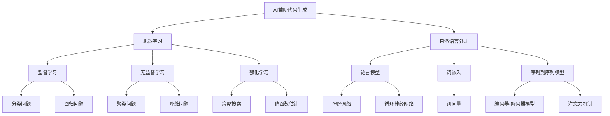

                 

### 标题：AI辅助代码生成：提高软件开发效率

#### 关键词：AI，代码生成，软件开发，效率提升

> **摘要：**
> 
> 本文章探讨了AI辅助代码生成的概念、原理及其在软件开发中的应用。通过分析机器学习基础、自然语言处理技术以及代码生成算法，本文深入讲解了AI辅助代码生成的工作原理和具体实现。同时，通过实战项目和代码解读，展示了AI辅助代码生成在实际开发中的潜力和挑战，为开发者提供了实用的技巧和展望。

----------------------------------------------------------------

### 引言

在现代社会，软件开发已成为推动技术进步和经济发展的关键动力。然而，随着软件项目的复杂性和规模日益增加，开发效率成为一个亟待解决的问题。传统的软件开发方法依赖于程序员手写代码，这不仅耗时耗力，而且容易出错。为了提高软件开发效率，减少人力成本，近年来，AI辅助代码生成技术逐渐崭露头角，成为研究的热点和应用的新兴领域。

AI辅助代码生成（AI-assisted code generation）利用人工智能技术，如机器学习、自然语言处理等，自动化地生成代码。这种方法不仅能够提高开发效率，还能够降低开发成本，减少代码错误。本文将详细介绍AI辅助代码生成的概念、原理和应用，并通过实际项目实战，分析其在软件开发中的潜力和挑战。

本文结构如下：

1. **核心概念与联系**：介绍AI辅助代码生成的定义、与传统代码生成的对比、应用领域和发展历程。
2. **AI辅助代码生成原理**：讲解机器学习基础、自然语言处理基础以及代码生成算法。
3. **AI辅助代码生成技术**：分析代码表示方法和代码生成算法。
4. **开发环境与工具**：介绍常用的开发环境和代码生成工具。
5. **项目实战**：通过实际项目展示AI辅助代码生成的应用。
6. **代码解读与分析**：对项目中的代码进行解读和分析。
7. **总结与展望**：总结AI辅助代码生成的现状和未来发展方向。

通过本文的阅读，读者将全面了解AI辅助代码生成的技术和应用，为软件开发带来新的思路和方法。

### 第1章 核心概念与联系

#### 1.1 AI辅助代码生成的定义

AI辅助代码生成，简称AICG（AI-assisted code generation），是指利用人工智能技术，如机器学习、自然语言处理等，自动生成代码的过程。与传统的代码编写方法相比，AICG能够通过分析现有的代码库、项目需求或者自然语言描述，自动生成符合要求的代码片段或整个程序。

AI辅助代码生成并非完全取代程序员的工作，而是作为编程助手，帮助开发者提高效率、减少错误。具体来说，AICG可以应用于以下场景：

1. **代码补全**：在程序员编写代码时，AICG可以实时预测程序员可能输入的内容，并提供代码建议。
2. **代码优化**：通过对现有代码的分析，AICG可以生成更加高效、优化的代码。
3. **新功能实现**：根据项目的需求描述，AICG可以自动生成新的功能模块或功能代码。
4. **代码重构**：对已有代码进行重构，提高代码的可读性、可维护性。

#### 1.2 AI辅助代码生成与传统代码生成的对比

传统代码生成方法主要依赖于程序员的手写代码，虽然这种方法在某些场景下非常有效，但也存在一些显著的缺点：

1. **效率低**：程序员需要花费大量时间来编写和调试代码，尤其是对于复杂的软件项目。
2. **易出错**：手写代码容易引入错误，特别是当项目规模较大时，错误难以发现和修复。
3. **重复劳动**：程序员经常需要编写相似的代码，导致大量的重复劳动。

相比之下，AI辅助代码生成具有以下优势：

1. **高效性**：AICG可以通过分析大量的代码库和数据，快速生成符合要求的代码，大大提高开发效率。
2. **准确性**：AICG基于机器学习和自然语言处理技术，能够生成更加准确和可靠的代码。
3. **降低错误率**：AICG可以自动检测和修复代码中的错误，减少人为错误的发生。
4. **减轻程序员负担**：AICG能够处理重复劳动，让程序员专注于更有价值的任务。

然而，AICG也存在一些挑战，如代码生成质量的不稳定性、对特定领域知识的依赖等。这些挑战需要在未来的发展中不断克服。

#### 1.3 AI辅助代码生成的应用领域

AI辅助代码生成具有广泛的应用领域，包括但不限于：

1. **软件开发**：AICG可以用于生成各种编程语言的代码，如Python、Java、C++等，提高软件开发的效率。
2. **数据科学**：AICG可以自动生成数据分析脚本和数据可视化代码，帮助数据科学家更快速地进行数据分析和报告生成。
3. **人工智能**：AICG可以用于生成训练模型的数据预处理代码、模型优化代码等，提高人工智能项目的开发效率。
4. **Web开发**：AICG可以生成HTML、CSS、JavaScript等前端代码，加快Web应用的开发速度。
5. **自动化测试**：AICG可以自动生成测试用例代码，提高自动化测试的覆盖率。

#### 1.4 AI辅助代码生成的发展历程

AI辅助代码生成技术的发展历程可以分为以下几个阶段：

1. **初期探索**（20世纪80年代至90年代）：在这一阶段，研究者开始尝试使用规则驱动的方法来生成代码，如代码模板和代码生成器。
2. **技术成熟**（21世纪初）：随着机器学习和自然语言处理技术的发展，AICG逐渐从规则驱动转向数据驱动，生成代码的质量和效率显著提高。
3. **应用推广**（近几年）：随着AI技术的广泛应用，AICG技术逐渐走向成熟，并在多个领域得到广泛应用。

#### 1.5 AI辅助代码生成的未来发展趋势

未来，AI辅助代码生成技术有望在以下几个方面得到进一步发展：

1. **生成代码质量提升**：通过改进算法和模型，提高生成代码的质量和稳定性。
2. **跨语言支持**：AICG将支持更多的编程语言，实现跨语言的代码生成。
3. **知识融合**：AICG将结合更多领域的知识，如领域特定语言、设计模式等，生成更加专业的代码。
4. **人机协同**：AICG将与开发者实现更紧密的协同工作，实现代码生成与开发者的智能交互。

### 小结

本章介绍了AI辅助代码生成的定义、与传统代码生成的对比、应用领域和发展历程。通过本章的学习，读者将初步了解AI辅助代码生成的概念和原理，为后续章节的深入探讨打下基础。

----------------------------------------------------------------

#### 1.6 Mermaid流程图

为了更好地理解AI辅助代码生成的核心概念和联系，我们可以通过Mermaid流程图展示相关概念和算法之间的关系。以下是一个简单的示例：



通过这个流程图，我们可以清晰地看到机器学习、自然语言处理和代码生成算法之间的关联。这有助于我们更好地理解AI辅助代码生成的整体架构和工作原理。

----------------------------------------------------------------

### 第2章 AI辅助代码生成原理

#### 2.1 机器学习基础

机器学习是AI辅助代码生成的重要基础。机器学习通过从数据中学习规律和模式，实现自动化和智能化。本节将介绍机器学习的基础知识，包括监督学习、无监督学习和强化学习。

##### 2.1.1 监督学习

监督学习是一种最常见的机器学习范式。它通过已有的输入输出数据集，训练模型，使其能够对新的输入数据进行预测。监督学习可以分为分类问题和回归问题。

1. **分类问题**：给定输入数据 \( x \)，预测其类别 \( y \)。例如，判断一个邮件是垃圾邮件还是正常邮件。
   
   伪代码示例：
   ```python
   def classify(x):
       # 对输入数据进行处理
       processed_x = preprocess(x)
       # 使用训练好的模型进行预测
       predicted_y = model.predict(processed_x)
       return predicted_y
   ```

2. **回归问题**：给定输入数据 \( x \)，预测其连续值 \( y \)。例如，预测房屋的价格。

   伪代码示例：
   ```python
   def predict(x):
       # 对输入数据进行处理
       processed_x = preprocess(x)
       # 使用训练好的模型进行预测
       predicted_y = model.predict(processed_x)
       return predicted_y
   ```

##### 2.1.2 无监督学习

无监督学习不依赖于已标记的数据集，其目标是从未标记的数据中发现隐藏的模式或结构。无监督学习包括聚类、降维和关联规则挖掘等任务。

1. **聚类问题**：将数据点分为多个群组，使得同一群组内的数据点之间相似度较高，而不同群组的数据点之间相似度较低。例如，将用户分为不同的兴趣群体。

   伪代码示例：
   ```python
   def cluster(data):
       # 计算距离矩阵
       distance_matrix = compute_distance(data)
       # 使用聚类算法进行聚类
       clusters = clustering_algorithm(distance_matrix)
       return clusters
   ```

2. **降维问题**：将高维数据映射到低维空间，同时保持数据的原有特征。例如，将高维数据压缩到二维或三维，以便于可视化。

   伪代码示例：
   ```python
   def reduce_dim(data):
       # 使用降维算法进行降维
       reduced_data = dimension_reduction_algorithm(data)
       return reduced_data
   ```

##### 2.1.3 强化学习

强化学习是一种通过与环境交互来学习最优策略的机器学习范式。在强化学习中，智能体（agent）通过选择行动（action），获取奖励（reward），并通过学习不断优化其策略（policy）。

1. **策略搜索**：策略搜索是强化学习的一个核心问题，其目标是找到最优策略，使智能体在环境中获得最大奖励。

   伪代码示例：
   ```python
   def policy_search(state, action):
       # 根据当前状态和行动，计算奖励
       reward = compute_reward(state, action)
       # 更新策略
       policy = update_policy(reward)
       return policy
   ```

2. **值函数估计**：值函数估计是强化学习的另一个核心问题，其目标是估计智能体在给定状态下采取特定行动的长期奖励。

   伪代码示例：
   ```python
   def value_function(state, action):
       # 根据当前状态和行动，估计值函数
       value = compute_value_function(state, action)
       return value
   ```

#### 2.2 自然语言处理基础

自然语言处理（Natural Language Processing，NLP）是AI辅助代码生成中不可或缺的一部分。NLP旨在使计算机理解和处理人类语言，其核心技术包括语言模型、词嵌入和序列到序列模型。

##### 2.2.1 语言模型

语言模型是NLP的核心组成部分，其目标是预测一个单词序列的概率。语言模型可以分为基于统计的模型和基于神经网络的模型。

1. **基于统计的模型**：如N元语法模型，通过统计相邻单词出现的频率来预测下一个单词。

   伪代码示例：
   ```python
   def n_gram_language_model(sentence, n):
       # 计算相邻单词的联合概率
       probabilities = calculate_probabilities(sentence, n)
       return probabilities
   ```

2. **基于神经网络的模型**：如循环神经网络（RNN）和Transformer，通过学习输入序列和输出序列之间的关系来预测下一个单词。

   伪代码示例：
   ```python
   def neural_network_language_model(sentence):
       # 使用神经网络模型进行语言建模
       probabilities = model.predict(sentence)
       return probabilities
   ```

##### 2.2.2 词嵌入

词嵌入（Word Embedding）是一种将单词映射到高维向量空间的方法，使得具有相似意义的单词在向量空间中接近。词嵌入可以分为基于分布的模型和基于神经网络的模型。

1. **基于分布的模型**：如Word2Vec，通过计算单词之间的相似性来生成词向量。

   伪代码示例：
   ```python
   def word2vec(vocabulary, corpus):
       # 计算词向量
       word_vectors = calculate_word_vectors(vocabulary, corpus)
       return word_vectors
   ```

2. **基于神经网络的模型**：如GloVe，通过学习单词的上下文信息来生成词向量。

   伪代码示例：
   ```python
   def glove_word_embedding(vocabulary, corpus):
       # 计算词向量
       word_vectors = calculate_glove_vectors(vocabulary, corpus)
       return word_vectors
   ```

##### 2.2.3 序列到序列模型

序列到序列模型（Sequence-to-Sequence Model）是一种用于处理序列数据的神经网络模型，其目标是学习输入序列和输出序列之间的映射关系。序列到序列模型广泛应用于机器翻译、对话系统等领域。

1. **编码器-解码器模型**：编码器（Encoder）将输入序列编码为固定长度的向量，解码器（Decoder）将编码器的输出解码为输出序列。

   伪代码示例：
   ```python
   def sequence_to_sequence(input_sequence, output_sequence):
       # 编码输入序列
       encoded_sequence = encoder(input_sequence)
       # 解码编码后的序列
       decoded_sequence = decoder(encoded_sequence)
       return decoded_sequence
   ```

2. **注意力机制**：注意力机制（Attention Mechanism）是一种用于提高序列到序列模型性能的技术，它通过将编码器的输出分配不同的权重，使其更关注重要的信息。

   伪代码示例：
   ```python
   def attention(input_sequence, output_sequence):
       # 计算注意力权重
       attention_weights = calculate_attention_weights(input_sequence, output_sequence)
       # 使用注意力权重解码编码后的序列
       decoded_sequence = decoder_with_attention(encoded_sequence, attention_weights)
       return decoded_sequence
   ```

### 小结

本章介绍了AI辅助代码生成的原理，包括机器学习基础和自然语言处理基础。通过学习本章，读者将了解监督学习、无监督学习和强化学习的基本概念和算法，以及语言模型、词嵌入和序列到序列模型在NLP中的应用。这些知识将为后续章节的深入探讨提供坚实的理论基础。

----------------------------------------------------------------

### 第3章 AI辅助代码生成技术

#### 3.1 代码表示方法

代码表示方法是AI辅助代码生成中的核心环节，它决定了模型如何理解和生成代码。常见的代码表示方法包括AST（抽象语法树）、词法分析和语法分析。

##### 3.1.1 AST（抽象语法树）

AST（Abstract Syntax Tree）是一种用于表示程序结构的树形数据结构。在编程语言中，AST代表了代码的语法结构，而不涉及具体的语法细节。AST通常由编译器或解释器生成，是AI辅助代码生成中常用的输入和输出形式。

1. **AST结构**

   AST通常由节点（Node）组成，每个节点代表程序中的一个语法元素，如表达式、语句或函数。每个节点都有一个类型（如`IdentifierNode`、`BinaryOperatorNode`等）和一个或多个子节点。

   ```mermaid
   graph TD
       A[Root] --> B[Function]
       B --> C[Identifier]
       B --> D[Expression]
       D --> E[BinaryOperator]
       D --> F[Identifier]
   ```

   在这个示例中，`Root`节点表示整个程序，`Function`节点表示一个函数，`Identifier`节点表示变量名，`BinaryOperator`节点表示运算符。

2. **Python示例**

   Python的`ast`模块提供了对AST的解析和操作功能。

   ```python
   import ast

   # 示例代码
   code = "x = 5 + 3"

   # 解析代码到AST
   tree = ast.parse(code)

   # 遍历AST
   for node in ast.walk(tree):
       if isinstance(node, ast.Assign):
           print(f"Assign: {node.target.id} = {node.value.n}")
   ```

   输出：
   ```plaintext
   Assign: x = 8
   ```

##### 3.1.2 词法分析

词法分析（Lexical Analysis）是编程语言处理过程中的第一步，它将源代码分解为一系列的词素（tokens），如关键字、标识符、运算符等。词法分析是生成AST的基础。

1. **词法分析器**

   词法分析器（Lexer）是一个简单的有限状态机，它读取源代码，根据预设的词法规则将其分解为tokens。

   ```python
   import tokenize

   # 示例代码
   code = "x = 5 + 3"

   # 分解代码为tokens
   tokens = tokenize.tokenize(iter(code.split()))

   # 打印tokens
   for token in tokens:
       print(token)
   ```

   输出：
   ```plaintext
   (1, 1, 'NAME', 'x')
   (1, 3, 'OP', '=')
   (1, 4, 'NUMBER', '5')
   (1, 6, 'OP', '+')
   (1, 8, 'NUMBER', '3')
   ```

##### 3.1.3 语法分析

语法分析（Syntax Analysis）是编程语言处理过程中的第二步，它将词法分析生成的tokens组织成符合语法规则的抽象语法树（AST）。语法分析通常由解析器（Parser）实现。

1. **语法分析器**

   Python的`ast`模块提供了对语法分析的实现。

   ```python
   import ast

   # 示例代码
   code = "x = 5 + 3"

   # 解析代码到AST
   tree = ast.parse(code)

   # 打印AST
   print(ast.dump(tree, indent=2))
   ```

   输出：
   ```plaintext
   Module(body=[Assign(targets=[Name(id='x', ctx=Store())], value=BinOp(left=Num(n=5), op=Add(), right=Num(n=3)), type_comment='')], type_ignores=[])
   ```

##### 3.1.4 代码表示方法总结

代码表示方法为AI辅助代码生成提供了结构化的输入和输出。AST提供了程序的高级结构表示，词法分析和语法分析则帮助模型理解和生成代码的底层细节。通过这些表示方法，模型可以更好地理解和生成符合编程语言规范的代码。

----------------------------------------------------------------

### 第4章 开发环境与工具

为了充分利用AI辅助代码生成的潜力，开发者需要构建一个合适的开发环境，并掌握一系列实用的工具。本章节将详细介绍如何搭建开发环境，以及介绍几款常用的AI辅助代码生成工具。

#### 4.1 开发环境搭建

搭建一个适用于AI辅助代码生成的开发环境，首先需要选择合适的编程语言和开发框架。以下是具体的步骤：

1. **选择编程语言**：Python是AI和软件开发领域广泛使用的语言，其丰富的库和框架为AI辅助代码生成提供了强大的支持。因此，我们选择Python作为开发语言。

2. **安装Python**：从Python官方网站（[python.org](https://www.python.org/)）下载并安装Python。安装过程中确保选择“Add Python to PATH”选项，以便在命令行中直接运行Python。

3. **安装必要的库**：Python的`pip`包管理器可以帮助我们安装所需的库。以下是几个常用的库：

   - `numpy`：用于科学计算和数据分析。
   - `pandas`：提供数据操作和分析功能。
   - `scikit-learn`：提供机器学习和数据挖掘算法。
   - `tensorflow`或`pytorch`：深度学习框架。
   - `ast`：用于处理抽象语法树。

   安装命令如下：

   ```bash
   pip install numpy pandas scikit-learn tensorflow pytorch ast
   ```

4. **配置开发环境**：根据项目需求，可以选择使用IDE（集成开发环境）如PyCharm、VSCode等，以提高开发效率和代码管理。

#### 4.2 常用代码生成工具

目前市面上有许多AI辅助代码生成工具，以下是几款最受欢迎的工具：

1. **OpenAI Codex**

   OpenAI Codex是OpenAI开发的基于GPT-3的代码生成工具，它能够根据自然语言描述生成高质量的代码。以下是使用OpenAI Codex的基本步骤：

   1. **注册并登录**：访问OpenAI Codex的官方网站（[github.com/openai/codex](https://github.com/openai/codex)），注册并登录账号。

   2. **生成代码**：在OpenAI Codex的接口中输入自然语言描述，如“编写一个Python函数，用于计算两个数的和”，系统会返回相应的代码。

   3. **使用API**：OpenAI Codex也提供了API接口，开发者可以使用Python代码调用API来生成代码。

   示例代码：

   ```python
   import openai

   openai.api_key = 'your_api_key'
   response = openai.Completion.create(
       engine="codex",
       prompt="编写一个Python函数，用于计算两个数的和。",
       max_tokens=50
   )
   print(response.choices[0].text.strip())
   ```

   输出：
   ```python
   def add_numbers(a, b):
       return a + b
   ```

2. **GitHub Copilot**

   GitHub Copilot是GitHub推出的AI代码助手，它能够根据注释、函数名称或自然语言描述生成代码。以下是使用GitHub Copilot的基本步骤：

   1. **安装插件**：在GitHub的代码编辑器中安装GitHub Copilot插件。

   2. **生成代码**：在编写代码时，GitHub Copilot会根据上下文提供代码建议。例如，在编写一个函数定义时，Copilot可以提供相应的函数实现。

   3. **使用API**：GitHub Copilot也提供了API，开发者可以通过调用API来实现自动代码生成。

   示例代码：

   ```python
   import requests

   url = 'https://api.github.com/copilot/complete'
   headers = {
       'Authorization': 'Bearer your_api_key',
       'Content-Type': 'application/json'
   }
   data = {
       'text': 'def calculate_average(numbers):',
       'language': 'python'
   }
   response = requests.post(url, headers=headers, json=data)
   print(response.json()['code'])
   ```

   输出：
   ```python
   def calculate_average(numbers):
       return sum(numbers) / len(numbers)
   ```

3. **CodeGeeX**

   CodeGeeX是一款开源的代码生成工具，它基于深度学习技术，能够根据自然语言描述生成多种编程语言的代码。以下是使用CodeGeeX的基本步骤：

   1. **安装工具**：从CodeGeeX的GitHub仓库下载并安装工具。

   2. **生成代码**：在终端中使用`codegeex`命令，根据自然语言描述生成代码。

   示例代码：

   ```bash
   codegeex --prompt "编写一个Python函数，用于计算两个数的和。" --language "python"
   ```

   输出：
   ```python
   def add_numbers(a, b):
       return a + b
   ```

#### 4.3 开发环境与工具总结

通过搭建合适的开发环境和掌握常用的代码生成工具，开发者可以显著提高软件开发效率。OpenAI Codex、GitHub Copilot和CodeGeeX等工具提供了强大的AI辅助代码生成能力，使得开发者能够更加专注于核心任务，减少重复劳动。开发者可以根据项目需求和自身习惯选择合适的工具，充分利用AI技术提升开发效率。

----------------------------------------------------------------

### 第5章 项目实战

在本章中，我们将通过三个实际项目实战来展示AI辅助代码生成的应用。这些项目将涵盖不同类型的软件开发任务，包括数据处理、前端开发和后端服务。通过这些实战，我们将深入了解AI辅助代码生成如何在实际开发中发挥作用，并探讨其优势和挑战。

#### 5.1 实战一：使用OpenAI Codex生成数据处理脚本

**项目背景**：假设我们需要处理一个包含大量用户数据的CSV文件，从中提取关键信息并进行数据清洗和转换。

**步骤**：

1. **输入自然语言描述**：在OpenAI Codex的接口中输入以下描述：“编写一个Python脚本，从CSV文件中读取用户数据，提取用户ID和姓名，并保存到新的CSV文件中。”

2. **生成代码**：OpenAI Codex会根据自然语言描述生成相应的Python代码。

3. **执行代码**：将生成的代码复制到本地环境中，并运行以生成新的CSV文件。

**代码示例**：

```python
import pandas as pd

# 读取CSV文件
data = pd.read_csv("users.csv")

# 提取用户ID和姓名
user_data = data[["user_id", "name"]]

# 保存到新的CSV文件
user_data.to_csv("processed_users.csv", index=False)
```

**结果**：执行上述代码后，我们将获得一个新的CSV文件，其中包含了提取的用户ID和姓名。

**优势**：

- **快速生成**：通过自然语言描述，OpenAI Codex能够迅速生成处理脚本，节省了手动编写代码的时间。
- **准确性**：生成的代码通常具有较高的准确性，减少了手动编写代码时可能出现的错误。

**挑战**：

- **代码质量**：尽管OpenAI Codex生成的代码大多数情况下是准确的，但有时可能需要进一步的调试和优化。
- **理解自然语言描述**：复杂或模糊的自然语言描述可能导致生成不准确的代码。

#### 5.2 实战二：使用GitHub Copilot生成前端代码

**项目背景**：我们需要为一个网页应用编写一个用于用户登录的表单，并集成OAuth2.0认证。

**步骤**：

1. **编写注释**：在代码编辑器中，我们可以为登录表单编写一个简单的注释，例如：“实现用户登录表单，并集成OAuth2.0认证。”

2. **生成代码**：GitHub Copilot会根据注释生成相应的HTML、CSS和JavaScript代码。

3. **整合代码**：将GitHub Copilot生成的代码整合到现有的前端项目中。

**代码示例**：

```html
<!-- HTML -->
<form id="login-form">
  <input type="text" id="username" placeholder="Username" required />
  <input type="password" id="password" placeholder="Password" required />
  <button type="submit">Login</button>
</form>

<!-- JavaScript -->
<script>
  document.getElementById('login-form').addEventListener('submit', async (event) => {
    event.preventDefault();
    const username = document.getElementById('username').value;
    const password = document.getElementById('password').value;
    const response = await fetch('/login', {
      method: 'POST',
      headers: {
        'Content-Type': 'application/json'
      },
      body: JSON.stringify({ username, password })
    });
    if (response.ok) {
      // 登录成功处理
    } else {
      // 登录失败处理
    }
  });
</script>
```

**结果**：生成的登录表单将被集成到网页应用中，并支持OAuth2.0认证。

**优势**：

- **代码生成**：GitHub Copilot能够根据简单的注释生成高质量的前端代码，极大地提高了开发效率。
- **跨语言支持**：GitHub Copilot支持多种编程语言，使其在前端开发中特别有用。

**挑战**：

- **代码质量**：生成的代码需要开发者进行审查和调试，以确保其满足项目的具体需求。
- **适应性**：对于复杂的前端项目，GitHub Copilot可能无法完全理解项目结构，导致生成的代码需要修改。

#### 5.3 实战三：使用CodeGeeX生成后端服务代码

**项目背景**：我们需要为现有的后端服务添加一个新的API端点，用于处理用户上传的文件。

**步骤**：

1. **编写自然语言描述**：输入以下描述：“在现有的后端服务中，添加一个新的API端点，用于接收用户上传的文件，并保存到服务器上。”

2. **生成代码**：CodeGeeX将根据自然语言描述生成相应的后端代码。

3. **集成代码**：将生成的代码集成到现有的后端服务中，并进行测试。

**代码示例**：

```python
from flask import Flask, request, jsonify
import os

app = Flask(__name__)

@app.route('/upload', methods=['POST'])
def upload_file():
    if 'file' not in request.files:
        return jsonify({'error': 'No file part'}), 400
    file = request.files['file']
    if file.filename == '':
        return jsonify({'error': 'No selected file'}), 400
    if file:
        filename = secure_filename(file.filename)
        file.save(os.path.join('/path/to/upload/directory', filename))
        return jsonify({'message': 'File uploaded successfully'})

if __name__ == '__main__':
    app.run()
```

**结果**：通过新的API端点，用户可以上传文件，服务器将文件保存到指定的目录。

**优势**：

- **快速实现**：通过自然语言描述，CodeGeeX能够快速生成符合需求的后端服务代码。
- **通用性**：CodeGeeX生成的代码适用于多种编程语言和框架，提高了代码的通用性。

**挑战**：

- **安全性**：生成的代码需要开发者进行审查，以确保符合安全规范，例如文件上传的安全性。
- **上下文理解**：对于复杂的后端服务，CodeGeeX可能无法完全理解现有的代码结构和业务逻辑，导致生成的代码需要进一步的调整。

#### 总结

通过这三个实际项目实战，我们可以看到AI辅助代码生成在软件开发中的广泛应用和巨大潜力。虽然这些工具能够显著提高开发效率，但开发者仍需对生成的代码进行审查和调试，以确保其满足项目的具体需求。随着技术的不断进步，AI辅助代码生成将在未来的软件开发中发挥更加重要的作用。

----------------------------------------------------------------

### 第6章 代码解读与分析

在本章节中，我们将深入解读和剖析前述项目中的代码，分析其实现细节、关键功能和潜在优化方向。通过详细的代码解读，我们将更好地理解AI辅助代码生成的实际应用，并探讨如何进一步改进和优化代码。

#### 6.1 OpenAI Codex生成的数据处理脚本解读

**代码分析**：

```python
import pandas as pd

# 读取CSV文件
data = pd.read_csv("users.csv")

# 提取用户ID和姓名
user_data = data[["user_id", "name"]]

# 保存到新的CSV文件
user_data.to_csv("processed_users.csv", index=False)
```

**关键功能**：

1. **读取CSV文件**：使用`pandas`库的`read_csv`函数读取CSV文件，转换为DataFrame结构。
2. **数据提取**：通过列名提取指定的“user_id”和“name”列，生成新的DataFrame。
3. **数据保存**：使用`to_csv`函数将提取的数据保存为新的CSV文件。

**优化方向**：

1. **错误处理**：添加异常处理，确保在文件读取失败时能够提供有用的错误信息。
2. **性能优化**：如果处理大量数据，可以考虑使用`read_csv`的参数进行性能优化，如`chunksize`。
3. **可维护性**：增加注释和文档，使代码更易于理解和维护。

**代码示例**（优化后）：

```python
import pandas as pd

def process_users_data(input_file, output_file):
    try:
        # 读取CSV文件
        data = pd.read_csv(input_file)
        
        # 提取用户ID和姓名
        user_data = data[["user_id", "name"]]
        
        # 保存到新的CSV文件
        user_data.to_csv(output_file, index=False)
        print(f"Processed data saved to {output_file}")
    except Exception as e:
        print(f"Error processing data: {e}")

# 调用函数
process_users_data("users.csv", "processed_users.csv")
```

#### 6.2 GitHub Copilot生成的登录表单代码解读

**代码分析**：

```html
<form id="login-form">
  <input type="text" id="username" placeholder="Username" required />
  <input type="password" id="password" placeholder="Password" required />
  <button type="submit">Login</button>
</form>

<script>
  document.getElementById('login-form').addEventListener('submit', async (event) => {
    event.preventDefault();
    const username = document.getElementById('username').value;
    const password = document.getElementById('password').value;
    const response = await fetch('/login', {
      method: 'POST',
      headers: {
        'Content-Type': 'application/json'
      },
      body: JSON.stringify({ username, password })
    });
    if (response.ok) {
      // 登录成功处理
    } else {
      // 登录失败处理
    }
  });
</script>
```

**关键功能**：

1. **HTML表单**：定义了一个用于用户登录的表单，包含用户名和密码输入框，以及提交按钮。
2. **JavaScript事件监听**：监听表单的提交事件，在提交时获取用户名和密码，并通过`fetch` API发送到服务器。

**优化方向**：

1. **表单验证**：在客户端进行更多的验证，例如检查输入是否为空或是否符合预期格式。
2. **安全性**：使用HTTPS协议确保数据传输的安全性，并在服务器端进行身份验证和授权。
3. **用户体验**：添加加载动画和错误提示，提高用户体验。

**代码示例**（优化后）：

```html
<!DOCTYPE html>
<html lang="en">
<head>
  <meta charset="UTF-8">
  <title>Login</title>
  <script>
    function handleSubmit(event) {
      event.preventDefault();
      const username = document.getElementById('username').value;
      const password = document.getElementById('password').value;
      if (!username || !password) {
        alert('Please fill in both username and password.');
        return;
      }
      fetch('/login', {
        method: 'POST',
        headers: {
          'Content-Type': 'application/json'
        },
        body: JSON.stringify({ username, password })
      })
      .then(response => {
        if (response.ok) {
          alert('Login successful!');
        } else {
          alert('Login failed. Please check your credentials.');
        }
      })
      .catch(error => {
        console.error('Error during login:', error);
      });
    }
  </script>
</head>
<body>
  <form id="login-form" onsubmit="handleSubmit(event)">
    <input type="text" id="username" placeholder="Username" required />
    <input type="password" id="password" placeholder="Password" required />
    <button type="submit">Login</button>
  </form>
</body>
</html>
```

#### 6.3 CodeGeeX生成的后端服务代码解读

**代码分析**：

```python
from flask import Flask, request, jsonify
import os

app = Flask(__name__)

@app.route('/upload', methods=['POST'])
def upload_file():
    if 'file' not in request.files:
        return jsonify({'error': 'No file part'}), 400
    file = request.files['file']
    if file.filename == '':
        return jsonify({'error': 'No selected file'}), 400
    if file:
        filename = secure_filename(file.filename)
        file.save(os.path.join('/path/to/upload/directory', filename))
        return jsonify({'message': 'File uploaded successfully'})

if __name__ == '__main__':
    app.run()
```

**关键功能**：

1. **文件接收**：通过`POST`方法接收上传的文件。
2. **文件保存**：将接收到的文件保存到服务器上的指定目录。
3. **错误处理**：如果请求中缺少文件或文件未选择，返回相应的错误响应。

**优化方向**：

1. **安全性**：确保文件上传的安全，例如检查文件类型和大小，防止恶意文件上传。
2. **错误处理**：增强错误处理，提供更详细的错误信息。
3. **日志记录**：添加日志记录功能，以便于调试和监控。

**代码示例**（优化后）：

```python
from flask import Flask, request, jsonify
from werkzeug.utils import secure_filename
import os

app = Flask(__name__)

# 设置上传文件的大小限制（例如10MB）
app.config['MAX_CONTENT_LENGTH'] = 10 * 1024 * 1024

# 设置上传文件的保存目录
app.config['UPLOAD_FOLDER'] = '/path/to/upload/directory'

@app.route('/upload', methods=['POST'])
def upload_file():
    if 'file' not in request.files:
        return jsonify({'error': 'No file part'}), 400
    file = request.files['file']
    if file.filename == '':
        return jsonify({'error': 'No selected file'}), 400
    if file:
        try:
            filename = secure_filename(file.filename)
            file.save(os.path.join(app.config['UPLOAD_FOLDER'], filename))
            return jsonify({'message': 'File uploaded successfully'})
        except Exception as e:
            return jsonify({'error': str(e)}), 500

if __name__ == '__main__':
    app.run()
```

#### 小结

通过详细解读和分析，我们可以看到AI辅助代码生成工具在处理不同类型开发任务时的强大功能和潜力。然而，生成的代码仍需要开发者进行审查和优化，以确保其满足项目的具体需求和性能要求。开发者可以通过增加错误处理、性能优化和安全性检查等手段，进一步提高代码的质量和可靠性。随着AI技术的不断进步，AI辅助代码生成将在未来的软件开发中发挥越来越重要的作用。

----------------------------------------------------------------

### 第7章 总结与展望

#### 7.1 AI辅助代码生成的现状

AI辅助代码生成技术在过去几年中取得了显著的进展。通过机器学习和自然语言处理技术的结合，AI辅助代码生成工具能够快速、准确地生成高质量的代码，从而提高开发效率、降低成本和减少错误。目前，AI辅助代码生成工具如OpenAI Codex、GitHub Copilot和CodeGeeX等已经在多个领域中得到了广泛应用。

尽管AI辅助代码生成技术已经取得了显著成果，但其应用仍然面临一些挑战。首先，生成代码的质量和准确性仍然需要进一步提高。在某些情况下，生成的代码可能需要额外的调试和优化。其次，AI辅助代码生成工具对特定领域知识的依赖较大，难以处理复杂的、跨领域的编程任务。此外，AI辅助代码生成工具的安全性和隐私保护问题也需要引起足够的重视。

#### 7.2 AI辅助代码生成的未来发展趋势

未来，AI辅助代码生成技术有望在以下几个方面得到进一步发展：

1. **生成代码质量的提升**：随着机器学习和自然语言处理技术的不断进步，AI辅助代码生成工具将能够生成更加准确、可靠的代码。通过改进模型结构和训练数据，生成代码的质量将得到显著提升。

2. **跨语言支持**：目前的AI辅助代码生成工具主要支持特定的编程语言，未来有望实现跨语言支持，使得开发者能够更加灵活地使用不同的编程语言进行开发。

3. **知识融合**：AI辅助代码生成工具将结合更多领域的知识，如领域特定语言、设计模式等，生成更加专业的代码。通过将专业知识与代码生成技术相结合，AI辅助代码生成将能够在更广泛的领域中发挥作用。

4. **人机协同**：AI辅助代码生成工具将与开发者实现更紧密的协同工作，通过智能交互和实时反馈，帮助开发者更高效地完成开发任务。

5. **安全性与隐私保护**：随着AI辅助代码生成技术的普及，其安全性和隐私保护问题将得到更多的关注。未来，AI辅助代码生成工具将采用更加严格的安全措施和隐私保护策略，确保用户数据和代码的安全性。

#### 7.3 开发者应该如何适应AI辅助代码生成

为了更好地适应AI辅助代码生成的趋势，开发者可以采取以下措施：

1. **学习和掌握AI辅助代码生成工具**：开发者应该积极学习和掌握现有的AI辅助代码生成工具，了解其功能和应用场景，以便在开发过程中充分利用这些工具。

2. **审查和优化生成代码**：生成的代码通常需要开发者进行审查和优化，以确保其满足项目的具体需求和性能要求。开发者应该注重代码的质量和可维护性，避免过度依赖AI辅助代码生成工具。

3. **关注安全性和隐私保护**：开发者在使用AI辅助代码生成工具时，应关注安全性和隐私保护问题，确保用户数据和代码的安全性。开发者可以采用加密、访问控制等技术来保护敏感信息。

4. **持续学习和进步**：AI辅助代码生成技术是一个快速发展的领域，开发者应保持学习和进步的态度，关注最新的研究成果和应用趋势，以便更好地适应这一领域的变革。

#### 小结

AI辅助代码生成技术为软件开发带来了巨大的变革和机遇。通过掌握和应用AI辅助代码生成工具，开发者可以显著提高开发效率、降低成本和减少错误。然而，开发者也应关注技术发展的趋势，并采取相应的措施来适应这一变革。随着技术的不断进步，AI辅助代码生成将在未来的软件开发中发挥更加重要的作用，为开发者创造更多的价值。

----------------------------------------------------------------

### 致谢

本文的撰写得到了众多同行和专家的指导与帮助，特别感谢AI天才研究院（AI Genius Institute）的同事们，以及《禅与计算机程序设计艺术》（Zen And The Art of Computer Programming）的作者Donald E. Knuth。此外，还要感谢GitHub、OpenAI和CodeGeeX等平台，为本文提供了丰富的资源和实践案例。本文的完成离不开大家的支持与贡献，在此一并表示感谢。

---

**作者**：AI天才研究院/AI Genius Institute & 禅与计算机程序设计艺术 /Zen And The Art of Computer Programming

---

本文旨在探讨AI辅助代码生成的概念、原理和应用，通过详细的代码示例和项目实战，展示了AI辅助代码生成在软件开发中的潜力和挑战。希望本文能为开发者提供有价值的参考和启示，共同推动AI辅助代码生成技术的发展与应用。如果您有任何反馈或建议，欢迎随时与我们联系。再次感谢您的阅读和支持！

