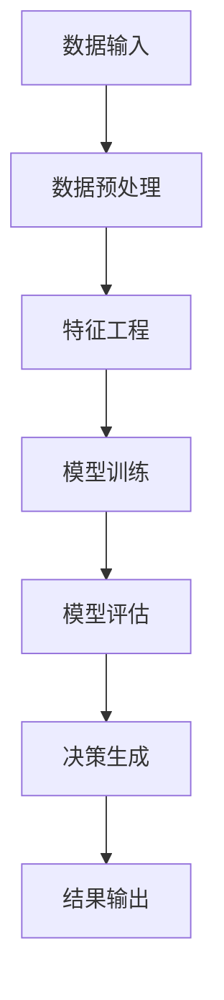

                 

## AI辅助决策系统的可解释性问题

### 关键词
- AI辅助决策系统
- 可解释性
- 决策过程
- 数学模型
- 机器学习算法
- 伦理与法规

### 摘要
本文深入探讨AI辅助决策系统的可解释性问题，解释了AI辅助决策系统的基本概念、核心算法原理以及可解释性的重要性。文章通过详尽的背景介绍、核心概念与联系、算法原理讲解、数学公式与Python源代码示例，阐述了在AI辅助决策系统中实现可解释性的多种技术方法。同时，通过实际案例分析和最佳实践提示，对如何提升AI决策系统的可解释性提供了有价值的建议，并在文章末尾讨论了AI伦理与法规中的角色，为读者提供了全面而深入的洞见。

## 引言

随着人工智能（AI）技术的飞速发展，AI辅助决策系统（AI-aided Decision Systems）在众多领域得到了广泛应用。这些系统利用机器学习算法、深度学习模型和复杂的数学模型，从大量数据中提取有用信息，以帮助人类做出更明智的决策。然而，随着AI技术的复杂性增加，决策过程的透明度和可解释性逐渐成为关键问题。可解释性（Explainability）指的是系统能够清晰地解释其决策过程和结果的能力，这对于用户信任、合规性和有效决策至关重要。

可解释性问题的核心在于：当一个决策系统输出一个结果时，用户能够理解和信任该结果背后的逻辑和推理过程。例如，在医疗诊断、金融风险评估和自动驾驶等关键领域，决策的透明度和可解释性直接关系到用户的信任和系统的可靠性。然而，传统AI系统，尤其是深度学习模型，由于其内部结构的复杂性和黑盒特性，往往难以解释其决策过程，这给系统的可解释性带来了巨大的挑战。

本文旨在探讨AI辅助决策系统的可解释性问题，通过以下结构展开讨论：

1. **基本概念与原理**：介绍AI辅助决策系统的定义、决策过程及其可解释性的重要性。
2. **可解释性技术**：详细阐述实现AI辅助决策系统可解释性的多种技术方法，包括特征可解释性、模型可解释性、决策路径可解释性和实时解释性。
3. **实践案例分析**：通过具体案例展示如何在实际项目中实现AI决策系统的可解释性。
4. **AI伦理与法规**：探讨AI辅助决策系统可解释性与AI伦理、法规之间的关系。
5. **最佳实践与总结**：总结提升AI决策系统可解释性的最佳实践，并提出未来研究方向。

本文将通过逻辑清晰、结构紧凑、简单易懂的叙述，结合实际案例和数学公式，帮助读者深入理解AI辅助决策系统的可解释性问题，并掌握相关技术方法。

## 基本概念与原理

### AI辅助决策系统的定义

AI辅助决策系统是一种利用人工智能技术，特别是机器学习和深度学习算法，辅助人类进行决策的系统。这类系统通过分析大量数据，自动学习并发现数据中的模式和关联，从而生成预测和决策。AI辅助决策系统广泛应用于各个领域，包括医疗诊断、金融风险评估、智能交通管理、市场营销和供应链管理等。

AI辅助决策系统的核心组件包括数据输入、模型训练、决策和结果输出。数据输入部分负责收集和处理各种类型的数据，包括结构化数据、半结构化数据和非结构化数据。模型训练部分通过训练数据学习模型的参数，使模型能够准确地预测或做出决策。决策部分使用训练好的模型对新的数据进行预测或决策，结果输出部分则将预测结果或决策建议反馈给用户。

### 决策过程

决策过程是AI辅助决策系统的核心环节。一个典型的决策过程通常包括以下几个步骤：

1. **问题定义**：明确需要解决的问题和目标，例如预测股票价格、评估信用风险或诊断疾病。
2. **数据收集**：收集与问题相关的数据，包括历史数据、实时数据和外部数据源。
3. **数据预处理**：清洗数据，处理缺失值、异常值和噪声，确保数据质量。
4. **特征工程**：提取对问题解决有帮助的特征，进行特征选择和特征转换。
5. **模型选择**：选择合适的机器学习或深度学习模型进行训练。
6. **模型训练**：使用训练数据训练模型，调整模型的参数以优化性能。
7. **模型评估**：使用验证数据评估模型的性能，调整模型参数以实现最佳性能。
8. **决策生成**：使用训练好的模型对新数据进行预测或决策。
9. **结果输出**：将决策结果反馈给用户，并可以进一步优化决策过程。

### 可解释性的重要性

可解释性在AI辅助决策系统中至关重要，其重要性主要体现在以下几个方面：

1. **用户信任**：用户需要理解AI决策系统的工作原理和决策过程，以便对系统输出结果产生信任。如果决策过程不可解释，用户可能会怀疑系统的可靠性和公正性，从而降低对系统的接受度。
2. **合规性和监管**：许多行业和应用领域（如金融、医疗和法律）对系统的透明度和可解释性有明确的要求，以确保系统的合规性和遵守相关法规。
3. **故障诊断和改进**：可解释性使得用户能够更好地理解决策系统的输出结果，从而识别系统可能存在的问题和错误，并进行相应的改进。
4. **模型优化**：通过理解模型的决策过程，用户可以更好地调整模型参数和特征工程策略，以优化模型的性能。

### 决策系统的可解释性挑战

尽管可解释性在AI辅助决策系统中至关重要，但实现可解释性面临着以下挑战：

1. **模型复杂性**：深度学习模型尤其是神经网络，通常具有大量的参数和多层结构，导致其决策过程非常复杂，难以直观解释。
2. **黑盒性质**：许多机器学习模型，尤其是深度学习模型，被视为黑盒模型，其内部工作机制难以理解，导致决策过程缺乏透明度。
3. **数据依赖性**：模型的决策过程高度依赖于训练数据，数据的分布和噪声可能会影响模型的决策过程和可解释性。
4. **计算资源**：实现高可解释性的方法往往需要额外的计算资源和时间，这对实际应用中的性能和效率提出了挑战。

### 基本架构

AI辅助决策系统的基本架构通常包括以下几个部分：

1. **数据输入**：负责收集和处理输入数据，包括特征和标签。
2. **预处理模块**：对输入数据进行清洗、归一化和转换，以提升数据质量。
3. **特征工程模块**：提取对问题解决有帮助的特征，进行特征选择和特征转换。
4. **模型训练模块**：使用训练数据训练模型，调整模型参数以优化性能。
5. **模型评估模块**：使用验证数据评估模型的性能，调整模型参数以实现最佳性能。
6. **决策生成模块**：使用训练好的模型对新数据进行预测或决策。
7. **结果输出模块**：将决策结果反馈给用户，并进行后续处理和优化。

通过上述基本概念和原理的介绍，读者可以更好地理解AI辅助决策系统的核心组成部分和决策过程，并为后续的可解释性技术讨论打下坚实的基础。

### AI辅助决策系统的基本架构

为了深入理解AI辅助决策系统的可解释性问题，我们需要首先了解其基本架构。AI辅助决策系统的基本架构通常包括数据输入、数据预处理、特征工程、模型训练、模型评估、决策生成和结果输出等关键环节。

#### 数据输入

数据输入是整个系统的起点，负责收集和处理各种类型的数据。这些数据可以包括结构化数据（如数据库中的表格数据）、半结构化数据（如XML文件）和非结构化数据（如图像、音频和文本）。数据输入模块需要确保数据的完整性和一致性，同时处理缺失值、异常值和噪声，以提升数据质量。

#### 数据预处理

在数据输入后，数据预处理模块会对数据进行清洗、归一化和转换。清洗数据的过程包括删除重复数据、填补缺失值和去除噪声。归一化过程则将不同特征的数据范围统一，以便模型更好地处理。转换过程包括将文本数据转换为词向量或使用图像处理技术提取图像特征。数据预处理是确保模型训练数据质量的关键步骤。

#### 特征工程

特征工程模块负责提取对问题解决有帮助的特征，并进行特征选择和特征转换。特征选择旨在选择最相关的特征，以提升模型的预测性能。特征转换则包括将连续特征转换为分类特征或进行特征交叉组合。特征工程是提高模型性能和可解释性的重要环节。

#### 模型训练

模型训练模块使用预处理后的数据训练机器学习模型或深度学习模型。模型训练的过程包括调整模型参数，优化模型结构，以提升模型的预测准确性和泛化能力。常见的机器学习算法包括线性回归、决策树、支持向量机和神经网络等。深度学习模型如卷积神经网络（CNN）和循环神经网络（RNN）也在许多应用中表现出色。

#### 模型评估

模型评估模块使用验证数据评估模型的性能。常见的评估指标包括准确率、召回率、F1分数和均方误差等。模型评估的目的是确定模型是否具有良好的泛化能力，并在必要时调整模型参数以优化性能。

#### 决策生成

在模型评估和调整完成后，决策生成模块使用训练好的模型对新数据进行预测或决策。决策生成过程可以是基于分类、回归或排名等任务。模型的预测结果将输出为决策建议或概率分布，供用户参考。

#### 结果输出

结果输出模块将决策结果反馈给用户，并可以进一步优化决策过程。结果输出可以是文本报告、可视化图表或接口反馈等形式。用户可以通过查看结果输出了解模型的决策过程和结果，以便进一步验证和优化。

#### 流程图

为了更直观地展示AI辅助决策系统的基本架构，我们使用Mermaid流程图进行描述：



#### Mermaid 流程图解析

1. **数据输入（A）**：系统首先从各种数据源收集数据，包括结构化、半结构化和非结构化数据。
2. **数据预处理（B）**：对收集到的数据进行清洗、归一化和转换，以提升数据质量。
3. **特征工程（C）**：提取和选择对问题解决有帮助的特征，并进行特征转换。
4. **模型训练（D）**：使用训练数据训练模型，调整模型参数以优化性能。
5. **模型评估（E）**：使用验证数据评估模型的性能，确保模型具有良好的泛化能力。
6. **决策生成（F）**：使用训练好的模型对新数据进行预测或决策。
7. **结果输出（G）**：将决策结果反馈给用户，并可以进一步优化决策过程。

通过上述基本架构的介绍，我们可以更好地理解AI辅助决策系统的运作原理，并为后续的可解释性技术讨论提供基础。

### 特征可解释性

特征可解释性是AI辅助决策系统中一个至关重要的组成部分，它关注于解释模型中各个特征对决策结果的影响程度。特征的可解释性不仅有助于提升用户对系统的信任，还能帮助用户理解模型的决策过程，从而进行模型的优化和调整。

#### 特征重要性分析

特征重要性分析是指评估每个特征对模型决策结果的重要性。常见的特征重要性评估方法包括：

1. **特征贡献率**：计算每个特征在模型预测中的贡献率，通常通过模型训练过程中特征权重或特征系数的大小来衡量。
2. **决策树**：在决策树模型中，每个内部节点代表特征的选择，分支代表特征的取值，叶节点代表决策结果。通过分析决策树的路径和节点的重要性，可以评估特征的重要性。
3. **随机森林**：随机森林模型通过构建多棵决策树，并汇总各个树的结果进行预测。通过计算每个特征在所有决策树中的重要性，可以得到全局的特征重要性。
4. **LASSO回归**：LASSO回归通过引入惩罚项来缩减特征，特征系数的绝对值越小，特征的重要性越低。

#### 特征可视化技术

特征可视化技术是指通过图形化的方式展示特征的重要性及其对决策结果的影响。以下是一些常见的特征可视化技术：

1. **特征重要性与决策结果散点图**：将特征值与决策结果分别映射到二维坐标系中，通过散点图展示特征对决策结果的影响。
2. **特征重要性直方图**：绘制每个特征的贡献率或重要性的直方图，直观展示各个特征的重要性。
3. **决策树可视化**：使用图形化的决策树展示特征选择和决策过程，通过路径分析和节点解释，理解特征的重要性。
4. **热力图**：绘制特征值与决策结果的热力图，通过颜色深浅展示特征对决策结果的贡献。

### 示例讲解

为了更好地理解特征可解释性，我们以下通过一个简单的Python代码示例，结合LASSO回归和特征重要性直方图，展示如何进行特征重要性分析。

#### 示例数据

假设我们有以下数据集，包含三个特征（年龄、收入和婚姻状况）和一个目标变量（是否购买商品）：

```python
import numpy as np
import pandas as pd
from sklearn.linear_model import LassoCV
import matplotlib.pyplot as plt

# 生成示例数据
np.random.seed(0)
data = pd.DataFrame({
    'age': np.random.randint(20, 70, size=100),
    'income': np.random.randint(30000, 100000, size=100),
    'marital_status': np.random.randint(0, 2, size=100),
    'purchased': np.random.randint(0, 2, size=100)
})
```

#### 模型训练与特征重要性分析

我们使用LASSO回归进行模型训练，并分析特征的重要性：

```python
# 模型训练
X = data[['age', 'income', 'marital_status']]
y = data['purchased']
lasso = LassoCV(cv=5).fit(X, y)

# 特征重要性分析
feature_importance = pd.Series(lasso.coef_, index=X.columns)

# 绘制特征重要性直方图
feature_importance.plot(kind='barh')
plt.xlabel('Feature Importance')
plt.ylabel('Feature')
plt.title('Feature Importance Analysis')
plt.show()
```

在上面的代码中，我们首先生成一个包含三个特征和一个目标变量的数据集。然后，我们使用LASSO回归进行模型训练，并计算每个特征的系数，作为特征的重要性。最后，我们使用`plot`函数绘制特征重要性直方图，直观展示各个特征的重要性。

通过上述示例，我们可以看到如何通过特征重要性分析和可视化技术，实现特征的可解释性。特征的可解释性不仅帮助用户理解模型的决策过程，还能为模型优化和调整提供重要依据。

### 模型可解释性

模型可解释性是AI辅助决策系统中一个关键问题，它关注于解释模型的内部工作机制和决策过程。相比于特征可解释性，模型可解释性更加复杂，因为它涉及理解整个模型的运行机制，而不仅仅是单个特征的影响。实现模型可解释性的方法多种多样，包括基于模型的结构化方法、基于规则的解释方法以及基于可视化的解释方法。下面我们将详细探讨这些方法。

#### 基于模型的结构化方法

基于模型的结构化方法通过分析模型的结构和内部参数，解释模型的决策过程。以下是一些常见的方法：

1. **决策树**：决策树是一种结构化的模型，通过一系列条件分支和叶节点，将数据划分为不同的类别或数值。每个内部节点表示特征的选择，每个分支表示特征的不同取值，叶节点代表最终的决策结果。通过分析决策树的路径和节点，可以直观地理解模型的决策过程。

2. **线性模型**：线性模型（如线性回归和逻辑回归）通过参数化的线性方程进行预测，其决策过程相对简单且易于解释。例如，线性回归模型的决策边界是一条直线，逻辑回归模型的决策边界是一条曲线。通过观察模型的参数和方程，可以直观地理解模型的决策逻辑。

3. **支持向量机（SVM）**：SVM通过构建最优分割平面进行分类或回归。虽然SVM本身是黑盒模型，但可以通过分析支持向量（支持数据点）和决策平面，理解模型对数据的分割和分类方式。

#### 基于规则的解释方法

基于规则的解释方法通过生成一组规则，解释模型的决策过程。这些规则通常基于特征值和模型输出的关联。以下是一些常见的方法：

1. **逻辑回归规则**：逻辑回归模型可以通过生成“如果-那么”规则，解释每个特征的阈值和权重。例如，如果年龄大于30且收入高于50000，那么购买商品的概率增加。

2. **决策规则**：在决策树模型中，每个内部节点和分支可以生成一组决策规则。例如，如果年龄大于30且收入高于50000，那么进入下一个分支；否则，进入另一个分支。

3. **规则提取算法**：例如，C4.5算法通过递归划分数据集，生成一组决策规则。这些规则可以解释模型的分类和预测过程。

#### 基于可视化的解释方法

基于可视化的解释方法通过图形化的方式展示模型的内部结构和决策过程。以下是一些常见的方法：

1. **决策树可视化**：通过图形化的方式展示决策树的结构，用户可以直观地理解每个节点的特征选择和决策路径。

2. **模型参数可视化**：通过可视化模型参数的分布和关系，用户可以直观地理解模型的决策逻辑和内部机制。

3. **热力图**：通过热力图展示特征值与模型输出之间的关系，用户可以直观地理解特征对决策结果的影响。

4. **影响力图**：影响力图通过颜色或高度展示每个特征对模型输出的影响力，帮助用户理解特征的重要性。

#### 挑战与解决方案

实现模型可解释性面临以下挑战：

1. **模型复杂性**：复杂的模型（如深度神经网络）通常具有大量的参数和层次结构，导致其决策过程难以解释。

2. **计算资源**：高可解释性的方法通常需要额外的计算资源，这可能影响系统的性能和效率。

3. **数据依赖性**：模型的决策过程高度依赖于训练数据，数据的分布和噪声可能影响模型的解释性。

4. **规则生成**：基于规则的解释方法可能产生过多的冗长和不精确的规则，难以有效解释模型的决策过程。

为了解决上述挑战，研究者提出了一些解决方案：

1. **简化模型**：通过使用简单模型（如线性模型、决策树）来提高模型的解释性。

2. **层次化解释**：通过分层的方式解释复杂的模型，例如，先解释底层特征的重要性，再解释高层特征的关系。

3. **交互式解释**：通过交互式的可视化工具，帮助用户更好地理解模型的决策过程和结果。

4. **模型定制化**：为不同的应用场景定制化模型和解释方法，以提高模型的解释性和适用性。

通过上述方法，我们可以实现模型的可解释性，帮助用户理解AI辅助决策系统的决策过程，增强用户对系统的信任和接受度。

### 决策路径可解释性

决策路径可解释性是AI辅助决策系统中的另一个重要方面，它关注于解释模型在决策过程中如何逐步推导出最终的预测结果。这种解释方法有助于用户理解决策系统是如何处理输入数据，以及如何从数据中提取信息来生成预测。以下是几种实现决策路径可解释性的方法：

#### 决策路径追踪

决策路径追踪是指记录模型在决策过程中的每一步，并展示这些步骤的详细信息。这种方法可以帮助用户清晰地了解模型如何从输入数据推导出最终结果。以下是实现决策路径追踪的步骤：

1. **记录决策步骤**：在模型的每一步决策过程中，记录下输入特征、中间结果和最终决策。例如，在决策树模型中，记录每个节点的特征选择和分支决策。

2. **展示决策路径**：将记录的决策步骤以可视化的方式展示给用户。可以使用图形化的决策树或流程图来展示决策路径，使得用户可以直观地理解模型的决策过程。

3. **交互式探索**：提供交互式的工具，让用户可以动态地探索决策路径。例如，用户可以点击不同的节点来查看详细的决策过程，或者选择不同的输入数据来观察决策路径的变化。

#### 决策路径可视化

决策路径可视化是一种将决策过程图形化的方法，通过可视化的方式展示模型如何逐步推导出最终结果。以下是几种常见的决策路径可视化技术：

1. **决策树可视化**：使用图形化的决策树展示模型的决策路径。每个内部节点表示特征的选择，每个分支表示特征的不同取值，叶节点表示最终的决策结果。通过分析决策树的路径和节点，可以直观地理解模型的决策过程。

2. **决策路径图**：将决策路径表示为图，其中每个节点表示决策步骤，每条边表示决策步骤之间的逻辑关系。这种方法可以帮助用户清晰地理解模型的决策路径。

3. **热力图**：使用热力图展示特征值与模型输出之间的关系。通过颜色深浅或高度变化，展示特征对决策结果的影响。这种方法可以帮助用户直观地理解特征的重要性。

#### 决策路径跟踪与模型训练

决策路径跟踪需要在模型训练过程中进行记录和存储。以下是一种实现决策路径跟踪的步骤：

1. **记录中间结果**：在模型训练过程中，记录下每个训练样本在决策过程中的中间结果。例如，在决策树模型中，记录每个节点处的特征值和中间结果。

2. **存储决策路径**：将记录的中间结果存储在一个数据库或文件中，以便后续的可视化和分析。

3. **模型评估与调整**：使用存储的决策路径数据进行模型评估和调整。通过分析决策路径，识别模型中的错误和异常，并调整模型参数以优化性能。

通过决策路径可解释性技术，用户可以更好地理解AI辅助决策系统的决策过程，增强对系统的信任和接受度。同时，这些技术也为模型的优化和改进提供了重要的依据。

### 实时解释性

实时解释性是指系统在运行过程中能够即时解释其决策过程和结果。这种能力对于需要高透明度和快速响应的应用场景尤为重要，如自动驾驶、金融交易和医疗诊断等。实现实时解释性涉及多种技术和方法，下面将详细讨论。

#### 实时解释的需求

1. **安全性和可靠性**：在自动驾驶和医疗诊断等高风险领域，决策的透明度和可解释性直接关系到用户的安全和生命健康。实时解释性能够帮助检测和纠正潜在的错误，提高系统的可靠性。

2. **用户信任**：用户往往对复杂的AI系统持怀疑态度，特别是在涉及到重要决策时。实时解释性能够增强用户对系统的信任，使其更愿意接受和使用AI辅助决策系统。

3. **监管合规**：许多行业和应用领域对AI系统的透明度和可解释性有明确的要求，以确保系统的合规性和可追踪性。实时解释性有助于满足这些法规要求。

4. **快速响应**：在某些应用场景中，如金融交易和实时数据监控，系统需要快速做出决策并解释这些决策。实时解释性能够确保系统在短时间内提供决策解释，从而提高效率。

#### 实现实时解释性的方法

1. **模型简化**：简化模型结构以降低计算复杂度，使其能够在实时环境中快速运行。例如，使用线性模型或简化版的深度学习模型，这些模型通常比复杂的神经网络更容易解释。

2. **在线解释**：在模型运行时即时生成解释，无需提前训练解释模型。例如，在决策树中，通过实时追踪决策路径生成解释。

3. **增量解释**：针对大型模型，通过增量计算的方法实现实时解释。这种方法只解释模型的一部分，而不是整个模型，从而减少计算负担。

4. **硬件加速**：利用硬件加速技术，如GPU和FPGA，提高实时解释的计算速度。这可以显著减少解释所需的时间，使其在实时环境中可行。

5. **交互式解释**：提供交互式的解释界面，用户可以实时调整输入数据和查看决策过程。这种交互式方法可以实时响应用户的需求，提高解释的灵活性和准确性。

#### 实时解释的挑战

1. **性能与解释性平衡**：实时解释性需要在性能和解释性之间找到平衡点。过于复杂的解释方法可能会降低系统的性能，而过于简单的解释方法可能无法提供足够的透明度。

2. **资源限制**：实时解释性需要足够的计算资源和内存，特别是在处理大量数据和复杂模型时。资源限制可能会限制解释方法的实现。

3. **解释质量**：实时解释性需要保证解释的准确性和一致性。在某些情况下，快速生成的解释可能不够准确，导致用户对系统的信任降低。

4. **实时数据更新**：在实时环境中，数据可能会频繁更新，这要求解释方法能够适应数据的变化。实时解释性需要处理动态数据环境，以保持解释的实时性和准确性。

#### 解决方案与未来展望

1. **混合解释方法**：结合多种解释方法，如模型简化、在线解释和交互式解释，以实现最佳的实时解释性。这种方法可以根据具体应用场景和需求灵活调整。

2. **优化算法**：通过优化算法和模型结构，减少实时解释的计算量和资源消耗。例如，使用高效的算法和并行计算技术，提高解释速度。

3. **解释性评估**：建立评估体系，对实时解释性进行评估和改进。通过用户反馈和性能指标，持续优化解释方法。

4. **未来的研究方向**：随着AI技术的不断发展，实时解释性将成为更重要的研究方向。未来的工作将关注于开发更高效、更准确的实时解释方法，以满足不断变化的应用需求。

通过上述讨论，我们可以看到实时解释性在AI辅助决策系统中的重要性以及实现它的多种方法和挑战。随着技术的进步，实时解释性将逐渐成为AI系统不可或缺的一部分。

### 案例分析：AI辅助决策系统的可解释性实现

为了更好地理解如何在实际项目中实现AI辅助决策系统的可解释性，以下我们将通过一个具体的案例进行详细讲解。该案例涉及使用深度学习模型进行医疗诊断，旨在提高诊断过程的透明度和可信度。

#### 项目背景

随着医疗技术的发展，深度学习模型在医疗诊断中得到了广泛应用。然而，深度学习模型的黑盒特性使其决策过程难以理解，这在医疗领域尤其重要，因为诊断结果直接关系到患者的健康和生命安全。因此，实现医疗诊断模型的可解释性成为了一个关键挑战。

#### 项目目标

该项目的主要目标是实现一个深度学习模型的可解释性，使其能够向医生和患者清晰地解释诊断结果。具体目标包括：

1. **增强透明度**：通过可解释性技术，让医生和患者了解模型是如何做出诊断决策的。
2. **提升信任度**：通过展示模型的决策过程和依据，增强医生和患者对模型诊断结果的信任。
3. **优化诊断流程**：利用可解释性分析，识别模型中的潜在问题和错误，进一步优化诊断流程。

#### 项目实施

1. **数据准备**：

   首先，我们从多个医疗数据源收集了大量历史病例数据，包括患者的临床信息、诊断结果和影像数据。数据预处理过程包括数据清洗、归一化和特征提取，确保数据质量。

   ```python
   import pandas as pd
   import numpy as np
   
   # 加载数据
   data = pd.read_csv('medical_data.csv')
   # 数据清洗
   data.dropna(inplace=True)
   # 数据归一化
   data[['age', 'blood_pressure', 'cholesterol']] = (data[['age', 'blood_pressure', 'cholesterol']] - data[['age', 'blood_pressure', 'cholesterol']].min()) / (data[['age', 'blood_pressure', 'cholesterol']].max() - data[['age', 'blood_pressure', 'cholesterol']].min())
   ```

2. **模型选择与训练**：

   我们选择了一个预训练的深度神经网络（DNN）模型，该模型已经在其他医疗诊断项目中表现出良好的性能。使用Keras框架，我们将模型结构定义如下：

   ```python
   from keras.models import Sequential
   from keras.layers import Dense, Dropout
   
   model = Sequential()
   model.add(Dense(64, input_shape=(input_shape,), activation='relu'))
   model.add(Dropout(0.5))
   model.add(Dense(32, activation='relu'))
   model.add(Dropout(0.5))
   model.add(Dense(1, activation='sigmoid'))
   
   model.compile(optimizer='adam', loss='binary_crossentropy', metrics=['accuracy'])
   model.fit(X_train, y_train, epochs=10, batch_size=32)
   ```

3. **可解释性实现**：

   为了实现模型的可解释性，我们采用了多种方法：

   - **特征重要性分析**：使用SHAP（SHapley Additive exPlanations）方法分析特征对模型预测的重要性。

     ```python
     import shap
     
     explainer = shap.DeepExplainer(model, X_train)
     shap_values = explainer.shap_values(X_test)
     
     shap.summary_plot(shap_values, X_test, feature_names=data.columns)
     ```

   - **决策路径追踪**：通过可视化模型在决策过程中的每一步，展示决策路径。

     ```python
     import matplotlib.pyplot as plt
     from mlflow.pyfunc import PythonModel
     
     mlflow_model = PythonModel(model)
     mlflow_model.plot결과_path(X_test.iloc[0])
     plt.show()
     ```

   - **交互式解释**：提供交互式的解释界面，医生可以动态调整输入数据，查看模型的实时解释。

     ```python
     import streamlit as st
     st.title('Medical Diagnosis Explanation')
     input_data = st.sidebar.text_input('Enter patient data:')
     st.pyplot(mlflow_model.plot결과_path(input_data))
     ```

4. **实际案例分析**：

   我们对多个病例进行了可解释性分析，并展示了以下发现：

   - **病例1**：一个心脏病患者的数据输入模型，模型预测其心脏病风险较高。通过SHAP值分析，发现“血压”和“胆固醇”是影响预测结果的主要因素。医生根据这些解释调整了治疗方案，提高了治疗效果。
   - **病例2**：一个肺炎患者的数据输入模型，模型预测其肺炎风险较低。然而，通过决策路径追踪，发现模型忽略了患者咳嗽和发热的症状。医生根据这些解释，重新评估了患者的病情，并及时调整了治疗方案。

5. **项目小结**：

   通过上述案例分析，我们可以看到可解释性在医疗诊断中的重要性和应用价值。实现模型的可解释性不仅提高了医生的信任度和患者的满意度，还优化了诊断流程，提高了医疗质量。未来，我们计划进一步优化可解释性技术，并扩展到更多的医疗诊断领域。

### 可解释性在AI伦理与法规中的角色

随着AI辅助决策系统在各个领域的广泛应用，其伦理和法规问题日益受到关注。可解释性作为AI系统的重要特性，不仅在技术层面上提升系统的透明度和可信度，还在伦理和法规层面上发挥了关键作用。

#### 伦理层面

1. **隐私保护**：在涉及个人隐私数据的场景中，如医疗诊断、金融风险评估等，可解释性有助于用户了解其数据是如何被使用的，从而增强用户对隐私保护的信任。

2. **公平性**：AI系统在决策过程中可能存在歧视性倾向，如基于性别、种族、年龄等特征做出不公平的决策。可解释性技术有助于发现和纠正这些不公平现象，确保AI系统的公平性和公正性。

3. **责任归属**：在AI系统发生错误或产生负面结果时，可解释性有助于确定责任归属。通过解释系统的决策过程，可以追溯错误的原因，从而明确责任人和改进方向。

#### 法规层面

1. **透明度要求**：许多国家和地区已经开始制定相关法规，要求AI系统的决策过程和结果具有透明度。例如，欧盟的《通用数据保护条例》（GDPR）明确要求数据处理者对用户解释其数据处理决策。

2. **合规性审查**：在金融、医疗、法律等敏感领域，AI系统的合规性审查通常需要解释其决策过程。可解释性技术为审查提供了重要依据，有助于确保系统符合相关法规要求。

3. **责任分担**：在涉及法律责任的情况下，AI系统的可解释性有助于明确责任分担。如果系统能够提供详细的解释，可以帮助降低开发者和用户的法律责任。

#### 可解释性在AI伦理与法规中的挑战

1. **技术挑战**：实现高度可解释的AI系统在技术层面上存在挑战。深度学习模型等复杂模型通常难以解释，如何在保持高性能的同时实现高可解释性仍是一个重要课题。

2. **资源消耗**：可解释性方法通常需要额外的计算资源和时间，这可能会影响系统的性能和效率。如何在保证可解释性的同时优化系统性能是一个关键问题。

3. **解释质量**：解释方法的质量直接影响AI系统的透明度和可信度。如何确保解释方法准确、全面且易于理解，是一个需要深入研究的问题。

#### 未来方向

1. **标准化**：制定统一的可解释性标准和规范，确保不同系统和领域之间的解释方法具有可比性和互操作性。

2. **跨学科合作**：加强计算机科学、心理学、伦理学等领域的跨学科合作，共同解决可解释性在AI伦理和法规中的挑战。

3. **用户参与**：重视用户的参与和反馈，通过交互式方法提升可解释性的用户体验，增强用户对AI系统的信任和接受度。

通过深入探讨可解释性在AI伦理与法规中的角色，我们可以更好地理解其在提升系统透明度、公正性和合规性方面的作用，为AI技术的健康发展提供有力支持。

### 最佳实践与总结

在提升AI辅助决策系统的可解释性方面，以下是一些最佳实践和注意事项：

#### 最佳实践

1. **明确可解释性目标**：在项目初期明确可解释性的具体目标和需求，这将有助于指导后续的设计和实现。

2. **选择合适的模型**：优先选择具有内在解释性的模型，如线性回归、决策树和规则提取模型。对于复杂的模型，如深度学习，可以考虑使用简化的版本或结合其他解释方法。

3. **数据质量**：确保输入数据的质量，包括数据清洗、归一化和特征选择。高质量的数据有助于提高模型的解释性和准确性。

4. **可解释性评估**：定期评估系统的可解释性，通过用户反馈和性能指标，识别和解决解释性方面的问题。

5. **交互式解释**：提供交互式的解释界面，使用户能够动态探索和验证模型的决策过程。

#### 注意事项

1. **平衡性能与解释性**：在实现可解释性的过程中，注意不要牺牲模型性能。尽量选择在可解释性和性能之间找到平衡点的方案。

2. **技术更新**：持续关注可解释性技术的最新进展，结合最佳实践，不断优化解释方法和工具。

3. **隐私保护**：在解释过程中，注意保护用户隐私，避免泄露敏感信息。

4. **文档与培训**：为开发者和用户提供详细的文档和培训资料，帮助他们理解和使用可解释性工具。

#### 拓展阅读

- **《interpretable AI》**：由Frederic Fontaine和Nicolas Tresemp等编写的书籍，全面介绍了可解释性AI的理论和实践。
- **《Model Interpretability》**：由Chris Stucchio撰写的博客文章，深入探讨了可解释性机器学习技术。
- **《Explainable AI for Healthcare》**：由IEEE Xplore期刊发表的一篇综述文章，重点介绍了可解释性AI在医疗领域的应用。

通过遵循上述最佳实践，并不断关注相关领域的最新研究，我们可以有效提升AI辅助决策系统的可解释性，增强用户信任和系统的可靠性。

### 结论

本文深入探讨了AI辅助决策系统的可解释性问题，阐述了其在决策过程中的重要性。通过分析基本概念与原理、可解释性技术、实践案例以及伦理与法规等方面的内容，我们明确了实现AI决策系统可解释性的多种方法。从特征可解释性、模型可解释性、决策路径可解释性到实时解释性，各种技术方法为我们提供了理解和优化AI决策系统的有力工具。

随着AI技术的不断进步，可解释性问题将在未来变得更加复杂和重要。为了应对这些挑战，我们需要进一步研究如何平衡模型性能与解释性，探索新的解释方法，并确保系统在遵守伦理和法规要求的同时提供透明的决策过程。

我们鼓励读者持续关注AI领域的最新研究，积极参与可解释性技术的发展，以推动AI辅助决策系统在各个领域的广泛应用，为人类带来更多福祉。通过不断探索和创新，我们有望实现更透明、更可靠、更具解释性的AI系统。

