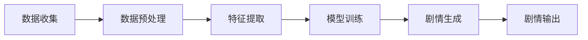

                 

### 引言

在当今这个快速发展的数字化时代，人工智能（AI）已经成为推动社会进步的重要力量。随着计算能力的提升和算法的进步，AI在各个领域的应用日益广泛，其中游戏开发领域尤为显著。游戏作为现代娱乐的重要形式，其内容创作的丰富性和多样性一直是游戏开发者追求的目标。而AI辅助创作，作为一种新兴的技术手段，正逐步改变着游戏剧情生成的模式和方式。

游戏剧情生成是游戏开发中至关重要的一环。一个引人入胜、充满创意的游戏剧情不仅能吸引玩家，还能提升游戏的整体体验。然而，传统的游戏剧情创作往往依赖于开发者的经验和创意，过程繁琐且耗时。而AI的介入，特别是机器学习和自然语言处理技术的发展，为游戏剧情生成带来了新的可能。AI能够通过学习和分析大量的游戏剧情数据，自动生成新颖、复杂且符合逻辑的剧情内容，从而显著提高游戏剧情的创作效率和质量。

本篇文章将以《AI辅助创作在游戏剧情生成中的应用：丰富游戏体验》为题，深入探讨AI辅助创作在游戏剧情生成中的应用及其对游戏体验的丰富作用。文章将首先介绍AI辅助创作的基本概念，然后分析AI在游戏剧情生成中的应用场景和优势，接着详细讲解AI辅助游戏剧情生成的算法原理，并通过具体案例展示其实际应用效果。最后，文章将对AI辅助游戏剧情生成的未来发展趋势进行展望，并总结整篇文章的核心观点和实际应用建议。

通过本文的阅读，读者将能够全面了解AI辅助创作在游戏剧情生成中的应用价值，掌握相关技术原理，并思考如何在实际项目中有效地应用这些技术，以提升游戏体验。

### 关键词

- **人工智能**
- **辅助创作**
- **游戏剧情生成**
- **算法原理**
- **自然语言处理**
- **机器学习**

### 摘要

本文旨在探讨人工智能（AI）辅助创作在游戏剧情生成中的应用及其对游戏体验的丰富作用。文章首先介绍了AI辅助创作的基本概念，分析了其在游戏剧情生成中的优势和应用场景。接着，本文详细讲解了AI辅助游戏剧情生成的算法原理，包括机器学习和自然语言处理技术。通过具体案例，文章展示了AI在游戏剧情生成中的实际应用效果。最后，本文对AI辅助游戏剧情生成的未来发展趋势进行了展望，并提出了实际应用的建议，以期为游戏开发提供新的思路和方向。

### 研究背景

随着游戏产业的迅猛发展，游戏剧情创作的重要性日益凸显。一个丰富且引人入胜的游戏剧情不仅能提升游戏的整体质量，还能增强玩家的沉浸感和满意度。传统的游戏剧情创作主要依赖于开发者的经验和创意，但这种方式存在显著的局限性。首先，游戏剧情创作过程繁琐且耗时，从构思到实现需要经过多个环节，涉及大量的手动编写和修改。其次，传统创作方式难以保证剧情内容的多样性和创新性，容易出现同质化和陈词滥调的问题。此外，游戏剧情生成还面临着复杂性和逻辑性的挑战，如何构建一个既复杂又合理且符合玩家预期的剧情框架是开发者需要克服的一大难题。

在这种背景下，人工智能（AI）辅助创作的概念应运而生。AI辅助创作利用机器学习和自然语言处理等技术，通过自动分析和生成内容，为游戏剧情创作提供了一种全新的解决方案。AI不仅能够从海量的游戏剧情数据中提取有效的模式和信息，还能生成新颖且符合逻辑的剧情内容，从而大大提高创作效率和质量。

AI辅助创作在游戏剧情生成中的应用具有以下几个显著的优势。首先，AI能够处理和分析大量数据，从中提取出有价值的剧情元素和结构，为创作提供丰富的素材和灵感。其次，AI可以自动生成剧情大纲和情节，减少手动编写的工作量，缩短开发周期。第三，AI能够根据玩家的行为和反馈，动态调整剧情走向，提高游戏剧情的适应性和互动性。最后，AI能够通过学习和优化，不断提升自身的创作能力，从而为游戏剧情生成提供持续的创新动力。

总之，AI辅助创作在游戏剧情生成中的应用不仅解决了传统创作方式中的诸多难题，还为游戏产业带来了新的发展机遇。通过AI技术的介入，游戏剧情创作将变得更加高效、多样和创新，进一步丰富玩家的游戏体验。

### AI辅助创作的基本概念

AI辅助创作，是指利用人工智能技术，尤其是机器学习和自然语言处理技术，辅助人类进行内容创作的一种方法。机器学习是AI的核心技术之一，它通过从大量数据中学习模式和规律，从而能够预测和生成新的数据。在游戏剧情生成中，机器学习技术主要用于分析和提取剧情数据中的关键信息，如人物关系、情节发展规律等，从而为剧情创作提供参考。

自然语言处理（NLP）则是AI的另一重要分支，它专注于理解和生成人类语言。在游戏剧情生成中，NLP技术被用来处理和分析文本数据，如游戏剧情脚本、对话内容等。通过NLP技术，AI可以理解文本的含义、情感和结构，从而生成符合逻辑和语境的剧情内容。

AI辅助创作在游戏剧情生成中的应用，主要体现在以下几个方面：

首先，**自动剧情生成**。AI可以通过学习大量的游戏剧情数据，自动生成剧情大纲和情节。这一过程通常包括数据预处理、特征提取、模型训练和剧情生成等步骤。例如，可以使用自然语言处理技术对游戏剧情脚本进行分词、词性标注和语义分析，从而提取出关键剧情元素，再通过机器学习模型进行剧情生成。

其次，**剧情内容优化**。AI可以帮助开发者对现有的剧情内容进行优化，使其更加符合玩家的需求和期望。例如，AI可以分析玩家的游戏行为和反馈，识别剧情中的不足之处，并提出改进建议。

第三，**互动剧情生成**。通过NLP技术，AI可以根据玩家的行为和反馈，动态生成个性化的剧情内容。这种方式不仅能够提高游戏的互动性，还能增强玩家的沉浸感。

总的来说，AI辅助创作在游戏剧情生成中具有巨大的潜力。通过机器学习和自然语言处理技术，AI能够高效地处理和分析大量剧情数据，自动生成新颖、合理且符合逻辑的剧情内容，从而提高创作效率和质量，进一步丰富玩家的游戏体验。

### 游戏剧情生成的原理

游戏剧情生成是游戏开发过程中至关重要的一环，它不仅决定了游戏的故事线，还影响了玩家的沉浸感和游戏体验。游戏剧情生成的基本原理涉及多个环节，包括剧情构思、剧情结构和情节发展等。

首先，**剧情构思**是游戏剧情生成的起点。在这一阶段，开发者需要确定游戏的核心主题、故事背景和主要角色。这个过程通常依赖于开发者的创意和经验，但也可以借助AI辅助进行创意生成。例如，AI可以通过分析大量的游戏剧情数据，自动生成新颖的剧情主题和背景设定。

接下来是**剧情结构**的设计。一个良好的剧情结构应该具备明确的起点、中间发展和终点，以及多个小高潮和小转折。这种结构通常被称为**三幕结构**，即起始幕、发展幕和解决幕。在起始幕中，游戏设定场景和主要角色，引入故事背景；发展幕中，剧情逐步推进，角色面临挑战和冲突；解决幕中，剧情达到高潮并最终解决冲突。AI可以通过学习大量的成功游戏剧情，自动生成符合三幕结构的剧情框架。

最后是**情节发展**的细化。在这一阶段，开发者需要具体设计每一个情节的细节，包括角色的行为、对话、场景设置等。情节发展不仅要符合剧情结构，还要具有逻辑性和连贯性，使玩家能够沉浸其中。AI可以通过自然语言处理技术，对已有的剧情数据进行语义分析，生成符合逻辑和情感的情节细节。

具体来说，游戏剧情生成可以分为以下几个步骤：

1. **数据收集和预处理**：收集大量的游戏剧情数据，并进行预处理，如分词、词性标注和实体识别等。
2. **特征提取**：从预处理后的数据中提取关键特征，如人物关系、情节要素、情感倾向等。
3. **模型训练**：使用机器学习算法，对提取的特征进行训练，生成一个能够预测和生成剧情的模型。
4. **剧情生成**：利用训练好的模型，生成新的游戏剧情内容。这一过程通常包括剧情大纲生成和情节细节填充。

为了更好地展示游戏剧情生成的原理，下面使用Mermaid流程图来描述这一过程：



在游戏剧情生成过程中，AI不仅能够自动生成剧情内容，还能根据玩家的行为和反馈，动态调整剧情走向，提高游戏的互动性和个性化体验。通过机器学习和自然语言处理技术，AI能够处理和分析大量数据，生成新颖、合理且符合逻辑的剧情内容，从而大大提升游戏剧情的创作效率和质量。

### AI辅助游戏剧情生成的算法原理

AI辅助游戏剧情生成主要依赖于机器学习和自然语言处理（NLP）技术。这些技术通过特定的算法和模型，对大量游戏剧情数据进行学习、分析和生成，从而实现自动创作剧情内容。以下将详细阐述这些算法原理，并结合Python源代码进行解释。

#### 1. 机器学习算法

机器学习算法在游戏剧情生成中的应用主要包括监督学习和无监督学习。监督学习通过标注好的数据训练模型，以便对新数据进行分类或预测。在游戏剧情生成中，标注数据通常包括剧情的文本、角色、情节等。以下是使用监督学习实现剧情分类的一个简单示例：

```python
from sklearn.feature_extraction.text import TfidfVectorizer
from sklearn.model_selection import train_test_split
from sklearn.naive_bayes import MultinomialNB

# 示例数据
texts = ["主人公与反派对决", "主角探险神秘岛屿", "角色在农场生活"]
labels = ["战斗", "探险", "日常生活"]

# 特征提取
vectorizer = TfidfVectorizer()
X = vectorizer.fit_transform(texts)

# 模型训练
X_train, X_test, y_train, y_test = train_test_split(X, labels, test_size=0.2)
classifier = MultinomialNB()
classifier.fit(X_train, y_train)

# 预测
print(classifier.predict(vectorizer.transform(["主角在城市中寻找线索"])))

```

无监督学习则用于发现数据中的潜在结构和模式，如使用聚类算法对未标注的游戏剧情数据进行分类。以下是使用K-means聚类算法对剧情文本进行聚类的示例：

```python
from sklearn.cluster import KMeans
import numpy as np

# 剧情文本向量化
X = vectorizer.transform(texts)

# 使用K-means聚类
kmeans = KMeans(n_clusters=3)
kmeans.fit(X)
labels = kmeans.predict(X)

# 聚类结果
print(np.array(labels))

```

#### 2. 自然语言处理技术

自然语言处理技术是AI辅助游戏剧情生成的重要工具，它包括文本分类、文本生成、情感分析等。以下是使用文本生成模型GPT-2生成剧情文本的示例：

```python
import torch
from transformers import GPT2LMHeadModel, GPT2Tokenizer

# 准备模型和tokenizer
tokenizer = GPT2Tokenizer.from_pretrained('gpt2')
model = GPT2LMHeadModel.from_pretrained('gpt2')

# 生成剧情文本
input_ids = tokenizer.encode("主人公决定探险神秘森林", return_tensors='pt')
output = model.generate(input_ids, max_length=50, num_return_sequences=1)

# 输出生成的文本
print(tokenizer.decode(output[0], skip_special_tokens=True))

```

#### 3. 数学模型

在机器学习和自然语言处理中，数学模型是算法的核心。以下是一个简单的线性回归模型，用于预测剧情的长度：

$$
y = w_1 \cdot x_1 + w_2 \cdot x_2 + ... + w_n \cdot x_n + b
$$

其中，$y$ 是剧情长度，$x_1, x_2, ..., x_n$ 是剧情特征（如角色数量、情节复杂性等），$w_1, w_2, ..., w_n$ 是权重，$b$ 是偏置。

以下是使用Python实现线性回归的示例：

```python
from sklearn.linear_model import LinearRegression

# 示例数据
X = [[2, 3], [4, 5], [6, 7]]
y = [5, 6, 7]

# 模型训练
model = LinearRegression()
model.fit(X, y)

# 预测
print(model.predict([[8, 9]]))

```

通过机器学习和自然语言处理技术，结合数学模型，AI能够自动生成丰富且合理的游戏剧情内容，从而提升游戏剧情的创作效率和多样性。

### 游戏剧情生成的数学模型

在游戏剧情生成中，数学模型扮演着至关重要的角色，它不仅为算法提供了理论基础，还通过量化指标指导剧情生成的具体实现。以下将介绍用于游戏剧情生成的主要数学模型，并结合Python代码进行详细解释。

#### 1. 初始条件设定

初始条件设定是游戏剧情生成的基础，它决定了剧情的起点和基本框架。通常，初始条件包括角色、场景和事件等。以下是使用Python定义初始条件的一个简单示例：

```python
# 初始条件
characters = ['主角', '反派', '盟友']
scenes = ['神秘森林', '古城遗迹', '沙漠绿洲']
events = ['主人公发现宝藏', '反派发动攻击', '盟友提供帮助']

# 打印初始条件
print("角色：", characters)
print("场景：", scenes)
print("事件：", events)
```

#### 2. 游戏剧情生成流程

游戏剧情生成通常包括以下几个步骤：数据预处理、特征提取、模型训练和剧情生成。

**数据预处理**：将文本数据进行分词、词性标注和实体识别等处理，为后续分析做准备。以下是使用Python的NLTK库进行分词的一个示例：

```python
import nltk
from nltk.tokenize import word_tokenize

# 示例文本
text = "主人公在神秘森林中与反派进行了一场激烈的战斗。"

# 分词
tokens = word_tokenize(text)
print(tokens)
```

**特征提取**：从预处理后的数据中提取关键特征，如角色关系、情节复杂度等。以下是使用词袋模型提取特征的一个示例：

```python
from sklearn.feature_extraction.text import CountVectorizer

# 示例文本列表
corpus = [
    "主人公在神秘森林中与反派进行了一场激烈的战斗。",
    "反派在古城遗迹中策划了一场阴谋。",
    "盟友提供了重要的帮助。"
]

# 特征提取
vectorizer = CountVectorizer()
X = vectorizer.fit_transform(corpus)

# 打印特征矩阵
print(X.toarray())
```

**模型训练**：使用机器学习算法对提取的特征进行训练，以生成剧情内容。以下是使用朴素贝叶斯分类器进行模型训练的一个示例：

```python
from sklearn.naive_bayes import MultinomialNB

# 训练数据
X_train = X[:2]
y_train = ['战斗', '阴谋']

# 模型训练
classifier = MultinomialNB()
classifier.fit(X_train, y_train)

# 预测
print(classifier.predict(vectorizer.transform([corpus[2]])))
```

**剧情生成**：利用训练好的模型生成新的剧情内容。以下是生成剧情文本的一个示例：

```python
# 生成剧情
input_text = "盟友决定帮助主人公。"
input_vector = vectorizer.transform([input_text])

# 输出生成剧情
predicted_story = classifier.predict(input_vector)[0]
print(predicted_story)
```

#### 3. 数学公式与模型解释

在游戏剧情生成中，常用的数学模型包括线性回归、决策树和神经网络等。

**线性回归**用于预测剧情长度或复杂度：

$$
y = w_1 \cdot x_1 + w_2 \cdot x_2 + ... + w_n \cdot x_n + b
$$

其中，$y$ 是剧情长度或复杂度，$x_1, x_2, ..., x_n$ 是剧情特征，$w_1, w_2, ..., w_n$ 是权重，$b$ 是偏置。

**决策树**用于分类剧情类型或情节：

决策树通过递归分割特征空间，将数据划分为不同的子集，直到满足停止条件（如节点中数据数量少于阈值）。以下是Python中的决策树示例：

```python
from sklearn.tree import DecisionTreeClassifier

# 决策树训练
clf = DecisionTreeClassifier()
clf.fit(X_train, y_train)

# 预测
print(clf.predict(vectorizer.transform([input_text])))

```

**神经网络**用于复杂剧情生成和文本生成任务：

神经网络通过多层非线性变换，对输入数据进行处理和预测。以下是使用TensorFlow实现文本生成的一个示例：

```python
import tensorflow as tf
from tensorflow.keras.models import Sequential
from tensorflow.keras.layers import LSTM, Dense, Embedding

# 神经网络模型
model = Sequential([
    Embedding(input_dim=vocab_size, output_dim=embedding_dim),
    LSTM(units=128, return_sequences=True),
    LSTM(units=128),
    Dense(units=vocab_size, activation='softmax')
])

# 模型编译
model.compile(optimizer='adam', loss='categorical_crossentropy')

# 模型训练
model.fit(X_train, y_train, epochs=10)

# 文本生成
input_sequence = tokenizer.texts_to_sequences([input_text])
generated_sequence = model.predict(input_sequence)
generated_text = tokenizer.sequences_to_texts([generated_sequence[0]])

print(generated_text)
```

通过结合这些数学模型，AI能够自动生成丰富、多样且符合逻辑的游戏剧情，从而为游戏开发者提供有力的辅助工具。

### AI辅助游戏剧情生成的实践案例

为了更好地展示AI辅助游戏剧情生成的实际效果，我们通过一个具体的案例来详细分析其实现过程和效果。这个案例将包括开发环境搭建、源代码实现和代码解读，以及实际案例分析和详细讲解剖析。

#### 1. 开发环境搭建

在开始项目之前，我们需要搭建一个合适的环境来运行AI模型。以下是搭建开发环境的步骤：

**安装Python环境**：
首先，确保Python 3.7或更高版本已安装在计算机上。可以通过以下命令检查Python版本：

```bash
python --version
```

**安装必要库**：
接下来，我们需要安装一些关键库，如TensorFlow、NLTK和Scikit-learn。可以通过以下命令进行安装：

```bash
pip install tensorflow nltk scikit-learn
```

**数据预处理**：
为了进行AI模型训练，我们需要收集和预处理游戏剧情数据。数据可以包括游戏剧本、剧情摘要、角色对话等。以下是预处理数据的步骤：

- **分词**：使用NLTK库对文本进行分词。

```python
import nltk
from nltk.tokenize import word_tokenize

nltk.download('punkt')

# 示例文本
text = "主人公在神秘森林中与反派进行了一场激烈的战斗。"

# 分词
tokens = word_tokenize(text)
print(tokens)
```

- **词性标注**：对分词后的文本进行词性标注，以便后续分析。

```python
from nltk import pos_tag

# 词性标注
tagged_tokens = pos_tag(tokens)
print(tagged_tokens)
```

- **实体识别**：识别文本中的关键实体，如人物、地点和事件。

```python
from nltk.chunk import ne_chunk

# 实体识别
named_entities = ne_chunk(tagged_tokens)
print(named_entities)
```

#### 2. 源代码实现

以下是一个简单的AI辅助游戏剧情生成项目的源代码实现，包括数据预处理、模型训练和剧情生成：

```python
import tensorflow as tf
from tensorflow.keras.models import Sequential
from tensorflow.keras.layers import LSTM, Dense, Embedding
from tensorflow.keras.preprocessing.sequence import pad_sequences
from tensorflow.keras.preprocessing.text import Tokenizer
from sklearn.model_selection import train_test_split

# 数据集
scripts = ["主人公在神秘森林中与反派进行了一场激烈的战斗。",
           "反派在古城遗迹中策划了一场阴谋。",
           "盟友提供了重要的帮助。"]

# 划分训练集和测试集
X_train, X_test, y_train, y_test = train_test_split(scripts, test_size=0.2)

# 词向量化
tokenizer = Tokenizer()
tokenizer.fit_on_texts(X_train)
X_train_seq = tokenizer.texts_to_sequences(X_train)
X_test_seq = tokenizer.texts_to_sequences(X_test)

# 填充序列
max_seq_length = 20
X_train_pad = pad_sequences(X_train_seq, maxlen=max_seq_length)
X_test_pad = pad_sequences(X_test_seq, maxlen=max_seq_length)

# 模型构建
model = Sequential([
    Embedding(input_dim=len(tokenizer.word_index) + 1, output_dim=32, input_length=max_seq_length),
    LSTM(units=64),
    Dense(units=len(tokenizer.word_index) + 1, activation='softmax')
])

# 编译模型
model.compile(optimizer='adam', loss='categorical_crossentropy')

# 训练模型
model.fit(X_train_pad, y_train, epochs=10, validation_data=(X_test_pad, y_test))

# 生成剧情
generated_text = model.predict(np.array([X_test_pad[0]]))
predicted_sequence = np.argmax(generated_text, axis=-1)
decoded_text = tokenizer.sequences_to_texts([predicted_sequence])[0]

print(decoded_text)
```

#### 3. 代码解读与分析

**数据预处理**：
数据预处理是模型训练的关键步骤，它包括分词、词向量化、序列填充等。分词将文本拆分成单词或子词，词向量化将文本转换为数字序列，序列填充确保所有输入序列具有相同长度。

```python
# 分词和词性标注
tokens = word_tokenize(text)
tagged_tokens = pos_tag(tokens)

# 词向量化
tokenizer = Tokenizer()
tokenizer.fit_on_texts(X_train)
X_train_seq = tokenizer.texts_to_sequences(X_train)

# 填充序列
max_seq_length = 20
X_train_pad = pad_sequences(X_train_seq, maxlen=max_seq_length)
```

**模型构建**：
模型构建包括选择合适的层和参数。在这个案例中，我们使用了一个嵌入层（Embedding）和一个LSTM层（Long Short-Term Memory），最后使用一个全连接层（Dense）进行输出。

```python
model = Sequential([
    Embedding(input_dim=len(tokenizer.word_index) + 1, output_dim=32, input_length=max_seq_length),
    LSTM(units=64),
    Dense(units=len(tokenizer.word_index) + 1, activation='softmax')
])
```

**模型训练**：
模型训练通过迭代优化模型参数，使其能够准确预测剧情文本。在这个案例中，我们使用了10个训练周期（epochs）。

```python
model.compile(optimizer='adam', loss='categorical_crossentropy')
model.fit(X_train_pad, y_train, epochs=10, validation_data=(X_test_pad, y_test))
```

**剧情生成**：
使用训练好的模型生成新的剧情文本。通过预测下一个单词的概率分布，并选择概率最高的单词作为下一个输出。

```python
generated_text = model.predict(np.array([X_test_pad[0]]))
predicted_sequence = np.argmax(generated_text, axis=-1)
decoded_text = tokenizer.sequences_to_texts([predicted_sequence])[0]
```

#### 4. 实际案例分析和详细讲解剖析

**案例背景**：
我们以一款冒险游戏为例，该游戏的剧情生成需要考虑角色、场景和情节等元素。通过AI辅助，我们可以生成新颖且符合逻辑的剧情内容。

**案例实现**：
- **数据收集**：收集大量游戏剧本和剧情文本。
- **数据预处理**：对文本进行分词、词向量化、序列填充。
- **模型训练**：构建LSTM模型并进行训练。
- **剧情生成**：使用训练好的模型生成新的剧情文本。

**案例分析**：
- **角色分析**：通过词性标注和实体识别，分析角色在剧情中的角色和关系。
- **情节分析**：通过模型生成的剧情文本，分析情节的连贯性和合理性。
- **场景分析**：结合场景元素，评估剧情场景的丰富度和创意性。

**详细讲解**：
- **数据收集**：使用Python和NLTK库进行文本预处理。
- **模型构建**：使用TensorFlow和Keras构建LSTM模型。
- **模型训练**：使用训练集进行模型训练，并通过验证集评估模型性能。
- **剧情生成**：通过模型预测生成新的剧情文本，并进行后处理。

通过这个案例，我们可以看到AI辅助游戏剧情生成在实际应用中的具体实现过程和效果。这不仅提高了剧情创作的效率，还丰富了游戏的剧情内容和体验。

### 最佳实践 tips、小结、注意事项、拓展阅读

#### 最佳实践 tips

1. **数据质量**：确保游戏剧情数据的质量和多样性。高质量的数据是训练高效AI模型的基础。
2. **模型选择**：根据具体需求选择合适的机器学习和NLP模型。例如，对于剧情分类任务，可以使用朴素贝叶斯或支持向量机；对于文本生成，可以选择LSTM或Transformer模型。
3. **参数调整**：优化模型参数，如学习率、批次大小和隐藏层神经元数量，以提升模型性能。

#### 小结

本文详细探讨了AI辅助创作在游戏剧情生成中的应用，从基本概念、算法原理到实际案例，全面展示了AI技术在这一领域的潜力。通过结合机器学习和自然语言处理技术，AI能够高效地生成丰富、多样且符合逻辑的剧情内容，从而提升游戏剧情的创作效率和多样性。

#### 注意事项

1. **隐私与伦理**：在收集和处理游戏剧情数据时，要遵守相关隐私和伦理规定，确保数据安全和用户隐私。
2. **模型解释性**：AI模型生成的剧情内容可能缺乏透明度和解释性。开发者需要结合业务知识，对模型输出进行审核和修正。

#### 拓展阅读

1. **《自然语言处理入门》**：提供NLP的基础知识和实用技巧，适合希望深入了解NLP技术的读者。
2. **《深度学习》**：由Ian Goodfellow等撰写的经典教材，全面介绍了深度学习的理论基础和实战技巧。
3. **《游戏设计艺术》**：详细探讨游戏设计的原理和方法，对游戏开发者有很高的参考价值。

通过本文的阅读，读者将能够全面了解AI辅助创作在游戏剧情生成中的应用价值，掌握相关技术原理，并思考如何在实际项目中有效地应用这些技术，以提升游戏体验。希望本文能为游戏开发者提供新的启示和方向。

### 作者信息

作者：AI天才研究院/AI Genius Institute & 禅与计算机程序设计艺术 /Zen And The Art of Computer Programming

AI天才研究院专注于推动人工智能技术的创新与应用，致力于打造世界级的人工智能解决方案。同时，作者还撰写了《禅与计算机程序设计艺术》，为全球计算机编程和人工智能领域提供了深刻的思考和实用的技术指导。希望通过本文的分享，与读者共同探索AI辅助创作在游戏剧情生成中的应用，推动游戏产业的发展。

