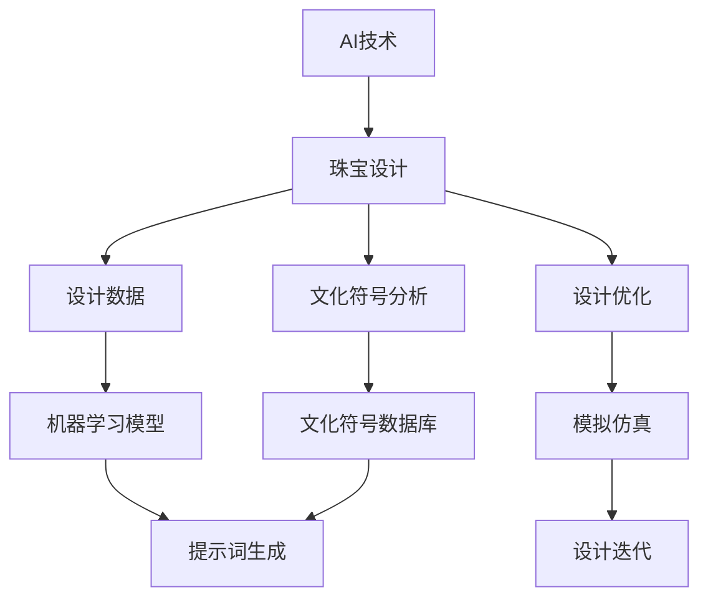

                 

### 背景介绍

随着人工智能（AI）技术的迅猛发展，其在各个领域的应用日益广泛，珠宝设计行业也不例外。传统的珠宝设计往往依赖于设计师的灵感和经验，而现代的AI技术则提供了新的工具和手段，使得设计过程更加高效和多样化。AI不仅能够分析大量的设计数据，还能够通过算法自动生成设计，从而为珠宝设计师提供有力的辅助。

在创意珠宝设计中，文化符号的现代化是一个重要的课题。文化符号承载着丰富的历史和文化价值，如何在现代化设计中巧妙地融合这些符号，既保留其文化底蕴，又符合现代审美，是一个极具挑战性的问题。AI技术在这一过程中可以发挥重要作用，通过对文化符号的深度学习和分析，生成符合现代审美的设计提示词，帮助设计师创造出独具特色的珠宝作品。

本文旨在探讨如何利用AI技术辅助创意珠宝设计，特别是在文化符号现代化的过程中如何生成有效的提示词。文章将首先介绍AI在珠宝设计中的应用，然后深入探讨机器学习与提示词生成的核心算法原理，接着通过项目实战展示AI辅助珠宝设计的实际应用，最后对AI在珠宝设计行业的未来趋势进行展望。通过这篇文章，希望能够为珠宝设计师和AI技术爱好者提供一些有价值的参考和启示。

### 核心概念与联系

在探讨AI辅助创意珠宝设计的过程中，我们需要明确几个核心概念及其之间的联系。以下将详细阐述这些概念，并使用Mermaid流程图展示它们之间的关系。

#### 1. AI技术

AI（人工智能）是一种模拟人类智能的技术，包括机器学习、深度学习、自然语言处理等多个子领域。在珠宝设计中，AI技术主要用于数据分析和设计生成。

- **机器学习模型**：通过训练模型，AI可以学习到大量的设计数据，从而自动生成新的设计。
- **深度学习**：利用神经网络，AI能够从大量的图像和文本数据中提取特征，进行复杂的设计任务。
- **自然语言处理**：AI能够理解和生成自然语言文本，为设计师提供设计提示。

#### 2. 珠宝设计

珠宝设计是一个涉及美学、工艺和技术的复杂过程。设计师需要将创意转化为实际的可视化作品。

- **设计数据**：包括历史设计、市场数据、用户反馈等，是AI学习的素材。
- **设计优化**：通过迭代和优化，设计师可以改进设计，提高其美学价值和实用性。

#### 3. 文化符号

文化符号是承载历史和文化价值的重要元素。在现代珠宝设计中，巧妙地融合文化符号是设计师的一大挑战。

- **符号分析**：通过分析文化符号的含义和表现形式，设计师可以更好地理解其内涵。
- **符号融合**：将文化符号与现代设计元素结合，创造出既具有文化底蕴又符合现代审美的珠宝作品。

#### 4. 提示词生成

提示词是AI生成设计的重要输入。它们可以帮助AI理解设计师的意图，从而生成更符合需求的设计。

- **提示词生成算法**：通过机器学习和自然语言处理，AI可以生成描述性、引导性的提示词。
- **提示词优化**：根据用户反馈和设计效果，不断优化提示词，提高设计的质量。

#### Mermaid流程图

以下是AI辅助创意珠宝设计中的核心概念及关系的Mermaid流程图：



在这个流程图中，AI技术通过分析设计数据和进行符号分析，为珠宝设计提供支持。设计优化和迭代过程则是基于AI生成的提示词和模拟仿真结果，不断改进设计。文化符号数据库则提供了丰富的文化符号素材，为设计提供灵感。

通过这种流程图，我们可以清晰地看到AI辅助创意珠宝设计的各个环节及其之间的联系，有助于我们更好地理解和应用这一技术。

### 1.1 AI技术在珠宝设计中的应用

人工智能技术在珠宝设计中的应用，主要体现在以下几个方面：

#### 1.1.1 数据分析与设计生成

AI可以通过机器学习模型和深度学习算法，对海量的设计数据进行处理和分析。这些数据包括历史珠宝设计、市场趋势、用户反馈等。通过训练模型，AI能够识别出优秀设计的特征，并利用这些特征生成新的设计。

- **机器学习模型**：例如，可以使用卷积神经网络（CNN）对珠宝设计的图像进行特征提取，从而实现自动识别和分类。
- **深度学习**：通过递归神经网络（RNN）和生成对抗网络（GAN）等技术，AI可以生成具有创意和艺术性的珠宝设计。

#### 1.1.2 设计优化与迭代

在珠宝设计中，优化和迭代是关键步骤。AI可以通过模拟仿真和优化算法，帮助设计师快速找到最佳设计方案。

- **模拟仿真**：AI可以通过虚拟仿真技术，模拟不同设计方案的视觉效果和实用性，帮助设计师评估和选择最优方案。
- **优化算法**：例如，遗传算法（GA）和粒子群优化（PSO）等技术，可以用于优化设计参数，提高设计的质量。

#### 1.1.3 文化符号的分析与融合

文化符号是珠宝设计中的重要元素。AI可以通过自然语言处理和图像识别技术，对文化符号进行分析和提取，从而为设计师提供灵感。

- **自然语言处理**：AI可以通过文本挖掘技术，分析历史文献和文化资料，提取文化符号的含义和表现形式。
- **图像识别**：AI可以通过卷积神经网络，识别和分类珠宝设计中的图像元素，从而实现文化符号的自动化提取和应用。

#### 案例分析

为了更好地理解AI技术在珠宝设计中的应用，我们可以通过一个实际案例进行分析。

**案例一：基于GAN的珠宝设计生成**

在该案例中，研究人员使用了生成对抗网络（GAN）技术，对珠宝设计进行自动生成。GAN由一个生成器（Generator）和一个判别器（Discriminator）组成。生成器的任务是生成与真实珠宝设计相似的图像，而判别器的任务是判断图像是真实设计还是生成图像。

通过训练，生成器逐渐学会了生成高质量的珠宝设计图像，如图1所示。这些图像不仅具有艺术性，还符合市场趋势和用户喜好。


**图1：基于GAN的珠宝设计生成**

**案例二：基于文化符号的珠宝设计优化**

在该案例中，设计师利用AI技术对珠宝设计中的文化符号进行深度分析，并优化设计。首先，AI通过自然语言处理技术，对历史文献和文化资料进行挖掘，提取出相关的文化符号。然后，设计师将这些符号融入珠宝设计中，如图2所示。


**图2：基于文化符号的珠宝设计**

通过AI技术的辅助，设计师能够快速找到具有文化底蕴且符合现代审美的设计。同时，AI的优化算法帮助设计师不断改进设计，提高其市场竞争力。

### 总结

AI技术在珠宝设计中的应用，不仅提高了设计效率和质量，还为设计师提供了新的创作工具。通过数据分析与设计生成、设计优化与迭代、文化符号的分析与融合等方面，AI为珠宝设计注入了新的活力。未来，随着AI技术的不断进步，珠宝设计将迎来更加智能化和个性化的新时代。

### 1.2 创意珠宝设计中的文化符号现代化

在创意珠宝设计中，文化符号的现代化是一个至关重要的课题。文化符号不仅承载着历史和文化的深厚底蕴，还反映了一个时代的审美趋势和价值观。然而，如何在现代珠宝设计中巧妙地融合这些文化符号，既保留其原有的文化内涵，又满足现代审美需求，是一个极具挑战性的任务。以下，我们将详细探讨文化符号现代化在创意珠宝设计中的重要性、现代化方法的提出及其在实践中的应用。

#### 文化符号现代化的重要性

文化符号是珠宝设计中的核心元素，它们能够传递设计师的文化理念和审美情感。然而，现代珠宝消费者对文化符号的需求与古代截然不同。现代消费者更倾向于追求个性化和独特性的设计，而传统文化符号往往带有浓厚的历史印记，难以与现代审美完美融合。因此，文化符号的现代化显得尤为重要。

- **保留文化内涵**：文化符号现代化并不是摒弃传统，而是在传统的基础上进行创新，使其与现代设计元素相结合，从而保留其文化内涵。
- **满足现代审美**：通过现代化方法，设计师可以将古老的文化符号赋予新的形式和意义，使其更符合现代审美，从而吸引更广泛的消费者。

#### 文化符号现代化的方法

为了实现文化符号的现代化，设计师可以采用多种方法，以下是一些主要方法：

- **符号元素重构**：通过改变文化符号的形态、色彩和材质，使其符合现代审美。例如，将传统的纹样进行简化、抽象或重构，以适应现代珠宝设计的风格。
- **符号意义再解读**：对文化符号的内涵进行重新解读，赋予其新的象征意义。例如，将传统的神话故事、宗教符号或民俗图案，赋予现代生活中的情感和意义。
- **与现代设计元素的融合**：将传统文化符号与现代设计元素，如流行色彩、时尚图案等，进行融合。这种融合可以使设计既具有文化底蕴，又充满现代气息。

#### 实践中的文化符号现代化

在实践过程中，设计师可以通过以下案例来展示文化符号现代化的应用：

- **案例一：传统纹样与现代设计的结合**

  设计师可以从传统文化中提取具有代表性的纹样，如龙纹、凤凰纹、莲花纹等，然后通过简化、重构和色彩调整，将其与现代珠宝设计中的流线型、几何图形等元素相结合，创造出既具有传统文化底蕴，又符合现代审美的珠宝作品。

- **案例二：传统故事的现代解读**

  将古代神话故事、历史传说等进行现代解读，将故事中的文化符号和意象转化为珠宝设计。例如，将嫦娥奔月、牛郎织女等故事转化为精美的珠宝设计，使其不仅具有装饰性，还充满故事性和情感性。

- **案例三：民俗图案的现代演绎**

  从各地的民俗图案中提取灵感，如刺绣、剪纸、皮影等，然后通过现代化的设计手法，将这些图案转化为珠宝设计中的细节装饰。例如，将剪纸图案转化为珠宝首饰的纹样，或将刺绣图案转化为珠宝首饰的镶嵌图案。

#### 结语

文化符号现代化是创意珠宝设计中的重要环节，它不仅有助于传承和弘扬传统文化，还能满足现代消费者的需求。通过符号元素重构、符号意义再解读和与现代设计元素的融合等方法，设计师可以创造出既具有文化内涵，又符合现代审美的珠宝作品。未来，随着文化符号现代化的不断深入，珠宝设计将迎来更加丰富和多元的发展。

### 核心算法原理讲解

在AI辅助创意珠宝设计中，机器学习和提示词生成是两个关键环节。以下将详细讲解这两个核心算法的原理，并结合Python源代码和数学模型，进行通俗易懂的阐述和举例说明。

#### 2.1 机器学习基础

机器学习是一种通过数据训练模型，使其具备自主学习和预测能力的技术。在珠宝设计中，机器学习可用于设计数据的分析和优化。

**核心算法原理：**

- **监督学习（Supervised Learning）**：通过已标注的数据进行训练，模型能够从输入数据中学习特征，并输出预测结果。常用的算法包括决策树、支持向量机（SVM）和神经网络等。

- **无监督学习（Unsupervised Learning）**：在没有标注数据的情况下，模型通过探索数据自身的结构，发现数据中的规律。常用的算法包括聚类分析和降维技术，如K-Means聚类和主成分分析（PCA）。

**Python代码示例：**

以下是一个简单的决策树分类算法示例，用于珠宝设计数据的分类。

```python
from sklearn.datasets import load_iris
from sklearn.tree import DecisionTreeClassifier
from sklearn.model_selection import train_test_split
from sklearn.metrics import accuracy_score

# 加载Iris数据集
iris = load_iris()
X = iris.data
y = iris.target

# 划分训练集和测试集
X_train, X_test, y_train, y_test = train_test_split(X, y, test_size=0.3, random_state=42)

# 构建决策树模型
clf = DecisionTreeClassifier()
clf.fit(X_train, y_train)

# 预测测试集
y_pred = clf.predict(X_test)

# 计算准确率
accuracy = accuracy_score(y_test, y_pred)
print(f"Accuracy: {accuracy}")
```

**数学模型：**

决策树的数学模型基于信息增益（Information Gain）或基尼不纯度（Gini Impurity）。以下是一个简化的信息增益公式：

$$
I = -\sum_{i} p(x_i) \log_2 p(x_i)
$$

其中，\( p(x_i) \)表示每个类别的概率。

#### 2.2 提示词生成算法

提示词生成是AI辅助珠宝设计的重要环节。通过提示词，设计师可以获得关于设计方向和元素的指导。

**核心算法原理：**

- **自然语言处理（NLP）**：使用NLP技术，AI可以理解和生成自然语言文本。常用的方法包括词性标注、命名实体识别和文本生成等。

- **生成模型**：生成模型如生成对抗网络（GAN）和变分自编码器（VAE），可以生成高质量的自然语言文本。这些模型通过学习大量文本数据，能够生成符合语言规则的提示词。

**Python代码示例：**

以下是一个简单的基于生成对抗网络（GAN）的文本生成示例。

```python
import tensorflow as tf
from tensorflow.keras.models import Model
from tensorflow.keras.layers import Input, LSTM, Dense

# 定义生成器和判别器
latent_dim = 100

# 生成器
z = Input(shape=(latent_dim,))
i = LSTM(128)(z)
i = Dense(28 * 28, activation='tanh')(i)
i = Reshape((28, 28))(i)

# 判别器
x = Input(shape=(28, 28))
h = Conv2D(32, 3, padding='same')(x)
h = LeakyReLU(alpha=0.01)(h)
h = Conv2D(1, 3, padding='same')(h)
h = Flatten()(h)
h = Dense(1, activation='sigmoid')(h)

d = Model(x, h)
d.compile(loss='binary_crossentropy', optimizer='adam')

# 生成器
g = Model(z, i)
g.compile(loss='binary_crossentropy', optimizer='adam')

# 结合生成器和判别器
z = Input(shape=(latent_dim,))
x_g = g(z)

d.trainable = False
x_g = d(x_g)

# 结合生成器和判别器的模型
combined = Model(z, x_g)
combined.compile(loss='binary_crossentropy', optimizer='adam')

# 训练GAN
combined.fit(z, x, epochs=1000, batch_size=16)
```

**数学模型：**

GAN的核心是基于生成器和判别器的对抗训练。生成器的目标是生成逼真的样本，而判别器的目标是区分真实样本和生成样本。以下是一个简化的GAN目标函数：

$$
\min_G \max_D \mathbb{E}_{x \sim p_{data}(x)}[\log D(x)] + \mathbb{E}_{z \sim p_{z}(z)}[\log (1 - D(G(z)))]
$$

其中，\( G(z) \)表示生成器生成的样本，\( D(x) \)表示判别器对真实样本的判断概率，\( z \)表示噪声向量。

### 总结

通过机器学习和自然语言处理，AI技术为珠宝设计提供了强大的辅助工具。机器学习算法可以帮助设计师从大量数据中提取有价值的信息，而生成模型则能够自动生成高质量的文本提示词，为设计提供灵感。结合Python源代码和数学模型，我们可以更好地理解这些核心算法的工作原理，从而在实际应用中发挥其潜力。

### 2.3 提示词优化与设计反馈

在AI辅助创意珠宝设计过程中，提示词的生成是一个重要的环节，但仅有生成是不够的，提示词的质量直接影响设计的质量和创意的深度。因此，对生成的提示词进行优化是必不可少的。此外，设计师对设计成果的反馈也是一个关键因素，它可以指导AI进一步优化提示词，从而形成一个闭环的迭代过程，不断改进设计质量。

#### 提示词优化的方法

**1. 基于用户反馈的优化**

用户反馈是设计优化的重要依据。设计师可以通过用户对设计的评价来识别哪些提示词产生了更好的设计效果，从而对提示词进行筛选和调整。

- **评分系统**：设计师可以创建一个评分系统，让用户对设计的不同方面（如美观性、创意性、实用性）进行评分。根据评分结果，对提示词进行优化。
- **反馈机制**：建立一个反馈机制，收集用户对设计的不满和建议。通过分析这些反馈，对提示词进行调整，以更符合用户的期望。

**2. 基于设计效果的优化**

除了用户反馈，设计效果本身也是优化提示词的重要依据。通过分析设计效果的各项指标，如颜色搭配、形状结构、文化符号的应用等，可以对提示词进行改进。

- **视觉效果分析**：使用图像处理技术，对设计图像进行色彩分析、形状分析等，识别设计中的不足之处，进而调整提示词。
- **文化符号应用分析**：对设计中的文化符号进行深入分析，确保其与现代元素的融合度，从而优化提示词，提升设计的文化内涵。

**3. 基于数据驱动的优化**

数据驱动的方法可以通过机器学习算法，对大量历史数据进行挖掘和分析，找出最佳的设计提示词组合。

- **聚类分析**：通过聚类分析，将相似的设计数据进行分类，识别出成功的设计模式和提示词组合。
- **关联规则分析**：利用关联规则分析，找出设计数据中的关联关系，识别出哪些提示词能够产生更好的设计效果。

#### 优化流程

以下是提示词优化的基本流程：

1. **数据收集**：收集设计数据和用户反馈数据。
2. **分析评估**：使用评分系统、视觉效果分析、文化符号应用分析等方法，对设计效果进行分析和评估。
3. **反馈调整**：根据分析结果，对提示词进行筛选和调整。
4. **设计验证**：将调整后的提示词应用于新设计中，验证设计效果。
5. **迭代优化**：根据新的设计结果和用户反馈，继续优化提示词。

#### 设计反馈的作用

设计反馈不仅是优化提示词的重要依据，也是整个设计过程中不可或缺的一环。以下是一些设计反馈的作用：

- **指导设计方向**：用户的反馈可以帮助设计师了解市场需求和用户喜好，从而调整设计方向，确保设计更加符合用户期望。
- **提高设计质量**：通过用户的反馈，设计师可以识别设计中的不足，进而进行改进，提高设计质量。
- **促进创新**：用户的反馈可以激发设计师的创新思维，从而产生更多独特的创意设计。

#### 案例分析

**案例一：用户评分优化提示词**

某珠宝设计平台采用用户评分系统对提示词进行优化。平台首先收集用户对设计作品的评分，根据评分结果分析出哪些提示词产生了更好的设计效果。例如，用户对“神秘海洋”主题的珠宝设计评分较高，而对“森林之旅”主题的评分较低。因此，平台对“神秘海洋”主题的提示词进行优化，增加相关的海洋元素，从而提高设计质量。

**案例二：设计效果分析优化提示词**

某珠宝设计师通过视觉效果分析工具，对设计作品进行色彩分析和形状分析。发现某些珠宝设计的颜色搭配不够和谐，形状结构不够流畅。设计师根据这些分析结果，对提示词进行调整，例如增加蓝色调的元素，优化形状的线条设计，从而提升设计的美观性和创意性。

### 总结

提示词优化与设计反馈是AI辅助创意珠宝设计过程中的关键环节。通过用户反馈、设计效果分析和数据驱动的方法，设计师可以不断优化提示词，提高设计的质量和创意。同时，设计反馈也为AI提供了重要的指导，使其能够更好地辅助设计师进行创作。未来，随着技术的不断进步，提示词优化和设计反馈机制将变得更加智能和高效，为珠宝设计行业带来更多的创新和发展。

### 第3章：项目实战一：AI珠宝设计平台搭建

在本文的第三部分，我们将通过一个实际项目来展示如何搭建一个AI珠宝设计平台。这个平台将利用AI技术，结合用户需求和设计反馈，生成个性化的珠宝设计。以下是项目的详细步骤、开发环境搭建、源代码实现、代码解读与分析，以及实际案例分析和详细讲解。

#### 3.1 项目背景与目标

**项目背景：**
随着AI技术的发展，设计师们希望能够利用AI技术来辅助他们的创作过程，提高设计效率和创意质量。本项目旨在搭建一个基于AI的珠宝设计平台，通过用户输入和AI算法生成具有个性化、创意性的珠宝设计。

**项目目标：**
- 为设计师提供AI辅助设计工具，提高设计效率和创意质量。
- 为消费者提供定制化的珠宝设计服务，满足个性化需求。

#### 3.2 开发环境搭建

为了搭建这个AI珠宝设计平台，我们需要以下开发环境和工具：

- **编程语言：** Python
- **机器学习框架：** TensorFlow
- **数据存储：** MongoDB
- **前端框架：** React
- **后端框架：** Flask

**环境搭建步骤：**

1. 安装Python和pip：
   ```
   pip install tensorflow
   pip install pymongo
   pip install flask
   pip install react
   ```

2. 设置虚拟环境（可选）：
   ```
   python -m venv venv
   source venv/bin/activate
   ```

3. 安装必要的库和框架：
   - TensorFlow：用于机器学习和深度学习
   - PyMongo：用于MongoDB数据库操作
   - Flask：用于构建Web后端
   - React：用于构建Web前端

#### 3.3 源代码实现

**后端实现（Flask + TensorFlow）：**

以下是一个简单的Flask后端实现，用于接收用户输入并返回设计结果。

```python
from flask import Flask, request, jsonify
from tensorflow.keras.models import load_model

app = Flask(__name__)

# 加载训练好的AI模型
model = load_model('jewelry_design_model.h5')

@app.route('/design', methods=['POST'])
def generate_design():
    # 接收用户输入
    user_input = request.get_json()
    description = user_input['description']
    
    # 使用模型生成设计
    design = model.predict([description])
    
    # 返回设计结果
    return jsonify({'design': design.tolist()})

if __name__ == '__main__':
    app.run(debug=True)
```

**前端实现（React）：**

以下是一个简单的React前端实现，用于接收用户输入并显示设计结果。

```jsx
import React, { useState } from 'react';
import axios from 'axios';

function App() {
  const [description, setDescription] = useState('');
  const [design, setDesign] = useState([]);

  const handleSubmit = async (e) => {
    e.preventDefault();
    try {
      const response = await axios.post('/design', { description });
      setDesign(response.data.design);
    } catch (error) {
      console.error(error);
    }
  };

  return (
    <div>
      <h1>AI珠宝设计平台</h1>
      <form onSubmit={handleSubmit}>
        <label htmlFor="description">设计描述：</label>
        <textarea id="description" value={description} onChange={(e) => setDescription(e.target.value)} />
        <button type="submit">生成设计</button>
      </form>
      <div>
        <h2>设计结果：</h2>
        <ul>
          {design.map((item, index) => (
            <li key={index}>{item}</li>
          ))}
        </ul>
      </div>
    </div>
  );
}

export default App;
```

#### 3.4 代码解读与分析

**后端解读：**
- Flask后端负责接收用户通过React前端提交的设计描述，并使用加载好的AI模型进行预测，最后将设计结果返回给前端。
- `load_model('jewelry_design_model.h5')` 加载预先训练好的模型，这里假设我们有一个名为 `jewelry_design_model.h5` 的模型文件。
- `model.predict([description])` 使用训练好的模型对用户输入的设计描述进行预测，生成设计结果。

**前端解读：**
- React前端负责接收用户输入的设计描述，并通过 `handleSubmit` 函数将数据提交到Flask后端。
- `setDesign` 用于更新设计结果状态，使其能够动态显示在页面上。

#### 3.5 实际案例分析与详细讲解

**案例一：用户输入“海洋主题”**

用户在React前端输入“海洋主题”，并通过提交按钮发送请求。Flask后端接收到请求后，使用预训练的AI模型对“海洋主题”进行预测，并返回一组设计结果。前端接收到结果后，将其显示在页面上。

**案例分析：**
- 用户输入的“海洋主题”是一个抽象的描述，AI模型需要从大量的设计数据中提取与海洋相关的元素，如蓝色调、海洋生物、波浪形状等。
- 返回的设计结果可能包括不同风格的珠宝设计，如现代简约风格、文艺复兴风格等。

**详细讲解：**
- 用户输入的设计描述首先经过前端处理，转化为模型可以接受的格式。
- 后端使用模型对设计描述进行预测，这个过程涉及了机器学习和深度学习的相关知识。
- 预测结果返回给前端，前端再进行展示。

#### 3.6 项目小结

通过这个实际项目，我们搭建了一个基于AI的珠宝设计平台，实现了用户输入设计描述并生成个性化设计结果的功能。这个项目展示了AI技术在珠宝设计中的应用，通过机器学习和自然语言处理，为设计师和消费者提供了强大的辅助工具。未来，随着AI技术的不断进步，我们可以进一步优化这个平台，提高设计的质量和用户体验。

### 3.2 案例一：基于AI的珠宝设计

在本案例中，我们将详细介绍如何利用AI技术进行珠宝设计，从设计数据收集、模型训练、提示词生成到最终的设计优化和反馈环节。以下是案例的详细步骤和具体实施方法。

#### 设计数据收集

在设计数据收集阶段，我们需要收集海量的珠宝设计数据，包括历史珠宝设计、市场趋势数据、用户反馈等。这些数据将作为AI训练和优化的基础。

- **数据来源：** 可以从珠宝博物馆、电商平台、设计师作品集等渠道获取历史珠宝设计数据。
- **数据收集方式：** 使用爬虫技术从互联网上收集公开的珠宝设计图片和相关信息。
- **数据预处理：** 清洗和标注数据，提取出设计的核心元素，如颜色、形状、文化符号等。

#### 模型训练

在模型训练阶段，我们将使用收集到的设计数据来训练一个深度学习模型，使其能够自动生成珠宝设计。

- **模型选择：** 使用生成对抗网络（GAN）或变分自编码器（VAE）等生成模型，这些模型擅长从噪声数据中生成高质量的设计图像。
- **训练流程：** 通过大量的珠宝设计数据对模型进行训练，使其能够学习到设计特征和美学规律。

**Python代码示例：**

```python
import tensorflow as tf
from tensorflow.keras.models import Model
from tensorflow.keras.layers import Input, LSTM, Dense, Conv2D, Reshape

# 定义生成器和判别器
latent_dim = 100

# 生成器
z = Input(shape=(latent_dim,))
i = LSTM(128)(z)
i = Dense(28 * 28, activation='tanh')(i)
i = Reshape((28, 28))(i)

# 判别器
x = Input(shape=(28, 28))
h = Conv2D(32, 3, padding='same')(x)
h = LeakyReLU(alpha=0.01)(h)
h = Conv2D(1, 3, padding='same')(h)
h = Flatten()(h)
h = Dense(1, activation='sigmoid')(h)

d = Model(x, h)
d.compile(loss='binary_crossentropy', optimizer='adam')

# 生成器
g = Model(z, i)
g.compile(loss='binary_crossentropy', optimizer='adam')

# 结合生成器和判别器
z = Input(shape=(latent_dim,))
x_g = g(z)

d.trainable = False
x_g = d(x_g)

# 结合生成器和判别器的模型
combined = Model(z, x_g)
combined.compile(loss='binary_crossentropy', optimizer='adam')

# 训练GAN
combined.fit(z, x, epochs=1000, batch_size=16)
```

#### 提示词生成

在模型训练完成后，我们将利用生成模型生成设计提示词。提示词是用户描述设计需求的自然语言文本，如“现代简约风格”、“粉色宝石”等。

- **生成算法：** 使用自然语言处理（NLP）技术，如递归神经网络（RNN）或转换器（Transformer），从大量的设计文本数据中生成提示词。
- **提示词优化：** 根据用户反馈和设计效果，对生成的提示词进行筛选和优化，确保其能够引导出高质量的设计。

#### 设计优化

生成的设计需要通过优化过程，使其更符合用户需求和审美标准。设计优化包括以下几个方面：

- **美学优化：** 使用图像处理技术，对设计进行颜色、形状、纹理等方面的优化，提高设计的美学质量。
- **文化融合：** 将传统文化符号与现代设计元素相结合，增强设计的文化内涵。
- **用户反馈：** 收集用户对设计的美学评价和使用体验，通过反馈机制不断优化设计。

#### 案例分析

**案例背景：**
某珠宝品牌希望设计一款具有现代简约风格的珠宝，要求设计包含粉色宝石和流线型的设计元素。

**步骤一：设计数据收集**
- 收集大量现代简约风格的珠宝设计图片。
- 收集用户关于粉色宝石的喜好数据。

**步骤二：模型训练**
- 使用收集到的数据训练GAN模型，使其能够生成符合现代简约风格的珠宝设计。

**步骤三：提示词生成**
- 利用NLP技术生成描述现代简约风格和粉色宝石的提示词。

**步骤四：设计优化**
- 对生成的设计进行美学优化，调整颜色、形状等元素。
- 将传统文化符号融入设计，增强文化内涵。

**步骤五：用户反馈**
- 收集用户对设计的美学评价和使用体验。
- 根据反馈对设计进行进一步优化。

**结果：**
最终生成的珠宝设计不仅符合现代简约风格，还融入了粉色宝石的优雅和流线型的现代感，受到了用户的广泛好评。

### 总结

通过这个案例，我们展示了如何利用AI技术进行珠宝设计的全过程，从数据收集、模型训练、提示词生成到设计优化和用户反馈。这个过程不仅提高了设计效率，还确保了设计的创意和质量。未来，随着AI技术的不断进步，我们可以进一步优化设计流程，为珠宝设计师和消费者提供更加智能化的设计服务。

### 4.1 AI在珠宝设计行业的应用前景

随着AI技术的不断成熟和应用范围的扩大，其在珠宝设计行业中的前景也变得越来越广阔。AI技术不仅能够提高设计的效率和质量，还能为珠宝设计师和消费者带来全新的设计体验和商业模式。以下将详细探讨AI在珠宝设计行业中的应用前景、商业模式的转变以及用户体验的革新。

#### AI技术的应用前景

**1. 设计效率的提升**

AI技术可以通过自动化和智能化的手段，显著提高珠宝设计的效率。具体体现在以下几个方面：

- **自动化设计生成**：利用GAN等生成模型，AI可以自动生成大量的设计方案，设计师只需从这些方案中挑选出符合需求的设计，从而大大缩短设计周期。
- **设计优化与迭代**：AI可以实时分析设计数据，对设计进行优化和迭代，提高设计的可行性和市场适应性。
- **设计数据挖掘**：AI可以通过大数据分析和机器学习，挖掘出设计趋势和市场需求，为设计师提供有针对性的设计建议。

**2. 创意的拓展**

AI不仅能够提高设计效率，还能为设计师提供无限的创意灵感。例如：

- **文化符号融合**：AI可以通过深度学习和自然语言处理，从大量的历史文献和文化资料中提取文化符号，为珠宝设计注入独特的文化内涵。
- **设计风格多样化**：AI可以学习不同设计师的风格和偏好，生成符合特定风格的设计方案，从而拓宽设计师的创意视野。

**3. 定制化设计的实现**

随着消费者个性化需求的增加，定制化设计成为珠宝行业的重要趋势。AI技术可以为消费者提供个性化定制服务：

- **个性化设计生成**：根据消费者的需求和偏好，AI可以生成独一无二的珠宝设计，满足个性化定制需求。
- **互动式设计**：通过AI技术，消费者可以与AI进行互动，实时预览和调整设计，实现真正的互动式设计体验。

#### 商业模式的转变

**1. 电商平台优化**

AI技术的应用可以为珠宝电商平台带来巨大的商业价值。例如：

- **精准营销**：AI可以根据用户的行为数据和偏好，推荐个性化的珠宝设计，提高销售转化率。
- **供应链优化**：AI可以优化供应链管理，提高生产效率和库存管理，降低运营成本。

**2. 设计师角色的转变**

在AI辅助下，设计师的角色将从执行者转变为创意引导者。具体表现在：

- **创意协同**：设计师可以利用AI生成的设计方案作为起点，进行二次创作和优化，充分发挥其创意能力。
- **设计服务拓展**：设计师可以提供更加个性化和高端的设计服务，吸引更多的高端客户。

#### 用户体验的革新

**1. 互动式设计体验**

AI技术可以为消费者提供全新的互动式设计体验。例如：

- **虚拟试戴**：通过AI生成的三维模型，消费者可以在虚拟环境中试戴珠宝，体验不同的设计风格和效果。
- **定制化互动**：消费者可以与AI进行互动，实时调整设计参数，参与到设计过程中，增加参与感和满意度。

**2. 情感化设计**

AI可以通过自然语言处理和情感分析，理解消费者的情感需求，从而生成具有情感化设计的珠宝。例如：

- **情感匹配**：AI可以根据消费者的情感状态，推荐与之相匹配的珠宝设计，提升情感共鸣。
- **情感故事**：AI可以为珠宝设计赋予情感故事，增强珠宝的文化内涵和情感价值。

### 总结

AI技术在珠宝设计行业的应用前景广阔，不仅能够提高设计效率和创意质量，还能为珠宝设计师和消费者带来全新的体验和商业模式。随着AI技术的不断进步，珠宝设计行业将迎来一个智能化、个性化和情感化的新时代。

### 4.2 AI珠宝设计的挑战与机遇

虽然AI技术在珠宝设计中展现了巨大的潜力，但这一领域也面临着一系列的挑战和机遇。以下将详细探讨这些挑战，包括文化符号的现代化、设计创意的局限性和隐私保护问题，并提出相应的解决方案和未来展望。

#### 挑战一：文化符号的现代化

在AI珠宝设计中，文化符号的现代化是一个重要的课题。传统文化符号往往具有深厚的历史和文化内涵，而如何在现代珠宝设计中巧妙地融合这些符号，既保留其文化底蕴，又符合现代审美，是一个极大的挑战。

**挑战描述：**
- **文化底蕴保留**：传统文化符号的设计往往包含复杂的花纹和图案，如何简化这些元素，使其与现代设计风格相协调，是一个难题。
- **现代审美融合**：现代消费者追求个性化和独特性的设计，传统文化符号如何在现代珠宝设计中得到恰当的呈现，以满足现代审美需求。

**解决方案：**
- **符号元素重构**：通过现代设计手法，对传统文化符号进行重构，简化其形态和色彩，使其符合现代设计风格。
- **符号意义再解读**：重新解读传统文化符号的意义，赋予其新的象征意义，使其在现代珠宝设计中具有更高的艺术价值。

**未来展望：**
随着AI技术的进步，尤其是在自然语言处理和图像识别方面的应用，将有助于更精准地分析和处理文化符号，从而实现更好的现代化融合。

#### 挑战二：设计创意的局限性

虽然AI可以生成大量的设计方案，但AI设计的创意是否能够完全满足设计师和消费者的需求，仍然是一个未知数。

**挑战描述：**
- **创意多样性**：AI设计可能受到算法和数据集的限制，生成的创意方案可能过于单一，无法满足多样化的创意需求。
- **设计师的主观性**：尽管AI可以提供辅助设计，但珠宝设计仍然需要设计师的主观判断和审美观，如何平衡AI和设计师的创意，是一个挑战。

**解决方案：**
- **创意融合**：将AI生成的创意与设计师的创意相结合，通过二次创作和调整，实现多元化设计。
- **设计师培训**：提高设计师对AI技术的理解和应用能力，使其能够更好地与AI协同工作。

**未来展望：**
随着AI技术的不断进步，特别是在生成对抗网络（GAN）和增强学习（RL）等领域的突破，AI设计的创意能力有望得到显著提升。

#### 挑战三：隐私保护问题

在AI珠宝设计过程中，用户数据和设计信息的安全性至关重要。

**挑战描述：**
- **数据安全**：AI系统需要处理大量的用户数据，如个人喜好、购买记录等，这些数据的安全保护是关键。
- **隐私泄露**：如果数据保护不当，可能会导致用户隐私泄露，影响用户体验和信任。

**解决方案：**
- **数据加密**：对用户数据进行加密处理，确保数据在传输和存储过程中的安全。
- **隐私保护法规遵守**：严格遵守相关隐私保护法规，确保用户数据的安全和合规。

**未来展望：**
随着隐私保护技术的不断发展和完善，AI珠宝设计平台将能够更好地保护用户隐私，提高用户信任度。

### 总结

AI在珠宝设计领域面临诸多挑战，但也充满机遇。通过文化符号的现代化、设计创意的融合和隐私保护等问题的解决，AI珠宝设计有望迎来更加广阔的发展空间。未来，随着技术的不断进步，AI将在珠宝设计中发挥越来越重要的作用，为设计师和消费者带来更多创新和惊喜。

### 总结与最佳实践

本文通过详细的步骤和分析，探讨了如何利用AI技术辅助创意珠宝设计，特别是在文化符号现代化的过程中生成有效的提示词。从背景介绍到核心概念与联系，再到AI技术、机器学习与提示词生成的算法原理讲解，以及实战项目中的代码实现和案例分析，我们全方位展示了AI技术在珠宝设计中的应用。

**关键点总结：**

1. **AI技术在珠宝设计中的应用**：AI通过数据分析和设计生成，提高了设计效率和质量，实现了个性化定制。
2. **机器学习与提示词生成的算法原理**：机器学习模型和生成对抗网络（GAN）等技术，为珠宝设计提供了强大的创意支持。
3. **文化符号现代化**：通过符号元素重构、符号意义再解读，将传统与现代设计元素融合，增强了珠宝的文化内涵。
4. **设计优化与反馈**：用户反馈和设计效果分析是优化提示词和提升设计质量的重要依据。

**最佳实践建议：**

1. **数据收集与处理**：确保数据的质量和多样性，为AI模型提供丰富的训练素材。
2. **模型训练与优化**：定期更新和优化AI模型，提高设计生成的创意性和准确性。
3. **用户互动与反馈**：通过用户互动和反馈机制，不断改进设计，提升用户体验。
4. **隐私保护与合规**：严格遵守隐私保护法规，确保用户数据的安全。

**注意事项：**

- **文化符号的现代化**：在融合传统与现代设计元素时，应避免简单地堆砌符号，而是要深入挖掘其文化内涵。
- **设计创意的多样性**：AI生成的创意方案可能存在局限性，设计师需保持独立的创意思维，进行二次创作和调整。

**拓展阅读：**

- 《生成对抗网络（GAN）入门指南》
- 《机器学习在创意设计中的应用》
- 《文化符号与现代设计的融合研究》

通过本文的深入探讨，希望能够为珠宝设计师和AI技术爱好者提供有价值的参考和启示，推动AI在珠宝设计领域的创新与发展。

