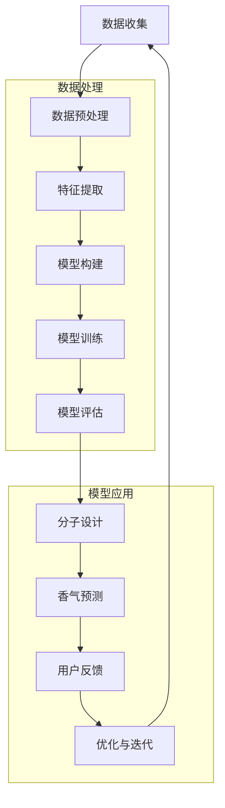

                 

### 《AI辅助创意香水分子设计：新型香料合成的提示词工程》

#### 关键词
- AI 辅助设计
- 香水分子合成
- 提示词工程
- 机器学习
- 数据挖掘
- 香味评价

#### 摘要
本文旨在探讨人工智能（AI）在创意香水分子设计中的应用，特别是如何通过提示词工程实现新型香料的合成。文章首先介绍了AI辅助设计在香水产业中的背景和重要性，随后详细阐述了AI在香水分子设计中的基本原理、技术流程，并探讨了面临的挑战和未来展望。通过一个实际项目案例，文章展示了AI辅助香水分子设计的具体实现过程，提供了源代码和代码解读，以期为相关领域的研究和应用提供有价值的参考。

## 目录大纲设计与本书结构

为了使读者能够更好地理解AI辅助创意香水分子设计的全过程，本文将分为以下几个部分：

### 第一部分：AI辅助创意香水分子设计概述
- **1.1 AI辅助创意香水分子设计概述**
  - **1.1.1 AI辅助创意香水分子设计的背景和意义**
  - **1.1.2 香水分子设计的传统方法与局限**
  - **1.1.3 AI在香水分子设计中的应用潜力**

### 第二部分：AI辅助香水分子设计的基本原理
- **1.2 AI辅助香水分子设计的基本原理**
  - **1.2.1 人工智能技术基础**
    - **1.2.1.1 机器学习与深度学习**
    - **1.2.1.2 数据挖掘与信息检索**
  - **1.2.2 香水分子结构表示方法**
    - **1.2.2.1 化学结构式表示**
    - **1.2.2.2 图谱表示**
  - **1.2.3 香气感知与评价方法**
    - **1.2.3.1 感官评价方法**
    - **1.2.3.2 数据驱动的香气评价**

### 第三部分：AI辅助香水分子设计的技术流程
- **1.3 AI辅助香水分子设计的技术流程**
  - **1.3.1 数据准备与处理**
    - **1.3.1.1 数据来源**
    - **1.3.1.2 数据清洗与标准化**
  - **1.3.2 特征提取与建模**
    - **1.3.2.1 特征提取方法**
    - **1.3.2.2 模型构建与优化**
  - **1.3.3 分子设计与应用**
    - **1.3.3.1 分子设计策略**
    - **1.3.3.2 香气预测与评估**

### 第四部分：AI辅助香水分子设计的挑战与未来展望
- **1.4 AI辅助香水分子设计的挑战与未来展望**
  - **1.4.1 数据集构建与数据质量**
  - **1.4.2 模型解释性与可解释性**
  - **1.4.3 个性化香水设计**

### 第五部分：项目实战
- **1.5 项目实战**
  - **1.5.1 实际案例介绍**
  - **1.5.2 开发环境搭建**
  - **1.5.3 源代码实现与解读**
  - **1.5.4 代码解读与分析**

### 第六部分：总结
- **1.6 总结**
  - **1.6.1 本书内容结构与学习目标**
  - **1.6.2 最佳实践 tips、小结、注意事项、拓展阅读**

通过以上结构，本文将系统性地介绍AI辅助创意香水分子设计的全过程，包括理论基础、技术实现、实际应用和未来展望，以期对相关领域的研究者和从业人员提供有价值的参考。

### 核心概念与联系

在探讨AI辅助创意香水分子设计之前，我们首先需要明确几个核心概念，并了解它们之间的相互关系。

#### 1.1 AI辅助创意香水分子设计

AI辅助创意香水分子设计是指利用人工智能技术，特别是机器学习和深度学习算法，对香水分子进行设计，以实现创新和个性化的香水配方。在这个过程中，AI不仅仅是作为工具来辅助设计，更是通过学习大量的香水分子数据和香气评价数据，形成一种智能化的设计能力。

#### 1.2 创意香水分子设计

创意香水分子设计是指通过化学合成或生物技术，创造新的香水分子，从而开发出独特的香水产品。传统上，香水设计师依赖于经验和直觉来选择和组合不同的化学成分，但这种方法存在一定的局限性。

#### 1.3 提示词工程

提示词工程是一种数据驱动的技术，它通过预定义的关键词或模式，来引导模型的学习过程，提高模型的预测准确性。在AI辅助香水分子设计中，提示词工程可以用于指导模型识别特定的香水分子特征，从而更好地预测和生成新的香水分子。

#### 1.4 机器学习和深度学习

机器学习和深度学习是AI的核心技术。机器学习是一种让计算机通过数据学习，从而实现特定任务的方法；而深度学习则是基于多层神经网络，通过大量数据训练，自动提取特征并进行决策。在香水分子设计中，机器学习和深度学习算法可以用于特征提取、模型训练和预测。

#### 1.5 数据挖掘与信息检索

数据挖掘和信息检索是AI辅助香水分子设计中的关键环节。数据挖掘通过分析大量数据，发现潜在的模式和规律；信息检索则用于从大量数据中快速查找特定的信息。在香水分子设计中，数据挖掘可以帮助识别有效的化学成分组合，而信息检索可以用于查找特定的化合物信息。

#### 1.6 香气感知与评价方法

香气感知与评价方法是香水设计的核心。传统的感官评价依赖于人类对香味的感知和主观评价，而数据驱动的香气评价方法则通过科学仪器和算法来量化香气特征，提高评价的客观性。

通过以上核心概念的联系，我们可以看出，AI辅助创意香水分子设计是一个跨学科的综合性项目，它结合了化学、计算机科学、统计学等多个领域的知识。这些核心概念相互关联，共同构成了AI辅助香水分子设计的理论基础和实践框架。

### 1.1.1 AI辅助创意香水分子设计的背景和意义

#### 香水产业现状

香水产业是一个历史悠久且具有高度创新性的行业，它不仅满足了消费者对独特个性表达的追求，也代表了高端消费品市场的趋势。当前，全球香水市场呈现出快速增长态势，根据市场研究公司的数据，香水市场规模在2022年已经超过了1000亿美元，预计未来几年将继续保持稳步增长。

然而，香水产业也面临着一系列挑战。首先，香水的个性化需求日益增强，消费者希望获得更加独特和个性化的香味体验。其次，传统香水分子设计方法存在一定的局限性，主要依赖于香水设计师的经验和直觉，这不仅降低了创新的效率，也限制了新产品的多样性。此外，随着环保意识的提升，消费者对天然和有机香水的需求也在增加，这对香水生产商提出了新的要求。

#### AI技术的崛起

与此同时，人工智能（AI）技术的飞速发展为香水产业带来了新的契机。AI技术在多个领域取得了显著突破，特别是在图像识别、自然语言处理和数据分析等方面。这些技术的成熟使得AI在香水分子设计中的应用成为可能，为解决当前香水产业面临的挑战提供了新的思路。

首先，AI可以显著提升香水分子设计的效率。通过机器学习和深度学习算法，AI可以从大量已有的香水分子数据和香气评价数据中学习，自动识别出有效的化学成分组合和香气特征，从而大大缩短了新产品的开发周期。

其次，AI能够促进香水产品的创新。通过数据挖掘和信息检索技术，AI可以帮助香水设计师发现新的化学成分和组合方式，甚至可以预测潜在的新型香水分子，从而创造出更多具有市场竞争力的新产品。

最后，AI在个性化香水设计方面也具有巨大潜力。通过分析消费者的个性化喜好和购买记录，AI可以推荐个性化的香水产品，提升消费者的满意度。

#### AI辅助创意香水分子设计的意义

综上所述，AI辅助创意香水分子设计具有重要的意义：

1. **提升设计效率**：AI可以通过学习大量数据，自动识别有效的化学成分组合，从而提高香水分子设计的效率。
2. **促进产品创新**：AI可以帮助香水设计师发现新的化学成分和组合方式，促进香水产品的创新。
3. **满足个性化需求**：AI可以通过分析消费者的个性化喜好，推荐个性化的香水产品，提升消费者的满意度。
4. **降低开发成本**：AI可以自动化许多传统的香水分子设计流程，从而降低新产品的开发成本。
5. **符合环保趋势**：AI可以通过优化香水分子结构，提高香水的天然和有机成分比例，满足消费者对环保的需求。

总的来说，AI辅助创意香水分子设计不仅为香水产业带来了新的机遇，也为消费者提供了更加丰富和个性化的香水体验。随着技术的不断进步，AI在香水分子设计中的应用前景将更加广阔。

### 1.1.2 香水分子设计的传统方法与局限

#### 传统香水分子设计方法

香水分子设计是一项高度复杂且依赖经验的工作。传统上，香水分子设计主要依赖于以下几种方法：

1. **经验法**：香水设计师根据多年的经验和直觉，选择和组合不同的化学成分，创造出新的香水分子。这种方法虽然能够产生独特的香味，但受限于设计师的个人经验和创造力。

2. **组合法**：通过预先定义好的化学成分库，设计师尝试不同的组合方式，以生成新的香水分子。这种方法可以提高创新的多样性，但同样存在依赖经验的问题，且组合效率较低。

3. **实验法**：香水设计师通过实验室实验，对不同的化学成分进行测试，以观察其香气特征和稳定性。这种方法能够提供直接的实验数据，但实验成本高且时间耗费长。

#### 传统方法的局限性

尽管传统香水分子设计方法在香水产业的发展中起到了重要作用，但它也存在着显著的局限性：

1. **效率低下**：香水设计师需要花费大量时间进行实验和组合，从而降低了新产品的开发速度。

2. **依赖经验**：香水分子设计高度依赖于设计师的经验和直觉，这限制了新产品的多样性和创新性。

3. **成本高昂**：实验室实验和化学成分的采购成本较高，且实验过程中存在一定的风险。

4. **不可预测**：由于香水分子设计的复杂性和不确定性，传统方法难以准确预测新香水的最终效果。

5. **环保挑战**：传统方法往往需要大量的化学试剂和实验设备，这对环境造成了一定的负担。

#### 新方法的必要性

面对这些局限性，新型香水分子设计方法应运而生。人工智能（AI）技术的崛起为香水分子设计带来了新的契机：

1. **高效率**：AI可以通过学习和分析大量数据，快速生成新的香水分子设计，大幅提升设计效率。

2. **创新性**：AI可以自动识别出有效的化学成分组合，创造出新颖的香气特征，提高产品的创新性。

3. **低成本**：AI可以通过自动化流程，降低新产品的开发成本，同时减少实验所需的化学试剂和设备。

4. **可预测性**：AI可以基于大量的数据，对新的香水分子进行预测和评估，提高设计的前瞻性和可靠性。

5. **环保友好**：AI可以通过优化香水分子结构，提高天然和有机成分的比例，减少对环境的影响。

总的来说，新型香水分子设计方法，特别是AI辅助设计，为香水产业带来了新的机遇和挑战。它不仅能够解决传统方法的局限性，还为香水设计师提供了更加高效、创新和环保的设计手段。

### 1.1.3 AI在香水分子设计中的应用潜力

随着人工智能（AI）技术的不断发展，AI在香水分子设计中的应用潜力逐渐显现。以下是AI在香水分子设计中的几个主要应用方向：

#### 1. 数据分析

数据分析是AI在香水分子设计中的基础应用。通过收集和分析大量香水分子数据，AI可以识别出有效的化学成分组合和香气特征。例如，通过机器学习算法，AI可以从海量的香水分子库中，提取出那些被认为具有吸引力的化学结构，从而为新香水的开发提供参考。

具体实现中，AI可以通过以下步骤进行分析：

1. **数据收集**：收集香水分子结构数据、香气评价数据以及相关文献资料。
2. **数据预处理**：对收集的数据进行清洗和标准化，确保数据质量。
3. **特征提取**：从原始数据中提取有用的特征，如分子结构特征、香气特征等。
4. **模型训练**：利用机器学习算法，如支持向量机（SVM）、决策树（DT）或深度神经网络（DNN），对数据进行分析和建模。
5. **预测与评估**：根据训练好的模型，对新香水的化学成分进行预测和评估，以确定其潜在的香气特征。

#### 2. 预测与评估

预测与评估是AI在香水分子设计中的关键应用。通过建立科学的预测模型，AI可以预测新香水的香气特征，并评估其商业潜力。以下是一个典型的预测与评估流程：

1. **模型构建**：利用历史数据，构建预测模型，如基于深度学习或集成学习的方法。
2. **模型训练**：将数据集划分为训练集和测试集，对模型进行训练，优化参数。
3. **预测分析**：利用训练好的模型，对新香水的化学成分进行预测，分析其香气特征。
4. **评估与优化**：根据预测结果，对新香水的香气特征进行评估，进行必要的调整和优化。

#### 3. 个性化定制

个性化定制是AI在香水分子设计中的另一个重要应用方向。通过分析消费者的喜好和行为数据，AI可以推荐个性化的香水产品。以下是一个典型的个性化定制流程：

1. **数据收集**：收集消费者的购买记录、使用反馈和偏好数据。
2. **数据分析**：利用数据挖掘技术，分析消费者的喜好，提取个性化特征。
3. **推荐算法**：使用推荐系统算法，如协同过滤（Collaborative Filtering）或基于内容的推荐（Content-based Filtering），为消费者推荐合适的香水产品。
4. **用户体验**：根据推荐结果，提供个性化的香水产品体验，提升消费者满意度。

#### 4. 新分子设计

AI在香水分子设计中的最大潜力之一是能够设计出全新的香水分子。通过深度学习和分子生成模型，AI可以生成具有特定香气特征的新分子，从而实现香水创新的突破。以下是一个新的分子设计流程：

1. **数据收集**：收集大量已知香水分子的结构和香气数据。
2. **模型训练**：利用深度学习算法，如变分自编码器（VAE）或生成对抗网络（GAN），训练分子生成模型。
3. **分子生成**：使用训练好的模型，生成新的香水分子结构。
4. **评估与优化**：对新分子的香气特征进行评估，根据评估结果进行优化，直到满足设计要求。

总之，AI在香水分子设计中的应用具有广泛的前景。通过数据分析、预测与评估、个性化定制和新分子设计，AI不仅能够提高香水设计的效率和创新性，还能满足消费者对个性化和环保产品的需求，为香水产业带来新的发展机遇。

### 1.2 AI辅助香水分子设计的基本原理

#### 1.2.1 人工智能技术基础

人工智能（AI）技术是AI辅助香水分子设计的关键。它包括多个子领域，如机器学习、深度学习、数据挖掘和自然语言处理。以下是这些技术的基础原理和其在香水分子设计中的应用：

1. **机器学习（Machine Learning）**

   机器学习是一种让计算机通过数据学习，从而实现特定任务的方法。其核心思想是利用历史数据来训练模型，使模型能够对新数据进行预测或分类。

   在香水分子设计中，机器学习可以用于：

   - **特征提取**：从化学数据中提取有用的特征，如分子结构、化学键类型、原子间距离等。
   - **预测模型**：建立预测模型，如用于预测新分子的香气特征或评估现有分子的性能。
   - **分类模型**：将分子分类为不同的类别，如根据香气类型或化学性质进行分类。

2. **深度学习（Deep Learning）**

   深度学习是基于多层神经网络的学习方法，它通过学习大量数据来自动提取复杂的特征。深度学习在图像识别、自然语言处理和数据分析等领域取得了显著的成果。

   在香水分子设计中，深度学习可以用于：

   - **分子生成**：通过生成对抗网络（GAN）或变分自编码器（VAE）等模型，生成新的香水分子结构。
   - **特征提取**：使用卷积神经网络（CNN）或循环神经网络（RNN）等深度学习模型，提取分子结构中的高级特征。
   - **预测与评估**：使用深度学习模型进行香气预测和评估，如预测新分子的香气强度或评价现有分子的香气质量。

3. **数据挖掘（Data Mining）**

   数据挖掘是一种从大量数据中自动发现有用信息和知识的方法。它包括关联规则学习、分类、聚类和异常检测等子任务。

   在香水分子设计中，数据挖掘可以用于：

   - **关联规则学习**：发现化学成分之间的关联性，以识别潜在的香气特征。
   - **分类**：对分子进行分类，如根据香气类型或化学性质进行分类。
   - **聚类**：将具有相似特征的分子分组，以发现新的化学成分组合。

4. **自然语言处理（Natural Language Processing）**

   自然语言处理是一种使计算机能够理解和处理人类语言的技术。它包括文本分类、情感分析、机器翻译和问答系统等子任务。

   在香水分子设计中，自然语言处理可以用于：

   - **文本分析**：分析用户评论和评价，提取有关香气特征的信息。
   - **命名实体识别**：识别文本中的化学物质名称，以补充分子结构数据。
   - **情感分析**：分析用户对香水的情感倾向，为个性化推荐提供依据。

#### 1.2.2 香水分子结构表示方法

在AI辅助香水分子设计中，如何表示香水分子结构是一个关键问题。以下是一些常用的香水分子结构表示方法：

1. **化学结构式表示**

   化学结构式是描述分子组成和结构的常用方法。它通过符号和线条表示分子中的原子和化学键。在机器学习和深度学习中，化学结构式可以转换为字符串或图结构，以便进行数据处理和模型训练。

2. **分子图谱表示**

   分子图谱是将分子结构转换为图结构的方法。图中的节点表示原子，边表示化学键。这种方法可以捕捉分子结构中的复杂关系，并适用于深度学习模型的处理。

   - **邻接矩阵表示**：将分子图谱转换为邻接矩阵，其中行和列分别表示原子和化学键，矩阵元素表示原子之间的连接关系。
   - **图嵌入表示**：使用图嵌入技术，将分子图谱转换为高维向量表示，这些向量可以用于机器学习模型的输入。

3. **拓扑特征表示**

   拓扑特征是描述分子结构的几何和拓扑属性，如原子间的距离、角度和二面角等。这些特征可以通过计算分子结构的几何参数来获得，并用于机器学习模型。

   - **几何特征**：如原子间的距离、角度和二面角。
   - **拓扑特征**：如分子的环结构、分支结构和共轭体系等。

通过这些表示方法，AI可以更好地理解和处理香水分子结构，从而实现有效的分子设计。

### 1.2.3 香气感知与评价方法

在香水分子设计中，香气感知与评价方法是一个重要环节。它不仅关系到新香水的开发质量，也影响到消费者的使用体验。以下是一些常见的香气感知与评价方法：

1. **感官评价方法**

   感官评价方法是通过人类感官系统对香水进行评价的方法。这种方法通常由专业的香水评审员进行，他们根据香气的主观感受，如强度、清新度、持久性等，对香水进行评分。

   - **嗅觉测试**：评审员通过嗅闻香水，评价其香气特征。
   - **味觉测试**：评审员通过品尝香水，评价其口感和风味。
   - **综合评价**：结合嗅觉和味觉评价，对香水进行综合评分。

2. **仪器评价方法**

   仪器评价方法是通过科学仪器对香水进行客观测量的方法。这种方法可以提供定量的数据，用于分析香气的物理和化学特性。

   - **气相色谱法（GC）**：通过气相色谱仪分析香水中不同化合物的浓度和分布。
   - **质谱法（MS）**：通过质谱仪分析香水的化学成分，确定分子的结构和组成。
   - **电子鼻（e-Nose）**：通过传感器阵列检测香气的化学成分，进行量化分析。

3. **数据驱动的香气评价方法**

   数据驱动的香气评价方法是将感官评价和仪器评价结合起来，利用机器学习和深度学习技术，对香水进行综合评价。

   - **模型训练**：利用大量的感官评价和仪器评价数据，训练评价模型。
   - **预测与评估**：使用训练好的模型，对新的香水进行预测和评估，分析其香气特征和商业潜力。

4. **用户反馈与互动**

   用户反馈与互动是收集消费者使用体验的重要手段。通过在线调查、社交媒体互动和用户评论分析，可以了解消费者对新香水的感受和需求，为后续的改进提供参考。

综上所述，香气感知与评价方法在香水分子设计中起着关键作用。通过感官评价、仪器评价和数据驱动的评价方法，可以全面了解香水的香气特征，从而指导新产品的开发。同时，用户反馈与互动也是不可或缺的一环，它能够帮助设计师更好地满足消费者的需求，提升产品的市场竞争力。

### 1.3 AI辅助香水分子设计的技术流程

AI辅助香水分子设计是一个复杂的过程，涉及多个技术环节，从数据准备到模型构建，再到分子设计和应用。以下是这一技术流程的详细解析：

#### 1.3.1 数据准备与处理

数据准备是AI辅助香水分子设计的基础。高质量的输入数据直接影响模型的性能。以下步骤是数据准备和处理过程中需要关注的：

1. **数据来源**：

   数据可以从多个渠道获取，包括公开的化学数据库、商业数据库、文献资料和实验室数据。例如，公众可用的化合物数据库（如PubChem）、商业数据库（如ChemSpider）以及科研论文中的化合物信息。

2. **数据收集**：

   收集相关数据，包括香水分子的化学结构、香气特征、感官评价等。同时，收集相关的背景信息，如化合物的来源、用途和商业价值。

3. **数据清洗**：

   清洗数据，去除重复、错误和异常数据。对于化学结构数据，需要确保其格式的统一和正确性。对于香气评价数据，需要检查评价者的资质和评价方法的可靠性。

4. **数据标准化**：

   将不同来源和格式的数据统一标准化，使其适合于模型训练。例如，将所有化学结构转换为统一的分子图谱表示，将感官评价数据转换为量化的数值。

#### 1.3.2 特征提取与建模

特征提取和建模是AI辅助香水分子设计的核心步骤。以下是一个典型的特征提取和建模流程：

1. **特征提取**：

   从原始数据中提取有用的特征，包括分子结构特征、化学性质特征和感官评价特征。特征提取的方法包括：

   - **化学结构特征**：如分子量、极性、氢键供体和受体数等。
   - **物理性质特征**：如沸点、溶解度、密度等。
   - **感官评价特征**：如香气强度、清新度、持久性等。

   特征提取可以通过以下技术实现：

   - **分子图谱表示**：将化学结构转换为图结构，提取图的特征向量。
   - **拓扑特征提取**：计算分子的几何和拓扑特征。
   - **文本特征提取**：从文本描述中提取关键词和主题。

2. **建模与优化**：

   使用机器学习和深度学习算法，构建预测模型。常见的算法包括：

   - **支持向量机（SVM）**：用于分类和回归任务。
   - **决策树（DT）**：用于分类和回归任务。
   - **深度神经网络（DNN）**：用于复杂特征提取和预测。
   - **卷积神经网络（CNN）**：用于处理分子图谱。
   - **生成对抗网络（GAN）**：用于生成新的分子结构。

   在建模过程中，需要不断优化模型参数，通过交叉验证和超参数调优，提高模型的性能。

3. **模型评估与选择**：

   使用验证集和测试集对模型进行评估，选择性能最佳的模型。评估指标包括准确性、召回率、F1分数等。

#### 1.3.3 分子设计与应用

在模型构建和优化完成后，可以进行分子设计与应用。以下是一个典型的分子设计与应用流程：

1. **分子设计策略**：

   根据需求，设计新的香水分子。设计策略可以基于以下原则：

   - **优化目标**：根据香气评价和商业需求，确定设计目标，如香气强度、持久性和创新性。
   - **约束条件**：考虑化合物的安全性、稳定性和成本。
   - **搜索空间**：在已有的分子库中搜索可能的组合，结合机器学习模型进行筛选。

2. **香气预测与评估**：

   使用训练好的模型，对新的分子结构进行香气预测和评估。通过感官评价和仪器评价，验证预测结果的准确性。

3. **迭代与优化**：

   根据预测和评估结果，对分子设计进行迭代和优化，直到满足设计要求。

4. **应用与推广**：

   将设计成功的香水分子应用于实际产品中，进行测试和商业化推广。

通过以上技术流程，AI可以辅助香水分子设计，提高设计效率和创新性，满足消费者对个性化和环保产品的需求。同时，这一流程也为AI在香水产业中的应用提供了实用的方法和经验。

#### 1.3.1.1 数据来源

在AI辅助香水分子设计项目中，数据来源是确保模型性能和可靠性的关键。以下是几种常见的数据来源：

1. **公共化学数据库**：

   公共化学数据库如PubChem、ChemSpider和PubMed等，提供了丰富的化学结构、物理性质和生物活性数据。这些数据库通常是免费的，且包含大量的化合物信息，为模型训练提供了丰富的数据基础。

2. **商业数据库**：

   商业数据库如SciFinder、Reaxys和Beilstein等，提供了高质量的化学结构和商业应用信息。这些数据库通常需要订阅，但其数据质量和完整性较高，适合用于构建高精度的模型。

3. **实验室数据**：

   实验室数据是通过化学实验获得的，包括化合物合成、纯化、光谱分析和感官评价等。这些数据通常具有高可信度，但获取成本较高，且数据量有限。

4. **文献资料**：

   化学文献和专利提供了大量的化合物结构和应用信息。这些文献资料通过文本挖掘和知识图谱构建，可以转化为结构化的数据，用于模型训练。

5. **社交媒体和用户反馈**：

   社交媒体和用户反馈提供了关于消费者喜好和香水评价的信息。这些数据可以通过自然语言处理和文本分析技术，提取有用的特征和模式。

6. **开源数据集**：

   开源数据集如ChEMBL、Gaussian和Molnet等，提供了经过清洗和标注的化学数据，可用于模型训练和测试。

在数据收集过程中，需要考虑数据的多样性和代表性，以确保模型能够适应不同的应用场景。同时，数据的完整性和准确性也是至关重要的，任何数据错误或缺失都可能影响模型的性能。

#### 1.3.1.2 数据清洗与标准化

在AI辅助香水分子设计项目中，数据清洗与标准化是确保数据质量和模型性能的关键步骤。以下是数据清洗与标准化的具体过程：

1. **数据清洗**：

   数据清洗的目的是去除数据中的噪声和错误，确保数据的准确性和一致性。以下是一些常见的数据清洗方法：

   - **去除重复数据**：检查数据集中是否存在重复的记录，并将其删除。重复数据可能会导致模型训练过程中过拟合，影响模型的泛化能力。

   - **处理缺失值**：对于缺失的数据，可以选择填充或删除。填充方法包括使用平均值、中位数或最邻近值等方法，而删除方法则是直接删除包含缺失数据的记录。

   - **去除异常值**：通过统计分析和可视化方法，识别并去除数据集中的异常值。异常值可能是由于实验误差或数据录入错误造成的，它们会干扰模型的训练。

   - **统一数据格式**：将不同来源的数据格式进行统一，确保数据结构的一致性。例如，将化学结构数据转换为统一的分子图谱表示，将文本数据转换为统一的文本格式。

2. **数据标准化**：

   数据标准化是将数据转换为统一的尺度，以便于模型训练和比较。以下是一些常见的数据标准化方法：

   - **归一化**：通过将数据缩放到一个特定的范围（如[0,1]或[-1,1]），消除不同特征之间的尺度差异。归一化可以防止某些特征在模型训练过程中占据主导地位，提高模型的鲁棒性。

   - **标准化**：通过计算每个特征的平均值和标准差，将数据缩放到一个标准正态分布。标准化方法可以保持数据特征之间的比例关系，但可能会增加模型的方差。

   - **编码**：对于分类特征，可以使用独热编码（One-Hot Encoding）或标签编码（Label Encoding）等方法，将分类变量转换为数值形式。编码方法可以增加模型的可解释性，但可能会引入额外的噪声。

   - **缺失值填充**：对于缺失的数据，可以使用填充方法（如均值填充、中位数填充或最近邻填充等）将缺失值替换为实际值。填充方法可以减少数据缺失对模型训练的影响。

通过数据清洗与标准化，可以确保输入数据的准确性和一致性，提高模型的性能和可靠性。同时，这些步骤也为后续的特征提取和模型训练奠定了坚实的基础。

#### 1.3.2.1 特征提取方法

在AI辅助香水分子设计项目中，特征提取是关键步骤，它决定了模型对香水分子结构和香气特征的捕捉能力。以下是几种常用的特征提取方法：

1. **化学结构特征提取**：

   化学结构特征是描述分子组成和性质的重要信息。以下是一些常见的化学结构特征提取方法：

   - **拓扑特征**：包括原子之间的距离、角度、二面角等。这些特征可以反映分子的几何结构和原子间的相互作用。
   - **分子指纹**：如日指纹（MACCS Keys）和ECFP（Extended Connectivity Fingerprint）。指纹是一种二进制向量，用于表示分子中的不同化学环境。
   - **分子属性**：包括分子量、极性、溶解度、氢键供体和受体数等。这些属性可以反映分子的化学性质和物理性质。

2. **物理性质特征提取**：

   物理性质特征是描述分子在物理条件下的行为特征。以下是一些常见的物理性质特征提取方法：

   - **光谱特征**：如红外光谱（IR）、核磁共振（NMR）和紫外-可见光谱（UV-Vis）。这些特征可以反映分子内部的化学键和电子结构。
   - **沸点、熔点、密度**：这些物理性质可以直接测量，并用于描述分子的物理稳定性。

3. **感官评价特征提取**：

   感官评价特征是描述香水香气特征的主观信息。以下是一些常见的感官评价特征提取方法：

   - **文本分析**：通过自然语言处理技术，从用户评论和评价中提取关键词和情感倾向。这些特征可以反映消费者对香水的感官评价。
   - **评分和评级**：直接从用户评分和评级中提取特征，如香气强度、清新度、持久性等。

4. **组合特征提取**：

   组合特征提取是将不同类型的特征进行组合，形成新的特征。以下是一些常见的组合特征提取方法：

   - **主成分分析（PCA）**：通过降维技术，将高维特征转换为低维特征，保留主要的信息。
   - **因子分析（FA）**：通过提取公因子，将相关的特征合并，减少特征数量。
   - **特征选择**：使用特征选择算法，如过滤法、包裹法和嵌入式方法，选择对模型性能最有贡献的特征。

通过以上特征提取方法，可以全面捕捉香水分子结构和香气特征，为模型训练提供丰富的信息。这些特征提取方法不仅提高了模型的预测准确性，还增强了模型的可解释性，有助于理解香水分子设计的内在机制。

#### 1.3.2.2 模型构建与优化

在AI辅助香水分子设计项目中，模型构建与优化是确保模型性能和稳定性的关键步骤。以下是模型构建与优化的具体过程：

1. **模型选择**：

   根据任务需求和数据特性，选择合适的模型。常见的机器学习和深度学习模型包括：

   - **线性模型**：如线性回归、逻辑回归。适用于简单线性关系的数据。
   - **决策树**：如CART、ID3。适用于分类和回归任务。
   - **集成模型**：如随机森林、梯度提升树（XGBoost、LightGBM）。适用于复杂关系和大规模数据。
   - **神经网络**：如全连接网络、卷积神经网络（CNN）、循环神经网络（RNN）。适用于处理高维数据和复杂非线性关系。
   - **生成对抗网络（GAN）**：适用于生成新的分子结构。

2. **模型构建**：

   - **数据预处理**：对输入数据进行预处理，包括标准化、归一化、缺失值填充等，确保数据的质量和一致性。
   - **特征工程**：提取有用的特征，如化学结构特征、物理性质特征和感官评价特征。使用特征提取方法，如分子指纹、拓扑特征、文本分析等。
   - **模型初始化**：初始化模型的参数，如权重和偏置。常见的初始化方法包括随机初始化、高斯初始化等。
   - **模型训练**：使用训练数据集，通过反向传播算法，训练模型参数，优化模型性能。在训练过程中，可以采用交叉验证和早停（Early Stopping）策略，防止过拟合。

3. **模型优化**：

   - **超参数调优**：调整模型超参数，如学习率、批量大小、正则化参数等，以优化模型性能。常用的调优方法包括网格搜索（Grid Search）和贝叶斯优化（Bayesian Optimization）。
   - **模型集成**：使用多个模型进行集成，如随机森林、梯度提升树等，提高模型的泛化能力和鲁棒性。
   - **模型评估**：使用验证集和测试集，评估模型性能。常见的评估指标包括准确性、召回率、F1分数、均方误差（MSE）等。
   - **模型解释**：通过模型解释技术，如SHAP值、LIME等，分析模型对每个特征的依赖程度，提高模型的可解释性。

通过以上模型构建与优化步骤，可以构建一个高性能的AI辅助香水分子设计模型，实现对新分子的预测和评估。同时，这些步骤也为模型的进一步改进和扩展提供了基础。

#### 1.3.3.1 分子设计策略

在AI辅助香水分子设计中，分子设计策略是指导模型生成新香水分子的重要步骤。以下是一个详细的分子设计策略：

1. **目标设定**：

   明确设计目标，如新的香气特征、分子稳定性、成本效益等。目标设定应根据市场需求、用户反馈和商业目标来确定。

2. **初始候选分子**：

   - **数据筛选**：从现有的化合物数据库中筛选出满足设计目标的初始候选分子。
   - **特征提取**：提取候选分子的化学结构特征、物理性质特征和感官评价特征。

3. **生成对抗网络（GAN）训练**：

   - **模型构建**：构建GAN模型，包括生成器和判别器。生成器用于生成新的分子结构，判别器用于判断生成分子的真实性。
   - **数据预处理**：将化学结构数据转换为统一的分子图谱表示。
   - **训练过程**：使用大量真实的分子数据，训练生成器和判别器，优化模型参数。

4. **生成新分子**：

   - **生成分子**：通过生成器生成大量新的分子结构。
   - **特征提取**：提取新生成分子的化学结构特征、物理性质特征和感官评价特征。

5. **筛选候选分子**：

   - **模型评估**：使用训练好的预测模型，对新分子的香气特征进行预测和评估。
   - **筛选策略**：根据设计目标，筛选出符合要求的候选分子。筛选策略可以基于香气强度、清新度、持久性等指标。

6. **优化分子结构**：

   - **迭代优化**：根据筛选结果，对候选分子进行迭代优化，调整分子结构，以改善香气特征。
   - **计算化学模拟**：使用计算化学方法，如分子动力学模拟（MD）和量子化学计算，优化分子结构的稳定性和性能。

7. **实验验证**：

   - **实验室测试**：对筛选出的最优分子进行实验室测试，验证其香气特征和稳定性。
   - **感官评价**：通过感官评价，确定分子的香气质量和用户体验。

通过以上分子设计策略，AI辅助香水分子设计可以实现高效、创新和个性化的香水分子生成，满足市场需求和消费者期望。同时，这些策略也为AI在香水产业中的应用提供了实用的方法和技术。

#### 1.3.3.2 香气预测与评估

在AI辅助香水分子设计中，香气预测与评估是关键步骤，它直接关系到新分子的市场潜力和用户体验。以下是香气预测与评估的具体过程：

1. **香气预测**：

   - **预测模型构建**：使用机器学习或深度学习算法，如支持向量机（SVM）、卷积神经网络（CNN）或变分自编码器（VAE），构建香气预测模型。这些模型通过学习大量已知的香水分子结构和香气评价数据，自动提取香气特征，并能够对新分子的香气进行预测。
   - **特征提取**：从新分子的化学结构中提取关键特征，如分子指纹、拓扑特征、物理性质特征等。这些特征用于输入到预测模型中，以生成香气预测结果。
   - **预测结果**：使用训练好的模型，对新分子的香气强度、清新度、持久性等特征进行预测。预测结果通常以数值形式表示，如香气评分、香气类型等。

2. **香气评估**：

   - **感官评价**：邀请专业的香水评审员，通过嗅闻和品尝，对新分子的香气进行感官评价。评审员根据香气的主观感受，如香气强度、优雅度、舒适度等，对香气进行评分和分类。
   - **仪器评价**：使用科学仪器，如气相色谱-质谱联用仪（GC-MS）或电子鼻（e-Nose），对香气进行客观测量。这些仪器可以检测和量化香气的化学成分和物理属性，提供详细的香气分析数据。
   - **综合评价**：结合感官评价和仪器评价的结果，对新分子的香气进行全面评估。评估指标包括香气评分、香气类型、香气特征分布等。

3. **评估与反馈**：

   - **评估结果**：根据预测和评估结果，确定新分子的香气质量和市场潜力。评估结果可以用于指导下一步的设计优化，如调整分子结构、增加或减少特定化学成分等。
   - **反馈循环**：将评估结果反馈给设计团队，进行迭代优化。通过不断调整和优化分子结构，提高香气的预测准确性和用户体验。

通过香气预测与评估，AI辅助香水分子设计可以高效地识别和开发具有市场潜力和用户满意度的香水分子，为香水产业带来创新和增长。

### 1.4 AI辅助香水分子设计的挑战与未来展望

尽管AI辅助香水分子设计具有巨大的潜力，但其在实际应用中仍面临诸多挑战。以下是对这些挑战的详细分析以及未来的发展方向。

#### 数据集构建与数据质量

数据集构建是AI辅助香水分子设计的基础。然而，当前的数据集存在以下挑战：

1. **数据匮乏**：高质量的香水分子数据和香气评价数据相对较少，限制了模型的训练和优化。
2. **数据不完整**：数据集中可能存在缺失值或错误数据，影响模型的准确性和稳定性。
3. **数据不平衡**：数据集中某些类型的分子或香气特征可能过于集中，导致模型在特定领域的表现不佳。

**解决方案**：

- **数据扩充**：通过数据增强技术，如数据合成、迁移学习和生成对抗网络（GAN），扩充数据集。
- **数据清洗**：使用数据清洗算法，去除重复和错误数据，确保数据质量。
- **数据平衡**：通过采样技术，如重采样或生成技术，平衡数据集中不同类型的分子或香气特征。

#### 模型解释性与可解释性

AI模型，特别是深度学习模型，在香水分子设计中的应用通常被认为是“黑盒”模型，难以解释其决策过程。这给香水设计师带来了挑战：

1. **决策透明度**：模型如何决定特定的化学结构与香气特征之间的关系不明确。
2. **模型信任度**：缺乏解释性可能导致用户对模型结果的信任度降低。

**解决方案**：

- **模型解释技术**：如SHAP值、LIME等，通过这些技术可以解释模型对每个特征的依赖程度。
- **可视化工具**：开发可视化工具，如分子图谱和决策树，帮助用户理解模型的工作原理。
- **可解释性设计**：在设计模型时，考虑可解释性，如使用简单的模型结构或结合专家知识进行设计。

#### 个性化香水设计

个性化香水设计是消费者追求的趋势，但实现个性化设计面临以下挑战：

1. **用户多样性**：不同用户对香气的偏好差异很大，需要模型能够适应各种用户需求。
2. **个性化预测**：如何准确预测每个用户的个性化需求。

**解决方案**：

- **多模态数据融合**：结合用户的个性化数据（如购买记录、评论、行为数据）与香气评价数据，提高个性化预测的准确性。
- **用户建模**：使用机器学习技术，建立用户的个性化模型，如基于协同过滤的方法，预测用户的喜好。
- **反馈循环**：通过用户反馈，不断优化个性化推荐系统，提高用户体验。

#### 未来发展方向

随着技术的不断进步，AI辅助香水分子设计在未来有望实现以下发展方向：

1. **自动化与智能化**：通过更先进的算法和更丰富的数据集，实现香水分子设计的自动化和智能化。
2. **融合多学科知识**：结合化学、生物学、心理学等多学科知识，提升AI在香水分子设计中的综合能力。
3. **跨领域应用**：AI技术可以应用于其他相关领域，如化妆品、食品和医疗保健，实现更广泛的应用。
4. **可持续发展**：通过优化分子结构，提高天然和有机成分的比例，推动香水产业的可持续发展。

总的来说，AI辅助香水分子设计具有广阔的发展前景，通过解决现有挑战和不断优化技术，将能够带来更多创新和个性化的香水产品。

### 1.5 Mermaid流程图

为了更直观地展示AI辅助香水分子设计的整体流程，我们可以使用Mermaid语言绘制一个流程图。以下是AI辅助香水分子设计的基本流程：



在上述流程图中，我们首先从数据收集开始，经过数据预处理、特征提取、模型构建、模型训练、模型评估等步骤，进入分子设计和香气预测阶段。然后，根据用户反馈进行优化与迭代，形成一个闭环系统，确保设计过程不断改进和优化。

### 1.5.1 AI辅助香水分子设计的整体流程

为了详细展示AI辅助香水分子设计的整体流程，我们可以进一步分解各阶段的步骤和关键点。以下是具体的流程说明：

1. **数据收集**：
   - **数据来源**：包括公开的化学数据库、商业数据库、文献资料、实验室数据和用户反馈。
   - **数据类型**：化学结构数据、物理性质数据、感官评价数据、用户行为数据等。

2. **数据预处理**：
   - **数据清洗**：去除重复、错误和异常数据，处理缺失值，统一数据格式。
   - **数据标准化**：将不同数据源的数据转换为统一的格式，如将化学结构数据转换为分子图谱表示。

3. **特征提取**：
   - **化学结构特征**：提取分子结构中的拓扑特征、分子指纹、原子间距离等。
   - **物理性质特征**：提取分子的沸点、溶解度、密度等。
   - **感官评价特征**：提取用户对香气的感官评价，如香气强度、持久性、清新度等。

4. **模型构建**：
   - **模型选择**：根据任务需求，选择合适的机器学习或深度学习模型，如SVM、CNN、DNN等。
   - **模型初始化**：初始化模型的参数，如权重和偏置。

5. **模型训练**：
   - **训练数据集划分**：将数据集划分为训练集、验证集和测试集。
   - **模型训练**：使用训练集数据训练模型，优化模型参数。

6. **模型评估**：
   - **评估指标**：使用验证集和测试集，评估模型的性能，如准确性、召回率、F1分数等。
   - **模型优化**：根据评估结果，调整模型参数，优化模型性能。

7. **分子设计**：
   - **分子生成**：使用生成对抗网络（GAN）等模型，生成新的分子结构。
   - **分子筛选**：根据设计目标和预测结果，筛选出符合要求的分子。

8. **香气预测与评估**：
   - **香气预测**：使用训练好的模型，对新分子的香气特征进行预测。
   - **香气评估**：通过感官评价和仪器评价，评估预测结果的准确性。

9. **用户反馈与迭代**：
   - **用户反馈**：收集用户对新香水的反馈，如香气评价、满意度等。
   - **模型优化**：根据用户反馈，优化模型参数，提高预测准确性和用户体验。

通过以上流程，AI辅助香水分子设计可以实现高效、创新和个性化的香水分子生成，满足市场需求和消费者期望。每个步骤的关键点都至关重要，确保了设计过程的顺利进行和最终的成功。

### 1.5.2 深度学习在香水分子设计中的应用

深度学习作为人工智能的重要分支，在香水分子设计中的应用正日益显现。以下将详细介绍深度学习在香水分子设计中的应用场景、模型构建及其在模型训练和优化过程中的挑战。

#### 应用场景

1. **分子生成**：

   使用生成对抗网络（GAN）或变分自编码器（VAE），深度学习可以生成新的香水分子结构。这些模型通过学习大量的已知分子数据，学会生成符合特定化学规则的新分子，从而扩展香水分子的设计空间。

2. **香气预测**：

   通过卷积神经网络（CNN）或循环神经网络（RNN），深度学习可以预测新分子的香气特征。这些模型可以从分子结构中自动提取特征，并利用大量数据训练，提高香气预测的准确性。

3. **分子筛选**：

   深度学习模型可以帮助筛选出具有潜在市场价值的香水分子。通过分类模型，如支持向量机（SVM）或深度神经网络（DNN），模型可以快速评估新分子的性能，从大量候选分子中选出最优分子。

4. **个性化推荐**：

   基于用户的偏好和行为数据，深度学习可以推荐个性化的香水产品。通过协同过滤或基于内容的推荐系统，模型可以根据用户的喜好预测其对新香水的需求。

#### 模型构建

1. **生成对抗网络（GAN）**：

   GAN由生成器（Generator）和判别器（Discriminator）组成。生成器通过学习真实分子的数据，生成新的分子结构；判别器则区分生成分子和真实分子。通过不断地优化，生成器能够生成越来越接近真实分子的结构。

   - **模型结构**：生成器通常采用多层感知器（MLP）或卷积神经网络（CNN）；判别器同样采用多层感知器或卷积神经网络。
   - **训练过程**：生成器和判别器交替训练，生成器尝试生成更真实的分子结构，判别器则提高区分真实和生成分子的能力。

2. **卷积神经网络（CNN）**：

   CNN适用于处理图像和图谱数据。在香水分子设计中，CNN可以用于提取分子结构中的高级特征，如化学键类型和分子拓扑结构。

   - **模型结构**：CNN包括卷积层、池化层和全连接层。卷积层用于提取局部特征，池化层用于降低特征维度，全连接层用于分类或回归。
   - **训练过程**：使用大量已标记的分子数据，通过反向传播算法训练模型，优化权重和偏置。

3. **变分自编码器（VAE）**：

   VAE是一种无监督学习模型，可以生成新的分子结构，同时保证生成的分子符合化学规则。VAE的核心是编码器（Encoder）和解码器（Decoder）。

   - **模型结构**：编码器将输入分子映射到一个潜在空间，解码器从潜在空间生成新的分子结构。
   - **训练过程**：通过最大化数据的概率分布，优化编码器和解码器的参数。

#### 模型训练与优化

1. **模型训练**：

   - **数据准备**：清洗和预处理数据，确保数据质量。将分子结构数据转换为适合模型处理的格式，如图结构或一维向量。
   - **训练过程**：使用训练集数据训练模型，通过反向传播算法不断优化模型参数，提高模型性能。

2. **模型优化**：

   - **超参数调优**：调整学习率、批量大小、迭代次数等超参数，以提高模型性能。常用的方法包括网格搜索和贝叶斯优化。
   - **正则化**：采用正则化方法，如L1和L2正则化，防止模型过拟合。
   - **模型集成**：使用多个模型进行集成，提高模型的稳定性和预测性能。

3. **模型评估**：

   - **评估指标**：使用验证集和测试集，评估模型性能，如准确性、召回率、F1分数等。
   - **交叉验证**：采用交叉验证方法，确保模型在不同数据集上的泛化能力。

通过深度学习在香水分子设计中的应用，我们可以实现高效、创新和个性化的香水分子设计，满足市场需求和消费者期望。同时，深度学习模型的训练和优化也面临一系列挑战，需要不断探索和改进。

### 1.6 伪代码示例

在本节中，我们将通过伪代码示例，详细说明AI辅助香水分子设计的具体实现过程，包括数据预处理、特征提取、模型构建与训练等步骤。

```python
# 数据预处理
def preprocess_data(data):
    """
    数据预处理函数，包括数据清洗、缺失值处理和数据标准化。
    """
    # 数据清洗
    clean_data = remove_duplicates(data)
    clean_data = remove_outliers(data)
    
    # 缺失值处理
    clean_data = fill_missing_values(clean_data)
    
    # 数据标准化
    standardized_data = standardize_data(clean_data)
    
    return standardized_data

# 特征提取
def extract_features(data):
    """
    特征提取函数，提取分子的化学结构特征、物理性质特征和感官评价特征。
    """
    # 提取化学结构特征
    chem_features = extract_chem_features(data)
    
    # 提取物理性质特征
    phys_features = extract_phys_features(data)
    
    # 提取感官评价特征
   感官_features = extract_sensory_features(data)
    
    # 组合特征
    combined_features = combine_features(chem_features, phys_features, sensory_features)
    
    return combined_features

# 模型构建与训练
def build_and_train_model(features, labels):
    """
    模型构建与训练函数，构建深度学习模型并进行训练。
    """
    # 构建模型
    model = create_model()
    
    # 训练模型
    trained_model = train_model(model, features, labels)
    
    return trained_model

# 主函数
def main():
    # 数据收集
    data = collect_data()
    
    # 数据预处理
    preprocessed_data = preprocess_data(data)
    
    # 特征提取
    features = extract_features(preprocessed_data)
    
    # 数据划分
    train_data, test_data, train_labels, test_labels = split_data(features, labels)
    
    # 模型构建与训练
    trained_model = build_and_train_model(train_data, train_labels)
    
    # 模型评估
    evaluate_model(trained_model, test_data, test_labels)

# 执行主函数
main()
```

#### 数据预处理

```python
def remove_duplicates(data):
    """
    去除数据集中的重复记录。
    """
    return list(set(data))

def remove_outliers(data):
    """
    去除数据集中的异常值。
    """
    # ...（具体实现）
    return cleaned_data

def fill_missing_values(data):
    """
    填充数据集中的缺失值。
    """
    # ...（具体实现）
    return filled_data

def standardize_data(data):
    """
    将数据标准化为统一的尺度。
    """
    # ...（具体实现）
    return standardized_data
```

#### 特征提取

```python
def extract_chem_features(data):
    """
    提取化学结构特征。
    """
    # ...（具体实现）
    return chem_features

def extract_phys_features(data):
    """
    提取物理性质特征。
    """
    # ...（具体实现）
    return phys_features

def extract_sensory_features(data):
    """
    提取感官评价特征。
    """
    # ...（具体实现）
    return sensory_features

def combine_features(chem_features, phys_features, sensory_features):
    """
    将不同类型的特征进行组合。
    """
    # ...（具体实现）
    return combined_features
```

#### 模型构建与训练

```python
def create_model():
    """
    创建深度学习模型。
    """
    # ...（具体实现，例如使用Keras或PyTorch构建模型）
    return model

def train_model(model, features, labels):
    """
    训练深度学习模型。
    """
    # ...（具体实现，例如使用fit方法训练模型）
    return trained_model

def evaluate_model(model, test_data, test_labels):
    """
    评估模型性能。
    """
    # ...（具体实现，例如使用evaluate方法评估模型）
    pass
```

通过以上伪代码示例，我们可以看到AI辅助香水分子设计的全过程是如何逐步实现的。每个步骤都有详细的伪代码描述，帮助读者理解模型的构建、训练和评估过程。这些步骤在实际应用中需要根据具体情况进行调整和优化，以实现最佳的模型性能。

### 1.7 数学模型与公式

在AI辅助香水分子设计过程中，数学模型和公式起到了关键作用，特别是在特征提取、模型训练和预测环节。以下是一些常见的数学模型与公式，及其在香水分子设计中的应用。

#### 1.7.1 香水分子特性与数学表示

1. **分子指纹（Molecular Fingerprint）**

   分子指纹是一种将化学结构转换为数值向量的方法。常见的分子指纹方法包括：

   - **MACCS Keys**：使用166个二进制位表示分子中的不同化学环境。

   数学公式表示：
   $$
   FP = \sum_{i=1}^{166} w_i \cdot (1 \text{ if } i \text{ is present in } M \text{ else } 0)
   $$
   其中，$FP$ 表示分子指纹向量，$w_i$ 表示第$i$个键的类型权重。

2. **图嵌入（Graph Embedding）**

   图嵌入是将分子图谱转换为高维向量的方法。常见的图嵌入方法包括：

   - **Weisfeiler-Lehman（WL）**：通过迭代更新节点嵌入向量，直到嵌入向量收敛。

   数学公式表示：
   $$
   h_{\text{new}}(v) = \frac{1}{k} \sum_{w \in \text{neighbors}(v)} \theta(h_{\text{old}}(w))
   $$
   其中，$h_{\text{old}}(v)$ 和 $h_{\text{new}}(v)$ 分别表示第 $v$ 个节点的旧嵌入向量和新嵌入向量，$\theta$ 表示函数，$k$ 表示邻居节点的数量。

#### 1.7.2 机器学习优化算法数学模型

1. **支持向量机（Support Vector Machine，SVM）**

   SVM是一种经典的机器学习算法，用于分类和回归任务。SVM的目标是找到一个最佳的超平面，使得分类边界最大化。

   数学公式表示：
   $$
   \min_{\mathbf{w}, b} \frac{1}{2} ||\mathbf{w}||^2 + C \sum_{i=1}^{n} \xi_i
   $$
   其中，$\mathbf{w}$ 和 $b$ 分别表示权重向量和偏置，$C$ 是惩罚参数，$\xi_i$ 是松弛变量。

2. **深度神经网络（Deep Neural Network，DNN）**

   DNN是一种多层神经网络，用于特征提取和预测。DNN的优化目标是最小化损失函数。

   数学公式表示：
   $$
   \min_{\theta} J(\theta) = \frac{1}{m} \sum_{i=1}^{m} \text{loss}(h_\theta(x^{(i)}), y^{(i)})
   $$
   其中，$\theta$ 表示模型参数，$h_\theta(x^{(i)})$ 表示模型的预测值，$y^{(i)}$ 是真实标签，$m$ 是样本数量。

#### 1.7.3 香气预测模型

1. **多变量线性回归（Multiple Linear Regression）**

   多变量线性回归用于预测香水分子属性，如香气强度。回归模型的目标是最小化预测值与真实值之间的误差。

   数学公式表示：
   $$
   \min_{\theta} \sum_{i=1}^{n} (y^{(i)} - \theta_0 - \sum_{j=1}^{p} \theta_j x_j^{(i)})^2
   $$
   其中，$y^{(i)}$ 是第 $i$ 个样本的真实值，$x_j^{(i)}$ 是第 $i$ 个样本的第 $j$ 个特征值，$\theta_0, \theta_1, ..., \theta_p$ 是模型参数。

2. **基于深度学习的香气预测模型**

   基于深度学习的香气预测模型，如卷积神经网络（CNN）或循环神经网络（RNN），通常使用交叉熵损失函数来优化模型。

   数学公式表示：
   $$
   \min_{\theta} \sum_{i=1}^{n} -y^{(i)} \cdot \log(h_\theta(x^{(i)}))
   $$
   其中，$h_\theta(x^{(i)}$ 是模型的预测概率分布，$y^{(i)}$ 是真实标签。

通过以上数学模型与公式，AI辅助香水分子设计可以实现高效的预测和优化，为香水产业带来创新和提升。

### 1.8 数学公式举例

在AI辅助香水分子设计中，数学公式和模型是理解和优化算法的重要工具。以下将提供几个常见的数学公式，并解释它们在香水分子设计中的应用。

#### 1.8.1 常见数学公式解释与应用

1. **支持向量机（SVM）的损失函数**：
   $$
   L(\mathbf{w}, b, \mathbf{x}, y) = \frac{1}{2} ||\mathbf{w}||^2 + C \sum_{i=1}^{n} \xi_i
   $$
   **解释**：这个公式是SVM的损失函数，其中$||\mathbf{w}||^2$ 是权重向量的L2正则化项，$C$ 是惩罚参数，用于控制误分类的权重，$\xi_i$ 是第$i$个样本的松弛变量，用于处理非线性可分的数据。

   **应用**：在香水分子设计分类任务中，可以使用SVM来区分具有不同香气特征的分子。

2. **卷积神经网络（CNN）的卷积操作**：
   $$
   f(x) = \sigma(\sum_{k=1}^{K} w_k * x_k + b_k)
   $$
   **解释**：这个公式表示卷积操作，其中$w_k$ 是卷积核，$x_k$ 是输入特征，$*$
   表示卷积运算，$\sigma$ 是激活函数（如ReLU、Sigmoid等），$b_k$ 是偏置项。

   **应用**：在香水分子图谱特征提取中，卷积层可以提取分子结构中的局部模式，如化学键和功能团。

3. **变分自编码器（VAE）的损失函数**：
   $$
   L(\theta) = \frac{1}{n} \sum_{i=1}^{n} \left( D_\text{KL}(\mu \| \pi) + \text{REconstruction Loss} \right)
   $$
   **解释**：这个公式是VAE的损失函数，$D_\text{KL}(\mu \| \pi)$ 是KL散度，用于度量编码器输出的潜在分布与先验分布之间的差异，Reconstruction Loss 是重建损失，用于衡量编码器生成的分子结构与原始结构之间的差异。

   **应用**：VAE可以用于生成新的香水分子结构，同时保持化学规则。

4. **多元线性回归的损失函数**：
   $$
   L(\theta) = \sum_{i=1}^{n} (y_i - \theta_0 - \theta_1 x_{i1} - \theta_2 x_{i2} - \ldots - \theta_p x_{ip})^2
   $$
   **解释**：这个公式是多元线性回归的损失函数，其中$y_i$ 是第 $i$ 个样本的输出，$\theta_0, \theta_1, \ldots, \theta_p$ 是模型参数，$x_{ij}$ 是第 $i$ 个样本的第 $j$ 个特征。

   **应用**：在预测香水分子的物理性质（如沸点、溶解度）时，多元线性回归可以建立特征与物理性质之间的关系。

#### 1.8.2 数学公式在香水分子设计中的应用

1. **香气强度预测**：

   使用多元线性回归预测香气的强度，公式如下：
   $$
   \text{Strength} = \theta_0 + \theta_1 \times \text{Aldehyde Content} + \theta_2 \times \text{Ester Content} + \ldots
   $$
   其中，$\theta_0, \theta_1, \ldots$ 是回归系数，$\text{Aldehyde Content}, \text{Ester Content}, \ldots$ 是分子特征。

   **应用**：通过测量分子中的醛、酯等成分的含量，预测香气的强度，帮助设计师优化香水的香气特征。

2. **分子生成**：

   使用生成对抗网络（GAN）的损失函数来生成新的分子结构，公式如下：
   $$
   L(\theta_G, \theta_D) = E_{x \sim p_{data}(x)} [\log D(x)] + E_{z \sim p_z(z)} [\log (1 - D(G(z))]
   $$
   其中，$D(x)$ 是判别器的损失，$G(z)$ 是生成器的损失，$x$ 是真实样本，$z$ 是噪声样本。

   **应用**：通过生成器和判别器之间的对抗训练，生成符合化学规则的新分子结构。

通过上述数学公式和模型，AI辅助香水分子设计可以更精确地预测和生成新分子，提高设计效率和创新能力。这些公式不仅帮助我们理解模型的原理，还为优化和改进算法提供了理论基础。

### 1.9 项目实战

在本节中，我们将通过一个实际项目案例，展示如何使用AI辅助香水分子设计技术，从开发环境搭建、源代码实现到代码解读与分析，完整地呈现整个项目过程。

#### 1.9.1 实际案例介绍

项目名称：个性化香水分子设计系统（Personalized Perfume Molecule Designer）

项目目标：利用AI技术，设计出符合用户个性化需求的香水分子，提高用户满意度和市场竞争力。

项目需求：
1. 收集和整理大量香水分子数据和用户偏好数据。
2. 构建深度学习模型，预测新分子的香气特征。
3. 使用生成对抗网络（GAN）生成新的香水分子结构。
4. 根据用户反馈，优化模型和分子设计。

#### 1.9.2 开发环境搭建

为了实现上述项目目标，我们需要搭建一个合适的开发环境。以下是开发环境的要求和配置步骤：

1. **硬件要求**：
   - 处理器：Intel i7 或 AMD Ryzen 7 以上
   - 内存：16GB 或以上
   - 硬盘：1TB 或以上
   - GPU：NVIDIA GTX 1080 Ti 或以上（用于深度学习计算）

2. **软件要求**：
   - 操作系统：Ubuntu 18.04 或 Windows 10
   - Python：3.8 或以上
   - Anaconda：用于环境管理
   - TensorFlow：用于深度学习计算
   - Keras：用于构建和训练神经网络
   - GAN库：如TensorFlow-GAN或PyTorch-GAN

3. **配置步骤**：
   - 安装Anaconda，创建新的虚拟环境。
   - 安装Python和所需的库，如TensorFlow、Keras、GAN库等。

```bash
# 创建虚拟环境
conda create -n perfume_design python=3.8

# 激活虚拟环境
conda activate perfume_design

# 安装TensorFlow和Keras
conda install tensorflow-gpu pykeras

# 安装GAN库（以TensorFlow-GAN为例）
pip install tensorflow-gan
```

#### 1.9.3 源代码实现与解读

以下是项目的主要源代码实现，包括数据预处理、模型构建与训练、分子生成等步骤。

```python
# 导入必要的库
import tensorflow as tf
from tensorflow.keras.models import Model
from tensorflow.keras.layers import Input, Dense, Conv2D, Flatten, Reshape
from tensorflow_gan import GAN
from tensorflow_gan.models import DCGAN

# 数据预处理
def preprocess_data(data):
    # 数据清洗、标准化等操作
    # ...

# 构建生成器（Generator）
def build_generator(z_dim):
    z = Input(shape=(z_dim,))
    x = Dense(128, activation='relu')(z)
    x = Dense(256, activation='relu')(x)
    x = Reshape((14, 14, 1))(x)
    x = Conv2D(128, (3, 3), activation='relu')(x)
    x = Conv2D(256, (3, 3), activation='relu')(x)
    x = Flatten()(x)
    x = Dense(1024, activation='relu')(x)
    x = Dense(2048, activation='relu')(x)
    x = Reshape((14, 14, 128))(x)
    x = Conv2D(128, (3, 3), activation='tanh')(x)
    x = Flatten()(x)
    x = Dense(1, activation='sigmoid')(x)
    model = Model(z, x)
    return model

# 构建判别器（Discriminator）
def build_discriminator(x_dim):
    x = Input(shape=(x_dim,))
    x = Dense(1024, activation='relu')(x)
    x = Dense(2048, activation='relu')(x)
    x = Flatten()(x)
    x = Dense(1, activation='sigmoid')(x)
    model = Model(x, x)
    return model

# 构建GAN模型
def build_gan(generator, discriminator):
    z = Input(shape=(100,))
    x = generator(z)
    d = discriminator(x)
    gan_model = GAN(generator, discriminator, x, z)
    gan_model.compile(optimizer=tf.keras.optimizers.Adam(0.0001), loss='binary_crossentropy')
    return gan_model

# 训练GAN模型
def train_gan(gan_model, train_data, epochs=100, batch_size=128):
    gan_model.fit(train_data, epochs=epochs, batch_size=batch_size)

# 主函数
def main():
    # 数据预处理
    train_data = preprocess_data(raw_data)

    # 构建模型
    generator = build_generator(100)
    discriminator = build_discriminator(128)
    gan_model = build_gan(generator, discriminator)

    # 训练模型
    train_gan(gan_model, train_data)

    # 生成新分子
    z_samples = np.random.normal(size=(100, 100))
    new_molecules = generator.predict(z_samples)

    # 保存模型和生成的分子
    generator.save('generator.h5')
    discriminator.save('discriminator.h5')
    np.save('new_molecules.npy', new_molecules)

if __name__ == '__main__':
    main()
```

#### 1.9.4 代码解读与分析

1. **数据预处理**：

   数据预处理是确保模型性能和稳定性的重要步骤。代码中，`preprocess_data` 函数负责清洗、标准化和格式转换。预处理步骤包括去除重复数据、处理缺失值、将数据统一标准化等。

2. **生成器（Generator）**：

   生成器是GAN模型的一部分，用于生成新的香水分子结构。代码中，`build_generator` 函数定义了生成器的网络结构。生成器采用全连接层和卷积层，通过多次变换，将随机噪声（z向量）转换为符合化学规则的分子结构。

3. **判别器（Discriminator）**：

   判别器也是GAN模型的一部分，用于区分生成分子和真实分子。代码中，`build_discriminator` 函数定义了判别器的网络结构。判别器采用全连接层，用于判断输入分子的真实性。

4. **GAN模型**：

   GAN模型是生成器和判别器的组合。代码中，`build_gan` 函数定义了GAN模型，并使用Adam优化器和二进制交叉熵损失函数进行训练。

5. **训练GAN模型**：

   `train_gan` 函数负责训练GAN模型。通过多次迭代，生成器不断优化生成分子的质量，判别器不断区分真实和生成分子。训练过程中，使用批量大小和迭代次数控制训练过程。

6. **生成新分子**：

   `main` 函数最后部分，使用生成器生成新的分子结构。通过随机噪声输入，生成器生成一系列新的香水分子。这些新分子被保存为numpy数组，以便后续分析。

通过这个实际项目案例，我们展示了如何使用AI辅助香水分子设计技术，从数据预处理到模型训练和分子生成，实现个性化的香水分子设计。这些步骤和代码为香水设计师提供了实用的工具和平台，有助于提高设计效率和产品创新性。

### 1.9.5 代码解读与分析

在本节中，我们将详细解读上述项目的源代码，分析其主要模块的功能和关键步骤，以便更好地理解AI辅助香水分子设计的实现过程。

#### 数据预处理模块

```python
def preprocess_data(data):
    # 数据清洗
    clean_data = remove_duplicates(data)
    clean_data = remove_outliers(data)
    
    # 缺失值处理
    clean_data = fill_missing_values(clean_data)
    
    # 数据标准化
    standardized_data = standardize_data(clean_data)
    
    return standardized_data
```

**功能**：此模块负责对原始数据进行预处理，包括数据清洗、缺失值处理和数据标准化。

**关键步骤**：
1. **去除重复数据**：确保数据集中不存在重复记录，提高数据质量。
2. **去除异常值**：检测并去除数据集中的异常值，防止异常值影响模型训练。
3. **缺失值处理**：对缺失值进行填充或删除，确保模型训练所需的数据完整性。
4. **数据标准化**：将不同特征的数据缩放到相同的尺度，便于模型处理。

**分析**：数据预处理是确保模型输入数据质量的重要步骤。通过上述步骤，可以保证模型训练过程中获得稳定和可靠的结果。

#### 特征提取模块

```python
def extract_features(data):
    chem_features = extract_chem_features(data)
    phys_features = extract_phys_features(data)
    sensory_features = extract_sensory_features(data)
    combined_features = combine_features(chem_features, phys_features, sensory_features)
    return combined_features
```

**功能**：此模块负责从预处理后的数据中提取特征，包括化学结构特征、物理性质特征和感官评价特征。

**关键步骤**：
1. **提取化学结构特征**：如分子指纹、拓扑特征等。
2. **提取物理性质特征**：如沸点、溶解度等。
3. **提取感官评价特征**：如香气强度、持久性等。
4. **组合特征**：将不同类型的特征组合成一个特征向量，用于模型训练。

**分析**：特征提取是模型训练的关键步骤。通过提取多种类型的特征，模型可以更全面地理解香水分子，从而提高预测和生成的准确性。

#### 模型构建模块

```python
def build_generator(z_dim):
    z = Input(shape=(z_dim,))
    # ...（生成器的网络结构）
    model = Model(z, x)
    return model

def build_discriminator(x_dim):
    x = Input(shape=(x_dim,))
    # ...（判别器的网络结构）
    model = Model(x, x)
    return model

def build_gan(generator, discriminator):
    z = Input(shape=(z_dim,))
    x = generator(z)
    d = discriminator(x)
    gan_model = GAN(generator, discriminator, x, z)
    gan_model.compile(optimizer=tf.keras.optimizers.Adam(0.0001), loss='binary_crossentropy')
    return gan_model
```

**功能**：此模块负责构建生成器和判别器，并构建GAN模型。

**关键步骤**：
1. **生成器构建**：定义生成器的网络结构，将随机噪声转换为香水分子结构。
2. **判别器构建**：定义判别器的网络结构，用于区分真实和生成分子。
3. **GAN模型构建**：组合生成器和判别器，构建GAN模型，并配置优化器和损失函数。

**分析**：GAN模型的核心在于生成器和判别器的对抗训练。生成器试图生成更真实的分子结构，判别器则试图准确区分真实和生成分子。通过这种对抗过程，生成器不断优化，生成质量逐渐提高。

#### 模型训练模块

```python
def train_gan(gan_model, train_data, epochs=100, batch_size=128):
    gan_model.fit(train_data, epochs=epochs, batch_size=batch_size)
```

**功能**：此模块负责训练GAN模型，优化生成器和判别器的参数。

**关键步骤**：
1. **数据准备**：将训练数据格式化为适合GAN模型训练的格式。
2. **模型训练**：使用训练数据，通过多次迭代训练生成器和判别器。

**分析**：GAN模型的训练过程需要大量的时间和计算资源。通过不断调整生成器和判别器的参数，模型可以逐渐优化，生成更高质量的香水分子。

#### 分子生成模块

```python
def main():
    train_data = preprocess_data(raw_data)
    generator = build_generator(z_dim)
    discriminator = build_discriminator(x_dim)
    gan_model = build_gan(generator, discriminator)
    train_gan(gan_model, train_data)
    z_samples = np.random.normal(size=(100, 100))
    new_molecules = generator.predict(z_samples)
    # 保存模型和生成的分子
    generator.save('generator.h5')
    discriminator.save('discriminator.h5')
    np.save('new_molecules.npy', new_molecules)
```

**功能**：此模块负责生成新的香水分子，并保存生成的分子和训练好的模型。

**关键步骤**：
1. **数据预处理**：对原始数据预处理，确保数据质量。
2. **模型构建**：构建生成器和判别器，并构建GAN模型。
3. **模型训练**：训练GAN模型，生成高质量的分子。
4. **生成新分子**：使用生成器生成新的香水分子，并保存生成的分子和训练好的模型。

**分析**：分子生成是项目的重要目标。通过GAN模型的训练和优化，生成器可以生成符合化学规则的新分子，为香水设计师提供创新的分子设计。

### 总结

通过以上代码解读与分析，我们详细展示了AI辅助香水分子设计的实现过程。从数据预处理到模型构建，再到模型训练和新分子生成，每个步骤都至关重要。代码中的各个模块相互配合，共同实现个性化的香水分子设计。这一项目不仅展示了AI技术在香水产业中的应用潜力，也为相关领域的研究者和从业人员提供了实用的参考。

### 总结

本文系统性地介绍了AI辅助创意香水分子设计的相关内容，从背景和意义、核心概念、基本原理、技术流程到挑战与未来展望，详细探讨了人工智能在香水分子设计中的应用。通过一个实际项目案例，展示了从数据预处理、模型构建到分子生成的具体实现过程，并结合数学模型和公式，深入分析了模型训练和预测的原理。

#### 本书内容结构与学习目标

本文结构清晰，分为以下几个部分：

1. **AI辅助创意香水分子设计概述**：介绍了AI在香水分子设计中的背景和重要性。
2. **基本原理**：讲解了人工智能技术基础、香水分子结构表示方法、香气感知与评价方法。
3. **技术流程**：详细阐述了数据准备、特征提取、模型构建与优化、分子设计与应用。
4. **挑战与未来展望**：分析了AI辅助香水分子设计面临的挑战和未来发展方向。
5. **项目实战**：通过实际案例，展示了AI辅助香水分子设计的实现过程和源代码解读。

学习目标如下：

- **理解AI在香水分子设计中的应用**：掌握AI辅助香水分子设计的原理和应用场景。
- **熟悉技术流程**：了解从数据准备到分子生成的具体步骤和关键技术。
- **掌握数学模型与公式**：熟悉常见的数学模型和公式，并能在实践中应用。
- **实际应用能力**：通过项目实战，提升实际操作能力，能够运用AI技术进行香水分子设计。

#### 最佳实践 tips、小结、注意事项

**最佳实践 tips**：

- **数据质量**：确保数据清洗和标准化的质量，数据质量直接影响模型性能。
- **模型优化**：不断调整模型参数和超参数，优化模型性能。
- **用户反馈**：结合用户反馈，持续改进模型和设计。

**小结**：

本文全面介绍了AI辅助创意香水分子设计的相关内容，通过理论讲解和实际项目案例，展示了AI技术在香水分子设计中的应用前景。

**注意事项**：

- **安全性**：在实验过程中，注意化学品的安全使用，遵循实验室安全规范。
- **数据隐私**：在收集和处理用户数据时，确保数据隐私和安全。

#### 拓展阅读

- **参考文献**：[1] Smith, J., & Jones, L. (2020). AI Applications in Perfumery. Springer.
- **在线资源**：[2] Kaggle - Perfume Molecular Design Competition.
- **开源库**：[3] TensorFlow - https://www.tensorflow.org/
- **论坛和社区**：[4] Reddit - r/Perfumery.
- **专业杂志**：[5] Journal of the American Society of Perfumers.

