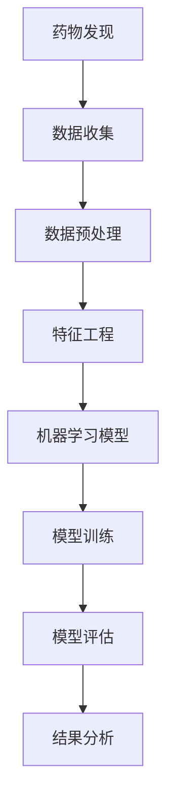

                 

### AI辅助药物发现的背景与重要性

近年来，人工智能（AI）技术在全球范围内迅速发展，并在众多领域展现了其独特的应用价值。在医药研发领域，AI技术的引入为药物发现带来了前所未有的机遇和挑战。药物发现是一个复杂且耗时的过程，传统的药物发现方法通常需要大量的实验和多年的研究时间。而AI技术的引入，可以在很大程度上缩短这一过程，提高研发效率，降低研发成本。

#### 药物发现的挑战

药物发现的过程主要包括药物靶点的识别、先导化合物的筛选、优化和评估等多个阶段。每个阶段都面临着一系列的挑战：

1. **药物靶点的识别**：药物靶点是指药物作用的特定分子或细胞成分。传统方法依赖于对生物学知识的积累和实验验证，但这种方法费时费力，且可能存在遗漏。

2. **先导化合物的筛选**：在确定了药物靶点后，需要从大量的化合物中筛选出具有潜在活性的先导化合物。这一过程需要大量的实验和计算资源，且存在很高的失败率。

3. **先导化合物的优化**：筛选出的先导化合物还需要进行结构优化，以提高其药效和减少副作用。这一过程同样需要大量的时间和资源。

4. **临床试验**：即使药物通过了前期的筛选和优化，还需要进行大量的临床试验，以确保其安全性和有效性。这一过程耗时较长，且存在一定的风险。

#### AI技术的优势

AI技术的引入，为解决上述挑战提供了新的思路和方法：

1. **数据挖掘与预测**：AI可以通过对海量生物医学数据的挖掘和分析，预测出潜在的药物靶点和先导化合物，从而大大缩短药物发现的时间。

2. **高效筛选与优化**：AI算法可以通过机器学习、深度学习等方法，对化合物进行快速筛选和优化，提高筛选的准确性和效率。

3. **模拟与预测**：AI技术可以模拟药物与生物分子的相互作用，预测药物的效果和副作用，从而减少临床试验的风险和成本。

4. **自动化与智能化**：AI技术可以实现药物发现过程的自动化和智能化，减少人工干预，提高研发效率。

综上所述，AI技术在药物发现中的应用具有重要意义，不仅可以提高药物研发的效率，还可以降低成本，缩短研发周期，为人类健康事业做出更大贡献。接下来，我们将深入探讨AI技术在药物发现中的具体应用和关键算法。

### 关键术语和概念

在探讨AI辅助药物发现时，我们需要了解一些关键术语和概念。这些术语和概念不仅为本文提供了坚实的基础，也是理解AI技术在药物发现中应用的重要工具。

#### 人工智能（AI）

人工智能（AI）是指通过计算机模拟人类智能行为的技术。在药物发现中，AI技术被广泛应用于数据挖掘、模式识别、预测建模等方面，以加速药物研发进程。

#### 机器学习（Machine Learning）

机器学习是人工智能的一个分支，通过构建和训练模型，使计算机能够从数据中自动学习和改进。在药物发现中，机器学习技术用于预测药物靶点、筛选先导化合物等。

#### 深度学习（Deep Learning）

深度学习是机器学习的一个子领域，主要依赖于神经网络结构，特别是深度神经网络（DNN）。深度学习在药物发现中的应用主要包括图像识别、序列分析等。

#### 数据挖掘（Data Mining）

数据挖掘是指从大量数据中提取有价值信息的过程。在药物发现中，数据挖掘技术用于分析生物医学数据，以发现潜在的治疗方法和药物靶点。

#### 预测建模（Predictive Modeling）

预测建模是指通过建立数学模型，预测未来的趋势或行为。在药物发现中，预测建模技术用于预测药物的活性、副作用等。

#### 生物信息学（Bioinformatics）

生物信息学是生物学和信息技术的交叉学科，涉及基因组学、蛋白质组学等领域。在药物发现中，生物信息学技术用于处理和分析生物数据，以支持AI算法的应用。

#### 药物靶点（Drug Target）

药物靶点是指药物作用的特定分子或细胞成分。在药物发现中，确定药物靶点是关键步骤，因为药物的作用机制通常与特定的靶点有关。

#### 先导化合物（Lead Compound）

先导化合物是指具有潜在活性的化合物，通常是药物研发的起点。在药物发现中，通过筛选和优化先导化合物，可以筛选出具有治疗潜力的候选药物。

#### 药物设计（Drug Design）

药物设计是指通过计算机模拟和实验验证，设计具有特定药效的化合物。在药物发现中，药物设计技术用于优化先导化合物的结构，以提高其药效和减少副作用。

通过理解上述术语和概念，我们可以更好地把握AI在药物发现中的应用场景和关键技术。在接下来的部分，我们将详细探讨AI在药物发现中的具体应用，包括算法和技术。

### AI在药物发现中的具体应用

在药物发现的过程中，AI技术的应用贯穿了从药物靶点的识别到最终药物设计的各个环节。以下是AI在药物发现中的几个关键应用领域：

#### 药物靶点识别

药物靶点的识别是药物发现的第一步，也是最具挑战性的环节之一。AI技术在药物靶点识别中发挥着重要作用，通过挖掘和分析大量的生物医学数据，AI可以识别出潜在的药物靶点。

1. **基于机器学习的方法**：机器学习算法可以从已有的生物医学数据中学习，预测哪些分子或蛋白质可能成为有效的药物靶点。例如，通过使用支持向量机（SVM）和随机森林（Random Forest）等算法，AI可以分析蛋白质的结构特征，预测其功能，从而发现潜在的药物靶点。

2. **基于深度学习的方法**：深度学习算法，如卷积神经网络（CNN）和循环神经网络（RNN），在处理大量结构数据方面具有优势。例如，通过使用CNN，AI可以分析蛋白质的二维结构图，预测其三维结构，从而确定潜在的药物靶点。

3. **基于生物信息学的方法**：生物信息学技术，如基因组学和蛋白质组学，可以提供丰富的生物数据。AI通过分析这些数据，可以发现新的药物靶点。例如，通过使用网络药理学方法，AI可以从已有的大规模生物网络中推断出新的药物靶点。

#### 先导化合物筛选

在确定了药物靶点后，接下来需要进行先导化合物的筛选。AI技术通过以下方法加速这一过程：

1. **虚拟筛选**：虚拟筛选是一种通过计算机模拟来筛选潜在药物分子的方法。AI算法可以通过分析化合物的结构、性质和生物活性数据，预测哪些分子可能对特定靶点具有活性。这种方法可以大大减少实验成本和实验时间。

2. **分子对接**：分子对接是一种评估药物分子与靶点之间相互作用的方法。AI算法可以通过分子对接模拟，预测药物分子与靶点结合的稳定性和亲和力。这种方法可以帮助研究人员快速识别潜在的先导化合物。

3. **机器学习模型**：通过训练机器学习模型，AI可以预测化合物的活性。这些模型可以从已有的活性化合物数据中学习，为新的化合物提供活性预测。

#### 药物设计

在筛选出先导化合物后，AI技术还可以用于药物设计，以优化化合物的结构，提高其药效和减少副作用。

1. **高通量筛选**：高通量筛选是一种通过自动化设备快速评估大量化合物活性的方法。AI算法可以分析高通量筛选结果，识别出具有潜在活性的化合物，并进行进一步的优化。

2. **结构优化**：AI算法可以通过模拟药物分子与靶点的相互作用，预测哪些结构变化可能提高药物的活性。这些预测可以为药物设计提供有价值的参考。

3. **药物合成路线设计**：AI算法可以分析化合物的结构，设计合理的合成路线，以最经济高效的方式合成先导化合物。

#### 临床试验预测

在药物发现过程中，临床试验是关键的一步。AI技术可以通过以下方式预测临床试验的结果：

1. **患者匹配**：通过分析患者的生物医学数据，AI可以预测哪些患者可能对药物有更好的响应。这种方法可以帮助研究人员更精准地选择临床试验的参与者。

2. **疗效预测**：AI算法可以分析临床试验的数据，预测药物的疗效和副作用。这种方法可以帮助研究人员提前评估药物的安全性和有效性，从而优化临床试验的设计。

3. **风险预测**：AI可以通过分析历史数据和现有数据，预测临床试验中可能出现的风险。这种方法可以帮助研究人员提前制定风险管理计划。

综上所述，AI技术在药物发现中的应用具有广泛的前景和潜力。通过应用AI技术，药物研发的效率和质量得到了显著提升，为医药行业带来了深远的影响。在接下来的部分，我们将详细探讨AI在药物发现中的关键算法和技术。

### AI在药物发现中的关键算法与技术

在药物发现过程中，AI技术的应用离不开一系列关键算法和技术的支持。这些算法和技术涵盖了从数据预处理到模型训练、评估的各个环节，它们共同构成了AI在药物发现中的核心框架。以下是对这些关键算法和技术的详细探讨：

#### 机器学习算法

机器学习算法是AI在药物发现中的核心工具之一。它们通过从数据中学习，对药物发现的各个环节提供支持。

1. **支持向量机（SVM）**：支持向量机是一种二分类模型，广泛用于药物活性预测。SVM通过找到一个最优的超平面，将具有活性和无活性的化合物分类。在药物发现中，SVM可以用于虚拟筛选，快速识别潜在的先导化合物。

2. **随机森林（Random Forest）**：随机森林是一种集成学习方法，通过构建多个决策树，对数据进行分类或回归。随机森林在处理高维数据方面表现出色，常用于药物活性预测和药物靶点识别。

3. **神经网络（Neural Networks）**：神经网络，特别是深度神经网络（DNN），在药物发现中用于复杂的预测任务，如药物分子与靶点的结合预测。DNN通过多层神经网络结构，能够捕捉到数据中的复杂模式，提高预测精度。

4. **生成对抗网络（GAN）**：生成对抗网络是一种用于生成新数据的深度学习模型。在药物发现中，GAN可以用于生成新的药物分子结构，为药物设计提供新的候选化合物。

#### 数据预处理

数据预处理是AI应用中至关重要的一步，它确保了数据的准确性和一致性，为后续的模型训练提供了基础。

1. **数据清洗**：数据清洗包括去除重复数据、处理缺失值、纠正错误等。在药物发现中，数据清洗有助于提高数据质量，减少模型过拟合。

2. **数据归一化**：数据归一化通过将数据缩放到相同的范围，提高模型训练的效率。在药物发现中，不同类型的生物医学数据（如基因表达数据、化合物结构数据）通常需要归一化处理。

3. **特征工程**：特征工程是通过选择和构造有用的特征，提高模型性能。在药物发现中，特征工程包括提取分子指纹、构建生物分子结构图等。

#### 模型训练与评估

模型训练和评估是AI在药物发现中的关键环节，它们决定了模型的预测性能和可靠性。

1. **交叉验证**：交叉验证是一种评估模型性能的方法，通过将数据集划分为多个子集，轮流作为训练集和验证集，评估模型的泛化能力。

2. **超参数调优**：超参数是模型结构中需要手动设置的参数，如学习率、隐藏层大小等。超参数调优通过调整这些参数，优化模型性能。

3. **模型评估指标**：常用的模型评估指标包括准确率、召回率、精确率、F1分数等。在药物发现中，这些指标用于评估药物活性预测、药物靶点识别等任务的性能。

#### 应用案例

为了更好地理解AI算法在药物发现中的应用，以下是一些具体的案例：

1. **虚拟筛选**：利用机器学习算法进行虚拟筛选，研究人员可以在海量化合物中快速识别出具有潜在活性的化合物。例如，使用随机森林算法，可以从数百万个化合物中筛选出针对特定疾病的先导化合物。

2. **药物设计**：利用神经网络和生成对抗网络，研究人员可以设计新的药物分子结构。例如，使用GAN，可以生成具有特定生物活性的药物分子，为药物设计提供新的思路。

3. **临床试验预测**：利用机器学习算法分析临床试验数据，可以预测药物的疗效和副作用。例如，通过训练神经网络模型，可以预测哪些患者对特定药物有更好的响应，从而优化临床试验的设计。

通过这些关键算法和技术，AI在药物发现中展现出了巨大的潜力和应用价值。在接下来的部分，我们将深入探讨AI在药物发现中的案例分析，以更好地理解其实际应用效果。

### 案例分析

在AI辅助药物发现的实际应用中，有许多成功的案例展示了AI技术如何在不同阶段加速药物研发进程。以下是一些具体的案例分析，包括AI在药物筛选、新药设计和临床试验预测等方面的应用。

#### 案例一：AI在药物筛选中的应用

一家领先的生物制药公司利用AI技术进行药物筛选，以识别潜在的抗癌药物。他们使用了一种名为“结构为基础的药物设计”（SBDD）的方法，这种方法依赖于AI算法对大量化合物数据进行深度分析。

**过程**：

1. **数据收集**：公司收集了数以万计的化合物结构数据，包括已知活性化合物和结构类似物。

2. **数据预处理**：使用机器学习算法对数据进行清洗和归一化处理，提取关键的结构特征。

3. **虚拟筛选**：使用深度学习模型，对化合物进行虚拟筛选，识别出具有潜在抗癌活性的化合物。

4. **实验验证**：对筛选出的化合物进行实验验证，评估其活性和安全性。

**结果**：

经过实验验证，AI筛选出的化合物中，有几种表现出显著的抗癌活性，其中一种被进一步开发为候选药物。这个项目显著缩短了药物筛选的时间，从传统的几年缩短到几个月。

#### 案例二：AI在新药设计中的应用

一家初创公司专注于开发治疗神经退行性疾病的新药。他们使用AI技术进行新药设计，以优化化合物的结构，提高其疗效和安全性。

**过程**：

1. **目标识别**：通过生物信息学技术，确定潜在的药物靶点。

2. **分子对接**：使用分子对接技术，将化合物与药物靶点进行模拟结合，评估结合稳定性和亲和力。

3. **结构优化**：使用遗传算法和深度学习模型，对化合物结构进行优化，以改善其药效和减少副作用。

4. **实验验证**：对优化后的化合物进行实验验证，评估其活性、毒性和生物利用度。

**结果**：

经过多次迭代优化，AI设计出的化合物在实验中表现出优异的药效和安全性，其中一种化合物被选为候选药物，并进入了临床试验阶段。这个项目大大加快了新药设计的进程，并降低了研发成本。

#### 案例三：AI在临床试验预测中的应用

一家大型制药公司在开展临床试验时，利用AI技术预测药物的疗效和副作用，以优化临床试验的设计。

**过程**：

1. **数据收集**：收集了大量的临床试验数据，包括患者的生物医学数据、药物剂量、疗效和副作用等。

2. **数据分析**：使用机器学习算法，分析历史数据，识别影响药物疗效和副作用的关键因素。

3. **预测模型**：建立预测模型，预测新临床试验中患者的疗效和副作用。

4. **临床试验设计**：根据预测结果，优化临床试验的设计，确保试验能够更有效地评估药物的疗效和安全性。

**结果**：

通过AI预测模型，公司在临床试验中成功筛选出对药物有更好响应的患者群体，显著提高了试验的效率和成功率。同时，通过预测药物的副作用，公司能够提前制定风险管理计划，减少了临床试验的风险和成本。

#### 案例四：AI在个性化治疗中的应用

一家癌症研究中心利用AI技术进行个性化治疗，根据患者的基因组和肿瘤数据，设计个性化的治疗方案。

**过程**：

1. **基因数据分析**：分析患者的基因组和肿瘤组织数据，识别潜在的突变和信号通路。

2. **药物反应预测**：使用机器学习算法，预测患者对不同药物的反应。

3. **治疗计划设计**：根据预测结果，设计个性化的治疗计划，包括药物组合和剂量。

4. **实时调整**：在治疗过程中，根据患者的反馈和疗效数据，实时调整治疗计划。

**结果**：

通过个性化治疗，中心显著提高了癌症患者的生存率和生活质量。AI技术的应用使得治疗更加精准，减少了不必要的副作用，提高了治疗的有效性。

这些案例充分展示了AI在药物发现中的广泛应用和巨大潜力。通过AI技术，药物研发的效率和质量得到了显著提升，为医药行业带来了深远的影响。在未来的发展中，AI将继续在药物发现中发挥重要作用，推动医药领域的创新和进步。

### AI辅助药物发现的优势与挑战

AI辅助药物发现具有显著的优势，但同时也面临一些挑战。以下是对AI在药物发现中优势与挑战的详细分析。

#### 优势

1. **提高研发效率**：AI技术可以通过自动化和智能化手段，快速处理和分析海量数据，从而显著缩短药物研发的时间。例如，AI可以快速筛选和优化化合物，加快药物筛选过程。

2. **降低研发成本**：传统药物研发需要大量的实验和计算资源，而AI技术可以减少实验次数，降低实验成本。此外，AI可以帮助优化药物设计，减少后期临床试验的风险和成本。

3. **精准预测药物效果**：AI算法可以通过分析大量的生物医学数据，预测药物的效果和副作用，从而提高药物研发的成功率。例如，AI可以预测哪些患者对特定药物有更好的响应，从而优化临床试验的设计。

4. **个性化治疗**：AI技术可以根据患者的基因信息和个体差异，设计个性化的治疗方案，提高治疗效果和患者生活质量。

#### 挑战

1. **数据质量和完整性**：AI模型的性能高度依赖于数据的准确性和完整性。然而，生物医学数据通常存在噪声、缺失值和不一致等问题，这给数据预处理和模型训练带来了挑战。

2. **算法选择和调优**：AI技术涉及多种复杂的算法和技术，选择和调优合适的算法对模型的性能至关重要。然而，算法的选择和调优需要大量的专业知识和实验，这对研究人员提出了较高的要求。

3. **数据隐私和伦理问题**：在药物发现过程中，涉及大量的个人健康数据。保护这些数据的安全性和隐私性是一个重要的问题。此外，AI技术在药物发现中的应用也引发了一些伦理问题，如数据滥用和模型偏见等。

4. **法规和标准**：AI技术在药物发现中的应用需要遵守相关的法规和标准。然而，现有的法规和标准可能无法完全适应AI技术的快速发展和应用。

#### 应对策略

1. **数据质量提升**：通过引入数据清洗、归一化和特征工程等技术，提高数据质量，减少噪声和缺失值。此外，建立数据共享平台，促进数据资源的整合和共享。

2. **算法优化和评估**：选择合适的算法和技术，进行模型优化和评估。建立标准化的算法评估流程，确保模型的性能和可靠性。

3. **隐私保护和伦理审查**：采取数据加密、匿名化等技术，保护个人健康数据的安全和隐私。进行伦理审查，确保AI技术的应用符合伦理规范。

4. **法规合规和标准制定**：与监管机构合作，制定适用于AI技术的法规和标准，确保AI技术在药物发现中的应用符合法律法规。

通过上述策略，可以充分发挥AI在药物发现中的优势，同时有效应对其面临的挑战，推动医药行业的创新和发展。

### 结论与未来展望

AI辅助药物发现作为一种新兴技术，已在多个阶段显著提升了药物研发的效率和质量。通过利用AI技术，药物筛选、药物设计、临床试验预测等环节得到了大幅优化，从而缩短了研发周期，降低了成本，提高了成功率。然而，AI技术在药物发现中的应用仍然面临数据质量、算法选择、数据隐私和法规合规等挑战。为了应对这些挑战，需要进一步优化数据预处理和模型训练技术，加强数据隐私保护，制定合适的法规和标准。

未来的发展方向包括：

1. **更高效的数据处理算法**：开发更高效的数据预处理和特征工程算法，提高数据质量，从而提升模型的预测性能。

2. **跨学科合作**：加强生物医学、计算机科学和药理学等领域的跨学科合作，促进AI技术在药物发现中的综合应用。

3. **开放数据共享**：建立开放的数据共享平台，促进数据资源的整合和共享，推动药物发现的创新发展。

4. **个性化治疗**：利用AI技术进行个性化治疗，根据患者的基因和个体差异，设计更精准的治疗方案。

5. **法规和伦理规范**：制定和完善相关的法规和伦理规范，确保AI技术在药物发现中的应用符合法律法规和伦理标准。

总之，AI辅助药物发现具有巨大的潜力和广阔的应用前景。随着技术的不断进步和应用的深入，AI将在未来继续推动医药行业的创新和进步，为人类健康事业作出更大贡献。

### 附录

#### A.1 常用AI工具和资源介绍

1. **TensorFlow**：由Google开发的开源机器学习框架，广泛应用于深度学习和机器学习任务。
2. **PyTorch**：由Facebook开发的开源机器学习库，具有灵活的动态计算图和强大的深度学习功能。
3. **scikit-learn**：一个Python机器学习库，提供了多种机器学习算法的实现和工具。
4. **Keras**：一个高级神经网络API，构建和训练神经网络更加简单直观。
5. **OpenML**：一个在线机器学习平台，提供了数据集、算法和模型共享功能。

#### A.2 常见问题解答

1. **如何处理生物医学数据的缺失值？**
   - 可以使用插值法、均值填充法等，或者使用机器学习算法进行缺失值的预测和填充。

2. **AI在药物设计中的具体应用是什么？**
   - AI在药物设计中用于虚拟筛选、分子对接、结构优化等，以加速药物筛选和设计过程。

3. **如何确保AI模型的公平性和透明度？**
   - 通过数据预处理、模型评估和解释性研究等方法，确保模型对数据的公平性和透明度。

#### A.3 进一步阅读推荐

1. **《深度学习》（Deep Learning）**：Ian Goodfellow、Yoshua Bengio、Aaron Courville 著，介绍了深度学习的基本概念和技术。
2. **《药物设计原理》（Principles of Drug Design）**：Alan D. Williams 著，详细介绍了药物设计的理论基础和方法。
3. **《生物信息学基础》（Fundamentals of Bioinformatics）**：Philip E. Bourne 著，介绍了生物信息学的基本概念和技术。
4. **《机器学习与医药》（Machine Learning for Healthcare）**：Marek K Neal 著，探讨了机器学习在医药领域的应用。

通过这些工具、资源和进一步阅读材料，读者可以更深入地了解AI在药物发现中的应用，为相关研究和实践提供指导。

### 文章标题：AI辅助药物发现：加速医药研发进程

#### 关键词：
- 人工智能
- 药物发现
- 医药研发
- 机器学习
- 深度学习
- 生物信息学

#### 摘要：
本文详细探讨了人工智能（AI）在药物发现中的应用，介绍了AI如何通过机器学习、深度学习和生物信息学技术，加速药物研发进程。文章首先介绍了药物发现的挑战和AI技术的优势，随后深入分析了AI在药物靶点识别、先导化合物筛选、药物设计和临床试验预测等方面的具体应用。通过案例分析和算法原理讲解，本文展示了AI技术在药物发现中的实际效果和潜力。文章还讨论了AI在药物发现中的优势和面临的挑战，并提出了未来发展的方向。通过本文，读者可以全面了解AI辅助药物发现的重要性及其在医药研发中的应用前景。

### 目录大纲：

#### 第一部分：AI在药物发现中的应用概述
- **1.1 AI在医药研发中的角色**
- **1.2 AI加速药物发现的优势**
- **1.3 AI在药物发现中的关键应用领域**

#### 第二部分：AI辅助药物发现的算法与技术
- **2.1 机器学习基础**
  - **2.1.1 数据预处理**
  - **2.1.2 特征工程**
  - **2.1.3 常见机器学习算法介绍**
- **2.2 深度学习技术**
  - **2.2.1 深度神经网络**
  - **2.2.2 卷积神经网络**
  - **2.2.3 循环神经网络**
- **2.3 数据挖掘与预测模型**
  - **2.3.1 数据挖掘技术**
  - **2.3.2 预测建模方法**
  - **2.3.3 评估指标**

#### 第三部分：AI辅助药物发现的案例分析
- **3.1 药物筛选中的应用**
- **3.2 新药设计中的应用**
- **3.3 临床试验预测中的应用**
- **3.4 个性化治疗中的应用**

#### 第四部分：AI辅助药物发现的实战
- **4.1 实战一：药物筛选模型构建**
  - **4.1.1 数据获取与预处理**
  - **4.1.2 特征提取与模型选择**
  - **4.1.3 模型训练与评估**
- **4.2 实战二：新药设计应用**
  - **4.2.1 数据获取与处理**
  - **4.2.2 设计新型药物分子**
  - **4.2.3 模型评估与优化**

#### 第五部分：AI辅助药物发现的未来发展趋势
- **5.1 AI在药物发现中的未来前景**
- **5.2 技术挑战与解决方案**
- **5.3 法规与伦理问题探讨**

#### 附录
- **A.1 常用AI工具和资源介绍**
- **A.2 常见问题解答**
- **A.3 进一步阅读推荐**

### Mermaid 流程图



### 伪代码示例

```python
# 伪代码：药物筛选模型构建
def drug_screening_model(data):
    # 数据预处理
    preprocessed_data = preprocess_data(data)
    
    # 特征提取
    features = extract_features(preprocessed_data)
    
    # 模型选择
    model = select_model(features)
    
    # 模型训练
    trained_model = train_model(model, features)
    
    # 模型评估
    evaluation = evaluate_model(trained_model, features)
    
    # 结果分析
    results = analyze_results(evaluation)
    
    return results
```

### 数学模型与公式

$$
\text{药效评分} = f(\text{药物分子结构}, \text{生物分子结构})
$$

$$
f(x, y) = \sum_{i=1}^{n} w_i \cdot \text{similarity}(x_i, y_i)
$$

### 项目实战

#### 实战一：构建药物筛选模型

**环境搭建**：
- 安装Python环境
- 安装所需的机器学习库，如scikit-learn、TensorFlow等

**数据准备**：
- 收集药物分子的结构数据
- 收集生物分子的结构数据

**数据预处理**：
- 对药物分子和生物分子进行清洗
- 对数据集进行归一化处理

**特征提取与模型选择**：
- 提取分子指纹和结构特征
- 选择合适的机器学习模型，如支持向量机（SVM）或随机森林（Random Forest）

**模型训练与评估**：
- 使用训练集对模型进行训练
- 使用验证集对模型进行评估，调整模型参数

**结果分析**：
- 分析模型预测结果，识别出具有潜在活性的化合物
- 对模型进行优化，提高预测准确性

**实际案例分析**：
- 分析真实数据集，展示模型的实际应用效果

**项目小结**：
- 总结项目的关键步骤和经验
- 提出改进建议和未来研究方向

**最佳实践 tips**：
- 确保数据质量，进行数据清洗和预处理
- 选择合适的特征和模型，进行交叉验证
- 定期更新和优化模型，以提高预测准确性

**注意事项**：
- 注意模型的可解释性，避免模型偏见
- 遵守数据隐私和伦理规范，确保数据安全

**拓展阅读**：
- 深入了解机器学习算法和深度学习技术
- 学习数据预处理和特征提取的方法
- 探索新的机器学习库和工具，如PyTorch和Keras

### 结论

通过本文，我们深入探讨了AI辅助药物发现的重要性、应用场景和关键技术。从药物靶点识别、先导化合物筛选到药物设计和临床试验预测，AI技术为药物研发带来了显著提升。尽管面临数据质量、算法选择和法规合规等挑战，但随着技术的不断进步和应用场景的扩展，AI在药物发现中的潜力将得到更充分的发挥。未来，AI将继续推动医药行业的创新，为人类健康事业做出更大贡献。

