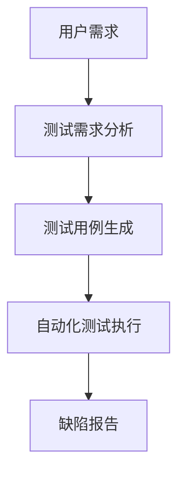
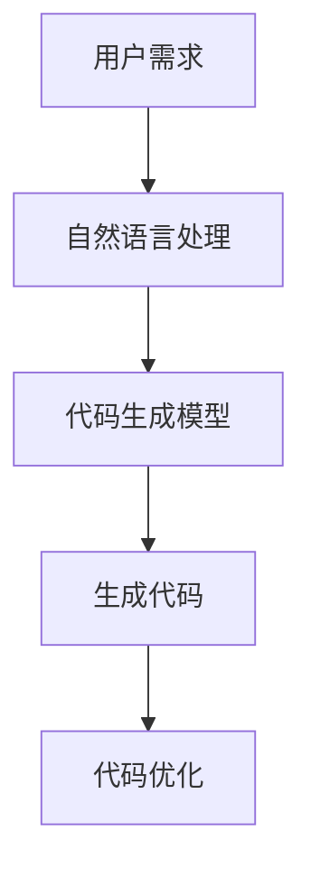
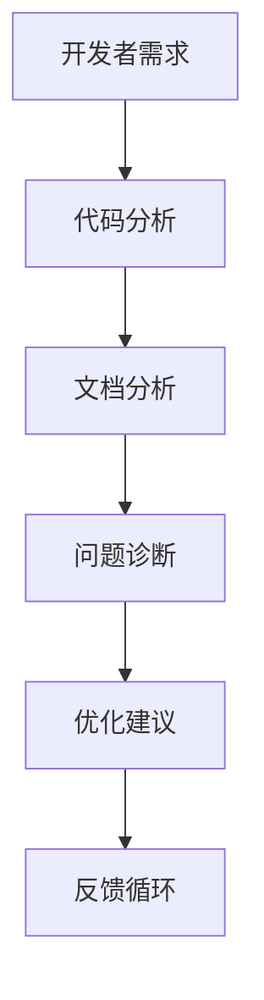
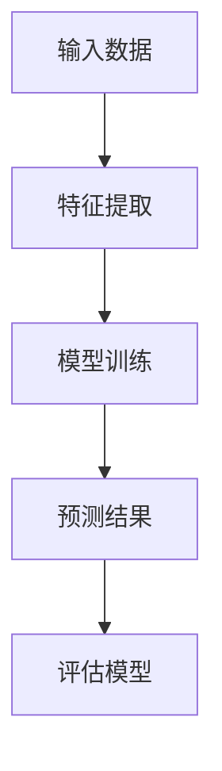
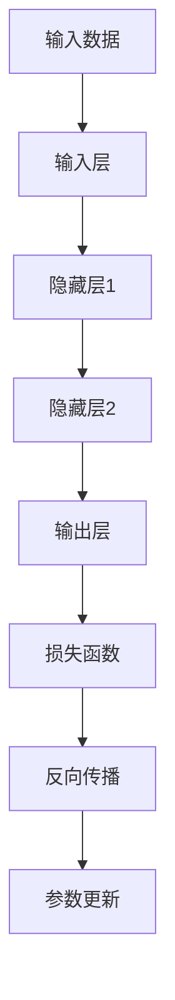
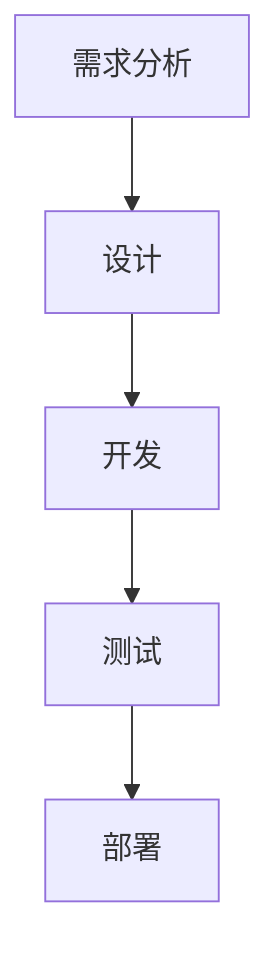

                 

# AI辅助软件开发：提升企业研发效率

> 关键词：人工智能，软件开发，研发效率，AI辅助工具，企业IT管理

> 摘要：本文深入探讨了人工智能（AI）在软件开发中的应用及其对企业研发效率的显著提升作用。文章首先介绍了AI与软件开发的融合趋势，随后详细讲解了AI核心概念与算法原理。通过实际项目案例，展示了AI在代码生成、自动化测试、智能助手等领域的应用。此外，文章还分析了AI在研发管理、代码质量保证、团队协作等方面的应用策略，并对未来AI辅助软件开发的趋势与挑战进行了展望。

## 目录

1. 引言
2. AI与软件开发的融合趋势
3. AI核心概念与算法原理
   - 机器学习算法原理
   - 深度学习算法原理
4. AI辅助软件开发实践
   - AI辅助软件开发流程
   - AI工具与框架介绍
   - AI辅助软件开发项目案例
5. 提升企业研发效率的策略
   - AI在研发管理中的应用
   - AI在代码质量保证中的应用
   - AI在软件开发团队协作中的应用
6. 未来展望与挑战
7. 结论

## 1. 引言

随着科技的快速发展，人工智能（AI）技术逐渐成为推动各行各业变革的重要力量。在软件开发领域，AI的应用不仅改变了传统软件开发模式，还极大地提升了企业的研发效率。本文旨在探讨AI辅助软件开发的各个方面，分析其在提升企业研发效率方面的潜力与实际应用。

AI在软件开发中的应用主要体现在以下几个方面：

- **自动化测试**：通过AI技术，自动化测试能够更高效地识别软件缺陷，提高测试准确性和覆盖率。
- **代码生成**：AI可以基于现有代码库或模板，自动生成代码，减少开发工作量，提高开发效率。
- **智能助手**：AI智能助手能够提供代码优化建议，协助开发者解决问题，提高开发体验。
- **需求分析**：AI可以帮助企业更好地理解用户需求，快速生成需求文档，降低沟通成本。

本文将按照以下结构展开：

- **第2章**：介绍AI与软件开发的融合趋势。
- **第3章**：详细讲解AI核心概念与算法原理。
- **第4章**：探讨AI辅助软件开发的具体实践。
- **第5章**：分析AI在提升企业研发效率方面的策略。
- **第6章**：展望AI辅助软件开发的未来趋势与挑战。

## 2. AI与软件开发的融合趋势

AI与软件开发的融合趋势日益显著，主要体现在以下几个方面：

### 2.1 自动化测试

自动化测试是AI在软件开发中最早应用的一个领域。通过AI技术，自动化测试可以更高效地执行，更准确地识别软件缺陷。传统的自动化测试往往依赖于脚本编写，而AI可以学习和预测潜在的缺陷模式，从而生成更有效的测试用例。

#### 关键概念与联系

**AI核心概念**：机器学习、深度学习

**联系**：机器学习与深度学习是AI的核心技术，它们可以帮助自动化测试工具更好地学习和预测软件缺陷。

**Mermaid 流程图**：



### 2.2 代码生成

代码生成是AI在软件开发中的另一个重要应用领域。通过AI技术，可以自动生成代码，减少开发者的工作量，提高开发效率。AI代码生成工具通常基于机器学习和深度学习技术，可以从大量的代码库中学习编程模式，从而生成高质量的代码。

#### 关键概念与联系

**AI核心概念**：自然语言处理、代码生成模型

**联系**：自然语言处理技术可以帮助AI理解开发者的需求，而代码生成模型则可以基于这些需求生成相应的代码。

**Mermaid 流程图**：



### 2.3 智能助手

智能助手是AI在软件开发中的另一个重要应用领域。智能助手可以协助开发者解决问题，提供代码优化建议，提高开发效率。智能助手通常基于机器学习和深度学习技术，可以从大量的代码库和文档中学习，从而提供有针对性的建议。

#### 关键概念与联系

**AI核心概念**：机器学习、深度学习、自然语言处理

**联系**：机器学习和深度学习技术可以帮助智能助手学习和理解开发者的代码和文档，而自然语言处理技术则可以帮助智能助手理解开发者的自然语言需求。

**Mermaid 流�序图**：



## 3. AI核心概念与算法原理

在本章节中，我们将详细讲解AI的核心概念与算法原理，包括机器学习算法原理和深度学习算法原理。

### 3.1 机器学习算法原理

机器学习是AI的核心技术之一，它使计算机系统能够从数据中学习并做出决策。以下是机器学习算法的基本原理：

#### 关键概念与联系

**关键概念**：
- **监督学习**：通过已知输入输出对模型进行训练，然后用于预测未知数据。
- **无监督学习**：仅通过输入数据，寻找数据中的模式或结构。
- **强化学习**：通过奖励机制，使模型在环境中学习最佳行为策略。

**联系**：监督学习、无监督学习和强化学习是机器学习的三种主要学习方式，它们相互补充，可以解决不同类型的AI问题。

#### Mermaid 流程图



#### Python源代码示例

```python
import numpy as np
from sklearn.linear_model import LinearRegression

# 生成训练数据
X = np.array([[1], [2], [3], [4], [5]])
y = np.array([1, 2, 2.5, 3, 4])

# 创建线性回归模型
model = LinearRegression()

# 模型训练
model.fit(X, y)

# 预测结果
prediction = model.predict([[6]])

print("预测结果：", prediction)
```

### 3.2 深度学习算法原理

深度学习是机器学习的一个子领域，它通过多层神经网络对数据进行建模。以下是深度学习算法的基本原理：

#### 关键概念与联系

**关键概念**：
- **神经网络**：由多层神经元组成的计算模型。
- **激活函数**：用于引入非线性因素的函数，如ReLU、Sigmoid、Tanh等。
- **反向传播**：用于计算模型参数梯度，优化模型性能。

**联系**：神经网络、激活函数和反向传播是深度学习算法的核心组成部分，它们共同作用，使深度学习模型能够学习复杂的数据模式。

#### Mermaid 流程图



#### Python源代码示例

```python
import tensorflow as tf
from tensorflow.keras import layers, models

# 构建深度学习模型
model = models.Sequential()
model.add(layers.Dense(64, activation='relu', input_shape=(64,)))
model.add(layers.Dense(64, activation='relu'))
model.add(layers.Dense(10, activation='softmax'))

# 编译模型
model.compile(optimizer='adam',
              loss='categorical_crossentropy',
              metrics=['accuracy'])

# 加载数据
(x_train, y_train), (x_test, y_test) = tf.keras.datasets.mnist.load_data()

# 预处理数据
x_train = x_train.reshape((60000, 784))
x_test = x_test.reshape((10000, 784))

x_train = x_train.astype('float32') / 255
x_test = x_test.astype('float32') / 255

# 转换为one-hot编码
num_classes = 10
y_train = tf.keras.utils.to_categorical(y_train, num_classes)
y_test = tf.keras.utils.to_categorical(y_test, num_classes)

# 训练模型
model.fit(x_train, y_train, epochs=5, batch_size=64)
```

## 4. AI辅助软件开发实践

在本章节中，我们将探讨AI辅助软件开发的实践，包括AI辅助软件开发流程、常用AI工具与框架介绍，以及AI辅助软件开发项目案例。

### 4.1 AI辅助软件开发流程

AI辅助软件开发流程主要包括以下步骤：

1. **需求分析**：通过AI技术分析用户需求，生成需求文档。
2. **设计**：利用AI工具生成软件架构和设计文档。
3. **开发**：使用AI工具自动生成代码或辅助开发者编写代码。
4. **测试**：利用AI技术进行自动化测试，提高测试效率和准确性。
5. **部署**：利用AI工具进行软件性能优化和部署。

#### Mermaid 流程图



### 4.2 常用AI工具与框架介绍

在AI辅助软件开发中，常用的AI工具和框架包括以下几种：

1. **TensorFlow**：一款广泛使用的深度学习框架，适用于构建和训练复杂的神经网络。
2. **PyTorch**：一款流行的深度学习框架，具有简洁的API和强大的灵活性。
3. **Scikit-learn**：一款适用于机器学习的Python库，提供了丰富的算法和工具。
4. **AutoML**：自动化机器学习工具，可以自动选择最优的模型和参数。

### 4.3 AI辅助软件开发项目案例

下面是一个具体的AI辅助软件开发项目案例：

**项目名称**：智能代码审查系统

**项目背景**：在软件开发生命周期中，代码审查是确保代码质量的重要环节。传统的代码审查过程耗时且容易出现错误。为了提高代码审查的效率和准确性，我们开发了一款基于AI的智能代码审查系统。

**项目实现**：

1. **需求分析**：通过自然语言处理技术分析用户的需求，生成审查准则。
2. **设计**：利用深度学习技术构建代码审查模型，包括语法分析、代码风格检查、潜在缺陷检测等模块。
3. **开发**：使用TensorFlow框架训练和部署代码审查模型，实现自动化代码审查功能。
4. **测试**：使用Scikit-learn库进行模型测试，评估模型的准确性和效率。
5. **部署**：将代码审查系统集成到持续集成和持续部署（CI/CD）流程中，实现自动化的代码审查。

**项目小结**：通过AI辅助软件开发的实践，我们成功地提高了代码审查的效率和准确性，减少了人工审查的工作量，为软件开发团队提供了强有力的支持。

## 5. 提升企业研发效率的策略

在本章节中，我们将探讨如何利用AI技术提升企业研发效率，包括AI在研发管理、代码质量保证和软件开发团队协作中的应用。

### 5.1 AI在研发管理中的应用

AI技术可以帮助企业在研发管理中实现以下几个方面的提升：

1. **需求分析**：通过自然语言处理技术，AI可以帮助企业快速理解用户需求，生成详细的需求文档，减少沟通成本。
2. **项目管理**：AI可以自动化项目进度监控，预测项目风险，提供项目优化建议，提高项目管理效率。
3. **风险控制**：AI可以分析历史项目数据，识别潜在的风险点，提前采取措施，降低项目失败的可能性。

### 5.2 AI在代码质量保证中的应用

AI技术在代码质量保证中的应用主要体现在以下几个方面：

1. **代码审查**：AI可以自动化代码审查，识别代码中的潜在缺陷，提供优化建议，提高代码质量。
2. **测试**：AI可以自动化测试用例生成，提高测试覆盖率，减少测试成本。
3. **性能优化**：AI可以分析代码性能，提供优化建议，提高软件性能。

### 5.3 AI在软件开发团队协作中的应用

AI技术在软件开发团队协作中的应用主要体现在以下几个方面：

1. **智能助手**：AI智能助手可以协助开发者解决问题，提供代码优化建议，提高开发效率。
2. **知识管理**：AI可以帮助企业构建知识库，提高团队成员的知识共享和协作效率。
3. **团队沟通**：AI可以分析团队沟通数据，提供沟通优化建议，提高团队协作效果。

## 6. 未来展望与挑战

在未来，AI辅助软件开发将继续发展，面临以下几个趋势和挑战：

1. **趋势**：
   - **AI模型集成化**：企业将更加重视AI模型集成到现有的软件开发流程中，提高研发效率。
   - **多模态学习**：AI将能够处理更多种类的数据，如文本、图像、声音等，实现更复杂的任务。

2. **挑战**：
   - **数据隐私与安全**：在应用AI技术时，企业需要确保数据的隐私和安全。
   - **算法透明性与可解释性**：随着AI模型复杂度的增加，提高算法的透明性和可解释性将成为重要挑战。

## 7. 结论

人工智能在软件开发中的应用不仅改变了传统开发模式，还极大地提升了企业的研发效率。本文通过详细分析AI与软件开发的融合趋势、核心概念与算法原理、辅助软件开发实践以及提升研发效率的策略，展示了AI在软件开发中的巨大潜力。未来，随着AI技术的不断进步，我们有理由相信，AI将为企业带来更多的创新和效率提升。

## 参考文献

1. Goodfellow, I., Bengio, Y., & Courville, A. (2016). *Deep Learning*. MIT Press.
2. Mitchell, T. M. (1997). *Machine Learning*. McGraw-Hill.
3. Russell, S., & Norvig, P. (2010). *Artificial Intelligence: A Modern Approach*. Prentice Hall.
4. Hochreiter, S., & Schmidhuber, J. (1997). *Long short-term memory*. Neural Computation, 9(8), 1735-1780.

## 作者信息

作者：AI天才研究院/AI Genius Institute & 禅与计算机程序设计艺术 /Zen And The Art of Computer Programming

