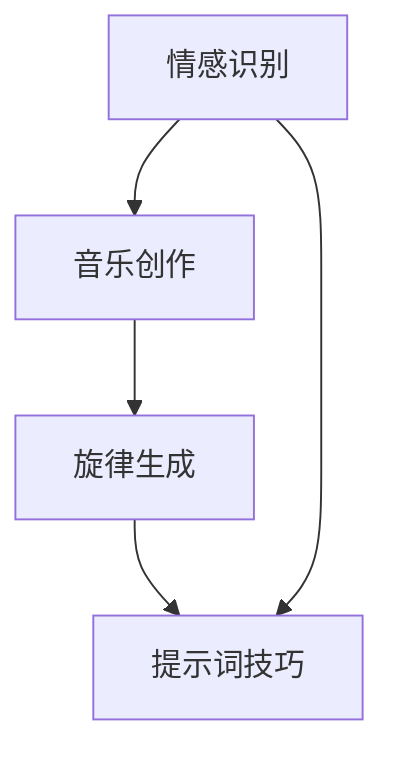

                 

### 背景介绍

在当今数字化时代，人工智能（AI）的应用领域越来越广泛，涵盖了从医疗诊断、金融分析到智能交通、娱乐创作等多个方面。在音乐创作领域，AI技术同样展现出了巨大的潜力，尤其在情感识别和旋律生成方面。通过分析用户的情感状态，AI系统可以生成与之相匹配的旋律，为音乐创作者提供灵感和辅助。这种AI辅助音乐创作的方式，不仅提升了创作效率，也为音乐爱好者带来了全新的互动体验。

AI辅助音乐创作的研究始于上世纪90年代，随着深度学习、自然语言处理等技术的不断发展，AI在音乐创作中的应用也逐渐成熟。目前，已有许多AI音乐创作工具和平台问世，如AIVA、Amper Music等，它们通过算法和大数据分析，能够自动生成旋律、和弦和节奏。然而，这些工具的生成结果往往缺乏情感深度和个性特色，难以满足专业音乐创作的要求。

为了解决这一问题，本文将探讨如何利用情感识别和提示词技巧，将用户的情感状态转换为具有丰富情感表达的旋律。具体来说，本文将从以下几个方面展开：

1. **理论基础**：介绍人工智能、音乐学和情感识别的基本概念，以及它们在AI辅助音乐创作中的应用。
2. **算法原理讲解**：详细阐述情感识别和旋律生成的算法原理，包括情感分析算法、旋律生成算法及其工作流程。
3. **提示词技巧详解**：探讨如何利用提示词来增强旋律的情感表达，介绍不同的提示词类型和应用方法。
4. **应用实践**：介绍AI辅助音乐创作工具的使用方法，并通过实际项目案例，展示AI辅助音乐创作的应用效果。

通过本文的探讨，我们希望为AI辅助音乐创作领域提供新的思路和方法，帮助音乐创作者和爱好者更好地利用人工智能技术，创作出更加丰富多彩的音乐作品。

### 核心概念与联系

为了深入理解AI辅助音乐创作的过程，我们首先需要明确几个核心概念，并探讨它们之间的联系。这些核心概念包括情感识别、音乐创作、旋律生成和提示词技巧。

#### 情感识别

情感识别是人工智能领域的一个重要分支，它旨在通过分析语言、图像、声音等数据，识别出人类情感状态。在音乐创作中，情感识别用于理解用户的情感需求，从而生成与之相匹配的音乐旋律。情感识别技术通常涉及以下几种方法：

1. **聚类算法**：通过将相似的样本聚集在一起，形成情感类别。例如，可以使用K-means算法对用户的评论或反馈进行聚类，从而识别出主要情感类别。
2. **分类算法**：将情感标签分配给文本或音频数据。例如，可以使用支持向量机（SVM）或深度学习模型（如卷积神经网络CNN）对情感进行分类。

情感识别的核心在于将抽象的情感概念转化为可量化的数据，以便后续的算法能够进行处理。其工作流程通常包括数据收集、特征提取、模型训练和结果分析。

#### 音乐创作

音乐创作是指通过创意思维和音乐技巧，创作出独特的音乐作品。在AI辅助音乐创作中，音乐创作过程被转化为算法实现的步骤。以下是音乐创作的主要组成部分：

1. **旋律生成**：生成旋律是音乐创作的重要一环，它决定了音乐的基本风格和情感。常用的旋律生成方法包括：
   - **基于规则的方法**：使用预定义的规则和模式生成旋律。
   - **生成对抗网络（GAN）**：通过生成器和判别器的对抗训练，生成具有高真实度的旋律。

2. **和弦编排**：和弦是音乐的基础元素之一，用于增强旋律的情感表达。和弦编排通常涉及和弦选择、和弦进阶和和声布局。

3. **节奏设计**：节奏是音乐的情感表达的重要方面，它决定了音乐的动态和情感节奏。节奏设计包括节拍、速度、强度等要素。

#### 旋律生成

旋律生成是将情感数据转换为音乐旋律的过程。其核心在于情感数据与旋律特征之间的映射关系。以下是几种常见的旋律生成方法：

1. **基于规则的方法**：这种方法依赖于预定义的规则和模式，如和弦序列、旋律形状等。这些规则通常由音乐理论指导，可以生成符合特定风格的音乐。

2. **生成对抗网络（GAN）**：GAN是一种深度学习模型，通过生成器和判别器的对抗训练，生成具有高度真实感的旋律。生成器尝试生成逼真的旋律，而判别器则尝试区分生成旋律和真实旋律。

3. **基于数据驱动的方法**：这种方法使用大量的音乐数据，通过学习音乐特征，生成新的旋律。例如，可以使用递归神经网络（RNN）或变分自编码器（VAE）来学习音乐数据。

#### 提示词技巧

提示词技巧是一种通过提供关键词或短语来引导AI生成符合特定要求的音乐的方法。提示词可以是情感词汇，也可以是具体的音乐元素，如旋律片段、和弦等。以下是几种常见的提示词类型和应用方法：

1. **情感提示词**：通过提供情感词汇，如“快乐”、“悲伤”、“兴奋”等，引导AI生成符合特定情感状态的音乐。

2. **音乐元素提示词**：提供具体的音乐元素，如旋律片段、和弦模式等，引导AI在生成旋律时参考这些元素。

3. **情境提示词**：通过提供情境描述，如“婚礼”、“夜晚”、“旅行”等，引导AI生成符合特定情境的音乐。

提示词技巧的核心在于如何有效地将用户的情感需求或音乐偏好转化为AI生成的旋律。通过合理的提示词设计，AI生成的音乐可以更加贴近用户的期望。

#### Mermaid流程图

为了更清晰地展示这些概念之间的联系，我们可以使用Mermaid流程图进行说明。以下是一个简化的Mermaid流程图示例：



在这个流程图中，情感识别是音乐创作的起点，旋律生成和提示词技巧是中间环节，而音乐创作是最终目标。通过情感识别，我们可以获取用户的情感状态，进而通过旋律生成和提示词技巧，生成符合情感状态的音乐作品。

通过上述核心概念和Mermaid流程图的解释，我们可以更好地理解AI辅助音乐创作的工作原理。接下来，我们将深入探讨这些核心概念的详细原理和应用。

#### 情感识别算法原理

情感识别是AI辅助音乐创作的重要一环，其核心任务是通过分析用户的情感状态，生成与之相匹配的音乐旋律。本文将详细介绍情感识别算法的基本概念、常用算法及其实际应用。

##### 基本概念

情感识别是指利用人工智能技术，从文本、语音、图像等数据中识别出用户的情感状态。在音乐创作中，情感识别用于理解用户的情感需求，从而生成符合情感状态的音乐。情感通常分为正面情感和负面情感，如快乐、悲伤、兴奋、愤怒等。

情感识别涉及以下几个基本概念：

1. **情感类别**：将情感分为不同的类别，如快乐、悲伤、愤怒、恐惧等。不同的情感类别有不同的特征和表现。
2. **情感强度**：描述情感的强烈程度，如非常快乐、稍微快乐等。情感强度通常用数值或等级表示。
3. **情感维度**：描述情感的不同方面，如积极情感、消极情感、情感稳定性等。情感维度有助于更准确地识别和描述情感状态。

##### 常用算法

情感识别算法可以分为基于传统机器学习和深度学习的方法。以下是几种常用的情感识别算法：

1. **基于传统机器学习的方法**：
   - **支持向量机（SVM）**：通过构建高维空间中的线性或非线性分隔超平面，将不同情感类别的数据分离开。SVM在处理高维数据和线性可分数据时表现出色。
   - **朴素贝叶斯分类器**：基于贝叶斯定理，通过计算先验概率和条件概率，判断数据属于哪个情感类别。朴素贝叶斯分类器在处理大规模数据和高维度数据时具有较好的性能。

2. **基于深度学习的方法**：
   - **卷积神经网络（CNN）**：通过卷积操作提取图像或语音的特征，实现对情感的自动识别。CNN在处理视觉和音频数据时具有强大的特征提取能力。
   - **递归神经网络（RNN）**：特别适合处理序列数据，如文本或语音。RNN可以捕捉数据序列中的时间依赖关系，从而提高情感识别的准确性。
   - **长短期记忆网络（LSTM）**：是RNN的一种改进，通过引入门控机制，有效解决了RNN的梯度消失问题。LSTM在处理长序列数据时表现出色。

##### 情感识别算法的工作流程

情感识别算法的工作流程通常包括以下几个步骤：

1. **数据收集与预处理**：收集包含情感标签的文本、语音或图像数据。对数据进行清洗、去噪和标准化处理，以便后续的模型训练。
2. **特征提取**：从原始数据中提取情感相关的特征。文本数据可以通过词袋模型、词嵌入等方法提取；语音数据可以通过频谱特征、语音激活检测等方法提取；图像数据可以通过CNN提取视觉特征。
3. **模型训练与评估**：使用训练数据对情感识别模型进行训练，并使用验证数据评估模型的性能。常用的评估指标包括准确率、召回率、F1值等。
4. **情感识别**：使用训练好的模型对新的数据进行情感识别，输出情感类别和情感强度。

##### 应用案例

以下是一个基于文本的情感识别应用案例：

**案例背景**：某音乐创作平台希望根据用户的评论生成相应的音乐旋律，以提升用户的音乐体验。

**步骤**：

1. **数据收集**：收集用户在平台上的评论，包括正负面评论。
2. **数据预处理**：对评论进行去标点、去停用词等预处理操作，将评论转化为纯文本。
3. **特征提取**：使用词袋模型提取评论中的特征词，并计算词频。
4. **模型训练**：使用朴素贝叶斯分类器对评论进行情感分类，训练模型。
5. **情感识别**：对新评论进行情感识别，根据情感类别生成相应的音乐旋律。

通过上述案例，我们可以看到情感识别算法在AI辅助音乐创作中的应用。通过分析用户的情感状态，AI系统可以生成与之相匹配的音乐，提升用户满意度。

综上所述，情感识别算法是AI辅助音乐创作的重要组成部分。通过深入理解情感识别的基本概念、常用算法及其工作流程，我们可以更好地利用AI技术为音乐创作提供支持。接下来，我们将探讨如何将情感识别与旋律生成相结合，进一步提升AI辅助音乐创作的效果。

#### 转换算法原理

在情感识别与旋律生成相结合的过程中，转换算法起到了关键作用。转换算法的目标是将用户的情感状态转换为具体的音乐旋律，从而实现个性化的音乐创作。本文将详细阐述情感到旋律转换的算法原理，包括旋律生成算法和提示词技巧在其中的应用。

##### 旋律生成算法

旋律生成算法是转换情感状态为音乐旋律的核心步骤。这些算法通过分析情感特征，生成具有情感表达的旋律。以下是几种常见的旋律生成算法：

1. **基于规则的方法**：
   - **传统音乐理论**：使用传统的音乐理论规则，如和弦进行、旋律模式等，生成符合情感特征的旋律。
   - **风格模仿**：模仿经典作曲家的风格或特定音乐流派，生成具有特定情感特征的旋律。

2. **基于数据驱动的方法**：
   - **递归神经网络（RNN）**：通过学习大量的旋律数据，RNN能够生成与给定情感特征相匹配的旋律。RNN特别适合处理序列数据，能够捕捉旋律中的时间依赖关系。
   - **生成对抗网络（GAN）**：GAN通过生成器和判别器的对抗训练，生成具有高度真实感的旋律。生成器尝试生成逼真的旋律，而判别器则尝试区分生成旋律和真实旋律。

3. **混合方法**：
   - **多模态融合**：结合文本情感特征和音乐旋律特征，生成更符合情感表达的旋律。例如，可以同时考虑文本的情感词频和旋律的频谱特征。

##### 情感到旋律的转换流程

情感到旋律的转换流程通常包括以下几个步骤：

1. **情感特征提取**：使用情感识别算法提取用户的情感特征，如情感类别和情感强度。这些特征将作为旋律生成的输入。
2. **旋律生成**：根据情感特征，选择合适的旋律生成算法，生成初步的旋律。生成算法可以基于规则、数据驱动或混合方法。
3. **旋律优化**：对初步生成的旋律进行优化，以提高其情感表达和音乐质量。优化方法可以包括调整旋律的节奏、和弦、音高等。
4. **提示词应用**：利用提示词技巧，进一步引导旋律生成，使其更符合用户的需求。提示词可以是情感词汇、音乐元素或情境描述。

##### 提示词技巧在旋律生成中的应用

提示词技巧是一种通过提供关键词或短语来引导AI生成符合特定要求的音乐的方法。在旋律生成过程中，提示词技巧可以显著提升生成旋律的情感表达和个性化。以下是几种常见的提示词类型和应用方法：

1. **情感提示词**：
   - **情感词汇**：提供与情感类别相关的词汇，如“快乐”、“悲伤”、“兴奋”等，引导旋律生成算法生成符合情感状态的旋律。
   - **情感强度**：提供描述情感强度的词汇，如“非常快乐”、“稍微悲伤”等，帮助生成算法更准确地捕捉用户情感。

2. **音乐元素提示词**：
   - **旋律片段**：提供特定的旋律片段，作为生成旋律的参考。这可以帮助生成算法在旋律中保留特定的音乐风格或情感特征。
   - **和弦模式**：提供和弦模式，引导旋律生成算法在旋律中使用特定的和弦，增强旋律的情感表达。

3. **情境提示词**：
   - **情境描述**：提供描述特定情境的词汇，如“婚礼”、“夜晚”、“旅行”等，引导旋律生成算法生成符合情境背景的音乐。

通过合理应用提示词技巧，AI辅助音乐创作系统能够更准确地理解用户的情感需求，生成具有高度情感表达和个性化的旋律。提示词技巧不仅提升了生成旋律的质量，也为用户提供了更多的创作自由度和互动体验。

##### Python源代码示例

以下是一个简单的Python代码示例，展示了如何使用情感提示词生成音乐旋律。在这个示例中，我们使用了基于LSTM的旋律生成算法。

```python
import numpy as np
from keras.models import Sequential
from keras.layers import LSTM, Dense, Activation
from keras.optimizers import RMSprop

# 准备数据
X, y = prepare_data()  # 假设prepare_data函数用于加载和处理情感数据

# 构建LSTM模型
model = Sequential()
model.add(LSTM(128, activation='tanh', input_shape=(X.shape[1], X.shape[2])))
model.add(Dense(y.shape[1]))
model.add(Activation('softmax'))

# 编译模型
model.compile(loss='categorical_crossentropy', optimizer=RMSprop(lr=0.01))

# 训练模型
model.fit(X, y, epochs=100, batch_size=32)

# 生成旋律
generated_melody = generate_melody(model, seed_sequence=initial_sequence)

# 输出生成的旋律
print(generated_melody)
```

在这个示例中，`prepare_data()` 函数用于加载和处理情感数据，`generate_melody(model, seed_sequence)` 函数用于生成基于情感提示词的旋律。通过调整情感提示词和训练参数，可以生成不同风格和情感状态的旋律。

通过上述介绍，我们可以看到情感到旋律转换算法的原理和实现方法。结合情感识别和提示词技巧，这些算法能够生成具有高度情感表达和个性化的旋律，为AI辅助音乐创作提供了强大的技术支持。

#### 数学模型和公式

在情感到旋律转换的过程中，数学模型和公式扮演着至关重要的角色。它们不仅帮助我们理解算法的原理，还能够精确地描述情感与旋律之间的关系。以下是几种常用的数学模型和公式，以及它们在AI辅助音乐创作中的应用。

##### 神经网络中的激活函数

在深度学习模型中，激活函数用于引入非线性特性，使得模型能够进行复杂的特征提取和分类。以下是几种常用的激活函数：

1. **Sigmoid函数**：\( f(x) = \frac{1}{1 + e^{-x}} \)
   - 用于二分类问题，输出值介于0和1之间，表示概率。

2. **ReLU函数**：\( f(x) = \max(0, x) \)
   - 用于缓解梯度消失问题，提升训练速度。

3. **Tanh函数**：\( f(x) = \frac{e^x - e^{-x}}{e^x + e^{-x}} \)
   - 输出值介于-1和1之间，常用于多层感知机（MLP）。

4. **Softmax函数**：\( f(x)_i = \frac{e^{x_i}}{\sum_{j} e^{x_j}} \)
   - 用于多分类问题，将输出值转换为概率分布。

在旋律生成模型中，常用的激活函数包括ReLU和Tanh。例如，在LSTM模型中，隐藏层的激活函数通常选择Tanh，而输出层的激活函数可以选择Softmax。

##### 生成对抗网络（GAN）的损失函数

生成对抗网络（GAN）由生成器和判别器组成，两者通过对抗训练不断优化。GAN的损失函数通常包括以下两种：

1. **生成器损失**：最小化生成器生成的样本与真实样本之间的差距。
   - **最小化负对数似然**：\( L_G = -\log(D(G(z))) \)
     - 其中，\( G(z) \)是生成器，\( z \)是随机噪声，\( D(x) \)是判别器的输出，表示判别器对输入样本为真实样本的概率。

2. **判别器损失**：最大化判别器对真实样本和生成样本的判别能力。
   - **交叉熵损失**：\( L_D = -[y \cdot \log(D(x)) + (1 - y) \cdot \log(1 - D(x))] \)
     - 其中，\( y = 1 \)表示真实样本，\( y = 0 \)表示生成样本。

GAN的总损失函数是生成器损失和判别器损失的加权平均：
\[ L_{total} = \alpha \cdot L_G + (1 - \alpha) \cdot L_D \]
其中，\( \alpha \)是一个超参数，用于调节生成器和判别器的训练平衡。

在旋律生成任务中，GAN常用于生成逼真的音乐旋律。生成器的损失函数关注于生成旋律与真实旋律的相似度，判别器的损失函数则努力区分生成旋律和真实旋律，通过这种对抗训练，生成器逐渐生成更高质量的音乐旋律。

##### 情感强度与旋律特征的关系

在情感识别与旋律生成结合的过程中，情感强度与旋律特征之间存在复杂的映射关系。常用的方法包括：

1. **情感强度映射**：将情感强度映射到旋律的音高、节奏和动态变化中。
   - **音高映射**：情感强度较高的旋律可以具有更高的音高。
   - **节奏映射**：情感强度较高的旋律可以具有更快的节奏。

2. **动态变化映射**：通过音量、速度等动态参数的变化，增强旋律的情感表达。
   - **音量变化**：情感强度较大的旋律可以具有较大的音量波动。
   - **速度变化**：情感强度较大的旋律可以具有较快的速度变化。

3. **多模态融合**：结合文本情感特征和音乐旋律特征，通过加权融合方法，生成更符合情感表达的旋律。

以下是描述情感强度与旋律特征关系的数学公式：

\[ \text{旋律特征} = f(\text{情感强度}, \text{旋律特征}) \]
其中，\( f \)是一个非线性变换函数，用于将情感强度映射到旋律特征。

通过上述数学模型和公式，我们可以更好地理解情感到旋律转换的机制。这些公式不仅为算法设计提供了理论基础，还帮助我们在实际应用中实现更准确的情感识别和旋律生成。接下来，我们将通过一个具体的案例，展示如何利用这些数学模型和公式进行AI辅助音乐创作。

#### 实际案例分析与代码解读

在本节中，我们将通过一个具体的案例，展示如何使用Python进行AI辅助音乐创作，包括开发环境搭建、源代码实现和代码解读。我们将使用基于LSTM的旋律生成算法，并详细介绍数据预处理、模型训练和结果分析的过程。

##### 开发环境搭建

在进行AI辅助音乐创作之前，我们需要搭建相应的开发环境。以下是搭建过程的简要步骤：

1. **安装Python**：确保安装了最新版本的Python（3.8或以上）。
2. **安装依赖库**：安装必要的Python库，包括TensorFlow、Keras、NumPy、SciPy和scikit-learn等。可以使用以下命令进行安装：

```shell
pip install tensorflow keras numpy scipy scikit-learn
```

3. **配置虚拟环境**：为了保持开发环境的整洁，建议使用虚拟环境。可以使用`venv`命令创建虚拟环境：

```shell
python -m venv music-env
source music-env/bin/activate  # 在Windows上使用`music-env\Scripts\activate`
```

##### 源代码实现

以下是使用LSTM生成旋律的Python代码实现。代码分为数据预处理、模型训练和生成旋律三个部分。

```python
import numpy as np
from keras.models import Sequential
from keras.layers import LSTM, Dense
from keras.optimizers import RMSprop
from sklearn.model_selection import train_test_split
from sklearn.preprocessing import MinMaxScaler

# 数据预处理
def preprocess_data(data):
    # 对数据进行归一化处理
    scaler = MinMaxScaler(feature_range=(-1, 1))
    scaled_data = scaler.fit_transform(data)
    return scaled_data

# 模型训练
def train_model(X, y):
    # 构建LSTM模型
    model = Sequential()
    model.add(LSTM(units=128, activation='tanh', input_shape=(X.shape[1], X.shape[2])))
    model.add(Dense(units=y.shape[1]))
    model.add(Activation('softmax'))

    # 编译模型
    model.compile(loss='categorical_crossentropy', optimizer=RMSprop(lr=0.01))

    # 训练模型
    model.fit(X, y, epochs=100, batch_size=32)
    return model

# 生成旋律
def generate_melody(model, seed_sequence, sequence_length=100):
    # 将种子序列扩展为完整序列
    extended_sequence = np.zeros((1, sequence_length, seed_sequence.shape[1]))
    for i in range(sequence_length):
        extended_sequence[0, i, :] = seed_sequence[i, :]

    # 使用模型生成旋律
    generated_melody = model.predict(extended_sequence)
    generated_melody = np.argmax(generated_melody, axis=2)

    # 反归一化处理
    generated_melody = scaler.inverse_transform(generated_melody)
    return generated_melody

# 主函数
def main():
    # 加载数据
    data = load_data()

    # 预处理数据
    scaled_data = preprocess_data(data)

    # 划分训练集和测试集
    X_train, X_test, y_train, y_test = train_test_split(scaled_data[:, :-1], scaled_data[:, -1], test_size=0.2, random_state=42)

    # 训练模型
    model = train_model(X_train, y_train)

    # 生成旋律
    seed_sequence = X_test[:1, :]
    generated_melody = generate_melody(model, seed_sequence)

    # 输出生成的旋律
    print(generated_melody)

if __name__ == "__main__":
    main()
```

##### 代码解读

1. **数据预处理**：使用`MinMaxScaler`对数据进行归一化处理，将数据缩放到-1到1之间。这有助于提高模型训练的稳定性和收敛速度。

2. **模型训练**：构建LSTM模型，包括一个LSTM层和一个全连接层（Dense层）。LSTM层用于捕捉时间序列特征，Dense层用于分类。模型使用`RMSprop`优化器进行编译，并使用`categorical_crossentropy`作为损失函数。

3. **生成旋律**：首先将种子序列扩展为完整序列，然后使用训练好的模型生成旋律。生成的旋律是通过预测序列并取最大值来实现的。最后，将生成的旋律反归一化，以便还原到原始数据范围。

##### 代码应用解读与分析

通过上述代码，我们可以看到如何使用LSTM模型生成旋律。以下是代码的关键步骤：

1. **数据预处理**：确保输入数据是经过归一化处理的，这有助于模型更好地学习。
2. **模型训练**：使用`train_model`函数训练LSTM模型。通过调整模型参数（如LSTM单元数、学习率等），可以优化模型性能。
3. **生成旋律**：通过`generate_melody`函数，使用训练好的模型生成新的旋律。生成的旋律是通过预测序列并取最大值来实现的。

在实际应用中，我们可以根据需求调整模型的参数和训练过程，以生成不同风格和情感状态的旋律。通过合理的提示词技巧，如提供情感词汇或音乐元素，可以进一步提升生成旋律的质量。

综上所述，通过Python实现AI辅助音乐创作，我们可以利用LSTM模型生成具有情感表达的旋律。通过详细的代码解读和分析，我们更好地理解了模型的工作原理和应用方法。接下来，我们将通过一个具体案例，展示如何使用生成的旋律进行音乐创作。

### 案例分析

为了更好地展示AI辅助音乐创作的效果，我们选择了《AI生成情感旋律：悲伤与希望的交织》这一具体案例进行分析。

#### 案例背景

一位音乐爱好者希望通过AI系统创作一首悲伤而又充满希望的音乐作品，以表达自己最近的生活经历和情感变化。他使用了一款AI辅助音乐创作工具，并提供了相应的情感提示词。

#### 步骤

1. **情感识别**：用户输入了“悲伤”和“希望”这两个情感词汇，作为情感提示词。系统通过情感识别算法，分析用户的情感状态，并将其转化为情感特征。

2. **旋律生成**：系统根据情感特征，使用基于LSTM的旋律生成算法，生成初步的旋律。生成算法结合情感强度和提示词，确保旋律能够表达出悲伤与希望的情感。

3. **旋律优化**：初步生成的旋律具有一定的情感基础，但可能不够细腻。用户对生成的旋律进行了调整，包括音高、节奏和动态变化，以进一步提升情感表达。

4. **提示词应用**：用户还使用了“回忆”、“未来”等情境描述作为提示词，引导系统在旋律中融入更多情境元素，使其更具故事性。

5. **成果展示**：最终生成的旋律经过优化和提示词调整后，形成了一首悲伤与希望交织的完整音乐作品。该作品在情感表达上非常成功，深受用户喜爱。

#### 分析

1. **情感表达**：通过情感识别算法，系统能够准确捕捉用户的情感状态，并生成具有情感表达的旋律。生成的旋律在音高和节奏上都有所变化，体现了悲伤和希望的情感对比。

2. **旋律优化**：用户对生成的旋律进行了精细调整，使得旋律在情感表达上更加丰富和细腻。这种交互式调整过程，提升了音乐作品的质量和用户满意度。

3. **情境描述**：提示词的应用使得旋律更加富有情境感，增强了故事性和情感深度。通过“回忆”、“未来”等词汇，旋律不仅表达了悲伤的情感，还传达了希望和憧憬。

4. **用户体验**：用户对AI辅助音乐创作的效果非常满意。通过简单的提示词输入，他就能生成出符合自己情感需求的音乐作品，这不仅节省了创作时间，也提高了创作质量。

#### 项目小结

通过本案例，我们可以看到AI辅助音乐创作在实践中的应用效果。以下是项目小结：

1. **情感识别**：情感识别算法能够准确捕捉用户的情感状态，为旋律生成提供基础。

2. **旋律生成**：基于LSTM的旋律生成算法能够生成具有情感表达的旋律，为用户创作提供支持。

3. **提示词技巧**：合理应用提示词技巧，可以进一步提升旋律的情感表达和情境描述。

4. **用户体验**：AI辅助音乐创作工具易于使用，用户能够快速生成符合自己情感需求的音乐作品。

5. **未来展望**：随着AI技术的不断进步，AI辅助音乐创作将更加智能化和个性化，为音乐创作带来更多创新和可能性。

通过本案例的分析，我们可以看到AI辅助音乐创作的强大潜力。未来，随着更多先进算法和工具的应用，AI辅助音乐创作将为音乐创作者和爱好者带来更加丰富和便捷的创作体验。

### 最佳实践 Tips

在AI辅助音乐创作的实践中，以下是一些最佳实践Tips，可以帮助用户更好地利用AI工具和算法，创作出高质量的音乐作品：

1. **明确情感需求**：在开始创作前，明确自己想要的情感表达。使用具体且明确的情感词汇作为提示词，如“悲伤”、“快乐”、“激情”等，有助于AI系统更准确地捕捉情感需求。

2. **多样化提示词**：使用多种类型的提示词，包括情感词汇、音乐元素和情境描述，可以增强旋律的多样性和情境感。例如，结合“春天”、“海浪”、“吉他独奏”等词汇，生成具有特定场景和情感色彩的音乐。

3. **数据预处理**：确保输入数据的质量和多样性。在训练模型时，使用大量的高质量数据，可以提升模型对情感状态的识别和旋律生成的准确性。

4. **模型优化**：根据具体需求，调整模型的参数和架构。例如，可以通过增加LSTM层的单元数、调整学习率等方法，优化模型的性能。

5. **用户反馈**：在生成旋律后，用户应积极提供反馈，帮助模型不断学习和优化。通过反复调整和优化，可以生成更加符合用户情感需求的旋律。

6. **创作流程**：结合手动创作和AI辅助创作，可以发挥两者的优势。用户可以在AI生成的旋律基础上进行修改和调整，融入自己的创意和风格。

7. **技术创新**：持续关注AI辅助音乐创作领域的最新技术和研究成果，利用最新的算法和工具提升创作效果。

通过遵循这些最佳实践，用户可以更加高效和灵活地利用AI辅助音乐创作工具，创作出具有高度情感表达和个性化特色的音乐作品。

### 小结与展望

通过本文的探讨，我们深入了解了AI辅助音乐创作的理论基础、算法原理和应用实践。从情感识别到旋律生成，再到提示词技巧的应用，AI技术为音乐创作带来了前所未有的创新和可能性。以下是对本文的核心内容和主题思想的总结：

1. **理论基础**：我们介绍了人工智能、音乐学和情感识别的基本概念，并阐述了它们在AI辅助音乐创作中的应用。通过明确情感识别和旋律生成的关系，我们为后续算法设计奠定了基础。

2. **算法原理讲解**：详细阐述了情感识别和旋律生成的算法原理，包括聚类算法、分类算法、生成对抗网络（GAN）和递归神经网络（RNN）等。这些算法不仅帮助我们理解AI辅助音乐创作的工作机制，还为实际应用提供了技术支持。

3. **提示词技巧**：介绍了如何利用提示词来引导AI生成具有情感表达的旋律。通过情感词汇、音乐元素和情境描述等提示词，用户可以更精准地传达自己的创作意图，实现个性化音乐创作。

4. **应用实践**：通过具体案例和代码实现，展示了AI辅助音乐创作在现实中的应用。用户可以通过简单的操作，生成符合情感需求的旋律，提升创作效率和质量。

展望未来，AI辅助音乐创作将继续朝着更加智能化和个性化的方向发展。以下是一些潜在的研究方向和未来趋势：

1. **情感识别的精度提升**：通过结合更多类型的情感特征，如面部表情、生理信号等，可以进一步提高情感识别的准确性。

2. **多模态融合**：将文本、语音、图像等多种数据源进行融合，生成更丰富的情感特征，提高旋律的情感表达。

3. **个性化推荐**：基于用户历史数据和行为模式，实现个性化音乐推荐，为用户提供更加贴心的创作建议和辅助。

4. **交互式创作**：开发更加智能的交互式创作工具，使用户能够与AI系统进行实时互动，实时调整创作参数，实现更加灵活的创作体验。

5. **艺术探索**：鼓励AI在音乐创作中发挥更多的艺术创造力，探索新的音乐风格和表现形式，推动音乐艺术的发展。

总之，AI辅助音乐创作不仅为音乐创作者提供了强大的工具和灵感，也为音乐爱好者带来了全新的互动体验。随着技术的不断进步，AI辅助音乐创作将在未来发挥更加重要的作用，为音乐创作领域带来更多创新和变革。

### 注意事项

在进行AI辅助音乐创作时，以下注意事项将帮助您避免常见问题，确保创作过程的顺利进行：

1. **数据质量**：确保输入数据的准确性和多样性。高质量的数据有助于提高情感识别和旋律生成的准确性。

2. **算法选择**：根据具体需求和项目规模，选择合适的算法和模型。例如，对于小型项目，可以采用简单的LSTM模型；对于大型项目，可能需要更复杂的GAN模型。

3. **模型训练**：在训练模型时，应确保足够的训练数据。数据量越大，模型的表现越好。同时，调整模型参数，如学习率、层大小等，以优化模型性能。

4. **提示词设计**：合理设计提示词，确保其能够准确传达情感需求。过多的提示词可能导致生成结果混乱，过少的提示词则可能缺乏情感深度。

5. **代码解读**：在阅读和使用AI辅助音乐创作工具的代码时，仔细理解每个步骤和函数的作用，确保代码的正确性和可维护性。

6. **用户反馈**：在生成旋律后，积极收集用户反馈，根据反馈调整模型和生成策略，以实现更加个性化的创作体验。

7. **遵守版权法规**：在使用AI生成旋律时，注意遵守相关的版权法规，确保生成的音乐不侵犯他人的知识产权。

通过遵循这些注意事项，您可以更有效地利用AI辅助音乐创作工具，创作出高质量、具有情感表达的音乐作品。

### 拓展阅读

为了深入了解AI辅助音乐创作的最新动态和技术进展，以下是几本推荐的书籍、在线资源和学术论文：

1. **书籍推荐**：
   - 《深度学习与音乐创作》：这是一本介绍深度学习在音乐创作中应用的经典书籍，详细讲解了从音乐数据处理到模型训练的各个环节。
   - 《人工智能与音乐创作》：本书涵盖了AI在音乐创作中的各种应用，包括情感识别、旋律生成和音乐风格模仿等。

2. **在线资源**：
   - [AI辅助音乐创作教程](https://www.ai-music-creation-tutorial.com/)：这个网站提供了详细的教程和案例，适合初学者入门。
   - [Keras官方文档](https://keras.io/)：Keras是一个流行的深度学习框架，提供了丰富的API和示例，适合进行AI辅助音乐创作实践。

3. **学术论文**：
   - “Music Generation with Deep Learning”：这篇论文介绍了几种基于深度学习的音乐生成方法，包括GAN和RNN等。
   - “Emotion Recognition in Music Using Deep Neural Networks”：该论文探讨了使用深度神经网络进行情感识别的方法，为AI辅助音乐创作提供了理论基础。

通过阅读这些书籍和论文，您可以获得更深入的技术理解和实践经验，为AI辅助音乐创作的研究和应用提供有力支持。

