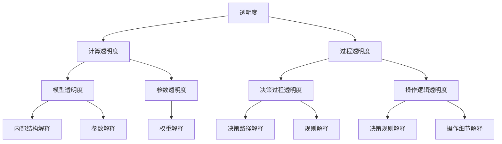

                 

### 1.2 AI可解释性的基本概念

#### 1.2.1 AI可解释性的定义

AI可解释性指的是人工智能系统在执行任务时，能够以一种清晰且直观的方式解释其决策过程的能力。可解释性使人类用户能够理解模型为何做出特定决策，从而增加用户对人工智能系统的信任和接受度。

#### 1.2.2 AI可解释性的重要性

- **用户信任**：高度可解释的AI系统能够增强用户对AI系统的信任，特别是在涉及重要决策的场合，如医疗诊断、金融服务等。
- **监管合规**：可解释性有助于满足法律法规的要求，确保AI系统在合规的框架内运作。
- **故障诊断与改进**：通过可解释性，用户和开发者可以更容易地识别AI系统的错误和缺陷，从而进行有效的故障诊断和改进。

#### 1.2.3 AI可解释性的层次结构

AI可解释性可以分为以下层次：

1. **局部可解释性**：
   - 焦点：单个预测结果或决策的详细解释。
   - 方法：通常涉及局部解释模型（如LIME、SHAP等）。

2. **全局可解释性**：
   - 焦点：整个模型的工作机制和决策逻辑。
   - 方法：通常涉及可视化（如决策树、神经网络激活图等）。

3. **模型级别可解释性**：
   - 焦点：整个模型的构建过程和参数设置。
   - 方法：通常涉及模型文档化、源代码审查等。

### 1.3 透明度与可解释性的关系

AI透明度和AI可解释性密切相关，但略有区别。透明度强调的是系统在执行任务时的可见性，而可解释性则侧重于系统决策过程的清晰度。在实际应用中，高透明度的系统往往具有较高的可解释性，因为用户可以清楚地看到模型的决策过程和依据。

#### Mermaid流程图：AI透明度与可解释性的层次结构

## 1.4 AI透明度与可解释性在法律法规中的重要性

#### 1.4.1 法律法规对AI透明度与可解释性的要求

随着AI技术的广泛应用，越来越多的法律法规开始关注AI系统的透明度和可解释性。例如，《欧洲通用数据保护条例》（GDPR）要求AI系统在进行自动化决策时，必须提供可解释性，以便用户理解和监督。

#### 1.4.2 透明度与可解释性在法律合规中的作用

- **用户隐私保护**：透明度和可解释性可以帮助用户理解其数据如何被使用，从而提高对隐私保护的信任。
- **监管合规性**：透明度和可解释性是满足监管要求的重要手段，有助于避免法律纠纷和处罚。
- **责任归属**：通过可解释性，可以明确AI系统决策的责任归属，减少开发者与用户的法律纠纷。

### 1.5 AI透明度与可解释性的现状

#### 1.5.1 现有方法与技术的评估

目前，已有多种方法和技术用于提高AI系统的透明度和可解释性。例如，特征可视化、模型压缩、模型解释等。然而，这些方法各有优缺点，适用于不同的应用场景。

#### 1.5.2 研究热点与挑战

- **技术挑战**：如何在保持模型性能的同时，提高其透明度和可解释性。
- **应用挑战**：如何将透明度和可解释性方法有效地应用到实际AI系统中。
- **社会挑战**：如何平衡透明度、可解释性与用户隐私保护之间的关系。

### 1.6 小结

AI透明度和可解释性是当前AI领域的重要研究方向，对于提高用户信任、满足法律法规要求具有重要意义。本章介绍了AI透明度和可解释性的基本概念、重要性、层次结构及其在法律法规中的重要性，为后续章节的深入讨论奠定了基础。下一章将详细探讨AI模型透明度的原理与技术。

