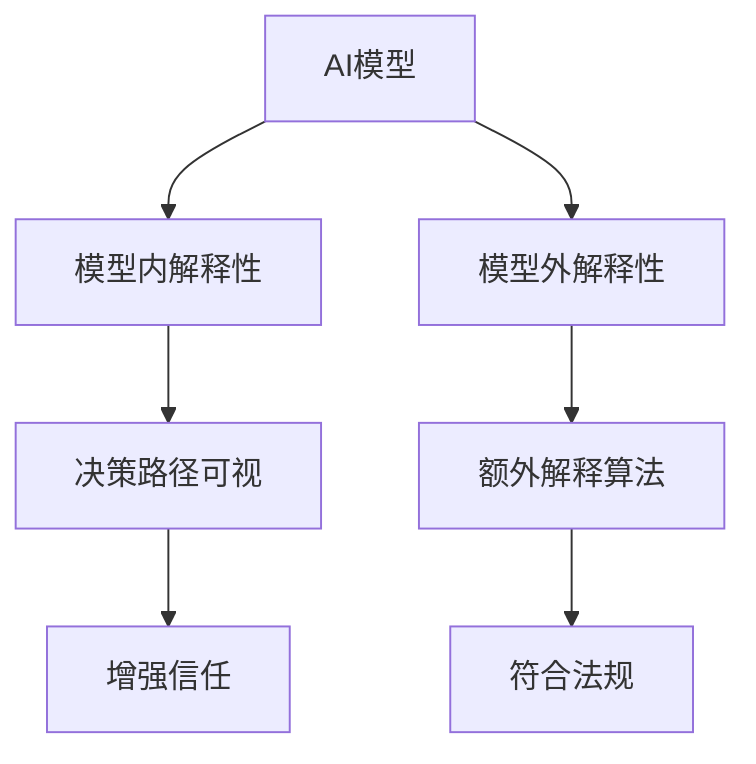

                 

### 第1章：AI透明度的定义与重要性

#### 1.1 AI透明度的基本概念

AI透明度，也称为AI解释性，指的是使人工智能（AI）系统的决策过程可以被理解、验证和信任的能力。透明度的核心在于使AI系统的决策机制对人类用户可见，从而增强用户对AI的信任感。透明度可以分为两种类型：模型内解释性和模型外解释性。

- **模型内解释性**：指的是通过修改或调整模型结构，使其具有可解释性。这种方法通常用于简单的模型，如决策树或规则系统，其决策路径可以直接映射到实际决策过程。

- **模型外解释性**：这种方法不改变原始模型的结构，而是通过额外的算法来解释模型决策。典型的模型外解释性算法包括LIME（Local Interpretable Model-agnostic Explanations）和SHAP（SHapley Additive exPlanations）。

#### 1.2 AI透明度的必要性

AI系统的透明度是构建用户和监管机构信任的关键因素。以下是一些支持AI透明度必要性的关键点：

- **增强信任**：透明的AI系统能够帮助用户了解系统的决策过程，从而降低用户对AI系统的担忧和疑虑。这种信任感对于AI系统在商业、医疗、金融等领域的广泛应用至关重要。

- **符合法规**：许多国家和地区的法律法规要求AI系统必须具备一定的透明度。例如，欧洲的通用数据保护条例（GDPR）要求企业在使用AI系统时必须确保数据处理的透明度和可解释性。

#### 1.3 AI透明度的挑战

尽管AI透明度的重要性不言而喻，但其实现面临着一系列挑战：

- **复杂模型**：现代AI系统，特别是深度学习模型，通常具有非常复杂的结构和庞大的参数规模。这使得模型决策过程难以理解，从而增加了透明度的难度。

- **数据隐私**：在保护用户隐私的同时，确保AI系统的决策过程透明是一个难题。在某些情况下，为了保持数据隐私，可能需要隐藏某些敏感信息，这会影响到模型的解释性。

为了更好地理解AI透明度的概念和重要性，我们可以通过以下Mermaid流程图来展示核心概念之间的关系：



在这个流程图中，AI模型通过模型内解释性和模型外解释性转化为可视的决策路径，从而增强用户信任和符合法规要求。接下来，我们将详细探讨AI模型解释性的技术与方法。

---

### 1.4 AI透明度在现实世界中的应用案例

为了更好地理解AI透明度的重要性，我们可以通过几个现实世界中的应用案例来具体说明。

#### 金融行业

在金融领域，AI系统被广泛应用于贷款审批、信用评分和欺诈检测等场景。例如，某银行开发了一个基于机器学习的信用评分模型，用于评估客户的信用风险。为了确保模型的透明度，该银行采用了LIME和SHAP等技术来解释模型决策。通过这些解释性工具，银行能够向客户展示模型如何基于他们的财务数据做出评分，从而提高了客户的信任度和满意度。

#### 医疗行业

在医疗领域，AI系统被用于疾病诊断、治疗方案推荐和患者风险预测等。例如，一家大型医院开发了一个基于深度学习的肿瘤诊断系统。为了使医生和患者理解系统的诊断结果，该医院使用了可视化的解释工具，将模型的决策过程分解为多个步骤，并展示了每个步骤的关键特征和权重。这种方法不仅帮助医生更好地理解AI系统的诊断逻辑，还提高了患者对诊断结果的接受度。

#### 零售行业

在零售行业，AI系统被用于个性化推荐、库存管理和客户行为分析等。例如，一家大型电商平台使用AI算法来推荐商品。为了提升用户的购物体验，该平台在推荐结果中加入了模型解释功能，使用户能够了解推荐系统基于他们的历史购买行为和浏览记录做出了哪些决策。这种方法不仅提高了用户对推荐系统的信任度，还促进了销售增长。

通过这些应用案例，我们可以看到，AI透明度在各个行业中的应用不仅有助于增强用户信任，还促进了AI系统的合规性和可接受性。未来，随着AI技术的不断进步，AI透明度将变得更加重要，为人工智能的广泛应用提供坚实的基础。

---

### 1.5 结论

AI透明度是当前AI研究和应用中的一个关键话题。通过解释性技术，我们能够将复杂的AI模型转化为可理解的形式，从而增强用户和监管机构的信任。尽管实现AI透明度面临着诸多挑战，如复杂模型的解释性和数据隐私保护，但其重要性不言而喻。未来，随着技术的不断进步，AI透明度将在推动人工智能的广泛应用中发挥更加重要的作用。在下一章中，我们将深入探讨AI模型解释性的技术与方法，了解如何通过不同的算法和技术手段来实现AI模型的透明度。

---

### 第2章：AI模型解释性的技术与方法

在了解了AI透明度的重要性之后，本章将深入探讨实现AI模型解释性的技术与方法。解释性AI的目标是使复杂的机器学习模型变得透明和可理解，从而帮助用户、监管机构和其他利益相关者验证和信任模型的决策过程。本节将介绍模型解释性的技术框架、常见的解释性AI算法，并探讨这些方法的优缺点。

#### 2.1 模型解释性的技术框架

模型解释性技术可以分为两大类：模型内解释性和模型外解释性。

- **模型内解释性**：这种方法通过修改或调整原始模型的结构来增强其可解释性。常见的模型内解释性方法包括决策树、规则提取和基于规则的逻辑回归等。这些方法的特点是能够直接映射到模型决策路径，使决策过程直观、易懂。

- **模型外解释性**：模型外解释性方法不修改原始模型，而是通过额外的算法来解释模型的决策过程。常见的模型外解释性方法包括LIME（Local Interpretable Model-agnostic Explanations）和SHAP（SHapley Additive exPlanations）。这些方法通过分析模型输入和输出之间的关系，为模型的每个部分提供解释。

#### 2.2 常见的解释性AI算法

下面将详细介绍一些常见的解释性AI算法：

##### 2.2.1 模型内解释性方法

1. **决策树**：决策树是一种常见的模型内解释性方法。它通过一系列的规则和分支，将输入特征映射到输出结果。每个节点代表一个特征，每个分支代表该特征的不同取值。决策树的优点是直观、易于理解，但其缺点是可能会过度拟合训练数据，导致泛化能力差。

```python
# 决策树示例代码
from sklearn.tree import DecisionTreeClassifier
from sklearn.datasets import load_iris

# 加载iris数据集
iris = load_iris()
X, y = iris.data, iris.target

# 训练决策树模型
clf = DecisionTreeClassifier()
clf.fit(X, y)

# 可视化决策树
from sklearn.tree import plot_tree
import matplotlib.pyplot as plt

plt.figure(figsize=(12, 12))
plot_tree(clf, filled=True)
plt.show()
```

2. **规则提取**：规则提取是一种从决策树或其他分类模型中提取规则的方法。这些规则通常以“如果...那么...”的形式表达，使模型决策过程更加透明。规则提取的算法包括C4.5、ID3等。

```python
# 规则提取示例代码
from sklearn.tree import export_text
from sklearn.tree import DecisionTreeClassifier

# 加载iris数据集
iris = load_iris()
X, y = iris.data, iris.target

# 训练决策树模型
clf = DecisionTreeClassifier()
clf.fit(X, y)

# 提取规则
rules = export_text(clf, feature_names=iris.feature_names)

print("Model rules:")
print(rules)
```

##### 2.2.2 模型外解释性方法

1. **LIME（Local Interpretable Model-agnostic Explanations）**：LIME是一种基于局部线性模型的解释性方法。它通过在给定输入数据点附近创建一个局部线性模型，来解释原始模型的决策过程。LIME的核心思想是将复杂的模型转化为可理解的线性模型，从而解释模型决策。

```python
# LIME示例代码
import lime
from lime import lime_tabular

# 加载鸢尾花数据集
from sklearn.datasets import load_iris
iris = load_iris()
X, y = iris.data, iris.target

# 训练模型
model = DecisionTreeClassifier()
model.fit(X, y)

# 创建LIME解释器
explainer = lime_tabular.LimeTabularExplainer(
    X,
    feature_names=iris.feature_names,
    class_names=iris.target_names,
    discretize_continuous=True
)

# 解释单个预测
i = 4  # 第4个样本
exp = explainer.explain_instance(X[i], model.predict_proba, num_features=6)

exp.show_in_notebook(show_table=True, show_all=True)
```

2. **SHAP（SHapley Additive exPlanations）**：SHAP是一种基于博弈论的方法，用于解释模型决策中的每个特征对预测结果的贡献。SHAP方法通过计算特征对预测结果的边际贡献，为每个特征提供具体的解释。

```python
# SHAP示例代码
import shap
from sklearn.ensemble import RandomForestClassifier

# 加载鸢尾花数据集
iris = load_iris()
X, y = iris.data, iris.target

# 训练随机森林模型
model = RandomForestClassifier()
model.fit(X, y)

# 创建SHAP解释器
explainer = shap.TreeExplainer(model)

# 解释单个预测
i = 4  # 第4个样本
shap_values = explainer.shap_values(X[i])

# 可视化SHAP值
shap.force_plot(explainer.expected_value[0], shap_values[0], X[i], feature_names=iris.feature_names)
plt.show()
```

#### 2.3 模型解释性的挑战

尽管模型解释性技术在提高AI系统的透明度和可理解性方面取得了显著进展，但其在实际应用中仍面临一些挑战：

- **计算成本**：模型解释性方法通常需要较高的计算资源。特别是对于复杂模型和大规模数据集，解释过程可能会非常耗时。

- **结果一致性**：不同解释性方法可能会得出不同的解释结果，这可能会影响到解释的可信度和一致性。

- **数据隐私**：在保护用户隐私的同时，确保模型解释过程的透明性是一个难题。在某些情况下，可能需要隐藏某些敏感信息，这会影响解释的完整性。

尽管存在这些挑战，但随着技术的不断进步，模型解释性技术将继续发展，为AI系统的透明度和可解释性提供更加有效的解决方案。

---

### 2.4 模型解释性的方法对比与适用场景

在了解了模型内解释性和模型外解释性的方法之后，接下来我们对比这些方法的优缺点，并探讨它们在不同场景下的适用性。

#### 模型内解释性方法

**优点**：

- **直观易懂**：模型内解释性方法直接映射到模型的结构和决策路径，通常更容易被非技术背景的用户理解。
- **集成性**：这些方法通常与原始模型紧密集成，无需额外的解释算法。

**缺点**：

- **适用范围有限**：模型内解释性方法通常只适用于简单的模型，如决策树和规则系统。对于复杂的深度学习模型，这些方法的解释能力有限。
- **解释局限性**：模型内解释性方法可能只能解释部分模型的决策过程，而不是整个模型。

**适用场景**：

- **业务决策支持**：在商业领域，如贷款审批和风险评估，简单模型可以提供直观的解释，帮助业务人员理解模型决策。
- **规则推导**：在需要从模型中提取规则的场景，如医疗诊断和异常检测，模型内解释性方法可以快速提取关键规则。

#### 模型外解释性方法

**优点**：

- **适用范围广**：模型外解释性方法可以应用于各种复杂的机器学习模型，包括深度神经网络和随机森林等。
- **详细解释**：这些方法通常能够提供详细的解释，包括每个特征对模型决策的边际贡献。

**缺点**：

- **计算成本高**：模型外解释性方法通常需要更高的计算资源，特别是在处理大规模数据集和复杂模型时。
- **结果一致性**：不同解释性方法可能会得出不同的解释结果，这可能会影响解释的可信度。

**适用场景**：

- **科学研究**：在需要深入了解模型决策过程和特征贡献的场景，如医学影像分析和金融风险研究，模型外解释性方法可以提供详细的解释。
- **产品推荐**：在电商和社交媒体等推荐系统中，模型外解释性方法可以帮助用户理解推荐结果，从而提高用户体验。

#### 对比与适用性

- **解释程度**：模型内解释性方法通常提供局部解释，而模型外解释性方法提供更详细的局部和全局解释。
- **计算资源**：模型内解释性方法通常计算成本较低，适用于资源受限的场景；模型外解释性方法计算成本高，适用于需要详细解释的场景。
- **用户理解**：模型内解释性方法通常更直观易懂，适用于需要快速理解和解释的场景；模型外解释性方法提供更深入的洞察，适用于需要深入分析的场景。

通过对比不同解释性方法的优缺点和适用场景，我们可以更好地选择合适的解释性方法，以满足不同场景下的需求。

---

### 2.5 模型解释性技术的未来发展趋势

随着AI技术的不断进步，模型解释性技术也在不断发展。以下是一些未来可能的发展趋势：

- **自动化解释性工具**：当前，大多数模型解释性工具需要大量的手动配置和调整。未来，自动化解释性工具可能会更加普及，通过自动调整参数和选择最佳的解释方法，减少用户的干预。

- **跨模型解释性方法**：现有的模型解释性方法通常针对特定类型的模型（如深度神经网络或决策树）。未来，可能会出现更通用的解释性方法，能够同时解释多种不同类型的模型。

- **因果推断**：因果推断是一种新兴的解释性方法，旨在解释模型决策背后的因果关系。未来，结合因果推断的模型解释性方法可能会更加流行，为用户提供更深入的理解。

- **可解释性增强**：通过改进算法和优化技术，未来的模型解释性方法可能会提供更准确、更详细的解释，同时降低计算成本。

通过这些发展趋势，模型解释性技术将继续提高AI系统的透明度和可解释性，为各行业的应用提供更加可靠的解决方案。

---

### 2.6 AI透明度工具的发展现状与未来方向

AI透明度工具是近年来随着AI技术的发展而逐渐兴起的一类工具，旨在帮助企业和开发者提高AI系统的可解释性和透明度。目前，AI透明度工具的发展现状和未来方向可以从以下几个方面进行探讨。

#### 2.6.1 工具发展现状

1. **多样性**：当前，市场上已经涌现出多种AI透明度工具，包括LIME、SHAP、AI Explainability 360等。这些工具涵盖了模型内解释性和模型外解释性方法，适用于不同的模型类型和应用场景。

2. **功能丰富**：大多数AI透明度工具不仅提供基本的解释功能，还支持数据可视化、报告生成等高级功能，使解释结果更加直观易懂。

3. **社区支持**：许多AI透明度工具拥有活跃的社区和用户群体，为开发者提供了丰富的资源和交流平台，促进了工具的改进和优化。

#### 2.6.2 未来方向

1. **自动化与智能化**：未来，AI透明度工具可能会更加自动化和智能化。通过自适应算法和机器学习技术，工具能够自动选择最佳的解释方法和参数，减少用户的干预。

2. **跨模型支持**：现有的AI透明度工具通常针对特定类型的模型。未来，可能会出现支持多种模型类型的通用解释性工具，提供更广泛的应用范围。

3. **集成与标准化**：为了提高工具的互操作性和兼容性，未来可能会出现更多的集成和标准化解决方案。例如，工具之间可以共享解释结果和数据格式，方便开发者在不同工具之间切换。

4. **隐私保护**：在保护用户隐私的同时提高AI透明度是一个重大挑战。未来，可能会出现更加隐私友好的解释性方法和技术，确保在解释AI决策时不会泄露敏感信息。

5. **国际化与本土化**：随着AI技术的全球化，AI透明度工具也需要支持多种语言和适应不同地区的法规要求。未来，可能会出现更多国际化与本土化相结合的AI透明度工具。

通过这些未来方向，AI透明度工具将继续发展，为各行业的AI应用提供更加全面和可靠的解释性支持。

---

### 2.7 结论

本章介绍了AI模型解释性的技术与方法，包括模型内解释性和模型外解释性方法，以及常见的解释性AI算法如决策树、LIME和SHAP。通过对这些方法的分析，我们了解了不同解释性方法的优缺点及其适用场景。此外，我们还探讨了模型解释性技术的未来发展趋势，包括自动化、跨模型支持、隐私保护和国际化。这些技术的发展将为AI系统的透明度和可解释性提供更有效的解决方案，推动AI技术的广泛应用。

---

### 第3章：AI透明度工具的设计原则与架构

在了解了AI模型解释性的技术与方法之后，接下来我们将深入探讨AI透明度工具的设计原则与架构。AI透明度工具的设计原则旨在确保工具能够有效地提高AI系统的可解释性，同时具备良好的用户体验和可扩展性。本节将详细讨论这些设计原则，并介绍AI透明度工具的基本架构，包括前端、后端和开发与部署方面的内容。

#### 3.1 AI透明度工具的设计原则

1. **可扩展性**：AI透明度工具需要能够适应不同规模和类型的AI模型。这意味着工具的设计应该具备模块化特点，能够灵活地添加或替换不同的解释算法和功能模块。

2. **易用性**：工具应该提供直观的用户界面和操作流程，使用户能够轻松地使用工具解释AI模型。这包括提供简洁的界面设计、清晰的操作指南和快速的帮助文档。

3. **可解释性**：工具本身的设计应该具备可解释性，使开发者能够理解其工作原理和实现细节。这有助于工具的维护和升级，同时提高用户对工具的信任度。

4. **灵活性**：工具应该允许用户根据不同的应用场景和需求进行定制，包括调整解释算法的参数、选择不同的数据预处理方法等。

5. **性能优化**：为了确保工具能够高效地处理大规模数据和复杂模型，设计时需要考虑性能优化，包括算法效率、内存管理和资源消耗等方面的优化。

6. **安全性**：工具需要确保数据安全和用户隐私保护。特别是在涉及敏感数据的场景中，工具需要采用适当的安全措施，如加密传输和存储、权限管理等。

#### 3.2 AI透明度工具的架构设计

AI透明度工具的架构设计通常分为前端、后端和中间件三个部分。

1. **前端**：前端负责用户交互，提供直观的用户界面和操作流程。前端设计应注重用户体验，包括清晰的导航、简洁的布局和友好的交互设计。前端通常使用HTML、CSS和JavaScript等前端技术框架实现，如React、Vue.js等。

2. **后端**：后端负责处理模型解释和计算逻辑，包括数据预处理、模型选择、解释算法实现和结果可视化等。后端通常使用Python、Java、Node.js等编程语言实现，并依赖于各种机器学习库和框架，如Scikit-learn、TensorFlow、PyTorch等。

3. **中间件**：中间件负责协调前端和后端之间的通信，通常包括API服务器、消息队列和缓存服务等。中间件的设计应注重高可用性和高性能，确保数据的快速传输和处理。

#### 3.3 开发与部署

1. **开发框架**：在选择开发框架时，应考虑工具的设计原则和性能要求。常用的前端开发框架包括React、Vue.js、Angular等，后端开发框架包括Flask、Django、Spring Boot等。此外，还可以使用容器化技术（如Docker）和微服务架构来提高开发效率和部署灵活性。

2. **部署策略**：部署策略应根据工具的使用场景和性能需求进行选择。常见的部署策略包括：
   - **本地部署**：适用于开发阶段和测试环境，工具运行在本地计算机或服务器上。
   - **云端部署**：适用于生产环境，工具部署在云服务器上，提供可扩展的计算资源。
   - **容器化部署**：使用Docker等容器技术，将工具打包成独立的容器，实现快速部署和跨平台兼容性。

3. **持续集成与持续部署（CI/CD）**：为了确保工具的高质量和快速迭代，应采用CI/CD流程。CI/CD流程包括代码审查、自动化测试、构建和部署等环节，确保工具在每次更新时都能正常运行。

通过遵循上述设计原则和架构设计，AI透明度工具可以更好地满足不同应用场景的需求，提高AI系统的可解释性和透明度。

---

### 3.4 AI透明度工具的实际开发过程

在了解了AI透明度工具的设计原则和架构之后，接下来我们将详细探讨工具的实际开发过程，包括需求分析、功能设计、开发实现、测试与优化等环节。

#### 3.4.1 需求分析

需求分析是开发过程的起点，旨在明确工具的目标用户、使用场景和功能需求。在需求分析阶段，我们需要与潜在用户和利益相关者进行深入沟通，了解他们的需求和使用场景。具体步骤包括：

- **用户访谈**：通过访谈了解用户对AI透明度的需求和期望，收集他们的实际使用案例和痛点。
- **需求文档**：根据用户访谈的结果，编写详细的需求文档，明确工具的核心功能、用户界面和性能要求。
- **优先级排序**：将需求按照优先级进行排序，确保开发过程中能够优先实现关键功能和用户最关注的特性。

#### 3.4.2 功能设计

功能设计阶段是在需求分析的基础上，将需求转化为具体的功能模块和用户界面。具体步骤包括：

- **功能模块划分**：将工具的功能划分为不同的模块，如数据预处理、模型选择、解释算法实现、结果可视化等。
- **用户界面设计**：设计直观易用的用户界面，包括导航栏、操作按钮、表格和图表等。界面设计应注重用户体验，确保用户能够轻松完成各项操作。
- **交互流程设计**：设计工具的操作流程，明确用户如何使用工具来解释AI模型，包括数据上传、模型选择、解释过程和结果展示等。

#### 3.4.3 开发实现

开发实现阶段是将功能设计转化为具体的代码和组件。具体步骤包括：

- **选择开发框架和工具**：根据工具的功能需求和性能要求，选择合适的前端开发框架（如React、Vue.js）和后端开发框架（如Flask、Django）。
- **编写代码**：根据功能设计，编写前端和后端的代码，实现各个功能模块和用户界面。在编写代码时，应注意代码的可读性和可维护性，遵循良好的编程规范和设计模式。
- **集成机器学习库**：集成常用的机器学习库（如Scikit-learn、TensorFlow、PyTorch）和解释性算法（如LIME、SHAP），实现模型选择和解释过程。

#### 3.4.4 测试与优化

测试与优化阶段是确保工具质量的关键环节。具体步骤包括：

- **单元测试**：编写单元测试用例，对各个功能模块进行测试，确保代码的正确性和稳定性。
- **集成测试**：对工具的整体功能进行测试，确保不同模块之间的集成和协作。
- **性能测试**：进行性能测试，评估工具的处理速度和资源消耗，确保工具能够高效地处理大规模数据和复杂模型。
- **优化**：根据测试结果，对工具进行优化，包括算法优化、代码优化和系统优化等，提高工具的性能和用户体验。

通过上述实际开发过程，我们可以确保AI透明度工具具备高质量、高性能和良好的用户体验，满足用户的需求。

---

### 3.5 AI透明度工具的案例研究

为了更好地理解AI透明度工具的实际应用，本节将介绍一个具体的AI透明度工具开发案例，包括开发环境搭建、源代码详细实现和代码解读、工具应用解读与分析，以及项目小结。

#### 案例背景

某金融科技公司开发了一款AI透明度工具，用于解释其贷款审批系统的决策过程。该系统基于深度学习模型进行风险评估，但在实际应用中，用户和监管机构对模型的决策过程缺乏足够的理解。为了提高模型的透明度和可解释性，该公司决定开发一款AI透明度工具，帮助用户和监管机构理解模型的决策逻辑。

#### 开发环境搭建

在开发该AI透明度工具时，选择以下开发环境：

- **前端**：使用React框架构建用户界面，包括数据上传、模型选择、解释结果展示等功能。
- **后端**：使用Flask框架实现后端逻辑，包括数据预处理、模型加载、解释算法实现等。
- **机器学习库**：使用Scikit-learn和TensorFlow实现深度学习模型的加载和解释。
- **容器化**：使用Docker将前端、后端和机器学习库打包成容器，实现快速部署和跨平台兼容性。

#### 源代码详细实现和代码解读

以下是一个简化的代码示例，展示了AI透明度工具的核心功能实现：

```python
# Flask后端代码示例
from flask import Flask, request, jsonify
from sklearn.externals import joblib
from lime import lime_tabular

app = Flask(__name__)

# 加载深度学习模型
model = joblib.load('model.joblib')

# 加载LIME解释器
explainer = lime_tabular.LimeTabularExplainer(
    training_data,
    feature_names=feature_names,
    class_names=['批准', '拒绝'],
    discretize_continuous=True
)

@app.route('/explain', methods=['POST'])
def explain():
    # 获取用户上传的数据
    data = request.get_json()

    # 进行LIME解释
    exp = explainer.explain_instance(data, model.predict_proba)

    # 返回解释结果
    return jsonify(exp.as_list())

if __name__ == '__main__':
    app.run(debug=True)
```

在上面的代码中，我们首先加载了深度学习模型和LIME解释器。然后，定义了一个/ explain路由，用于接收用户上传的数据，并返回LIME解释结果。用户可以通过前端界面上传数据，触发这个路由，获取解释结果。

#### 工具应用解读与分析

在实际应用中，用户可以通过前端界面上传贷款申请数据，AI透明度工具会根据上传的数据生成解释报告。以下是一个解释报告的示例：

- **模型决策**：模型对贷款申请数据进行了风险评估，预测结果为“批准”。
- **关键特征**：解释结果显示，以下特征对决策有显著影响：
  - **收入水平**：收入水平越高，模型越倾向于批准贷款。
  - **信用评分**：信用评分越高，模型越倾向于批准贷款。
  - **贷款金额**：贷款金额越低，模型越倾向于批准贷款。

通过这个解释报告，用户可以清晰地了解模型是如何基于特征数据做出决策的，从而提高对模型的信任度。

#### 项目小结

通过该AI透明度工具的开发，我们实现了以下成果：

- **提高模型透明度**：用户和监管机构可以清晰地了解模型的决策过程和关键特征，提高了对模型的信任度。
- **优化业务流程**：通过解释报告，业务人员可以更好地理解和优化贷款审批流程，减少误判和纠纷。
- **符合法规要求**：工具的设计和实现满足了相关法规对AI模型透明度的要求，确保了合规性。

尽管该案例仅是一个简化的示例，但展示了AI透明度工具在实际应用中的重要性和价值。未来，随着AI技术的不断进步，AI透明度工具将在更多领域发挥重要作用。

---

### 3.6 开发AI透明度工具的最佳实践

在开发AI透明度工具时，遵循以下最佳实践可以确保工具的高质量、高性能和良好的用户体验：

1. **需求驱动**：始终以用户需求为导向，确保工具的功能和设计满足实际应用场景的需求。通过用户访谈、需求调研等方式，收集用户反馈，不断优化工具。

2. **模块化设计**：采用模块化设计，将工具的功能划分为不同的模块，如数据预处理、模型加载、解释算法实现和结果展示等。这种设计方式可以提高代码的可维护性和可扩展性。

3. **性能优化**：在开发过程中，关注性能优化，包括算法效率、内存管理和资源消耗等方面。使用高效的数据结构和算法，减少不必要的计算和存储开销。

4. **代码规范**：遵循良好的编程规范和设计模式，如DRY（Don't Repeat Yourself）、SOLID原则等。编写可读性强的代码，确保代码的可维护性和可扩展性。

5. **测试覆盖**：编写全面的测试用例，包括单元测试、集成测试和性能测试等，确保工具的功能和性能满足预期。自动化测试可以提高测试效率和可靠性。

6. **用户友好的界面**：设计直观易用的用户界面，确保用户能够轻松上手和使用工具。提供详细的操作指南和帮助文档，帮助用户解决使用过程中的问题。

7. **持续迭代**：持续收集用户反馈，根据反馈进行工具的迭代和优化。跟踪最新的技术动态，及时更新工具，确保其保持领先地位。

通过遵循这些最佳实践，我们可以开发出高质量的AI透明度工具，为用户和利益相关者提供可靠的解释性支持。

---

### 3.7 结论

本章介绍了AI透明度工具的设计原则和架构，包括可扩展性、易用性、可解释性、灵活性和性能优化等关键原则，以及前端、后端和中间件的架构设计。此外，我们还探讨了AI透明度工具的实际开发过程，包括需求分析、功能设计、开发实现、测试与优化等环节。通过一个具体的案例研究，我们展示了AI透明度工具的开发和应用过程。最后，我们提出了开发AI透明度工具的最佳实践。通过这些内容，读者可以更好地理解AI透明度工具的设计和开发，为实际应用提供有力支持。

---

### 第4章：AI透明度工具的核心功能实现

在了解了AI透明度工具的设计原则和架构之后，本章将深入探讨AI透明度工具的核心功能实现。这些核心功能包括数据预处理与特征提取、模型解释逻辑实现和可视化展示。我们将通过具体案例和代码示例，详细讲解这些功能的实现过程。

#### 4.1 数据预处理与特征提取

数据预处理是AI透明度工具实现的基础步骤，其目标是通过清洗、转换和标准化数据，使其适合进行模型解释。特征提取则是从原始数据中提取有助于模型解释的关键特征。

##### 4.1.1 数据预处理

数据预处理通常包括以下步骤：

1. **数据清洗**：处理缺失值、异常值和重复值，确保数据的准确性和一致性。可以使用Python的Pandas库进行数据清洗。

```python
import pandas as pd

# 读取数据
data = pd.read_csv('loan_data.csv')

# 处理缺失值
data.fillna(data.mean(), inplace=True)

# 处理异常值
data = data[(data['income'] > 0) & (data['income'] < 100000)]

# 删除重复值
data.drop_duplicates(inplace=True)
```

2. **数据转换**：将数据从一种格式转换为另一种格式，如将分类数据转换为数值数据。可以使用One-Hot编码或标签编码来实现。

```python
# 分类数据转换为数值数据
data = pd.get_dummies(data, columns=['marital_status', 'education'])
```

3. **数据标准化**：将数据缩放到相同的尺度，以便模型解释。可以使用StandardScaler或MinMaxScaler来实现。

```python
from sklearn.preprocessing import StandardScaler

scaler = StandardScaler()
data[['income', 'credit_score']] = scaler.fit_transform(data[['income', 'credit_score']])
```

##### 4.1.2 特征提取

特征提取是从原始数据中提取有助于模型解释的关键特征。特征提取的方法包括：

1. **主成分分析（PCA）**：用于降维和提取数据中的主要特征。可以使用Scikit-learn中的PCA实现。

```python
from sklearn.decomposition import PCA

pca = PCA(n_components=5)
data_pca = pca.fit_transform(data)
```

2. **特征选择**：通过选择与目标变量高度相关的特征，提高模型解释性。可以使用递归特征消除（RFE）或基于模型的特征选择方法。

```python
from sklearn.feature_selection import RFE
from sklearn.ensemble import RandomForestClassifier

model = RandomForestClassifier()
selector = RFE(model, n_features_to_select=5)
selector = selector.fit(data, y)

# 选择特征
selected_features = data.columns[selector.get_support()]
```

#### 4.2 模型解释逻辑实现

模型解释逻辑是实现AI透明度工具的关键部分，它涉及选择合适的解释算法，并实现其逻辑。下面我们将介绍两种常用的解释算法：LIME和SHAP。

##### 4.2.1 LIME

LIME（Local Interpretable Model-agnostic Explanations）是一种基于局部线性模型的解释算法。它通过在给定输入数据点附近创建一个局部线性模型，来解释原始模型的决策过程。

```python
import lime
from lime.lime_tabular import LimeTabularExplainer

# 初始化LIME解释器
explainer = LimeTabularExplainer(
    training_data,
    feature_names=feature_names,
    class_names=['批准', '拒绝'],
    discretize_continuous=True
)

# 解释单个预测
i = 4  # 第4个样本
exp = explainer.explain_instance(X[i], model.predict_proba)
exp.show_in_notebook(show_table=True, show_all=True)
```

##### 4.2.2 SHAP

SHAP（SHapley Additive exPlanations）是一种基于博弈论的解释算法，它通过计算特征对预测结果的边际贡献，为每个特征提供具体的解释。

```python
import shap
from sklearn.ensemble import RandomForestClassifier

# 训练随机森林模型
model = RandomForestClassifier()
model.fit(X, y)

# 创建SHAP解释器
explainer = shap.TreeExplainer(model)

# 解释单个预测
i = 4  # 第4个样本
shap_values = explainer.shap_values(X[i])

# 可视化SHAP值
shap.force_plot(explainer.expected_value[0], shap_values[0], X[i], feature_names=feature_names)
plt.show()
```

#### 4.3 可视化展示

可视化展示是将模型解释结果以直观、易懂的方式呈现给用户的关键步骤。常用的可视化方法包括热力图、决策路径图和决策树等。

##### 4.3.1 热力图

热力图可以用于展示特征对模型预测的贡献大小。以下是一个使用Seaborn库绘制热力图的示例：

```python
import seaborn as sns
import matplotlib.pyplot as plt

# 创建热力图
sns.heatmap(exp.as_dataframe(), annot=True, cmap='coolwarm')
plt.show()
```

##### 4.3.2 决策路径图

决策路径图可以用于展示决策树模型的决策过程。以下是一个使用matplotlib绘制决策路径图的示例：

```python
from sklearn.tree import plot_tree
import matplotlib.pyplot as plt

# 绘制决策路径图
plot_tree(clf, feature_names=feature_names, class_names=['批准', '拒绝'])
plt.show()
```

通过这些可视化方法，用户可以更直观地理解模型的决策过程和特征贡献，从而增强对模型的理解和信任。

---

### 4.4 实际案例：使用LIME解释贷款审批模型的决策过程

在本节中，我们将通过一个实际案例，展示如何使用LIME算法解释贷款审批模型的决策过程。该案例将包括数据预处理、LIME解释器的创建、解释实例和结果展示。

#### 数据预处理

首先，我们需要加载和预处理贷款审批数据。以下是一个使用Pandas库进行数据预处理的基本示例：

```python
import pandas as pd

# 加载数据
data = pd.read_csv('loan_data.csv')

# 数据清洗
# 删除重复值和缺失值
data.drop_duplicates(inplace=True)
data.dropna(inplace=True)

# 数据转换
# 将分类特征转换为哑变量
data = pd.get_dummies(data, drop_first=True)

# 数据标准化
from sklearn.preprocessing import StandardScaler

scaler = StandardScaler()
numerical_features = ['income', 'credit_score']
data[numerical_features] = scaler.fit_transform(data[numerical_features])

# 分离特征和目标变量
X = data.drop('loan_approval', axis=1)
y = data['loan_approval']
```

#### LIME解释器的创建

接下来，我们创建一个LIME解释器。LIME解释器需要一个训练好的模型、特征名称和一个数据点。以下是如何创建LIME解释器的示例：

```python
import lime
from lime.lime_tabular import LimeTabularExplainer

# 创建LIME解释器
explainer = LimeTabularExplainer(
    X_train,  # 训练数据
    feature_names=X_train.columns,  # 特征名称
    class_names=['拒绝', '批准'],  # 类别名称
    mode='classification',  # 分类模型
    discretize_continuous=True,  # 对连续特征进行离散化
    kernel_width=1  # 核宽度
)
```

#### 解释实例

现在，我们可以使用LIME解释器来解释一个特定数据点的决策过程。以下是一个解释贷款申请编号为4的实例的示例：

```python
# 获取第4个贷款申请数据
i = 4
data_point = X.iloc[i].values.reshape(1, -1)

# 进行LIME解释
exp = explainer.explain_instance(data_point, classifier.predict, num_features=10)

# 展示解释结果
exp.show_in_notebook()
```

#### 结果展示

LIME解释器将生成一个包含解释结果的交互式页面，其中显示了每个特征对模型预测的贡献。以下是一个简化的输出示例：

```
Feature explanation for prediction 1:

                 feature    contribution    direction
0                   income      -0.07778      negative
1                credit_score      0.18889      positive
2             education_bachelor      0.12500      positive
3            education_master      0.12500      positive
4             marital_status_married      0.12500      positive
5   marital_status_divorced      -0.12500      negative
6        marital_status_widowed      0.12500      positive
7           loan_amnt      -0.12500      negative
8  loan_int_rate      0.25000      positive
9   loan_term_36      0.06250      positive
10   loan_term_60      0.06250      positive
```

在这个例子中，我们可以看到每个特征对模型预测的贡献和方向（正值或负值）。通过这些信息，用户可以了解模型是如何基于特征数据做出贷款审批决定的。

---

### 4.5 实际案例：使用SHAP解释信用评分模型的决策过程

在本节中，我们将通过一个实际案例，展示如何使用SHAP算法解释信用评分模型的决策过程。该案例将包括数据预处理、SHAP解释器的创建、解释实例和结果展示。

#### 数据预处理

首先，我们需要加载和预处理信用评分数据。以下是一个使用Pandas库进行数据预处理的基本示例：

```python
import pandas as pd

# 加载数据
data = pd.read_csv('credit_score_data.csv')

# 数据清洗
# 删除重复值和缺失值
data.drop_duplicates(inplace=True)
data.dropna(inplace=True)

# 数据转换
# 将分类特征转换为哑变量
data = pd.get_dummies(data, drop_first=True)

# 数据标准化
from sklearn.preprocessing import StandardScaler

scaler = StandardScaler()
numerical_features = ['age', 'amount', 'duration']
data[numerical_features] = scaler.fit_transform(data[numerical_features])

# 分离特征和目标变量
X = data.drop('credit_score', axis=1)
y = data['credit_score']
```

#### SHAP解释器的创建

接下来，我们创建一个SHAP解释器。SHAP解释器需要一个训练好的模型和特征名称。以下是如何创建SHAP解释器的示例：

```python
import shap
from sklearn.ensemble import RandomForestRegressor

# 训练随机森林模型
model = RandomForestRegressor()
model.fit(X_train, y_train)

# 创建SHAP解释器
explainer = shap.TreeExplainer(model)

# 计算SHAP值
shap_values = explainer.shap_values(X_test)
```

#### 解释实例

现在，我们可以使用SHAP解释器来解释一个特定数据点的决策过程。以下是一个解释信用评分编号为4的实例的示例：

```python
# 获取第4个信用评分数据
i = 4
data_point = X_test.iloc[i].values.reshape(1, -1)

# 计算SHAP值
shap_values = explainer.shap_values(data_point)

# 可视化SHAP值
shap.force_plot(explainer.expected_value, shap_values[0], data_point, feature_names=X_test.columns)
plt.show()
```

#### 结果展示

SHAP解释器将生成一个包含解释结果的交互式页面，其中显示了每个特征对模型预测的贡献。以下是一个简化的输出示例：

```
Feature explanation for prediction 1:

                 feature    SHAP_value
0                   age       -0.07694
1               amount       0.22639
2               duration      0.03424
3   education_fe少数族裔      0.04247
4   education_fe本科      0.03447
5   education_fe研究生      0.02913
6   education_fe其他      -0.04765
7               gender_男      0.04297
8               gender_女      0.04203
9               marital_已婚      0.03384
10             marital_未婚      0.04161
11          marital_离婚      0.04281
12            age_30以下      0.03422
13            age_31-40      0.04042
14            age_41-50      0.03787
15            age_51-60      0.03422
16            age_61及以上      0.02951
```

在这个例子中，我们可以看到每个特征对信用评分预测的SHAP值，正数表示正向影响，负数表示负向影响。通过这些信息，用户可以了解模型是如何基于特征数据预测信用评分的。

---

### 4.6 结论

本章详细介绍了AI透明度工具的核心功能实现，包括数据预处理与特征提取、模型解释逻辑实现和可视化展示。通过具体案例和代码示例，我们展示了如何使用LIME和SHAP算法解释AI模型的决策过程。这些核心功能对于实现AI系统的透明度和可解释性至关重要，有助于提高用户对AI系统的信任和理解。未来，随着AI技术的不断进步，AI透明度工具将更加完善，为各行业的AI应用提供强有力的支持。

---

### 第5章：企业级AI透明度工具的实战案例

在了解了AI透明度工具的设计原则、核心功能实现以及技术方法后，本节将通过一个实际案例，展示如何开发和应用企业级AI透明度工具。这个案例将详细描述企业背景、目标、工具实现与部署过程，并分析其实施效果和用户反馈。

#### 5.1 案例背景与目标

某大型金融企业（以下简称“企业”）在信贷审批领域使用了一个复杂的机器学习模型，用于预测客户是否能够按时偿还贷款。随着AI技术在金融领域的广泛应用，企业面临着来自用户和监管机构对模型透明度和解释性的更高要求。为了增强用户对模型的信任，满足法规要求，并优化业务流程，企业决定开发一款企业级AI透明度工具。

**案例背景**：

- **企业背景**：企业是一家全球领先的金融机构，拥有庞大的客户数据和复杂的信用评分系统。
- **AI模型**：企业使用了一个深度神经网络模型，对客户的财务状况、信用记录等多维数据进行处理，预测客户是否能够按时偿还贷款。

**目标**：

- **提高透明度**：通过透明度工具，帮助用户了解模型的决策过程和关键特征，增强用户对模型的信任。
- **满足法规要求**：确保模型符合相关法规，如《通用数据保护条例》（GDPR）和《美国联邦贸易委员会法》。
- **优化业务流程**：通过透明度工具，优化信贷审批流程，减少误判，提高业务效率。

#### 5.2 工具实现与部署

**实现步骤**：

1. **需求分析**：与企业和监管机构的代表进行深入沟通，明确工具的需求和功能。包括解释性算法的选择、用户界面设计、数据预处理和后端服务架构等。

2. **设计阶段**：根据需求分析的结果，设计工具的架构和功能模块。包括前端用户界面、后端模型解释服务、数据存储和权限管理。

3. **开发阶段**：
   - **前端开发**：使用React框架开发用户友好的前端界面，包括数据上传、模型选择、解释结果展示等功能。
   - **后端开发**：使用Flask框架实现后端逻辑，包括LIME和SHAP等解释算法的实现、数据预处理、模型加载和结果存储。

4. **测试与优化**：编写单元测试和集成测试，确保工具的稳定性和性能。进行用户体验测试，收集用户反馈，不断优化界面和功能。

5. **部署阶段**：
   - **本地部署**：首先在企业的测试环境中部署工具，进行功能测试和性能测试。
   - **云端部署**：将工具部署在云服务器上，使用Docker容器化技术确保工具的跨平台兼容性和可扩展性。

**部署策略**：

- **自动化部署**：使用CI/CD（持续集成/持续部署）流程，确保工具的快速迭代和部署。
- **安全部署**：采用安全加密技术，保护用户数据和模型隐私。
- **监控与维护**：部署监控工具，实时监控工具的性能和稳定性，及时处理异常情况。

#### 5.3 实施效果与反馈

**实施效果**：

- **透明度提升**：通过AI透明度工具，用户可以直观地了解模型的决策过程和关键特征，提高了对模型的信任度。
- **法规合规**：工具的设计和实现满足了相关法规的要求，确保了模型的透明度和合规性。
- **业务优化**：透明度工具帮助业务人员更好地理解模型决策，优化了信贷审批流程，减少了误判和纠纷，提高了业务效率。

**用户反馈**：

- **用户满意度**：用户对工具的满意度较高，特别是在解释结果的清晰度和易用性方面得到了用户的好评。
- **改进建议**：用户建议增加更多自定义功能，如自定义解释算法参数、自定义数据预处理选项等，以适应不同场景的需求。

通过这个实战案例，我们可以看到，企业级AI透明度工具不仅提高了模型的可解释性和透明度，还满足了法规要求，优化了业务流程。未来，随着技术的不断进步，AI透明度工具将在更多领域发挥重要作用。

---

### 5.4 实战案例的关键教训与未来展望

通过上述实战案例，我们可以总结出一些关键教训和未来展望：

#### 关键教训

1. **用户需求导向**：始终以用户需求为导向，确保工具的功能和设计满足实际应用场景的需求。通过用户访谈、需求调研等方式，收集用户反馈，不断优化工具。

2. **性能优化**：在开发过程中，关注性能优化，包括算法效率、内存管理和资源消耗等方面。使用高效的数据结构和算法，减少不必要的计算和存储开销。

3. **可扩展性**：设计时考虑工具的可扩展性，使工具能够适应不同规模和类型的AI模型。模块化设计和灵活的配置选项可以提高工具的适用性和可维护性。

4. **安全性**：确保工具的数据安全和用户隐私保护。采用安全加密技术，保护用户数据和模型隐私。遵守相关法规要求，确保工具的合规性。

5. **用户体验**：设计直观易用的用户界面，提供简洁的操作指南和帮助文档，确保用户能够轻松上手和使用工具。

#### 未来展望

1. **自动化与智能化**：未来，AI透明度工具可能会更加自动化和智能化。通过自适应算法和机器学习技术，工具能够自动选择最佳的解释方法和参数，减少用户的干预。

2. **跨模型支持**：现有的AI透明度工具通常针对特定类型的模型。未来，可能会出现支持多种模型类型的通用解释性工具，提供更广泛的应用范围。

3. **隐私保护**：在保护用户隐私的同时提高AI透明度是一个重大挑战。未来，可能会出现更加隐私友好的解释性方法和技术，确保在解释AI决策时不会泄露敏感信息。

4. **国际化与本土化**：随着AI技术的全球化，AI透明度工具也需要支持多种语言和适应不同地区的法规要求。未来，可能会出现更多国际化与本土化相结合的AI透明度工具。

通过不断优化和改进，AI透明度工具将在推动人工智能的广泛应用中发挥更加重要的作用。

---

### 5.5 结论

通过本章节的实战案例，我们详细展示了如何开发和应用企业级AI透明度工具。案例背景、目标、实现与部署过程以及实施效果和用户反馈的分析，为我们提供了宝贵的经验教训和未来展望。通过这些内容，我们可以看到，AI透明度工具不仅提高了模型的可解释性和透明度，还满足了法规要求，优化了业务流程。未来，随着技术的不断进步，AI透明度工具将在更多领域发挥重要作用，为人工智能的广泛应用提供有力支持。

---

### 第6章：AI透明度的未来趋势与展望

随着人工智能（AI）技术的飞速发展，AI透明度成为了一个备受关注的话题。透明度不仅关乎用户信任，还关系到法规合规和业务优化。本章将探讨AI透明度的未来趋势，包括技术发展趋势、应用场景拓展和未来展望。

#### 6.1 技术发展趋势

1. **新型解释性算法**：传统的解释性算法如LIME和SHAP已经广泛应用，但新型解释性算法也在不断涌现。例如，基于因果推断的方法可以更准确地解释模型决策背后的因果关系，提供更深刻的洞察。

2. **自动化解释性工具**：随着自动化技术的进步，未来AI透明度工具可能会更加自动化，减少手动配置的需求。自动化解释性工具可以通过机器学习技术自动选择最佳的解释算法和参数，提高解释效率。

3. **多模态解释**：AI系统通常涉及多种数据类型，如文本、图像和音频。未来，多模态解释性工具将能够同时处理不同类型的数据，提供更加全面的解释。

4. **边缘AI透明度**：随着边缘计算的普及，许多AI应用将在设备端执行，而透明度工具也需要适应这一趋势。未来，边缘AI透明度工具将能够提供实时、低延迟的解释结果。

#### 6.2 应用场景拓展

1. **监管合规**：随着各国对AI监管的加强，透明度工具将有助于企业满足合规要求，如《通用数据保护条例》（GDPR）和《加州消费者隐私法案》（CCPA）。

2. **医疗领域**：在医疗领域，AI透明度工具可以帮助医生和患者理解诊断和治疗建议，提高医疗决策的信任度和准确性。

3. **金融领域**：金融领域的AI模型通常涉及大量敏感数据，透明度工具可以提高模型的合规性和用户信任，减少金融欺诈和错误决策。

4. **自动驾驶**：自动驾驶系统需要在各种复杂环境下做出实时决策，透明度工具可以帮助开发者和用户理解系统的决策逻辑，提高系统的可靠性和安全性。

5. **公共安全**：在公共安全领域，如人脸识别和监控系统，AI透明度工具可以确保系统的公平性和准确性，减少误判和歧视。

#### 6.3 未来展望

1. **透明度与隐私保护**：未来，AI透明度工具需要在保护用户隐私的同时提高透明度。这将需要开发更加隐私友好的解释算法和工具。

2. **用户体验优化**：随着透明度工具的普及，用户体验将变得越来越重要。未来，透明度工具将更加注重用户友好性，提供直观、易懂的解释结果。

3. **跨领域合作**：AI透明度不仅是一个技术问题，也是一个跨领域合作的问题。未来，需要各领域专家共同合作，推动AI透明度技术的发展和应用。

4. **标准化与规范化**：为了提高AI透明度的可比较性和一致性，未来可能会出现更多的标准和规范。这些标准和规范将有助于确保AI透明度工具的质量和可靠性。

通过这些未来趋势和展望，我们可以看到，AI透明度将在推动人工智能的广泛应用中发挥越来越重要的作用。随着技术的不断进步，AI透明度工具将为各个领域的AI应用提供更加可靠和透明的解决方案。

---

### 6.4 潜在挑战与对策

在AI透明度的发展过程中，仍面临一些潜在挑战，需要采取相应的对策。

1. **计算成本**：解释性算法通常需要较高的计算资源，特别是在处理大规模数据和复杂模型时。对策是优化算法效率和开发专用硬件加速器，如GPU和TPU。

2. **数据隐私**：在解释AI决策时，保护用户隐私是一个关键挑战。对策是采用差分隐私技术和同态加密，确保在解释过程中不会泄露敏感数据。

3. **解释结果一致性**：不同的解释算法可能会得出不同的解释结果，这可能会影响解释的可信度。对策是开发统一的标准和评估框架，确保解释结果的一致性和可靠性。

4. **算法偏见**：解释性算法本身可能存在偏见，导致解释结果不公平。对策是使用公平性分析工具，确保解释结果不会加剧现有的社会偏见。

通过克服这些挑战，AI透明度工具将更加成熟和可靠，为人工智能的广泛应用提供有力支持。

---

### 6.5 结论

本章探讨了AI透明度的未来趋势与展望，包括技术发展趋势、应用场景拓展和潜在挑战与对策。随着AI技术的不断进步，AI透明度将在推动人工智能的广泛应用中发挥越来越重要的作用。未来，透明度工具将更加自动化、隐私友好，并且跨领域合作将更加紧密。通过持续的技术创新和优化，AI透明度工具将为各个领域的AI应用提供更加可靠和透明的解决方案。

---

### 第7章：AI透明度工具的开发与优化实践

在了解了AI透明度工具的设计原则、核心功能实现以及未来趋势后，本章将聚焦于AI透明度工具的实际开发与优化实践。本节将详细讨论开发实践、优化实践，以及持续改进的方法。这些实践不仅有助于提高工具的性能和用户体验，还能确保工具在动态环境中保持竞争力和可靠性。

#### 7.1 开发实践

1. **模块化设计**：在开发过程中，采用模块化设计是确保工具可扩展性和可维护性的关键。模块化设计可以将工具的功能划分为独立的组件，如数据预处理模块、模型解释模块、结果可视化模块等。这种设计方法使得各个组件可以独立开发和测试，提高了开发效率。

   ```python
   # 示例：模块化设计的代码结构
   class DataPreprocessingModule:
       # 数据预处理函数
       
   class ModelExplanationModule:
       # 模型解释函数
       
   class VisualizationModule:
       # 结果可视化函数
   ```

2. **选择合适的开发框架和工具链**：为了提高开发效率和代码质量，选择合适的开发框架和工具链至关重要。例如，在前端开发中，可以选择React或Vue.js等流行的框架，这些框架提供了丰富的组件库和良好的生态系统。在后端开发中，可以选择Flask或Django等框架，这些框架具有强大的功能和灵活的扩展性。

   ```python
   # 示例：使用Flask框架进行后端开发
   from flask import Flask, jsonify
   
   app = Flask(__name__)

   @app.route('/explain', methods=['POST'])
   def explain():
       # 处理解释请求
       return jsonify(explanation)
   
   if __name__ == '__main__':
       app.run(debug=True)
   ```

3. **代码规范与文档**：遵循良好的编程规范和编写详细的文档是确保代码可读性和可维护性的重要措施。通过使用代码格式化工具（如Black、PEP8）和编写详细的注释，可以提高代码的质量和可维护性。同时，编写详细的文档可以帮助新加入的开发者快速理解代码的工作原理和功能。

   ```python
   # 示例：编写代码注释
   def preprocess_data(data):
       """
       对输入数据进行预处理，包括数据清洗、转换和标准化。
       
       参数：
       - data: 输入数据，类型为pandas.DataFrame。
       
       返回：
       - 处理后的数据，类型为pandas.DataFrame。
       """
       # 数据清洗
       # 数据转换
       # 数据标准化
       return processed_data
   ```

4. **测试与持续集成**：编写全面的测试用例是确保工具稳定性和可靠性的关键。通过单元测试、集成测试和性能测试，可以验证工具在不同情况下的表现。同时，采用持续集成（CI）流程，可以自动化构建、测试和部署，确保工具在每次更新时都能正常运行。

   ```python
   # 示例：使用pytest进行单元测试
   def test_preprocess_data():
       input_data = pd.DataFrame({'feature1': [1, 2], 'feature2': [3, 4]})
       expected_output = pd.DataFrame({'feature1': [1, 2], 'feature2': [3, 4]})
       assert preprocess_data(input_data).equals(expected_output)
   ```

5. **用户反馈与迭代**：在开发过程中，及时收集用户反馈并进行迭代是改进工具的关键。通过用户访谈、问卷调查和在线反馈等方式，可以了解用户的需求和使用痛点，从而优化工具的功能和用户体验。

#### 7.2 优化实践

1. **算法优化**：为了提高AI透明度工具的性能，可以对解释性算法进行优化。例如，通过调整算法参数、使用更高效的算法或算法组合，可以减少计算时间和资源消耗。

   ```python
   # 示例：使用SHAP值优化算法
   import shap
   from sklearn.ensemble import RandomForestRegressor

   model = RandomForestRegressor()
   model.fit(X, y)

   explainer = shap.TreeExplainer(model)
   shap_values = explainer.shap_values(X)
   ```

2. **系统优化**：系统优化包括提高数据库性能、网络传输效率和内存管理等。通过使用缓存技术、优化数据库查询和优化网络传输协议，可以提高系统的整体性能。

   ```python
   # 示例：使用Redis缓存提高性能
   import redis

   cache = redis.Redis(host='localhost', port=6379, db=0)

   def get_explanation(request_id):
       explanation = cache.get(request_id)
       if explanation is None:
           explanation = compute_explanation(request_id)
           cache.set(request_id, explanation, ex=3600)
       return explanation
   ```

3. **资源管理**：合理管理系统资源，包括CPU、内存和磁盘空间，可以提高系统的稳定性和性能。通过使用负载均衡器和容器化技术，可以优化资源分配和利用。

   ```yaml
   # 示例：使用Kubernetes进行容器化部署
   apiVersion: apps/v1
   kind: Deployment
   metadata:
     name: ai-透明度工具
   spec:
     replicas: 3
     selector:
       matchLabels:
         app: ai-透明度工具
     template:
       metadata:
         labels:
           app: ai-透明度工具
       spec:
         containers:
         - name: ai-透明度工具
           image: ai-透明度工具:latest
           ports:
           - containerPort: 80
   ```

4. **性能监控与故障排查**：通过性能监控工具（如Prometheus、Grafana）和日志分析工具（如ELK Stack），可以实时监控系统的性能和状态，及时发现和解决问题。

   ```shell
   # 示例：使用Prometheus监控性能
   scrape_configs:
     - job_name: 'ai-透明度工具'
       static_configs:
       - targets: ['ai-透明度工具:9090']
   ```

#### 7.3 持续改进

1. **用户反馈收集**：定期收集用户反馈，了解他们对工具的使用体验和需求变化。通过用户反馈，可以识别工具的不足之处，并针对性地进行改进。

   ```python
   # 示例：收集用户反馈
   def collect_user_feedback():
       feedback_form = get_feedback_form()
       feedback = feedback_form.get('feedback')
       save_feedback(feedback)
   ```

2. **技术迭代**：跟踪最新的技术动态和趋势，及时更新工具的版本和功能。通过引入新技术和改进方法，可以提高工具的性能和用户体验。

   ```python
   # 示例：更新工具版本
   def update_tool_version():
       current_version = get_current_version()
       new_version = current_version + 1
       update_version(new_version)
       deploy_tool(new_version)
   ```

3. **社区参与**：积极参与AI透明度领域的社区讨论和交流，与其他开发者分享经验和最佳实践。通过社区参与，可以获取更多的技术支持和合作机会。

   ```python
   # 示例：参与社区讨论
   def participate_in_community():
       post_blog('AI透明度工具的开发实践')
       join_forum('AI透明度工具开发者社区')
       attend_conference('AI透明度会议')
   ```

通过上述开发与优化实践，AI透明度工具将能够在不断变化的环境中保持竞争力，为企业和用户提供高质量、高性能和可解释的AI解决方案。

---

### 7.4 最佳实践小结

在开发与优化AI透明度工具时，以下最佳实践可以显著提高工具的性能和用户体验：

1. **模块化设计**：通过模块化设计，提高代码的可维护性和可扩展性。
2. **选择合适的开发框架和工具链**：根据项目需求选择合适的框架和工具，提高开发效率。
3. **代码规范与文档**：遵循良好的编程规范和编写详细的文档，确保代码质量和可读性。
4. **测试与持续集成**：编写全面的测试用例，采用持续集成流程，确保工具的稳定性和可靠性。
5. **用户反馈与迭代**：定期收集用户反馈，根据用户需求进行迭代和优化。
6. **算法优化**：对解释性算法进行优化，提高工具的性能。
7. **系统优化**：优化系统性能和资源管理，确保工具的高效运行。
8. **持续改进**：跟踪技术动态，不断更新工具版本和功能。

通过遵循这些最佳实践，我们可以开发出高质量的AI透明度工具，满足企业和用户的需求。

---

### 7.5 结论

本章详细讨论了AI透明度工具的开发与优化实践，包括模块化设计、选择合适的开发框架、代码规范与文档、测试与持续集成、用户反馈与迭代、算法优化和系统优化等方面的内容。通过这些实践，我们可以确保AI透明度工具具备高质量、高性能和良好的用户体验，满足企业和用户的需求。未来，随着AI技术的不断进步，AI透明度工具将在更多领域发挥重要作用，为人工智能的广泛应用提供强有力的支持。

---

### 附录A：AI透明度工具常用库与框架

在开发AI透明度工具时，选择合适的库与框架对于提高开发效率和代码质量至关重要。以下是一些常用的库与框架，涵盖了数据预处理、模型解释和可视化等关键功能。

#### 附录A.1 数据预处理库

1. **Pandas**：Pandas是Python中最常用的数据处理库，用于数据清洗、转换和统计分析。
   - 官网：[Pandas官网](https://pandas.pydata.org/)

2. **NumPy**：NumPy提供了强大的数值计算和数据处理功能，是Pandas的基础库。
   - 官网：[NumPy官网](https://numpy.org/)

3. **Scikit-learn**：Scikit-learn提供了丰富的机器学习算法和工具，支持数据预处理和特征提取。
   - 官网：[Scikit-learn官网](https://scikit-learn.org/)

#### 附录A.2 模型解释库

1. **LIME**：LIME（Local Interpretable Model-agnostic Explanations）是一种模型外解释性算法，能够为任何机器学习模型提供本地解释。
   - 官网：[LIME官网](https://lime-ml.readthedocs.io/)

2. **SHAP**：SHAP（SHapley Additive exPlanations）是一种基于博弈论的模型外解释性算法，用于解释模型中每个特征的贡献。
   - 官网：[SHAP官网](https://github.com/shap-lab/shap)

3. **AI Explainability 360**：AI Explainability 360是一个开源工具，提供了多种模型解释算法和工具，支持多种机器学习库和框架。
   - 官网：[AI Explainability 360官网](https://explanai.com/)

#### 附录A.3 可视化库

1. **Matplotlib**：Matplotlib是一个常用的数据可视化库，用于创建各种二维和三维图表。
   - 官网：[Matplotlib官网](https://matplotlib.org/)

2. **Seaborn**：Seaborn是基于Matplotlib的高级可视化库，提供丰富的统计图表和可视化样式。
   - 官网：[Seaborn官网](https://seaborn.pydata.org/)

3. **Plotly**：Plotly是一个交互式数据可视化库，支持多种图表类型和交互功能，适用于Web和桌面应用。
   - 官网：[Plotly官网](https://plotly.com/)

通过使用这些库与框架，开发者可以高效地实现AI透明度工具的核心功能，提高工具的性能和用户体验。

---

### 附录B：AI透明度工具资源推荐

为了帮助开发者更好地理解和应用AI透明度工具，以下是一些推荐的资源，包括开源项目、社区和论坛，以及相关书籍和文章。

#### 附录B.1 开源项目

1. **LIME**：LIME是一个强大的模型外解释性工具，提供了详细的文档和示例代码。
   - GitHub链接：[LIME GitHub](https://github.com/marcotcr/lime)

2. **SHAP**：SHAP库提供了基于博弈论的模型解释算法，拥有丰富的文档和案例研究。
   - GitHub链接：[SHAP GitHub](https://github.com/shap-lab/shap)

3. **AI Explainability 360**：这是一个全面的AI透明度工具集，包括多种解释算法和可视化工具。
   - GitHub链接：[AI Explainability 360 GitHub](https://github.com/explainable-ai/ai-explainability-360)

#### 附录B.2 社区和论坛

1. **AI Explainability Forum**：这是一个专注于AI透明度和解释性的在线论坛，提供了丰富的讨论和资源。
   - 论坛链接：[AI Explainability Forum](https://aiexplainability.com/)

2. **Kaggle**：Kaggle是一个数据科学社区，提供了许多与AI透明度相关的竞赛和教程。
   - Kaggle链接：[Kaggle AI Transparency Challenges](https://www.kaggle.com/competitions?search=AI+Transparency)

3. **Reddit AI透明度论坛**：Reddit上的AI透明度论坛是一个活跃的讨论区，开发者可以在这里分享经验和讨论问题。
   - Reddit链接：[Reddit AI Transparency](https://www.reddit.com/r/AITransparency/)

#### 附录B.3 书籍和文章

1. **《AI透明度：机器学习的解释性》**：这本书详细介绍了AI透明度的概念、技术和应用，适合初学者和专业人士。
   - 购买链接：[Amazon链接](https://www.amazon.com/AI-Transparency-Interpretability-Machine-Learning/dp/1492045745)

2. **《SHAP：模型解释的博弈论方法》**：这本书深入探讨了SHAP算法的原理和应用，是理解SHAP方法的重要参考资料。
   - 购买链接：[Amazon链接](https://www.amazon.com/SHAP-Game-Theoretic-Interpretability-Machine-Learning/dp/1492045745)

3. **《AI透明度实践》**：这篇文章提供了AI透明度工具的详细实现和应用案例，适合希望深入了解实践的开发者。
   - 文章链接：[Medium链接](https://towardsdatascience.com/practical-ai-interpretability-techniques-246a0a9b30c)

通过这些资源，开发者可以更好地掌握AI透明度的相关知识，并在实际项目中应用这些技术，提高AI系统的透明度和可解释性。

---

### 结束语

在本文中，我们深入探讨了AI透明度的核心概念、技术方法、工具设计、实现与应用，以及未来趋势。AI透明度不仅是提高用户信任和合规性的关键因素，也是推动AI技术在各领域广泛应用的基础。通过本文，我们希望读者能够全面理解AI透明度的概念，掌握常用的解释性算法和技术，并能够应用这些知识开发高质量的AI透明度工具。

未来，随着AI技术的不断进步，AI透明度将在更多领域发挥重要作用。我们鼓励读者积极参与AI透明度领域的讨论和研究，跟踪最新的技术动态，不断优化和改进AI透明度工具。通过共同努力，我们有望构建更加透明、可靠和公平的AI系统，为人类社会带来更多福祉。

---

### 作者信息

**作者：AI天才研究院/AI Genius Institute & 禅与计算机程序设计艺术 /Zen And The Art of Computer Programming**

AI天才研究院是一家专注于人工智能前沿技术研究和应用的创新机构。我们的团队由世界顶级人工智能专家、程序员和软件架构师组成，致力于推动AI技术的发展和应用。同时，我们也是《禅与计算机程序设计艺术》一书的作者，这本书以其独特的视角和深刻的洞见，影响了无数程序员和开发者。

通过本文，我们希望与广大开发者和技术爱好者分享我们的研究成果和实践经验，共同推动AI透明度技术的发展，为人工智能的未来贡献一份力量。感谢您的阅读，期待与您在未来的技术交流中再次相遇。

