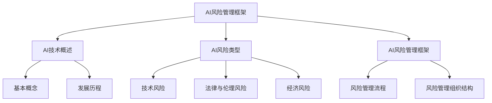

                 

### 《AI风险管理：企业AI应用的全面治理方案》

> 关键词：AI风险管理、企业AI应用、治理框架、案例分析、法规与标准

> 摘要：
本文旨在探讨AI风险管理在企业AI应用中的重要性，并详细解析AI风险管理的全面治理方案。通过梳理AI技术概述、风险类型、风险管理框架，以及企业AI应用治理实践，本文旨在为企业提供一套行之有效的AI风险管理策略，以应对AI在商业领域的广泛应用所带来的挑战。

## 引言

### 1.1 AI风险管理的重要性

随着人工智能技术的飞速发展，AI在企业中的应用越来越广泛。从金融、医疗、制造到零售等各个行业，AI技术的应用不仅提升了企业的运营效率，也带来了前所未有的商业模式变革。然而，AI的应用也伴随着一系列的风险，如算法偏见、数据泄露、法律合规等问题。这些风险不仅可能对企业造成经济损失，还可能影响企业的声誉和竞争力。因此，AI风险管理显得尤为重要。

### 1.2 本书的目的与结构

本书旨在为企业提供一套全面的AI风险管理解决方案，以帮助企业更好地应对AI应用中的风险。本书将分为六个部分：

- **第一部分**：引言，介绍AI风险管理的重要性。
- **第二部分**：AI风险管理基础，包括AI技术概述、AI风险类型和AI风险管理框架。
- **第三部分**：企业AI应用治理实践，包括AI应用规划、开发、部署和监控评估。
- **第四部分**：具体案例解析，通过案例分析，展示如何在实际应用中实施AI风险管理。
- **第五部分**：AI风险管理法规与标准，介绍国际和国内的AI风险管理法规及行业标准。
- **第六部分**：AI风险管理未来展望，探讨AI风险管理的发展趋势和挑战。

## 第二部分 AI风险管理基础

### 2.1 AI技术概述

#### 2.1.1 AI的基本概念

人工智能（Artificial Intelligence，AI）是指由人制造出来的系统所表现出来的智能行为。AI技术主要包括机器学习、深度学习、自然语言处理、计算机视觉等领域。

#### 2.1.2 人工智能的发展历程

人工智能的发展可以追溯到20世纪50年代，经历了几个阶段：早期探索阶段、第一次AI浪潮、低谷与复苏、第二次AI浪潮。

### 2.2 AI风险类型

#### 2.2.1 技术风险

技术风险包括算法错误、数据偏差、模型过拟合等问题。这些问题可能导致AI系统在特定场景下表现不佳。

#### 2.2.2 法律与伦理风险

法律与伦理风险包括隐私侵犯、算法偏见、责任归属等问题。这些问题可能引发法律纠纷和社会伦理问题。

#### 2.2.3 经济风险

经济风险包括投资回报率、技术更新换代、市场竞争等问题。这些问题可能影响企业的经济利益。

### 2.3 AI风险管理框架

#### 2.3.1 风险管理流程

风险管理流程通常包括风险识别、风险评估、风险应对和风险监控等步骤。

#### 2.3.2 风险管理组织结构

风险管理组织结构通常包括风险管理委员会、风险管理部、合规部等职能机构。

## 第三部分 企业AI应用治理实践

### 3.1 AI应用规划

#### 3.1.1 AI战略制定

AI战略制定是企业AI应用规划的首要步骤。企业需要明确AI应用的愿景、目标和策略。

#### 3.1.2 AI需求分析

AI需求分析是确保AI应用与业务需求相匹配的关键步骤。企业需要深入了解业务场景，确定AI应用的需求。

### 3.2 AI应用开发

#### 3.2.1 数据质量控制

数据质量控制是AI应用开发的基础。企业需要确保数据的质量和准确性。

#### 3.2.2 AI模型开发流程

AI模型开发流程包括数据收集、数据预处理、模型选择、模型训练、模型评估等步骤。

### 3.3 AI应用部署

#### 3.3.1 系统集成

系统集成是将AI应用与现有系统进行整合的过程。企业需要确保AI应用与其他系统的兼容性和稳定性。

#### 3.3.2 部署风险评估

部署风险评估是确保AI应用部署成功的关键步骤。企业需要评估部署过程中可能出现的风险，并制定相应的应对策略。

### 3.4 AI应用监控与评估

#### 3.4.1 性能监控

性能监控是确保AI应用持续稳定运行的关键步骤。企业需要实时监控AI应用的性能，确保其满足业务需求。

#### 3.4.2 风险评估与反馈

风险评估与反馈是持续改进AI应用的关键步骤。企业需要定期评估AI应用的风险，并根据反馈进行调整。

## 第四部分 具体案例解析

### 4.1 案例一：金融行业的AI风险管理

#### 4.1.1 案例背景

某银行引入AI模型进行信贷审批，以提高审批效率和降低不良贷款率。

#### 4.1.2 风险管理策略

风险管理策略包括数据质量控制、模型开发流程优化、风险评估与反馈等步骤。

## 第五部分 AI风险管理法规与标准

### 5.1 国际AI风险管理法规

#### 5.1.1 主要法规概述

国际AI风险管理法规主要包括《通用数据保护条例》（GDPR）、《人工智能伦理准则》等。

#### 5.1.2 我国AI风险管理法规

我国AI风险管理法规主要包括《中华人民共和国网络安全法》、《人工智能发展行动计划（2018-2020年）》等。

### 5.2 行业AI风险管理标准

#### 5.2.1 主要标准解读

行业AI风险管理标准主要包括《人工智能风险管理指南》、《金融行业人工智能应用规范》等。

#### 5.2.2 标准应用案例

标准应用案例包括金融行业的AI风险管理、医疗健康领域的AI风险管理等。

## 第六部分 AI风险管理未来展望

### 6.1 AI风险管理发展趋势

AI风险管理发展趋势包括技术创新、法规完善、行业协作等。

### 6.2 AI风险管理挑战与应对

AI风险管理挑战包括技术更新、数据隐私、法律合规等。

### 6.3 AI风险管理最佳实践

最佳实践包括建立健全的风险管理组织结构、加强数据质量控制、完善风险监控与评估机制等。

## 附录

### A.1 AI风险管理框架图



### A.2 AI风险伪代码示例

```python
def risk_management(application):
    # 数据质量控制
    data_quality_control()
    
    # AI模型开发
    model_development()
    
    # 系统集成与部署
    system_integration()
    
    # 监控与评估
    performance_monitoring()
    
    # 风险反馈与调整
    risk_evaluation_and_adjustment()

# 输出：风险管理的完整流程
print(risk_management("financial_application"))
```

### A.3 AI风险管理数学模型

$$
\text{Risk} = \alpha \times \text{Technical Risk} + \beta \times \text{Legal and Ethical Risk} + \gamma \times \text{Economic Risk}
$$

- $\alpha$、$\beta$、$\gamma$ 为权重系数，分别表示技术风险、法律与伦理风险、经济风险的重要程度。

### A.4 案例分析

#### 4.1 案例一：金融行业的AI风险管理

**案例背景**：某银行引入AI模型进行信贷审批，以提高审批效率和降低不良贷款率。

**风险管理策略**：

1. 数据质量控制：确保信贷数据的准确性和完整性。
2. 模型开发流程：遵循数据科学的方法论，进行模型训练和优化。
3. 风险评估与反馈：定期评估AI模型的风险，并根据反馈进行调整。

**作者**：AI天才研究院/AI Genius Institute & 禅与计算机程序设计艺术 /Zen And The Art of Computer Programming

**注意**：本文为示例性内容，仅供参考。实际应用中，AI风险管理需要根据具体业务场景和风险特征进行定制化设计和实施。

