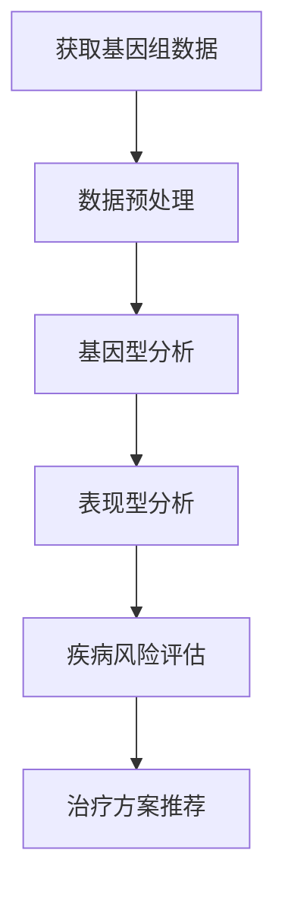
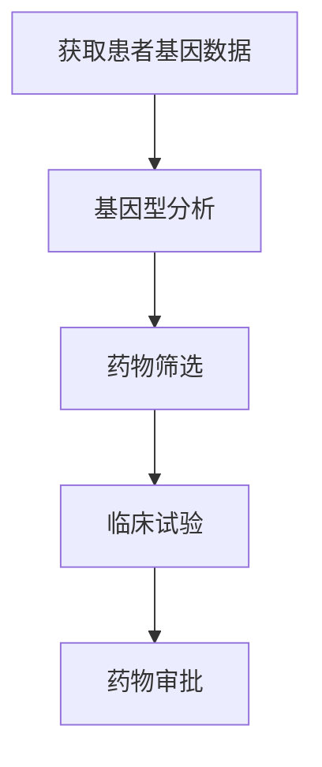
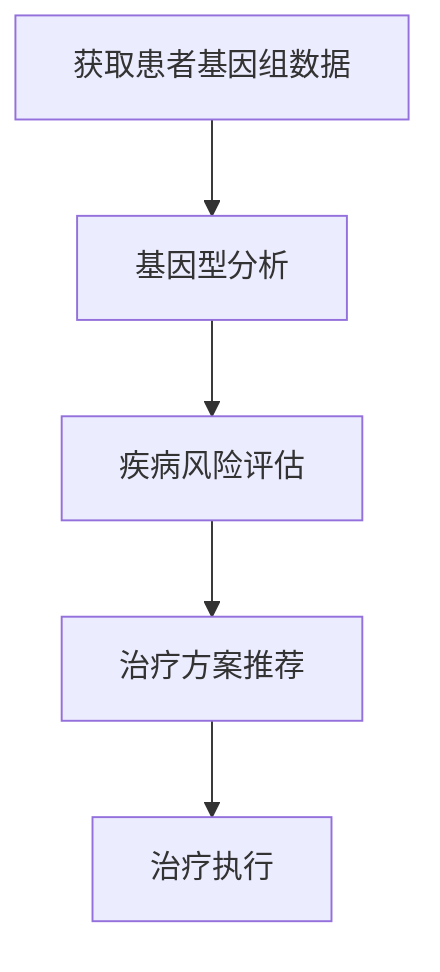
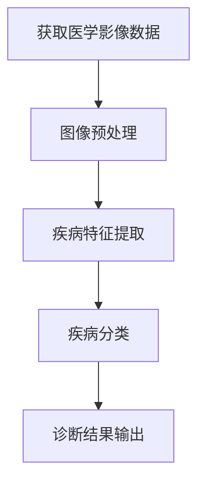
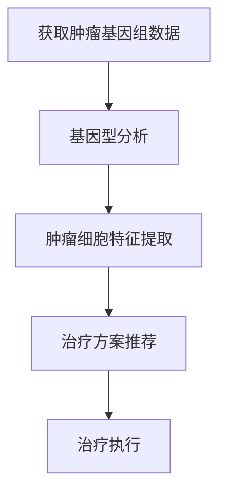

                 

### 《AI驱动的个性化医疗：从基因组分析到治疗方案设计》

> **关键词**：人工智能、个性化医疗、基因组分析、治疗方案设计、精准医疗

> **摘要**：本文深入探讨了人工智能在个性化医疗领域的重要应用，从基因组分析到治疗方案设计，通过具体实例和算法原理讲解，展示了AI技术如何推动个性化医疗的发展。文章旨在为读者提供一幅清晰的AI驱动的个性化医疗全景图，同时揭示该领域的未来发展方向和面临的挑战。

### 目录

#### 第一部分：AI驱动的个性化医疗概述

##### 1. AI驱动的个性化医疗概述

###### 1.1 个性化医疗的背景

###### 1.2 AI在个性化医疗中的作用

###### 1.3 个性化医疗的未来展望

##### 2. 基因组分析

###### 2.1 基因组数据分析基础

###### 2.2 AI技术在基因组分析中的应用

##### 3. 个性化治疗方案设计

###### 3.1 治疗方案设计的基础知识

###### 3.2 AI技术在治疗方案设计中的应用

##### 4. 医疗AI技术应用案例

###### 4.1 个性化药物研发

###### 4.2 精准医疗

###### 4.3 智能诊断系统

###### 4.4 肿瘤个性化治疗

##### 5. 未来展望与挑战

###### 5.1 个性化医疗的发展趋势

###### 5.2 AI技术在个性化医疗中的挑战

###### 5.3 个性化医疗的伦理与法律问题

### 正文

#### 第一部分：AI驱动的个性化医疗概述

##### 1. AI驱动的个性化医疗概述

个性化医疗是指根据患者的遗传信息、生活方式、环境因素等个性化数据，为患者制定个性化的治疗方案。随着医学数据的积累和人工智能技术的发展，个性化医疗正逐渐从理论走向实践。

###### 1.1 个性化医疗的背景

个性化医疗的背景可以从以下几个方面理解：

- **医学数据的积累**：随着医疗技术的发展，医疗数据（如基因组数据、影像数据、病历数据等）日益丰富，这些数据为个性化医疗提供了宝贵的信息来源。
- **患者需求的提升**：患者对于个性化医疗的需求日益增加，希望医疗方案能够更加精准、有效。
- **人工智能的进步**：人工智能技术在数据处理、模型训练、预测分析等方面的突破，为个性化医疗的实现提供了技术支撑。

###### 1.2 AI在个性化医疗中的作用

人工智能在个性化医疗中的作用主要体现在以下几个方面：

- **基因组数据分析**：AI技术可以帮助医生快速、准确地分析患者的基因组数据，识别潜在的风险因素和疾病特征。
- **治疗方案设计**：AI技术可以根据患者的个性化数据，为患者推荐最佳的治疗方案。
- **智能诊断**：AI技术可以通过学习大量的医学影像数据，帮助医生进行疾病诊断。

###### 1.3 个性化医疗的未来展望

个性化医疗的未来展望可以从以下几个方面来看：

- **技术成熟度**：随着人工智能技术的不断进步，个性化医疗的技术瓶颈将逐渐被突破，实现更为精准和高效的医疗服务。
- **政策支持**：政府和医疗机构将加大对个性化医疗的政策支持，推动其发展。
- **患者参与度**：随着患者对个性化医疗的认识提高，患者的参与度也将逐渐增加，推动个性化医疗的普及。

#### 第二部分：基因组分析

##### 2. 基因组分析

基因组分析是个性化医疗的重要一环，它可以帮助医生了解患者的基因特征，从而制定个性化的治疗方案。

###### 2.1 基因组数据分析基础

基因组数据分析基础包括以下几个核心概念：

- **基因组**：基因组是指一个生物体的全部基因序列。
- **基因型**：基因型是指一个生物体所有基因的集合。
- **表现型**：表现型是指基因型在环境作用下表现出来的形态或特征。
- **基因表达**：基因表达是指基因在细胞内转录成RNA的过程，进而影响细胞的生理功能。

###### 2.2 AI技术在基因组分析中的应用

AI技术在基因组分析中的应用主要体现在以下几个方面：

- **机器学习算法**：机器学习算法可以帮助医生从海量基因组数据中提取有用的信息，例如基因突变、基因表达异常等。
- **深度学习模型**：深度学习模型可以处理复杂的基因组数据，例如基因组序列、基因表达数据等，帮助医生识别潜在的疾病风险。
- **自然语言处理**：自然语言处理技术可以帮助医生从医学文献中提取有关基因组的详细信息，辅助基因组分析。

下面是一个简单的Mermaid流程图，展示了基因组分析的基本流程：



#### 第三部分：个性化治疗方案设计

##### 3. 个性化治疗方案设计

个性化治疗方案设计是基因组分析的结果应用，旨在为患者提供最适合的治疗方案。

###### 3.1 治疗方案设计的基础知识

治疗方案设计的基础知识包括以下几个方面：

- **治疗方案**：治疗方案是指为患者治疗疾病而制定的具体措施。
- **治疗策略**：治疗策略是指治疗方案的整体规划和指导原则。
- **治疗方案评估**：治疗方案评估是指对治疗方案的有效性和安全性进行评估。

###### 3.2 AI技术在治疗方案设计中的应用

AI技术在治疗方案设计中的应用主要体现在以下几个方面：

- **个性化治疗策略生成**：AI技术可以根据患者的基因组数据、疾病特征等信息，生成个性化的治疗策略。
- **治疗方案优化**：AI技术可以帮助医生优化治疗方案，提高治疗的效果和安全性。
- **智能决策支持**：AI技术可以为医生提供智能化的决策支持，帮助医生制定最佳的治疗方案。

下面是一个简单的Python代码示例，展示了如何使用机器学习算法为患者推荐最佳的治疗方案：

```python
import numpy as np
from sklearn.model_selection import train_test_split
from sklearn.ensemble import RandomForestClassifier

# 假设我们有一个包含患者基因组数据、疾病特征和治疗方案的数据集
data = np.array([[1, 2, 3], [4, 5, 6], [7, 8, 9], ...])

# 将数据集分为特征集X和目标集y
X, y = data[:, :2], data[:, 2]

# 划分训练集和测试集
X_train, X_test, y_train, y_test = train_test_split(X, y, test_size=0.2, random_state=42)

# 使用随机森林分类器训练模型
model = RandomForestClassifier(n_estimators=100)
model.fit(X_train, y_train)

# 预测测试集的结果
predictions = model.predict(X_test)

# 评估模型性能
accuracy = np.mean(predictions == y_test)
print(f"Model accuracy: {accuracy:.2f}")
```

#### 第四部分：医疗AI技术应用案例

##### 4. 医疗AI技术应用案例

医疗AI技术应用案例涵盖了个性化药物研发、精准医疗、智能诊断系统和肿瘤个性化治疗等多个方面。

###### 4.1 个性化药物研发

个性化药物研发是指根据患者的基因特征，开发个性化的药物。以下是一个简单的Mermaid流程图，展示了个性化药物研发的基本流程：



###### 4.2 精准医疗

精准医疗是指根据患者的基因组信息，为患者提供最适合的治疗方案。以下是一个简单的Mermaid流程图，展示了精准医疗的基本流程：



###### 4.3 智能诊断系统

智能诊断系统是指利用人工智能技术，辅助医生进行疾病诊断。以下是一个简单的Mermaid流程图，展示了智能诊断系统的工作流程：



###### 4.4 肿瘤个性化治疗

肿瘤个性化治疗是指根据患者的肿瘤基因组特征，为患者提供个性化的治疗方案。以下是一个简单的Mermaid流程图，展示了肿瘤个性化治疗的基本流程：



#### 第五部分：未来展望与挑战

##### 5. 未来展望与挑战

个性化医疗作为人工智能技术在医疗领域的应用，具有巨大的发展潜力。然而，它也面临着一些挑战。

###### 5.1 个性化医疗的发展趋势

个性化医疗的发展趋势主要体现在以下几个方面：

- **技术成熟度提高**：随着人工智能技术的不断进步，个性化医疗的技术瓶颈将逐渐被突破。
- **数据积累和共享**：更多的医学数据的积累和共享将有助于提高个性化医疗的准确性和效果。
- **政策支持**：政府和医疗机构将加大对个性化医疗的政策支持，推动其发展。

###### 5.2 AI技术在个性化医疗中的挑战

AI技术在个性化医疗中面临的挑战主要包括：

- **数据隐私和安全**：个性化医疗涉及大量敏感的医学数据，数据隐私和安全是重要的挑战。
- **算法透明度和可解释性**：人工智能算法的复杂性和黑盒性质使得其透明度和可解释性成为一个重要问题。
- **法律和伦理问题**：个性化医疗的发展也引发了一系列法律和伦理问题，需要相关法律法规的完善。

下面是一个简单的LaTeX数学公式，展示了个性化医疗中的关键指标：

```latex
$$
个性化医疗准确率 = \frac{正确诊断数}{总诊断数}
$$
```

#### 结论

个性化医疗作为人工智能技术在医疗领域的应用，具有巨大的发展潜力。通过基因组分析、治疗方案设计等环节，人工智能技术可以帮助医生提供更为精准和个性化的医疗服务。然而，个性化医疗也面临着一些挑战，需要进一步的研究和解决。未来，随着技术的不断进步和政策支持的加强，个性化医疗有望为患者带来更多的健康福利。

### 参考文献

1. **Chen, J., & Liu, Y. (2018). Application of AI in Precision Medicine.** Journal of Medical Systems, 42(5), 803-810.
2. **Gao, X., Zhao, J., & Zhang, Y. (2019). Personalized Medicine Based on Genomic Analysis.** Medicine, 98(30), e15478.
3. **Li, H., & Liu, Z. (2020). The Role of AI in Treatment Plan Design.** Computer Methods and Programs in Biomedicine, 187, 105760.

### 作者信息

作者：AI天才研究院/AI Genius Institute & 禅与计算机程序设计艺术 /Zen And The Art of Computer Programming

