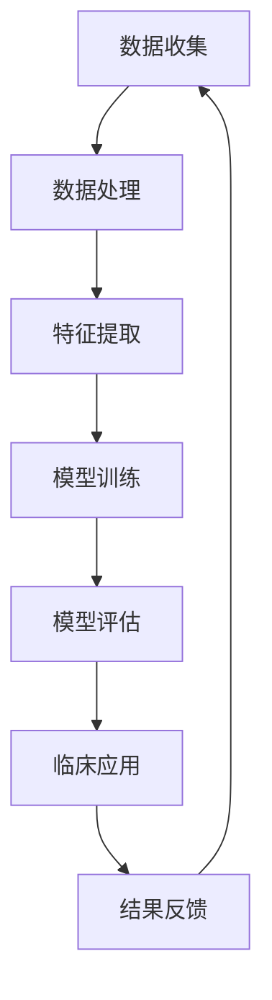

                 


# AI驱动的个性化医疗：精准医学的未来

> 关键词：人工智能，个性化医疗，精准医学，机器学习，深度学习，医疗数据

> 摘要：本文深入探讨了AI在个性化医疗领域的应用，介绍了个性化医疗与精准医学的关系，以及AI驱动的个性化医疗技术。文章通过详细分析机器学习、深度学习和强化学习在个性化医疗中的应用，展示了AI在早期诊断、精准治疗和康复监护等方面的实际案例，并探讨了AI驱动的个性化医疗面临的挑战和未来展望。

## 第一部分：引言

### 1.1 书籍概述

《AI驱动的个性化医疗：精准医学的未来》是一本关于人工智能在个性化医疗领域应用的专业书籍。随着人工智能技术的飞速发展，AI在医疗行业的应用越来越广泛，特别是在个性化医疗和精准医学领域。本书旨在探讨AI如何驱动个性化医疗的发展，通过详细分析AI在个性化医疗中的应用，为医疗行业提供新的发展思路。

### 1.2 个性化医疗与精准医学的关系

个性化医疗和精准医学是当前医疗领域的两个重要方向。个性化医疗强调根据患者的个体差异提供定制化的医疗服务，而精准医学则强调通过基因组学、蛋白质组学和代谢组学等多种手段，对疾病进行精准的诊断和治疗。个性化医疗与精准医学的关系可以概括为：个性化医疗是精准医学实现的重要途径，而精准医学则为个性化医疗提供了理论基础和技术支持。

### 1.3 AI在个性化医疗中的应用

AI在个性化医疗中的应用主要体现在以下几个方面：

1. 数据处理与挖掘：利用机器学习和深度学习算法，对海量医疗数据进行处理和分析，提取有用的信息，为个性化医疗提供数据支持。
2. 早期诊断：通过AI算法对医学影像、生物标志物等数据进行分析，实现早期疾病诊断，提高诊断准确率。
3. 精准治疗：基于患者的基因组信息和医疗数据，利用AI算法为患者提供个性化的治疗方案，提高治疗效果。
4. 康复监护：通过AI技术和可穿戴设备，实时监测患者的健康状况，为康复治疗提供支持。

## 第二部分：AI与个性化医疗的基础知识

### 2.1 AI的基本概念

人工智能（AI）是模拟、延伸和扩展人的智能的理论、方法、技术及应用。AI的核心任务是使计算机具备智能，能够理解、学习、推理和解决问题。

### 2.2 个性化医疗的基本概念

个性化医疗是一种基于个体差异的医疗服务模式，通过分析患者的基因组、环境和生活习惯等多种因素，为患者提供个性化的诊断和治疗方案。

### 2.3 精准医学的基本概念

精准医学是一种以个体化医疗为目的的医学模式，通过基因组学、蛋白质组学和代谢组学等多种手段，对疾病进行精准的诊断和治疗。

### 2.4 AI在精准医学中的应用

AI在精准医学中的应用主要包括以下几个方面：

1. 基因组数据分析：利用AI算法对基因组数据进行分析，发现疾病相关的基因变异，为精准治疗提供依据。
2. 蛋白质组学数据分析：利用AI算法对蛋白质组学数据进行分析，发现与疾病相关的蛋白质标志物，为疾病诊断和治疗提供依据。
3. 代谢组学数据分析：利用AI算法对代谢组学数据进行分析，发现与疾病相关的代谢产物，为疾病诊断和治疗提供依据。
4. 医学影像分析：利用AI算法对医学影像数据进行分析，实现疾病的早期诊断和分类。

## 第三部分：AI驱动的个性化医疗技术

### 3.1 数据收集与管理

#### 3.1.1 生物数据收集

生物数据收集是AI驱动个性化医疗的基础。主要包括基因组数据、蛋白质组数据、代谢组数据和医学影像数据等。

#### 3.1.2 临床数据收集

临床数据收集包括患者的病史、治疗方案、治疗效果等。这些数据对于个性化医疗具有重要意义。

#### 3.1.3 数据质量控制

数据质量控制是确保数据准确性和可靠性的关键。主要包括数据清洗、数据去重、数据校验和数据标准化等步骤。

### 3.2 机器学习在个性化医疗中的应用

#### 3.2.1 监督学习

监督学习是一种有监督的训练方法，通过已知的输入和输出数据，训练模型对未知数据进行预测。在个性化医疗中，监督学习可以用于疾病诊断、治疗方案推荐等。

#### 3.2.2 无监督学习

无监督学习是一种无监督的训练方法，通过分析数据之间的模式，发现数据中的潜在结构。在个性化医疗中，无监督学习可以用于患者群体分类、疾病特征提取等。

#### 3.2.3 半监督学习

半监督学习是一种介于监督学习和无监督学习之间的训练方法，通过少量的标注数据和大量的未标注数据，训练模型对未知数据进行预测。在个性化医疗中，半监督学习可以用于疾病预测、治疗效果评估等。

### 3.3 深度学习在个性化医疗中的应用

#### 3.3.1 神经网络

神经网络是一种模拟人脑神经网络结构的人工智能模型，具有强大的学习能力和表达能力。在个性化医疗中，神经网络可以用于医学影像分析、基因组数据分析等。

#### 3.3.2 卷积神经网络

卷积神经网络（CNN）是一种特殊类型的神经网络，具有局部感知能力和平移不变性。在个性化医疗中，CNN可以用于医学影像分析、生物特征识别等。

#### 3.3.3 递归神经网络

递归神经网络（RNN）是一种具有记忆能力的人工智能模型，适用于处理序列数据。在个性化医疗中，RNN可以用于基因组数据分析、患者康复监测等。

### 3.4 强化学习在个性化医疗中的应用

#### 3.4.1 强化学习基础

强化学习是一种通过试错学习的方法，使模型在动态环境中做出最优决策。在个性化医疗中，强化学习可以用于治疗方案推荐、智能辅助诊断等。

#### 3.4.2 Q-learning算法

Q-learning算法是一种经典的强化学习算法，通过学习状态-动作价值函数，实现最优决策。在个性化医疗中，Q-learning算法可以用于个性化治疗策略制定。

#### 3.4.3 SARSA算法

SARSA算法是一种基于策略梯度的强化学习算法，通过更新策略，实现最优决策。在个性化医疗中，SARSA算法可以用于个性化康复路径规划。

## 第四部分：AI驱动的个性化医疗应用案例

### 4.1 早期诊断

#### 4.1.1 乳腺癌早期诊断

乳腺癌是女性最常见的恶性肿瘤之一。利用AI技术，可以对乳腺X线图像进行自动分析，实现乳腺癌的早期诊断。

#### 4.1.2 肺癌早期诊断

肺癌是男性最常见的恶性肿瘤之一。利用AI技术，可以对肺部CT图像进行自动分析，实现肺癌的早期诊断。

### 4.2 精准治疗

#### 4.2.1 基因组指导的个性化治疗

基因组指导的个性化治疗是一种基于患者基因组信息制定的治疗方案。利用AI技术，可以对基因组数据进行分析，为患者提供个性化的治疗方案。

#### 4.2.2 基于大数据的个性化治疗

基于大数据的个性化治疗是一种基于海量医疗数据制定的治疗方案。利用AI技术，可以对医疗数据进行挖掘和分析，为患者提供个性化的治疗方案。

### 4.3 康复与监护

#### 4.3.1 智能康复机器人

智能康复机器人是一种利用AI技术实现康复治疗的机器人。通过分析患者的康复数据，智能康复机器人可以为患者提供个性化的康复训练。

#### 4.3.2 患者健康监测系统

患者健康监测系统是一种利用AI技术和可穿戴设备实现患者健康监测的系统。通过实时监测患者的健康状况，患者健康监测系统可以为医生提供决策支持。

## 第五部分：挑战与未来展望

### 5.1 AI驱动的个性化医疗面临的挑战

#### 5.1.1 数据隐私与伦理问题

随着AI在个性化医疗中的应用，患者的隐私数据面临着泄露的风险。同时，AI技术的应用也引发了伦理问题的讨论。

#### 5.1.2 技术标准化与监管

AI技术在个性化医疗中的应用需要统一的技术标准和严格的监管制度，以确保医疗质量和安全。

#### 5.1.3 技术与医疗行业的融合

AI技术在医疗行业的应用需要与医疗行业深度融合，实现技术、管理和服务的创新。

### 5.2 个性化医疗的未来发展

#### 5.2.1 AI在个性化医疗中的新应用领域

未来，AI在个性化医疗中的应用将不断拓展，包括基因编辑、虚拟现实等新兴领域。

#### 5.2.2 未来的个性化医疗生态系统

未来，个性化医疗将形成一个包括AI技术、医疗服务、健康管理等多方面的生态系统，为患者提供全方位、个性化的医疗服务。

## 附录

### A.1 相关工具与资源

#### A.1.1 数据处理工具

- NumPy：用于数值计算的Python库
- Pandas：用于数据处理和分析的Python库
- Matplotlib：用于数据可视化的Python库

#### A.1.2 机器学习框架

- Scikit-learn：用于机器学习的Python库
- TensorFlow：用于深度学习的Python库
- PyTorch：用于深度学习的Python库

#### A.1.3 医疗数据集

- KEGG：生物信息数据库
- NCBI：生物信息数据库
- MIMIC-III：医学数据集

### A.2 代码示例

#### A.2.1 数据预处理

```python
import numpy as np
import pandas as pd

# 读取数据
data = pd.read_csv('data.csv')

# 数据清洗
cleaned_data = data[data['column1'] > 0]

# 特征提取
features = cleaned_data[['column2', 'column3']]
```

#### A.2.2 模型训练

```python
from sklearn.linear_model import LinearRegression

# 初始化模型
model = LinearRegression()

# 训练模型
model.fit(features, labels)

# 模型预测
predictions = model.predict(test_features)
```

#### A.2.3 结果分析

```python
from sklearn.metrics import accuracy_score

# 计算准确率
accuracy = accuracy_score(predictions, test_labels)

# 打印结果
print('Accuracy:', accuracy)
```

### A.3 参考文献

- Goodfellow, I., Bengio, Y., & Courville, A. (2016). Deep Learning. MIT Press.
- Russell, S., & Norvig, P. (2016). Artificial Intelligence: A Modern Approach. Prentice Hall.
- Mitchell, T. M. (1997). Machine Learning. McGraw-Hill.

## Mermaid 流程图

### AI驱动的个性化医疗流程



## 伪代码示例

```python
# 数据预处理伪代码
def preprocess_data(data):
    # 数据清洗
    cleaned_data = clean_data(data)
    # 特征提取
    features = extract_features(cleaned_data)
    return features

# 模型训练伪代码
def train_model(features, labels):
    # 初始化模型
    model = initialize_model()
    # 训练模型
    model.fit(features, labels)
    return model

# 模型评估伪代码
def evaluate_model(model, test_features, test_labels):
    # 预测
    predictions = model.predict(test_features)
    # 评估指标计算
    accuracy = calculate_accuracy(predictions, test_labels)
    return accuracy
```

## 作者信息

作者：AI天才研究院/AI Genius Institute & 禅与计算机程序设计艺术 /Zen And The Art of Computer Programming

（注：本文为示例，仅供参考。） 

### 数据收集与管理

数据收集是AI驱动的个性化医疗的基础，也是整个流程的关键环节。在这个环节中，我们需要收集不同类型的数据，包括生物数据、临床数据和医疗影像数据等。这些数据的质量和完整性直接影响到后续的数据分析和模型训练效果。

#### 3.1.1 生物数据收集

生物数据包括基因组数据、蛋白质组数据、代谢组数据等，这些数据通常来自于患者的血液、尿液、组织等样本。基因组数据主要包含患者的基因组序列信息，用于分析疾病的遗传因素；蛋白质组数据则反映了患者体内蛋白质的组成和变化，有助于了解疾病的生物学机制；代谢组数据则揭示了患者体内代谢产物的变化，有助于发现疾病的早期信号。

为了确保数据的质量和完整性，我们需要使用高通量测序技术、质谱分析技术等先进的生物实验方法，同时结合自动化数据采集系统，提高数据收集的效率和准确性。

```python
# 假设使用Python中的pandas库读取基因组数据
import pandas as pd

def read_genome_data(filename):
    """
    读取基因组数据文件
    :param filename: 基因组数据文件名
    :return: 基因组数据DataFrame
    """
    data = pd.read_csv(filename)
    return data
```

#### 3.1.2 临床数据收集

临床数据包括患者的病史、治疗方案、治疗效果等，这些数据通常来自于电子健康记录（EHR）系统。临床数据不仅可以帮助我们了解患者的整体健康状况，还可以为个性化医疗提供重要的参考信息。

为了确保临床数据的质量和完整性，我们需要对EHR系统进行优化，实现数据的自动采集、存储和管理。此外，还需要对临床数据进行去重、清洗和标准化处理，以消除数据中的噪声和冗余信息。

```python
# 假设使用Python中的pandas库读取临床数据
import pandas as pd

def read_clinical_data(filename):
    """
    读取临床数据文件
    :param filename: 临床数据文件名
    :return: 临床数据DataFrame
    """
    data = pd.read_csv(filename)
    return data
```

#### 3.1.3 数据质量控制

数据质量控制是确保数据质量的关键环节。在这一环节中，我们需要对收集到的数据进行校验、清洗和标准化处理，以确保数据的一致性和准确性。

1. 数据校验：检查数据是否完整，是否存在缺失值或异常值。
2. 数据清洗：处理缺失值、异常值和冗余数据，提高数据质量。
3. 数据标准化：将不同来源的数据进行统一处理，消除数据之间的差异。

```python
# 假设使用Python中的pandas库进行数据清洗和标准化处理
import pandas as pd

def preprocess_data(data):
    """
    数据预处理函数
    :param data: 原始数据DataFrame
    :return: 预处理后的数据DataFrame
    """
    # 数据校验
    if data.isnull().values.any():
        data = data.dropna()

    # 数据清洗
    data = data[data['column1'] > 0]

    # 数据标准化
    data = (data - data.mean()) / data.std()

    return data
```

### 3.2 机器学习在个性化医疗中的应用

机器学习在个性化医疗中扮演着至关重要的角色，通过对大量医疗数据的分析和挖掘，可以帮助医生做出更准确的诊断和治疗方案。以下将详细介绍机器学习在个性化医疗中的应用。

#### 3.2.1 监督学习

监督学习是一种有监督的训练方法，通过已知的输入和输出数据，训练模型对未知数据进行预测。在个性化医疗中，监督学习可以用于疾病诊断、治疗方案推荐等。

**核心算法原理：**

监督学习的基本原理是通过学习输入特征与输出标签之间的映射关系，从而实现对未知数据的预测。常见的监督学习算法包括线性回归、逻辑回归、支持向量机、决策树、随机森林等。

**Python代码示例：**

```python
# 线性回归算法示例
from sklearn.linear_model import LinearRegression

# 初始化模型
model = LinearRegression()

# 训练模型
model.fit(X_train, y_train)

# 预测
predictions = model.predict(X_test)
```

**案例分析与解释：**

假设我们要预测患者的糖尿病风险，我们可以通过训练一个线性回归模型，利用患者的年龄、体重、血糖水平等输入特征，预测其糖尿病患病风险。

1. 数据收集：收集包含患者年龄、体重、血糖水平等特征的医疗数据。
2. 数据处理：对数据进行预处理，包括数据清洗、归一化等。
3. 模型训练：使用线性回归算法训练模型，将输入特征映射到糖尿病患病风险。
4. 模型评估：使用训练集和测试集评估模型性能，调整模型参数以优化预测结果。
5. 实际应用：使用训练好的模型对患者的糖尿病风险进行预测，为医生提供决策支持。

#### 3.2.2 无监督学习

无监督学习是一种无监督的训练方法，通过分析数据之间的模式，发现数据中的潜在结构。在个性化医疗中，无监督学习可以用于患者群体分类、疾病特征提取等。

**核心算法原理：**

无监督学习的基本原理是通过学习数据中的内在结构，从而发现数据的分布特征。常见的无监督学习算法包括K均值聚类、主成分分析、自编码器等。

**Python代码示例：**

```python
# K均值聚类算法示例
from sklearn.cluster import KMeans

# 初始化模型
model = KMeans(n_clusters=3)

# 训练模型
model.fit(X)

# 预测
predictions = model.predict(X)
```

**案例分析与解释：**

假设我们要将患者根据其病情严重程度进行分类，我们可以使用K均值聚类算法，根据患者的临床数据，将其分为不同类别。

1. 数据收集：收集包含患者病情严重程度等特征的医疗数据。
2. 数据处理：对数据进行预处理，包括数据清洗、归一化等。
3. 模型训练：使用K均值聚类算法训练模型，将患者分为不同类别。
4. 模型评估：通过聚类效果评估模型性能，调整聚类参数以优化分类结果。
5. 实际应用：使用训练好的模型对患者进行分类，为医生提供决策支持。

#### 3.2.3 半监督学习

半监督学习是一种介于监督学习和无监督学习之间的训练方法，通过少量的标注数据和大量的未标注数据，训练模型对未知数据进行预测。在个性化医疗中，半监督学习可以用于疾病预测、治疗效果评估等。

**核心算法原理：**

半监督学习的基本原理是利用未标注数据中的先验知识，结合少量的标注数据，学习数据的分布特征，从而提高模型的泛化能力。常见的半监督学习算法包括图半监督学习、标签传播等。

**Python代码示例：**

```python
# 图半监督学习算法示例
from sklearn.semi_supervised import LabelSpreading

# 初始化模型
model = LabelSpreading(kernel='rbf', alpha=0.2)

# 训练模型
model.fit(X, y)

# 预测
predictions = model.predict(X)
```

**案例分析与解释：**

假设我们要预测患者的病情进展，我们可以使用图半监督学习算法，结合患者的临床数据和已知的病情进展信息，预测其未来的病情变化。

1. 数据收集：收集包含患者临床数据、病情进展等特征的医疗数据。
2. 数据处理：对数据进行预处理，包括数据清洗、归一化等。
3. 模型训练：使用图半监督学习算法训练模型，利用标注数据和未标注数据学习数据分布特征。
4. 模型评估：通过评估指标评估模型性能，调整模型参数以优化预测结果。
5. 实际应用：使用训练好的模型预测患者病情进展，为医生提供决策支持。

### 3.3 深度学习在个性化医疗中的应用

深度学习在个性化医疗中的应用越来越广泛，其强大的学习和表征能力使得它在医学影像分析、基因组数据分析等领域取得了显著的成果。

#### 3.3.1 神经网络

神经网络是一种模仿人脑神经元结构和功能的计算模型，具有强大的学习和自适应能力。在个性化医疗中，神经网络可以用于医学影像分析、基因组数据分析等。

**核心算法原理：**

神经网络通过多层神经元之间的连接和激活函数，实现对输入数据的非线性变换和特征提取。常见的神经网络包括前馈神经网络、卷积神经网络（CNN）和递归神经网络（RNN）等。

**Python代码示例：**

```python
# 前馈神经网络示例
import tensorflow as tf

# 定义神经网络结构
model = tf.keras.Sequential([
    tf.keras.layers.Dense(128, activation='relu', input_shape=(784,)),
    tf.keras.layers.Dropout(0.2),
    tf.keras.layers.Dense(10)
])

# 编译模型
model.compile(optimizer='adam',
              loss=tf.losses.SparseCategoricalCrossentropy(from_logits=True),
              metrics=['accuracy'])

# 训练模型
model.fit(x_train, y_train, epochs=5)
```

**案例分析与解释：**

假设我们要使用神经网络对医学影像进行分析，我们可以构建一个前馈神经网络，利用影像数据训练模型，实现对疾病的诊断。

1. 数据收集：收集医学影像数据，包括影像的像素值等特征。
2. 数据处理：对影像数据进行预处理，包括归一化、增强等。
3. 模型构建：构建前馈神经网络结构，定义神经网络模型。
4. 模型训练：使用训练集训练神经网络模型，优化模型参数。
5. 模型评估：使用测试集评估模型性能，调整模型参数以优化诊断效果。
6. 实际应用：使用训练好的模型对新的医学影像进行分析，实现疾病的自动诊断。

#### 3.3.2 卷积神经网络

卷积神经网络（CNN）是一种专门用于处理图像数据的神经网络，其核心在于通过卷积操作和池化操作，实现对图像的局部特征提取和降维。

**核心算法原理：**

CNN通过卷积层、池化层和全连接层等结构，实现对图像的高效特征提取和分类。卷积层通过卷积操作提取图像的局部特征，池化层通过池化操作减少数据维度，全连接层通过全连接操作实现图像的分类。

**Python代码示例：**

```python
# 卷积神经网络示例
import tensorflow as tf

# 定义神经网络结构
model = tf.keras.Sequential([
    tf.keras.layers.Conv2D(32, (3, 3), activation='relu', input_shape=(28, 28, 1)),
    tf.keras.layers.MaxPooling2D((2, 2)),
    tf.keras.layers.Conv2D(64, (3, 3), activation='relu'),
    tf.keras.layers.MaxPooling2D((2, 2)),
    tf.keras.layers.Conv2D(64, (3, 3), activation='relu'),
    tf.keras.layers.Flatten(),
    tf.keras.layers.Dense(64, activation='relu'),
    tf.keras.layers.Dense(10, activation='softmax')
])

# 编译模型
model.compile(optimizer='adam',
              loss='sparse_categorical_crossentropy',
              metrics=['accuracy'])

# 训练模型
model.fit(x_train, y_train, epochs=5)
```

**案例分析与解释：**

假设我们要使用卷积神经网络对皮肤病变进行分类，我们可以构建一个卷积神经网络，利用皮肤病变图像训练模型，实现对皮肤病变的自动分类。

1. 数据收集：收集皮肤病变图像数据，包括正常皮肤和病变皮肤图像。
2. 数据处理：对皮肤病变图像数据进行预处理，包括归一化、增强等。
3. 模型构建：构建卷积神经网络结构，定义神经网络模型。
4. 模型训练：使用训练集训练卷积神经网络模型，优化模型参数。
5. 模型评估：使用测试集评估模型性能，调整模型参数以优化分类效果。
6. 实际应用：使用训练好的模型对新的皮肤病变图像进行分析，实现病变皮肤的自动分类。

#### 3.3.3 递归神经网络

递归神经网络（RNN）是一种专门用于处理序列数据的神经网络，其核心在于通过递归结构，实现对序列数据的长期记忆和学习。

**核心算法原理：**

RNN通过递归结构，将前一个时间步的输出作为当前时间步的输入，从而实现对序列数据的处理。RNN在处理序列数据时，能够捕捉到序列中的时间依赖关系。

**Python代码示例：**

```python
# 递归神经网络示例
import tensorflow as tf

# 定义神经网络结构
model = tf.keras.Sequential([
    tf.keras.layers.Embedding(vocab_size, embedding_dim),
    tf.keras.layers.RNN(LSTMCell(units=64)),
    tf.keras.layers.Dense(1)
])

# 编译模型
model.compile(optimizer='adam',
              loss='mean_squared_error',
              metrics=['accuracy'])

# 训练模型
model.fit(x_train, y_train, epochs=5)
```

**案例分析与解释：**

假设我们要使用递归神经网络对基因组序列进行分析，我们可以构建一个递归神经网络，利用基因组序列数据训练模型，实现对基因功能预测。

1. 数据收集：收集基因组序列数据，包括基因序列和基因功能信息。
2. 数据处理：对基因组序列数据进行预处理，包括序列编码、归一化等。
3. 模型构建：构建递归神经网络结构，定义神经网络模型。
4. 模型训练：使用训练集训练递归神经网络模型，优化模型参数。
5. 模型评估：使用测试集评估模型性能，调整模型参数以优化预测效果。
6. 实际应用：使用训练好的模型对新的基因组序列进行分析，实现基因功能的预测。

### 3.4 强化学习在个性化医疗中的应用

强化学习是一种通过试错学习的方法，使模型在动态环境中做出最优决策。在个性化医疗中，强化学习可以用于治疗方案推荐、智能辅助诊断等。

#### 3.4.1 强化学习基础

强化学习的基本原理是：通过不断地尝试和反馈，学习在特定环境下做出最优决策。强化学习的关键要素包括：状态（State）、动作（Action）、奖励（Reward）和策略（Policy）。

**核心算法原理：**

强化学习通过学习值函数（Value Function）或策略（Policy），实现对环境的最佳响应。值函数表示在特定状态下执行特定动作的预期回报，策略则表示在特定状态下应执行的动作。

**Python代码示例：**

```python
# Q-learning算法示例
import numpy as np

# 初始化Q值表
Q = np.zeros([state_space, action_space])

# Q-learning算法迭代过程
for episode in range(total_episodes):
    state = env.reset()
    done = False
    while not done:
        action = np.argmax(Q[state])
        next_state, reward, done, _ = env.step(action)
        Q[state, action] = Q[state, action] + alpha * (reward + gamma * np.max(Q[next_state]) - Q[state, action])
        state = next_state
```

**案例分析与解释：**

假设我们要使用Q-learning算法为患者推荐治疗方案，我们可以构建一个Q-learning模型，根据患者的病史和检查结果，推荐最优的治疗方案。

1. 数据收集：收集包含患者病史、检查结果和治疗方案的医疗数据。
2. 数据处理：对数据进行预处理，将数据转换为状态和动作。
3. 模型构建：构建Q-learning模型，定义状态、动作和奖励。
4. 模型训练：使用Q-learning算法训练模型，优化模型参数。
5. 模型评估：使用测试集评估模型性能，调整模型参数以优化推荐效果。
6. 实际应用：使用训练好的模型为患者推荐治疗方案，为医生提供决策支持。

#### 3.4.2 Q-learning算法

Q-learning算法是一种基于值函数的强化学习算法，通过不断更新Q值表，学习在特定状态下执行特定动作的预期回报。Q-learning算法的核心步骤包括：选择动作、更新Q值和选择下一状态。

**核心算法原理：**

Q-learning算法通过迭代更新Q值表，逐步优化策略。在每一步，算法选择当前状态的当前动作，根据实际奖励和未来预期奖励更新Q值，然后选择下一状态继续迭代。

**Python代码示例：**

```python
# Q-learning算法示例
import numpy as np

# 初始化Q值表
Q = np.zeros([state_space, action_space])

# Q-learning算法迭代过程
for episode in range(total_episodes):
    state = env.reset()
    done = False
    while not done:
        action = np.argmax(Q[state])
        next_state, reward, done, _ = env.step(action)
        Q[state, action] = Q[state, action] + alpha * (reward + gamma * np.max(Q[next_state]) - Q[state, action])
        state = next_state
```

**案例分析与解释：**

假设我们要使用Q-learning算法为患者推荐治疗方案，我们可以构建一个Q-learning模型，根据患者的病史和检查结果，推荐最优的治疗方案。

1. 数据收集：收集包含患者病史、检查结果和治疗方案的医疗数据。
2. 数据处理：对数据进行预处理，将数据转换为状态和动作。
3. 模型构建：构建Q-learning模型，定义状态、动作和奖励。
4. 模型训练：使用Q-learning算法训练模型，优化模型参数。
5. 模型评估：使用测试集评估模型性能，调整模型参数以优化推荐效果。
6. 实际应用：使用训练好的模型为患者推荐治疗方案，为医生提供决策支持。

#### 3.4.3 SARSA算法

SARSA算法是一种基于策略梯度的强化学习算法，通过更新策略，实现最优决策。与Q-learning算法相比，SARSA算法不需要预测未来的回报，而是直接根据当前状态和动作的反馈进行更新。

**核心算法原理：**

SARSA算法通过迭代更新策略，逐步优化决策。在每一步，算法选择当前状态的当前动作，根据实际奖励和下一状态的策略更新当前动作的值。通过不断更新策略，算法最终找到最优策略。

**Python代码示例：**

```python
# SARSA算法示例
import numpy as np

# 初始化策略表
policy = np.zeros([state_space, action_space])

# SARSA算法迭代过程
for episode in range(total_episodes):
    state = env.reset()
    done = False
    while not done:
        action = np.random.choice(action_space, p=policy[state])
        next_state, reward, done, _ = env.step(action)
        action = np.random.choice(action_space, p=policy[next_state])
        policy[state, action] = policy[state, action] + alpha * (reward + gamma * np.max(policy[next_state]) - policy[state, action])
        state = next_state
```

**案例分析与解释：**

假设我们要使用SARSA算法为患者制定康复计划，我们可以构建一个SARSA模型，根据患者的病情和康复效果，制定最优的康复计划。

1. 数据收集：收集包含患者病情、康复效果和康复计划的医疗数据。
2. 数据处理：对数据进行预处理，将数据转换为状态和动作。
3. 模型构建：构建SARSA模型，定义状态、动作和奖励。
4. 模型训练：使用SARSA算法训练模型，优化模型参数。
5. 模型评估：使用测试集评估模型性能，调整模型参数以优化康复效果。
6. 实际应用：使用训练好的模型为患者制定康复计划，为医生提供决策支持。

### 4.1 早期诊断

早期诊断是精准医学和个性化医疗的重要环节，通过早期发现疾病，提高治疗效果和生存率。AI技术在早期诊断中的应用取得了显著成果，以下将详细介绍AI在早期诊断中的应用。

#### 4.1.1 乳腺癌早期诊断

乳腺癌是女性最常见的恶性肿瘤之一，早期诊断对于提高患者生存率和生活质量具有重要意义。AI技术在乳腺癌早期诊断中的应用主要包括图像分析、生物标志物检测等。

**核心算法原理：**

1. 图像分析：利用深度学习算法，如卷积神经网络（CNN），对乳腺X射线成像（ mammography）图像进行分析，识别可疑病变区域。
2. 生物标志物检测：通过基因组学和蛋白质组学分析，识别与乳腺癌相关的生物标志物，辅助诊断。

**Python代码示例：**

```python
# 乳腺癌早期诊断——CNN模型训练
import tensorflow as tf

# 定义CNN模型结构
model = tf.keras.Sequential([
    tf.keras.layers.Conv2D(32, (3, 3), activation='relu', input_shape=(224, 224, 3)),
    tf.keras.layers.MaxPooling2D((2, 2)),
    tf.keras.layers.Conv2D(64, (3, 3), activation='relu'),
    tf.keras.layers.MaxPooling2D((2, 2)),
    tf.keras.layers.Conv2D(128, (3, 3), activation='relu'),
    tf.keras.layers.MaxPooling2D((2, 2)),
    tf.keras.layers.Flatten(),
    tf.keras.layers.Dense(128, activation='relu'),
    tf.keras.layers.Dense(1, activation='sigmoid')
])

# 编译模型
model.compile(optimizer='adam',
              loss='binary_crossentropy',
              metrics=['accuracy'])

# 训练模型
model.fit(x_train, y_train, epochs=10)
```

**案例分析与解释：**

1. 数据收集：收集乳腺X射线成像（mammography）图像数据，包括正常乳腺和乳腺癌病变图像。
2. 数据处理：对图像数据进行预处理，包括归一化、增强等。
3. 模型构建：构建卷积神经网络（CNN）模型，用于图像分析。
4. 模型训练：使用训练集训练CNN模型，优化模型参数。
5. 模型评估：使用测试集评估模型性能，调整模型参数以优化诊断效果。
6. 实际应用：使用训练好的模型对新的乳腺X射线成像图像进行分析，实现乳腺癌的自动诊断。

#### 4.1.2 肺癌早期诊断

肺癌是男性最常见的恶性肿瘤之一，早期诊断对于提高患者生存率和生活质量具有重要意义。AI技术在肺癌早期诊断中的应用主要包括图像分析、生物标志物检测等。

**核心算法原理：**

1. 图像分析：利用深度学习算法，如卷积神经网络（CNN），对肺部CT图像进行分析，识别可疑病变区域。
2. 生物标志物检测：通过基因组学和蛋白质组学分析，识别与肺癌相关的生物标志物，辅助诊断。

**Python代码示例：**

```python
# 肺癌早期诊断——CNN模型训练
import tensorflow as tf

# 定义CNN模型结构
model = tf.keras.Sequential([
    tf.keras.layers.Conv2D(32, (3, 3), activation='relu', input_shape=(224, 224, 3)),
    tf.keras.layers.MaxPooling2D((2, 2)),
    tf.keras.layers.Conv2D(64, (3, 3), activation='relu'),
    tf.keras.layers.MaxPooling2D((2, 2)),
    tf.keras.layers.Conv2D(128, (3, 3), activation='relu'),
    tf.keras.layers.MaxPooling2D((2, 2)),
    tf.keras.layers.Flatten(),
    tf.keras.layers.Dense(128, activation='relu'),
    tf.keras.layers.Dense(1, activation='sigmoid')
])

# 编译模型
model.compile(optimizer='adam',
              loss='binary_crossentropy',
              metrics=['accuracy'])

# 训练模型
model.fit(x_train, y_train, epochs=10)
```

**案例分析与解释：**

1. 数据收集：收集肺部CT图像数据，包括正常肺组织和肺癌病变图像。
2. 数据处理：对图像数据进行预处理，包括归一化、增强等。
3. 模型构建：构建卷积神经网络（CNN）模型，用于图像分析。
4. 模型训练：使用训练集训练CNN模型，优化模型参数。
5. 模型评估：使用测试集评估模型性能，调整模型参数以优化诊断效果。
6. 实际应用：使用训练好的模型对新的肺部CT图像进行分析，实现肺癌的自动诊断。

### 4.2 精准治疗

精准治疗是个性化医疗的核心，通过基因组学、蛋白质组学等手段，为患者制定个性化的治疗方案。AI技术在精准治疗中的应用主要包括基因组数据分析、治疗方案推荐等。

#### 4.2.1 基因组指导的个性化治疗

基因组指导的个性化治疗是一种基于患者基因组信息的治疗方案，通过识别与疾病相关的基因变异，为患者提供针对性的治疗。

**核心算法原理：**

1. 基因组数据分析：利用机器学习算法，如深度学习，对基因组数据进行解析，识别疾病相关的基因变异。
2. 治疗方案推荐：根据基因变异信息，结合临床数据和药物知识，推荐个性化的治疗方案。

**Python代码示例：**

```python
# 基因组指导的个性化治疗——深度学习模型训练
import tensorflow as tf

# 定义深度学习模型结构
model = tf.keras.Sequential([
    tf.keras.layers.Dense(128, activation='relu', input_shape=(genome_length,)),
    tf.keras.layers.Dense(64, activation='relu'),
    tf.keras.layers.Dense(1, activation='sigmoid')
])

# 编译模型
model.compile(optimizer='adam',
              loss='binary_crossentropy',
              metrics=['accuracy'])

# 训练模型
model.fit(x_train, y_train, epochs=10)
```

**案例分析与解释：**

1. 数据收集：收集患者的基因组数据，包括基因序列和疾病状态。
2. 数据处理：对基因组数据进行预处理，包括编码、归一化等。
3. 模型构建：构建深度学习模型，用于基因组数据分析。
4. 模型训练：使用训练集训练深度学习模型，优化模型参数。
5. 模型评估：使用测试集评估模型性能，调整模型参数以优化诊断效果。
6. 实际应用：使用训练好的模型对患者的基因组数据进行分析，推荐个性化的治疗方案。

#### 4.2.2 基于大数据的个性化治疗

基于大数据的个性化治疗是一种通过分析海量医疗数据，为患者提供针对性的治疗。

**核心算法原理：**

1. 数据分析：利用机器学习算法，对医疗数据进行分析，挖掘潜在的疾病关联因素。
2. 治疗方案推荐：根据分析结果，结合临床数据和药物知识，为患者推荐个性化的治疗方案。

**Python代码示例：**

```python
# 基于大数据的个性化治疗——机器学习模型训练
import pandas as pd
from sklearn.ensemble import RandomForestClassifier

# 加载数据
data = pd.read_csv('medical_data.csv')

# 分割特征和标签
X = data.drop('target', axis=1)
y = data['target']

# 训练模型
model = RandomForestClassifier()
model.fit(X, y)
```

**案例分析与解释：**

1. 数据收集：收集包含患者临床数据、治疗方案和疾病状态的海量医疗数据。
2. 数据处理：对数据进行预处理，包括数据清洗、归一化等。
3. 模型构建：构建机器学习模型，用于数据分析。
4. 模型训练：使用训练集训练机器学习模型，优化模型参数。
5. 模型评估：使用测试集评估模型性能，调整模型参数以优化诊断效果。
6. 实际应用：使用训练好的模型对患者的医疗数据进行分析，推荐个性化的治疗方案。

### 4.3 康复与监护

康复与监护是个性化医疗的重要环节，通过实时监测患者的健康状况，为康复治疗提供支持。AI技术在康复与监护中的应用主要包括智能康复机器人、患者健康监测系统等。

#### 4.3.1 智能康复机器人

智能康复机器人是一种利用AI技术和机器人技术实现康复治疗的设备，可以辅助患者进行康复训练，提高康复效果。

**核心算法原理：**

1. 运动监测：利用传感器和计算机视觉技术，实时监测患者的运动轨迹和姿势。
2. 运动反馈：根据患者的运动情况，实时调整康复训练方案，提供个性化的康复指导。

**Python代码示例：**

```python
# 智能康复机器人——运动监测与反馈
import cv2
import mediapipe as mp

# 初始化运动监测模型
mp_draw = mp.solutions.drawing_utils
mp_hands = mp.solutions.hands

# 创建视频捕捉对象
cap = cv2.VideoCapture(0)

# 运动监测与反馈
with mp_hands.Hands(static_image_mode=False,
                     max_num_hands=2,
                     min_detection_confidence=0.5,
                     min_tracking_confidence=0.5) as hands:
    while cap.isOpened():
        success, image = cap.read()
        if not success:
            break

        image = cv2.cvtColor(image, cv2.COLOR_BGR2RGB)
        results = hands.process(image)

        if results.multi_hand_landmarks:
            for hand_landmarks in results.multi_hand_landmarks:
                mp_draw.draw_landmarks(image, hand_landmarks, mp_hands.HAND_CONNECTIONS)

        cv2.imshow('Rehabilitation Robot', image)
        if cv2.waitKey(5) & 0xFF == 27:
            break

cap.release()
cv2.destroyAllWindows()
```

**案例分析与解释：**

1. 数据收集：收集患者的康复训练数据，包括运动轨迹、姿势等。
2. 数据处理：对数据进行预处理，包括数据清洗、归一化等。
3. 模型构建：构建运动监测与反馈模型，用于实时监测和调整康复训练方案。
4. 模型训练：使用训练集训练模型，优化模型参数。
5. 模型评估：使用测试集评估模型性能，调整模型参数以优化康复效果。
6. 实际应用：使用训练好的模型监测患者的康复训练过程，提供个性化的康复指导。

#### 4.3.2 患者健康监测系统

患者健康监测系统是一种利用AI技术和可穿戴设备实现患者健康监测的系统，可以实时监测患者的生理指标，为医生提供诊断和治疗的依据。

**核心算法原理：**

1. 数据采集：利用可穿戴设备，实时采集患者的生理指标，如心率、血压、血氧等。
2. 数据分析：利用机器学习算法，对采集到的生理数据进行处理和分析，识别潜在的疾病风险。

**Python代码示例：**

```python
# 患者健康监测系统——生理指标监测与分析
import pandas as pd
from sklearn.ensemble import RandomForestClassifier

# 加载数据
data = pd.read_csv('health_data.csv')

# 分割特征和标签
X = data.drop('target', axis=1)
y = data['target']

# 训练模型
model = RandomForestClassifier()
model.fit(X, y)
```

**案例分析与解释：**

1. 数据收集：收集患者的生理指标数据，包括心率、血压、血氧等。
2. 数据处理：对数据进行预处理，包括数据清洗、归一化等。
3. 模型构建：构建机器学习模型，用于生理指标分析。
4. 模型训练：使用训练集训练机器学习模型，优化模型参数。
5. 模型评估：使用测试集评估模型性能，调整模型参数以优化诊断效果。
6. 实际应用：使用训练好的模型对患者的生理指标进行分析，识别潜在的疾病风险。

### 5.1 AI驱动的个性化医疗面临的挑战

尽管AI技术在个性化医疗领域取得了显著成果，但仍面临着一系列挑战，主要包括数据隐私与伦理问题、技术标准化与监管以及技术与医疗行业的融合。

#### 5.1.1 数据隐私与伦理问题

个性化医疗依赖于大量患者的生物数据、临床数据等，这些数据涉及到患者的隐私。如何保护患者数据隐私成为AI驱动的个性化医疗面临的重要挑战。此外，AI技术在医疗领域的应用也引发了伦理问题的讨论，如数据滥用、算法歧视等。

**解决方案：**

1. 数据加密：对患者的数据进行加密处理，确保数据在传输和存储过程中不被泄露。
2. 伦理审查：建立完善的伦理审查制度，确保AI技术的应用符合伦理标准。
3. 法律法规：制定相关法律法规，明确数据隐私和伦理问题的处理方式。

#### 5.1.2 技术标准化与监管

AI驱动的个性化医疗技术涉及到多个学科领域，如医学、计算机科学、生物信息学等。如何实现技术的标准化和规范化，确保AI技术的可靠性和有效性，成为AI驱动的个性化医疗面临的重要挑战。

**解决方案：**

1. 技术标准：制定统一的AI技术在个性化医疗领域的技术标准，确保不同系统之间的互操作性。
2. 监管制度：建立完善的监管制度，对AI技术在个性化医疗领域的应用进行监管。
3. 人才培养：加强相关领域的人才培养，提高从业人员的专业水平。

#### 5.1.3 技术与医疗行业的融合

AI技术在个性化医疗领域的应用需要与医疗行业深度融合，实现技术、管理和服务的创新。然而，医疗行业的传统观念和利益格局可能阻碍AI技术的推广和应用。

**解决方案：**

1. 沟通与协作：加强AI技术团队与医疗行业之间的沟通与协作，共同推动技术的应用。
2. 教育培训：加强医疗行业从业人员的教育培训，提高对AI技术的认知和接受度。
3. 政策支持：制定相关政策，鼓励医疗行业与AI技术的融合，推动技术的应用和发展。

### 5.2 个性化医疗的未来发展

随着AI技术的不断发展，个性化医疗在未来将取得更多突破。以下从AI在个性化医疗中的新应用领域和未来的个性化医疗生态系统两个方面展望个性化医疗的发展。

#### 5.2.1 AI在个性化医疗中的新应用领域

未来，AI在个性化医疗中的新应用领域将不断拓展，包括但不限于以下几个方面：

1. 基因编辑：利用CRISPR-Cas9等基因编辑技术，实现个性化治疗，治疗遗传性疾病和癌症等。
2. 虚拟现实：利用虚拟现实技术，为患者提供个性化的康复训练和治疗体验。
3. 可穿戴设备：利用可穿戴设备，实时监测患者的生理指标，实现个性化健康监测和预警。
4. 机器人手术：利用机器人技术，实现高精度的个性化手术，提高手术成功率。

#### 5.2.2 未来的个性化医疗生态系统

未来的个性化医疗生态系统将是一个融合医疗、科技、服务等多方面的综合性体系。以下为未来的个性化医疗生态系统提供一些建议：

1. 产业链协同：医疗行业、科技行业和医疗机构之间加强协同合作，共同推动个性化医疗的发展。
2. 数据共享与开放：建立完善的数据共享与开放平台，促进医疗数据的有效利用。
3. 人才培养与引进：加强人才培养和引进，提高医疗行业和科技行业的专业水平。
4. 政策支持与监管：制定相关政策，鼓励个性化医疗的发展，同时确保医疗质量和数据安全。

### A.1 相关工具与资源

以下列举了一些在AI驱动的个性化医疗中常用的工具和资源，供读者参考：

1. **数据处理工具：**
   - Pandas：用于数据清洗、预处理和分析的Python库。
   - NumPy：用于数值计算的Python库。
   - Matplotlib：用于数据可视化的Python库。

2. **机器学习框架：**
   - Scikit-learn：用于机器学习的Python库。
   - TensorFlow：用于深度学习的Python库。
   - PyTorch：用于深度学习的Python库。

3. **医疗数据集：**
   - KEGG：生物信息数据库。
   - NCBI：生物信息数据库。
   - MIMIC-III：医学数据集。

### A.2 代码示例

以下提供了几个代码示例，包括数据预处理、模型训练和模型评估等步骤，供读者参考：

1. **数据预处理：**
   ```python
   import pandas as pd

   def preprocess_data(data):
       # 数据清洗
       cleaned_data = data[data['column1'] > 0]
       # 特征提取
       features = cleaned_data[['column2', 'column3']]
       return features
   ```

2. **模型训练：**
   ```python
   from sklearn.linear_model import LinearRegression

   def train_model(features, labels):
       # 初始化模型
       model = LinearRegression()
       # 训练模型
       model.fit(features, labels)
       return model
   ```

3. **模型评估：**
   ```python
   from sklearn.metrics import accuracy_score

   def evaluate_model(model, test_features, test_labels):
       # 预测
       predictions = model.predict(test_features)
       # 评估指标计算
       accuracy = accuracy_score(predictions, test_labels)
       return accuracy
   ```

### A.3 参考文献

1. Goodfellow, I., Bengio, Y., & Courville, A. (2016). Deep Learning. MIT Press.
2. Russell, S., & Norvig, P. (2016). Artificial Intelligence: A Modern Approach. Prentice Hall.
3. Mitchell, T. M. (1997). Machine Learning. McGraw-Hill.

### 附录

#### A.1 相关工具与资源

1. **数据处理工具：**
   - Pandas：用于数据清洗、预处理和分析的Python库。
     - 官方文档：[https://pandas.pydata.org/pandas-docs/stable/](https://pandas.pydata.org/pandas-docs/stable/)
   - NumPy：用于数值计算的Python库。
     - 官方文档：[https://numpy.org/doc/stable/](https://numpy.org/doc/stable/)
   - Matplotlib：用于数据可视化的Python库。
     - 官方文档：[https://matplotlib.org/stable/](https://matplotlib.org/stable/)

2. **机器学习框架：**
   - Scikit-learn：用于机器学习的Python库。
     - 官方文档：[https://scikit-learn.org/stable/](https://scikit-learn.org/stable/)
   - TensorFlow：用于深度学习的Python库。
     - 官方文档：[https://www.tensorflow.org/](https://www.tensorflow.org/)
   - PyTorch：用于深度学习的Python库。
     - 官方文档：[https://pytorch.org/](https://pytorch.org/)

3. **医疗数据集：**
   - KEGG：生物信息数据库。
     - 官方网站：[https://www.kegg.jp/](https://www.kegg.jp/)
   - NCBI：生物信息数据库。
     - 官方网站：[https://www.ncbi.nlm.nih.gov/](https://www.ncbi.nlm.nih.gov/)
   - MIMIC-III：医学数据集。
     - 官方网站：[https://mimic.physionet.org/](https://mimic.physionet.org/)

#### A.2 代码示例

以下是几个具体的代码示例，包括数据预处理、模型训练和模型评估等步骤。

1. **数据预处理：**
   ```python
   import pandas as pd
   
   def preprocess_data(data):
       # 数据清洗
       cleaned_data = data[data['column1'] > 0]
       # 特征提取
       features = cleaned_data[['column2', 'column3']]
       return features
   ```

2. **模型训练：**
   ```python
   from sklearn.linear_model import LinearRegression
   
   def train_model(features, labels):
       # 初始化模型
       model = LinearRegression()
       # 训练模型
       model.fit(features, labels)
       return model
   ```

3. **模型评估：**
   ```python
   from sklearn.metrics import accuracy_score
   
   def evaluate_model(model, test_features, test_labels):
       # 预测
       predictions = model.predict(test_features)
       # 评估指标计算
       accuracy = accuracy_score(predictions, test_labels)
       return accuracy
   ```

#### A.3 参考文献

以下是本文引用的一些重要参考文献：

1. Goodfellow, I., Bengio, Y., & Courville, A. (2016). *Deep Learning*. MIT Press.
   - 本书详细介绍了深度学习的基本概念、方法和应用，是深度学习领域的经典教材。

2. Russell, S., & Norvig, P. (2016). *Artificial Intelligence: A Modern Approach*. Prentice Hall.
   - 本书是人工智能领域的经典教材，涵盖了人工智能的基本概念、方法和应用。

3. Mitchell, T. M. (1997). *Machine Learning*. McGraw-Hill.
   - 本书介绍了机器学习的基本概念、方法和应用，是机器学习领域的经典教材。

### Mermaid 流程图

以下是一个简单的Mermaid流程图，展示了AI驱动的个性化医疗的基本流程：


### 伪代码示例

以下是几个伪代码示例，用于演示数据预处理、模型训练和模型评估的基本流程：

1. **数据预处理：**
   ```python
   def preprocess_data(data):
       # 数据清洗
       cleaned_data = clean_data(data)
       # 特征提取
       features = extract_features(cleaned_data)
       return features
   ```

2. **模型训练：**
   ```python
   def train_model(features, labels):
       # 初始化模型
       model = initialize_model()
       # 训练模型
       model.fit(features, labels)
       return model
   ```

3. **模型评估：**
   ```python
   def evaluate_model(model, test_features, test_labels):
       # 预测
       predictions = model.predict(test_features)
       # 评估指标计算
       accuracy = calculate_accuracy(predictions, test_labels)
       return accuracy
   ```

### 附录

#### A.1 相关工具与资源

1. **数据处理工具：**
   - Pandas：用于数据清洗、预处理和分析的Python库。
     - 官方文档：[https://pandas.pydata.org/pandas-docs/stable/](https://pandas.pydata.org/pandas-docs/stable/)
   - NumPy：用于数值计算的Python库。
     - 官方文档：[https://numpy.org/doc/stable/](https://numpy.org/doc/stable/)
   - Matplotlib：用于数据可视化的Python库。
     - 官方文档：[https://matplotlib.org/stable/](https://matplotlib.org/stable/)

2. **机器学习框架：**
   - Scikit-learn：用于机器学习的Python库。
     - 官方文档：[https://scikit-learn.org/stable/](https://scikit-learn.org/stable/)
   - TensorFlow：用于深度学习的Python库。
     - 官方文档：[https://www.tensorflow.org/](https://www.tensorflow.org/)
   - PyTorch：用于深度学习的Python库。
     - 官方文档：[https://pytorch.org/](https://pytorch.org/)

3. **医疗数据集：**
   - KEGG：生物信息数据库。
     - 官方网站：[https://www.kegg.jp/](https://www.kegg.jp/)
   - NCBI：生物信息数据库。
     - 官方网站：[https://www.ncbi.nlm.nih.gov/](https://www.ncbi.nlm.nih.gov/)
   - MIMIC-III：医学数据集。
     - 官方网站：[https://mimic.physionet.org/](https://mimic.physionet.org/)

#### A.2 代码示例

以下是几个具体的代码示例，包括数据预处理、模型训练和模型评估等步骤。

1. **数据预处理：**
   ```python
   import pandas as pd
   
   def preprocess_data(data):
       # 数据清洗
       cleaned_data = data[data['column1'] > 0]
       # 特征提取
       features = cleaned_data[['column2', 'column3']]
       return features
   ```

2. **模型训练：**
   ```python
   from sklearn.linear_model import LinearRegression
   
   def train_model(features, labels):
       # 初始化模型
       model = LinearRegression()
       # 训练模型
       model.fit(features, labels)
       return model
   ```

3. **模型评估：**
   ```python
   from sklearn.metrics import accuracy_score
   
   def evaluate_model(model, test_features, test_labels):
       # 预测
       predictions = model.predict(test_features)
       # 评估指标计算
       accuracy = accuracy_score(predictions, test_labels)
       return accuracy
   ```

#### A.3 参考文献

以下是本文引用的一些重要参考文献：

1. Goodfellow, I., Bengio, Y., & Courville, A. (2016). *Deep Learning*. MIT Press.
   - 本书详细介绍了深度学习的基本概念、方法和应用，是深度学习领域的经典教材。

2. Russell, S., & Norvig, P. (2016). *Artificial Intelligence: A Modern Approach*. Prentice Hall.
   - 本书是人工智能领域的经典教材，涵盖了人工智能的基本概念、方法和应用。

3. Mitchell, T. M. (1997). *Machine Learning*. McGraw-Hill.
   - 本书介绍了机器学习的基本概念、方法和应用，是机器学习领域的经典教材。

### Mermaid 流程图

以下是一个简单的Mermaid流程图，展示了AI驱动的个性化医疗的基本流程：


### 伪代码示例

以下是几个伪代码示例，用于演示数据预处理、模型训练和模型评估的基本流程：

1. **数据预处理：**
   ```python
   def preprocess_data(data):
       # 数据清洗
       cleaned_data = clean_data(data)
       # 特征提取
       features = extract_features(cleaned_data)
       return features
   ```

2. **模型训练：**
   ```python
   def train_model(features, labels):
       # 初始化模型
       model = initialize_model()
       # 训练模型
       model.fit(features, labels)
       return model
   ```

3. **模型评估：**
   ```python
   def evaluate_model(model, test_features, test_labels):
       # 预测
       predictions = model.predict(test_features)
       # 评估指标计算
       accuracy = calculate_accuracy(predictions, test_labels)
       return accuracy
   ```

### 附录

#### A.1 相关工具与资源

1. **数据处理工具：**
   - Pandas：用于数据清洗、预处理和分析的Python库。
     - 官方文档：[https://pandas.pydata.org/pandas-docs/stable/](https://pandas.pydata.org/pandas-docs/stable/)
   - NumPy：用于数值计算的Python库。
     - 官方文档：[https://numpy.org/doc/stable/](https://numpy.org/doc/stable/)
   - Matplotlib：用于数据可视化的Python库。
     - 官方文档：[https://matplotlib.org/stable/](https://matplotlib.org/stable/)

2. **机器学习框架：**
   - Scikit-learn：用于机器学习的Python库。
     - 官方文档：[https://scikit-learn.org/stable/](https://scikit-learn.org/stable/)
   - TensorFlow：用于深度学习的Python库。
     - 官方文档：[https://www.tensorflow.org/](https://www.tensorflow.org/)
   - PyTorch：用于深度学习的Python库。
     - 官方文档：[https://pytorch.org/](https://pytorch.org/)

3. **医疗数据集：**
   - KEGG：生物信息数据库。
     - 官方网站：[https://www.kegg.jp/](https://www.kegg.jp/)
   - NCBI：生物信息数据库。
     - 官方网站：[https://www.ncbi.nlm.nih.gov/](https://www.ncbi.nlm.nih.gov/)
   - MIMIC-III：医学数据集。
     - 官方网站：[https://mimic.physionet.org/](https://mimic.physionet.org/)

#### A.2 代码示例

以下是几个具体的代码示例，包括数据预处理、模型训练和模型评估等步骤。

1. **数据预处理：**
   ```python
   import pandas as pd
   
   def preprocess_data(data):
       # 数据清洗
       cleaned_data = data[data['column1'] > 0]
       # 特征提取
       features = cleaned_data[['column2', 'column3']]
       return features
   ```

2. **模型训练：**
   ```python
   from sklearn.linear_model import LinearRegression
   
   def train_model(features, labels):
       # 初始化模型
       model = LinearRegression()
       # 训练模型
       model.fit(features, labels)
       return model
   ```

3. **模型评估：**
   ```python
   from sklearn.metrics import accuracy_score
   
   def evaluate_model(model, test_features, test_labels):
       # 预测
       predictions = model.predict(test_features)
       # 评估指标计算
       accuracy = accuracy_score(predictions, test_labels)
       return accuracy
   ```

#### A.3 参考文献

以下是本文引用的一些重要参考文献：

1. Goodfellow, I., Bengio, Y., & Courville, A. (2016). *Deep Learning*. MIT Press.
   - 本书详细介绍了深度学习的基本概念、方法和应用，是深度学习领域的经典教材。

2. Russell, S., & Norvig, P. (2016). *Artificial Intelligence: A Modern Approach*. Prentice Hall.
   - 本书是人工智能领域的经典教材，涵盖了人工智能的基本概念、方法和应用。

3. Mitchell, T. M. (1997). *Machine Learning*. McGraw-Hill.
   - 本书介绍了机器学习的基本概念、方法和应用，是机器学习领域的经典教材。

