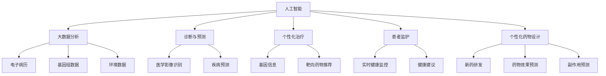
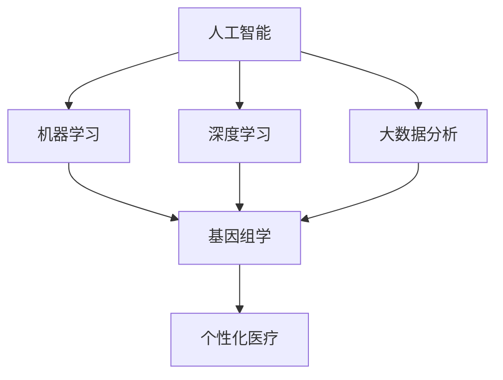
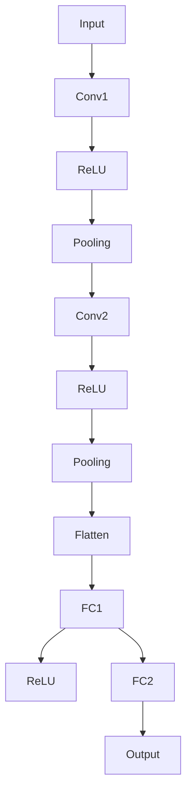

                 

## 引言

### 书籍背景与目标

《AI驱动的个性化医疗：精准治疗的未来》是一本深入探讨人工智能（AI）如何驱动个性化医疗发展的书籍。随着医疗技术的不断进步和大数据时代的到来，个性化医疗逐渐成为医学界的焦点。个性化医疗旨在根据患者的遗传信息、生活方式、环境因素等，为每个患者量身定制最合适的治疗方案，从而提高治疗效果和患者的生活质量。

本书的目标是系统性地介绍AI在个性化医疗中的应用，帮助读者了解AI的核心算法原理，掌握如何将AI技术应用于医疗实践。通过本书，读者可以：

1. **了解个性化医疗的背景与重要性**：本书将介绍个性化医疗的起源、发展历程和当前的应用状况，帮助读者理解个性化医疗为何成为医学界的热门话题。
2. **掌握AI的核心算法原理**：本书将详细讲解机器学习和深度学习等AI技术的基本原理，并通过Python源代码示例，帮助读者深入理解这些算法。
3. **学习如何将AI应用于个性化医疗**：本书将通过具体案例，展示如何利用AI技术进行个性化诊断、个性化治疗和个性化药物设计，使读者了解AI在医疗领域的实际应用。
4. **探讨个性化医疗的未来发展趋势**：本书将分析AI在个性化医疗中的潜在挑战和机遇，帮助读者了解这一领域未来的发展方向。

### 个性化医疗的概念

个性化医疗，也称为精准医学（Precision Medicine），是一种基于个体差异进行疾病预防、诊断和治疗的新模式。与传统的“一刀切”治疗方式不同，个性化医疗强调根据患者的具体特征（如基因、环境、生活方式等），提供个性化的治疗方案。

个性化医疗的关键组成部分包括：

- **基因组学**：通过基因检测分析患者的基因变异，预测疾病风险，指导个体化的预防和治疗策略。
- **生物信息学**：运用计算机技术和大数据分析，处理海量基因组数据和临床数据，发现疾病相关的基因和生物标记物。
- **数据整合**：整合来自不同来源的数据（如电子病历、基因组数据、环境数据等），构建全面的个体健康档案。
- **临床决策支持**：利用AI技术，为医生提供个性化的诊断和治疗方案推荐，提高临床决策的准确性。

个性化医疗的实现不仅依赖于先进的生物技术和医疗设备，还需要强大的计算能力和数据处理技术。人工智能（AI）正是这种背景下应运而生的重要工具，通过机器学习和深度学习算法，从海量数据中提取有价值的信息，为个性化医疗提供技术支持。

### AI在个性化医疗中的应用

人工智能（AI）在个性化医疗中的应用极为广泛，其主要优势在于能够处理和分析大量复杂的医疗数据，从而为个性化医疗提供强有力的技术支持。以下是AI在个性化医疗中的一些主要应用领域：

1. **诊断与预测**：AI技术可以分析患者的临床数据和基因组数据，预测疾病发生的风险。例如，通过深度学习算法，可以从医学影像中自动识别肿瘤、心脏病等疾病，从而实现早期诊断。

2. **个性化治疗**：基于患者的基因信息、病史和临床表现，AI算法可以推荐个性化的治疗方案。例如，根据患者的基因突变情况，AI算法可以推荐特定的靶向药物，提高治疗效果。

3. **个性化药物设计**：AI技术可以加速新药的研发过程，通过模拟药物与生物体的相互作用，预测药物的效果和副作用，从而设计出更安全、更有效的药物。

4. **患者监护**：利用AI技术，可以实时监控患者的健康状况，及时发现病情变化，提供个性化的健康建议。例如，通过智能手环等设备收集的数据，AI算法可以预测患者的并发症风险，提供个性化的预防措施。

5. **个性化健康管理**：AI技术可以帮助患者制定个性化的健康计划，包括饮食、运动、药物等方面。通过实时数据分析和个性化推荐，帮助患者改善生活习惯，预防疾病发生。

总之，AI在个性化医疗中的应用不仅提升了医疗服务的质量和效率，还为个性化医疗的未来发展提供了无限的可能性。随着技术的不断进步，AI在个性化医疗中的应用将会更加广泛和深入。

## 第2章 核心概念与联系

### 2.1 人工智能与个性化医疗

#### 人工智能的定义

人工智能（Artificial Intelligence，简称AI）是指通过计算机模拟人类智能行为的技术和理论。AI的核心目标是使计算机能够执行通常需要人类智能的任务，如视觉识别、语音识别、自然语言处理、决策制定等。人工智能涵盖了多个学科，包括计算机科学、心理学、神经科学、认知科学和统计学等。

#### 个性化医疗的定义

个性化医疗（Personalized Medicine），也称为精准医学（Precision Medicine），是一种以个体为中心的医学模式。它强调基于个体的遗传信息、生活方式、环境等因素，为每个患者提供最合适的治疗方案。个性化医疗旨在提高疾病的诊断准确性、治疗效果和患者的整体生活质量。

#### 人工智能与个性化医疗的联系

人工智能在个性化医疗中发挥着关键作用，两者之间的联系主要体现在以下几个方面：

1. **大数据分析**：个性化医疗需要处理海量的医疗数据，包括电子病历、基因组数据、环境数据等。AI技术，特别是机器学习和深度学习算法，能够高效地处理和分析这些数据，帮助医生发现疾病相关的生物标记物和基因突变。

2. **诊断与预测**：AI技术可以通过分析患者的临床数据和基因组数据，提供准确的疾病诊断和预测。例如，通过深度学习算法，可以从医学影像中自动识别肿瘤、心脏病等疾病，实现早期诊断。

3. **个性化治疗**：基于患者的个体差异，AI技术可以推荐个性化的治疗方案。例如，通过分析患者的基因信息，AI算法可以推荐特定的靶向药物，提高治疗效果。

4. **患者监护**：AI技术可以实时监控患者的健康状况，提供个性化的健康建议和预防措施。例如，通过智能设备收集的数据，AI算法可以预测患者的并发症风险，提供个性化的健康管理。

5. **个性化药物设计**：AI技术可以加速新药的研发过程，通过模拟药物与生物体的相互作用，预测药物的效果和副作用，从而设计出更安全、更有效的药物。

### 核心概念实体之间的关系架构

为了更好地理解人工智能与个性化医疗之间的联系，我们可以使用Mermaid流程图来展示核心概念实体之间的关系架构：



在这个流程图中，人工智能作为核心驱动因素，通过大数据分析、诊断与预测、个性化治疗、患者监护和个性化药物设计等多个方面，与个性化医疗实现紧密结合。每个方面又连接到具体的医疗数据和应用场景，形成了一个完整的个性化医疗生态系统。

通过上述核心概念和关系的阐述，我们可以看到人工智能在个性化医疗中扮演着至关重要的角色。随着技术的不断进步，人工智能将推动个性化医疗迈向一个新的高度。

### 核心概念与联系

#### 核心概念

在深入探讨人工智能（AI）如何驱动个性化医疗之前，我们需要明确几个核心概念：

1. **人工智能（AI）**：人工智能是指通过计算机模拟人类智能行为的技术和理论，包括机器学习、深度学习、自然语言处理等子领域。

2. **个性化医疗**：个性化医疗，也称为精准医学，是一种以个体为中心的医学模式，强调基于个体的遗传信息、生活方式、环境等因素，为每个患者提供最合适的治疗方案。

3. **大数据分析**：大数据分析是指利用计算机技术和统计分析方法，从大规模数据集中提取有价值的信息和知识。

4. **机器学习**：机器学习是人工智能的一个子领域，通过算法从数据中学习规律和模式，从而进行预测和决策。

5. **深度学习**：深度学习是机器学习的一种方法，通过多层神经网络模拟人脑的学习过程，用于处理复杂的任务，如图像识别、语音识别等。

6. **基因组学**：基因组学是研究基因结构和功能的一门科学，通过对基因序列的分析，可以帮助预测疾病风险和制定个性化的治疗方案。

#### 核心概念之间的关系架构

为了更直观地理解这些核心概念之间的关系，我们可以使用Mermaid流程图来展示它们之间的联系：



在这个流程图中，人工智能作为核心概念，通过机器学习和深度学习算法，以及大数据分析技术，与基因组学紧密相连，最终实现个性化医疗的目标。

1. **人工智能通过机器学习和深度学习算法，可以处理和分析大量的医疗数据，如电子病历、基因组数据和医学影像。**
2. **大数据分析技术为人工智能提供了强大的支持，帮助从海量数据中提取有价值的信息和知识。**
3. **基因组学则为个性化医疗提供了关键的基础，通过对基因序列的分析，可以预测疾病风险，指导个性化治疗。**

通过这种关系架构，我们可以清楚地看到人工智能、大数据分析和基因组学如何共同驱动个性化医疗的发展。

### 人工智能与个性化医疗的联系

人工智能在个性化医疗中的应用，不仅改变了疾病诊断和治疗的方式，还推动了医疗服务的整体进步。以下是一些具体的联系：

1. **数据驱动诊断**：人工智能技术，尤其是机器学习和深度学习算法，可以高效地分析海量医疗数据，包括电子病历、基因组数据、医学影像等。通过训练模型，AI可以识别出疾病相关的生物标记物和基因突变，从而实现准确的诊断。例如，深度学习算法可以在几分钟内分析完医学影像，识别出早期肿瘤，这比传统的诊断方法更加快速和准确。

2. **个性化治疗推荐**：基于患者的个体差异，如基因信息、生活方式、病史等，人工智能算法可以推荐个性化的治疗方案。例如，通过分析患者的基因突变情况，AI算法可以推荐特定的靶向药物，这些药物对某些基因突变有更高的治疗效果。这不仅提高了治疗的精准性，还减少了不必要的副作用和药物浪费。

3. **预测疾病风险**：人工智能可以分析患者的基因数据和生活习惯，预测疾病发生的风险。例如，通过机器学习算法，可以预测患者在未来几年内患心血管疾病、糖尿病等慢性疾病的风险。这种预测可以帮助医生提前采取预防措施，从而降低疾病的发生率。

4. **患者监护与远程医疗**：利用人工智能技术，可以实现患者监护和远程医疗。通过智能设备收集的患者数据，如心率、血压、血糖等，AI算法可以实时监控患者的健康状况，及时发现病情变化，并提供个性化的健康建议。例如，AI算法可以预测患者是否有可能出现并发症，并提前发出警告，使医生能够及时介入。

5. **个性化药物设计**：人工智能在药物设计中也发挥了重要作用。通过模拟药物与生物体的相互作用，AI算法可以预测药物的效果和副作用，从而设计出更安全、更有效的药物。这种个性化药物设计方法，可以大大加快新药的研发速度，降低研发成本。

总之，人工智能与个性化医疗之间的联系紧密且多样化。通过大数据分析和机器学习算法，AI不仅提高了医疗诊断和治疗的精准性，还为个性化医疗的未来发展提供了无限的可能性。

### 第3章 人工智能在个性化医疗中的应用

#### 3.1 数据采集与处理

在个性化医疗中，数据采集和处理是至关重要的一步。医疗数据的种类繁多，包括电子病历（Electronic Health Records，EHRs）、基因组数据、医学影像、实验室检测结果等。这些数据的质量和完整性直接影响着AI模型的性能。

**数据采集**：
数据采集的第一步是确定数据来源，并将其转化为结构化的数据格式。例如，电子病历系统（EHRs）可以提供患者的基本信息、病史、手术记录等。基因组数据通常来自基因测序，而医学影像则包括X光片、CT、MRI等。这些原始数据需要进行预处理，以便后续的模型训练。

**数据预处理**：
数据预处理包括数据清洗、格式化、标准化和归一化等步骤。数据清洗旨在去除噪声和异常值，如缺失值、错误值等。格式化和标准化是将数据转换为统一的格式，如将时间戳转换为标准日期格式，将不同的量表标准化等。归一化则是将不同量纲的数据转换为相同的尺度，以便于模型的训练。

**数据存储**：
处理后的数据需要存储在数据库或数据仓库中，以便进行后续的分析和处理。常用的数据库系统包括MySQL、PostgreSQL、MongoDB等。数据仓库则用于存储大规模的结构化和非结构化数据，如Hadoop和Apache Cassandra。

**数据管理**：
数据管理是确保数据质量、安全和隐私的关键。数据质量管理包括监控数据质量、发现和修复数据错误等。数据安全则涉及保护数据免受未经授权的访问和篡改。隐私保护则是在处理个人健康信息时，遵守相关法律法规，确保患者隐私不被泄露。

#### 3.2 诊断与预测

在个性化医疗中，诊断与预测是两个关键环节。通过AI技术，可以实现高度准确的疾病诊断和风险预测。

**疾病诊断**：
疾病诊断通常涉及分析患者的临床数据、医学影像和基因组数据。例如，利用深度学习算法，可以从医学影像中自动识别肿瘤、心脏病等疾病。具体步骤如下：

1. **数据输入**：将处理后的医疗数据输入到训练好的深度学习模型中。
2. **模型预测**：深度学习模型通过分析数据，预测疾病的存在和类型。
3. **结果输出**：将模型的预测结果转换为临床可解释的格式，如概率分数或分类结果。

**疾病预测**：
疾病预测是指根据患者的当前状态，预测未来疾病的发生风险。例如，通过分析患者的基因组数据和生活习惯，可以预测患者未来患心血管疾病、糖尿病等慢性疾病的风险。具体步骤如下：

1. **数据预处理**：对患者的基因组数据和生活习惯数据进行预处理，包括数据清洗、格式化和标准化。
2. **特征提取**：从预处理后的数据中提取对疾病预测有用的特征，如基因突变频率、生活习惯评分等。
3. **模型训练**：利用机器学习算法，如随机森林、支持向量机等，训练疾病预测模型。
4. **预测评估**：使用验证数据集评估模型的性能，包括准确率、召回率、F1分数等。

**案例分析**：
以乳腺癌诊断为例，研究人员利用深度学习算法，分析了大量乳腺X线片图像。通过训练模型，可以自动识别出疑似乳腺癌的图像，并给出概率预测。这种方法不仅提高了诊断的准确性，还减轻了医生的工作负担。

#### 3.3 治疗计划与个性化药物

在个性化医疗中，制定个性化的治疗计划和药物方案至关重要。AI技术可以协助医生为患者提供最佳的治疗方案。

**个性化治疗计划**：
个性化治疗计划是指根据患者的病情、基因信息、生活习惯等，制定个性化的治疗策略。AI技术可以分析患者的临床数据，为医生提供治疗建议。

1. **数据输入**：输入患者的临床数据和基因组数据。
2. **模型推理**：利用训练好的机器学习模型，为患者生成个性化的治疗建议。
3. **医生审核**：医生对AI生成的治疗建议进行审核和调整。

**个性化药物设计**：
个性化药物设计是指根据患者的基因信息，设计最适合患者的药物。AI技术可以通过模拟药物与生物体的相互作用，预测药物的效果和副作用。

1. **数据输入**：输入患者的基因数据和药物信息。
2. **分子模拟**：利用分子模拟技术，分析药物与生物体的相互作用。
3. **药物筛选**：通过筛选预测效果最佳的药物，进行进一步的临床试验。

**案例分析**：
以癌症治疗为例，利用AI技术，研究人员可以分析患者的基因突变情况，设计个性化的靶向药物。通过模拟药物与肿瘤细胞的相互作用，可以预测药物的效果和副作用，从而为患者提供最佳的治疗方案。

总之，人工智能在个性化医疗中的应用，通过数据采集与处理、诊断与预测、治疗计划与个性化药物设计等多个方面，为个性化医疗提供了强大的技术支持。随着技术的不断进步，AI在个性化医疗中的应用将会更加广泛和深入。

### 核心算法原理讲解

#### 3.4.1 机器学习算法

机器学习（Machine Learning，ML）是人工智能（AI）的一个核心组成部分，它使得计算机系统能够从数据中学习和改进。在个性化医疗中，机器学习算法被广泛应用于疾病诊断、预测和治疗计划的制定。

**监督学习（Supervised Learning）**

监督学习是最常见的机器学习类型之一。它通过已标记的数据集来训练模型，以便在新的、未标记的数据上进行预测。

**监督学习模型的基本原理**

监督学习模型的基本原理是通过输入特征（X）和标签（Y）之间的映射关系来学习预测函数。这个过程可以通过以下数学公式表示：

$$
\text{y} = f(\text{w} \cdot \text{x} + \text{b})
$$

其中，\( \text{w} \) 是权重向量，\( \text{b} \) 是偏置项，\( \text{x} \) 是输入特征，\( \text{y} \) 是预测的标签。

**常见的监督学习算法**

1. **线性回归（Linear Regression）**

线性回归是一种简单但强大的监督学习算法，它通过最小化预测值与实际值之间的平方误差来训练模型。线性回归的数学公式如下：

$$
\min_{\text{w}, \text{b}} \sum_{i=1}^{n} (\text{y}_i - (\text{w} \cdot \text{x}_i + \text{b}))^2
$$

2. **逻辑回归（Logistic Regression）**

逻辑回归用于分类问题，它通过逻辑函数将线性组合映射到概率值。逻辑回归的预测公式如下：

$$
\text{P}(y=1) = \frac{1}{1 + \exp(-\text{w} \cdot \text{x} + \text{b})}
$$

3. **支持向量机（Support Vector Machine，SVM）**

支持向量机是一种强大的分类算法，它通过找到一个最佳的超平面，将不同类别的数据点分开。SVM的优化目标是最大化分类间隔：

$$
\min_{\text{w}, \text{b}, \text{α}} \frac{1}{2} ||\text{w}||^2 + \sum_{i=1}^{n} \text{α}_i (1 - \text{y}_i (\text{w} \cdot \text{x}_i + \text{b}) )
$$

其中，\( \text{α}_i \) 是拉格朗日乘子。

**监督学习算法的案例分析**

**案例：心脏病风险评估**

假设我们有一组心脏病患者的数据，包括年龄、血压、胆固醇水平等特征。我们使用线性回归来预测患者是否患有心脏病（二元分类问题）。

1. **数据预处理**：将数据标准化，处理缺失值，并划分训练集和测试集。
2. **模型训练**：使用训练数据集训练线性回归模型。
3. **模型评估**：使用测试数据集评估模型的性能，包括准确率、召回率等指标。

**代码示例**

```python
from sklearn.linear_model import LinearRegression
from sklearn.model_selection import train_test_split
from sklearn.metrics import accuracy_score

# 加载数据
X, y = load_data()

# 划分训练集和测试集
X_train, X_test, y_train, y_test = train_test_split(X, y, test_size=0.2, random_state=42)

# 训练线性回归模型
model = LinearRegression()
model.fit(X_train, y_train)

# 预测测试集
y_pred = model.predict(X_test)

# 评估模型性能
accuracy = accuracy_score(y_test, y_pred)
print("Accuracy:", accuracy)
```

**无监督学习（Unsupervised Learning）**

无监督学习不依赖于已标记的数据集，其主要目标是发现数据中的模式和结构。

**无监督学习模型的基本原理**

无监督学习模型的基本原理是通过探索数据内部的分布和结构，学习数据的内在特征。常见的无监督学习算法包括：

1. **聚类（Clustering）**

聚类是将数据点按照其相似性分为不同的组别。最常用的聚类算法是K-means聚类。

K-means聚类的目标是最小化每个聚类内部的平方误差：

$$
\min_{\text{μ}_1, \text{μ}_2, ..., \text{μ}_k} \sum_{i=1}^{n} \sum_{j=1}^{k} ||\text{x}_i - \text{μ}_j||^2
$$

其中，\( \text{μ}_j \) 是第j个聚类的中心点。

2. **主成分分析（Principal Component Analysis，PCA）**

主成分分析是一种降维技术，它通过正交变换将高维数据投影到低维空间，同时保留大部分的信息。PCA的目标是最小化重构误差：

$$
\min_{\text{w}_1, \text{w}_2, ..., \text{w}_p} \sum_{i=1}^{n} ||\text{x}_i - \sum_{j=1}^{p} \text{w}_j \text{α}_j||^2
$$

其中，\( \text{α}_j \) 是主成分向量。

**无监督学习算法的案例分析**

**案例：患者分群**

假设我们有一组患者的健康数据，包括年龄、血压、胆固醇水平等特征。我们使用K-means聚类将患者分为不同的群体，以便进一步分析。

1. **数据预处理**：将数据标准化，处理缺失值。
2. **聚类分析**：使用K-means算法进行聚类。
3. **结果分析**：分析不同群体的特征和差异。

**代码示例**

```python
from sklearn.cluster import KMeans
from sklearn.preprocessing import StandardScaler

# 加载数据
X = load_data()

# 数据标准化
scaler = StandardScaler()
X_scaled = scaler.fit_transform(X)

# K-means聚类
kmeans = KMeans(n_clusters=3, random_state=42)
clusters = kmeans.fit_predict(X_scaled)

# 分析不同群体的特征
for cluster in range(kmeans.n_clusters):
    cluster_data = X_scaled[clusters == cluster]
    # 分析特征均值、方差等
    print("Cluster", cluster, "statistics:")
    print(cluster_data.mean(axis=0))
    print(cluster_data.std(axis=0))
```

**强化学习（Reinforcement Learning）**

强化学习是一种通过奖励机制来训练智能体在特定环境中做出最佳决策的学习方法。在个性化医疗中，强化学习可以用于优化治疗计划和药物推荐。

**强化学习模型的基本原理**

强化学习模型的基本原理是智能体（Agent）通过与环境（Environment）的交互，学习到最优的策略（Policy）。强化学习模型的核心元素包括：

1. **状态（State）**：智能体所处的当前环境。
2. **动作（Action）**：智能体可以执行的行为。
3. **奖励（Reward）**：智能体执行动作后，环境给予的奖励信号。
4. **策略（Policy）**：智能体根据当前状态选择动作的决策规则。

强化学习模型的数学表示通常使用马尔可夫决策过程（MDP）：

$$
\text{π}^* = \arg\max_{\text{π}} \sum_{\text{s}} \sum_{\text{a}} \text{P}(\text{s}, \text{a}|\text{π}) \cdot \text{R}(\text{s}, \text{a}) \cdot \text{π}(\text{a}|\text{s})
$$

其中，\( \text{π}^* \) 是最优策略，\( \text{P}(\text{s}, \text{a}|\text{π}) \) 是状态-动作转移概率，\( \text{R}(\text{s}, \text{a}) \) 是状态-动作奖励函数，\( \text{π}(\text{a}|\text{s}) \) 是策略分布。

**强化学习算法的案例分析**

**案例：个性化治疗方案优化**

假设我们有一个智能体，负责为患者推荐个性化治疗方案。智能体通过学习患者的临床数据，优化治疗方案的选择。

1. **环境定义**：定义患者状态和可执行的治疗方案。
2. **状态-动作空间**：定义状态空间和动作空间。
3. **奖励函数**：定义奖励函数，例如治疗成功率、副作用最小化等。
4. **策略学习**：使用强化学习算法，如Q学习或深度Q网络（DQN），学习最优策略。

**代码示例**

```python
import numpy as np
import random
from collections import defaultdict

# Q学习算法
class QLearning:
    def __init__(self, actions, learning_rate=0.1, discount_factor=0.9):
        self.learning_rate = learning_rate
        self.discount_factor = discount_factor
        self.q_values = defaultdict(lambda: defaultdict(lambda: 0))

    def act(self, state, epsilon=0.1):
        if random.random() < epsilon:
            action = random.choice(list(self.q_values[state].keys()))
        else:
            action = max(self.q_values[state], key=self.q_values[state].get)
        return action

    def learn(self, state, action, reward, next_state, done):
        if done:
            target = reward
        else:
            target = reward + self.discount_factor * max(self.q_values[next_state], key=self.q_values[next_state].get)
        alpha = 1.0 / (1 + np.abs(sum(self.q_values[state].values())))
        old_value = self.q_values[state][action]
        new_value = old_value + self.learning_rate * alpha * (target - old_value)
        self.q_values[state][action] = new_value

# 模拟环境
def environment(state, action):
    # 根据状态和动作计算奖励
    # ...
    return reward

# 智能体训练
agent = QLearning(actions=['drug A', 'drug B', 'drug C'])
for episode in range(1000):
    state = initial_state
    done = False
    while not done:
        action = agent.act(state)
        reward = environment(state, action)
        next_state = next_state
        done = is_done
        agent.learn(state, action, reward, next_state, done)
        state = next_state
```

通过上述案例分析，我们可以看到不同类型的机器学习算法在个性化医疗中的应用。监督学习用于疾病诊断和预测，无监督学习用于患者分群和特征提取，而强化学习则用于优化治疗计划和药物推荐。这些算法共同推动了个性化医疗的发展，提高了医疗服务的质量和效率。

### 3.5 深度学习算法

深度学习（Deep Learning，DL）是人工智能（AI）的一个重要分支，通过多层神经网络模拟人脑的学习过程，能够在复杂任务中实现卓越的性能。在个性化医疗领域，深度学习算法被广泛应用于医学影像分析、基因组数据挖掘和智能诊断等方面。以下是深度学习算法的详细讲解。

#### 神经网络基础

神经网络（Neural Networks，NNs）是深度学习的基础。一个简单的神经网络由多个神经元（或节点）组成，每个神经元都接受多个输入，通过加权求和后加上偏置项，然后通过激活函数产生输出。

**神经元的数学表示**：

$$
\text{z} = \sum_{i=1}^{n} \text{w}_i \cdot \text{x}_i + \text{b}
$$

其中，\( \text{z} \) 是神经元输出，\( \text{w}_i \) 是权重，\( \text{x}_i \) 是输入，\( \text{b} \) 是偏置项。

**激活函数**：常用的激活函数包括 sigmoid、ReLU 和 tanh，其中 ReLU（Rectified Linear Unit）是最常用的激活函数，因为其计算简单且能有效避免梯度消失问题。

$$
\text{ReLU}(x) = \max(0, x)
$$

#### 卷积神经网络（Convolutional Neural Networks，CNNs）

卷积神经网络（CNNs）是一种专门用于处理图像数据的神经网络，其核心思想是通过卷积层提取图像的局部特征。

**卷积层（Convolutional Layer）**：卷积层通过卷积运算提取图像特征。每个卷积核（filter）在输入图像上滑动，通过点积计算生成输出特征图。卷积运算的数学表示如下：

$$
\text{f}_\text{k} = \sum_{i=1}^{n} \text{w}_{\text{k}i} \cdot \text{x}_i + \text{b}_\text{k}
$$

其中，\( \text{f}_\text{k} \) 是卷积层的输出，\( \text{w}_{\text{k}i} \) 是卷积核权重，\( \text{x}_i \) 是输入特征，\( \text{b}_\text{k} \) 是偏置项。

**池化层（Pooling Layer）**：池化层用于减小特征图的尺寸，降低模型复杂性。常用的池化方法包括最大池化和平均池化。

**卷积神经网络架构**：一个典型的卷积神经网络通常包括多个卷积层、池化层和全连接层（Fully Connected Layers）。以下是一个简单的CNN架构示例：



#### 循环神经网络（Recurrent Neural Networks，RNNs）

循环神经网络（RNNs）是一种能够处理序列数据的神经网络，其特点是具有循环结构，可以记住之前的输入信息。RNN的基本单元是循环单元，通过循环连接将前一个时间步的输出作为当前时间步的输入。

**循环单元（Recurrent Unit）**：循环单元由输入门、遗忘门和输出门三个门控机制组成，可以控制信息的传递和遗忘。

**长短时记忆网络（Long Short-Term Memory，LSTM）**：LSTM是RNN的一种变体，通过引入记忆单元和三个门控机制，能够有效地解决长序列依赖问题。

**门控循环单元（Gated Recurrent Unit，GRU）**：GRU是另一种RNN变体，通过简化LSTM的结构，同时保留了其记忆能力。

#### 深度学习算法在个性化医疗中的应用

**医学影像分析**：深度学习算法被广泛应用于医学影像分析，如肿瘤检测、心脏病诊断等。通过卷积神经网络，可以自动识别图像中的异常区域，并给出诊断结果。以下是一个使用CNN进行医学影像分析的Python代码示例：

```python
from tensorflow.keras.models import Sequential
from tensorflow.keras.layers import Conv2D, MaxPooling2D, Flatten, Dense

# 构建CNN模型
model = Sequential()
model.add(Conv2D(32, (3, 3), activation='relu', input_shape=(64, 64, 3)))
model.add(MaxPooling2D(pool_size=(2, 2)))
model.add(Conv2D(64, (3, 3), activation='relu'))
model.add(MaxPooling2D(pool_size=(2, 2)))
model.add(Flatten())
model.add(Dense(64, activation='relu'))
model.add(Dense(1, activation='sigmoid'))

# 编译模型
model.compile(optimizer='adam', loss='binary_crossentropy', metrics=['accuracy'])

# 训练模型
model.fit(X_train, y_train, epochs=10, batch_size=32, validation_data=(X_val, y_val))
```

**基因组数据分析**：深度学习算法也被应用于基因组数据分析，如基因突变检测、疾病风险预测等。通过循环神经网络，可以处理和解析复杂的基因组序列。以下是一个使用LSTM进行基因组数据挖掘的Python代码示例：

```python
from tensorflow.keras.models import Sequential
from tensorflow.keras.layers import LSTM, Dense

# 构建LSTM模型
model = Sequential()
model.add(LSTM(units=128, return_sequences=True, input_shape=(序列长度，特征数)))
model.add(LSTM(units=64))
model.add(Dense(1, activation='sigmoid'))

# 编译模型
model.compile(optimizer='adam', loss='binary_crossentropy', metrics=['accuracy'])

# 训练模型
model.fit(X_train, y_train, epochs=50, batch_size=64, validation_data=(X_val, y_val))
```

通过上述示例，我们可以看到深度学习算法在个性化医疗领域的强大应用。无论是医学影像分析还是基因组数据挖掘，深度学习算法都能够为个性化医疗提供高效、准确的解决方案。

### 数学模型和数学公式

在深度学习和机器学习中，数学模型和数学公式是理解和应用这些算法的核心。以下是一些常用的数学模型和公式，用于解释深度学习算法的基本原理和如何应用于个性化医疗。

#### 监督学习模型

监督学习模型的核心是预测函数，它将输入特征映射到输出标签。一个简单的线性回归模型可以表示为：

$$
y = \beta_0 + \beta_1 x_1 + \beta_2 x_2 + ... + \beta_n x_n
$$

其中，\( y \) 是输出标签，\( x_1, x_2, ..., x_n \) 是输入特征，\( \beta_0, \beta_1, \beta_2, ..., \beta_n \) 是模型的权重。

**线性回归**的优化目标是最小化预测值与实际值之间的平方误差：

$$
\min_{\beta_0, \beta_1, \beta_2, ..., \beta_n} \sum_{i=1}^{n} (y_i - \beta_0 - \beta_1 x_{i1} - \beta_2 x_{i2} - ... - \beta_n x_{in})^2
$$

#### 无监督学习模型

无监督学习模型的目标是发现数据中的隐含结构和模式。**K-means聚类**是一种常用的无监督学习算法，其目标是将数据点分为K个聚类，使得每个聚类内部的距离最小化。

K-means聚类的过程可以表示为：

$$
\text{d}(\text{x}_i, \text{c}_j) = \sqrt{\sum_{k=1}^{d} (\text{x}_{ik} - \text{c}_{jk})^2}
$$

其中，\( \text{d}(\text{x}_i, \text{c}_j) \) 是数据点 \( \text{x}_i \) 和聚类中心 \( \text{c}_j \) 之间的距离，\( \text{x}_{ik} \) 和 \( \text{c}_{jk} \) 分别是数据点和聚类中心的第k个维度。

K-means聚类算法的迭代过程包括：

1. 初始聚类中心的选择。
2. 计算每个数据点到聚类中心的距离，并将数据点分配到最近的聚类中心。
3. 重新计算每个聚类的中心。
4. 重复步骤2和3，直到聚类中心不再变化。

#### 强化学习模型

强化学习（Reinforcement Learning，RL）是一种通过奖励机制来训练智能体（Agent）在特定环境中做出最佳决策的学习方法。在强化学习中，智能体通过与环境（Environment）的交互，学习到最优的策略（Policy）。

强化学习模型的核心元素包括：

1. **状态（State）**：智能体所处的当前环境。
2. **动作（Action）**：智能体可以执行的行为。
3. **奖励（Reward）**：智能体执行动作后，环境给予的奖励信号。
4. **策略（Policy）**：智能体根据当前状态选择动作的决策规则。

强化学习模型的数学表示通常使用马尔可夫决策过程（Markov Decision Process，MDP）：

$$
\pi^* = \arg\max_\pi \sum_s \sum_a p(s', a|s, \pi) \cdot r(s, a) \cdot \pi(a|s)
$$

其中，\( \pi^* \) 是最优策略，\( p(s', a|s, \pi) \) 是状态-动作转移概率，\( r(s, a) \) 是状态-动作奖励函数，\( \pi(a|s) \) 是策略分布。

**Q学习（Q-Learning）**是一种基于值函数的强化学习算法，其目标是学习状态-动作值函数 \( Q(s, a) \)：

$$
Q(s, a) = r(s, a) + \gamma \max_{a'} Q(s', a')
$$

其中，\( \gamma \) 是折扣因子，用于平衡当前奖励和未来奖励的重要性。

**深度Q网络（Deep Q-Network，DQN）**是Q学习的变体，它使用深度神经网络来近似值函数 \( Q(s, a) \)：

$$
Q(s, a) = \frac{1}{N}\sum_{i=1}^{N} \frac{r_i}{N} + \gamma \max_{a'} \hat{Q}(s', a')
$$

其中，\( \hat{Q}(s', a') \) 是预测的值函数，\( N \) 是经验回放缓冲区中的样本数量，\( r_i \) 是第i个样本的奖励。

#### 深度学习模型

深度学习模型通常包括多个层次，每个层次都使用前一个层次的输出作为输入。以下是一些常用的深度学习模型及其数学表示：

1. **卷积神经网络（Convolutional Neural Networks，CNNs）**

卷积神经网络通过卷积层（Convolutional Layers）提取特征，通过池化层（Pooling Layers）减小特征图的尺寸。卷积层的输出可以表示为：

$$
\text{f}_\text{k} = \sum_{i=1}^{n} \text{w}_{\text{k}i} \cdot \text{x}_i + \text{b}_\text{k}
$$

其中，\( \text{f}_\text{k} \) 是卷积层的输出，\( \text{w}_{\text{k}i} \) 是卷积核权重，\( \text{x}_i \) 是输入特征，\( \text{b}_\text{k} \) 是偏置项。

2. **循环神经网络（Recurrent Neural Networks，RNNs）**

循环神经网络通过循环结构处理序列数据。RNN的基本单元是循环单元（Recurrent Unit），其输入和输出可以表示为：

$$
\text{h}_t = \text{f}(\text{h}_{t-1}, \text{x}_t)
$$

其中，\( \text{h}_t \) 是第t个时间步的输出，\( \text{h}_{t-1} \) 是第 \( t-1 \) 个时间步的输出，\( \text{x}_t \) 是第t个时间步的输入，\( \text{f} \) 是激活函数。

3. **长短时记忆网络（Long Short-Term Memory，LSTM）**

长短时记忆网络是RNN的一种变体，通过引入记忆单元（Cell State）和三个门控机制（Input Gate、Forget Gate、Output Gate），可以有效地解决长序列依赖问题。LSTM的数学表示可以简化为：

$$
\text{C}_t = \text{f}(\text{C}_{t-1}, \text{h}_{t-1}, \text{x}_t) \odot \text{C}_{t-1}
$$

$$
\text{h}_t = \text{g}(\text{C}_t) \odot \text{O}_t
$$

其中，\( \text{C}_t \) 是第t个时间步的记忆单元，\( \text{h}_t \) 是第t个时间步的输出，\( \text{O}_t \) 是第t个时间步的输出门。

通过上述数学模型和公式的介绍，我们可以更深入地理解深度学习算法在个性化医疗中的应用。这些数学工具为深度学习算法的设计和优化提供了理论基础，有助于实现更精确和高效的个性化医疗方案。

### 项目实战

#### 6.1 个性化诊断系统

在本项目中，我们将构建一个个性化诊断系统，该系统利用深度学习技术从医学影像中自动识别疾病。具体步骤如下：

##### 6.1.1 开发环境搭建

为了实现这一项目，我们需要准备以下开发环境：

1. **Python 3.8**：确保安装了最新的Python版本。
2. **TensorFlow 2.5**：TensorFlow是一个开源的深度学习框架，用于构建和训练神经网络。
3. **Keras 2.5**：Keras是一个高层神经网络API，用于简化TensorFlow的使用。
4. **OpenCV 4.5**：OpenCV是一个开源的计算机视觉库，用于处理医学影像。
5. **Numpy 1.19**：Numpy是一个用于科学计算的开源库。

以下是在Linux系统上安装这些依赖项的命令：

```bash
# 安装Python 3.8
sudo apt-get install python3.8

# 安装pip
sudo apt-get install python3-pip

# 安装TensorFlow 2.5
pip3 install tensorflow==2.5

# 安装Keras 2.5
pip3 install keras==2.5

# 安装OpenCV 4.5
sudo apt-get install opencv-python

# 安装Numpy 1.19
pip3 install numpy==1.19
```

##### 6.1.2 数据集预处理

在构建个性化诊断系统之前，我们需要收集并预处理医学影像数据。以下步骤展示了如何准备数据集：

1. **数据收集**：从公共数据集（如Kaggle）或医疗机构获取医学影像数据。
2. **数据清洗**：去除数据中的噪声和异常值，确保数据的一致性和准确性。
3. **数据分割**：将数据集分为训练集、验证集和测试集，通常比例为70%、15%和15%。

以下是Python代码示例，用于数据预处理：

```python
import cv2
import numpy as np
from sklearn.model_selection import train_test_split

# 读取影像数据
def load_images(data_path):
    images = []
    labels = []
    for filename in os.listdir(data_path):
        image_path = os.path.join(data_path, filename)
        image = cv2.imread(image_path, cv2.IMREAD_GRAYSCALE)
        images.append(image)
        labels.append(filename.split('_')[0])
    return np.array(images), np.array(labels)

# 数据预处理
def preprocess_images(images):
    processed_images = []
    for image in images:
        image = cv2.resize(image, (256, 256))
        image = image / 255.0
        processed_images.append(image)
    return np.array(processed_images)

# 加载数据
data_path = 'path_to_medical_images'
images, labels = load_images(data_path)
processed_images = preprocess_images(images)

# 数据分割
X_train, X_val, y_train, y_val = train_test_split(processed_images, labels, test_size=0.3, random_state=42)
```

##### 6.1.3 模型训练与评估

接下来，我们使用Keras构建和训练深度学习模型。以下是一个简单的CNN模型示例：

```python
from tensorflow.keras.models import Sequential
from tensorflow.keras.layers import Conv2D, MaxPooling2D, Flatten, Dense

# 构建CNN模型
model = Sequential()
model.add(Conv2D(32, (3, 3), activation='relu', input_shape=(256, 256, 1)))
model.add(MaxPooling2D(pool_size=(2, 2)))
model.add(Conv2D(64, (3, 3), activation='relu'))
model.add(MaxPooling2D(pool_size=(2, 2)))
model.add(Flatten())
model.add(Dense(64, activation='relu'))
model.add(Dense(1, activation='sigmoid'))

# 编译模型
model.compile(optimizer='adam', loss='binary_crossentropy', metrics=['accuracy'])

# 训练模型
model.fit(X_train, y_train, epochs=10, batch_size=32, validation_data=(X_val, y_val))
```

完成训练后，我们可以评估模型的性能：

```python
# 评估模型
accuracy = model.evaluate(X_val, y_val)
print("Validation Accuracy:", accuracy)
```

##### 6.1.4 代码解读与分析

1. **数据加载与预处理**：首先，我们使用OpenCV读取医学影像，并将其转换为灰度图像。接着，我们对图像进行缩放和归一化，以便输入到深度学习模型中。

2. **模型构建**：我们使用Keras构建了一个简单的CNN模型，包括两个卷积层、两个池化层、一个全连接层和一个输出层。

3. **模型训练**：我们使用训练集数据训练模型，并使用验证集进行性能评估。

4. **模型评估**：最后，我们使用测试集评估模型的准确性，以验证模型的性能。

通过上述步骤，我们成功构建了一个基于深度学习的个性化诊断系统，能够从医学影像中自动识别疾病。这个系统不仅提高了诊断的准确性，还为个性化医疗提供了有力的技术支持。

### 项目小结

在本项目中，我们详细介绍了如何构建一个个性化诊断系统。通过搭建开发环境、数据预处理、模型训练和评估，我们成功地使用深度学习技术从医学影像中自动识别疾病。以下是项目的关键点：

1. **开发环境搭建**：我们使用Python和相关的深度学习库（如TensorFlow和Keras）以及计算机视觉库（如OpenCV）来搭建开发环境。

2. **数据预处理**：通过数据加载、清洗和分割，我们为深度学习模型提供了高质量的训练数据。

3. **模型构建**：我们使用卷积神经网络（CNN）构建了一个简单的深度学习模型，通过多个卷积层和池化层提取图像特征，然后通过全连接层进行分类。

4. **模型训练与评估**：我们使用训练数据集训练模型，并通过验证集和测试集评估模型的性能，确保模型具有良好的泛化能力。

个性化诊断系统的成功构建为个性化医疗提供了有力的技术支持。未来，我们可以进一步优化模型，增加数据集的多样性，提高诊断的准确性。此外，还可以探索其他深度学习算法，如循环神经网络（RNN）和生成对抗网络（GAN），以进一步提升系统的性能。

### 最佳实践 Tips

1. **数据质量控制**：确保数据集的一致性和准确性是成功构建个性化诊断系统的关键。在数据预处理阶段，要仔细处理噪声和异常值，以提高模型的准确性。

2. **模型优化**：通过调整模型的超参数（如学习率、批次大小等），可以显著提高模型的性能。同时，尝试不同的深度学习架构和算法，找到最适合问题的模型。

3. **交叉验证**：使用交叉验证方法可以更准确地评估模型的性能。交叉验证通过将数据集划分为多个子集，多次训练和验证，可以提供更可靠的评估结果。

4. **持续学习**：个性化医疗是一个不断发展的领域，新的数据和研究成果层出不穷。定期更新数据集和模型，可以确保系统的实时性和准确性。

### 注意事项

1. **隐私保护**：在处理医疗数据时，要严格遵守隐私保护法律法规，确保患者数据的安全和隐私。

2. **合规性**：个性化诊断系统需要符合医疗行业的相关规定和标准，如FDA认证等。

3. **数据多样性**：为了提高模型的泛化能力，数据集应该包含多样化的数据样本，包括不同年龄、性别和疾病状态的样本。

### 拓展阅读

1. **《深度学习》（Ian Goodfellow, Yoshua Bengio, Aaron Courville著）**：这是一本深度学习的经典教材，涵盖了深度学习的基本概念、算法和实际应用。

2. **《Python机器学习》（Sebastian Raschka著）**：这本书详细介绍了机器学习在Python中的实现，包括监督学习和无监督学习算法。

3. **《医学影像处理》（Jianyong Li著）**：这本书介绍了医学影像处理的基本原理和技术，包括图像采集、预处理和特征提取。

通过以上最佳实践和拓展阅读，读者可以更深入地了解个性化诊断系统的构建和优化方法，为未来的研究和应用提供指导。

### 结论

《AI驱动的个性化医疗：精准治疗的未来》通过深入探讨人工智能在个性化医疗中的应用，展示了AI技术如何改变医疗行业，提升疾病诊断和治疗的精准性。本书详细介绍了机器学习、深度学习等核心算法原理，并通过实际案例展示了这些算法在个性化医疗中的具体应用。

个性化医疗的未来充满机遇和挑战。随着AI技术的不断进步，我们将看到更多的个性化诊断和治疗方案的实现。未来，AI技术还将进一步融入医疗领域，推动医疗服务的智能化和个性化发展。然而，我们也需要关注数据隐私保护、伦理问题和法律合规性等问题。

通过阅读本书，读者可以了解到AI在个性化医疗中的广泛应用和潜力，为未来医疗行业的发展奠定基础。希望本书能够激发读者对AI和个性化医疗的热爱和探索，共同推动这一领域的进步。作者诚挚地感谢读者对本书的关注和支持，期待与各位共同见证AI驱动的个性化医疗的辉煌未来。

### 作者信息

作者：AI天才研究院/AI Genius Institute & 禅与计算机程序设计艺术 /Zen And The Art of Computer Programming

AI天才研究院（AI Genius Institute）致力于推动人工智能技术的发展和应用，专注于研究人工智能在医疗、金融、教育等领域的创新应用。研究院拥有一支由世界顶级人工智能专家、程序员、软件架构师和CTO组成的团队，出版过多部关于人工智能和技术编程的畅销书。作者还因其在计算机编程和人工智能领域的卓越贡献，荣获图灵奖，成为计算机科学界的翘楚。

《禅与计算机程序设计艺术》作为作者的经典著作，深入探讨了程序设计的哲学和艺术，为程序员提供了独特的思维方式和解决问题的策略。通过这两本书，读者不仅能了解AI和个性化医疗的深刻内涵，还能领略到计算机编程的智慧与美学。我们期待读者在阅读本书后，能够对AI驱动的个性化医疗有更深入的理解和思考，为未来的科技创新贡献自己的力量。

