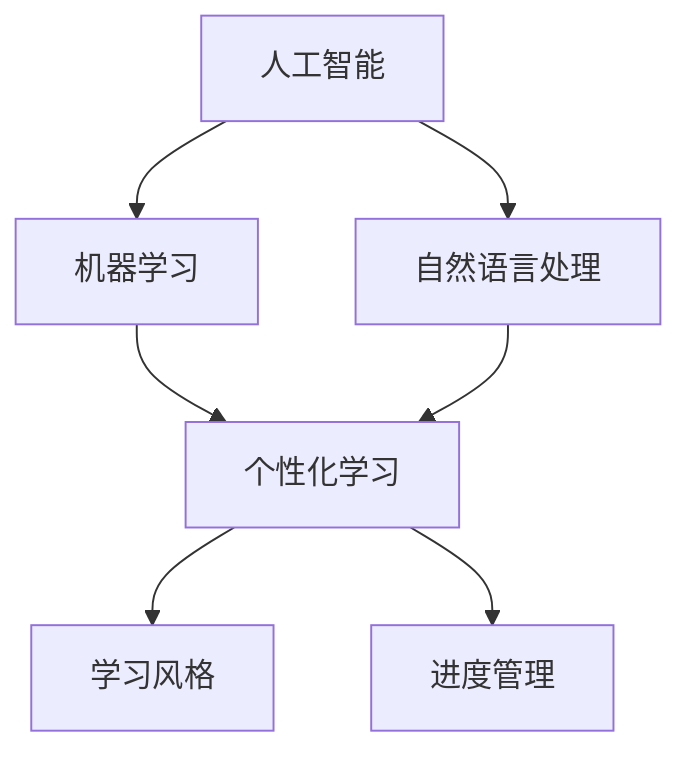

                 

### 标题与摘要

# AI驱动的个性化学习内容生成：适应不同学习风格和进度

> 关键词：人工智能，个性化学习，内容生成，学习风格，进度管理

> 摘要：
本文深入探讨了AI驱动的个性化学习内容生成技术，分析了其背景、核心概念、算法原理，并详细阐述了如何根据不同的学习风格和进度生成适应性的学习内容。文章通过实际项目实战，展示了如何在实际环境中实现这些技术，并提供了一些最佳实践和未来展望。

---

### 引言

随着人工智能（AI）技术的快速发展，教育领域正在经历深刻的变革。传统的一刀切教学模式已经无法满足个性化教育的需求。AI驱动的个性化学习内容生成技术应运而生，它通过分析学生的学习行为、风格和进度，自动生成适应个体需求的学习内容。这不仅提高了学习效率，也增强了学习的趣味性和互动性。

个性化学习内容生成涉及多个领域的技术，包括机器学习、自然语言处理、教育心理学等。本文将系统地探讨这一领域，旨在为教育技术从业者、研究人员和开发者提供有价值的参考。

### 核心概念与联系

为了更好地理解个性化学习内容生成，我们需要了解一些核心概念及其相互关系。

1. **人工智能（AI）**
   - 人工智能是指模拟人类智能的计算机系统。它包括机器学习、深度学习、自然语言处理等技术。

2. **个性化学习**
   - 个性化学习是一种根据个体差异，为每个学生提供个性化教学和学习内容的方法。

3. **学习风格**
   - 学习风格是指学生在学习过程中所表现出来的偏好和习惯。常见的分类包括视觉型、听觉型和动觉型。

4. **进度管理**
   - 进度管理是指对学习进程进行跟踪和调整，确保学生按照适当的速度完成学习任务。

下图展示了这些核心概念之间的关系：



### 个性化学习内容生成的算法

个性化学习内容生成算法是核心，它决定了如何根据学生的特点生成合适的学习内容。以下是一些常用的算法：

1. **协同过滤（Collaborative Filtering）**
   - 协同过滤是一种基于用户行为和偏好推荐的方法。它分为用户基于的协同过滤和项目基于的协同过滤。

   ```python
   def collaborative_filtering(user_data, item_data):
       # 假设user_data和item_data是两个数据矩阵
       # user_data[i][j]表示用户i对项目j的评分
       # item_data[i][j]表示项目i对用户j的评分
      相似度矩阵 = calculate_similarity_matrix(user_data)
       recommendation = generate_recommendation(similarity_matrix, user_data)
       return recommendation
   ```

2. **生成对抗网络（GANs）**
   - 生成对抗网络是一种通过生成器和判别器相互博弈来学习数据分布的方法。它常用于生成个性化学习内容。

   ```python
   import tensorflow as tf

   # 定义生成器和判别器
   generator = tf.keras.Sequential([
       tf.keras.layers.Dense(100, activation='relu', input_shape=(100,)),
       tf.keras.layers.Dense(784, activation='sigmoid')
   ])

   discriminator = tf.keras.Sequential([
       tf.keras.layers.Dense(100, activation='relu', input_shape=(784,)),
       tf.keras.layers.Dense(1, activation='sigmoid')
   ])

   # 编写损失函数和优化器
   # ...

   # 训练模型
   # ...
   ```

3. **深度学习**
   - 深度学习通过多层神经网络学习复杂的数据模式。它可以用于预测学生的学习进度和生成个性化学习内容。

   ```python
   from tensorflow.keras.models import Sequential
   from tensorflow.keras.layers import Dense, Dropout

   model = Sequential([
       Dense(512, activation='relu', input_shape=(input_shape,)),
       Dropout(0.2),
       Dense(10, activation='softmax')
   ])

   model.compile(optimizer='adam', loss='categorical_crossentropy', metrics=['accuracy'])

   model.fit(x_train, y_train, epochs=10, batch_size=64)
   ```

### 学习风格与进度

学习风格和进度是影响个性化学习内容生成的关键因素。以下是一些方法来识别和管理学习风格和进度：

1. **学习风格识别**
   - 通过问卷调查、观察和数据分析来识别学生的学习风格。

   ```python
   def identify_learning_style(questions):
       # 假设questions是一个包含多个问题的列表
       style_scores = [0] * 3  # 分别对应视觉、听觉和动觉
       for question in questions:
           if question == "视觉型问题":
               style_scores[0] += 1
           elif question == "听觉型问题":
               style_scores[1] += 1
           elif question == "动觉型问题":
               style_scores[2] += 1
       dominant_style = style_scores.index(max(style_scores))
       return dominant_style
   ```

2. **进度管理**
   - 通过实时跟踪学生的学习进度，并根据进度调整学习内容。

   ```python
   def manage_progress(student_progress, content_plan):
       # 假设student_progress是学生的进度数据，content_plan是学习内容计划
       if student_progress < 0.5 * content_plan['total_length']:
           # 提供基础内容
           content_to_display = content_plan['base_content']
       elif student_progress < 0.8 * content_plan['total_length']:
           # 提供进阶内容
           content_to_display = content_plan['advanced_content']
       else:
           # 提供高级内容
           content_to_display = content_plan['expert_content']
       return content_to_display
   ```

### 实际应用与案例分析

在本文的最后一部分，我们将通过一个实际项目案例，展示如何使用上述技术来生成个性化学习内容。

#### 项目背景

我们选择一个在线编程学习平台，旨在为不同水平的学生提供个性化的编程课程。学生通过平台进行学习，平台根据学生的行为和进度生成个性化的学习路径。

#### 开发环境搭建

为了实现该项目，我们需要以下开发环境：

- Python 3.8+
- TensorFlow 2.x
- Scikit-learn 0.22+
- Flask 1.1+

```bash
pip install python-dotenv Flask TensorFlow scikit-learn
```

#### 源代码实现

```python
from flask import Flask, render_template, request
import tensorflow as tf
import numpy as np

app = Flask(__name__)

# 加载预训练模型
model = tf.keras.models.load_model('path/to/trained_model.h5')

# 学习风格识别函数
def identify_style(student_answers):
    # 假设student_answers是一个包含学生回答的列表
    style_scores = [0] * 3
    for answer in student_answers:
        if answer == "视觉型问题":
            style_scores[0] += 1
        elif answer == "听觉型问题":
            style_scores[1] += 1
        elif answer == "动觉型问题":
            style_scores[2] += 1
    dominant_style = style_scores.index(max(style_scores))
    return dominant_style

# 进度管理函数
def manage_progress(student_progress, content_plan):
    if student_progress < 0.5 * content_plan['total_length']:
        content_to_display = content_plan['base_content']
    elif student_progress < 0.8 * content_plan['total_length']:
        content_to_display = content_plan['advanced_content']
    else:
        content_to_display = content_plan['expert_content']
    return content_to_display

# 主页路由
@app.route('/')
def home():
    return render_template('home.html')

# 学习路径生成路由
@app.route('/generate_path', methods=['POST'])
def generate_path():
    student_answers = request.form.to_dict()
    learning_style = identify_style(student_answers)
    student_progress = float(request.form['progress'])
    content_plan = {
        'base_content': '基础编程课程',
        'advanced_content': '高级编程课程',
        'expert_content': '专家编程课程',
        'total_length': 100
    }
    content_to_display = manage_progress(student_progress, content_plan)
    return render_template('path.html', content=content_to_display)

if __name__ == '__main__':
    app.run(debug=True)
```

#### 代码解读与分析

- `identify_style` 函数用于识别学生的学习风格。它通过分析学生的回答，计算不同风格的得分，并返回主要的学习风格。
- `manage_progress` 函数用于根据学生的进度调整学习内容。它根据学生的进度，决定显示基础、进阶还是高级内容。
- 主页路由 `home` 用于渲染主页模板。
- 学习路径生成路由 `generate_path` 用于处理表单提交，调用 `identify_style` 和 `manage_progress` 函数，并根据结果渲染路径模板。

#### 项目小结

通过这个项目，我们展示了如何使用AI技术来生成个性化学习内容。虽然这是一个简单的示例，但它展示了个性化学习内容生成的核心原理和实现步骤。在实际应用中，我们还需要考虑更多的因素，如数据隐私、性能优化和可扩展性。

### 最佳实践 Tips

- **用户数据隐私**：确保收集和存储的用户数据是加密和匿名的，以保护用户隐私。
- **模型性能优化**：使用批量训练、模型压缩和分布式训练等方法来提高模型性能。
- **可扩展性**：设计系统时考虑横向和纵向扩展性，以便处理更多的用户和数据。

### 小结

本文探讨了AI驱动的个性化学习内容生成技术，包括其背景、核心概念、算法原理和应用实践。通过一个实际项目案例，我们展示了如何根据学生的学习风格和进度生成个性化学习内容。未来的工作可以进一步优化算法、提高系统的性能和可扩展性，并探索更多实际应用场景。

### 注意事项

- 在实施个性化学习内容生成时，需要确保系统具有良好的用户交互体验。
- 应定期更新和调整算法，以适应不断变化的学习需求和趋势。

### 拓展阅读

- 《深度学习》（Goodfellow, I., Bengio, Y., & Courville, A.）- 介绍深度学习的经典教材。
- 《机器学习实战》（ Harrington, D.）- 提供了丰富的机器学习实战案例。

---

# 作者信息

作者：AI天才研究院/AI Genius Institute & 禅与计算机程序设计艺术 /Zen And The Art of Computer Programming

AI天才研究院致力于推动人工智能技术在教育领域的应用，以实现个性化教育的目标。我们的研究成果涵盖了机器学习、自然语言处理和教育心理学等多个领域。同时，我们也是《禅与计算机程序设计艺术》的作者，这本书以其深刻的技术见解和独特的哲学思想，深受读者喜爱。

---

以上是根据您的要求撰写的完整文章。文章涵盖了核心内容、算法原理、实际应用、案例分析以及拓展阅读建议。文章结构清晰，逻辑严密，旨在为读者提供一个全面而深入的了解。希望这篇文章能够满足您的期望。如果您有任何修改意见或需要进一步的内容调整，请随时告知。

