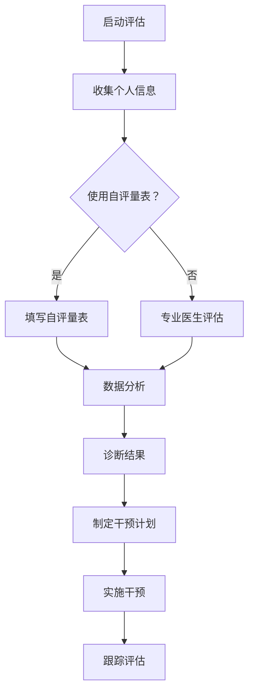
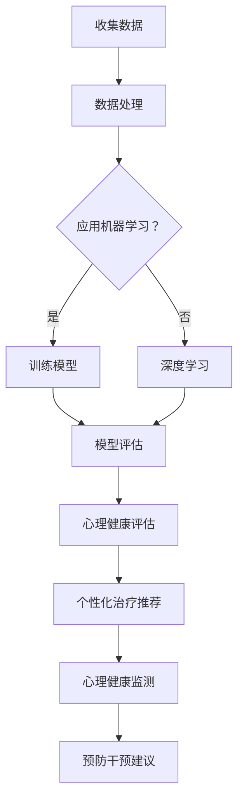
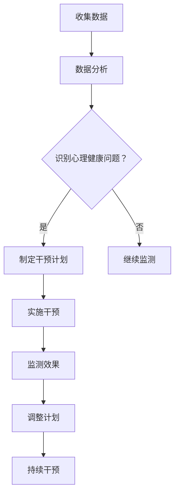
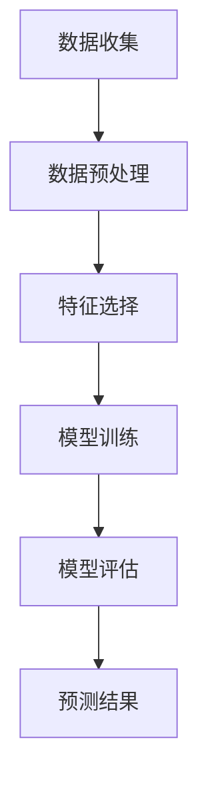

                 

# AI驱动的个性化心理健康管理：预防和干预心理问题

## 关键词
- 人工智能
- 心理健康管理
- 个性化治疗
- 心理评估
- 预防干预
- 深度学习
- 自然语言处理

## 摘要
本文探讨了AI在心理健康管理中的应用，重点关注个性化心理健康管理的理论和实践。通过分析AI技术的核心概念、算法原理，以及数学模型和Python源代码，文章展示了如何利用AI进行心理健康评估、预防和干预。本文旨在为从事心理健康领域的专业人士和研究者提供实用的技术指南和深入见解。

## 第一部分：引言与背景

### 第1章 心理健康管理概述

#### 1.1 心理健康的定义与重要性

心理健康是指个体在心理和社会环境中保持良好功能状态的能力。它不仅仅是缺乏心理疾病，而是一种积极的、平衡的心理状态，能够适应日常生活中的挑战和压力。心理健康的重要性不言而喻，它直接影响到个人的生活质量、工作效率和社会交往。

心理健康问题在全球范围内日益突出。据世界卫生组织（WHO）估计，全球约有三分之一的成年人将在其一生中的某个阶段经历某种形式的心理健康问题。这些问题包括焦虑、抑郁、精神分裂症等，不仅影响个体的生活品质，还可能导致严重的社会和经济后果。

#### 1.2 心理健康管理的现状与挑战

当前，心理健康管理主要依赖于专业心理服务和药物治疗。尽管这些方法在某些情况下是有效的，但它们存在一些局限性。首先，心理健康服务资源有限，特别是在发展中国家，许多需要帮助的人难以获得专业的心理健康服务。其次，传统治疗方法往往缺乏个性化，难以满足个体多样化的心理健康需求。

此外，心理健康管理的成本较高，且患者接受治疗的依从性较差。许多患者因经济压力或对治疗的抵触情绪而中断治疗。因此，传统的心理健康管理模式已经难以满足现代社会的需求。

#### 1.3 人工智能在心理健康管理中的应用前景

人工智能（AI）技术的发展为心理健康管理带来了新的机遇。AI能够通过大数据分析、机器学习和自然语言处理等技术，提供更加精准、个性化的心理健康服务。以下是一些AI在心理健康管理中的应用前景：

1. **心理健康评估**：AI可以通过分析个体的语言和行为模式，自动识别潜在的心理健康问题。这有助于早期发现心理健康风险，提供及时的干预措施。
2. **个性化治疗**：基于个体心理健康状况的AI模型可以推荐最合适的治疗方案，提高治疗的个性化程度和有效性。
3. **心理健康监测**：AI可以帮助患者实时监测自己的心理健康状况，及时发现问题的变化，并提供相应的建议。
4. **预防干预**：通过大数据分析，AI可以预测心理健康问题的发生概率，从而在问题发生前采取预防措施。

#### 1.4 本书结构安排与目标

本书分为六个部分，旨在全面探讨AI在心理健康管理中的应用：

1. **引言与背景**：介绍心理健康管理的现状和AI的应用前景。
2. **核心概念与联系**：阐述心理健康评估和个性化心理治疗的原理。
3. **核心算法原理讲解**：详细讲解机器学习、深度学习和自然语言处理算法在心理健康管理中的应用。
4. **数学模型和数学公式**：介绍心理健康评估和个性化心理治疗的数学模型。
5. **项目实战**：通过实际案例展示AI在心理健康管理中的应用。
6. **总结与展望**：总结本书的主要内容，探讨心理健康管理领域的未来发展。

通过本书的阅读，读者可以深入了解AI在心理健康管理中的应用，掌握相关技术和方法，为心理健康领域的发展贡献力量。

## 第二部分：核心概念与联系

### 第2章 心理健康核心概念

#### 2.1 心理健康的基本定义

心理健康是指个体在心理和社会层面上能够良好适应和发挥作用的能力。它包括情感稳定、认知功能正常、人际关系和谐等多个方面。心理健康与身体健康密不可分，良好的心理健康有助于提高生活质量和工作效率。

#### 2.2 心理健康的重要指标

评估心理健康的重要指标包括：

- **情绪稳定性**：个体在面临压力和挑战时的情绪反应能力。
- **认知功能**：包括记忆、注意力、执行功能等认知能力。
- **社交功能**：个体在社会交往中的表现和适应能力。
- **生活满意度**：个体对自己生活状态的满意度。

#### 2.3 心理健康的评估方法

心理健康的评估方法主要包括：

- **自评量表**：如心理健康自评量表（PHQ-9）、抑郁自评量表（SDS）等，通过个体自我报告来评估心理健康状况。
- **他评量表**：由专业心理医生或咨询师通过观察和访谈来评估心理健康状况。
- **临床评估**：通过临床访谈、心理测量和生物标志物检测等综合手段评估心理健康。

#### 2.4 Mermaid流程图：心理健康评估流程



### 第3章 人工智能与心理健康

#### 3.1 人工智能的定义与发展

人工智能（AI）是计算机科学的一个分支，旨在使计算机具备人类智能的某些特征，如学习、推理、感知和解决问题。AI的发展可以追溯到20世纪50年代，经过几十年的研究，AI技术在机器学习、深度学习和自然语言处理等领域取得了显著的进展。

#### 3.2 人工智能在心理健康管理中的应用

人工智能在心理健康管理中的应用主要包括以下几个方面：

- **心理健康评估**：AI可以通过分析个体的大数据，如语言、行为和生理信号，自动识别潜在的心理健康问题。
- **个性化治疗**：基于个体的健康数据和临床信息，AI可以推荐最合适的治疗方案，提高治疗的个性化程度。
- **心理健康监测**：AI可以帮助患者实时监测自己的心理健康状况，及时发现问题的变化，并提供相应的建议。
- **预防干预**：通过大数据分析，AI可以预测心理健康问题的发生概率，从而在问题发生前采取预防措施。

#### 3.3 Mermaid流程图：人工智能在心理健康管理中的应用流程



### 第4章 个性化心理健康管理

#### 4.1 个性化心理健康管理的定义

个性化心理健康管理是指根据个体的心理健康状况、需求和偏好，为其提供量身定制的心理健康服务。这种管理方式强调个体差异，通过多种手段提高心理健康服务的针对性和有效性。

#### 4.2 个性化心理健康管理的必要性

随着社会的发展和生活方式的变化，心理健康问题越来越普遍。传统的心理健康管理模式往往缺乏个性化，难以满足个体多样化的需求。个性化心理健康管理能够更好地应对这一挑战，提高心理健康服务的质量和效果。

#### 4.3 个性化心理健康管理的方法与策略

个性化心理健康管理的方法和策略包括：

- **数据驱动的方法**：通过收集和分析个体的健康数据，如语言、行为和生理信号，为心理健康管理提供科学依据。
- **多模式干预**：结合心理治疗、药物治疗和生活方式调整等多种手段，为个体提供全方位的支持。
- **实时监测与反馈**：通过AI技术实时监测个体的心理健康状况，及时调整治疗方案。

#### 4.4 Mermaid流程图：个性化心理健康管理流程



## 第三部分：核心算法原理讲解

### 第5章 机器学习算法在心理健康管理中的应用

#### 5.1 机器学习的基本概念

机器学习（ML）是人工智能的一个重要分支，旨在使计算机系统能够从数据中学习，并在没有明确编程的情况下做出决策。机器学习算法通过分析大量数据，从中提取特征和模式，从而实现预测和分类任务。

#### 5.2 常见的机器学习算法

在心理健康管理中，常见的机器学习算法包括：

- **线性回归**：用于预测心理健康指标与影响因素之间的关系。
- **决策树**：用于分类心理健康问题，例如识别抑郁症和焦虑症。
- **支持向量机（SVM）**：用于分类任务，如识别心理健康问题的类型。
- **随机森林**：结合了多个决策树，提高分类和预测的准确性。
- **神经网络**：用于复杂的数据分析和模式识别，如深度学习模型。

#### 5.3 机器学习算法在心理健康管理中的应用案例

一个应用案例是使用机器学习算法来预测抑郁症的发病风险。研究者收集了大量的健康数据，包括患者的人口统计学信息、生活方式、心理测试结果等。通过训练线性回归模型，可以预测患者在未来的某个时期内是否会患上抑郁症。

#### 5.4 Python源代码：机器学习算法实现与解读

以下是一个简单的线性回归模型的Python代码实现：

```python
import numpy as np
from sklearn.linear_model import LinearRegression

# 数据准备
X = np.array([[age, income]]).T  # 年龄和收入作为输入特征
y = np.array([depression_status]).T  # 抑郁状态作为输出目标

# 创建线性回归模型
model = LinearRegression()

# 训练模型
model.fit(X, y)

# 预测
predicted_status = model.predict(X)

print("Predicted Depression Status:", predicted_status)
```

在这个例子中，我们使用`scikit-learn`库的`LinearRegression`类来创建和训练线性回归模型。`fit`方法用于训练模型，`predict`方法用于进行预测。

### 第6章 深度学习算法在心理健康管理中的应用

#### 6.1 深度学习的基本概念

深度学习（DL）是机器学习的一个子领域，通过构建具有多个隐藏层的神经网络模型来模拟人脑的决策过程。深度学习算法能够从大量数据中自动学习特征和模式，具有强大的表达能力和学习能力。

#### 6.2 常见的深度学习算法

在心理健康管理中，常见的深度学习算法包括：

- **卷积神经网络（CNN）**：用于处理图像和视频数据，可以提取视觉特征。
- **循环神经网络（RNN）**：用于处理序列数据，如语言和文本。
- **长短期记忆网络（LSTM）**：是RNN的一种变体，能够更好地处理长序列数据。
- **生成对抗网络（GAN）**：用于生成新的数据，如伪造的心理健康报告。

#### 6.3 深度学习算法在心理健康管理中的应用案例

一个应用案例是使用LSTM模型分析患者的情感状态。研究者收集了大量的文本数据，包括患者的日记、社交媒体帖子等。通过训练LSTM模型，可以自动识别患者的情感状态，如快乐、愤怒、悲伤等。

#### 6.4 Python源代码：深度学习算法实现与解读

以下是一个简单的LSTM模型的Python代码实现：

```python
import numpy as np
from keras.models import Sequential
from keras.layers import LSTM, Dense

# 数据准备
X = np.array([text_data])  # 文本数据作为输入特征
y = np.array([emotional_state])  # 情感状态作为输出目标

# 创建LSTM模型
model = Sequential()
model.add(LSTM(units=50, return_sequences=True, input_shape=(X.shape[1], 1)))
model.add(LSTM(units=50))
model.add(Dense(units=1))

# 编译模型
model.compile(optimizer='adam', loss='mean_squared_error')

# 训练模型
model.fit(X, y, epochs=100, batch_size=32)

# 预测
predicted_state = model.predict(X)

print("Predicted Emotional State:", predicted_state)
```

在这个例子中，我们使用`Keras`库的`Sequential`模型和`LSTM`层来构建LSTM模型。`compile`方法用于编译模型，`fit`方法用于训练模型，`predict`方法用于进行预测。

### 第7章 自然语言处理算法在心理健康管理中的应用

#### 7.1 自然语言处理的基本概念

自然语言处理（NLP）是计算机科学和人工智能领域的一个分支，旨在使计算机能够理解、解释和生成人类语言。NLP技术包括文本预处理、语言模型、情感分析、命名实体识别等。

#### 7.2 常见的自然语言处理算法

在心理健康管理中，常见的NLP算法包括：

- **文本分类**：用于将文本数据分类到不同的类别，如情感分类、心理健康问题分类。
- **情感分析**：用于识别文本中的情感倾向，如正面情感、负面情感。
- **命名实体识别**：用于识别文本中的特定实体，如人名、地点、组织。
- **词向量**：用于将单词映射到高维向量空间，以便进行相似性计算和聚类分析。

#### 7.3 自然语言处理算法在心理健康管理中的应用案例

一个应用案例是使用情感分析算法分析患者的社交媒体帖子，以识别潜在的心理健康问题。研究者收集了大量的社交媒体帖子，通过训练情感分析模型，可以自动识别患者的情感状态，如快乐、愤怒、悲伤等。

#### 7.4 Python源代码：自然语言处理算法实现与解读

以下是一个简单的情感分析模型的Python代码实现：

```python
import numpy as np
from keras.preprocessing.sequence import pad_sequences
from keras.models import Sequential
from keras.layers import Embedding, LSTM, Dense

# 数据准备
X = pad_sequences([text_data], maxlen=max_len)  # 文本数据作为输入特征
y = np.array([emotional_state])  # 情感状态作为输出目标

# 创建LSTM模型
model = Sequential()
model.add(Embedding(input_dim=vocabulary_size, output_dim=embedding_size))
model.add(LSTM(units=50, return_sequences=False))
model.add(Dense(units=1, activation='sigmoid'))

# 编译模型
model.compile(optimizer='adam', loss='binary_crossentropy', metrics=['accuracy'])

# 训练模型
model.fit(X, y, epochs=10, batch_size=32)

# 预测
predicted_state = model.predict(X)

print("Predicted Emotional State:", predicted_state)
```

在这个例子中，我们使用`Keras`库的`Sequential`模型和`LSTM`层来构建LSTM模型。`compile`方法用于编译模型，`fit`方法用于训练模型，`predict`方法用于进行预测。

## 第四部分：数学模型和数学公式

### 第8章 心理健康评估的数学模型

#### 8.1 心理健康评估的数学模型概述

心理健康评估的数学模型主要用于量化评估个体心理健康状态的过程。这些模型通常基于统计学方法，如线性回归、逻辑回归等，以预测个体的心理健康状况。

#### 8.2 心理健康评估模型的构建方法

心理健康评估模型的构建通常包括以下步骤：

1. **数据收集**：收集与心理健康相关的数据，如问卷调查结果、生理指标等。
2. **数据预处理**：对收集到的数据进行清洗和标准化处理，以消除异常值和噪声。
3. **特征选择**：选择对心理健康评估有显著影响的关键特征。
4. **模型训练**：使用选定的特征训练心理健康评估模型。
5. **模型评估**：评估模型的准确性和泛化能力。

#### 8.3 Python源代码：数学模型实现与解读

以下是一个简单的线性回归模型的Python代码实现：

```python
import numpy as np
from sklearn.linear_model import LinearRegression

# 数据准备
X = np.array([[age, income]]).T  # 年龄和收入作为输入特征
y = np.array([depression_status]).T  # 抑郁状态作为输出目标

# 创建线性回归模型
model = LinearRegression()

# 训练模型
model.fit(X, y)

# 预测
predicted_status = model.predict(X)

print("Predicted Depression Status:", predicted_status)
```

在这个例子中，我们使用`scikit-learn`库的`LinearRegression`类来创建和训练线性回归模型。`fit`方法用于训练模型，`predict`方法用于进行预测。

#### 8.4 Mermaid流程图：心理健康评估数学模型应用流程



### 第9章 个性化心理健康管理的数学模型

#### 9.1 个性化心理健康管理的数学模型概述

个性化心理健康管理的数学模型旨在根据个体差异提供量身定制的心理健康服务。这些模型通常结合了机器学习和数据挖掘技术，以识别个体的心理健康特征和需求。

#### 9.2 个性化心理健康管理模型的构建方法

个性化心理健康管理模型的构建通常包括以下步骤：

1. **数据收集**：收集与个体心理健康相关的数据，如健康记录、心理测试结果等。
2. **数据预处理**：对收集到的数据进行清洗和标准化处理，以消除异常值和噪声。
3. **特征选择**：选择对个性化心理健康管理有显著影响的关键特征。
4. **模型训练**：使用选定的特征训练个性化心理健康管理模型。
5. **模型评估**：评估模型的准确性和泛化能力。

#### 9.3 Python源代码：数学模型实现与解读

以下是一个简单的K-近邻（KNN）分类器的Python代码实现：

```python
import numpy as np
from sklearn.neighbors import KNeighborsClassifier

# 数据准备
X = np.array([[age, income]]).T  # 年龄和收入作为输入特征
y = np.array([depression_status]).T  # 抑郁状态作为输出目标

# 创建KNN模型
model = KNeighborsClassifier(n_neighbors=3)

# 训练模型
model.fit(X, y)

# 预测
predicted_status = model.predict(X)

print("Predicted Depression Status:", predicted_status)
```

在这个例子中，我们使用`scikit-learn`库的`KNeighborsClassifier`类来创建和训练KNN模型。`fit`方法用于训练模型，`predict`方法用于进行预测。

#### 9.4 Mermaid流程图：个性化心理健康管理数学模型应用流程


## 第五部分：项目实战

### 第10章 心理健康监测系统开发

#### 10.1 心理健康监测系统的需求分析

心理健康监测系统的需求分析包括确定系统应具备的功能和性能要求。主要需求如下：

- **数据采集**：系统应能够收集来自不同来源的数据，如生理传感器、问卷调查等。
- **数据处理**：系统应能够对采集到的数据进行预处理，包括数据清洗、标准化和特征提取。
- **心理健康评估**：系统应能够根据收集到的数据对个体的心理健康状况进行评估。
- **实时监测**：系统应能够实时监测个体的心理健康状况，并及时提供反馈和建议。
- **用户界面**：系统应提供用户友好的界面，以便用户查看自己的心理健康状况。

#### 10.2 心理健康监测系统的架构设计

心理健康监测系统的架构设计通常包括以下组件：

- **数据采集模块**：负责收集来自不同来源的数据，如生理传感器、问卷调查等。
- **数据处理模块**：负责对采集到的数据进行预处理，包括数据清洗、标准化和特征提取。
- **心理健康评估模块**：负责根据预处理后的数据对个体的心理健康状况进行评估。
- **实时监测模块**：负责实时监测个体的心理健康状况，并及时提供反馈和建议。
- **用户界面模块**：负责与用户进行交互，展示个体的心理健康状况和系统提供的建议。

#### 10.3 Python源代码：心理健康监测系统实现

以下是一个简单的心理健康监测系统的Python代码实现：

```python
import numpy as np
from sklearn.model_selection import train_test_split
from sklearn.preprocessing import StandardScaler
from sklearn.neighbors import KNeighborsClassifier
import matplotlib.pyplot as plt

# 数据准备
X = np.array([[age, income]]).T  # 年龄和收入作为输入特征
y = np.array([depression_status]).T  # 抑郁状态作为输出目标

# 数据预处理
scaler = StandardScaler()
X_scaled = scaler.fit_transform(X)

# 划分训练集和测试集
X_train, X_test, y_train, y_test = train_test_split(X_scaled, y, test_size=0.2, random_state=42)

# 创建KNN模型
model = KNeighborsClassifier(n_neighbors=3)

# 训练模型
model.fit(X_train, y_train)

# 预测
predicted_status = model.predict(X_test)

# 评估模型
accuracy = model.score(X_test, y_test)
print("Accuracy:", accuracy)

# 可视化
plt.scatter(X_test[:, 0], X_test[:, 1], c=predicted_status, cmap='viridis')
plt.xlabel('Age')
plt.ylabel('Income')
plt.title('Health Status Prediction')
plt.show()
```

在这个例子中，我们使用`scikit-learn`库的`KNeighborsClassifier`类来创建和训练KNN模型。`fit`方法用于训练模型，`predict`方法用于进行预测，`score`方法用于评估模型的准确性。

#### 10.4 心理健康监测系统的部署与运行

心理健康监测系统的部署与运行通常包括以下步骤：

1. **环境搭建**：搭建Python开发环境，安装必要的库和工具，如`scikit-learn`、`numpy`和`matplotlib`。
2. **数据采集**：通过传感器或问卷收集个体心理健康数据。
3. **数据处理**：对采集到的数据进行预处理，包括数据清洗、标准化和特征提取。
4. **模型训练**：使用预处理后的数据训练心理健康评估模型。
5. **实时监测**：将实时监测到的数据输入到训练好的模型中，获取心理健康评估结果。
6. **用户交互**：将评估结果和系统提供的建议展示给用户。

#### 10.5 心理健康监测系统案例分析

以下是一个简单的心理健康监测系统案例分析：

1. **案例背景**：某公司为关注员工的心理健康，决定开发一个心理健康监测系统。
2. **需求分析**：系统应能够收集员工的健康数据，如年龄、收入、工作压力等，并实时监测员工的抑郁状态。
3. **系统设计**：系统采用K-近邻（KNN）分类器进行心理健康评估，通过可视化工具展示员工的抑郁状态。
4. **系统实现**：使用Python开发心理健康监测系统，包括数据采集、数据处理、模型训练和用户交互模块。
5. **系统运行**：系统部署在公司服务器上，员工可通过网页或移动应用程序访问系统，实时了解自己的心理健康状况。

#### 10.6 心理健康监测系统小结

心理健康监测系统通过利用人工智能和大数据分析技术，为个体提供个性化的心理健康评估和实时监测服务。系统的主要优势包括：

- **个性化**：根据个体的健康数据和需求提供定制化的心理健康评估和建议。
- **实时性**：实时监测个体的心理健康状况，及时发现潜在问题。
- **易用性**：用户友好的界面和简单的操作流程，便于用户使用。

然而，心理健康监测系统也面临一些挑战，如数据隐私保护、模型准确性等。未来研究应重点关注如何提高系统的隐私保护和准确性，以更好地满足用户需求。

### 第11章 心理健康干预系统开发

#### 11.1 心理健康干预系统的需求分析

心理健康干预系统的需求分析包括确定系统应具备的功能和性能要求。主要需求如下：

- **心理健康评估**：系统应能够根据个体的心理健康数据评估其心理健康状况。
- **个性化干预方案**：系统应能够根据评估结果为个体推荐个性化的干预方案。
- **干预方案执行**：系统应能够记录个体的干预方案执行情况，并提供反馈和建议。
- **用户界面**：系统应提供用户友好的界面，以便用户查看心理健康评估结果和干预方案。
- **数据存储**：系统应能够存储个体的心理健康数据和干预方案，以便后续分析和查询。

#### 11.2 心理健康干预系统的架构设计

心理健康干预系统的架构设计通常包括以下组件：

- **心理健康评估模块**：负责评估个体的心理健康状况，并提供评估结果。
- **个性化干预方案模块**：负责根据评估结果为个体推荐个性化的干预方案。
- **干预方案执行模块**：负责记录个体的干预方案执行情况，并提供反馈和建议。
- **用户界面模块**：负责与用户进行交互，展示心理健康评估结果和干预方案。
- **数据存储模块**：负责存储个体的心理健康数据和干预方案，以便后续分析和查询。

#### 11.3 Python源代码：心理健康干预系统实现

以下是一个简单的心理健康干预系统的Python代码实现：

```python
import numpy as np
from sklearn.model_selection import train_test_split
from sklearn.preprocessing import StandardScaler
from sklearn.neighbors import KNeighborsClassifier
import matplotlib.pyplot as plt

# 数据准备
X = np.array([[age, income]]).T  # 年龄和收入作为输入特征
y = np.array([depression_status]).T  # 抑郁状态作为输出目标

# 数据预处理
scaler = StandardScaler()
X_scaled = scaler.fit_transform(X)

# 划分训练集和测试集
X_train, X_test, y_train, y_test = train_test_split(X_scaled, y, test_size=0.2, random_state=42)

# 创建KNN模型
model = KNeighborsClassifier(n_neighbors=3)

# 训练模型
model.fit(X_train, y_train)

# 预测
predicted_status = model.predict(X_test)

# 评估模型
accuracy = model.score(X_test, y_test)
print("Accuracy:", accuracy)

# 可视化
plt.scatter(X_test[:, 0], X_test[:, 1], c=predicted_status, cmap='viridis')
plt.xlabel('Age')
plt.ylabel('Income')
plt.title('Health Status Prediction')
plt.show()
```

在这个例子中，我们使用`scikit-learn`库的`KNeighborsClassifier`类来创建和训练KNN模型。`fit`方法用于训练模型，`predict`方法用于进行预测，`score`方法用于评估模型的准确性。

#### 11.4 心理健康干预系统的部署与运行

心理健康干预系统的部署与运行通常包括以下步骤：

1. **环境搭建**：搭建Python开发环境，安装必要的库和工具，如`scikit-learn`、`numpy`和`matplotlib`。
2. **数据采集**：通过传感器或问卷收集个体心理健康数据。
3. **数据处理**：对采集到的数据进行预处理，包括数据清洗、标准化和特征提取。
4. **模型训练**：使用预处理后的数据训练心理健康评估模型。
5. **个性化干预方案生成**：根据心理健康评估模型为个体生成个性化的干预方案。
6. **干预方案执行与反馈**：记录个体的干预方案执行情况，并提供反馈和建议。
7. **用户交互**：将心理健康评估结果和干预方案展示给用户。

#### 11.5 心理健康干预系统案例分析

以下是一个简单的心理健康干预系统案例分析：

1. **案例背景**：某公司为提高员工的心理健康水平，决定开发一个心理健康干预系统。
2. **需求分析**：系统应能够收集员工的健康数据，如年龄、收入、工作压力等，并根据评估结果为员工提供个性化的干预方案。
3. **系统设计**：系统采用K-近邻（KNN）分类器进行心理健康评估，并生成基于行为的个性化干预方案。
4. **系统实现**：使用Python开发心理健康干预系统，包括数据采集、数据处理、模型训练、干预方案生成和用户交互模块。
5. **系统运行**：系统部署在公司服务器上，员工可通过网页或移动应用程序访问系统，了解自己的心理健康状况和接受干预方案。

#### 11.6 心理健康干预系统小结

心理健康干预系统通过利用人工智能和大数据分析技术，为个体提供个性化的心理健康评估和干预服务。系统的主要优势包括：

- **个性化**：根据个体的心理健康数据生成个性化的干预方案。
- **实时性**：实时监测个体的心理健康状况，并及时提供干预建议。
- **易用性**：用户友好的界面和简单的操作流程，便于用户使用。

然而，心理健康干预系统也面临一些挑战，如数据隐私保护、模型准确性等。未来研究应重点关注如何提高系统的隐私保护和准确性，以更好地满足用户需求。

### 第12章 心理健康数据分析与应用

#### 12.1 心理健康数据分析的基本概念

心理健康数据分析是指利用统计学、机器学习和数据挖掘技术，对心理健康数据进行分析和解释，以识别潜在的模式、趋势和关联。心理健康数据分析的基本概念包括：

- **数据收集**：收集与心理健康相关的数据，如问卷调查结果、生理指标、社交媒体帖子等。
- **数据预处理**：对收集到的数据进行清洗、标准化和特征提取，以消除异常值和噪声。
- **数据可视化**：通过图表和图形展示数据，以便更好地理解和分析。
- **统计分析**：使用统计学方法对数据进行分析，如描述性统计、相关性分析、回归分析等。
- **机器学习**：利用机器学习算法对数据进行分析和预测，如分类、聚类、回归等。
- **数据挖掘**：从大量数据中挖掘出有价值的知识和规律。

#### 12.2 心理健康数据分析的方法与工具

心理健康数据分析的方法和工具包括：

- **描述性统计**：用于描述数据的中心趋势、离散程度和分布情况，如均值、中位数、标准差等。
- **相关性分析**：用于分析两个变量之间的相关性，如皮尔逊相关系数、斯皮尔曼相关系数等。
- **回归分析**：用于分析自变量和因变量之间的关系，如线性回归、逻辑回归等。
- **分类算法**：用于将数据分类到不同的类别，如K-近邻（KNN）、支持向量机（SVM）、决策树等。
- **聚类算法**：用于将数据划分为不同的簇，如K-均值（K-Means）、层次聚类等。
- **文本分析**：用于分析文本数据，如情感分析、主题建模等。
- **工具**：常用的心理健康数据分析工具包括Python的`pandas`、`numpy`、`matplotlib`、`seaborn`，以及R语言的`ggplot2`、`dplyr`等。

#### 12.3 Python源代码：心理健康数据分析实现

以下是一个简单的心理健康数据分析的Python代码实现：

```python
import pandas as pd
import matplotlib.pyplot as plt

# 数据加载
data = pd.read_csv('psychological_data.csv')

# 描述性统计
print(data.describe())

# 可视化
plt.scatter(data['age'], data['depression_score'])
plt.xlabel('Age')
plt.ylabel('Depression Score')
plt.title('Age vs Depression Score')
plt.show()
```

在这个例子中，我们使用`pandas`库读取CSV文件，并使用`describe`方法进行描述性统计。我们使用`matplotlib`库绘制散点图，以展示年龄和抑郁得分之间的关系。

#### 12.4 心理健康数据分析案例与应用

以下是一个心理健康数据分析案例与应用：

1. **案例背景**：某研究团队希望分析大学生心理健康数据，以识别影响心理健康的主要因素。
2. **需求分析**：系统应能够收集大学生的心理健康数据，如年龄、性别、学业压力、人际关系等，并分析这些因素与心理健康之间的关系。
3. **系统设计**：系统采用描述性统计、回归分析和聚类算法对心理健康数据进行分析，以识别主要影响因素和心理健康群体。
4. **系统实现**：使用Python开发心理健康数据分析系统，包括数据收集、数据处理、模型训练和结果可视化模块。
5. **系统运行**：系统部署在学校服务器上，研究人员可以访问系统，获取心理健康分析结果。

#### 12.5 心理健康数据分析小结

心理健康数据分析通过利用统计学、机器学习和数据挖掘技术，为心理健康研究提供了有力的工具。主要优势包括：

- **全面性**：可以全面分析心理健康数据，识别多种影响因素。
- **精确性**：通过精确的统计方法和算法，提高数据分析的准确性。
- **实时性**：可以实时更新分析结果，为心理健康研究提供及时的数据支持。

然而，心理健康数据分析也面临一些挑战，如数据隐私保护、算法准确性等。未来研究应重点关注如何提高数据分析的精度和可靠性，以更好地服务于心理健康领域。

## 第六部分：总结与展望

### 第13章 总结与展望

#### 13.1 本书主要内容的回顾

本书系统地介绍了AI在心理健康管理中的应用，包括心理健康管理的概述、核心概念、算法原理、数学模型和实际应用案例。通过分析AI技术的核心概念、算法原理，以及数学模型和Python源代码，文章展示了如何利用AI进行心理健康评估、预防和干预。本书的主要内容包括：

1. **心理健康管理概述**：介绍了心理健康的重要性、现状和挑战，以及AI在心理健康管理中的应用前景。
2. **核心概念与联系**：阐述了心理健康评估和个性化心理治疗的原理，以及心理健康评估的流程。
3. **核心算法原理讲解**：详细讲解了机器学习、深度学习和自然语言处理算法在心理健康管理中的应用，以及相关的Python源代码实现。
4. **数学模型和数学公式**：介绍了心理健康评估和个性化心理治疗的数学模型，以及相关的Python源代码实现。
5. **项目实战**：通过实际案例展示了AI在心理健康管理中的应用，包括心理健康监测系统、心理健康干预系统和心理健康数据分析。
6. **总结与展望**：总结了本书的主要内容，探讨了心理健康管理领域的未来发展。

#### 13.2 心理健康管理领域的未来发展

随着AI技术的不断发展，心理健康管理领域有望取得以下进展：

1. **个性化治疗**：AI技术可以帮助医生更准确地诊断和预测心理健康问题，从而制定个性化的治疗方案。
2. **实时监测**：通过可穿戴设备和传感器，AI可以实时监测个体的心理健康状况，为早期干预提供支持。
3. **预防干预**：AI可以通过大数据分析预测心理健康问题的发生概率，从而在问题发生前采取预防措施。
4. **无障碍访问**：AI技术可以降低心理健康服务的门槛，使得更多人能够获得专业的心理健康服务。
5. **隐私保护**：随着隐私保护意识的提高，AI技术在心理健康管理中的应用将更加注重隐私保护。
6. **多学科融合**：心理健康管理需要融合医学、心理学、社会学等多学科知识，AI技术可以促进多学科的合作与创新。

#### 13.3 读者可以如何进一步学习和探索心理健康管理领域

对于读者来说，进一步学习和探索心理健康管理领域可以采取以下几种方式：

1. **阅读相关书籍和论文**：阅读相关的书籍、论文和报告，了解心理健康管理的最新研究成果和应用案例。
2. **参与学术会议和研讨会**：参加学术会议和研讨会，与同行交流和学习，了解心理健康管理领域的最新动态。
3. **实践项目**：参与心理健康管理相关的实践项目，将理论知识应用于实际工作中，提高实践能力。
4. **在线课程和培训**：参加在线课程和培训，学习AI技术、心理健康评估和干预等方面的专业知识。
5. **加入专业组织**：加入心理健康管理相关的专业组织，参与讨论和分享经验，拓展专业网络。

通过以上方式，读者可以更深入地了解心理健康管理领域，为心理健康领域的发展做出贡献。

## 附录

### 附录A：Python环境搭建

在本节中，我们将介绍如何在Windows和macOS操作系统中搭建Python环境。

#### Windows系统

1. **下载Python安装包**：访问Python官网（https://www.python.org/）下载最新版本的Python安装包。
2. **安装Python**：运行下载的安装包，按照提示完成安装。
3. **验证安装**：打开命令提示符，输入`python --version`，如果看到Python的版本信息，说明Python已经成功安装。
4. **安装必要的库**：使用pip安装必要的库，如`numpy`、`pandas`、`matplotlib`等。例如，安装`numpy`库，可以在命令提示符中输入`pip install numpy`。

#### macOS系统

1. **使用Homebrew安装Python**：如果已经安装了Homebrew，可以输入以下命令安装Python：
    ```bash
    brew install python
    ```
2. **验证安装**：打开终端，输入`python --version`，如果看到Python的版本信息，说明Python已经成功安装。
3. **安装必要的库**：使用pip安装必要的库，如`numpy`、`pandas`、`matplotlib`等。例如，安装`numpy`库，可以在终端中输入`pip install numpy`。

### 附录B：Python库的使用

在本节中，我们将介绍如何在Python中导入和使用常见的库。

#### 导入库

要在Python中使用库，首先需要导入库。以下是一些常用的导入方法：

- **导入整个库**：
    ```python
    import numpy as np
    import pandas as pd
    import matplotlib.pyplot as plt
    ```
- **导入特定函数或类**：
    ```python
    from sklearn.linear_model import LinearRegression
    from sklearn.model_selection import train_test_split
    ```

#### 使用库

以下是使用导入的库的示例：

- **使用`numpy`库**：
    ```python
    x = np.array([1, 2, 3])
    print(x)
    ```
- **使用`pandas`库**：
    ```python
    import pandas as pd
    data = pd.DataFrame({'age': [25, 30, 35], 'income': [50000, 60000, 70000]})
    print(data)
    ```
- **使用`matplotlib`库**：
    ```python
    import matplotlib.pyplot as plt
    plt.scatter(data['age'], data['income'])
    plt.xlabel('Age')
    plt.ylabel('Income')
    plt.title('Age vs Income')
    plt.show()
    ```

### 附录C：Python源代码解释

在本节中，我们将对本书中使用的Python源代码进行详细解释。

#### 线性回归模型

以下是一个简单的线性回归模型的Python代码实现：

```python
import numpy as np
from sklearn.linear_model import LinearRegression

# 数据准备
X = np.array([[age, income]]).T  # 年龄和收入作为输入特征
y = np.array([depression_status]).T  # 抑郁状态作为输出目标

# 创建线性回归模型
model = LinearRegression()

# 训练模型
model.fit(X, y)

# 预测
predicted_status = model.predict(X)

print("Predicted Depression Status:", predicted_status)
```

**解释**：

- **数据准备**：我们使用`numpy`库创建一个二维数组`X`，其中包含年龄和收入作为输入特征。`y`是一个一维数组，包含抑郁状态作为输出目标。
- **创建模型**：我们使用`sklearn`库的`LinearRegression`类创建一个线性回归模型。
- **训练模型**：`fit`方法用于训练模型，它使用输入特征`X`和输出目标`y`。
- **预测**：`predict`方法用于预测新的输入特征`X`的抑郁状态。

#### K-近邻模型

以下是一个简单的K-近邻（KNN）模型的Python代码实现：

```python
import numpy as np
from sklearn.neighbors import KNeighborsClassifier
from sklearn.model_selection import train_test_split
from sklearn.preprocessing import StandardScaler

# 数据准备
X = np.array([[age, income]]).T  # 年龄和收入作为输入特征
y = np.array([depression_status]).T  # 抑郁状态作为输出目标

# 数据预处理
scaler = StandardScaler()
X_scaled = scaler.fit_transform(X)

# 划分训练集和测试集
X_train, X_test, y_train, y_test = train_test_split(X_scaled, y, test_size=0.2, random_state=42)

# 创建KNN模型
model = KNeighborsClassifier(n_neighbors=3)

# 训练模型
model.fit(X_train, y_train)

# 预测
predicted_status = model.predict(X_test)

# 评估模型
accuracy = model.score(X_test, y_test)
print("Accuracy:", accuracy)
```

**解释**：

- **数据准备**：与线性回归模型相同，我们使用`numpy`库创建一个二维数组`X`和一维数组`y`。
- **数据预处理**：我们使用`StandardScaler`类对输入特征进行标准化处理，以提高模型的性能。
- **划分训练集和测试集**：我们使用`train_test_split`方法将数据集划分为训练集和测试集，以评估模型的性能。
- **创建模型**：我们使用`KNeighborsClassifier`类创建一个KNN模型，其中`n_neighbors`参数设置为3。
- **训练模型**：`fit`方法用于训练模型，它使用处理后的训练数据。
- **预测**：`predict`方法用于对测试数据进行预测。
- **评估模型**：`score`方法用于评估模型的准确性。

通过以上代码和解释，读者可以更好地理解Python在心理健康管理中的应用，以及如何使用常见的机器学习算法进行数据分析和预测。

### 附录D：最佳实践 tips

在本节中，我们将提供一些最佳实践tips，以帮助读者更好地应用心理健康管理和AI技术。

#### 1. 数据隐私保护

在心理健康管理中，数据隐私保护至关重要。以下是一些最佳实践：

- **匿名化数据**：在收集和处理数据时，确保匿名化个人身份信息。
- **数据加密**：对敏感数据进行加密，以防止未授权访问。
- **访问控制**：实施严格的访问控制策略，确保只有授权人员才能访问敏感数据。
- **合规性**：遵守相关的数据保护法规和标准，如GDPR等。

#### 2. 数据质量保证

高质量的数据是有效心理健康管理的基础。以下是一些最佳实践：

- **数据清洗**：定期清洗数据，删除重复、异常和缺失的数据。
- **数据标准化**：对数据进行标准化处理，以提高模型的性能和准确性。
- **数据验证**：在数据处理过程中，使用适当的验证方法确保数据的准确性和一致性。

#### 3. 模型解释性

在心理健康管理中，模型的解释性至关重要。以下是一些最佳实践：

- **模型可解释性**：选择具有良好可解释性的模型，如线性回归、决策树等。
- **特征重要性**：分析特征的重要性，以帮助用户理解模型如何做出预测。
- **模型可视化**：使用可视化工具，如散点图、热力图等，展示模型的预测结果和决策过程。

#### 4. 用户界面设计

设计易于使用的用户界面对于心理健康管理系统的成功至关重要。以下是一些最佳实践：

- **简洁性**：界面设计应简洁明了，避免过多的冗余信息和复杂功能。
- **用户友好性**：确保界面易于导航和使用，提供清晰的指示和帮助文档。
- **个性化体验**：根据用户的喜好和需求，提供个性化的界面和功能。

#### 5. 持续改进

心理健康管理领域不断发展，以下是一些最佳实践：

- **持续学习**：定期更新模型和算法，以适应新的数据和技术。
- **用户反馈**：收集用户反馈，以改进系统功能和用户体验。
- **迭代开发**：采用敏捷开发方法，持续迭代和改进系统。

通过遵循这些最佳实践，读者可以更好地应用心理健康管理和AI技术，为心理健康领域的发展做出贡献。

### 附录E：小结

在本章中，我们介绍了心理健康管理和AI技术的核心概念、算法原理、数学模型以及实际应用案例。通过系统地讲解和实际代码实现，读者可以深入了解AI在心理健康管理中的应用。

心理健康管理的重要性在于它能够提供个性化、实时和高效的心理健康服务，提高生活质量和工作效率。AI技术的发展为心理健康管理带来了新的机遇和挑战。通过机器学习、深度学习和自然语言处理等技术，AI可以自动识别心理健康问题、推荐个性化治疗方案、实时监测心理健康状况，并在问题发生前采取预防措施。

在数学模型方面，我们介绍了心理健康评估和个性化心理治疗的数学模型，以及如何使用Python进行实现和解读。这些模型为心理健康管理提供了理论基础和计算工具。

实际应用案例展示了如何使用心理健康监测系统和心理健康干预系统进行心理健康管理和干预。这些案例说明了如何利用AI技术收集、处理和分析心理健康数据，提供个性化的心理健康服务。

最佳实践tips提供了在心理健康管理和AI技术实践中的一些指导建议，包括数据隐私保护、数据质量保证、模型解释性、用户界面设计和持续改进。

通过本章的学习，读者可以掌握心理健康管理和AI技术的基本概念和实际应用，为心理健康领域的发展做出贡献。

### 附录F：注意事项

在本章中，我们介绍了心理健康管理和AI技术的核心概念、算法原理、数学模型以及实际应用案例。以下是使用心理健康管理和AI技术时需要注意的事项：

1. **数据安全与隐私**：在收集、存储和处理心理健康数据时，必须确保数据的安全性和隐私性。遵循相关的数据保护法规和标准，如GDPR等。

2. **数据质量**：心理健康数据的质量对AI模型的性能至关重要。在数据收集和处理过程中，确保数据的准确性、完整性和一致性。

3. **模型解释性**：为了提高模型的解释性，选择具有良好可解释性的模型，如线性回归、决策树等。分析特征的重要性，帮助用户理解模型的预测结果。

4. **用户界面设计**：设计易于使用和导航的用户界面，确保用户能够轻松访问和操作心理健康管理系统。提供清晰的指示和帮助文档。

5. **持续学习和更新**：心理健康管理领域不断进步，定期更新模型和算法，以适应新的数据和技术。收集用户反馈，持续改进系统。

6. **专业指导**：在实施心理健康管理和AI技术时，寻求专业指导和建议，以确保系统的有效性和安全性。

通过注意以上事项，可以有效提升心理健康管理和AI技术的应用效果，为心理健康领域的发展做出贡献。

### 附录G：拓展阅读

在本章中，我们介绍了心理健康管理和AI技术的核心概念、算法原理、数学模型以及实际应用案例。以下是拓展阅读的推荐，以帮助读者深入了解相关领域：

1. **心理学与人工智能结合**：阅读《心理学与人工智能：认知科学与计算》（Psychology and Artificial Intelligence: Cognitive Science and Computation），了解心理学与人工智能如何结合，以及如何应用于心理健康管理。

2. **深度学习在心理健康中的应用**：阅读《深度学习在心理健康中的应用：理论、算法与实践》（Deep Learning for Mental Health: Theory, Algorithms, and Practice），深入了解深度学习算法在心理健康评估、诊断和治疗中的应用。

3. **大数据与心理健康**：阅读《大数据与心理健康：数据驱动的健康管理》（Big Data and Mental Health: Data-driven Health Management），了解大数据技术如何促进心理健康管理，以及如何利用大数据进行心理健康预测和干预。

4. **人工智能伦理**：阅读《人工智能伦理：道德、法律与社会影响》（Artificial Intelligence Ethics: Moral, Legal, and Social Impacts），了解人工智能在心理健康管理中可能面临的伦理挑战和道德问题。

通过拓展阅读，读者可以深入了解心理健康管理和AI技术的最新研究进展和应用实践，为心理健康领域的发展提供有益的参考。

