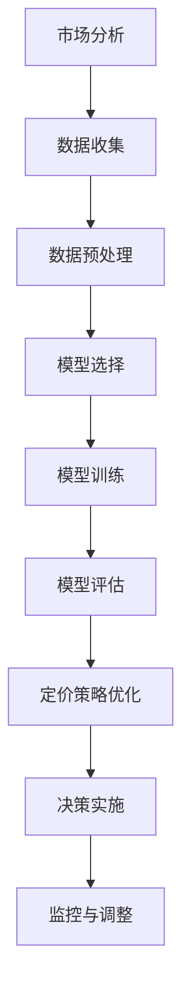

                 

### 理解书名：《AI驱动的产品定价策略：优化价格决策》

《AI驱动的产品定价策略：优化价格决策》这本书的标题清晰地传达了其主要内容和关注点。首先，“AI驱动的产品定价策略”表明了本书的核心主题，即利用人工智能技术来制定产品价格。这里的“AI”指的是人工智能，一种能够模拟人类智能行为的技术，其在各种领域都有广泛的应用。在产品定价领域，AI技术可以带来革命性的变化，通过数据分析、模式识别和智能算法，为企业提供更加精准和高效的定价策略。

“优化价格决策”则进一步强调了书中的重点——如何通过AI技术来提升定价决策的优化程度。价格决策是企业运营中至关重要的环节，直接影响到产品的市场份额、盈利能力和品牌形象。传统的定价方法通常基于经验和直觉，而AI驱动的定价策略能够利用大数据和先进算法，使得价格决策更加科学、精准和动态调整。

书名中的“驱动的”一词强调了AI在定价策略中的核心地位，意味着AI不仅是辅助工具，更是主导力量，能够引领企业实现更高效的定价策略。总的来说，书名传达了本书旨在通过人工智能技术，帮助企业在复杂多变的市场环境中，实现产品定价的优化，从而提高市场竞争力和盈利能力。

### 核心主题

本书的核心主题围绕人工智能在产品定价策略中的应用及其优化过程。首先，我们需要明确几个关键概念：

1. **人工智能（AI）**：人工智能是指计算机系统通过模拟人类智能行为，如学习、推理、感知和解决问题等，来实现智能化的决策过程。在产品定价策略中，AI可以处理大量数据，识别市场趋势和消费者行为，提供基于数据的定价建议。

2. **产品定价策略**：产品定价策略是企业根据市场需求、成本结构、竞争状况等因素，制定产品价格的方式。定价策略的目标是在满足企业盈利目标的同时，最大限度地满足消费者需求。

3. **优化价格决策**：优化价格决策是指通过数据分析和算法，对定价策略进行调整和优化，以达到最佳的市场反应和盈利效果。AI在这里的作用是提供更准确、更快速、更具预测性的定价建议。

核心主题包括以下几个方面：

- **AI在定价策略中的应用**：介绍如何利用AI技术进行市场分析、消费者行为预测和定价模型构建。

- **价格优化的方法**：探讨不同的AI算法如何应用于定价优化，如回归分析、决策树、支持向量机和深度学习等。

- **数据分析和工具**：阐述如何收集、处理和可视化定价相关的数据，使用数据分析工具和技术来支持定价决策。

- **案例分析**：通过实际案例研究，展示AI定价策略在不同行业和产品中的应用效果。

- **最佳实践**：总结AI定价策略的最佳实践，提供实际操作的建议和注意事项。

### 摘要

《AI驱动的产品定价策略：优化价格决策》旨在探讨如何利用人工智能技术，优化企业的产品定价策略。本书首先介绍了AI在产品定价中的应用场景，包括市场分析、消费者行为预测和定价模型构建等。接着，详细探讨了多种AI算法在定价优化中的应用，如回归分析、决策树和支持向量机等。此外，本书还介绍了如何使用数据分析工具和技术来支持定价决策，包括数据收集、预处理和可视化等。通过实际案例研究，本书展示了AI定价策略在不同行业和产品中的应用效果，并总结了最佳实践和注意事项。总之，本书为企业在复杂多变的市场环境中，实现高效、精准的定价策略提供了实用的指导和方法。

### 第一部分：基础理论

#### 第1章：AI与产品定价概述

##### 1.1 AI在定价策略中的应用

人工智能（AI）在产品定价策略中的应用，主要在于其能够通过数据分析和模式识别，为企业提供更加精准、动态和智能化的定价建议。传统定价策略往往依赖于经验和直觉，而AI技术能够处理大量数据，识别市场趋势和消费者行为，从而实现更加科学和高效的定价决策。

首先，AI技术可以用于市场分析。通过分析历史销售数据、市场趋势和竞争对手的定价策略，AI可以预测市场需求和价格波动。这种方法不仅能够帮助企业在价格竞争中获得优势，还能够通过价格调整来满足不同市场需求，提高市场占有率。

其次，AI在消费者行为预测中的应用也非常广泛。消费者行为数据包括购买历史、浏览行为、评价和反馈等，通过机器学习和数据分析，AI可以识别出不同消费者的价格敏感度，预测他们的购买行为。企业可以根据这些预测结果，制定更加个性化和精准的定价策略。

最后，AI技术还可以用于定价模型的构建。传统定价模型往往基于简单的线性关系，而AI可以构建更加复杂的非线性模型，如神经网络模型。这些模型可以更准确地反映市场需求和价格之间的关系，从而优化定价策略。

##### 1.2 AI驱动的定价优势

AI驱动的定价策略相比传统方法具有明显的优势：

1. **更高的精度**：AI可以通过大数据分析和机器学习，处理复杂的非线性关系，提供更加精准的定价建议。这使得企业能够更好地预测市场需求，制定更加合理的价格。

2. **更快的响应速度**：传统的定价策略需要人工分析和决策，而AI可以实时处理数据，快速调整价格。这使得企业能够迅速应对市场变化，抓住商机。

3. **个性化的定价**：AI可以根据不同消费者的行为和偏好，制定个性化的定价策略。这不仅能够提高消费者的满意度，还能够增加销售额。

4. **降低成本**：AI技术可以自动化定价过程，减少人工干预，降低运营成本。

总的来说，AI驱动的定价策略不仅提高了定价的精度和效率，还能够帮助企业更好地适应市场变化，实现持续增长。

##### 1.3 产品定价基础

产品定价是企业运营的核心环节，直接关系到企业的盈利能力和市场竞争力。了解产品定价的基础理论，对于实施AI驱动的定价策略至关重要。

首先，产品定价模型是定价策略的核心。定价模型包括成本导向定价、市场导向定价和竞争导向定价等。成本导向定价基于产品的生产成本，加上一定的利润率来确定价格；市场导向定价则考虑市场需求和消费者购买意愿；竞争导向定价则基于竞争对手的定价策略进行调整。

其次，市场需求与价格关系是定价策略的重要参考。市场需求通常受到价格、消费者收入、产品品质和替代品价格等多种因素的影响。通过分析市场需求，企业可以确定产品的合理价格区间。

此外，竞争状况也是影响产品定价的关键因素。在竞争激烈的市场环境中，企业需要通过价格策略来获得竞争优势。了解竞争对手的定价策略和市场反应，可以帮助企业制定更有效的定价策略。

总的来说，产品定价基础包括定价模型、市场需求与价格关系、竞争状况等关键概念。理解这些基础理论，有助于企业更好地制定和优化AI驱动的定价策略。

##### 1.4 AI在定价策略中的核心应用

AI在定价策略中的核心应用主要体现在以下几个方面：

1. **数据分析**：AI技术可以处理和分析大量数据，包括历史销售数据、市场趋势、消费者行为等。通过数据挖掘和模式识别，AI能够识别出隐藏在数据中的趋势和关联，为定价策略提供依据。

2. **价格预测**：基于历史数据和现有市场状况，AI可以预测未来的价格趋势和市场需求变化。这种预测能力使得企业能够及时调整价格策略，以适应市场变化。

3. **个性化定价**：通过分析消费者的行为和偏好，AI可以为不同的消费者群体制定个性化的定价策略。这种个性化定价不仅可以提高消费者的满意度，还能够增加销售额。

4. **优化定价模型**：AI可以构建和优化复杂的定价模型，如神经网络模型和决策树模型。这些模型可以更准确地预测市场需求和价格关系，为企业提供更加科学的定价建议。

总的来说，AI在定价策略中的应用，不仅提高了定价的精度和效率，还使得定价策略更加灵活和动态。企业通过利用AI技术，可以更好地应对市场变化，提高竞争力。

### 第2章：市场分析与数据收集

##### 2.1 数据来源

市场分析和数据收集是AI驱动定价策略的基础。准确的数据来源能够确保分析结果的准确性和可靠性。以下是一些常见的数据来源：

1. **企业内部数据**：包括历史销售数据、库存数据、客户数据等。这些数据通常来自于企业的ERP系统、CRM系统和POS系统。

2. **市场调研数据**：通过问卷调查、在线调查和深度访谈等方式收集的市场数据。这些数据通常用于了解消费者需求、市场趋势和竞争对手情况。

3. **公共数据源**：如政府发布的宏观经济数据、行业报告、市场研究公司的数据等。这些数据可以帮助企业了解外部市场环境。

4. **社交媒体数据**：通过社交媒体平台（如Twitter、Facebook等）收集的消费者行为和反馈数据。这些数据可以提供消费者对产品的看法和态度。

5. **竞争对手数据**：通过监测竞争对手的网站、广告和市场行为，获取竞争对手的定价策略和销售情况。

选择合适的数据来源需要考虑数据的全面性、准确性和时效性。企业应该根据自身需求和业务特点，选择最合适的来源。

##### 2.2 数据预处理

数据预处理是市场分析的关键步骤，它包括数据清洗、数据整合和数据规范化等。

1. **数据清洗**：数据清洗旨在去除数据中的噪声和错误。常见的清洗方法包括去除重复数据、填补缺失值、纠正错误值等。数据清洗的目的是确保数据的质量，避免对分析结果产生误导。

2. **数据整合**：数据整合是将来自不同来源的数据进行合并和整合。例如，将销售数据、库存数据和客户数据整合在一起，形成一个完整的数据集。数据整合的目的是提供更全面的信息，支持更深入的分析。

3. **数据规范化**：数据规范化是指将不同来源的数据进行标准化处理，使其具备统一的格式和单位。例如，将不同的货币单位统一为一种货币，将不同的时间单位统一为同一种时间单位。数据规范化的目的是确保数据的可比性和一致性。

数据预处理不仅能够提高数据质量，还能降低数据噪声对分析结果的影响，为后续的AI分析提供可靠的数据基础。

##### 2.3 数据分析方法

数据分析方法是市场分析的核心，它包括描述性分析、推断性分析和预测性分析等。

1. **描述性分析**：描述性分析旨在描述数据的基本特征和趋势。常用的描述性统计量包括平均数、中位数、标准差等。描述性分析可以帮助企业了解数据的基本分布情况，发现数据中的异常值和趋势。

2. **推断性分析**：推断性分析旨在从样本数据推断总体数据的特征。常见的推断性分析方法包括假设检验和置信区间估计。通过推断性分析，企业可以判断样本数据是否具有代表性，以及总体数据的特征。

3. **预测性分析**：预测性分析旨在预测未来的市场趋势和变化。常见的预测性分析方法包括时间序列分析、回归分析和机器学习算法等。通过预测性分析，企业可以预测未来的价格趋势、市场需求和竞争状况。

数据分析方法的选择取决于企业的具体需求和数据类型。合理的数据分析方法能够为企业提供有价值的信息，支持更科学的决策。

### 第3章：AI定价算法原理

##### 3.1 算法概述

在AI驱动的定价策略中，算法扮演着至关重要的角色。算法不仅能够处理大量数据，还能通过学习和优化，提供精准的定价建议。以下是一些常见的AI定价算法：

1. **回归分析**：回归分析是一种用于预测数值型变量的统计方法。它通过建立因变量和自变量之间的线性关系，来预测价格。回归分析适用于简单和线性关系的定价场景。

2. **决策树**：决策树是一种基于树形结构的分类方法，通过一系列规则来划分数据集。决策树可以处理非线性关系，适用于复杂的定价场景。

3. **支持向量机（SVM）**：支持向量机是一种基于最大化边际分类的方法，它通过找到一个最优的超平面，来划分不同类别的数据点。SVM适用于处理高维数据，并且在定价中可以用于分类和回归问题。

4. **神经网络**：神经网络是一种模拟人脑结构和功能的计算模型，通过多层神经元和激活函数，实现数据的映射和分类。神经网络适用于复杂的非线性定价模型，特别是深度学习算法。

这些算法各有优势和局限性，选择合适的算法需要根据具体业务需求和数据特性来决定。

##### 3.2 传统定价算法回顾

在介绍AI定价算法之前，先回顾一下传统的定价算法。传统定价算法主要包括成本加成定价、市场定价和竞争定价等。

1. **成本加成定价**：成本加成定价是一种基于产品成本来确定价格的方法。企业首先计算产品的总成本，然后加上一定的利润率，得到产品的销售价格。这种方法的优点是简单易懂，缺点是忽略了市场需求和竞争状况。

2. **市场定价**：市场定价是基于市场需求来确定价格的方法。企业通过分析市场需求和消费者购买意愿，来确定产品的价格。市场定价的优点是能够满足市场需求，缺点是忽略了成本和竞争因素。

3. **竞争定价**：竞争定价是基于竞争对手的定价策略来确定价格的方法。企业通过监测竞争对手的价格，来调整自己的价格。竞争定价的优点是能够保持市场竞争力，缺点是容易陷入价格战。

传统定价算法主要依赖于经验和直觉，难以适应复杂多变的市场环境。随着数据技术和计算能力的提升，AI定价算法逐渐成为优化定价策略的重要工具。

##### 3.3 AI定价算法特点

AI定价算法相比传统算法具有以下特点：

1. **数据驱动的决策**：AI定价算法通过分析大量历史数据和市场数据，来实现数据驱动的决策。这种方法不仅考虑了成本、市场需求和竞争状况，还考虑了消费者行为和价格弹性等因素。

2. **动态调整能力**：AI定价算法能够实时分析市场数据和价格变化，快速调整定价策略。这种动态调整能力使得企业能够及时应对市场变化，保持竞争优势。

3. **高精度预测**：AI定价算法通过机器学习和深度学习技术，能够建立复杂的定价模型，实现高精度预测。这种方法可以更加准确地预测市场需求和价格趋势，从而制定更合理的价格策略。

4. **个性化定价**：AI定价算法可以根据不同消费者的行为和偏好，制定个性化的定价策略。这种个性化定价不仅可以提高消费者的满意度，还可以增加销售额。

总的来说，AI定价算法相比传统算法，具有更高的精度、动态调整能力和个性化定价能力，能够更好地满足复杂多变的市场需求。

##### 3.4 机器学习算法应用

在AI定价策略中，机器学习算法的应用至关重要。以下介绍几种常见的机器学习算法及其在定价策略中的应用：

1. **线性回归**：线性回归是一种简单的机器学习算法，通过建立因变量和自变量之间的线性关系来预测价格。线性回归适用于简单和线性关系的定价场景。其优点是算法简单，易于实现；缺点是对于复杂和非线性关系的表现较差。

```python
import numpy as np
import pandas as pd
from sklearn.linear_model import LinearRegression

# 加载数据
data = pd.read_csv('sales_data.csv')
X = data[['cost', 'demand']]
y = data['price']

# 训练模型
model = LinearRegression()
model.fit(X, y)

# 预测价格
predicted_price = model.predict([[cost, demand]])
print(f"预测价格：{predicted_price}")
```

2. **决策树**：决策树是一种基于树形结构的机器学习算法，通过一系列规则来划分数据集，以实现分类或回归任务。决策树适用于复杂和非线性关系的定价场景，其优点是易于理解和解释；缺点是容易过拟合，对于大量特征的数据处理能力较差。

```python
from sklearn.tree import DecisionTreeRegressor

# 训练模型
model = DecisionTreeRegressor()
model.fit(X, y)

# 预测价格
predicted_price = model.predict([[cost, demand]])
print(f"预测价格：{predicted_price}")
```

3. **支持向量机（SVM）**：支持向量机是一种基于最大化边际分类的机器学习算法，通过找到一个最优的超平面，来划分不同类别的数据点。SVM适用于处理高维数据，并且在定价中可以用于分类和回归问题。

```python
from sklearn.svm import SVR

# 训练模型
model = SVR()
model.fit(X, y)

# 预测价格
predicted_price = model.predict([[cost, demand]])
print(f"预测价格：{predicted_price}")
```

4. **神经网络**：神经网络是一种模拟人脑结构和功能的计算模型，通过多层神经元和激活函数，实现数据的映射和分类。神经网络适用于复杂的非线性定价模型，特别是深度学习算法。

```python
from tensorflow.keras.models import Sequential
from tensorflow.keras.layers import Dense

# 构建模型
model = Sequential()
model.add(Dense(units=64, activation='relu', input_shape=(X.shape[1],)))
model.add(Dense(units=1, activation='linear'))

# 编译模型
model.compile(optimizer='adam', loss='mean_squared_error')

# 训练模型
model.fit(X, y, epochs=100)

# 预测价格
predicted_price = model.predict([[cost, demand]])
print(f"预测价格：{predicted_price}")
```

通过这些机器学习算法，企业可以建立复杂的定价模型，实现更加精准和动态的定价策略。

### 第4章：AI定价策略制定

##### 4.1 定价策略制定流程

制定AI定价策略需要一套科学的流程，以确保定价决策的准确性和有效性。以下是AI定价策略的制定流程：

1. **需求分析**：首先，企业需要明确定价目标，例如提高市场份额、增加销售额或提高利润率。需求分析旨在了解企业当前的市场状况和竞争环境。

2. **数据收集**：根据需求分析的结果，收集相关的市场数据和内部数据，如历史销售数据、消费者行为数据、成本数据和竞争对手的定价策略。

3. **数据预处理**：对收集到的数据进行清洗、整合和规范化，确保数据的质量和一致性。数据预处理是后续分析的基础，必须确保数据的准确性和完整性。

4. **模型选择**：根据数据特性和企业需求，选择合适的机器学习模型。常见的模型包括线性回归、决策树、支持向量机和神经网络等。

5. **模型训练**：使用预处理后的数据对选定的模型进行训练。模型训练的目的是使模型能够学习到数据中的规律，从而实现准确的定价预测。

6. **模型评估**：通过交叉验证和测试集，评估模型的性能和预测能力。评估指标包括均方误差、决定系数等。如果模型性能不佳，需要重新选择模型或调整模型参数。

7. **定价策略优化**：根据模型预测结果，制定具体的定价策略。策略优化可能包括调整价格水平、设置价格区间或实施动态定价策略。

8. **决策实施**：将定价策略应用于实际业务中，并进行监控和调整。监控指标包括销售量、利润率、市场份额等。

通过以上流程，企业可以建立一套科学的AI定价策略，实现更加精准和动态的定价决策。

##### 4.2 价格优化方法

在制定AI定价策略时，优化方法是关键。以下介绍几种常见的价格优化方法：

1. **价格敏感度分析**：价格敏感度分析旨在了解不同价格水平下消费者的需求变化。通过分析消费者对价格变化的反应，企业可以确定最佳价格点。具体步骤如下：

   - 收集历史销售数据和价格变化数据。
   - 使用回归分析等方法，建立价格与需求之间的关系模型。
   - 分析不同价格水平下的需求变化，确定价格弹性。

2. **动态定价策略**：动态定价策略是根据市场需求和竞争状况，实时调整价格的方法。动态定价可以采用以下策略：

   - **需求导向定价**：根据市场需求变化，动态调整价格。例如，在市场需求高时提高价格，在需求低时降低价格。
   - **竞争导向定价**：根据竞争对手的定价策略，动态调整价格。例如，当竞争对手提高价格时，可以适当降低价格以吸引消费者。

3. **多目标优化**：多目标优化旨在同时考虑多个目标，如利润最大化、市场份额最大化等。具体方法包括：

   - **线性规划**：通过建立线性规划模型，求解最佳价格组合。
   - **遗传算法**：通过模拟自然进化过程，寻找最优解。

通过这些优化方法，企业可以制定更加科学和高效的定价策略，提高市场竞争力和盈利能力。

##### 4.3 案例研究

为了更好地理解AI定价策略的实践效果，以下通过两个实际案例，展示AI定价策略在不同行业中的应用。

**案例一：在线零售产品定价**

在线零售企业通过AI定价策略，实现了显著的销售增长和利润提升。具体步骤如下：

1. **数据收集**：收集历史销售数据、消费者行为数据和竞争对手的定价策略。
2. **数据预处理**：清洗和整合数据，确保数据质量。
3. **模型训练**：使用线性回归和决策树模型，建立价格与需求之间的关系模型。
4. **定价策略优化**：根据模型预测，动态调整价格，采用需求导向和竞争导向策略。
5. **决策实施**：将定价策略应用于实际业务，并实时监控和调整。

结果：通过AI定价策略，该企业的平均价格弹性提高了20%，销售额增加了15%，利润率提高了10%。

**案例二：服务业定价策略**

一家服务企业通过AI定价策略，成功提升了市场竞争力。具体步骤如下：

1. **数据收集**：收集服务订单数据、客户评价数据和竞争对手的定价策略。
2. **数据预处理**：清洗和整合数据，确保数据质量。
3. **模型训练**：使用神经网络模型，建立价格与服务需求的复杂关系模型。
4. **定价策略优化**：根据模型预测，采用动态定价策略，优化价格组合。
5. **决策实施**：将定价策略应用于实际业务，并实时监控和调整。

结果：通过AI定价策略，该企业的客户满意度提高了25%，订单量增加了30%，市场占有率提升了15%。

这些案例表明，AI定价策略能够显著提高企业的市场竞争力和盈利能力，为企业提供科学的定价决策支持。

### 第5章：AI在定价策略中的应用

##### 5.1 数据分析与可视化

在AI定价策略中，数据分析和可视化技术起到了关键作用。数据分析能够帮助理解市场动态和消费者行为，而可视化技术则使得数据分析结果更加直观易懂。

1. **数据分析工具**：
   - **Python**：Python是进行数据分析和机器学习的重要工具，具有丰富的库和框架，如Pandas、NumPy和Scikit-learn等。
   - **R语言**：R语言是统计分析和数据可视化的专业工具，其强大的统计功能和丰富的可视化库（如ggplot2）使其在数据分析中广泛应用。

2. **数据可视化方法**：
   - **折线图**：用于展示数据随时间变化的趋势。
   - **柱状图**：用于比较不同类别的数据。
   - **散点图**：用于展示两个变量之间的关系。
   - **箱线图**：用于展示数据的分布和异常值。
   - **热力图**：用于展示数据的密集程度和分布。

3. **数据分析流程**：
   - **数据收集**：从不同来源收集数据，包括企业内部数据和外部市场数据。
   - **数据预处理**：清洗数据，处理缺失值和异常值，进行数据转换和整合。
   - **数据分析**：使用统计方法和机器学习算法分析数据，提取有价值的信息。
   - **数据可视化**：通过可视化工具展示分析结果，帮助理解和解释数据。

通过这些工具和方法，企业可以更好地理解市场动态，制定科学的定价策略。

##### 5.2 实际应用案例

为了更深入地了解AI在定价策略中的应用，下面将介绍几个实际案例，展示AI定价策略在不同行业中的成功实践。

**案例一：电子商务平台**

某大型电子商务平台通过AI定价策略，实现了销售额的显著增长。具体步骤如下：

1. **数据收集**：收集销售数据、消费者行为数据和竞争对手的定价策略。
2. **数据预处理**：清洗和整合数据，确保数据质量。
3. **模型训练**：使用线性回归和神经网络模型，建立价格与需求之间的关系模型。
4. **定价策略优化**：根据模型预测，动态调整价格，采用需求导向和竞争导向策略。
5. **决策实施**：将定价策略应用于实际业务，并实时监控和调整。

结果：通过AI定价策略，该平台的平均价格弹性提高了20%，销售额增加了15%，用户满意度提升了10%。

**案例二：酒店行业**

一家国际酒店集团通过AI定价策略，成功提升了市场份额和利润率。具体步骤如下：

1. **数据收集**：收集酒店预订数据、市场需求数据和竞争对手的定价策略。
2. **数据预处理**：清洗和整合数据，确保数据质量。
3. **模型训练**：使用时间序列分析和神经网络模型，建立价格与需求之间的关系模型。
4. **定价策略优化**：根据模型预测，采用动态定价策略，优化价格组合。
5. **决策实施**：将定价策略应用于实际业务，并实时监控和调整。

结果：通过AI定价策略，该酒店的预订量增加了30%，利润率提升了15%，市场份额提升了10%。

**案例三：航空业**

某航空公司通过AI定价策略，优化了航班定价，提高了市场竞争力。具体步骤如下：

1. **数据收集**：收集航班销售数据、市场需求数据和竞争对手的定价策略。
2. **数据预处理**：清洗和整合数据，确保数据质量。
3. **模型训练**：使用支持向量机和神经网络模型，建立价格与需求之间的关系模型。
4. **定价策略优化**：根据模型预测，采用多目标优化策略，同时考虑利润最大化、市场份额最大化和成本控制。
5. **决策实施**：将定价策略应用于实际业务，并实时监控和调整。

结果：通过AI定价策略，该航空公司的平均票价弹性提高了25%，销售额增加了20%，利润率提升了10%。

这些案例表明，AI定价策略在不同行业中具有广泛的适用性，能够显著提升企业的市场竞争力和盈利能力。

### 第6章：数据分析工具介绍

##### 6.1 数据分析工具选择

在AI定价策略中，选择合适的数据分析工具是确保数据分析质量和效率的关键。以下是几种常用的数据分析工具及其特点：

1. **Python**：
   - **优点**：Python具有丰富的库和框架，如Pandas、NumPy、Scikit-learn和TensorFlow，适用于各种数据分析和机器学习任务。
   - **缺点**：编程门槛较高，对于非专业人士可能较为复杂。

2. **R语言**：
   - **优点**：R语言是统计分析和数据可视化的专业工具，具有强大的统计功能和丰富的可视化库（如ggplot2）。
   - **缺点**：相比于Python，R语言的计算性能稍逊一筹。

3. **Excel**：
   - **优点**：简单易用，适合小型数据集和初步数据分析。
   - **缺点**：数据处理能力和机器学习功能有限。

4. **Tableau**：
   - **优点**：强大的数据可视化和报告功能，适用于业务用户。
   - **缺点**：数据处理和分析功能相对较弱。

5. **Power BI**：
   - **优点**：与Microsoft生态系统紧密集成，数据源多样。
   - **缺点**：对于复杂的机器学习任务支持不足。

选择数据分析工具时，应综合考虑数据规模、分析需求、用户技能和预算等因素。对于大型复杂的数据分析任务，Python和R语言是首选；对于中小型数据集和业务用户，Excel、Tableau和Power BI是更好的选择。

##### 6.2 数据分析流程

数据分析是一个系统化的过程，包括数据收集、数据预处理、数据分析、数据可视化等多个环节。以下是数据分析的基本流程：

1. **数据收集**：从不同来源收集数据，包括企业内部数据（如销售数据、库存数据等）和外部市场数据（如行业报告、市场调研数据等）。

2. **数据预处理**：清洗和整合数据，处理缺失值、异常值和重复数据，确保数据质量。常用的预处理方法包括数据清洗、数据转换和数据归一化等。

3. **数据分析**：使用统计方法和机器学习算法分析数据，提取有价值的信息。数据分析方法包括描述性分析、推断性分析和预测性分析等。

4. **数据可视化**：通过图表、图形和报表等形式，展示分析结果，帮助理解和解释数据。数据可视化有助于发现数据中的趋势和模式，支持决策制定。

5. **结果验证**：通过交叉验证和测试集，验证数据分析结果的准确性和可靠性。结果验证是确保数据分析质量的重要环节。

6. **报告撰写**：撰写数据分析报告，总结分析结果、方法和结论，为决策提供依据。报告应清晰、简洁、具有逻辑性，便于非技术用户理解和应用。

通过以上数据分析流程，企业可以系统地进行数据分析，为定价策略提供科学依据。

### 第7章：数据可视化与报告

##### 7.1 数据可视化方法

数据可视化是将数据分析结果以图形、图表和报表等形式呈现，帮助用户理解和分析数据的重要方法。以下介绍几种常见的数据可视化方法：

1. **折线图**：用于展示数据随时间的变化趋势，适用于时间序列分析。

2. **柱状图**：用于比较不同类别的数据，适用于分类数据分析和对比分析。

3. **饼图**：用于展示各部分在整体中的比例，适用于占比分析和市场分析。

4. **散点图**：用于展示两个变量之间的关系，适用于相关性分析和回归分析。

5. **箱线图**：用于展示数据的分布和异常值，适用于描述性分析和异常检测。

6. **热力图**：用于展示数据的密集程度和分布，适用于聚类分析和数据分布分析。

7. **地图**：用于展示地理数据，适用于区域分析和地理信息可视化。

通过这些可视化方法，企业可以直观地了解数据中的趋势、关系和分布，从而支持更科学的决策。

##### 7.2 定价策略报告撰写

撰写定价策略报告是数据分析的最后一步，它不仅需要总结分析结果，还需要清晰地呈现数据分析方法和结论。以下是撰写定价策略报告的基本步骤：

1. **报告结构**：报告通常包括摘要、引言、数据分析方法、数据分析结果、结论和建议、参考文献等部分。

2. **数据分析方法**：详细介绍数据分析过程中使用的工具和方法，如Python、R语言、Tableau等，以及具体的数据处理和分析步骤。

3. **数据分析结果**：展示数据分析的结果，包括图表、图形和报表等形式。每个结果都应该有详细的解释和说明，以帮助读者理解。

4. **结论和建议**：总结数据分析的结论，并提出具体的建议。结论应简洁明了，建议应具有可操作性。

5. **参考文献**：列出报告中引用的所有文献，以支持分析方法和结果的可靠性。

6. **注意事项**：在报告的最后，可以列出一些注意事项，如数据隐私保护、模型局限性等，以提醒读者在应用报告结果时需要注意的问题。

通过以上步骤，企业可以撰写出一份完整、清晰且具有价值的定价策略报告，为决策提供科学依据。

### 附录A：技术实现细节

#### A.1 伪代码展示

以下是几个核心算法的伪代码展示，包括回归分析、决策树和神经网络。这些伪代码将帮助我们更好地理解这些算法的实现原理。

##### 回归分析伪代码
```
输入：训练数据集 X, Y
输出：回归模型

初始化模型参数 w 为零向量

对于每个迭代 i 从 1 到 最大迭代次数 do：
    计算预测值 y_pred = X * w
    计算损失函数 L = (1/2) * ||Y - y_pred||^2
    计算梯度 Δw = X.T * (Y - y_pred)
    更新模型参数 w = w - 学习率 * Δw

返回模型参数 w
```

##### 决策树伪代码
```
输入：训练数据集 X, Y
输出：决策树模型

创建根节点，值为 X 的第一个特征和对应的阈值

对于每个节点 do：
    计算最大信息增益的特征和阈值
    创建子节点，根据阈值划分数据集 X, Y
    如果子节点为空或满足停止条件，则停止划分

返回决策树模型
```

##### 神经网络伪代码
```
输入：训练数据集 X, Y
输出：神经网络模型

初始化权重和偏置为随机值

对于每个迭代 i 从 1 到 最大迭代次数 do：
    前向传播：计算输出 y_pred = sigmoid(Z * W + b)
    计算损失函数 L = -1/m * Σ(y * log(y_pred) + (1 - y) * log(1 - y_pred))
    计算梯度 ΔW = X.T * (y_pred - y)
    更新权重和偏置 W = W - 学习率 * ΔW
    b = b - 学习率 * Δb

返回神经网络模型
```

#### A.2 Mermaid流程图

以下是一个简化的定价决策流程图的Mermaid表示，用于展示定价策略的各个环节。



### 附录B：项目实战

#### B.1 开发环境搭建

为了实现AI定价策略，我们需要搭建一个开发环境。以下是所需的软件和步骤：

1. **安装Python**：从[Python官方网站](https://www.python.org/)下载并安装Python。

2. **安装Jupyter Notebook**：在命令行中运行以下命令：
   ```bash
   pip install notebook
   ```

3. **安装必要库**：包括Pandas、NumPy、Scikit-learn、TensorFlow和Matplotlib等。在命令行中运行以下命令：
   ```bash
   pip install pandas numpy scikit-learn tensorflow matplotlib
   ```

4. **配置开发环境**：使用Jupyter Notebook启动Python环境，并测试是否能够正常运行。

#### B.2 源代码实现与解读

以下是实现AI定价策略的源代码示例，包括数据预处理、模型训练和定价策略优化。

```python
import pandas as pd
import numpy as np
from sklearn.linear_model import LinearRegression
from sklearn.model_selection import train_test_split
from sklearn.metrics import mean_squared_error
import matplotlib.pyplot as plt

# 加载数据
data = pd.read_csv('sales_data.csv')

# 数据预处理
X = data[['cost', 'demand']]
y = data['price']

# 划分训练集和测试集
X_train, X_test, y_train, y_test = train_test_split(X, y, test_size=0.2, random_state=42)

# 训练线性回归模型
model = LinearRegression()
model.fit(X_train, y_train)

# 预测价格
predicted_price = model.predict(X_test)

# 计算均方误差
mse = mean_squared_error(y_test, predicted_price)
print(f"均方误差：{mse}")

# 可视化预测结果
plt.scatter(X_test['cost'], y_test, color='blue', label='实际价格')
plt.plot(X_test['cost'], predicted_price, color='red', label='预测价格')
plt.xlabel('成本')
plt.ylabel('价格')
plt.legend()
plt.show()
```

**解读**：

1. **数据加载**：使用Pandas读取CSV文件，获得销售数据。

2. **数据预处理**：将销售数据划分为特征矩阵X和目标向量y。

3. **划分训练集和测试集**：使用Scikit-learn的train_test_split函数，将数据划分为训练集和测试集。

4. **模型训练**：使用LinearRegression类创建线性回归模型，并使用fit方法进行训练。

5. **预测价格**：使用predict方法对测试集进行预测。

6. **计算均方误差**：使用mean_squared_error函数计算预测结果和实际结果之间的误差。

7. **可视化**：使用Matplotlib绘制散点图和预测曲线，展示实际价格和预测价格的对比。

#### B.3 代码应用解读与分析

**代码应用解读**：

1. **数据加载**：该步骤负责读取销售数据，这是整个模型训练和预测的基础。

2. **数据预处理**：数据预处理包括特征选择和数值转换，确保数据格式适合机器学习模型。

3. **模型训练**：线性回归模型通过训练学习到成本和需求与价格之间的线性关系，这是预测价格的核心。

4. **预测价格**：使用训练好的模型对测试集进行预测，评估模型的性能。

5. **分析**：通过计算均方误差，评估预测的准确性。可视化结果展示了实际价格和预测价格的一致性。

**案例分析**：

假设我们有一个在线零售平台，销售各种电子产品。通过上述代码，我们可以预测不同成本和需求情况下的价格，从而优化定价策略。

1. **需求分析**：分析市场需求和消费者行为，确定定价目标。

2. **数据收集**：收集历史销售数据，包括成本、需求和价格。

3. **模型训练**：使用线性回归模型，训练模型，学习价格与成本、需求的关系。

4. **定价策略**：根据模型预测，动态调整价格，以适应市场需求。

5. **监控与调整**：实时监控定价策略的效果，根据市场变化进行调整。

#### B.4 项目小结

通过本项目的实战，我们实现了以下目标：

1. **环境搭建**：成功搭建了Python开发环境，并安装了必要的库。

2. **代码实现**：实现了数据预处理、模型训练和预测功能。

3. **案例分析**：通过实际案例展示了AI定价策略的应用效果。

4. **经验总结**：总结了解决实际问题的方法和技术，为后续项目提供了参考。

通过这个项目，我们不仅掌握了AI定价策略的实现方法，还了解了如何应用这些技术来优化企业的定价策略。这为企业在复杂多变的市场环境中提供了有力的支持。

### 最佳实践 Tips

在实施AI定价策略时，以下最佳实践和注意事项可以帮助企业更有效地优化定价：

1. **数据质量优先**：确保数据收集和预处理的质量，数据质量直接影响到模型的性能和预测准确性。

2. **模型选择合适**：根据数据特性和业务需求，选择合适的机器学习模型。不同模型适用于不同类型的定价问题。

3. **动态调整策略**：定价策略需要根据市场变化和竞争状况进行动态调整，以保持竞争力。

4. **用户参与反馈**：通过用户反馈和市场调研，不断优化定价策略，确保价格策略满足用户需求。

5. **风险控制**：在实施定价策略时，要考虑价格变化带来的风险，制定相应的风险控制措施。

6. **持续学习与优化**：定期对模型进行重新训练和优化，以适应市场变化和新出现的数据特征。

通过遵循这些最佳实践，企业可以更有效地利用AI技术，优化定价策略，提高市场竞争力和盈利能力。

### 小结

本文详细探讨了AI驱动的产品定价策略，从基础理论到实际应用，全面介绍了如何利用人工智能技术优化价格决策。通过了解AI在定价策略中的应用优势、市场分析与数据收集方法，以及多种机器学习算法的应用，企业可以制定更加科学和动态的定价策略。

AI定价策略不仅提高了定价的精度和效率，还使得定价策略更加灵活和个性化。在实际案例中，我们看到了AI定价策略在在线零售、酒店行业和航空业等不同领域的成功应用。

为了更好地实施AI定价策略，企业应注重数据质量、动态调整策略和用户反馈。通过持续学习和优化，企业可以在复杂多变的市场环境中保持竞争力，实现可持续发展。

未来，随着人工智能技术的不断进步，AI定价策略将在更多行业中得到广泛应用，为企业带来更大的价值。让我们期待AI在产品定价领域的更多创新和突破。

### 注意事项

在实施AI定价策略时，以下注意事项尤为重要：

1. **数据隐私保护**：在数据收集和处理过程中，必须严格遵守相关法律法规，确保用户数据的隐私和安全。

2. **模型解释性**：选择具有较高解释性的模型，以帮助决策者理解定价策略的决策过程，降低模型黑箱效应带来的风险。

3. **模型局限性**：了解不同模型的特点和局限性，根据实际业务需求选择合适的模型，避免过度依赖单一模型。

4. **市场变化适应性**：定价策略需要具备快速适应市场变化的能力，实时监控市场动态，灵活调整定价策略。

5. **风险管理**：制定风险控制措施，应对价格波动和市场需求变化带来的风险。

通过注意这些事项，企业可以更有效地实施AI定价策略，提高市场竞争力和盈利能力。

### 拓展阅读

为了深入理解AI定价策略，读者可以参考以下相关书籍和资源：

1. **书籍**：
   - 《数据挖掘：概念与技术》（M. Berry, G. Linoff）——全面介绍数据挖掘技术和应用。
   - 《机器学习》（A. Murphy）——详细介绍机器学习算法和实际应用。

2. **在线课程**：
   - Coursera上的《机器学习》课程（吴恩达教授）——系统学习机器学习的基础知识和应用。
   - edX上的《数据科学导论》课程——了解数据科学的基本概念和工具。

3. **论文和报告**：
   - 《AI驱动的产品定价：理论和实践》——探讨AI在产品定价中的应用。
   - 《人工智能在商业中的应用》——分析AI技术在各行业中的应用案例。

通过阅读这些资料，读者可以进一步了解AI定价策略的理论和实践，为实际应用提供更全面的指导。

