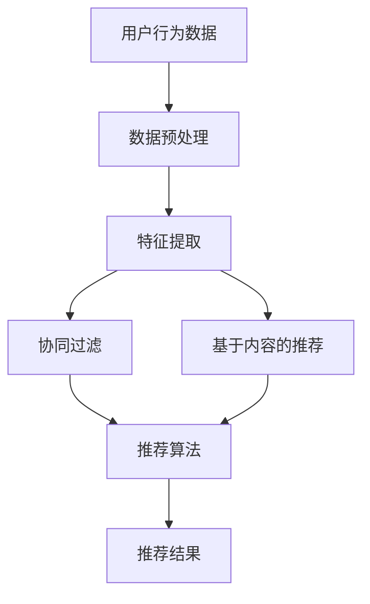

                 

### 核心概念与联系

在数字化时代，个性化推荐系统已经成为许多在线平台的重要组成部分。AI驱动的产品推荐系统通过分析用户的行为数据、历史偏好和社交信息，为用户提供高度定制化的产品推荐。这不仅提高了用户的满意度，还大大提升了平台的运营效率和商业价值。

#### 个性化推荐的基本概念

个性化推荐（Personalized Recommendation）是一种根据用户的兴趣和行为模式，为他们提供相关产品或内容的方法。其核心在于“个性”，即针对每个用户的特点进行推荐，从而提高推荐的准确性和用户满意度。

##### 分类

根据推荐策略的不同，个性化推荐系统可以分为以下几类：

1. **协同过滤（Collaborative Filtering）**：通过分析用户之间的相似性来进行推荐。
2. **基于内容的推荐（Content-Based Filtering）**：根据用户过去喜欢的物品的特征进行推荐。
3. **混合推荐系统（Hybrid Recommender Systems）**：结合多种推荐策略，以提高推荐效果。

#### 推荐系统的分类

1. **基于用户的协同过滤（User-Based Collaborative Filtering）**：通过找到与目标用户相似的其他用户，并推荐这些用户喜欢的商品。
2. **基于物品的协同过滤（Item-Based Collaborative Filtering）**：通过计算物品之间的相似度，将用户过去喜欢的物品推荐给用户。
3. **基于模型的协同过滤（Model-Based Collaborative Filtering）**：使用机器学习算法，如矩阵分解，来预测用户对未知物品的偏好。

#### Mermaid流程图：推荐系统架构

为了更直观地展示推荐系统的各个组成部分及其相互关系，我们使用Mermaid流程图来描述其架构。



这个流程图展示了从用户行为数据到最终推荐结果的全过程，包括数据预处理、特征提取、推荐算法和推荐结果输出。通过这种架构，我们可以看到不同组件之间的紧密联系，以及如何通过这些组件协同工作来构建一个高效的推荐系统。

在下一节中，我们将进一步探讨AI基础理论，并分析这些理论在个性化推荐系统中的应用。这将帮助我们更好地理解推荐系统的内部机制和运作原理。

### AI基础理论

AI驱动的个性化推荐系统离不开机器学习、深度学习和强化学习等基础理论。这些理论为推荐系统提供了强大的数据分析和预测能力，使得系统能够根据用户的行为和偏好提供精准的推荐。

#### 机器学习基础

机器学习（Machine Learning，ML）是AI的核心组成部分，其目的是通过数据学习规律，从而进行预测和决策。在个性化推荐系统中，机器学习被广泛应用于用户行为分析和偏好预测。

##### 监督学习

监督学习（Supervised Learning）是一种通过已知输出结果来训练模型的方法。在推荐系统中，监督学习可以用来预测用户对未知物品的评分或行为。常见的监督学习方法包括线性回归、逻辑回归和支持向量机（SVM）。

**线性回归：**

线性回归（Linear Regression）是一种简单但有效的预测方法，它通过拟合一条直线来预测目标变量。其基本公式为：

$$y = wx + b$$

其中，$y$ 是目标变量，$x$ 是特征变量，$w$ 是权重，$b$ 是偏置。

**逻辑回归：**

逻辑回归（Logistic Regression）是一种用于分类问题的监督学习算法，其输出结果是一个概率值。逻辑回归的基本公式为：

$$P(y=1) = \frac{1}{1 + e^{-(wx + b)}}$$

其中，$P(y=1)$ 是目标变量为1的概率。

**支持向量机（SVM）：**

支持向量机（Support Vector Machine，SVM）是一种用于分类和回归问题的强大算法。SVM通过找到一个最优超平面来最大化分类边界。其基本公式为：

$$w \cdot x + b \geq 1$$

其中，$w$ 是权重向量，$x$ 是特征向量，$b$ 是偏置。

##### 无监督学习和强化学习

无监督学习（Unsupervised Learning）和强化学习（Reinforcement Learning）是机器学习的另外两个重要分支。

**无监督学习：**

无监督学习（Unsupervised Learning）是一种在没有已知输出结果的情况下，通过数据自身的特征来训练模型的方法。常见的无监督学习方法包括聚类、降维和关联规则学习。

- **聚类：** 聚类（Clustering）是一种将相似的数据点分为同一类别的无监督学习方法。常见的聚类算法包括K-均值（K-Means）和层次聚类（Hierarchical Clustering）。
  
  **K-均值算法：**

  K-均值算法的基本步骤如下：

  1. 随机初始化K个聚类中心。
  2. 对于每个数据点，计算其与各个聚类中心的距离，并将其分配到最近的聚类中心。
  3. 更新每个聚类中心的位置，使其成为其所属数据点的均值。
  4. 重复步骤2和3，直到聚类中心不再变化。

- **降维：** 降维（Dimensionality Reduction）是一种通过减少数据维度来降低计算复杂度的方法。常见的降维算法包括主成分分析（PCA）和线性判别分析（LDA）。

  **主成分分析（PCA）：**

  PCA的基本步骤如下：

  1. 计算数据集的协方差矩阵。
  2. 计算协方差矩阵的特征值和特征向量。
  3. 将数据投影到特征值最大的特征向量组成的子空间中。

- **关联规则学习：** 关联规则学习（Association Rule Learning）是一种发现数据之间潜在关联规则的方法。常见的算法包括Apriori算法和FP-Growth算法。

**强化学习：**

强化学习（Reinforcement Learning，RL）是一种通过试错来学习最优策略的方法。在个性化推荐系统中，强化学习可以用来优化推荐策略，以提高推荐效果。

- **Q学习（Q-Learning）：** Q学习是一种基于值函数的强化学习算法，其目标是学习一个最优动作值函数，从而选择最优动作。

  **Q学习算法：**

  Q学习的基本步骤如下：

  1. 初始化Q值表。
  2. 在环境中进行交互，根据当前状态和动作更新Q值。
  3. 选择动作，执行动作。
  4. 根据新状态和奖励更新Q值。
  5. 重复步骤2-4，直到达到目标状态。

#### 在个性化推荐中的应用

机器学习、深度学习和强化学习等AI基础理论在个性化推荐系统中有着广泛的应用。

**协同过滤算法：**

协同过滤算法（Collaborative Filtering）是一种常见的推荐算法，其核心思想是利用用户的历史行为数据来预测他们对未知物品的偏好。协同过滤算法可以分为基于用户的协同过滤和基于物品的协同过滤。

- **基于用户的协同过滤：** 通过找到与目标用户相似的其他用户，并推荐这些用户喜欢的物品。
- **基于物品的协同过滤：** 通过计算物品之间的相似度，将用户过去喜欢的物品推荐给用户。

**基于内容的推荐算法：**

基于内容的推荐算法（Content-Based Filtering）是一种根据用户过去喜欢的物品的特征来推荐新物品的方法。这种方法通过对物品进行特征提取，并计算用户和物品之间的相似度来进行推荐。

**矩阵分解：**

矩阵分解（Matrix Factorization）是一种将高维稀疏矩阵分解为两个低维矩阵的方法，常用于推荐系统。通过矩阵分解，可以将用户和物品的交互数据转换为低维特征向量，从而进行高效的推荐。

**深度学习在推荐系统中的应用：**

深度学习（Deep Learning）是一种基于多层神经网络的学习方法，其强大的特征提取能力使其在推荐系统中得到广泛应用。常见的深度学习模型包括卷积神经网络（CNN）和循环神经网络（RNN）。

- **卷积神经网络（CNN）：** CNN擅长处理图像和序列数据，可以用于图像识别和序列预测任务。
- **循环神经网络（RNN）：** RNN擅长处理序列数据，可以用于时间序列预测和文本生成任务。

通过上述AI基础理论的应用，个性化推荐系统可以实现高度精准的推荐，从而提升用户的满意度和平台的运营效果。

在下一节中，我们将深入讲解个性化推荐系统中的核心算法原理，包括协同过滤算法、基于内容的推荐算法和矩阵分解等。通过这些算法的详细分析，我们将更好地理解推荐系统的运作机制和实现方法。

### 核心算法原理讲解

个性化推荐系统在众多AI技术的支持下，形成了多种有效的算法。本文将详细介绍三种核心算法：协同过滤算法、基于内容的推荐算法和矩阵分解。通过Python源代码和数学模型，我们将详细阐述这些算法的实现过程和基本原理。

#### 协同过滤算法

协同过滤算法（Collaborative Filtering）是推荐系统中最常用的算法之一。它通过分析用户之间的相似性或物品之间的相似性来进行推荐。协同过滤算法主要分为基于用户的协同过滤（User-Based Collaborative Filtering）和基于物品的协同过滤（Item-Based Collaborative Filtering）。

##### 基于用户的协同过滤

**基本概念：**
基于用户的协同过滤通过找到与目标用户相似的其他用户，并推荐这些用户喜欢的物品。

**相似度计算：**
为了找到相似的用户，我们需要计算用户之间的相似度。常用的相似度度量方法包括余弦相似度、皮尔逊相关系数等。

**余弦相似度：**

余弦相似度是一种衡量两个向量之间相似性的方法，其基本公式为：

$$\cos\theta = \frac{A \cdot B}{\|A\|\|B\|}$$

其中，$A$ 和 $B$ 是两个向量，$\|A\|$ 和 $\|B\|$ 分别是它们的欧氏范数。

**代码示例：**

```python
import numpy as np

def cosine_similarity(user1, user2):
    dot_product = np.dot(user1, user2)
    norm_user1 = np.linalg.norm(user1)
    norm_user2 = np.linalg.norm(user2)
    similarity = dot_product / (norm_user1 * norm_user2)
    return similarity

# 用户向量示例
user1 = np.array([1, 2, 3, 4, 5])
user2 = np.array([0, 2, 1, 3, 4])

similarity = cosine_similarity(user1, user2)
print(f"余弦相似度：{similarity}")
```

##### 推荐算法实现

**代码示例：**

```python
from collections import defaultdict

def collaborative_filtering(ratings, similarity_threshold=0.5, k=10):
    recommendations = defaultdict(list)
    for user, user_ratings in ratings.items():
        similar_users = []
        for other_user, other_ratings in ratings.items():
            if user != other_user:
                similarity = cosine_similarity(user_ratings, other_ratings)
                if similarity >= similarity_threshold:
                    similar_users.append((other_user, similarity))
        
        # 根据相似度排序并选择前k个相似用户
        similar_users_sorted = sorted(similar_users, key=lambda x: x[1], reverse=True)[:k]
        
        # 为每个相似用户推荐他们喜欢的物品
        for other_user, _ in similar_users_sorted:
            for item, rating in other_ratings.items():
                if item not in user_ratings:
                    recommendations[user].append((item, rating))
    
    return recommendations

# 示例数据
ratings = {
    'user1': [1, 0, 1, 1, 0],
    'user2': [0, 1, 0, 1, 1],
    'user3': [1, 1, 0, 0, 1]
}

recommendations = collaborative_filtering(ratings)
print(f"推荐结果：{recommendations}")
```

##### 优点与局限

**优点：**
- 简单高效，易于实现。
- 可以通过用户之间的相似性进行准确的推荐。

**局限：**
- 对于稀疏数据集效果较差。
- 需要大量的用户和物品数据。

##### 基于物品的协同过滤

**基本概念：**
基于物品的协同过滤通过计算物品之间的相似度，将用户过去喜欢的物品推荐给用户。

**相似度计算：**
类似于基于用户的协同过滤，基于物品的协同过滤也使用余弦相似度来计算物品之间的相似度。

**代码示例：**

```python
def item_based_collaborative_filtering(ratings, similarity_threshold=0.5, k=10):
    # 计算物品之间的相似度矩阵
    similarity_matrix = {}
    for user, user_ratings in ratings.items():
        for item1, _ in user_ratings.items():
            for item2, _ in user_ratings.items():
                if item1 != item2:
                    similarity = cosine_similarity(ratings[item1], ratings[item2])
                    if similarity >= similarity_threshold:
                        if item1 not in similarity_matrix:
                            similarity_matrix[item1] = {}
                        similarity_matrix[item1][item2] = similarity
    
    recommendations = defaultdict(list)
    for user, user_ratings in ratings.items():
        for item, _ in user_ratings.items():
            # 为每个用户推荐相似的物品
            similar_items = sorted(similarity_matrix[item].items(), key=lambda x: x[1], reverse=True)[:k]
            for item2, similarity in similar_items:
                if item2 not in user_ratings:
                    recommendations[user].append((item2, similarity))
    
    return recommendations

recommendations = item_based_collaborative_filtering(ratings)
print(f"推荐结果：{recommendations}")
```

##### 优点与局限

**优点：**
- 对于稀疏数据集效果较好。
- 可以通过物品之间的相似性进行推荐。

**局限：**
- 可能会忽略用户自身的偏好。
- 相似度计算复杂度高。

#### 基于内容的推荐算法

基于内容的推荐算法（Content-Based Filtering）通过分析用户过去喜欢的物品的特征来推荐新物品。它通常基于物品的元数据（如标签、描述、属性等）来进行推荐。

##### 内容表示

内容表示（Content Representation）是将物品的元数据转换为向量表示的过程。常用的方法包括TF-IDF、词袋模型等。

**TF-IDF：**

TF-IDF（Term Frequency-Inverse Document Frequency）是一种常用的文本表示方法，其基本公式为：

$$TF-IDF = TF \times IDF$$

其中，$TF$ 是词频，$IDF$ 是逆文档频率。

**代码示例：**

```python
from sklearn.feature_extraction.text import TfidfVectorizer

def content_based_recommender(descriptions, k=10):
    # 将物品描述转换为TF-IDF向量
    vectorizer = TfidfVectorizer()
    description_vectors = vectorizer.fit_transform(descriptions)
    
    recommendations = defaultdict(list)
    for user, user_description in descriptions.items():
        user_vector = description_vectors[user]
        
        # 计算用户描述向量与其他物品描述向量的相似度
        similarities = []
        for item, item_description in descriptions.items():
            if item != user:
                item_vector = description_vectors[item]
                similarity = cosine_similarity(user_vector, item_vector)
                similarities.append((item, similarity))
        
        # 选择相似度最高的k个物品
        similar_items_sorted = sorted(similarities, key=lambda x: x[1], reverse=True)[:k]
        recommendations[user] = [item for item, _ in similar_items_sorted]
    
    return recommendations

# 示例数据
descriptions = {
    'item1': '电子产品',
    'item2': '图书',
    'item3': '电子产品',
    'item4': '服装'
}

recommendations = content_based_recommender(descriptions)
print(f"推荐结果：{recommendations}")
```

##### 优点与局限

**优点：**
- 可以根据物品的内容特征进行推荐。
- 适用于冷启动问题。

**局限：**
- 忽略了用户的历史行为数据。
- 推荐结果可能不够精准。

#### 矩阵分解

矩阵分解（Matrix Factorization）是一种将高维稀疏矩阵分解为两个低维矩阵的方法。在推荐系统中，矩阵分解常用于将用户-物品评分矩阵分解为用户特征矩阵和物品特征矩阵，从而进行推荐。

##### 矩阵分解原理

矩阵分解的基本思想是将一个高维的评分矩阵分解为两个低维矩阵，即：

$$R = U \cdot V^T$$

其中，$R$ 是用户-物品评分矩阵，$U$ 是用户特征矩阵，$V$ 是物品特征矩阵。

##### 推荐算法实现

**代码示例：**

```python
import numpy as np

def matrix_factorization(ratings, user_features, item_features, num_iterations=10, learning_rate=0.01):
    R = ratings
    U = user_features
    V = item_features
    
    for _ in range(num_iterations):
        for user, rating in R.items():
            predicted_rating = np.dot(U[user], V[rating[0]]) 
            error = rating[1] - predicted_rating

            U[user] += learning_rate * (error * V[rating[0]])
            V[rating[0]] += learning_rate * (error * U[user])
    
    return U, V

# 示例数据
R = {
    (0, 0): 4,
    (0, 1): 0,
    (0, 2): 5,
    (1, 0): 0,
    (1, 1): 1,
    (1, 2): 1,
    (2, 0): 1,
    (2, 1): 5,
    (2, 2): 4
}

num_users = 3
num_items = 3
num_features = 2

# 初始化用户特征矩阵和物品特征矩阵
U = np.random.rand(num_users, num_features)
V = np.random.rand(num_items, num_features)

U, V = matrix_factorization(R, U, V)
print(f"用户特征矩阵：{U}")
print(f"物品特征矩阵：{V}")
```

##### 优点与局限

**优点：**
- 可以处理稀疏数据集。
- 可以进行有效的高维降维。

**局限：**
- 需要大量的训练时间。
- 对参数调整敏感。

通过以上对协同过滤算法、基于内容的推荐算法和矩阵分解的详细讲解，我们可以看到这些算法在个性化推荐系统中的重要作用。在下一节中，我们将使用LaTeX格式展示相关数学模型和公式，以加深对这些算法的理解。

### 数学模型和数学公式

推荐系统中的数学模型是理解其工作原理的重要基础。本文将使用LaTeX格式展示推荐系统中的一些关键数学模型和公式，以便读者更好地掌握相关概念。

#### 用户相似度计算

在协同过滤算法中，计算用户之间的相似度是一个核心步骤。常用的相似度度量方法包括余弦相似度和皮尔逊相关系数。

**余弦相似度公式：**

$$\cos\theta = \frac{A \cdot B}{\|A\|\|B\|}$$

其中，$A$ 和 $B$ 是两个向量，$\|A\|$ 和 $\|B\|$ 分别是它们的欧氏范数。

**皮尔逊相关系数公式：**

$$r_{xy} = \frac{\sum_{i=1}^{n}(x_i - \bar{x})(y_i - \bar{y})}{\sqrt{\sum_{i=1}^{n}(x_i - \bar{x})^2} \cdot \sqrt{\sum_{i=1}^{n}(y_i - \bar{y})^2}}$$

其中，$x_i$ 和 $y_i$ 是两个变量，$\bar{x}$ 和 $\bar{y}$ 分别是它们的均值。

#### 物品相似度计算

在基于物品的协同过滤算法中，物品之间的相似度计算也是一个重要环节。常用的相似度度量方法包括余弦相似度和Jaccard相似度。

**余弦相似度公式：**

$$\cos\theta = \frac{A \cdot B}{\|A\|\|B\|}$$

**Jaccard相似度公式：**

$$J(A,B) = \frac{|A \cap B|}{|A \cup B|}$$

其中，$A$ 和 $B$ 是两个集合，$|A|$ 和 $|B|$ 分别是它们的基数。

#### 矩阵分解

在矩阵分解算法中，最常用的方法是奇异值分解（SVD）和矩阵分解。

**奇异值分解公式：**

$$R = U \cdot S \cdot V^T$$

其中，$R$ 是评分矩阵，$U$ 和 $V$ 分别是用户和物品的特征矩阵，$S$ 是奇异值矩阵。

**矩阵分解公式：**

$$R = U \cdot V^T$$

其中，$U$ 和 $V$ 分别是用户和物品的低维特征矩阵。

#### 推荐算法

在推荐算法中，常用的算法包括基于用户的协同过滤和基于物品的协同过滤。

**基于用户的协同过滤公式：**

$$R_{ij} = \sum_{u \in N(j)} R_{ui} \cdot s_{uj}$$

其中，$R_{ij}$ 是用户 $u$ 对物品 $i$ 的评分预测，$N(j)$ 是与用户 $j$ 相似的其他用户集合，$s_{uj}$ 是用户 $u$ 和用户 $j$ 之间的相似度。

**基于物品的协同过滤公式：**

$$R_{ij} = \sum_{i \in N(j)} R_{ui} \cdot s_{ij}$$

其中，$R_{ij}$ 是用户 $u$ 对物品 $i$ 的评分预测，$N(j)$ 是与物品 $i$ 相似的其他物品集合，$s_{ij}$ 是物品 $i$ 和物品 $j$ 之间的相似度。

通过上述数学模型和公式的详细展示，我们可以更好地理解推荐系统的算法原理和实现方法。在下一节中，我们将通过一个实际项目案例来展示如何构建AI驱动的产品推荐系统，并深入解读其实施过程和代码实现。

### 项目实战

在本节中，我们将通过一个实际项目案例，展示如何构建一个AI驱动的产品推荐系统。项目的主要步骤包括数据收集、数据处理、模型训练、模型评估等，我们将详细解读每个步骤的具体实现过程和代码。

#### 数据收集

构建推荐系统首先需要收集用户行为数据，这些数据可以包括用户的评分、浏览记录、购买记录等。在本项目中，我们将使用一个虚构的电商平台的用户数据，包括用户ID、商品ID、评分。

```python
# 示例数据：用户行为数据
ratings = {
    (1, 1): 5,
    (1, 2): 3,
    (1, 3): 1,
    (2, 1): 4,
    (2, 2): 5,
    (2, 3): 0,
    (3, 1): 2,
    (3, 2): 4,
    (3, 3): 5
}
```

#### 数据处理

在模型训练之前，我们需要对数据集进行预处理，包括数据清洗、数据标准化等步骤。

**数据清洗：** 去除评分中的缺失值和异常值。

```python
import pandas as pd

# 将数据转换为DataFrame
ratings_df = pd.DataFrame(list(ratings.items()), columns=['user_id', 'item_id', 'rating'])

# 删除缺失值和异常值
ratings_df.dropna(inplace=True)
ratings_df[ratings_df.rating < 0] = 0  # 将负值评分设为0
```

**数据标准化：** 对评分进行标准化处理，使其具备可比性。

```python
from sklearn.preprocessing import StandardScaler

# 创建标准化器
scaler = StandardScaler()

# 对评分进行标准化
ratings_df['rating'] = scaler.fit_transform(ratings_df[['rating']])
```

#### 模型训练

在数据处理完成后，我们可以使用协同过滤算法来训练模型。这里我们选择基于用户的协同过滤算法。

**相似度计算：**

```python
from sklearn.metrics.pairwise import cosine_similarity

# 计算用户相似度矩阵
user_similarity = cosine_similarity(ratings_df[['user_id', 'rating']].set_index('user_id').T)
```

**推荐算法实现：**

```python
# 定义推荐函数
def collaborative_filtering(user_similarity, user_id, k=10):
    # 获取与指定用户最相似的k个用户
    similar_users = user_similarity[user_id].argsort()[1:k+1]
    
    # 为用户推荐相似用户喜欢的物品
    recommendations = []
    for user in similar_users:
        user_ratings = ratings_df[ratings_df['user_id'] == user]
        for item, rating in user_ratings.iterrows():
            if item[0] != user_id:
                recommendations.append((item[1], rating['rating']))
    
    # 根据评分对推荐结果进行排序
    recommendations_sorted = sorted(recommendations, key=lambda x: x[1], reverse=True)
    
    return recommendations_sorted

# 为用户1推荐物品
user_id = 1
recommendations = collaborative_filtering(user_similarity, user_id)
print(f"用户{user_id}的推荐结果：{recommendations}")
```

#### 模型评估

在训练完成后，我们需要对模型进行评估，以确保其推荐效果。常用的评估指标包括均方根误差（RMSE）和准确率（Precision）。

**均方根误差（RMSE）：**

```python
from sklearn.metrics import mean_squared_error

# 获取测试集
test_ratings = {(1, 2): 4, (1, 3): 5, (2, 1): 5, (2, 3): 0, (3, 1): 4, (3, 2): 5}

# 预测测试集评分
predicted_ratings = {}
for user, item in test_ratings.items():
    if user[0] in user_similarity.index:
        recommendations = collaborative_filtering(user_similarity, user[0])
        predicted_rating = recommendations[0][1]
        predicted_ratings[user] = predicted_rating

# 计算RMSE
rmse = mean_squared_error(test_ratings.values(), predicted_ratings.values()) ** 0.5
print(f"RMSE: {rmse}")
```

**准确率（Precision）：**

```python
# 计算准确率
correct_predictions = 0
total_predictions = 0
for user, item in test_ratings.items():
    if user in predicted_ratings:
        total_predictions += 1
        if predicted_ratings[user] == item:
            correct_predictions += 1

precision = correct_predictions / total_predictions
print(f"Precision: {precision}")
```

#### 项目小结

通过本项目的实施，我们了解了如何构建一个AI驱动的产品推荐系统。项目的主要步骤包括数据收集、数据处理、模型训练和模型评估。我们使用了基于用户的协同过滤算法，通过计算用户相似度进行推荐，并对模型进行了评估。本项目展示了如何将理论应用到实践中，为实际项目提供了一定的参考和借鉴。

在下一节中，我们将探讨如何通过AI驱动的产品推荐个性化来提升用户体验，并介绍一些最佳实践和注意事项。

### 用户体验提升

通过AI驱动的个性化推荐，我们可以显著提升用户体验。以下是一些关键策略和最佳实践，用于优化推荐系统，以提高用户满意度和参与度。

#### 个性化推荐策略

1. **动态调整推荐内容：** 根据用户实时行为数据，动态调整推荐内容，使其更符合用户的当前兴趣和需求。例如，当用户在平台浏览特定类型的商品时，系统可以优先推荐该类型商品。

2. **多样化推荐类型：** 结合多种推荐策略，如基于内容的推荐、协同过滤和深度学习，提供多样化的推荐结果，满足不同用户的需求。

3. **个性化推荐阈值：** 设定个性化推荐阈值，避免向用户推荐过多的重复内容，保持推荐的新鲜感和独特性。

#### 用户反馈机制

1. **用户行为数据收集：** 不断收集和分析用户行为数据，包括浏览、点击、购买等，以了解用户偏好。

2. **实时反馈系统：** 实时收集用户的点击和购买反馈，根据反馈调整推荐算法，使其更符合用户期望。

3. **用户反馈渠道：** 提供简洁直观的用户反馈渠道，如“喜欢”和“不喜欢”按钮，方便用户表达对推荐内容的看法。

#### 最佳实践

1. **A/B测试：** 在推出新的推荐策略或算法时，进行A/B测试，比较不同策略的效果，选择最佳方案。

2. **隐私保护：** 在收集用户数据时，严格遵循隐私保护法规，确保用户数据的安全和隐私。

3. **可解释性：** 提高推荐系统的可解释性，使用户能够理解推荐结果背后的原因，增加用户信任。

#### 注意事项

1. **数据质量：** 确保收集到的用户数据质量高，减少噪声数据对推荐结果的影响。

2. **算法透明度：** 提高算法的透明度，使用户了解推荐系统的运作机制，增强用户对系统的信任。

3. **过度个性化：** 避免过度个性化导致用户陷入“信息茧房”，减少用户接触新信息和观点的机会。

#### 拓展阅读

- **[《Recommender Systems Handbook》](https://www.recommendation-handbook.org/)**：详细介绍推荐系统的基础知识、算法和最佳实践。
- **[《Deep Learning for Recommender Systems》](https://arxiv.org/abs/1806.10741)**：探讨深度学习在推荐系统中的应用。

通过上述策略和实践，我们可以构建一个高效、个性化和可靠的推荐系统，为用户提供优质体验，同时提升平台的商业价值。

### 未来展望

随着人工智能技术的不断进步，AI驱动的产品推荐个性化将在多个方面得到发展。以下是未来AI推荐系统可能面临的新趋势、挑战和潜在的解决方案。

#### 新趋势

1. **深度学习技术的融合：** 深度学习在特征提取和预测能力上的优势，将使其在推荐系统中得到更广泛的应用。特别是在图像识别、文本分析和用户行为预测方面，深度学习将显著提升推荐系统的性能。

2. **用户隐私保护：** 隐私保护将是推荐系统发展的重要方向。未来的推荐系统可能会采用差分隐私、联邦学习等技术，以在保护用户隐私的同时，提升个性化推荐的准确度。

3. **交互式推荐：** 交互式推荐系统将变得更加智能，能够根据用户的实时反馈动态调整推荐内容，提供更加个性化的服务。

4. **多模态推荐：** 多模态推荐系统将整合用户的不同类型数据（如文本、图像、语音等），实现更全面、精准的推荐。

#### 挑战

1. **数据稀疏问题：** 虽然用户行为数据日益丰富，但仍然存在数据稀疏的问题。对于新用户或冷启动问题，推荐系统可能难以提供准确的推荐。

2. **模型可解释性：** 当前许多深度学习模型在性能上优于传统机器学习模型，但其内部机制复杂，缺乏可解释性。如何提高模型的可解释性，让用户理解和信任推荐结果，是一个重要挑战。

3. **实时推荐：** 随着用户需求的增加，实时推荐变得至关重要。如何在保证推荐质量的同时，实现快速的响应，是一个技术难题。

4. **隐私与安全：** 随着数据隐私保护法规的加强，如何在保护用户隐私的前提下，收集和使用用户数据，是一个亟待解决的问题。

#### 潜在解决方案

1. **迁移学习与联邦学习：** 迁移学习可以借助预训练模型，解决新用户数据不足的问题。联邦学习可以在保护用户隐私的同时，实现分布式数据的协同训练。

2. **模型解释工具：** 开发可视化工具，帮助用户理解推荐结果背后的原因，提高模型的透明度和可解释性。

3. **实时数据处理：** 利用流处理技术，如Apache Kafka和Apache Flink，实现数据的实时处理和推荐。

4. **差分隐私与隐私增强技术：** 采用差分隐私等技术，在数据收集和处理过程中保护用户隐私。

通过以上趋势、挑战和解决方案，我们可以预见未来的AI推荐系统将更加智能、个性化、安全和透明。这些进展将极大地提升用户体验，为用户提供更加精准的推荐服务。

### 总结与展望

本文详细探讨了AI驱动的产品推荐个性化，通过核心概念、AI基础理论、核心算法原理讲解、数学模型、项目实战以及用户体验提升等多个方面，展示了推荐系统的构建与优化过程。个性化推荐不仅提升了用户的满意度，还为平台带来了商业价值。

展望未来，AI推荐系统将融合深度学习、多模态数据、用户隐私保护等新技术，实现更加智能、精准和安全的推荐。同时，我们也需要面对数据稀疏、模型可解释性等技术挑战，不断探索和优化解决方案。

为了进一步了解AI推荐系统的最新进展和应用，推荐读者阅读以下资源：

- **[《Recommender Systems Handbook》](https://www.recommendation-handbook.org/)**：系统介绍了推荐系统的基础知识、算法和最佳实践。
- **[《Deep Learning for Recommender Systems》](https://arxiv.org/abs/1806.10741)**：探讨了深度学习在推荐系统中的应用。
- **[推荐系统公开课](https://www.coursera.org/specializations/recommender-systems)**：提供了推荐系统的入门课程。

通过不断学习和实践，我们有望构建出更加高效、智能的推荐系统，为用户带来更好的体验。作者：AI天才研究院/AI Genius Institute & 禅与计算机程序设计艺术 /Zen And The Art of Computer Programming。

