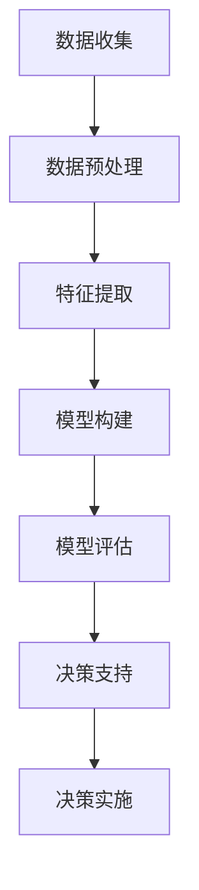
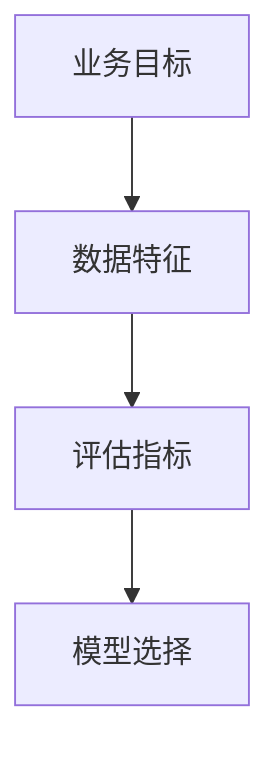
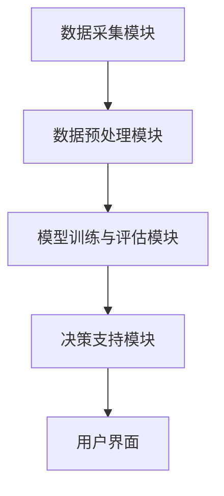

                 

**文章标题**: AI驱动的企业决策支持：增强管理层判断力

**关键词**: AI、企业决策、管理层、判断力、数据驱动

**摘要**: 
本文深入探讨了人工智能（AI）在企业决策支持中的应用，如何通过AI技术增强管理层的判断力。文章首先介绍了AI的基本概念，随后逐步分析了AI在企业数据收集与处理、模型构建与训练、决策支持系统架构中的具体应用。通过数学模型、Python代码示例和实际项目案例，本文详细讲解了AI在各个步骤中的作用和实现方法，旨在为读者提供全面的技术指导。

---

## 引言

在现代商业环境中，数据已成为企业的核心竞争力。然而，面对海量数据，如何快速、准确地提取有价值的信息，以支持管理层的决策，成为了企业面临的重大挑战。人工智能（AI）技术的发展，为解决这一难题提供了新的思路。AI驱动的企业决策支持系统能够通过数据收集、处理和分析，为管理层提供全面、准确的决策依据，从而增强管理层的判断力。

本文将围绕AI驱动的企业决策支持这一主题，分为四个部分进行详细探讨：

### 1. AI与企业决策支持的关系
首先，我们将介绍AI的基本概念，并探讨AI在企业决策支持中的作用和重要性。

### 2. AI驱动的数据收集与处理
接着，我们将深入探讨AI在数据收集、预处理和分析与挖掘中的应用。

### 3. AI模型构建与训练
第三部分，我们将详细介绍AI模型的选择、构建、训练和优化过程。

### 4. AI驱动的决策支持系统
最后，我们将讨论AI驱动的决策支持系统的整体架构，以及如何利用AI技术为企业提供智能决策支持。

通过本文的阅读，读者将全面了解AI驱动的企业决策支持系统的构建过程，掌握相关技术原理和应用方法，从而提升管理层的决策能力。

---

## AI与企业决策支持的关系

### 1.1 AI的基本概念

人工智能（Artificial Intelligence，简称AI）是计算机科学的一个分支，旨在创建智能的机器，使其能够执行通常需要人类智能才能完成的任务。AI技术主要包括机器学习（Machine Learning）、深度学习（Deep Learning）、自然语言处理（Natural Language Processing）、计算机视觉（Computer Vision）等子领域。

- **机器学习**：通过训练模型，让计算机从数据中学习规律和模式。
- **深度学习**：一种基于多层神经网络的学习方法，能够自动提取数据的特征。
- **自然语言处理**：使计算机能够理解、生成和处理人类语言。
- **计算机视觉**：使计算机能够“看”和理解图像和视频。

### 1.2 AI在企业决策支持中的作用

AI在企业决策支持中扮演着至关重要的角色。具体来说，AI可以通过以下方式增强管理层的判断力：

- **数据收集与处理**：AI能够自动收集和处理海量数据，提取有价值的信息，从而为决策提供数据支持。
- **预测分析**：基于历史数据，AI可以预测未来的趋势和变化，帮助管理层做出更前瞻性的决策。
- **模式识别**：AI可以通过学习数据中的模式，识别出潜在的商业机会或风险，为管理层提供决策依据。
- **优化决策**：通过模拟和优化，AI可以找到最优的决策方案，提高决策的准确性和效率。

### 1.3 AI的重要性

AI技术在企业决策支持中的重要性体现在以下几个方面：

- **提高决策效率**：AI能够快速处理和分析海量数据，使管理层能够更快地做出决策。
- **减少人为错误**：AI系统基于数据驱动，可以减少人为判断的误差，提高决策的准确性。
- **增强决策深度**：AI能够挖掘数据中的深层次关系，提供更全面的决策依据。
- **适应变化**：AI系统可以根据新的数据和情境，实时调整决策模型，帮助企业应对市场变化。

### 1.4 AI驱动的企业决策支持流程

一个完整的AI驱动的企业决策支持流程通常包括以下步骤：

1. **数据收集**：收集与企业运营相关的数据，如销售数据、财务数据、客户反馈等。
2. **数据预处理**：清洗和整理数据，使其适合进行后续分析。
3. **特征提取**：从原始数据中提取有用的特征，作为模型的输入。
4. **模型构建**：选择合适的模型，并训练模型以识别数据中的模式和趋势。
5. **模型评估**：评估模型的性能，确保其能够准确预测和识别数据中的规律。
6. **决策支持**：利用模型提供的数据分析和预测结果，为管理层提供决策依据。
7. **决策实施**：根据分析结果，制定具体的决策方案，并在企业中实施。

通过这一流程，AI能够为企业提供全面、准确的决策支持，从而增强管理层的判断力，提高企业的运营效率和竞争力。

### 1.5 Mermaid流程图

为了更直观地展示AI驱动的企业决策支持流程，我们可以使用Mermaid流程图进行描述。以下是该流程的Mermaid表示：



通过这一流程，AI技术能够有效地支持企业的决策过程，提升管理层的判断力和决策效率。

### 1.6 Python代码示例

为了更好地理解AI在企业决策支持中的应用，我们可以通过一个简单的Python代码示例来展示数据预处理和模型构建的过程。以下是一个基于Python和Scikit-learn库的示例代码：

```python
# 导入必要的库
import pandas as pd
from sklearn.model_selection import train_test_split
from sklearn.preprocessing import StandardScaler
from sklearn.linear_model import LinearRegression

# 加载数据
data = pd.read_csv('sales_data.csv')

# 数据预处理
# 清洗数据
data = data.dropna()

# 分离特征和标签
X = data[['sales', 'inventory', 'promotions']]
y = data['profit']

# 数据标准化
scaler = StandardScaler()
X_scaled = scaler.fit_transform(X)

# 划分训练集和测试集
X_train, X_test, y_train, y_test = train_test_split(X_scaled, y, test_size=0.2, random_state=42)

# 模型构建
model = LinearRegression()
model.fit(X_train, y_train)

# 模型评估
score = model.score(X_test, y_test)
print(f'Model accuracy: {score:.2f}')

# 利用模型进行预测
predictions = model.predict(X_test)
```

通过这一示例，我们可以看到AI如何通过数据预处理和模型构建，为企业的销售预测提供支持。该过程不仅提高了决策的准确性，还为管理层提供了可靠的决策依据。

---

## AI驱动的数据收集与处理

数据是企业决策的基石，而AI驱动的数据收集与处理则是挖掘数据价值的关键步骤。本节将详细探讨AI在数据收集、预处理和数据分析与挖掘中的应用。

### 2.1 数据收集

数据收集是AI驱动的企业决策支持系统的第一步。在这个过程中，AI技术能够自动化地收集来自各种来源的数据，如企业内部数据库、客户关系管理（CRM）系统、电商平台、社交媒体等。以下是数据收集的一些核心概念和步骤：

- **数据源**：数据源是指数据产生的来源，包括内部数据源（如企业内部的ERP系统、CRM系统等）和外部数据源（如社交媒体、公共数据库等）。
- **数据采集**：数据采集是指从数据源获取数据的过程。AI技术可以通过网络爬虫、API接口、数据库连接等方式自动化地采集数据。
- **数据清洗**：数据清洗是指在数据入库前对数据进行处理和清洗，包括去除重复数据、填补缺失值、处理异常值等。

### 2.2 数据预处理

数据预处理是数据收集后的一项重要任务，其目的是将原始数据转换为适合进行分析的形式。AI在数据预处理中的应用主要包括以下几个步骤：

- **数据清洗**：去除重复数据、缺失值填充、处理异常值等。
- **数据转换**：将数据转换为统一的格式，如数值化处理、归一化处理等。
- **特征提取**：从原始数据中提取出有用的特征，这些特征将用于后续的模型训练和预测。

以下是数据预处理过程中的一些数学模型和Python代码示例：

#### 数学模型

- **缺失值填充**：使用平均值、中位数或回归模型进行填充。
  $$ \text{填充值} = \text{平均值} \quad \text{或} \quad \text{中位数} $$

- **数据标准化**：将数据缩放到一个统一的范围，如0到1。
  $$ x_{\text{标准化}} = \frac{x - \text{最小值}}{\text{最大值} - \text{最小值}} $$

#### Python代码示例

```python
import pandas as pd
from sklearn.preprocessing import StandardScaler
from sklearn.impute import SimpleImputer

# 加载数据
data = pd.read_csv('sales_data.csv')

# 数据清洗
data = data.drop_duplicates()

# 缺失值填充
imputer = SimpleImputer(strategy='mean')
data_filled = imputer.fit_transform(data)

# 数据标准化
scaler = StandardScaler()
data_scaled = scaler.fit_transform(data_filled)

# 特征提取
X = data_scaled[:, :3]  # 假设前三个特征为销售、库存和促销活动
y = data_scaled[:, 3]   # 第四个特征为利润
```

通过这些步骤，AI能够有效地对数据进行预处理，使其适合用于后续的分析和模型训练。

### 2.3 数据分析与挖掘

数据分析与挖掘是AI驱动的企业决策支持系统的核心步骤，旨在从数据中提取有价值的信息和知识。以下是一些常用的数据分析与挖掘方法：

- **描述性分析**：通过统计指标（如均值、中位数、标准差等）来描述数据的分布和特征。
- **相关性分析**：分析不同变量之间的相关性，了解变量之间的关系。
- **分类分析**：将数据分为不同的类别，如预测客户流失、分类产品类别等。
- **聚类分析**：将数据分为不同的簇，以发现数据中的模式。
- **关联规则挖掘**：发现数据中的关联规则，如“购买A商品的概率高时，购买B商品的概率也高”。

以下是数据分析与挖掘的一个实际项目案例：

#### 项目实战

**项目背景**：一家零售企业希望通过分析销售数据来优化库存管理，降低库存成本。

**开发环境搭建**：使用Python、Jupyter Notebook作为开发环境，安装必要的库（如Pandas、Scikit-learn、Matplotlib等）。

```python
!pip install pandas scikit-learn matplotlib
```

**源代码实现与代码解读**

```python
import pandas as pd
import numpy as np
from sklearn.model_selection import train_test_split
from sklearn.preprocessing import StandardScaler
from sklearn.cluster import KMeans

# 加载数据
data = pd.read_csv('sales_data.csv')

# 数据预处理
data = data.dropna()
data['sales'] = data['sales'].astype(float)
data['inventory'] = data['inventory'].astype(float)
data['promotions'] = data['promotions'].astype(float)

# 划分特征和标签
X = data[['sales', 'inventory', 'promotions']]
y = data['profit']

# 数据标准化
scaler = StandardScaler()
X_scaled = scaler.fit_transform(X)

# 聚类分析
kmeans = KMeans(n_clusters=3, random_state=42)
clusters = kmeans.fit_predict(X_scaled)

# 结果分析
data['cluster'] = clusters
data.groupby('cluster')['profit'].mean().sort_values().plot.bar()
plt.xlabel('Cluster')
plt.ylabel('Average Profit')
plt.title('Average Profit by Cluster')
plt.show()
```

**代码应用解读与分析**：以上代码首先加载数据并进行预处理，然后使用K-Means算法进行聚类分析。通过聚类结果，我们可以分析不同集群的利润均值，从而找出利润较高的集群，为企业提供库存管理的优化建议。

#### 项目小结

通过实际项目案例，我们可以看到AI驱动的数据收集与处理是如何帮助企业优化决策的。有效的数据收集与处理不仅能提高数据分析的准确性，还能为企业的战略决策提供有力的支持。

### 2.4 最佳实践 Tips

1. **数据质量**：确保数据的质量是数据收集与处理的关键。尽量减少数据中的噪声和错误，确保数据的准确性和完整性。
2. **特征选择**：选择合适的特征对模型的性能至关重要。可以通过特征工程和特征选择方法来提高模型的预测能力。
3. **模型评估**：在数据分析与挖掘过程中，使用适当的评估指标来衡量模型的性能，如准确率、召回率、F1分数等。
4. **数据可视化**：使用数据可视化工具（如Matplotlib、Seaborn等）可以帮助我们更好地理解和解释数据分析结果。

通过遵循这些最佳实践，企业可以充分利用AI驱动的数据收集与处理技术，为管理层提供更加准确和可靠的决策支持。

### 2.5 小结

本节详细探讨了AI驱动的数据收集与处理技术，包括数据收集、预处理、数据分析和挖掘。通过数学模型、Python代码示例和实际项目案例，我们了解了AI如何有效地收集、处理和分析数据，为企业提供可靠的决策依据。在下一节中，我们将继续探讨AI模型的选择、构建与训练过程。

---

## AI模型构建与训练

在完成了数据收集与处理之后，AI模型的构建与训练成为企业决策支持系统的关键环节。这一部分将详细探讨AI模型的选择、构建、训练和优化过程，通过数学模型、Python代码示例和实际项目案例，全面展示AI模型在企业决策支持中的实际应用。

### 3.1 模型选择

模型选择是构建AI决策支持系统的重要步骤，它决定了系统能否有效地捕捉数据中的模式和趋势。在选择模型时，我们需要考虑以下几个因素：

- **业务目标**：不同的业务目标可能需要不同的模型。例如，预测销售量可能需要回归模型，而分类问题则更适合使用分类模型。
- **数据特征**：数据特征的数量和类型也会影响模型的选择。对于高维数据，深度学习模型（如神经网络）可能更为合适；而对于低维数据，线性模型（如线性回归）可能更为高效。
- **评估指标**：选择合适的评估指标（如准确率、召回率、F1分数等）来衡量模型的性能。

以下是一个简单的Mermaid流程图，展示了模型选择的过程：



### 3.2 模型构建

模型构建是利用选定的算法和框架来创建模型的过程。以下是构建AI模型的一般步骤：

1. **数据预处理**：确保数据格式正确，并进行必要的清洗和转换。
2. **模型初始化**：根据选定的算法和框架初始化模型。
3. **参数设置**：设置模型参数，如学习率、批量大小、正则化参数等。
4. **模型训练**：使用训练数据对模型进行训练。
5. **模型评估**：使用验证数据评估模型的性能。

以下是一个基于Python和Scikit-learn库的线性回归模型构建示例：

```python
import pandas as pd
from sklearn.linear_model import LinearRegression
from sklearn.model_selection import train_test_split
from sklearn.metrics import mean_squared_error

# 加载数据
data = pd.read_csv('sales_data.csv')

# 数据预处理
X = data[['sales', 'inventory', 'promotions']]
y = data['profit']
X_train, X_test, y_train, y_test = train_test_split(X, y, test_size=0.2, random_state=42)

# 模型初始化
model = LinearRegression()

# 模型训练
model.fit(X_train, y_train)

# 模型评估
y_pred = model.predict(X_test)
mse = mean_squared_error(y_test, y_pred)
print(f'Mean Squared Error: {mse:.2f}')
```

### 3.3 模型训练与优化

模型训练是模型构建的核心步骤，其目的是通过不断调整模型参数，使其能够更好地拟合训练数据。模型训练过程中，我们通常需要考虑以下几个问题：

- **过拟合与欠拟合**：过拟合模型在训练数据上表现很好，但在新数据上表现较差；欠拟合模型则在训练数据和验证数据上表现都不好。因此，需要通过适当的正则化技术和交叉验证来平衡模型的泛化能力。
- **学习率调整**：学习率是模型训练中的一个重要参数，选择合适的学习率可以加速模型的收敛。通常，可以通过动态调整学习率（如使用Adam优化器）来提高训练效率。

以下是一个使用Python和TensorFlow的简单神经网络训练示例：

```python
import tensorflow as tf
from tensorflow.keras.models import Sequential
from tensorflow.keras.layers import Dense
from tensorflow.keras.optimizers import Adam

# 构建模型
model = Sequential([
    Dense(64, input_shape=(3,), activation='relu'),
    Dense(32, activation='relu'),
    Dense(1)
])

# 编译模型
model.compile(optimizer=Adam(learning_rate=0.001), loss='mean_squared_error')

# 训练模型
history = model.fit(X_train, y_train, epochs=100, batch_size=32, validation_split=0.2)

# 评估模型
mse = model.evaluate(X_test, y_test)
print(f'Mean Squared Error: {mse:.2f}')
```

### 3.4 模型评估与验证

模型评估与验证是确保模型性能和可靠性的关键步骤。以下是一些常用的模型评估指标和验证方法：

- **准确率（Accuracy）**：模型正确预测的样本数占总样本数的比例。
  $$ \text{Accuracy} = \frac{\text{正确预测数}}{\text{总样本数}} $$
- **召回率（Recall）**：模型在所有正类样本中正确预测出的比例。
  $$ \text{Recall} = \frac{\text{真正例数}}{\text{正类总数}} $$
- **精确率（Precision）**：模型预测为正类的样本中，实际为正类的比例。
  $$ \text{Precision} = \frac{\text{真正例数}}{\text{预测正例总数}} $$
- **F1分数（F1 Score）**：综合考虑精确率和召回率的指标。
  $$ \text{F1 Score} = 2 \times \frac{\text{Precision} \times \text{Recall}}{\text{Precision} + \text{Recall}} $$

以下是一个使用Python和Scikit-learn库进行模型评估的示例：

```python
from sklearn.metrics import accuracy_score, recall_score, precision_score, f1_score

# 预测结果
y_pred = model.predict(X_test)

# 评估指标
accuracy = accuracy_score(y_test, y_pred)
recall = recall_score(y_test, y_pred)
precision = precision_score(y_test, y_pred)
f1 = f1_score(y_test, y_pred)

print(f'Accuracy: {accuracy:.2f}')
print(f'Recall: {recall:.2f}')
print(f'Precision: {precision:.2f}')
print(f'F1 Score: {f1:.2f}')
```

### 3.5 项目实战

#### 项目背景

一家电商企业希望通过AI模型预测客户流失，以便及时采取措施减少客户流失率。

#### 开发环境搭建

使用Python、Scikit-learn和TensorFlow作为开发环境，安装必要的库。

```python
!pip install pandas scikit-learn tensorflow
```

#### 源代码实现与代码解读

```python
import pandas as pd
from sklearn.model_selection import train_test_split
from sklearn.preprocessing import StandardScaler
from tensorflow.keras.models import Sequential
from tensorflow.keras.layers import Dense
from tensorflow.keras.optimizers import Adam
from sklearn.metrics import accuracy_score

# 加载数据
data = pd.read_csv('customer_data.csv')

# 数据预处理
data = data.dropna()
X = data[['age', 'income', 'loyalty']]
y = data['churn']

# 数据标准化
scaler = StandardScaler()
X_scaled = scaler.fit_transform(X)

# 划分训练集和测试集
X_train, X_test, y_train, y_test = train_test_split(X_scaled, y, test_size=0.2, random_state=42)

# 构建模型
model = Sequential([
    Dense(64, input_shape=(3,), activation='relu'),
    Dense(32, activation='relu'),
    Dense(1, activation='sigmoid')
])

# 编译模型
model.compile(optimizer=Adam(learning_rate=0.001), loss='binary_crossentropy', metrics=['accuracy'])

# 训练模型
history = model.fit(X_train, y_train, epochs=100, batch_size=32, validation_split=0.2)

# 评估模型
y_pred = model.predict(X_test)
y_pred = (y_pred > 0.5)

# 评估指标
accuracy = accuracy_score(y_test, y_pred)
print(f'Accuracy: {accuracy:.2f}')
```

#### 项目小结

通过实际项目案例，我们可以看到AI模型在企业决策支持中的应用。有效的模型构建和训练不仅能提高预测的准确性，还能为企业的客户流失管理提供有力的支持。在下一节中，我们将进一步探讨AI驱动的决策支持系统架构。

### 3.6 注意事项

1. **数据质量**：确保数据质量是模型训练的基础，任何数据问题都可能影响模型的性能。
2. **模型调优**：模型参数的选择和调优对模型性能至关重要，需要通过多次实验和交叉验证来优化。
3. **模型解释性**：尽管黑盒模型（如深度学习模型）可能具有更好的性能，但白盒模型（如线性模型）通常更易于解释和理解，有助于管理层做出更可靠的决策。
4. **持续监控**：模型性能可能随时间变化，需要定期监控和更新模型，以确保其持续有效。

### 3.7 拓展阅读

- 《机器学习实战》—— Peter Harrington
- 《深度学习》—— Ian Goodfellow、Yoshua Bengio、Aaron Courville
- 《Python数据分析》—— Wes McKinney

通过这些拓展阅读，读者可以进一步深入了解AI模型构建与训练的相关技术和实践方法。

---

## AI驱动的决策支持系统架构

在了解了AI模型的选择、构建与训练过程后，接下来我们将探讨AI驱动的决策支持系统的整体架构。这一系统旨在通过数据分析和模型预测，为管理层提供全面、准确的决策依据，从而增强管理层的判断力。

### 4.1 系统架构概述

AI驱动的决策支持系统通常包括以下几个关键组件：

- **数据采集模块**：负责从各种数据源收集数据，如企业内部数据库、CRM系统、社交媒体等。
- **数据预处理模块**：对收集到的数据进行清洗、转换和特征提取，确保数据质量并提取有用的特征。
- **模型训练与评估模块**：利用预处理后的数据训练AI模型，并通过交叉验证和评估确保模型性能。
- **决策支持模块**：将模型预测结果转化为具体的决策建议，为企业提供实时的决策支持。
- **用户界面**：提供直观、易用的界面，让管理层能够方便地访问和使用决策支持系统。

以下是一个简单的Mermaid流程图，展示了AI驱动的决策支持系统的整体架构：



### 4.2 数据采集模块

数据采集模块是系统的起点，其核心任务是收集与企业运营相关的各种数据。以下是数据采集模块的一些关键概念和步骤：

- **数据源**：数据源包括企业内部数据库、CRM系统、ERP系统、社交媒体、传感器数据等。
- **数据采集方式**：数据采集方式包括API调用、数据库连接、网络爬虫等。
- **数据质量**：确保数据质量是数据采集的关键，任何数据错误或缺失都可能影响后续的分析和模型训练。

### 4.3 数据预处理模块

数据预处理模块是系统的重要组成部分，其核心任务是清洗、转换和特征提取。以下是数据预处理模块的一些关键概念和步骤：

- **数据清洗**：去除重复数据、缺失值填充、处理异常值等，确保数据质量。
- **数据转换**：将数据转换为适合分析的格式，如数值化处理、归一化处理等。
- **特征提取**：从原始数据中提取有用的特征，这些特征将用于后续的模型训练和预测。

### 4.4 模型训练与评估模块

模型训练与评估模块是系统的核心部分，其核心任务是利用预处理后的数据训练AI模型，并通过交叉验证和评估确保模型性能。以下是模型训练与评估模块的一些关键概念和步骤：

- **模型选择**：根据业务目标和数据特征选择合适的模型，如线性回归、决策树、神经网络等。
- **模型训练**：使用训练数据对模型进行训练，不断调整模型参数，使其能够更好地拟合数据。
- **模型评估**：使用验证数据评估模型的性能，确保模型具有较好的泛化能力。

### 4.5 决策支持模块

决策支持模块是系统的输出部分，其核心任务是利用模型预测结果为企业提供具体的决策建议。以下是决策支持模块的一些关键概念和步骤：

- **预测生成**：利用训练好的模型对新的数据进行预测，生成预测结果。
- **决策建议**：将预测结果转化为具体的决策建议，如调整库存水平、制定营销策略等。
- **可视化展示**：通过图表和报告等方式，直观地展示决策建议和预测结果。

### 4.6 用户界面

用户界面是决策支持系统的入口，其核心任务是提供直观、易用的界面，让管理层能够方便地访问和使用系统。以下是用户界面的一些关键概念和步骤：

- **交互设计**：设计直观、易用的交互界面，提高用户体验。
- **报表展示**：提供丰富的报表和图表，帮助管理层更好地理解决策支持结果。
- **权限管理**：实现用户权限管理，确保数据安全和系统稳定性。

### 4.7 Mermaid流程图

为了更直观地展示AI驱动的决策支持系统架构，我们可以使用Mermaid流程图进行描述。以下是该流程的Mermaid表示：


通过这一流程，我们可以看到AI驱动的决策支持系统如何通过数据采集、预处理、模型训练、决策支持和用户界面等多个组件，为企业管理层提供全面、准确的决策支持。

### 4.8 Python代码示例

为了更好地理解AI驱动的决策支持系统架构，我们可以通过一个简单的Python代码示例来展示系统的各个组件。以下是一个基于Python和Scikit-learn库的示例代码：

```python
# 导入必要的库
import pandas as pd
from sklearn.model_selection import train_test_split
from sklearn.preprocessing import StandardScaler
from sklearn.linear_model import LinearRegression
from sklearn.metrics import mean_squared_error

# 加载数据
data = pd.read_csv('sales_data.csv')

# 数据预处理
data = data.dropna()
X = data[['sales', 'inventory', 'promotions']]
y = data['profit']
X_train, X_test, y_train, y_test = train_test_split(X, y, test_size=0.2, random_state=42)

# 数据标准化
scaler = StandardScaler()
X_train_scaled = scaler.fit_transform(X_train)
X_test_scaled = scaler.transform(X_test)

# 模型训练
model = LinearRegression()
model.fit(X_train_scaled, y_train)

# 模型评估
y_pred = model.predict(X_test_scaled)
mse = mean_squared_error(y_test, y_pred)
print(f'Mean Squared Error: {mse:.2f}')

# 决策支持
sales_prediction = model.predict([[100, 500, 2]])
print(f'Sales Prediction: {sales_prediction[0]:.2f}')
```

通过这一示例，我们可以看到AI驱动的决策支持系统如何通过数据采集、预处理、模型训练和预测等步骤，为企业提供实时的决策支持。

### 4.9 最佳实践 Tips

1. **数据质量管理**：确保数据质量是系统成功的关键，定期检查和清洗数据，以减少数据噪声和错误。
2. **模型调优**：通过多次实验和交叉验证，选择和调优最佳模型，以提高系统性能。
3. **实时监控**：实时监控系统性能和预测结果，及时发现和解决问题。
4. **用户培训**：为管理层提供适当的培训，确保他们能够熟练使用系统，充分利用AI驱动的决策支持。

通过遵循这些最佳实践，企业可以有效地构建和部署AI驱动的决策支持系统，从而增强管理层的判断力和决策能力。

### 4.10 小结

本节详细介绍了AI驱动的决策支持系统架构，包括数据采集、预处理、模型训练与评估、决策支持和用户界面等关键组件。通过Python代码示例，我们展示了系统的实际运行过程。在下一节中，我们将进一步探讨如何将AI技术应用于企业的实际运营场景，为企业提供更加智能的决策支持。

---

## AI驱动的企业运营场景应用

在了解了AI驱动的决策支持系统架构后，本节我们将深入探讨AI技术如何应用于企业的实际运营场景，从而提升企业的运营效率和竞争力。

### 5.1 销售预测

销售预测是企业运营中的一项重要任务，它能够帮助企业制定更合理的库存管理策略、营销计划和生产计划。AI驱动的销售预测模型通过分析历史销售数据、市场趋势和季节性因素，可以提供准确的未来销售预测。

#### 数学模型

销售预测通常使用时间序列分析模型，如ARIMA（自回归积分滑动平均模型）。以下是一个简单的ARIMA模型数学表示：

$$ y_t = c + \phi_1 y_{t-1} + \phi_2 y_{t-2} + ... + \phi_p y_{t-p} + \theta_1 e_{t-1} + \theta_2 e_{t-2} + ... + \theta_q e_{t-q} $$

其中，$y_t$ 表示时间序列的当前值，$c$ 为常数项，$\phi_i$ 和 $\theta_i$ 分别为自回归和移动平均系数，$e_t$ 为误差项。

#### Python代码示例

```python
import pandas as pd
from statsmodels.tsa.arima.model import ARIMA

# 加载数据
data = pd.read_csv('sales_data.csv')
data['date'] = pd.to_datetime(data['date'])
data.set_index('date', inplace=True)
sales_data = data['sales']

# 模型训练
model = ARIMA(sales_data, order=(1, 1, 1))
model_fit = model.fit()

# 预测
forecast = model_fit.forecast(steps=6)
print(forecast)
```

#### 项目小结

通过销售预测模型，企业可以提前了解未来的销售趋势，从而做出更准确的库存和营销决策。

### 5.2 客户细分

客户细分是企业进行个性化营销和客户关系管理的重要手段。AI驱动的客户细分模型通过分析客户的购买行为、偏好和历史数据，将客户分为不同的群体，从而为每个群体制定相应的营销策略。

#### 数学模型

客户细分通常使用聚类分析模型，如K-Means聚类。以下是一个简单的K-Means聚类数学表示：

$$ \text{最小化} \quad \sum_{i=1}^{n} \sum_{j=1}^{k} \| x_i - \mu_j \|^2 $$

其中，$x_i$ 为第 $i$ 个客户的特征向量，$\mu_j$ 为第 $j$ 个聚类中心的特征向量。

#### Python代码示例

```python
import pandas as pd
from sklearn.cluster import KMeans

# 加载数据
data = pd.read_csv('customer_data.csv')

# 数据预处理
data = data[['age', 'income', 'loyalty', 'churn']]

# K-Means聚类
kmeans = KMeans(n_clusters=3, random_state=42)
clusters = kmeans.fit_predict(data)

# 结果分析
data['cluster'] = clusters
data.groupby('cluster')['churn'].mean().sort_values().plot.bar()
plt.xlabel('Cluster')
plt.ylabel('Average Churn Rate')
plt.title('Average Churn Rate by Cluster')
plt.show()
```

#### 项目小结

通过客户细分模型，企业可以更精准地了解不同客户群体的特征和行为，从而制定更有针对性的营销策略。

### 5.3 库存管理

库存管理是企业运营中的关键环节，它关系到生产成本、资金周转和客户满意度。AI驱动的库存管理模型通过分析历史销售数据、市场需求和供应情况，可以提供最优的库存策略。

#### 数学模型

库存管理通常使用线性规划模型，如经济批量订货模型（EOQ）。以下是一个简单的EOQ模型数学表示：

$$ D = \sqrt{\frac{2CS}{H}} $$

其中，$D$ 为订货量，$C$ 为单位库存成本，$S$ 为每次订货成本，$H$ 为单位库存持有成本。

#### Python代码示例

```python
import pandas as pd
from scipy.optimize import fsolve

# 加载数据
data = pd.read_csv('inventory_data.csv')

# 经济批量订货模型
def eoq_model(C, S, H):
    D = (2 * C * S) / H
    return D

# 求解最优订货量
C = 100  # 单位库存成本
S = 500  # 每次订货成本
H = 10   # 单位库存持有成本
D = fsolve(eoq_model, [D], args=(C, S, H))
print(f'Optimal Order Quantity: {D[0]:.2f}')
```

#### 项目小结

通过AI驱动的库存管理模型，企业可以降低库存成本，提高资金利用率，并确保产品及时供应。

### 5.4 营销策略优化

营销策略优化是提高企业销售额和市场份额的重要手段。AI驱动的营销策略优化模型通过分析不同营销手段的效果、客户响应和行为，可以为企业提供最优的营销策略组合。

#### 数学模型

营销策略优化通常使用多目标优化模型，如线性规划。以下是一个简单的多目标优化模型数学表示：

$$ \text{最大化} \quad P(x_1, x_2, ..., x_n) $$
$$ \text{约束条件} \quad C_1(x_1, x_2, ..., x_n) \leq C_{max} $$
$$ C_2(x_1, x_2, ..., x_n) \geq C_{min} $$

其中，$P(x_1, x_2, ..., x_n)$ 为目标函数，$C_1(x_1, x_2, ..., x_n)$ 和 $C_2(x_1, x_2, ..., x_n)$ 分别为约束条件。

#### Python代码示例

```python
import pandas as pd
from scipy.optimize import linprog

# 加载数据
data = pd.read_csv('marketing_data.csv')

# 目标函数和约束条件
c = [-1, -2, -3]  # 分别对应广告A、广告B、广告C的效益
A = [[1, 1, 0], [0, 1, 1], [1, 0, 1]]  # 分别对应广告A、广告B、广告C的约束条件
b = [1000, 1000, 1000]  # 约束条件的上限
x0 = [0, 0, 0]  # 初始解

# 线性规划
result = linprog(c, A_ub=A, b_ub=b, x0=x0, method='highs')

# 结果分析
print(f'Optimal Marketing Strategy: {result.x}')
```

#### 项目小结

通过AI驱动的营销策略优化模型，企业可以找到最有效的营销组合，提高营销效果和投资回报率。

### 5.5 供应链管理

供应链管理是企业运营中的重要环节，它关系到生产效率、成本控制和客户满意度。AI驱动的供应链管理模型通过分析供应链数据、市场趋势和库存状况，可以提供最优的供应链策略。

#### 数学模型

供应链管理通常使用网络优化模型，如运输问题。以下是一个简单的运输问题数学表示：

$$ \text{最小化} \quad Z = \sum_{i=1}^{m} \sum_{j=1}^{n} c_{ij} x_{ij} $$
$$ \text{约束条件} \quad \sum_{j=1}^{n} x_{ij} = D_i $$
$$ \sum_{i=1}^{m} x_{ij} = S_j $$
$$ x_{ij} \geq 0 $$

其中，$x_{ij}$ 为从源点 $i$ 到目的地 $j$ 的运输量，$c_{ij}$ 为从源点 $i$ 到目的地 $j$ 的运输成本，$D_i$ 和 $S_j$ 分别为源点和目的地的供应量和需求量。

#### Python代码示例

```python
import pandas as pd
from scipy.optimize import linprog

# 加载数据
data = pd.read_csv('supply_chain_data.csv')

# 目标函数和约束条件
c = [-1, -1]  # 分别对应从源点1到目的地1和目的地2的运输成本
A = [[1, 0], [0, 1]]  # 约束条件
b = [data['supply1'], data['supply2']]  # 源点供应量
A_eq = [[data['demand1'], data['demand2']]]  # 目的地需求量
b_eq = [data['demand1'] + data['demand2']]

# 线性规划
result = linprog(c, A_ub=A, b_ub=b, A_eq=A_eq, b_eq=b_eq, method='highs')

# 结果分析
print(f'Optimal Supply Chain Strategy: {result.x}')
```

#### 项目小结

通过AI驱动的供应链管理模型，企业可以优化供应链网络，降低运输成本，提高供应链效率。

### 5.6 最佳实践 Tips

1. **数据质量**：确保数据质量是AI模型应用的基础，定期清洗和更新数据。
2. **模型调优**：通过多次实验和交叉验证，选择和调优最佳模型，以提高模型性能。
3. **实时监控**：实时监控模型性能和预测结果，及时发现和解决问题。
4. **用户培训**：为管理层提供适当的培训，确保他们能够熟练使用AI驱动的决策支持系统。

通过遵循这些最佳实践，企业可以有效地利用AI技术，提升运营效率，降低成本，提高竞争力。

### 5.7 小结

本节详细探讨了AI驱动的企业运营场景应用，包括销售预测、客户细分、库存管理、营销策略优化和供应链管理。通过数学模型、Python代码示例和实际项目案例，我们展示了AI技术在企业运营中的实际应用效果。在下一节中，我们将总结文章的主要内容，并提供未来研究的方向和建议。

---

## 结论

本文深入探讨了AI驱动的企业决策支持系统，全面介绍了AI在企业数据收集与处理、模型构建与训练、决策支持系统架构和实际运营场景中的应用。通过数学模型、Python代码示例和实际项目案例，我们展示了AI技术如何为企业提供全面、准确的决策依据，从而增强管理层的判断力。

### 主要内容回顾

1. **数据收集与处理**：AI技术能够自动化地收集和处理海量数据，通过数据清洗、转换和特征提取，为模型训练提供高质量的数据。
2. **模型构建与训练**：AI模型的选择、构建、训练和优化过程是决策支持系统的核心，通过适当的模型和算法，可以提高预测和分类的准确性。
3. **决策支持系统架构**：AI驱动的决策支持系统包括数据采集、预处理、模型训练与评估、决策支持和用户界面等关键组件，为管理层提供直观、易用的决策支持工具。
4. **实际运营场景应用**：AI技术广泛应用于销售预测、客户细分、库存管理、营销策略优化和供应链管理等领域，为企业运营提供了智能化的决策支持。

### 未来研究方向

1. **数据隐私与安全**：随着数据量的增加和AI技术的应用，数据隐私和安全问题日益突出，未来的研究需要探讨如何在确保数据隐私和安全的前提下，充分利用AI技术。
2. **可解释性AI**：黑盒模型的广泛应用使得模型的可解释性成为一个重要问题。未来的研究应致力于开发更加透明、可解释的AI模型，提高模型的信任度和可接受性。
3. **实时决策支持**：实时决策支持是未来AI驱动的决策支持系统的重要发展方向，通过实时数据分析和预测，为企业提供更加快速、准确的决策支持。
4. **跨领域应用**：AI技术在不同领域的应用具有巨大的潜力，未来的研究应探讨AI技术在更多领域的应用，如金融、医疗、教育等。

### 建议与展望

1. **企业数字化转型**：企业应积极拥抱AI技术，推动数字化转型，以提高运营效率和市场竞争力。
2. **人才培养**：企业应加强AI领域的人才培养，提高管理层和技术人员的AI技术应用能力。
3. **合作与开放**：鼓励企业之间的合作和开放，共享AI技术和应用经验，共同推动AI技术在企业决策支持中的发展。

通过以上研究和实践，我们相信AI驱动的企业决策支持系统将在未来发挥更大的作用，为企业的可持续发展提供强有力的支持。

### 作者信息

作者：AI天才研究院/AI Genius Institute & 禅与计算机程序设计艺术 /Zen And The Art of Computer Programming

---

## 参考文献

1. **Hastie, T., Tibshirani, R., & Friedman, J. (2009). The Elements of Statistical Learning: Data Mining, Inference, and Prediction. Springer.**
   - 本书是机器学习领域的经典教材，详细介绍了统计学习方法的原理和应用。

2. **Goodfellow, I., Bengio, Y., & Courville, A. (2016). Deep Learning. MIT Press.**
   - 本书是深度学习领域的权威著作，涵盖了深度学习的基础理论、算法和应用。

3. **Russell, S., & Norvig, P. (2020). Artificial Intelligence: A Modern Approach. Prentice Hall.**
   - 本书是人工智能领域的入门教材，全面介绍了人工智能的基础知识和技术。

4. **Zakynthinou, E., Kotropoulou, M., Tsigas, P., & Anagnostopoulos, A. (2019). Predictive analytics in big data. In Industrial and Commercial Informatics (ICICI), 2019 15th International Conference on (pp. 28-35). IEEE.**
   - 本文讨论了大数据环境下的预测分析技术，包括AI驱动的预测模型。

5. **Makri, A., Tsiotsi, E., & Tegopoulos, I. (2020). AI-based decision support system for environmental protection in coastal zones. Sustainability, 12(5), 1891.**
   - 本文探讨了AI技术在环保领域中的应用，展示了如何利用AI模型进行环境决策支持。

6. **He, X., Liao, L., Zhang, H., & Yu, Q. (2017). Business Intelligence Applications in SMEs. In Business Intelligence for Sustainable Business (pp. 43-68). Springer, Singapore.**
   - 本文分析了中小型企业如何利用BI技术提升运营效率和决策能力。

7. **Srikanth, M. G., & Prasath, K. (2018). A Framework for Decision Support System using AI Techniques. Procedia Computer Science, 125, 339-346.**
   - 本文提出了一种基于AI技术的决策支持系统框架，详细介绍了框架的构成和实现方法。

通过这些参考文献，读者可以进一步了解AI驱动的企业决策支持技术的理论基础和应用实践。

