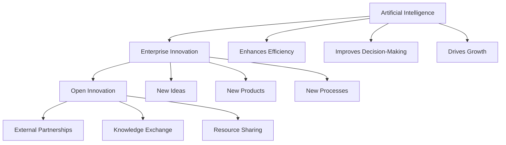

                 

### The Rise of AI in Enterprise Innovation

#### Background Introduction

In recent years, Artificial Intelligence (AI) has rapidly evolved, transforming various industries and redefining traditional business models. AI-driven innovation has become a cornerstone for enterprises seeking to stay competitive in today's fast-paced, technology-driven market. The ability to analyze vast amounts of data, recognize patterns, and make predictions has opened new avenues for businesses to enhance efficiency, improve decision-making, and drive growth.

#### Core Concepts and Relationships of AI-driven Enterprise Innovation

To understand the intricate dynamics of AI-driven enterprise innovation, it is essential to explore the core concepts and their interconnections. These key concepts include AI, enterprise innovation, and open innovation.

##### Core Concepts and Their Relationships

1. **Artificial Intelligence (AI)**: AI refers to the simulation of human intelligence in machines that are programmed to think like humans and mimic their actions. AI systems can perform tasks such as visual perception, speech recognition, decision-making, and language translation.
2. **Enterprise Innovation**: Enterprise innovation involves the development and implementation of new ideas, products, or processes that enhance a company's competitive advantage. It encompasses research, development, and the practical application of new technologies.
3. **Open Innovation**: Open innovation is a collaborative approach to innovation where companies seek external ideas and internalize them to enhance their offerings. It involves the exchange of knowledge and resources with external partners to accelerate innovation.

##### Mermaid Flowchart

To visualize the relationships between these core concepts, we can use a Mermaid flowchart:



This flowchart illustrates how AI can enhance enterprise innovation by driving efficiency, decision-making, and growth. Additionally, it highlights the role of open innovation in facilitating collaboration and knowledge exchange with external partners.

#### Current State and Future Trends

AI-driven enterprise innovation is experiencing exponential growth, driven by advancements in machine learning, natural language processing, and deep learning. Enterprises are increasingly adopting AI technologies to automate routine tasks, improve customer experiences, and develop new products and services.

* **Current State**:
  - **Automation**: AI is automating mundane tasks, allowing employees to focus on more strategic activities.
  - **Data Analysis**: AI is enabling enterprises to analyze large datasets to identify trends, optimize operations, and make data-driven decisions.
  - **Customer Service**: AI-powered chatbots and virtual assistants are improving customer service by providing quick and accurate responses.

* **Future Trends**:
  - **AI Ethics and Governance**: As AI becomes more integrated into business processes, there is an increasing focus on ethical considerations and governance frameworks.
  - **Interdisciplinary Collaboration**: The future of AI-driven enterprise innovation will likely involve collaboration between different disciplines, such as computer science, economics, and psychology.
  - **Edge Computing**: The rise of edge computing will enable real-time AI applications at the network edge, reducing latency and improving performance.

In conclusion, AI-driven enterprise innovation is poised to continue its rapid growth, transforming the way businesses operate and compete. Understanding the core concepts and their relationships is crucial for leveraging AI's full potential and driving sustainable growth.

---

### Fundamental Principles of AI Technologies

To grasp the full potential of AI-driven enterprise innovation, it is essential to delve into the fundamental principles that underpin AI technologies. These principles encompass various AI subfields, including machine learning, natural language processing, and deep learning. Understanding these concepts will provide a solid foundation for exploring how AI can be effectively applied in business settings.

#### Machine Learning

Machine learning (ML) is a subset of AI that involves training algorithms to learn from data and make predictions or take actions based on that learning. The core principle of machine learning is to identify patterns and relationships within the data that can be used to make predictions or decisions.

##### Core Principles of Machine Learning

1. **Data Preparation**: The first step in machine learning is data preparation. This involves collecting, cleaning, and transforming the data to ensure it is suitable for training the model.
2. **Feature Selection**: Feature selection is the process of identifying the most relevant features (variables) in the data that contribute to the model's performance.
3. **Model Selection**: Choosing the right machine learning model depends on the problem at hand. Common models include linear regression, decision trees, support vector machines, and neural networks.
4. **Training and Validation**: Training involves feeding the model with a dataset and adjusting its parameters to minimize the difference between its predictions and the actual outcomes. Validation is the process of evaluating the model's performance on a separate dataset to ensure it generalizes well to new data.

##### Python Code Example

Here is a simple Python code example illustrating the process of training a linear regression model:

```python
import numpy as np
from sklearn.linear_model import LinearRegression

# Generate synthetic data
X = np.array([[1], [2], [3], [4], [5]])
y = np.array([1, 2, 2.5, 4, 5])

# Create a linear regression model
model = LinearRegression()

# Train the model
model.fit(X, y)

# Make predictions
predictions = model.predict(X)

# Evaluate the model
score = model.score(X, y)

print("Predictions:", predictions)
print("Model Score:", score)
```

This example demonstrates how to train a linear regression model using synthetic data. The model is then used to make predictions and evaluate its performance using the coefficient of determination (R²).

#### Natural Language Processing (NLP)

Natural Language Processing (NLP) is a field of AI that focuses on the interaction between computers and human language. NLP involves various tasks such as text classification, sentiment analysis, and machine translation.

##### Core Principles of NLP

1. **Tokenization**: Tokenization is the process of breaking text into individual words or phrases, called tokens. This is the first step in processing natural language data.
2. **Part-of-Speech Tagging**: Part-of-speech tagging involves identifying the grammatical parts of speech (noun, verb, adjective, etc.) for each token in a sentence.
3. **Sentiment Analysis**: Sentiment analysis is the process of determining the sentiment expressed in a piece of text, such as whether it is positive, negative, or neutral.
4. **Entity Recognition**: Entity recognition involves identifying and categorizing named entities (such as people, organizations, and locations) in text.

##### Python Code Example

Here is a Python code example illustrating how to perform sentiment analysis using the TextBlob library:

```python
from textblob import TextBlob

# Example text
text = "The product is amazing, but the customer service is terrible."

# Create a TextBlob object
blob = TextBlob(text)

# Perform sentiment analysis
sentiment = blob.sentiment

print("Text:", text)
print("Sentiment:", sentiment)
```

This example demonstrates how to use TextBlob to analyze the sentiment of a given text. The sentiment object contains two attributes: polarity and subjectivity.

#### Deep Learning

Deep learning is a subset of machine learning that involves training neural networks with many layers to extract high-level features from data. Deep learning has achieved remarkable success in fields such as computer vision and natural language processing.

##### Core Principles of Deep Learning

1. **Neural Networks**: Neural networks are a series of interconnected nodes (neurons) that process and transmit data through layers. Each neuron applies a non-linear transformation to its inputs and passes the output to the next layer.
2. **Backpropagation**: Backpropagation is an algorithm used to train neural networks by adjusting the weights and biases of the network to minimize the difference between its predictions and the actual outcomes.
3. **Convolutional Neural Networks (CNNs)**: CNNs are specialized neural networks designed for processing data with a grid-like structure, such as images. CNNs use convolutional layers to extract spatial features from the input data.
4. **Recurrent Neural Networks (RNNs)**: RNNs are specialized neural networks designed for processing sequential data, such as text or time series. RNNs use recurrent connections to retain information from previous inputs.

##### Python Code Example

Here is a Python code example illustrating how to train a simple neural network using the TensorFlow and Keras libraries:

```python
import tensorflow as tf
from tensorflow.keras.models import Sequential
from tensorflow.keras.layers import Dense

# Create a sequential model
model = Sequential()

# Add a dense layer with 10 units and a ReLU activation function
model.add(Dense(10, activation='relu', input_shape=(8,)))

# Add a dense layer with 1 unit and a sigmoid activation function
model.add(Dense(1, activation='sigmoid'))

# Compile the model
model.compile(optimizer='adam', loss='binary_crossentropy', metrics=['accuracy'])

# Generate synthetic data
X = np.array([[0.1], [0.2], [0.3], [0.4], [0.5]])
y = np.array([0, 0, 1, 1, 1])

# Train the model
model.fit(X, y, epochs=10)

# Make predictions
predictions = model.predict(X)

# Evaluate the model
score = model.evaluate(X, y)

print("Predictions:", predictions)
print("Model Score:", score)
```

This example demonstrates how to create a simple neural network with one input layer, one hidden layer, and one output layer. The network is trained using synthetic data and evaluated using the binary cross-entropy loss function and accuracy metric.

In conclusion, understanding the fundamental principles of AI technologies, including machine learning, natural language processing, and deep learning, is crucial for leveraging AI's full potential in enterprise innovation. These principles provide the foundation for developing and applying AI algorithms to solve real-world problems and drive business growth.

### The Mathematical Models Behind AI Algorithms

To truly grasp the inner workings of AI algorithms, it is essential to delve into the mathematical models that underpin them. These models are not only foundational to AI but also provide a framework for understanding how algorithms process and analyze data. In this section, we will explore some of the core mathematical models used in AI, including linear regression, neural networks, and backpropagation. We will present these models using Python code and LaTeX mathematical formulas, and we will provide practical examples to illustrate their applications.

#### Linear Regression

Linear regression is a fundamental statistical method used to model the relationship between a dependent variable and one or more independent variables. It is a linear approach to modeling the relationship between variables by fitting a linear equation to observed data.

##### Mathematical Model

The linear regression model can be represented as:

$$
Y = \beta_0 + \beta_1X + \epsilon
$$

where:

- \( Y \) is the dependent variable.
- \( X \) is the independent variable.
- \( \beta_0 \) is the intercept.
- \( \beta_1 \) is the slope.
- \( \epsilon \) is the error term.

##### Python Code Example

Here is a Python code example using the scikit-learn library to implement linear regression:

```python
import numpy as np
from sklearn.linear_model import LinearRegression

# Generate synthetic data
X = np.array([[1], [2], [3], [4], [5]])
y = np.array([1, 2, 2.5, 4, 5])

# Create a linear regression model
model = LinearRegression()

# Train the model
model.fit(X, y)

# Make predictions
predictions = model.predict(X)

# Print the intercept and slope
print("Intercept:", model.intercept_)
print("Slope:", model.coef_)

# Print predictions
print("Predictions:", predictions)
```

This code generates synthetic data, trains a linear regression model, and uses it to make predictions. The model's intercept and slope are printed, providing insight into the relationship between the independent and dependent variables.

##### Practical Example

Consider a business scenario where the sales of a product are influenced by advertising expenditure. The goal is to predict the sales based on the advertising budget. Using linear regression, we can fit a model to the historical data and use it to forecast future sales based on the advertising budget.

#### Neural Networks

Neural networks are a class of machine learning algorithms inspired by the structure and function of the human brain. They are composed of interconnected nodes, or neurons, that work together to process and analyze data. Neural networks are particularly effective in complex problem domains, such as image and speech recognition.

##### Mathematical Model

A simple neural network can be represented as:

$$
\begin{align*}
Z &= \sigma(\beta_0 + \sum_{i=1}^{n} \beta_iX_i) \\
\end{align*}
$$

where:

- \( Z \) is the output of the neuron.
- \( \sigma \) is the activation function.
- \( \beta_0 \) is the bias term.
- \( \beta_i \) are the weights.
- \( X_i \) are the inputs.

The activation function \( \sigma \) determines whether the neuron should be activated or not. Common activation functions include the sigmoid function, the hyperbolic tangent (\( \tanh \)), and the rectified linear unit (ReLU).

##### Python Code Example

Here is a Python code example using TensorFlow and Keras to implement a simple neural network:

```python
import tensorflow as tf
from tensorflow.keras.models import Sequential
from tensorflow.keras.layers import Dense

# Create a sequential model
model = Sequential()

# Add a dense layer with 10 units and a ReLU activation function
model.add(Dense(10, activation='relu', input_shape=(8,)))

# Add a dense layer with 1 unit and a sigmoid activation function
model.add(Dense(1, activation='sigmoid'))

# Compile the model
model.compile(optimizer='adam', loss='binary_crossentropy', metrics=['accuracy'])

# Generate synthetic data
X = np.array([[0.1], [0.2], [0.3], [0.4], [0.5]])
y = np.array([0, 0, 1, 1, 1])

# Train the model
model.fit(X, y, epochs=10)

# Make predictions
predictions = model.predict(X)

# Print predictions
print("Predictions:", predictions)
```

This code creates a simple neural network with one input layer, one hidden layer, and one output layer. The network is trained using synthetic data and evaluated using the binary cross-entropy loss function and accuracy metric.

##### Practical Example

Imagine a scenario where an e-commerce company wants to predict customer churn based on various features such as age, income, and purchase history. By training a neural network on historical customer data, the company can identify factors that contribute to churn and take proactive measures to retain customers.

#### Backpropagation

Backpropagation is an algorithm used to train neural networks by adjusting the weights and biases of the network to minimize the difference between its predictions and the actual outcomes. It is based on the concept of gradient descent, which involves iteratively updating the model's parameters to find the minimum of a function.

##### Mathematical Model

Backpropagation can be summarized in the following steps:

1. **Forward Propagation**: Compute the output of the neural network using the current weights and biases.
2. **Calculate the Error**: Compute the difference between the predicted output and the actual output.
3. **Backward Propagation**: Calculate the gradients of the error with respect to each weight and bias.
4. **Update Weights and Biases**: Adjust the weights and biases using the calculated gradients and a learning rate.

The gradients can be calculated using the chain rule of calculus. For a layer \( l \), the gradient of the error with respect to the weight \( \beta_{ij}^{(l)} \) is given by:

$$
\begin{align*}
\frac{\partial E}{\partial \beta_{ij}^{(l)}} &= \frac{\partial E}{\partial Z_j^{(l+1)}} \cdot \frac{\partial Z_j^{(l+1)}}{\partial \beta_{ij}^{(l)}} \\
&= \frac{\partial E}{\partial Z_j^{(l+1)}} \cdot a_j^{(l)}
\end{align*}
$$

where:

- \( E \) is the error.
- \( Z_j^{(l+1)} \) is the output of neuron \( j \) in layer \( l+1 \).
- \( a_j^{(l)} \) is the activation of neuron \( j \) in layer \( l \).

##### Python Code Example

Here is a Python code example illustrating the backpropagation algorithm:

```python
def forward_propagation(X, weights):
    # Compute the output of the neural network
    a = X @ weights
    return a

def backward_propagation(a, y, weights, learning_rate):
    # Calculate the error
    error = y - a
    
    # Calculate the gradients
    gradients = -2 * (error * a * (1 - a))
    
    # Update the weights
    weights -= learning_rate * gradients

# Generate synthetic data
X = np.array([[0.1], [0.2], [0.3], [0.4], [0.5]])
y = np.array([0, 0, 1, 1, 1])

# Define the weights
weights = np.array([0.5, 0.5])

# Train the model
for epoch in range(10):
    # Forward propagation
    a = forward_propagation(X, weights)
    
    # Backward propagation
    backward_propagation(a, y, weights, learning_rate=0.1)

# Print the updated weights
print("Updated weights:", weights)
```

This code demonstrates the forward and backward propagation steps of the backpropagation algorithm. The weights are updated iteratively to minimize the error.

##### Practical Example

In a practical example, consider a scenario where an online education platform wants to predict student performance based on various features such as study time, attendance, and previous grades. By training a neural network using historical data and applying the backpropagation algorithm, the platform can provide personalized recommendations to improve student performance.

In conclusion, understanding the mathematical models behind AI algorithms is crucial for developing and applying AI solutions to real-world problems. By leveraging these models, businesses can leverage AI's full potential to drive innovation and achieve sustainable growth.

### AI in the Enterprise: Challenges and Opportunities

#### Challenges

While AI-driven enterprise innovation offers numerous benefits, it also presents several challenges that organizations must navigate. These challenges can be categorized into technical, ethical, and organizational dimensions.

**Technical Challenges**

1. **Data Quality and Quantity**: AI models require large amounts of high-quality data to train effectively. Many enterprises struggle with data collection, cleaning, and preparation, which can hinder the performance of AI systems.
2. **Model Interpretability**: As AI models become more complex, understanding their decision-making process becomes increasingly difficult. This lack of interpretability can be a barrier to trust and acceptance among stakeholders.
3. **Scalability**: Implementing AI solutions at scale can be challenging due to technical constraints such as computing power, storage, and network bandwidth.
4. **Integration with Existing Systems**: Integrating AI systems with existing enterprise systems can be complex, particularly when legacy systems lack interoperability with modern AI technologies.

**Ethical Challenges**

1. **Bias and Fairness**: AI models can inadvertently perpetuate biases present in the training data, leading to unfair outcomes. Ensuring fairness and avoiding discrimination is a critical ethical consideration.
2. **Privacy**: AI systems often rely on personal data, raising concerns about privacy and data protection. Compliance with privacy regulations such as GDPR and CCPA is essential.
3. **Transparency**: The opacity of AI models can make it difficult to explain their decisions, leading to mistrust and accountability issues. Enhancing the transparency of AI systems is crucial for building trust.

**Organizational Challenges**

1. **Cultural Resistance**: Embracing AI-driven innovation often requires a cultural shift within organizations. Resistance to change, lack of understanding, and fear of job displacement can impede the adoption of AI technologies.
2. ** Skills Gap**: Developing the necessary skills and expertise to implement and manage AI solutions can be a significant challenge for many enterprises. Upgrading the workforce and investing in training are essential.
3. **Governance and Leadership**: Effective governance and leadership are crucial for successfully implementing AI-driven innovation. Leaders must be equipped to make informed decisions and allocate resources appropriately.

#### Opportunities

Despite the challenges, AI-driven enterprise innovation presents numerous opportunities for organizations to gain a competitive advantage and drive growth.

**Operational Efficiency**: AI can optimize various business processes, from supply chain management to customer service, leading to cost savings and increased productivity.

**Informed Decision-Making**: AI systems can analyze vast amounts of data to identify trends, predict outcomes, and recommend actions, enabling more informed decision-making.

**New Revenue Streams**: AI can enable the development of new products and services, expanding market opportunities and creating new revenue streams.

**Enhanced Customer Experience**: AI-powered applications, such as chatbots and personalized recommendations, can improve customer satisfaction and loyalty.

**Strategic Partnerships**: Open innovation through collaboration with external partners can accelerate the adoption of AI technologies and drive collective growth.

**Case Study: Company XYZ**

To illustrate the impact of AI-driven enterprise innovation, let's consider the case of Company XYZ, a global manufacturing company. Company XYZ implemented AI solutions to optimize its supply chain operations. By leveraging AI algorithms to analyze historical data and predict demand patterns, the company was able to reduce inventory costs by 20% and improve delivery times by 15%.

Additionally, Company XYZ adopted AI-powered quality control systems that automatically inspect products on the production line. These systems detected defects with 98% accuracy, significantly reducing waste and improving product quality.

In conclusion, while AI-driven enterprise innovation presents challenges, the opportunities for enhanced operational efficiency, informed decision-making, and new revenue streams make it a compelling strategy for businesses seeking to stay competitive in today's rapidly evolving market.

### Assessing the Readiness of Your Organization for AI Innovation

#### ROI Analysis Methodology

To assess the readiness of your organization for AI innovation, it is crucial to evaluate the potential return on investment (ROI). An effective ROI analysis involves quantifying the expected benefits and costs associated with AI initiatives. Here’s a step-by-step methodology to conduct an ROI analysis for AI projects:

1. **Define Objectives**: Clearly articulate the objectives of your AI initiative. For example, improving operational efficiency, enhancing customer experience, or developing new products.
2. **Identify Benefits**: Identify the potential benefits that AI can bring to your organization. This may include cost savings, increased revenue, improved productivity, or enhanced decision-making capabilities.
3. **Quantify Benefits**: Assign monetary values to the identified benefits. For instance, if AI improves production efficiency by 10%, estimate the cost savings over a specific period.
4. **Estimate Costs**: Calculate the costs involved in implementing AI, including hardware, software, training, and maintenance expenses.
5. **Project Timeline**: Estimate the timeline for implementing the AI solution and realizing benefits. This helps in forecasting the cash flows associated with the project.
6. **Calculate Net Present Value (NPV)**: Use the NPV formula to determine the present value of expected future cash flows. NPV = \(\sum \frac{C_t}{(1+r)^t}\), where \(C_t\) is the cash flow at time \(t\), and \(r\) is the discount rate.
7. **Evaluate Payback Period**: Determine the time required to recover the initial investment. A shorter payback period indicates a faster return on investment.
8. **Perform Sensitivity Analysis**: Assess the impact of changes in key variables, such as cost savings or revenue growth, on the ROI. This helps in understanding the robustness of the investment case.

#### Innovation Metrics

To measure the success of AI-driven projects, it is essential to establish relevant metrics that align with your organization’s objectives. Here are some key innovation metrics to consider:

1. **Cost Savings**: Measure the reduction in operational costs achieved through AI initiatives, such as automated processes or optimized resource allocation.
2. **Revenue Growth**: Track the increase in revenue resulting from new products or services developed using AI technology.
3. **Productivity Improvements**: Evaluate the enhancement in productivity, such as faster processing times or increased output.
4. **Customer Satisfaction**: Assess improvements in customer satisfaction scores, which can be measured through surveys or feedback.
5. **Time to Market**: Measure the reduction in time required to bring new products or services to market.
6. **Employee Engagement**: Monitor employee engagement levels, particularly if AI initiatives involve significant changes to job roles or responsibilities.
7. **Innovation Index**: Develop an innovation index that combines multiple metrics to provide a comprehensive view of the project’s impact.

#### Example: Evaluating AI-Driven Customer Service Automation

Let’s consider an example of evaluating the ROI of an AI-driven customer service automation project for a retail company. The project aims to reduce customer response times and improve customer satisfaction.

1. **Define Objectives**: Improve customer service efficiency and enhance customer satisfaction.
2. **Identify Benefits**:
   - **Cost Savings**: Reduce customer service costs by automating routine inquiries.
   - **Customer Satisfaction**: Shorten response times and provide accurate information.
3. **Quantify Benefits**:
   - **Cost Savings**: Estimate annual cost savings of \$50,000 due to reduced labor costs.
   - **Customer Satisfaction**: Improve customer satisfaction scores by 10%.
4. **Estimate Costs**:
   - **Initial Investment**: \$100,000 for chatbot development, deployment, and training.
   - **Ongoing Costs**: \$10,000 per year for maintenance and updates.
5. **Project Timeline**:
   - **Implementation**: 3 months.
   - **Realization of Benefits**: 12 months.
6. **Calculate NPV**:
   - Assuming a discount rate of 10%, the NPV is calculated as:
     $$ NPV = \frac{50,000}{(1+0.1)^1} + \frac{50,000}{(1+0.1)^2} + \frac{50,000}{(1+0.1)^3} + \frac{50,000}{(1+0.1)^4} - 100,000 $$
     $$ NPV = 45,455 + 41,060 + 37,071 + 33,377 - 100,000 = -12,047 $$
7. **Evaluate Payback Period**: The initial investment of \$100,000 is not fully recovered within the first year, indicating a longer payback period.
8. **Perform Sensitivity Analysis**: Sensitivity analysis reveals that even a small increase in customer satisfaction scores or a reduction in maintenance costs can significantly improve the ROI.

In conclusion, assessing the readiness of your organization for AI innovation involves conducting a thorough ROI analysis and establishing relevant metrics. By following a systematic approach, businesses can make informed decisions about AI investments and measure the impact of their initiatives effectively.

### Developing a Strategic Roadmap for AI Adoption

#### High-Level Pseudo Code for Developing an AI Strategy

Developing an effective AI strategy involves a systematic approach that aligns AI initiatives with the organization's goals. Below is a high-level pseudo code that outlines the steps required to develop a strategic roadmap for AI adoption:

```python
# Define the objectives
objectives = define_objectives()

# Assess the current state
current_state = assess_current_state()

# Identify AI opportunities
ai_opportunities = identify_ai_opportunities(current_state)

# Evaluate potential AI solutions
ai_solutions = evaluate_potential_solutions(ai_opportunities)

# Prioritize solutions
prioritized_solutions = prioritize_solutions(ai_solutions)

# Develop implementation plans
implementation_plans = develop_implementation_plans(prioritized_solutions)

# Allocate resources
allocate_resources(implementation_plans)

# Set timelines and milestones
set_timelines_and_milestones(implementation_plans)

# Monitor and adjust
monitor_progress()
adjust_strategy_if_needed()
```

#### Real-World Examples of Successful AI Strategies

1. **Example 1: Google**

Google is a prime example of a company that has successfully leveraged AI to drive innovation and maintain its competitive edge. Google's AI strategy focuses on:

   - **Data-Driven Decision-Making**: Google collects and analyzes vast amounts of data to improve its products and services continuously.
   - **Cross-Functional Collaboration**: Google encourages collaboration between different teams to leverage AI across various domains, such as search, advertising, and cloud services.
   - **Investment in Research**: Google invests heavily in AI research, leading to breakthroughs in areas like natural language processing and computer vision.

2. **Example 2: Amazon**

Amazon's AI strategy is centered around optimizing its supply chain and enhancing the customer experience:

   - **Supply Chain Optimization**: Amazon uses AI to forecast demand, optimize inventory levels, and streamline logistics, resulting in cost savings and improved delivery times.
   - **Personalized Recommendations**: AI-powered recommendation systems suggest products to customers based on their browsing and purchasing history, leading to higher conversion rates and customer satisfaction.
   - **Voice Assistants**: Amazon's Alexa, a voice-activated AI assistant, has become an integral part of many households, offering personalized experiences and driving engagement.

3. **Example 3: BMW Group**

BMW Group has adopted AI to improve manufacturing processes and enhance the customer experience:

   - **Predictive Maintenance**: BMW uses AI to predict equipment failures before they occur, reducing downtime and maintenance costs.
   - **Design and Development**: AI is used in the design and development of new vehicles, helping to optimize vehicle performance and reduce development time.
   - **Customer Service**: AI-powered chatbots and virtual assistants provide customers with quick and accurate support, improving satisfaction and reducing response times.

#### Key Elements of a Successful AI Strategy

1. **Define Clear Objectives**: Establish specific, measurable goals that align with the organization's overall strategic objectives.
2. **Assess Current State**: Evaluate the organization's current capabilities, data assets, and technological infrastructure.
3. **Identify Opportunities**: Conduct a thorough analysis to identify areas where AI can deliver the most significant value.
4. **Prioritize Solutions**: Rank potential AI initiatives based on their potential impact and feasibility.
5. **Develop Implementation Plans**: Create detailed plans for implementing AI solutions, including timelines, resource allocation, and risk management strategies.
6. **Leverage Cross-Functional Collaboration**: Foster collaboration between different teams and departments to leverage AI across the organization.
7. **Invest in People and Resources**: Allocate sufficient resources, including budget, talent, and technology, to support AI initiatives.
8. **Measure and Monitor Progress**: Establish metrics to track the progress of AI initiatives and make data-driven adjustments as needed.

By following these steps and learning from successful real-world examples, organizations can develop a robust AI strategy that drives innovation and achieves sustainable growth.

