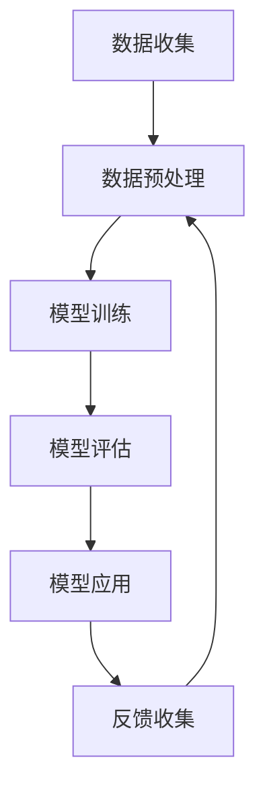

                 

### 关键词

AI驱动的企业创新管理，数据驱动创新，机器学习，深度学习，产品开发优化，市场预测，敏捷开发。

### 摘要

在当今快速变化的市场环境中，企业需要通过创新来保持竞争力。本文探讨了如何利用人工智能（AI）技术来驱动企业创新管理，从而加速从创意到产品的转化过程。文章首先介绍了AI与企业创新管理的关系，然后详细阐述了AI在创意生成、产品设计和市场分析中的应用，并提供了实际案例和实践指南。通过这些讨论，本文旨在展示AI如何成为企业创新管理的重要工具，推动企业实现更高效、更有针对性的创新。

### 引言

在当今经济全球化和技术迅猛发展的时代，企业面临着前所未有的竞争压力。为了在市场中立足，企业必须不断创新，开发出具有竞争力的产品和服务。然而，创新管理并非易事，它涉及从创意的产生到产品的实际开发，再到市场推广的复杂过程。如何高效地管理这一过程，成为企业成功的关键。

人工智能（AI）技术的兴起为创新管理带来了新的机遇。AI不仅可以处理大量数据，识别市场趋势，还能通过机器学习和深度学习算法生成新的创意，优化产品设计，预测市场需求。因此，将AI融入企业创新管理，不仅能够提高创新的效率，还能提升创新的质量，从而在激烈的市场竞争中脱颖而出。

本文将详细探讨AI在企业创新管理中的应用，分为以下几个部分：

1. **AI与企业创新管理的关系**：介绍AI的基本概念及其在企业创新管理中的作用。
2. **AI驱动的创新管理框架**：建立AI驱动的创新管理模型，并探讨其实践案例。
3. **AI在创意生成中的应用**：讨论AI如何帮助生成创意，并分析其在设计、写作和音乐创作中的实际应用。
4. **AI在产品开发中的应用**：阐述AI在产品设计、开发流程中的角色，并提供实际应用案例。
5. **AI驱动的市场分析**：介绍AI在市场分析和预测中的应用，以及其对创新管理的支持。
6. **AI驱动的创新管理实践**：总结AI驱动的创新管理实践方法，并给出建议。
7. **结论与展望**：总结文章的主要观点，并对AI驱动的企业创新管理未来进行展望。

通过这些讨论，本文旨在为读者提供一份全面、系统的AI驱动创新管理指南，帮助企业更好地利用AI技术，实现从创意到产品的快速转化。

### AI与企业创新管理的关系

人工智能（AI）作为一种强大的计算能力，已经在多个领域展现出了其颠覆性的影响力。在企业管理中，AI的应用不仅能够提高工作效率，还能驱动创新，为企业带来新的增长点。理解AI与企业创新管理之间的关系，是探索如何利用AI提升企业创新能力的关键。

#### AI的定义与基本原理

人工智能，通常指的是通过计算机程序实现人类智能的一种技术。其基本原理包括机器学习、深度学习、自然语言处理、计算机视觉等多个方面。机器学习是AI的核心技术之一，通过从数据中学习规律，使计算机能够自动进行决策和预测。深度学习则是机器学习的一个分支，通过构建多层神经网络，实现对复杂数据结构的建模。自然语言处理则专注于让计算机理解和生成人类语言，而计算机视觉则使计算机能够理解和解释图像和视频。

#### 企业创新管理的定义

企业创新管理是指企业为了实现持续发展和市场竞争力，通过系统的创新策略和过程，持续改进和更新产品、服务和技术。创新管理涉及从创意的产生到实际应用的整个流程，包括市场调研、产品设计、开发、测试和推广等多个环节。

#### AI在企业创新管理中的应用

AI在企业创新管理中的应用非常广泛，主要包括以下几个方面：

1. **市场预测与决策支持**：通过分析大量市场数据，AI可以识别市场趋势，预测消费者行为，为企业提供决策支持。例如，通过机器学习算法分析历史销售数据，企业可以更准确地预测未来需求，优化库存管理。

2. **产品设计与优化**：AI可以帮助设计师生成新的设计理念，通过生成对抗网络（GAN）等技术，创造出前所未有的设计方案。此外，AI还可以通过模拟测试，优化产品的功能性能，提高产品的市场竞争力。

3. **用户行为分析**：通过分析用户在产品使用过程中的行为数据，AI可以了解用户需求，改进产品设计，提高用户体验。例如，通过自然语言处理技术，企业可以分析用户在社交媒体上的评论和反馈，快速响应市场变化。

4. **智能化的开发流程**：AI可以优化软件开发过程，通过自动化测试和代码审查，提高开发效率。例如，使用深度学习模型进行代码质量预测，可以提前识别潜在的问题，避免后期修复成本。

#### AI驱动的创新管理模型

为了更好地利用AI驱动企业创新管理，可以构建一个AI驱动的创新管理模型，其基本框架包括以下几个环节：

1. **数据收集与处理**：首先，企业需要收集相关的市场数据、用户行为数据、产品数据等。这些数据将作为AI模型的输入，通过数据清洗和预处理，确保数据的质量和准确性。

2. **数据分析和模型训练**：利用机器学习和深度学习算法，对收集到的数据进行分析和建模。通过训练模型，使AI能够识别数据中的规律和趋势，为企业提供决策支持。

3. **应用与反馈**：将训练好的模型应用到实际创新管理过程中，如市场预测、产品设计优化等。同时，收集实际应用中的反馈数据，用于模型迭代和优化。

4. **持续改进**：通过不断的数据收集、分析和应用，使AI驱动的创新管理模型不断改进，实现持续创新。

#### AI驱动的创新管理实践案例

以下是几个AI驱动的创新管理实践案例：

1. **亚马逊（Amazon）**：亚马逊利用AI进行市场预测和库存管理。通过分析销售数据、用户行为数据等，亚马逊能够准确预测产品需求，优化库存，减少浪费，提高运营效率。

2. **特斯拉（Tesla）**：特斯拉使用AI优化产品设计。通过模拟测试和用户反馈分析，特斯拉不断改进汽车的性能和用户体验，使产品更具竞争力。

3. **谷歌（Google）**：谷歌通过AI进行用户行为分析，优化搜索引擎和广告投放。通过分析用户搜索历史和浏览行为，谷歌能够提供更个性化的搜索结果和广告推荐，提高用户满意度。

通过这些实践案例，我们可以看到AI在企业创新管理中的巨大潜力。未来，随着AI技术的不断进步，AI将在企业创新管理中发挥越来越重要的作用，为企业带来更高的创新效率和质量。

### AI驱动的创新管理框架

为了更好地理解AI在企业创新管理中的应用，我们可以构建一个AI驱动的创新管理框架，该框架包括数据收集与处理、模型训练与优化、应用与反馈等多个环节，形成一个闭环系统，从而实现持续的改进和创新。

#### 数据收集与处理

数据是AI驱动创新管理的基础。企业需要收集多源数据，包括市场数据、用户行为数据、产品数据、销售数据等。这些数据可以从内部数据库、外部数据源（如社交媒体、市场调研报告）等渠道获取。在数据收集过程中，需要注意数据的准确性和完整性。数据收集后，需要进行数据清洗和预处理，以去除噪声和异常值，确保数据的质量。

```python
import pandas as pd
import numpy as np

# 示例：读取数据并清洗
data = pd.read_csv('data.csv')
data = data.dropna()  # 删除缺失值
data = data[data['column'] > 0]  # 去除负值
```

#### 模型训练与优化

在数据预处理完成后，企业可以利用机器学习和深度学习算法对数据进行训练。选择合适的算法和模型，如线性回归、决策树、神经网络等，根据具体问题进行模型构建。在训练过程中，需要调整模型参数，以优化模型性能。常用的优化方法包括交叉验证、网格搜索等。

```python
from sklearn.ensemble import RandomForestRegressor
from sklearn.model_selection import train_test_split

# 示例：使用随机森林进行模型训练
X_train, X_test, y_train, y_test = train_test_split(data.drop('target', axis=1), data['target'], test_size=0.2, random_state=42)
model = RandomForestRegressor(n_estimators=100, random_state=42)
model.fit(X_train, y_train)
```

#### 应用与反馈

训练好的模型可以应用于实际创新管理过程中，如市场预测、产品设计优化、用户行为分析等。在实际应用中，需要收集反馈数据，以评估模型的效果。通过反馈数据，企业可以进一步优化模型，提高其准确性和实用性。

```python
# 示例：使用模型进行预测
predictions = model.predict(X_test)
# 计算模型评估指标
from sklearn.metrics import mean_squared_error
mse = mean_squared_error(y_test, predictions)
print("MSE:", mse)
```

#### 持续改进

AI驱动的创新管理是一个持续的过程。通过不断的数据收集、模型训练和应用，企业可以不断优化创新管理流程，提高创新效率和质量。此外，企业还可以引入新的数据源和算法，以适应不断变化的市场环境。

```python
# 示例：迭代优化模型
for i in range(5):
    # 再次训练模型
    model.fit(X_train, y_train)
    # 再次进行预测和评估
    predictions = model.predict(X_test)
    mse = mean_squared_error(y_test, predictions)
    print("Iteration", i+1, "MSE:", mse)
```

#### AI驱动的创新管理模型架构

为了更清晰地展示AI驱动的创新管理框架，我们可以使用Mermaid流程图来描述各环节之间的逻辑关系。



通过这个模型，我们可以看到数据在各个环节中的流动，以及如何通过持续改进来优化创新管理流程。

#### 实践案例

以下是一些AI驱动的创新管理实践案例，展示了如何在实际操作中应用这个框架：

1. **亚马逊（Amazon）**：亚马逊利用AI进行库存管理。通过收集和分析销售数据、用户行为数据等，亚马逊能够预测产品需求，优化库存水平，减少浪费，提高运营效率。

2. **谷歌（Google）**：谷歌使用AI进行广告投放优化。通过分析用户搜索历史和浏览行为，谷歌能够提供更个性化的广告推荐，提高广告转化率。

3. **特斯拉（Tesla）**：特斯拉利用AI优化产品设计。通过模拟测试和用户反馈分析，特斯拉不断改进汽车的性能和用户体验，使产品更具竞争力。

这些案例表明，AI驱动的创新管理框架在实际操作中具有很高的实用性和效果。通过持续的数据收集、模型训练和应用，企业可以实现更高效、更有针对性的创新，从而在激烈的市场竞争中脱颖而出。

### AI在创意生成中的应用

创意生成是企业创新过程中至关重要的一环。然而，创意的产生往往需要大量的时间和人力投入。随着人工智能（AI）技术的发展，AI在创意生成中的应用变得越来越广泛，不仅能够提高创意的多样性，还能加快创意生成的速度。本文将探讨AI在创意生成中的潜力，以及其在设计、写作和音乐创作中的实际应用。

#### 创意的定义与分类

创意是指通过创造性思维产生的新想法或新解决方案。创意可以分为两大类：创新性创意和常规性创意。创新性创意是指那些前所未有的、独特的想法，而常规性创意则是在现有基础上进行的小幅改进。无论是创新性创意还是常规性创意，对于企业来说都是宝贵的资源。

#### AI在创意生成中的应用

AI在创意生成中的应用主要体现在以下几个方面：

1. **生成对抗网络（GAN）**：生成对抗网络是一种由生成器和判别器组成的模型，通过相互对抗来生成高质量的数据。在创意生成中，生成器可以生成各种设计方案、艺术作品等，而判别器则负责评估这些创意的质量。通过不断的迭代，生成器可以生成越来越符合人类审美的创意。

2. **变分自编码器（VAE）**：变分自编码器是一种用于生成数据的深度学习模型。通过编码和解码过程，VAE可以生成多样化的创意，如图像、文本等。与GAN类似，VAE通过在生成过程中加入随机性，可以生成具有多样性的创意。

3. **文本生成模型**：文本生成模型，如GPT（Generative Pre-trained Transformer）和BERT（Bidirectional Encoder Representations from Transformers），可以通过学习大量文本数据，生成高质量的文本内容。这些模型可以用于生成文章、故事、广告文案等，为企业提供丰富的创意素材。

4. **图像生成模型**：图像生成模型，如StyleGAN和CycleGAN，可以生成高质量、逼真的图像。这些模型可以用于设计领域，如生成新的艺术作品、产品外观设计等。

#### AI在创意生成中的实际应用

1. **人工智能设计师**：

在设计中，AI可以帮助设计师生成新的设计方案。通过GAN和VAE等技术，AI可以生成各种风格和类型的图像，如时尚插画、建筑设计等。例如，设计公司Canva利用AI生成各种设计方案，为用户提供更多的选择。

```python
import numpy as np
import tensorflow as tf
from tensorflow.keras.layers import Dense, Flatten, Conv2D, Reshape, Input
from tensorflow.keras.models import Model

# 示例：使用GAN生成图像
def build_generator(z_dim):
    inputs = Input(shape=(z_dim,))
    x = Dense(128 * 7 * 7, activation='relu')(inputs)
    x = Reshape((7, 7, 128))(x)
    x = Conv2D(128, 3, padding='same', activation='relu')(x)
    x = Conv2D(128, 3, padding='same', activation='relu')(x)
    x = Conv2D(128, 3, padding='same', activation='relu')(x)
    x = Flatten()(x)
    outputs = Dense(1, activation='sigmoid')(x)
    model = Model(inputs=inputs, outputs=outputs)
    return model

z_dim = 100
generator = build_generator(z_dim)
z_sample = np.random.normal(size=(1, z_dim))
generated_image = generator.predict(z_sample)
```

2. **人工智能作家**：

AI在写作中的应用也非常广泛，可以用于生成文章、故事、广告文案等。例如，OpenAI的GPT模型可以生成高质量的文章，为媒体和内容创作者提供灵感。

```python
import openai

openai.api_key = 'your-api-key'
response = openai.Completion.create(
  engine="text-davinci-003",
  prompt="请写一篇关于人工智能在创意生成中应用的论文摘要。",
  max_tokens=150
)
print(response.choices[0].text.strip())
```

3. **人工智能音乐家**：

AI在音乐创作中也发挥了重要作用。通过生成对抗网络和变分自编码器等技术，AI可以生成各种类型的音乐，如古典音乐、流行音乐等。例如，Google的Magenta项目利用深度学习技术生成音乐。

```python
import numpy as np
import tensorflow as tf
from tensorflow.keras.models import Model
from tensorflow.keras.layers import Input, LSTM, Dense

# 示例：使用LSTM生成音乐
input_dim = 128
lstm_units = 256

inputs = Input(shape=(None, input_dim))
x = LSTM(lstm_units, return_sequences=True)(inputs)
x = LSTM(lstm_units, return_sequences=True)(x)
outputs = Dense(input_dim, activation='softmax')(x)
model = Model(inputs=inputs, outputs=outputs)

model.compile(optimizer='rmsprop', loss='categorical_crossentropy')
# 训练模型
model.fit(data, labels, batch_size=64, epochs=10)
```

通过这些实际应用，我们可以看到AI在创意生成中的巨大潜力。未来，随着AI技术的不断进步，AI将在创意生成领域发挥更加重要的作用，为企业带来更多的创新机会。

### AI驱动的产品设计

在产品开发过程中，设计是至关重要的环节。它不仅决定了产品的外观和功能，还直接影响到用户体验和市场竞争力。人工智能（AI）的引入，为产品设计带来了革命性的变化。通过数据驱动的方法和算法优化，AI能够显著提升产品的设计质量，加速产品从概念到市场的转化过程。本文将深入探讨AI在产品设计中的应用，包括设计理念的变革、数据驱动的产品设计方法以及AI驱动的产品设计工具。

#### 设计理念的变革

传统的设计理念通常依赖于设计师的直觉和经验，这样的方法虽然有一定的创造性，但存在以下局限性：

1. **效率低**：设计师需要耗费大量时间进行手绘和原型设计，从而降低了设计效率。
2. **主观性强**：设计结果很大程度上受到设计师个人喜好和经验的影响，可能导致设计缺乏一致性。
3. **用户体验关注不足**：传统设计方法往往忽视用户需求和市场反馈，导致产品设计无法完全满足用户期望。

随着AI技术的快速发展，设计理念正在发生深刻变革。AI驱动的产品设计强调以下几点：

1. **数据驱动**：通过分析用户行为数据和市场趋势，AI能够为设计师提供有价值的洞察，帮助设计更符合用户需求和市场趋势的产品。
2. **优化迭代**：AI能够快速生成多种设计方案，并通过评估和优化，找到最佳的设计方案，从而缩短产品设计周期。
3. **多样性**：AI能够生成多样化的设计选项，帮助设计师探索更多的创意可能性，提高设计的创新性。

#### 数据驱动的产品设计方法

数据驱动的产品设计方法是将用户行为数据、市场数据和技术数据等转化为设计决策的依据，从而提升设计质量和效率。以下是一个数据驱动的产品设计方法的步骤：

1. **数据收集**：首先，企业需要收集与产品设计相关的数据，包括用户行为数据（如点击率、浏览时间、转化率等）、市场数据（如竞争对手分析、市场需求等）和技术数据（如技术可行性、成本等）。

2. **数据分析**：利用数据分析工具和技术（如统计方法、机器学习算法等）对收集到的数据进行处理和分析，提取有价值的信息。

3. **用户研究**：通过用户研究（如用户访谈、问卷调查等）深入了解用户需求和偏好，将用户反馈融入到设计过程中。

4. **设计迭代**：根据分析结果和用户研究，设计师可以快速生成多个设计方案，并通过用户测试和反馈，不断优化和迭代设计方案。

5. **模型训练**：将设计数据和用户反馈数据进行模型训练，建立数据驱动的预测模型，用于指导后续的设计决策。

6. **设计决策**：根据预测模型和用户反馈，设计师可以做出更科学、更准确的设计决策。

#### AI驱动的产品设计工具

AI驱动的产品设计工具利用机器学习和深度学习算法，帮助设计师提高设计效率和创意质量。以下是一些常用的AI驱动的设计工具：

1. **生成对抗网络（GAN）**：GAN是一种生成模型，通过生成器和判别器的对抗训练，能够生成高质量、多样化的设计图像。例如，设计师可以使用GAN生成多种产品外观设计方案，快速探索设计空间。

2. **变分自编码器（VAE）**：VAE是一种无监督学习模型，通过编码和解码过程，能够生成多样化的设计元素。设计师可以使用VAE生成独特的图标、图案等设计元素，提升设计的创意性。

3. **用户行为分析工具**：这些工具可以帮助设计师分析用户行为数据，提取用户喜好和需求。例如，通过热图分析，设计师可以了解用户在界面上的行为习惯，从而优化界面设计。

4. **设计优化工具**：这些工具利用优化算法（如遗传算法、粒子群优化等），自动优化设计方案，提高设计的性能和用户体验。例如，设计师可以使用这些工具优化产品结构、外观设计等。

#### 实际应用案例

以下是一些AI驱动的产品设计的实际应用案例：

1. **NVIDIA DesignLab**：NVIDIA DesignLab是一款利用AI技术帮助设计师优化显卡外观设计的工具。通过GAN和VAE等技术，DesignLab能够快速生成多种外观设计方案，并利用用户反馈进行优化。

2. **Adobe Sensei**：Adobe Sensei是Adobe公司的一款AI驱动的设计工具，它可以帮助设计师自动化重复性任务，如图像编辑、排版等，提高设计效率。例如，Adobe Sensei可以自动优化图像的尺寸和格式，以适应不同的媒体平台。

3. **Honeycomb**：Honeycomb是一款基于AI的用户体验设计工具，它可以帮助设计师分析用户行为数据，提取用户偏好。设计师可以根据这些数据，快速调整设计方案，提高用户体验。

通过这些实际应用案例，我们可以看到AI在产品设计中的巨大潜力。未来，随着AI技术的不断进步，AI将在产品设计领域发挥更加重要的作用，帮助企业实现更高效、更有针对性的创新。

### AI驱动的产品开发

在产品开发过程中，从概念到市场的转化是一个复杂且耗时的过程。人工智能（AI）的引入，极大地提高了这一过程的效率和质量。AI不仅能够优化设计和开发流程，还能通过数据驱动的决策支持，加速产品迭代，提升市场竞争力。本文将探讨AI在产品开发中的应用，包括开发流程的模型、AI驱动的产品开发策略和实际应用案例。

#### 产品开发流程的模型

产品开发通常包括以下几个阶段：

1. **需求分析**：明确产品的功能需求和用户需求。
2. **设计**：基于需求分析，设计产品的概念和方案。
3. **开发**：根据设计，进行编码和构建。
4. **测试**：测试产品的功能和质量。
5. **上市**：将产品推向市场，收集用户反馈。

在传统的产品开发流程中，各阶段往往是独立进行的，缺乏有效的数据反馈和迭代。而AI驱动的产品开发则强调数据驱动的决策支持和敏捷开发，其流程模型通常包括以下几个步骤：

1. **数据收集与处理**：收集市场需求、用户行为、技术数据等，进行数据预处理。
2. **需求分析与预测**：利用机器学习算法，分析数据，预测用户需求和市场趋势。
3. **设计优化**：基于预测结果，通过AI算法优化产品设计，生成多个设计方案。
4. **敏捷开发**：采用敏捷开发方法，快速迭代，持续优化产品。
5. **测试与反馈**：利用AI进行自动化测试，并根据用户反馈不断改进产品。
6. **上市推广**：利用AI进行市场预测和用户分析，制定有效的推广策略。

#### AI驱动的产品开发策略

1. **数据驱动的需求预测**：通过分析用户行为数据和市场需求数据，AI可以预测未来的需求趋势。这有助于企业提前制定战略，优化资源分配，降低开发风险。

2. **自动化测试与质量保证**：AI可以自动化测试产品功能，识别潜在缺陷，提高产品质量。例如，使用机器学习模型进行代码缺陷检测，通过自然语言处理技术分析用户反馈，识别用户痛点。

3. **个性化推荐与用户体验优化**：AI可以根据用户行为数据，提供个性化的推荐和服务，优化用户体验。例如，通过深度学习算法，优化用户界面设计，提高用户满意度。

4. **敏捷开发与迭代优化**：AI可以帮助团队快速迭代产品，通过自动化工具和算法，减少开发过程中的手工操作，提高开发效率。

5. **市场预测与决策支持**：AI可以分析市场数据，预测产品市场表现，为决策提供支持。例如，通过时间序列分析，预测产品销售趋势，帮助企业制定营销策略。

#### AI驱动的产品开发实际应用案例

1. **亚马逊（Amazon）**：亚马逊利用AI进行个性化推荐。通过分析用户购物行为和浏览历史，AI能够为用户提供个性化的商品推荐，提高用户满意度和转化率。

2. **特斯拉（Tesla）**：特斯拉使用AI优化车辆性能和用户体验。通过自动驾驶技术和车载传感器，特斯拉能够实时收集大量用户驾驶数据，用于优化车辆性能和用户体验。

3. **Airbnb**：Airbnb利用AI进行房源推荐和定价策略。通过分析用户搜索行为和历史预订数据，AI能够为用户推荐最适合的房源，并制定合理的定价策略。

这些实际应用案例展示了AI在产品开发中的强大能力。通过数据驱动的决策支持和敏捷开发，AI能够帮助企业更快速地响应市场需求，提升产品竞争力。未来，随着AI技术的不断进步，AI将在产品开发中发挥更加重要的作用，推动企业实现持续创新和增长。

### AI驱动的市场分析

在激烈的市场竞争中，精准的市场分析是企业制定有效战略和策略的关键。人工智能（AI）技术通过其强大的数据处理和分析能力，为企业提供了高效、智能化的市场分析工具。本文将探讨AI在市场分析中的应用，包括基本原理、大数据分析以及智能化的市场预测。

#### 市场分析的基本原理

市场分析是指通过系统的方法和工具，对企业所处市场进行深入研究和理解。其主要目标是识别市场机会、分析竞争对手、了解消费者行为，并基于这些分析结果制定相应的市场策略。市场分析的基本原理包括以下几个方面：

1. **需求分析**：研究市场需求，包括消费者对产品或服务的需求量、购买行为等。
2. **竞争分析**：分析竞争对手的市场表现、产品定位、营销策略等。
3. **消费者行为分析**：研究消费者在购买过程中的行为模式、偏好和反馈。
4. **市场趋势预测**：通过历史数据和市场信息，预测未来的市场趋势和变化。

#### AI在市场分析中的应用

AI在市场分析中的应用主要体现在以下几个方面：

1. **数据收集与处理**：AI能够从各种渠道收集大量市场数据，如社交媒体、新闻报道、用户评论等，并通过自然语言处理和文本挖掘技术，对这些数据进行预处理和分析。

2. **大数据分析**：利用机器学习和深度学习算法，AI可以处理和分析海量数据，提取有价值的信息和趋势。例如，通过聚类分析，AI可以识别市场中的关键趋势和消费者群体。

3. **市场预测**：基于历史数据和现有信息，AI可以预测未来的市场趋势和消费者行为。例如，通过时间序列分析，AI可以预测产品需求量和市场增长率。

4. **个性化推荐**：AI可以根据用户行为数据，为用户提供个性化的市场分析和推荐。例如，通过协同过滤算法，AI可以为消费者推荐类似的产品或服务。

5. **自动化决策**：AI可以帮助企业自动化市场分析过程，减少人为干预，提高决策效率。例如，通过基于规则的系统，AI可以根据分析结果自动生成市场报告和策略建议。

#### 智能化的市场预测

智能化的市场预测是AI在市场分析中的一项重要应用。通过机器学习和深度学习算法，AI可以建立复杂的预测模型，对市场趋势和消费者行为进行准确预测。以下是一些常用的预测模型和方法：

1. **时间序列模型**：如ARIMA、LSTM等，用于预测随时间变化的数据。这些模型可以捕捉季节性、趋势性和周期性变化，适用于需求预测、销售预测等。

2. **回归模型**：如线性回归、逻辑回归等，用于分析变量之间的关系，预测某个变量的取值。这些模型可以用于预测市场占有率、价格变化等。

3. **聚类分析**：如K-means、层次聚类等，用于将相似的数据点归为同一类，帮助识别市场中的关键趋势和消费者群体。

4. **分类模型**：如决策树、随机森林等，用于分类问题，如预测消费者购买行为、市场趋势等。

5. **协同过滤**：如用户基于物品的协同过滤、基于用户的协同过滤等，用于推荐系统，预测用户对某个产品的兴趣和购买概率。

#### 实际应用案例

以下是一些AI驱动的市场分析实际应用案例：

1. **亚马逊（Amazon）**：亚马逊利用AI进行个性化推荐和需求预测。通过分析用户购物行为和浏览历史，AI为用户推荐相关产品，并预测未来的需求趋势，优化库存管理。

2. **谷歌（Google）**：谷歌通过AI分析搜索数据，预测市场趋势和消费者行为。例如，通过分析搜索关键词，谷歌可以预测季节性需求变化，为商家提供营销策略建议。

3. **微软（Microsoft）**：微软利用AI进行市场预测和竞争分析。通过分析竞争对手的市场行为和用户反馈，AI帮助微软制定有效的市场策略，提高市场占有率。

这些案例展示了AI在市场分析中的强大能力。通过智能化的市场预测和数据分析，企业可以更准确地把握市场动态，制定科学的市场策略，提高市场竞争力。未来，随着AI技术的不断进步，AI将在市场分析中发挥更加重要的作用，为企业带来更大的价值。

### AI驱动的创新管理实践

在探索了AI在企业创新管理中的各个应用领域后，我们现在来总结一些最佳实践、注意事项和未来的发展方向。这些实践和指导将帮助企业在实际操作中更有效地利用AI技术，推动创新管理的提升。

#### 最佳实践

1. **数据整合与治理**：确保数据的准确性和完整性是AI驱动的创新管理的基础。企业需要建立完善的数据整合和治理机制，确保从不同来源收集的数据能够高效地整合和利用。

2. **模型定制与优化**：不同的业务场景可能需要不同的AI模型。企业应根据具体需求定制模型，并通过持续的迭代和优化，提高模型的准确性和效率。

3. **跨部门协作**：创新管理不是某个部门的责任，而是需要全公司的协同合作。企业应鼓励跨部门协作，确保AI工具和模型能够为各个部门提供支持。

4. **用户反馈循环**：将用户反馈纳入AI模型的迭代过程中，可以帮助不断优化产品和服务，确保创新管理的结果与用户需求保持一致。

5. **持续教育与培训**：员工对AI技术的理解和应用能力是关键。企业应提供持续的培训和教育，帮助员工掌握相关技能，更好地利用AI技术。

#### 注意事项

1. **数据隐私与安全**：在数据收集和处理过程中，企业需要遵守相关的隐私法规和安全标准，确保用户数据的隐私和安全。

2. **模型偏见与公平性**：AI模型可能会因为数据中的偏见而导致不公平的决策。企业应采取措施识别和纠正模型中的偏见，确保模型的公平性和透明度。

3. **技术依赖与风险管理**：过度依赖AI技术可能会降低企业的灵活性和应对能力。企业应建立有效的风险管理机制，确保在技术出现问题时能够迅速应对。

4. **技术与业务结合**：AI技术的成功应用需要与企业的业务战略紧密结合。企业在引入AI技术时，应明确其业务目标和应用场景，确保技术能够为企业创造实际价值。

#### 未来发展方向

1. **AI与新兴技术的融合**：随着5G、边缘计算、物联网等新兴技术的发展，AI将在更多场景中得到应用。企业应积极探索这些技术的融合，推动创新管理的进一步发展。

2. **行业定制化解决方案**：不同行业的业务特点和需求不同，AI驱动的创新管理解决方案也应具有行业定制化。企业应加强与AI技术提供商的合作，开发适合自身行业的解决方案。

3. **全球化与本地化的平衡**：全球化带来了丰富的数据资源和市场机会，但本地化需求同样重要。企业应在全球化和本地化之间找到平衡，确保AI驱动的创新管理能够适应不同市场的需求。

4. **持续技术创新**：AI技术正在快速发展，企业需要持续关注技术创新，及时引入新的算法和工具，保持竞争优势。

通过遵循这些最佳实践、注意事项和未来发展方向，企业可以更有效地利用AI技术，推动创新管理的提升，实现持续的创新和发展。

### 结论与展望

本文全面探讨了AI在企业创新管理中的应用，从AI的基本概念与原理、数据驱动的创新管理框架、创意生成、产品设计、市场分析到实践应用，系统地展示了AI如何加速从创意到产品的转化过程。通过分析，我们得出以下结论：

1. **数据驱动是核心**：数据是AI驱动的创新管理的基石，通过对大量数据进行收集、处理和分析，AI能够为企业提供精准的市场洞察和用户需求预测。
2. **AI技术多样性**：从生成对抗网络（GAN）、变分自编码器（VAE）到自然语言处理和计算机视觉，AI技术的多样性使得企业能够从多个维度进行创新。
3. **持续迭代与优化**：AI驱动的创新管理不是一次性的项目，而是一个持续迭代和优化的过程。通过不断收集反馈和数据，企业可以持续提升创新效果。

展望未来，随着AI技术的不断进步，以下方向值得企业关注：

1. **新兴技术与AI融合**：5G、边缘计算、物联网等新兴技术与AI的融合，将为创新管理带来更多可能性和机会。
2. **行业定制化解决方案**：不同行业的业务特点不同，AI驱动的创新管理解决方案也应具有行业定制化，企业应积极探索开发适合自身行业的解决方案。
3. **全球化与本地化平衡**：全球化带来了丰富的数据资源，但本地化需求同样重要。企业应在全球化和本地化之间找到平衡，确保AI驱动的创新管理能够适应不同市场的需求。
4. **持续技术创新**：AI技术正在快速发展，企业需要持续关注技术创新，及时引入新的算法和工具，保持竞争优势。

总之，AI驱动的企业创新管理不仅能够提高创新效率和质量，还能为企业带来持续的创新动力，成为企业在激烈市场竞争中脱颖而出的关键因素。未来，随着AI技术的不断进步，企业应积极拥抱这一变革，充分利用AI技术，推动创新管理的持续发展。

### 附录：AI驱动的企业创新管理资源

在探索AI驱动的企业创新管理过程中，掌握相关的资源与工具是非常重要的。以下是一些推荐的资源、开源工具和研究机构，以及拓展阅读的推荐，旨在帮助读者深入了解和掌握AI驱动的企业创新管理。

#### 开源工具与框架

1. **TensorFlow**：TensorFlow是Google开源的机器学习框架，适用于各种深度学习任务，包括图像识别、自然语言处理和推荐系统等。

   - 官网：[https://www.tensorflow.org/](https://www.tensorflow.org/)

2. **PyTorch**：PyTorch是Facebook开源的深度学习框架，以其灵活性和动态计算图而闻名，广泛用于研究和工业应用。

   - 官网：[https://pytorch.org/](https://pytorch.org/)

3. **Keras**：Keras是一个高级神经网络API，用于快速构建和迭代深度学习模型。它兼容TensorFlow和Theano。

   - 官网：[https://keras.io/](https://keras.io/)

4. **Scikit-learn**：Scikit-learn是一个开源的机器学习库，适用于各种经典机器学习算法，包括回归、分类和聚类等。

   - 官网：[https://scikit-learn.org/](https://scikit-learn.org/)

#### 研究机构与公司

1. **Google AI**：Google AI是Google旗下的AI研究部门，发布了大量的AI研究成果和技术。

   - 官网：[https://ai.google/](https://ai.google/)

2. **OpenAI**：OpenAI是一家致力于推动人工智能研究与应用的非营利组织，专注于通用人工智能的研究。

   - 官网：[https://openai.com/](https://openai.com/)

3. **IBM Research**：IBM Research是全球领先的AI和研究机构，发布了多个AI技术和产品。

   - 官网：[https://www.ibm.com/research/](https://www.ibm.com/research/)

4. **Microsoft Research**：Microsoft Research是全球顶级的研究机构，在AI、云计算等领域取得了许多突破性成果。

   - 官网：[https://research.microsoft.com/](https://research.microsoft.com/)

#### 拓展阅读

1. **《人工智能：一种现代方法》**（Artificial Intelligence: A Modern Approach）——这是一本经典的AI教材，详细介绍了AI的基础知识和算法。

   - 作者：Stuart J. Russell & Peter Norvig

2. **《深度学习》**（Deep Learning）——这本书由深度学习领域的三位权威专家撰写，涵盖了深度学习的理论基础和实际应用。

   - 作者：Ian Goodfellow、Yoshua Bengio & Aaron Courville

3. **《数据科学实战》**（Data Science from Scratch）——这本书通过简单易懂的语言，介绍了数据科学的核心概念和工具。

   - 作者：Joel Grus

4. **《创新者之路》**（The Innovator's Dilemma）——这本书提出了“破坏性创新”理论，解释了企业如何通过创新来应对市场变化。

   - 作者：Clayton M. Christensen

通过利用这些资源和工具，读者可以更深入地了解AI驱动的企业创新管理，并在实际应用中取得更好的效果。希望这些资源能够帮助读者在探索AI驱动的企业创新管理道路上走得更远。

### 作者信息

作者：AI天才研究院（AI Genius Institute）&《禅与计算机程序设计艺术》（Zen And The Art of Computer Programming）

AI天才研究院（AI Genius Institute）是一支专注于人工智能研究与应用的国际化团队，致力于推动AI技术的创新和发展。研究院在全球范围内汇聚了众多顶尖的AI科学家和工程师，研究领域涵盖机器学习、深度学习、计算机视觉、自然语言处理等。

《禅与计算机程序设计艺术》（Zen And The Art of Computer Programming）是作者杰拉尔德·温伯格（Gerald M. Weinberg）的经典著作，通过哲学和禅宗的思考方式，探讨了计算机程序设计的本质和艺术，为程序员提供了一种新的思考方法和解决问题的途径。该书已经成为计算机科学领域的经典之作，深受广大程序员和学者的喜爱。

