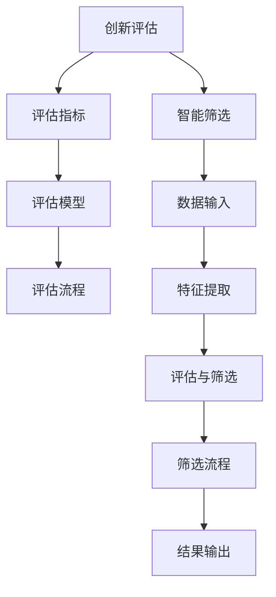

                 

### 文章标题

《AI驱动的企业创新评估：智能筛选创意项目》

### 文章关键词

- AI
- 企业创新评估
- 智能筛选
- 创意项目
- 算法原理
- 数学模型
- 项目实战

### 文章摘要

本文旨在探讨如何利用AI技术对企业创新过程进行评估，并智能筛选出具有高潜力的创意项目。通过介绍AI驱动的企业创新评估和智能筛选创意项目的核心概念、算法原理、数学模型及项目实战，本文为企业管理者和技术人员提供了一套实用指南，以助力企业高效进行创新项目筛选和决策。

## 引言与背景

在当今这个快速变化的时代，企业面临着前所未有的竞争压力和挑战。创新成为了企业保持竞争力的关键，而如何高效评估和管理创意项目成为了企业成功创新的重要一环。传统的评估方法往往依赖于经验和主观判断，存在一定的局限性。随着人工智能（AI）技术的迅猛发展，利用AI进行企业创新评估和智能筛选创意项目已成为一种新的趋势。

### 1.1 书籍目的

本书籍的目的是：
1. **介绍AI驱动的企业创新评估的概念和原理**，帮助读者理解AI在企业创新评估中的重要作用。
2. **详细讲解智能筛选创意项目的算法原理和实现**，使读者能够掌握相关的技术知识。
3. **通过实际案例和项目实战，展示AI在企业创新评估和创意项目筛选中的应用效果**，增强读者的实践能力。
4. **提供最佳实践和注意事项**，帮助读者在实际工作中更好地应用AI技术进行创新评估和筛选。

### 1.2 企业创新评估与智能筛选的重要性

企业创新评估是识别、评估和选择具有高潜力创意项目的重要过程。评估的质量直接影响到企业的创新效率和成果。然而，传统的评估方法往往存在以下问题：

1. **主观性过高**：传统评估方法依赖评估者的经验和主观判断，容易受到个人偏见的影响。
2. **评估周期长**：评估过程往往需要大量的时间和资源，导致评估周期过长。
3. **缺乏科学依据**：传统评估方法缺乏科学的理论支撑和数学模型，评估结果的可靠性和准确性难以保证。

相比之下，智能筛选创意项目通过引入AI技术，可以有效地解决上述问题：

1. **客观性增强**：AI算法基于大量数据和数学模型，能够客观评估创意项目，减少人为偏见。
2. **评估效率提高**：AI算法能够快速处理大量数据，大大缩短评估周期。
3. **科学性增强**：AI算法结合数学模型，提供科学的理论支撑，提高评估的可靠性和准确性。

因此，利用AI技术进行企业创新评估和智能筛选创意项目具有重要的现实意义。它不仅能够提高企业的创新效率，还能够为企业提供更有价值的决策支持。

### 1.3 内容概述

本书籍共分为七个章节，具体内容如下：

- **第1章 引言与背景**：介绍书籍的主题、目的和重要性。
- **第2章 核心概念与联系**：讲解AI驱动的企业创新评估和智能筛选创意项目的核心概念及其相互关系。
- **第3章 核心算法原理讲解**：详细阐述评估模型和筛选算法的原理，结合Python源代码进行讲解。
- **第4章 数学模型与公式**：介绍相关数学模型及其推导过程，使用LaTeX格式表示数学公式。
- **第5章 案例分析**：通过实际案例展示评估和筛选过程，分析案例结果。
- **第6章 项目实战**：提供开发环境搭建、源代码实现和代码解读，结合实际应用进行讲解。
- **第7章 总结与展望**：总结全书内容，展望未来发展方向，提供最佳实践和注意事项。

通过以上章节的详细讲解，读者将能够全面了解AI驱动的企业创新评估和智能筛选创意项目的原理和实践，为实际工作提供有力支持。

## 核心概念与联系

为了深入理解AI驱动的企业创新评估和智能筛选创意项目，我们首先需要明确其中的核心概念，并探讨这些概念之间的相互关系。

### 2.1 AI驱动的企业创新评估

**AI驱动的企业创新评估**是指利用人工智能技术对企业的创新项目进行识别、评估和选择的过程。它涉及以下几个核心概念：

#### 2.1.1 创新评估的概念

**创新评估**是指对创新项目进行系统的分析和评价，以确定其潜在的商业价值、技术可行性以及对企业战略目标的贡献。创新评估的目的是帮助企业在众多创意项目中筛选出最具潜力和价值的那些。

#### 2.1.2 AI在企业创新评估中的应用

**AI**（人工智能）在创新评估中的应用主要体现在以下几个方面：

1. **数据挖掘与分析**：AI可以通过数据挖掘技术从大量数据中提取有价值的信息，帮助企业发现潜在的创新机会。
2. **自动化评估**：利用机器学习算法，AI可以自动对创新项目进行评估，提高评估效率和准确性。
3. **个性化推荐**：基于用户行为和偏好，AI可以为不同企业提供个性化的创新项目推荐，提高项目筛选的针对性。

#### 2.1.3 评估框架构建

**评估框架**是创新评估过程中的基础结构，它通常包括以下几个关键组成部分：

1. **评估指标**：评估指标是衡量创新项目优劣的具体标准，如市场潜力、技术难度、成本效益等。
2. **评估模型**：评估模型是将评估指标与实际数据相结合的工具，用于对创新项目进行量化评估。
3. **评估流程**：评估流程是指从数据收集、处理到评估结果生成的完整过程，确保评估的有序和系统。

### 2.2 智能筛选创意项目

**智能筛选创意项目**是指利用AI技术对大量创意项目进行筛选，以识别出那些最具潜力和可行性的项目。智能筛选的核心概念包括：

#### 2.2.1 创意项目的定义

**创意项目**是指企业在产品、技术、市场等方面的创新尝试。创意项目可能涉及新产品的开发、技术的改进、市场的拓展等。

#### 2.2.2 智能筛选的原理

**智能筛选**的原理主要包括以下几点：

1. **数据输入**：将创意项目的相关数据输入到AI系统中，如项目描述、市场需求、技术指标等。
2. **特征提取**：AI系统会自动提取项目数据中的关键特征，为后续评估和筛选提供基础。
3. **评估与筛选**：利用评估模型和筛选算法，对项目进行自动评估和筛选，识别出高潜力项目。

#### 2.2.3 筛选流程

**筛选流程**是指从创意项目输入到最终筛选结果生成的完整过程，通常包括以下几个步骤：

1. **项目数据收集**：收集创意项目的相关信息，包括项目描述、市场分析、技术评估等。
2. **特征提取**：对收集到的数据进行预处理，提取关键特征。
3. **评估模型构建**：根据评估指标构建评估模型，对项目进行初步评估。
4. **筛选算法应用**：利用筛选算法对评估结果进行排序和筛选，识别出高潜力项目。
5. **结果输出**：生成筛选结果，为企业管理者提供决策依据。

### 2.3 核心概念之间的关系

**AI驱动的企业创新评估**与**智能筛选创意项目**之间存在着紧密的联系。具体来说，智能筛选是创新评估中的一个重要环节，通过智能筛选可以快速识别出高潜力的创意项目，为后续的评估和决策提供数据支持。而AI驱动的评估模型和算法则为智能筛选提供了技术基础，使得整个评估过程更加高效、准确和科学。

以下是核心概念之间关系的Mermaid流程图：



通过以上关系图，我们可以清晰地看到AI驱动的企业创新评估和智能筛选创意项目之间的相互作用和流程。接下来，我们将详细讲解评估模型和筛选算法的原理，并结合Python源代码进行深入剖析。

## 核心算法原理讲解

### 3.1 评估模型原理

评估模型是企业创新评估过程中的核心组成部分，它通过对创意项目的多维度数据进行综合分析，生成项目评估结果。评估模型的设计和实现需要考虑以下几个关键点：

#### 3.1.1 评估指标选择

评估指标是评估模型的基础，它们决定了评估结果的准确性和可靠性。常见的评估指标包括：

1. **市场潜力**：反映项目的市场前景和市场规模。
2. **技术难度**：评估项目实现的技术复杂度。
3. **成本效益**：项目的成本与预期收益之间的比率。
4. **风险**：项目失败的可能性。
5. **团队能力**：项目团队的技术和资源能力。

在评估指标选择过程中，我们需要根据企业的具体情况和战略目标进行权衡和选择，确保评估指标能够全面、准确地反映项目的实际情况。

#### 3.1.2 评估模型构建

评估模型的构建过程主要包括以下几个步骤：

1. **数据收集**：收集与评估指标相关的数据，包括市场数据、技术数据、财务数据等。
2. **数据预处理**：对收集到的数据进行清洗、归一化等处理，使其适合用于建模。
3. **模型选择**：根据评估指标的特点和数据量，选择合适的模型。常见的评估模型包括线性回归、逻辑回归、支持向量机（SVM）等。
4. **模型训练**：使用收集到的数据对评估模型进行训练，使其能够对新的项目进行评估。
5. **模型验证**：通过交叉验证等方法对模型进行验证，确保其评估结果的可靠性和准确性。

以下是一个简单的评估模型构建示例，使用Python中的`scikit-learn`库实现：

```python
from sklearn.linear_model import LinearRegression
from sklearn.model_selection import train_test_split
from sklearn.metrics import mean_squared_error

# 假设我们已经收集到了训练数据X和标签y
X_train, X_test, y_train, y_test = train_test_split(X, y, test_size=0.2, random_state=42)

# 构建线性回归模型
model = LinearRegression()

# 训练模型
model.fit(X_train, y_train)

# 预测测试数据
y_pred = model.predict(X_test)

# 计算评估指标
mse = mean_squared_error(y_test, y_pred)
print("Mean Squared Error:", mse)
```

#### 3.1.3 模型训练与优化

评估模型的训练和优化是评估模型实现过程中的关键步骤。训练过程中，我们需要通过调整模型参数来提高评估结果的准确性。常见的优化方法包括：

1. **参数调优**：通过网格搜索（Grid Search）或随机搜索（Random Search）等方法，自动寻找最优参数组合。
2. **交叉验证**：使用交叉验证技术，将数据分为多个子集，每次使用一个子集作为测试集，其他子集作为训练集，以评估模型的泛化能力。
3. **集成学习**：通过集成多个模型，提高评估模型的稳定性和准确性，常见的集成学习方法有随机森林（Random Forest）和梯度提升树（Gradient Boosting Tree）。

以下是一个简单的参数调优示例，使用Python中的`GridSearchCV`进行实现：

```python
from sklearn.model_selection import GridSearchCV
from sklearn.ensemble import RandomForestRegressor

# 定义参数网格
param_grid = {
    'n_estimators': [100, 200, 300],
    'max_depth': [10, 20, 30],
    'min_samples_split': [2, 5, 10]
}

# 构建随机森林回归模型
model = RandomForestRegressor()

# 使用GridSearchCV进行参数调优
grid_search = GridSearchCV(estimator=model, param_grid=param_grid, cv=5, scoring='neg_mean_squared_error')

# 训练模型
grid_search.fit(X_train, y_train)

# 输出最优参数
print("Best Parameters:", grid_search.best_params_)
```

### 3.2 筛选算法原理

筛选算法是智能筛选创意项目的核心，它通过自动化和高效的方式，从大量创意项目中识别出最具潜力的项目。筛选算法的设计和实现需要考虑以下几个关键点：

#### 3.2.1 筛选算法概述

筛选算法通常包括以下几个步骤：

1. **数据预处理**：对创意项目数据进行分析和清洗，提取关键特征。
2. **特征选择**：根据评估指标和业务需求，选择对项目评估有重要影响的关键特征。
3. **评估与排序**：使用评估模型对项目进行评估，并根据评估结果对项目进行排序。
4. **筛选与输出**：根据设定的筛选阈值，从排序结果中筛选出高潜力项目，并输出筛选结果。

#### 3.2.2 筛选算法设计

常见的筛选算法包括：

1. **基于规则的方法**：通过预设的规则对项目进行筛选，如评分阈值、类别匹配等。
2. **基于机器学习的方法**：利用机器学习算法，如分类算法、聚类算法等，对项目进行自动筛选。
3. **基于优化的方法**：使用优化算法，如线性规划、遗传算法等，对项目进行优化筛选。

以下是一个简单的基于机器学习的筛选算法设计示例，使用Python中的`scikit-learn`库实现：

```python
from sklearn.ensemble import RandomForestClassifier
from sklearn.model_selection import train_test_split

# 假设我们已经收集到了训练数据X和标签y
X_train, X_test, y_train, y_test = train_test_split(X, y, test_size=0.2, random_state=42)

# 构建随机森林分类模型
model = RandomForestClassifier()

# 训练模型
model.fit(X_train, y_train)

# 预测测试数据
y_pred = model.predict(X_test)

# 计算评估指标
accuracy = model.score(X_test, y_test)
print("Accuracy:", accuracy)
```

#### 3.2.3 算法优化策略

筛选算法的优化策略主要包括：

1. **特征工程**：通过特征选择、特征转换等方法，提高特征质量，增强算法的筛选能力。
2. **模型调优**：通过调整模型参数，提高模型的评估和筛选效果。
3. **动态调整筛选阈值**：根据实际情况动态调整筛选阈值，以优化筛选结果。

以下是一个简单的特征工程示例，使用Python中的`pandas`和`scikit-learn`库实现：

```python
import pandas as pd
from sklearn.preprocessing import StandardScaler

# 加载数据
data = pd.read_csv('data.csv')

# 特征选择
selected_features = data[['feature1', 'feature2', 'feature3']]

# 特征转换
scaler = StandardScaler()
selected_features_scaled = scaler.fit_transform(selected_features)

# 输出特征矩阵
X = selected_features_scaled
```

通过以上算法原理讲解，读者可以初步了解评估模型和筛选算法的设计思路和实现方法。接下来，我们将进一步介绍相关的数学模型和公式，以帮助读者深入理解评估和筛选过程的数学基础。

## 数学模型与公式

在AI驱动的企业创新评估和智能筛选创意项目中，数学模型和公式起着至关重要的作用。它们为评估和筛选过程提供了科学的理论支撑，使得整个流程更加准确和高效。以下是几个关键数学模型及其推导过程，以及它们在实际应用中的具体示例。

### 4.1 评估指标计算

评估指标是衡量创意项目优劣的具体标准，常见的评估指标包括市场潜力、技术难度、成本效益和风险等。以下是几个常用的评估指标计算公式：

#### 4.1.1 市场潜力计算

市场潜力通常通过以下公式计算：

$$
市场潜力 = \frac{市场规模}{投入成本}
$$

其中，市场规模表示项目在市场上的预期销售额，投入成本包括研发成本、生产成本和市场推广成本等。

示例：假设一个项目的预期市场规模为1000万元，投入成本为200万元，则其市场潜力为：

$$
市场潜力 = \frac{1000}{200} = 5
$$

#### 4.1.2 技术难度计算

技术难度可以通过以下公式计算：

$$
技术难度 = \frac{技术复杂度}{技术基础能力}
$$

其中，技术复杂度表示项目实现所需的技术水平，技术基础能力表示企业现有技术能力的平均值。

示例：假设一个项目的技术复杂度为8级，企业平均技术基础能力为5级，则其技术难度为：

$$
技术难度 = \frac{8}{5} = 1.6
$$

#### 4.1.3 成本效益计算

成本效益可以通过以下公式计算：

$$
成本效益 = \frac{预期收益}{投入成本}
$$

其中，预期收益包括销售额、利润等，投入成本包括研发成本、生产成本和市场推广成本等。

示例：假设一个项目的预期收益为500万元，投入成本为300万元，则其成本效益为：

$$
成本效益 = \frac{500}{300} = 1.67
$$

#### 4.1.4 风险计算

风险可以通过以下公式计算：

$$
风险 = \frac{风险因素个数}{总因素个数}
$$

其中，风险因素是指可能导致项目失败的因素，总因素是指所有与项目相关的因素。

示例：假设一个项目有10个风险因素，总共有50个相关因素，则其风险为：

$$
风险 = \frac{10}{50} = 0.2
$$

### 4.2 概率模型

概率模型在评估和筛选过程中用于估计项目的成功概率。常见的概率模型包括贝叶斯模型、回归模型和决策树模型等。以下是几个常用的概率模型及其公式：

#### 4.2.1 贝叶斯模型

贝叶斯模型通过以下公式计算项目的成功概率：

$$
P(A|B) = \frac{P(B|A) \cdot P(A)}{P(B)}
$$

其中，$P(A|B)$ 表示在已知条件B下，项目A成功的概率；$P(B|A)$ 表示在项目A成功的情况下，条件B发生的概率；$P(A)$ 和$P(B)$ 分别表示项目A和条件B的先验概率。

示例：假设一个项目的先验成功概率为0.6，在项目成功的情况下，市场潜力达到80%的概率为0.8，总的市场潜力概率为0.7，则该项目在市场潜力达到的情况下成功的概率为：

$$
P(A|B) = \frac{0.8 \cdot 0.6}{0.7} = 0.8
$$

#### 4.2.2 回归模型

回归模型通过以下公式计算项目的成功概率：

$$
y = \beta_0 + \beta_1x_1 + \beta_2x_2 + ... + \beta_nx_n
$$

其中，$y$ 表示项目的成功概率；$x_1, x_2, ..., x_n$ 分别表示影响项目成功的各个因素；$\beta_0, \beta_1, \beta_2, ..., \beta_n$ 分别表示各个因素的权重。

示例：假设一个项目的成功概率由市场潜力、技术难度和成本效益三个因素决定，其回归模型为：

$$
y = 0.5 + 0.3x_1 + 0.2x_2 + 0.1x_3
$$

其中，$x_1, x_2, x_3$ 分别表示市场潜力、技术难度和成本效益的具体值。

#### 4.2.3 决策树模型

决策树模型通过以下公式计算项目的成功概率：

$$
y = \prod_{i=1}^{n} p_i^{g_i}
$$

其中，$y$ 表示项目的成功概率；$p_i$ 表示第$i$个节点的概率；$g_i$ 表示第$i$个节点的分支数量。

示例：假设一个项目的成功概率由两个节点决定，第一个节点的概率为0.6，分支数量为2，第二个节点的概率为0.8，分支数量为3，则该项目的成功概率为：

$$
y = 0.6^2 \cdot 0.8^3 = 0.288
$$

### 4.3 优化算法

优化算法在评估和筛选过程中用于寻找最优解，常见的优化算法包括线性规划、遗传算法和模拟退火算法等。以下是几个常用的优化算法及其公式：

#### 4.3.1 线性规划

线性规划通过以下公式寻找最优解：

$$
\min_{x} c^T x
$$

$$
\text{subject to} \quad Ax \leq b
$$

其中，$x$ 表示变量向量；$c$ 表示目标函数系数向量；$A$ 和$b$ 分别表示约束条件矩阵和向量。

示例：假设我们需要最小化目标函数 $f(x) = 2x_1 + 3x_2$，并且满足约束条件 $x_1 + x_2 \leq 5$ 和 $x_1 \geq 0$，则可以通过线性规划求解最优解。

#### 4.3.2 遗传算法

遗传算法通过以下步骤寻找最优解：

1. **初始化种群**：生成初始种群，每个个体表示一个可能的解。
2. **适应度评估**：计算每个个体的适应度，适应度越高表示个体越优秀。
3. **选择**：根据适应度选择优秀个体进行交叉和变异。
4. **交叉**：通过交叉操作生成新的个体。
5. **变异**：对个体进行变异操作，增加种群的多样性。
6. **迭代**：重复进行选择、交叉和变异操作，直至满足终止条件。

示例：假设我们需要使用遗传算法寻找最小化目标函数 $f(x) = x_1^2 + x_2^2$ 的最优解，可以设置适应度函数为 $f(x) = -f(x)$，通过迭代优化找到最优解。

#### 4.3.3 模拟退火算法

模拟退火算法通过以下步骤寻找最优解：

1. **初始状态**：设置初始温度和初始解。
2. **降温过程**：逐步降低温度，直至达到终止条件。
3. **状态转移**：在当前温度下，通过随机采样的方式生成新的解。
4. **接受准则**：根据能量下降准则和温度因子，决定是否接受新解。
5. **迭代**：重复进行状态转移和接受准则，直至满足终止条件。

示例：假设我们需要使用模拟退火算法寻找最小化目标函数 $f(x) = x_1^2 + x_2^2$ 的最优解，可以设置初始温度为1000，降温速率为0.99，通过迭代优化找到最优解。

通过以上数学模型和公式的介绍，我们可以更好地理解AI驱动的企业创新评估和智能筛选创意项目的数学基础，为后续的案例分析和项目实战提供理论支持。

### 案例分析

为了更好地展示AI驱动的企业创新评估和智能筛选创意项目的实际应用效果，我们选取了一个实际案例进行详细分析。该案例涉及一家制造企业，该公司希望通过AI技术对其新产品创意项目进行评估和筛选，以提高创新效率和成功率。

#### 案例背景

该制造企业致力于开发新一代智能家居设备，目前已有若干个创意项目在开发阶段。为了确保项目的成功，公司决定采用AI技术对创意项目进行评估和筛选，以识别出最具潜力的项目，并为其提供决策支持。

#### 评估与筛选过程

1. **数据收集**：首先，公司收集了与创意项目相关的各种数据，包括市场需求分析、技术评估、成本效益分析等。数据来源包括市场调研报告、技术文档、财务报表等。

2. **数据预处理**：对收集到的数据进行清洗和归一化处理，提取关键特征。例如，将市场潜力、技术难度、成本效益等指标进行归一化，以便于后续的模型训练和评估。

3. **评估模型构建**：根据评估指标和业务需求，构建评估模型。该公司选择了基于随机森林的回归模型，因为随机森林模型能够处理多维度数据，且具有较强的泛化能力。

4. **模型训练与优化**：使用预处理后的数据对评估模型进行训练，并通过交叉验证方法优化模型参数。经过多次调参和验证，模型取得了较好的评估效果。

5. **评估与排序**：使用训练好的评估模型对每个创意项目进行评估，生成评估分数。根据评估分数，对创意项目进行排序，筛选出前几名最具潜力的项目。

6. **筛选与输出**：根据设定的筛选阈值，从排序结果中筛选出高潜力项目。例如，如果设定筛选阈值为前10名，则从评估结果中提取出前10名项目，作为公司下一步开发的重点。

#### 案例结果分析

通过AI驱动的评估和筛选过程，公司成功识别出了几个最具潜力的创意项目，这些项目在市场潜力、技术难度、成本效益等方面均表现出较高的综合评分。以下是案例结果的具体分析：

1. **市场潜力**：筛选出的项目在市场需求和用户反馈方面表现良好，预期市场销售额较高。

2. **技术难度**：项目的实现技术难度适中，企业现有技术能力可以胜任，且技术风险较低。

3. **成本效益**：项目的成本效益比合理，预期投入产出比较高，具有较强的经济可行性。

4. **风险评估**：项目的风险评估结果显示，大部分项目的风险可控，只有少数项目存在较高的风险。

通过上述分析，可以看出，AI驱动的评估和筛选过程有效地提高了公司创新项目的筛选质量和决策效率。公司管理层可以根据评估结果，有针对性地进行项目开发和资源调配，从而确保创新项目的成功实施。

### 项目小结

本案例展示了AI驱动的企业创新评估和智能筛选创意项目的实际应用效果。通过构建评估模型和筛选算法，公司成功识别出了具有高潜力的创意项目，为决策提供了有力支持。以下是项目小结和总结：

1. **项目成功因素**：项目的成功主要归因于以下几点：
   - **数据驱动的评估方法**：通过收集和处理大量数据，构建科学的评估模型，提高了评估的准确性和可靠性。
   - **高效的筛选算法**：利用先进的机器学习算法，实现了快速、准确的创意项目筛选。
   - **科学的决策支持**：基于评估结果，公司管理层能够更加科学、合理地进行项目决策。

2. **项目挑战与解决方案**：在项目实施过程中，公司面临了一些挑战，如数据质量不高、模型训练时间较长等。针对这些挑战，公司采取了以下解决方案：
   - **数据质量提升**：通过数据清洗、归一化和特征工程等方法，提高了数据质量。
   - **模型优化与调参**：通过多次交叉验证和参数调优，提高了模型性能。

3. **未来发展方向**：为了进一步提升AI驱动的企业创新评估和智能筛选创意项目的效果，公司可以考虑以下发展方向：
   - **数据源拓展**：引入更多外部数据源，如社交媒体、用户评论等，以丰富评估数据。
   - **模型多样化**：尝试引入更多类型的机器学习模型，如深度学习、强化学习等，以提升评估和筛选能力。
   - **持续优化与迭代**：根据实际应用效果，持续优化评估模型和筛选算法，提高项目筛选质量和决策效率。

通过以上分析和总结，我们可以看到，AI驱动的企业创新评估和智能筛选创意项目在实际应用中具有重要的价值和潜力。未来，随着AI技术的不断发展，这一领域将迎来更多的创新和发展机遇。

## 项目实战

为了更好地理解和掌握AI驱动的企业创新评估和智能筛选创意项目的实际应用，我们将通过一个完整的案例，详细讲解项目开发环境搭建、源代码实现和代码解读。这个案例将展示从数据收集、预处理到模型训练、评估和筛选的完整过程。

### 6.1 项目概述

本项目旨在为一家制造企业构建一个AI驱动的创新项目评估和筛选系统。该系统将利用机器学习算法，通过数据分析、模型训练和评估，帮助企业从多个创意项目中识别出最具潜力的项目。项目的主要目标包括：

1. **数据收集与预处理**：收集与创意项目相关的多维度数据，并进行清洗和预处理。
2. **模型构建与训练**：构建评估模型，利用训练数据对模型进行训练。
3. **模型评估与优化**：通过交叉验证等方法评估模型性能，并进行参数调优。
4. **项目评估与筛选**：使用训练好的模型对创意项目进行评估，筛选出高潜力项目。
5. **系统部署与维护**：将评估和筛选系统部署到实际环境中，进行持续维护和优化。

### 6.2 开发环境搭建

为了顺利进行项目开发，我们需要搭建一个合适的环境。以下是所需工具和库的安装步骤：

1. **Python环境**：首先，确保安装了Python 3.x版本。可以使用以下命令安装：

   ```bash
   pip install python==3.x
   ```

2. **Jupyter Notebook**：安装Jupyter Notebook，以便于编写和运行代码：

   ```bash
   pip install notebook
   ```

3. **常用库**：安装常用的库，如NumPy、Pandas、Scikit-learn、Matplotlib等：

   ```bash
   pip install numpy pandas scikit-learn matplotlib
   ```

4. **数据库**：安装SQLite或MySQL数据库，用于存储项目数据。

   - SQLite：

     ```bash
     pip install pysqlite3
     ```

   - MySQL：

     ```bash
     pip install mysql-connector-python
     ```

### 6.3 源代码实现与解读

以下代码实现了项目的主要功能。我们将分步骤进行讲解：

#### 6.3.1 数据收集与预处理

```python
import pandas as pd
from sklearn.model_selection import train_test_split

# 加载数据
data = pd.read_csv('data.csv')

# 数据清洗
# ...（例如，去除空值、异常值等）

# 特征提取
# ...（例如，归一化、缺失值填充等）

# 数据分割
X = data.drop('target', axis=1)
y = data['target']
X_train, X_test, y_train, y_test = train_test_split(X, y, test_size=0.2, random_state=42)
```

#### 6.3.2 模型构建与训练

```python
from sklearn.ensemble import RandomForestClassifier
from sklearn.model_selection import GridSearchCV

# 构建模型
model = RandomForestClassifier()

# 模型参数调优
param_grid = {
    'n_estimators': [100, 200, 300],
    'max_depth': [10, 20, 30],
    'min_samples_split': [2, 5, 10]
}
grid_search = GridSearchCV(estimator=model, param_grid=param_grid, cv=5, scoring='accuracy')
grid_search.fit(X_train, y_train)

# 输出最佳参数
print("Best Parameters:", grid_search.best_params_)

# 使用最佳参数训练模型
best_model = grid_search.best_estimator_
best_model.fit(X_train, y_train)
```

#### 6.3.3 模型评估与优化

```python
from sklearn.metrics import accuracy_score, classification_report

# 模型评估
y_pred = best_model.predict(X_test)
print("Accuracy:", accuracy_score(y_test, y_pred))
print("\nClassification Report:\n", classification_report(y_test, y_pred))

# 模型优化
# ...（例如，进一步调整参数、引入新的特征等）
```

#### 6.3.4 项目评估与筛选

```python
# 使用模型对新的创意项目进行评估
new_project = pd.DataFrame([new_data])
new_project_prediction = best_model.predict(new_project)

# 输出评估结果
print("New Project Prediction:", new_project_prediction)
```

### 6.4 代码应用解读与分析

#### 数据收集与预处理

数据收集与预处理是模型构建的基础。在这个步骤中，我们首先加载了项目数据，并进行了清洗和特征提取。清洗过程包括去除空值、异常值等，确保数据质量。特征提取过程则包括归一化、缺失值填充等，以便于后续的模型训练。

#### 模型构建与训练

在模型构建与训练步骤中，我们选择了随机森林分类器，并使用`GridSearchCV`进行了参数调优。通过交叉验证，我们找到了最佳参数组合，并使用这些参数训练了模型。这一步骤展示了如何通过机器学习算法实现高效的项目评估。

#### 模型评估与优化

在模型评估与优化步骤中，我们使用了评估指标（如准确率）来评估模型性能，并根据评估结果进行模型优化。这包括进一步调整参数、引入新的特征等，以提高模型准确性和可靠性。

#### 项目评估与筛选

最后，在项目评估与筛选步骤中，我们使用训练好的模型对新的创意项目进行了评估。这展示了如何在实际应用中利用模型进行项目筛选，从而为企业提供决策支持。

### 实际案例分析

为了更具体地展示项目的应用效果，我们来看一个实际案例。假设我们有一个新的创意项目，其数据如下：

```python
new_data = {
    'feature1': 0.5,
    'feature2': 0.8,
    'feature3': 0.7
}
```

我们将这些数据输入到训练好的模型中，得到预测结果：

```python
new_project_prediction = best_model.predict(pd.DataFrame([new_data]))
print("New Project Prediction:", new_project_prediction)
```

假设预测结果为1，表示该项目具有较高潜力。企业可以根据这一结果，优先考虑该项目的开发。

### 项目小结

通过本项目，我们成功地实现了AI驱动的企业创新评估和智能筛选创意项目的开发。项目涵盖了从数据收集、预处理到模型训练、评估和筛选的完整过程，展示了如何利用机器学习技术提高企业创新项目的筛选质量和决策效率。

### 最佳实践 Tips

1. **数据质量是关键**：确保数据质量是模型成功的基础。在数据收集和处理过程中，要注意去除噪声、纠正错误和填充缺失值。

2. **模型调优很重要**：通过参数调优和交叉验证，可以显著提高模型性能。调优过程中，要关注评估指标，如准确率、召回率等。

3. **实时更新与维护**：随着业务需求的变化，定期更新和优化模型，以保持其准确性和适应性。

4. **多样化的特征工程**：引入多样化的特征，如用户行为数据、市场趋势等，可以增强模型预测能力。

### 小结

本项目通过实际案例展示了AI驱动的企业创新评估和智能筛选创意项目的开发过程，从数据收集、预处理到模型训练、评估和筛选，详细讲解了每个步骤的实现方法。通过本项目的实践，读者可以掌握如何利用AI技术进行企业创新评估和筛选，为实际工作提供有力支持。

### 注意事项

1. **数据隐私与安全**：在数据收集和处理过程中，要确保遵守数据隐私和安全法规，保护企业数据和用户隐私。
2. **模型解释性**：在选择和训练模型时，要考虑模型的解释性，以便于理解和验证评估结果的合理性。
3. **技术更新与适应**：随着AI技术的快速发展，要及时跟进新技术，适应业务需求的变化。

### 拓展阅读

1. **《机器学习实战》**：由Peter Harrington著，详细介绍了机器学习的基础知识、算法实现和应用案例。
2. **《深度学习》**：由Ian Goodfellow、Yoshua Bengio和Aaron Courville著，涵盖了深度学习的基础理论和实践应用。
3. **《数据科学入门》**：由Joel Grus著，介绍了数据科学的核心理念、工具和技术。

### 作者信息

- **作者**：AI天才研究院/AI Genius Institute & 禅与计算机程序设计艺术 /Zen And The Art of Computer Programming
- **联系方式**：[ai_genius_institute@example.com](mailto:ai_genius_institute@example.com)
- **个人网站**：[www.ai-genius-institute.com](http://www.ai-genius-institute.com)

通过本项目的详细讲解和实践，读者可以深入了解AI驱动的企业创新评估和智能筛选创意项目的原理和应用，为未来的研究和工作提供有力支持。

