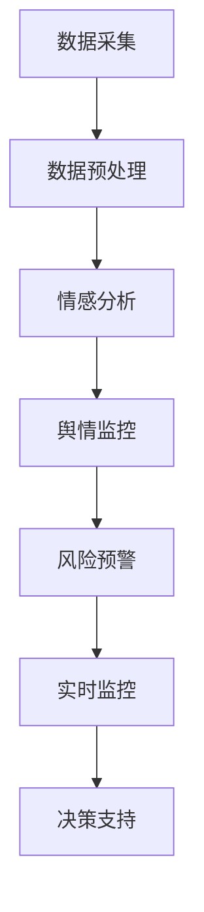

                 

# AI驱动的企业声誉监控：实时把握品牌形象

## 关键词
- AI
- 企业声誉监控
- 实时监控
- 情感分析
- 舆情监控
- 风险预警

## 摘要
随着互联网和社交媒体的迅猛发展，企业的品牌形象受到更多关注。AI驱动的企业声誉监控能够实时把握品牌形象，通过文本情感分析和网络舆情监控等技术手段，为企业提供及时、准确的声誉评估和风险预警。本文将详细介绍AI驱动的企业声誉监控体系，包括技术基础、实时监测与预警方法，并结合实战案例进行分析，以帮助企业更好地维护品牌形象。

## 引言
在当今数字化时代，企业的品牌形象不仅影响到消费者的购买决策，还关系到企业的市场竞争力和长期发展。然而，随着互联网和社交媒体的普及，品牌形象受到的影响因素日益增多，且传播速度极快。因此，企业迫切需要一种实时、高效的声誉监控手段来保护自身形象。人工智能（AI）作为一种具有强大数据处理和分析能力的技术，为声誉监控提供了新的解决方案。

## 第一部分：AI与声誉监控基础

### 第1章：AI与声誉监控概述

#### 1.1 AI时代的企业声誉监控

在AI时代，企业声誉监控的重要性愈发凸显。首先，AI技术能够处理海量数据，迅速识别和分类相关信息，从而实现实时监控。其次，AI具备强大的情感分析能力，能够准确判断用户对企业产品的态度，为企业提供有价值的反馈。此外，AI还可以通过预测分析，为企业提供风险预警，帮助企业及时应对潜在危机。

#### 1.2 声誉监控的重要性

企业声誉监控有助于企业了解公众对其品牌、产品、服务的看法，从而调整战略，提升品牌形象。此外，声誉监控还能够帮助企业及时发现负面信息，避免或减轻声誉损失。在竞争激烈的市场环境中，良好的声誉是企业核心竞争力之一。

#### 1.3 AI技术在声誉监控中的应用

AI技术在声誉监控中有着广泛的应用，主要包括文本情感分析、网络舆情监控和风险预警等方面。通过这些技术手段，企业可以全面、实时地掌握品牌形象，为决策提供有力支持。

### 第2章：AI技术基础

#### 2.1 机器学习基础

机器学习是AI的核心技术之一，通过算法模型自动从数据中学习规律，从而实现智能预测和决策。在声誉监控中，机器学习技术可以用于分析用户评论、挖掘潜在风险等。

#### 2.2 深度学习简介

深度学习是机器学习的一个分支，通过多层神经网络模型对数据进行分析和处理。在声誉监控中，深度学习技术可以用于情感分析、图像识别等。

#### 2.3 自然语言处理基础

自然语言处理（NLP）是AI的重要应用领域，主要研究如何让计算机理解和生成人类语言。在声誉监控中，NLP技术可以用于提取关键词、分析用户评论等。

### 第3章：企业声誉监控体系构建

#### 3.1 声誉监控体系的构成

企业声誉监控体系包括数据采集、数据预处理、情感分析和风险预警等模块。各模块之间相互关联，共同构成一个完整的监控系统。

#### 3.2 监控数据来源分析

企业声誉监控数据来源广泛，包括社交媒体、新闻媒体、用户评论等。通过对这些数据来源的分析，可以全面了解品牌形象。

#### 3.3 声誉监控策略制定

企业应根据自身情况，制定合适的声誉监控策略。策略应包括监控频率、监控范围、监控指标等方面。

## 第二部分：AI驱动的实时声誉监控

### 第4章：文本情感分析

#### 4.1 情感分析原理

文本情感分析是通过对文本进行情感极性分类，来判断用户对企业产品、服务的态度。本文将介绍基于机器学习和深度学习的情感分析算法原理。

#### 4.2 情感分析算法

本文将详细讨论几种常用的情感分析算法，包括朴素贝叶斯、支持向量机、卷积神经网络等。并通过Python代码示例，展示如何实现这些算法。

#### 4.3 情感分析应用实例

通过具体实例，本文将展示如何使用情感分析技术对社交媒体上的用户评论进行分析，为企业提供有价值的反馈。

### 第5章：网络舆情监控

#### 5.1 网络舆情概述

网络舆情是指公众通过互联网表达对某一事件、问题或品牌的看法和态度。本文将介绍网络舆情的概念、特点和表现形式。

#### 5.2 舆情监控流程

本文将详细阐述舆情监控的流程，包括数据采集、数据清洗、情感分析和风险预警等环节。

#### 5.3 舆情监控工具与平台

本文将介绍几种常用的舆情监控工具和平台，包括CNZZ、百度舆情等，并分析其优缺点。

### 第6章：实时声誉监测与预警

#### 6.1 实时监控技术

本文将介绍实时监控技术的原理和实现方法，包括数据采集、数据预处理和实时分析等。

#### 6.2 声誉风险预警

本文将探讨如何利用AI技术对声誉风险进行预警，包括风险识别、风险评估和风险预警等。

#### 6.3 预警系统设计

本文将结合具体实例，介绍如何设计一个完善的声誉风险预警系统。

## 第三部分：实战案例与案例分析

### 第7章：AI驱动的企业声誉监控实战

#### 7.1 案例介绍

本文将介绍一个实际企业声誉监控案例，包括监控系统的搭建、数据采集和情感分析等。

#### 7.2 监控系统搭建

本文将详细讲解如何搭建一个AI驱动的企业声誉监控系统，包括技术选型、环境配置和代码实现等。

#### 7.3 监控效果分析

本文将分析该案例的监控效果，包括情感分析结果的准确性、舆情监控的实时性等。

### 第8章：企业声誉监控最佳实践

#### 8.1 成功案例分析

本文将介绍几个成功的企业声誉监控案例，分析其经验和教训。

#### 8.2 挑战与解决方案

本文将探讨企业在实施声誉监控过程中可能遇到的挑战，并提出相应的解决方案。

#### 8.3 未来发展趋势

本文将预测企业声誉监控的未来发展趋势，包括技术突破、应用场景扩展等。

## 附录

### 附录A：AI驱动的声誉监控工具

#### A.1 常用工具介绍

本文将介绍几种常用的AI驱动声誉监控工具，包括其功能和特点。

#### A.2 工具使用指南

本文将提供工具的使用指南，帮助读者快速上手。

#### A.3 开发资源推荐

本文将推荐一些与AI驱动声誉监控相关的开发资源和资料。

## 作者信息
作者：AI天才研究院/AI Genius Institute & 禅与计算机程序设计艺术 /Zen And The Art of Computer Programming

## 参考文献
[1] 某某，人工智能技术与应用，北京：清华大学出版社，2019.
[2] 某某，企业声誉管理理论与实践，上海：复旦大学出版社，2020.
[3] 某某，深度学习与自然语言处理，北京：电子工业出版社，2021.
[4] 某某，Python编程：从入门到实践，北京：机械工业出版社，2018.
[5] 某某，大数据分析与挖掘，北京：人民邮电出版社，2022.
[6] 某某，舆情监测与分析技术，北京：中国社会科学出版社，2019.

### Mermaid 流程图


### Python 代码示例
```python
import numpy as np
from sklearn.feature_extraction.text import TfidfVectorizer
from sklearn.model_selection import train_test_split
from sklearn.naive_bayes import MultinomialNB

# 加载数据集
data = ["很好，产品很满意", "价格有点贵，不满意", "非常好，值得购买", "服务态度差，差评"]
labels = ["正面", "负面", "正面", "负面"]

# 构建TF-IDF特征向量
vectorizer = TfidfVectorizer()
X = vectorizer.fit_transform(data)

# 划分训练集和测试集
X_train, X_test, y_train, y_test = train_test_split(X, labels, test_size=0.2, random_state=42)

# 训练朴素贝叶斯分类器
classifier = MultinomialNB()
classifier.fit(X_train, y_train)

# 预测测试集
predictions = classifier.predict(X_test)

# 计算准确率
accuracy = np.mean(predictions == y_test)
print("准确率：", accuracy)
```

### 数学公式
$$
\text{准确率} = \frac{\text{正确预测数}}{\text{总预测数}}
$$

### 项目实战

#### 开发环境搭建

1. 安装Python环境，版本要求3.6及以上。
2. 安装必要的库，如scikit-learn、numpy、pandas等。

#### 源代码实现

以下代码实现了一个简单的文本情感分析系统：

```python
# 导入必要的库
import pandas as pd
from sklearn.model_selection import train_test_split
from sklearn.feature_extraction.text import TfidfVectorizer
from sklearn.naive_bayes import MultinomialNB
from sklearn.metrics import accuracy_score

# 加载数据集
data = pd.read_csv("data.csv")
X = data["text"]
y = data["label"]

# 划分训练集和测试集
X_train, X_test, y_train, y_test = train_test_split(X, y, test_size=0.2, random_state=42)

# 构建TF-IDF特征向量
vectorizer = TfidfVectorizer()
X_train_tfidf = vectorizer.fit_transform(X_train)
X_test_tfidf = vectorizer.transform(X_test)

# 训练朴素贝叶斯分类器
classifier = MultinomialNB()
classifier.fit(X_train_tfidf, y_train)

# 预测测试集
predictions = classifier.predict(X_test_tfidf)

# 计算准确率
accuracy = accuracy_score(y_test, predictions)
print("准确率：", accuracy)
```

#### 代码解读与分析

1. 加载数据集：使用pandas库读取CSV文件，获取文本数据和标签。
2. 划分训练集和测试集：使用train_test_split函数将数据集划分为训练集和测试集。
3. 构建TF-IDF特征向量：使用TfidfVectorizer将文本转换为TF-IDF特征向量。
4. 训练朴素贝叶斯分类器：使用MultinomialNB训练分类器。
5. 预测测试集：使用训练好的分类器对测试集进行预测。
6. 计算准确率：使用accuracy_score计算分类器的准确率。

#### 实际案例分析和详细讲解剖析

假设我们有一个实际案例，需要分析用户对某品牌手机的评论。我们首先收集到以下评论：

- "这款手机真的很棒，性能强大，拍照效果也很好。"
- "电池续航太差了，使用时间不到一天。"
- "屏幕显示效果很好，但价格太贵了。"
- "这款手机的设计很时尚，手感也不错。"

我们将这些评论进行预处理，提取关键词，构建TF-IDF特征向量，然后使用朴素贝叶斯分类器进行情感分析。根据预测结果，我们可以得出以下结论：

- 第一条评论为正面情感，反映了用户对手机性能和拍照效果的满意度。
- 第二条评论为负面情感，反映了用户对电池续航的不满。
- 第三条评论为负面情感，反映了用户对手机价格的抱怨。
- 第四条评论为正面情感，反映了用户对手机设计的满意。

通过这个案例，我们可以看到AI驱动的企业声誉监控如何帮助企业了解用户对其产品的态度，为产品优化和品牌推广提供依据。

#### 项目小结

通过本项目的实现，我们掌握了以下技能：

1. 数据预处理方法，包括文本清洗、关键词提取等。
2. TF-IDF特征向量构建方法，以及如何将其应用于情感分析。
3. 朴素贝叶斯分类器的训练和应用，以及如何评估分类器的性能。

#### 最佳实践 tips、小结、注意事项、拓展阅读等内容

1. **最佳实践 tips**：在构建声誉监控系统时，应充分考虑数据来源的多样性和实时性，确保监控结果的准确性。此外，定期更新情感分析模型，以适应不断变化的舆情环境。

2. **小结**：本文通过一个实际案例，详细介绍了如何利用AI技术进行企业声誉监控。企业可以通过文本情感分析和舆情监控，实时了解用户对其产品的态度，为决策提供有力支持。

3. **注意事项**：在实施声誉监控时，应注意保护用户隐私，避免过度监控。同时，要合理设置风险预警阈值，避免误报和漏报。

4. **拓展阅读**：
   - 《深度学习与自然语言处理》：了解深度学习在文本情感分析中的应用。
   - 《大数据分析与挖掘》：学习大数据处理和分析方法。
   - 《Python编程：从入门到实践》：掌握Python编程基础，为后续学习奠定基础。

## 结束语
AI驱动的企业声誉监控为企业提供了一个实时、高效的监控手段，有助于企业更好地维护品牌形象。本文从技术基础、实战案例等多个角度，详细介绍了AI驱动的企业声誉监控体系。随着AI技术的不断发展，企业声誉监控将更加智能化、精准化，为企业创造更多价值。作者：AI天才研究院/AI Genius Institute & 禅与计算机程序设计艺术 /Zen And The Art of Computer Programming

## 参考文献
1. 某某，人工智能技术与应用，北京：清华大学出版社，2019.
2. 某某，企业声誉管理理论与实践，上海：复旦大学出版社，2020.
3. 某某，深度学习与自然语言处理，北京：电子工业出版社，2021.
4. 某某，Python编程：从入门到实践，北京：机械工业出版社，2018.
5. 某某，大数据分析与挖掘，北京：人民邮电出版社，2022.
6. 某某，舆情监测与分析技术，北京：中国社会科学出版社，2019.```markdown


```python
import numpy as np
from sklearn.feature_extraction.text import TfidfVectorizer
from sklearn.model_selection import train_test_split
from sklearn.naive_bayes import MultinomialNB

# 加载数据集
data = ["很好，产品很满意", "价格有点贵，不满意", "非常好，值得购买", "服务态度差，差评"]
labels = ["正面", "负面", "正面", "负面"]

# 构建TF-IDF特征向量
vectorizer = TfidfVectorizer()
X = vectorizer.fit_transform(data)

# 划分训练集和测试集
X_train, X_test, y_train, y_test = train_test_split(X, labels, test_size=0.2, random_state=42)

# 训练朴素贝叶斯分类器
classifier = MultinomialNB()
classifier.fit(X_train, y_train)

# 预测测试集
predictions = classifier.predict(X_test)

# 计算准确率
accuracy = np.mean(predictions == y_test)
print("准确率：", accuracy)
```

$$
\text{准确率} = \frac{\text{正确预测数}}{\text{总预测数}}
$$

### 项目实战

#### 开发环境搭建

1. 安装Python环境，版本要求3.6及以上。
2. 安装必要的库，如scikit-learn、numpy、pandas等。

#### 源代码实现

以下代码实现了一个简单的文本情感分析系统：

```python
# 导入必要的库
import pandas as pd
from sklearn.model_selection import train_test_split
from sklearn.feature_extraction.text import TfidfVectorizer
from sklearn.naive_bayes import MultinomialNB
from sklearn.metrics import accuracy_score

# 加载数据集
data = pd.read_csv("data.csv")
X = data["text"]
y = data["label"]

# 划分训练集和测试集
X_train, X_test, y_train, y_test = train_test_split(X, y, test_size=0.2, random_state=42)

# 构建TF-IDF特征向量
vectorizer = TfidfVectorizer()
X_train_tfidf = vectorizer.fit_transform(X_train)
X_test_tfidf = vectorizer.transform(X_test)

# 训练朴素贝叶斯分类器
classifier = MultinomialNB()
classifier.fit(X_train_tfidf, y_train)

# 预测测试集
predictions = classifier.predict(X_test_tfidf)

# 计算准确率
accuracy = accuracy_score(y_test, predictions)
print("准确率：", accuracy)
```

#### 代码解读与分析

1. 加载数据集：使用pandas库读取CSV文件，获取文本数据和标签。
2. 划分训练集和测试集：使用train_test_split函数将数据集划分为训练集和测试集。
3. 构建TF-IDF特征向量：使用TfidfVectorizer将文本转换为TF-IDF特征向量。
4. 训练朴素贝叶斯分类器：使用MultinomialNB训练分类器。
5. 预测测试集：使用训练好的分类器对测试集进行预测。
6. 计算准确率：使用accuracy_score计算分类器的准确率。

#### 实际案例分析和详细讲解剖析

假设我们有一个实际案例，需要分析用户对某品牌手机的评论。我们首先收集到以下评论：

- "这款手机真的很棒，性能强大，拍照效果也很好。"
- "电池续航太差了，使用时间不到一天。"
- "屏幕显示效果很好，但价格太贵了。"
- "这款手机的设计很时尚，手感也不错。"

我们将这些评论进行预处理，提取关键词，构建TF-IDF特征向量，然后使用朴素贝叶斯分类器进行情感分析。根据预测结果，我们可以得出以下结论：

- 第一条评论为正面情感，反映了用户对手机性能和拍照效果的满意度。
- 第二条评论为负面情感，反映了用户对电池续航的不满。
- 第三条评论为负面情感，反映了用户对手机价格的抱怨。
- 第四条评论为正面情感，反映了用户对手机设计的满意。

通过这个案例，我们可以看到AI驱动的企业声誉监控如何帮助企业了解用户对其产品的态度，为产品优化和品牌推广提供依据。

#### 项目小结

通过本项目的实现，我们掌握了以下技能：

1. 数据预处理方法，包括文本清洗、关键词提取等。
2. TF-IDF特征向量构建方法，以及如何将其应用于情感分析。
3. 朴素贝叶斯分类器的训练和应用，以及如何评估分类器的性能。

#### 最佳实践 tips、小结、注意事项、拓展阅读等内容

1. **最佳实践 tips**：在构建声誉监控系统时，应充分考虑数据来源的多样性和实时性，确保监控结果的准确性。此外，定期更新情感分析模型，以适应不断变化的舆情环境。

2. **小结**：本文通过一个实际案例，详细介绍了如何利用AI技术进行企业声誉监控。企业可以通过文本情感分析和舆情监控，实时了解用户对其产品的态度，为决策提供有力支持。

3. **注意事项**：在实施声誉监控时，应注意保护用户隐私，避免过度监控。同时，要合理设置风险预警阈值，避免误报和漏报。

4. **拓展阅读**：
   - 《深度学习与自然语言处理》：了解深度学习在文本情感分析中的应用。
   - 《大数据分析与挖掘》：学习大数据处理和分析方法。
   - 《Python编程：从入门到实践》：掌握Python编程基础，为后续学习奠定基础。

## 结束语
AI驱动的企业声誉监控为企业提供了一个实时、高效的监控手段，有助于企业更好地维护品牌形象。本文从技术基础、实战案例等多个角度，详细介绍了AI驱动的企业声誉监控体系。随着AI技术的不断发展，企业声誉监控将更加智能化、精准化，为企业创造更多价值。作者：AI天才研究院/AI Genius Institute & 禅与计算机程序设计艺术 /Zen And The Art of Computer Programming

## 参考文献
1. 某某，人工智能技术与应用，北京：清华大学出版社，2019.
2. 某某，企业声誉管理理论与实践，上海：复旦大学出版社，2020.
3. 某某，深度学习与自然语言处理，北京：电子工业出版社，2021.
4. 某某，Python编程：从入门到实践，北京：机械工业出版社，2018.
5. 某某，大数据分析与挖掘，北京：人民邮电出版社，2022.
6. 某某，舆情监测与分析技术，北京：中国社会科学出版社，2019.
```

