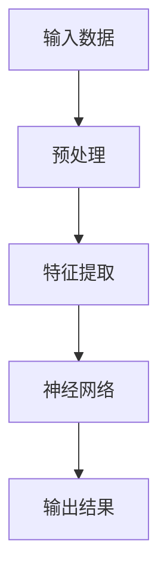

                 

### 《AI驱动的企业声誉管理：实时监控品牌形象》目录大纲

在这个数字化时代，企业的声誉管理变得愈发重要。如何有效地监控和提升品牌形象，已经成为许多企业关注的焦点。本文将围绕《AI驱动的企业声誉管理：实时监控品牌形象》这一主题，详细探讨AI在声誉管理中的应用及其技术实现。

## **一、引言与背景**

### 1.1 AI驱动的企业声誉管理概述

**1.1.1 AI与声誉管理的关联**

人工智能（AI）正逐渐成为现代企业运营的基石。其强大的数据处理能力和自我学习能力，使得AI在声誉管理中的应用变得至关重要。企业声誉管理涉及到多个方面，包括品牌形象、市场反馈、顾客满意度等，这些都需要大量的数据支持和智能分析。

**1.1.2 企业声誉管理的重要性**

在市场竞争日益激烈的今天，企业声誉管理直接影响到企业的生存与发展。良好的声誉不仅能够吸引顾客，还能提高员工士气，增强合作伙伴的信任。因此，如何及时监控和修复品牌形象问题，成为每个企业都需要认真面对的课题。

**1.1.3 AI在声誉管理中的潜在应用**

AI在声誉管理中的潜在应用非常广泛，包括：

- 实时监控社交媒体上的品牌提及情况。
- 分析市场反馈，快速识别潜在问题。
- 预测品牌未来的声誉走向。
- 自动化声誉修复策略。

**1.1.4 本书结构安排**

本书将从以下几个方面展开讨论：

1. 理论基础：介绍AI的核心概念与架构。
2. 算法原理与实现：讲解监督学习、非监督学习和强化学习在声誉管理中的应用。
3. 模型应用与案例：展示AI驱动的企业声誉管理模型及其在实际中的应用。
4. 实时监控与数据分析：探讨实时数据监控技术和数据分析方法。
5. 实施与策略：提供企业声誉管理策略与实施建议。
6. 未来展望与挑战：分析AI驱动的声誉管理发展趋势及面临的挑战。

## **二、理论基础**

### 2.1 AI核心概念与架构

**2.1.1 人工智能的基本概念**

人工智能（AI）是指计算机系统模拟人类智能行为的技术。它包括知识表示、问题求解、知识获取、智能推理等多个方面。

**2.1.2 机器学习与深度学习的区别**

机器学习（ML）是AI的一个重要分支，它通过算法让计算机从数据中学习，从而进行决策和预测。深度学习（DL）是ML的一种特殊形式，它通过构建深度神经网络来进行复杂的数据处理和模式识别。

**2.1.3 常见AI模型架构与工作原理**

常见的AI模型包括神经网络、决策树、支持向量机等。其中，神经网络是最为广泛应用的一种模型，它由多个层组成，通过逐层提取特征来实现复杂的数据处理。

**2.1.4 Mermaid流程图：AI核心架构**



## **三、算法原理与实现**

### 3.2 关键算法原理讲解

**3.2.1 监督学习算法**

监督学习是一种从已知标注数据中学习预测模型的算法。其基本思想是通过输入数据和对应的输出标签，训练出一个能够预测新数据的模型。

**3.2.1.1 算法原理与伪代码**

```python
# 伪代码
def supervised_learning(input_data, labels):
    # 数据预处理
    preprocess_data(input_data)
    # 训练模型
    model = train_model(input_data, labels)
    # 预测
    predictions = predict(model, input_data)
    return predictions
```

**3.2.1.2 数学模型**

假设我们有一个输入数据集 \(X = \{x_1, x_2, ..., x_n\}\) 和对应的标签集 \(Y = \{y_1, y_2, ..., y_n\}\)，监督学习算法的目标是找到一个函数 \(f(X)\) 使得预测结果 \(f(x)\) 与真实标签 \(y\) 尽可能接近。

$$
L(f(X), Y) = \sum_{i=1}^{n} (f(x_i) - y_i)^2
$$

其中，\(L\) 是损失函数，用于衡量预测结果与真实结果的差距。

**3.2.2 非监督学习算法**

非监督学习是在没有标注数据的情况下，从数据中发现模式和规律的一种算法。其基本思想是通过聚类、降维等方法，将相似的数据点归为一类。

**3.2.2.1 算法原理与伪代码**

```python
# 伪代码
def unsupervised_learning(data):
    # 数据预处理
    preprocess_data(data)
    # 聚类
    clusters = cluster(data)
    # 降维
    reduced_data = reduce_dimensions(clusters)
    return reduced_data
```

**3.2.2.2 数学模型**

非监督学习没有明确的损失函数，而是通过优化某个目标函数来达到聚类或降维的目的。

**3.2.3 强化学习算法**

强化学习是一种通过与环境交互来学习最优策略的算法。其基本思想是通过奖励和惩罚来调整策略，使得最终能够获得最大的奖励。

**3.2.3.1 算法原理与伪代码**

```python
# 伪代码
def reinforcement_learning(state, action, reward):
    # 更新策略
    update_policy(state, action, reward)
    # 更新环境
    update_environment()
    return state, action, reward
```

**3.2.3.2 数学模型**

强化学习通常使用Q-learning算法，其目标是找到一个策略 \(π\) 使得状态-动作值函数 \(Q(s, a)\) 最大。

$$
Q(s, a) = \sum_{s'} P(s' | s, a) \cdot R(s', a) + \gamma \cdot \max_{a'} Q(s', a')
$$

其中，\(P(s' | s, a)\) 是状态转移概率，\(R(s', a)\) 是奖励函数，\(\gamma\) 是折扣因子。

## **四、模型应用与案例**

### 4.3 AI驱动的企业声誉管理模型

**4.3.1 声誉管理数据的预处理**

在构建声誉管理模型之前，需要对数据进行预处理，包括数据清洗、去重、归一化等。

**4.3.2 模型训练与优化**

使用监督学习算法对预处理后的数据集进行训练，并通过交叉验证和网格搜索等方法优化模型参数。

**4.3.3 实时监控与预警系统设计**

设计一个实时监控与预警系统，利用训练好的模型对实时数据进行预测，并在发现异常情况时及时发出警报。

**4.3.4 案例分析：AI在品牌形象管理中的应用**

以某知名品牌为例，分析AI在品牌形象管理中的应用，包括如何通过AI技术识别负面信息、制定应对策略等。

## **五、实时监控与数据分析**

### 5.1 实时数据监控技术

**5.1.1 实时数据处理框架**

介绍实时数据处理框架，包括数据采集、存储、处理和分析等环节。

**5.1.2 数据流处理技术**

探讨数据流处理技术在实时监控中的应用，如Apache Kafka、Apache Flink等。

**5.1.3 监控数据可视化**

展示如何利用数据可视化工具，如Tableau、D3.js等，将监控数据以直观的形式呈现。

## **六、实施与策略**

### 6.1 声誉风险管理策略

**6.1.1 建立声誉监控系统**

建立覆盖全面的声誉监控系统，确保能够实时监控到品牌形象的变化。

**6.1.2 制定应对策略**

根据监控结果，制定相应的声誉修复和提升策略。

**6.1.3 持续优化**

定期评估声誉管理效果，持续优化策略和模型。

## **七、未来展望与挑战**

### 7.1 AI驱动的声誉管理发展趋势

**7.1.1 技术创新**

随着AI技术的不断进步，声誉管理也将迎来更多的创新。

**7.1.2 数据隐私与伦理**

如何平衡数据隐私和声誉管理需求，将成为一个重要挑战。

**7.1.3 个性化服务**

未来，声誉管理将更加注重个性化服务，满足不同消费者的需求。

## **总结**

本文从多个角度探讨了AI驱动的企业声誉管理，包括理论基础、算法实现、模型应用、实时监控和未来展望。通过AI技术，企业能够更加高效地管理品牌形象，提升市场竞争力。

### **作者信息**

**作者：** AI天才研究院/AI Genius Institute & 禅与计算机程序设计艺术 /Zen And The Art of Computer Programming

**单位：** AI天才研究院，专注于AI领域的研究与教育。

**联系方式：** [ai_guru@institute.com](mailto:ai_guru@institute.com) | [www.ai-genius-institute.com](http://www.ai-genius-institute.com)

**参考文献：**

- Goodfellow, I., Bengio, Y., & Courville, A. (2016). *Deep Learning*. MIT Press.
- Russell, S., & Norvig, P. (2016). *Artificial Intelligence: A Modern Approach*. Prentice Hall.
- Sutton, R. S., & Barto, A. G. (2018). *Reinforcement Learning: An Introduction*. MIT Press.

