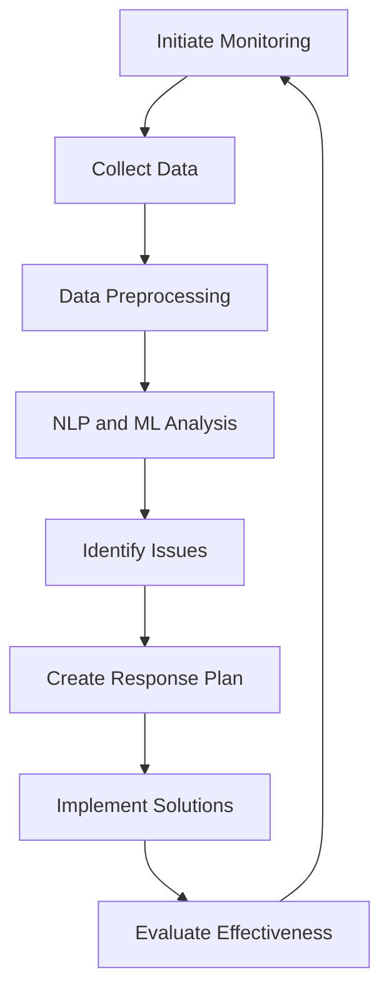

                 

### Chapter 1: The Importance of Reputation Management in the AI Era

#### 1.1 What is AI-driven Reputation Management?

AI-driven reputation management refers to the use of artificial intelligence technologies, particularly machine learning and natural language processing, to monitor, analyze, and respond to public opinions and sentiments about a brand, organization, or individual. The primary goal is to maintain and enhance the reputation of the entity by identifying and addressing potential issues before they escalate into crises.

**Definition and Key Concepts:**

- **Reputation Management:** The practice of influencing and maintaining the perception of a brand or entity in the public eye.
- **Artificial Intelligence (AI):** A branch of computer science focused on creating intelligent machines capable of performing tasks that typically require human intelligence.
- **Machine Learning (ML):** A subset of AI where machines learn from data, identify patterns, and make decisions with minimal human intervention.
- **Natural Language Processing (NLP):** A field of AI that focuses on the interaction between computers and human languages.

**Mermaid Flowchart of the AI-driven Reputation Management Process:**

To illustrate the AI-driven reputation management process, we can use a Mermaid flowchart that depicts the key stages involved:

**Example:**

Imagine a large e-commerce platform wanting to monitor its reputation in the market. Using AI-driven reputation management, the platform would:

1. **Initiate Monitoring:** Set up tools to track mentions and sentiments on social media, forums, and review sites.
2. **Collect Data:** Gather all relevant data points, including text, images, and videos.
3. **Data Preprocessing:** Clean and prepare the data for analysis by removing noise, standardizing text, and extracting key features.
4. **NLP and ML Analysis:** Use NLP to understand the context and sentiment of each data point, and ML algorithms to identify patterns and trends.
5. **Identify Issues:** Detect potential issues such as negative reviews, customer complaints, or inappropriate content.
6. **Create Response Plan:** Develop strategies to address each identified issue, which may include public apologies, customer support interventions, or product improvements.
7. **Implement Solutions:** Execute the response plan, ensuring timely and effective communication with stakeholders.
8. **Evaluate Effectiveness:** Monitor the impact of the response plan and adjust as needed.

By continuously iterating through this process, the e-commerce platform can maintain a positive reputation and build trust with its customers.

In summary, AI-driven reputation management is a powerful tool that enables entities to proactively manage their public image by leveraging advanced technologies to analyze and respond to public opinion. This approach not only helps in identifying and mitigating potential risks but also enhances the overall reputation and trustworthiness of the entity.

